# יחידה 1.2 – זיהוי ההיתר והניצבים במשולש ישר זווית

---

## רמה 1: בניית ביטחון (8 תרגילים)

1. נתון משולש ABC עם זווית ישרה בקודקוד C.
מהו שם ההיתר?

2. נתון משולש ישר זווית עם צלעות:
$$3, \quad 4, \quad 5$$
איזו צלע היא ההיתר?

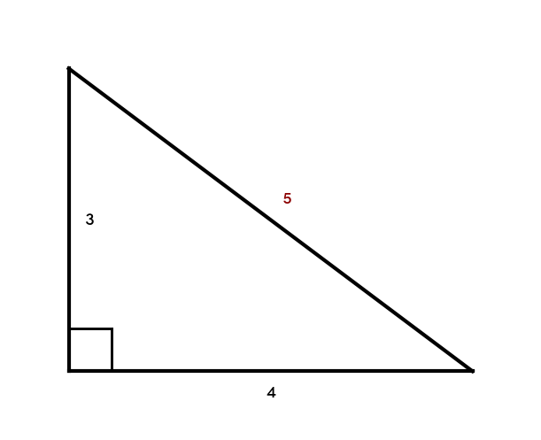

3. נתון משולש DEF עם זווית ישרה בקודקוד E.
איזו צלע נמצאת מול הזווית הישרה?

4. נתון משולש ישר זווית עם צלעות:
$$5, \quad 12, \quad 13$$
איזו צלע היא ההיתר?

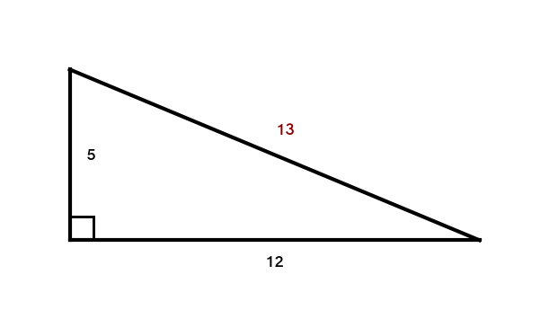

5. נתון משולש PQR עם זווית ישרה בקודקוד Q.
ההיתר הוא...

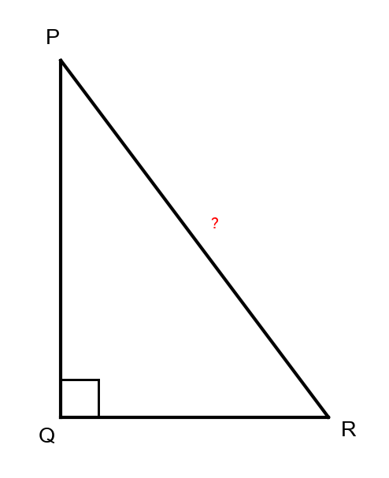

6. נכון או לא נכון: בכל משולש ישר זווית, ההיתר הוא הצלע הארוכה ביותר. הסבירו.

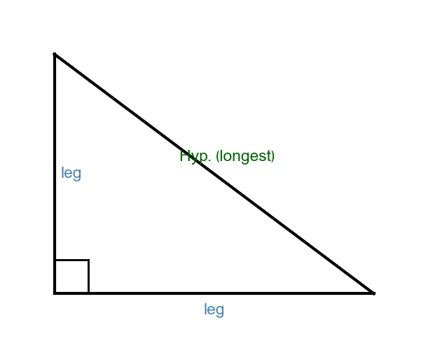

7. נתון משולש ישר זווית עם צלעות:
$$8, \quad 15, \quad 17$$
זהו את ההיתר ואת שני הניצבים.

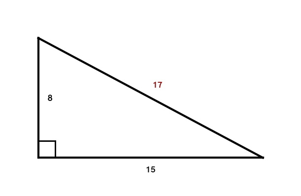

8. מול איזו זווית נמצא ההיתר תמיד במשולש ישר זווית?

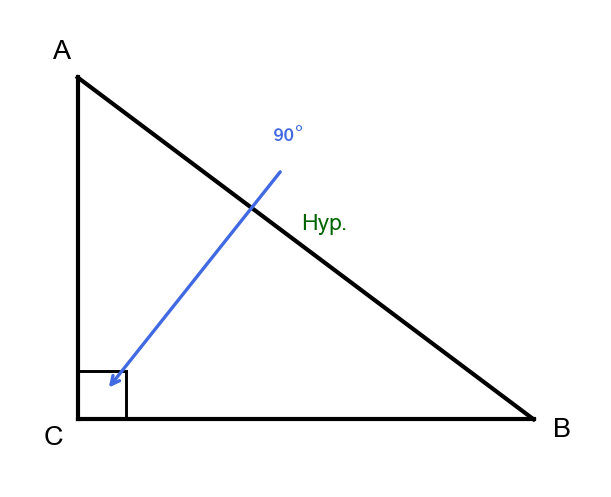

---

## רמה 2: תרגול שוטף ומשולב (8 תרגילים)

9. נתון משולש ABC עם זווית ישרה בקודקוד C.
$$AB = 10, \quad BC = 6$$
מצאו את AC. לאחר מכן זהו: מהו ההיתר ומהם הניצבים?

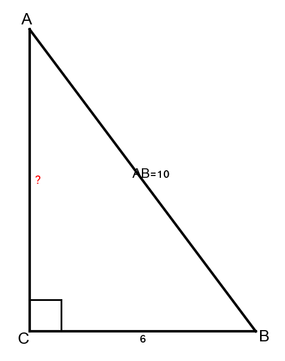

10. נתון משולש עם שלוש צלעות:
$$9, \quad 12, \quad 15$$
האם זהו משולש ישר זווית? אם כן, איזו צלע היא ההיתר?

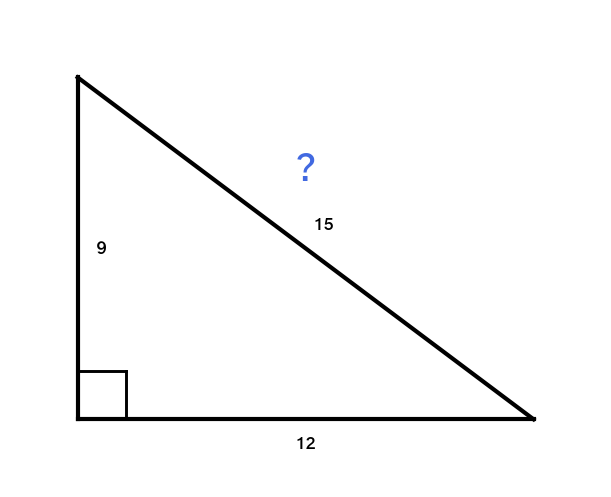

11. נתון משולש MNP עם זווית ישרה בקודקוד N.
$$MN = 7, \quad NP = 24$$
מצאו את MP. מהו ההיתר במשולש זה?

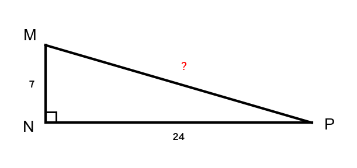

12. נתון משולש ישר זווית עם שני ניצבים:
$$a = 10, \quad b = 10\sqrt{3}$$
מצאו את אורך ההיתר.

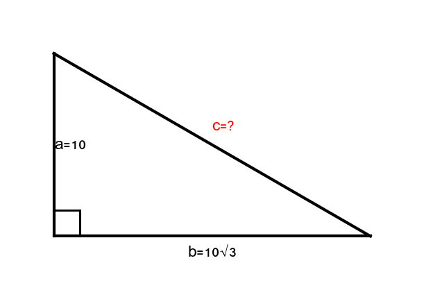

13. בנתונים הבאים:
$$XZ^2 = XY^2 + YZ^2$$
זהו: מהו ההיתר, ובאיזה קודקוד נמצאת הזווית הישרה?

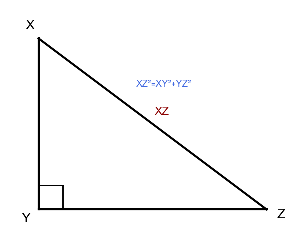

14. במשולש ישר זווית, ההיתר הוא:
$$c = 25$$
אחד הניצבים הוא:
$$a = 15$$
מצאו את הניצב השני.

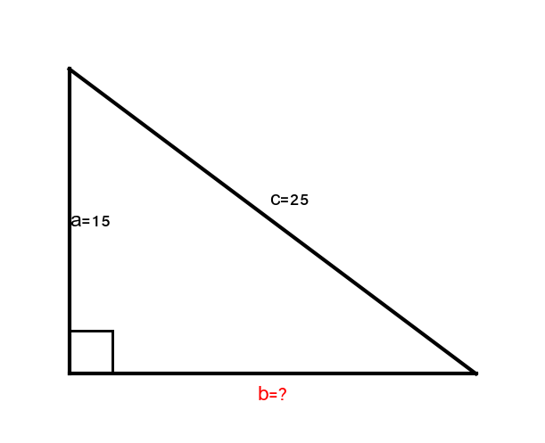

15. נתון משולש ABC עם זווית ישרה בקודקוד B.
אילו שתי צלעות הן הניצבים? מה תפקידה של כל אחת?

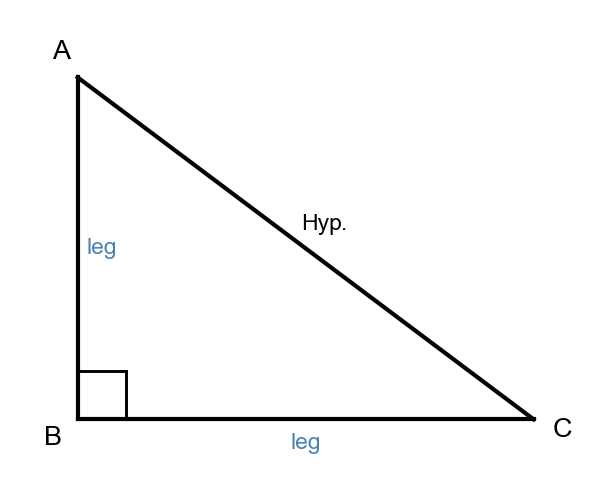

16. נתון משולש ישר זווית עם שני ניצבים:
$$a = 20, \quad b = 21$$
מצאו את ההיתר.

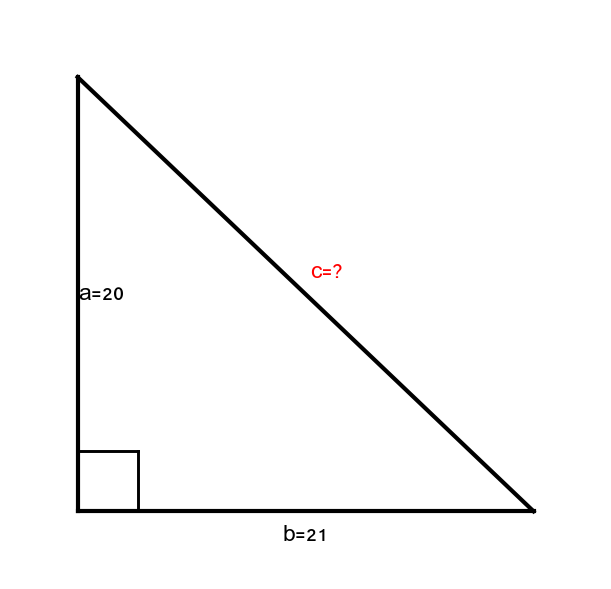

---

## רמה 3: רמת בחינת מה"ט (4 תרגילים)

17. מקור: רמת מה"ט

נתון מלבן ABCD. אורכו הוא 10 ס"מ ורוחבו הוא 24 ס"מ. האלכסון BD חוצה את המלבן לשני משולשים. בכל אחד מהמשולשים, זהו מהו ההיתר, ומצאו את אורכו.

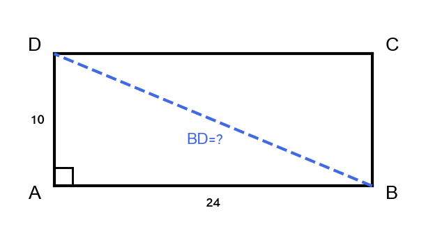

---

18. מקור: רמת מה"ט

חוט באורך 15 מטרים מחובר מראש עמוד אנכי לנקודה על הקרקע הנמצאת 9 מטרים מבסיס העמוד. הזווית הישרה נמצאת בבסיס העמוד. זהו: איזה מהמרחקים הוא ההיתר? חשבו את גובה העמוד.

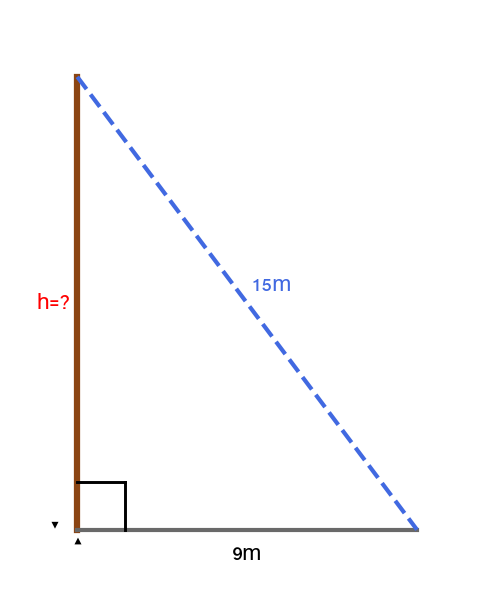

---

19. מקור: רמת מה"ט

נתון משולש XYZ עם שלוש צלעות:
$$XY = 41, \quad XZ = 40, \quad YZ = 9$$
האם זהו משולש ישר זווית? אם כן, זהו את ההיתר ואת שני הניצבים, ובאיזה קודקוד נמצאת הזווית הישרה.

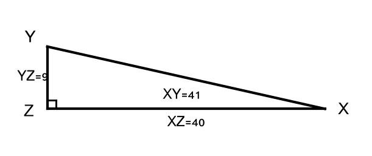

---

20. מקור: רמת מה"ט

במשולש ישר זווית, ההיתר הוא פי 3 מהניצב הקצר. אורך הניצב הקצר הוא 8 ס"מ. מצאו את אורך הניצב הארוך.

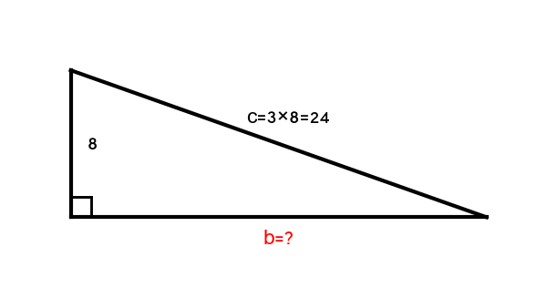

---

תשובות סופיות

1. ההיתר הוא AB

2. ההיתר הוא 5 (הצלע הארוכה ביותר)

3. הצלע DF נמצאת מול הזווית הישרה — היא ההיתר

4. ההיתר הוא 13

5. ההיתר הוא PR

6. הוא תמיד הצלע הארוכה ביותר

7. ההיתר
$17$
הניצבים
$8$
ו-
$15$

8.
$8$

9.
$ AC=\sqrt{10^{2}-6^{2}}=8$
היתר
$ AB$
ניצבים
$ BC,\;AC$

10.
$25$
היתר
$ MP$

11.
$ MP=\sqrt{7^{2}+24^{2}}=25$
היתר
$ MP$

12.
$ c = 20$

13. ההיתר הוא XZ; הזווית הישרה בקודקוד Y

14.
$ b = 20$

15. הניצבים הם AB ו-BC; שתיהן הצלעות הנפגשות בזווית הישרה

16.
$ c = 29$

17.
$26$
סנטימטרים לאורך האלכסון.

18.
$12$
מטרים לגובה העמוד.

19.
יש משולש ישר זווית; הזווית הישרה נמצאת בקודקוד
$ Z$
ההיתר
$ XY$
שני הניצבים הם
$ XZ $
ו-
$ YZ$

20.
$16\sqrt{2}$
כלומר ערך קרוב
$\approx 22{,}6$
סנטימטרים.

