# יחידה 1.3 – מיקומים יחסיים: ניצב מול וניצב ליד

> **הגדרה:** בכל משולש ישר זווית, עבור זווית חדה נתונה:
> - **ניצב מול** — הניצב הנמצא מול הזווית (לא נוגע בה)
> - **ניצב ליד** — הניצב הנמצא לצד הזווית (נוגע בה, אך אינו ההיתר)
> - **ההיתר** — תמיד הצלע מול הזווית הישרה

---

## רמה 1: בניית ביטחון (8 תרגילים)

1. נתון משולש ABC עם זווית ישרה בקודקוד C.
עבור הזווית בקודקוד A, מהו הניצב מול?

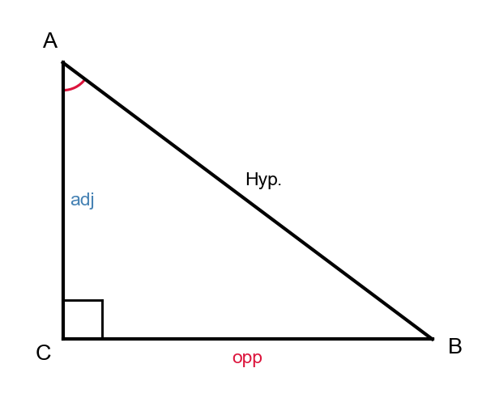

2. נתון משולש ABC עם זווית ישרה בקודקוד C.
עבור הזווית בקודקוד A, מהו הניצב ליד?

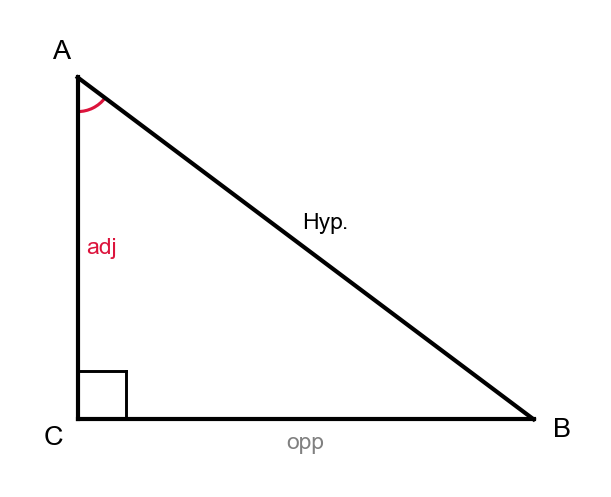

3. נתון משולש ABC עם זווית ישרה בקודקוד C.
עבור הזווית בקודקוד B, מהו הניצב מול?

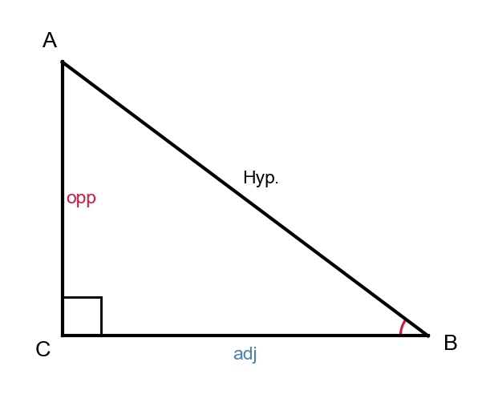

4. נתון משולש ABC עם זווית ישרה בקודקוד C.
עבור הזווית בקודקוד B, מהו הניצב ליד?

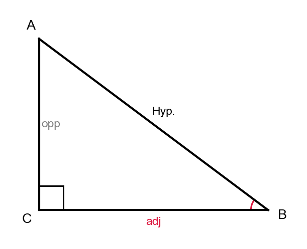

5. נתון משולש PQR עם זווית ישרה בקודקוד R.
עבור הזווית בקודקוד P, מהו הניצב מול?

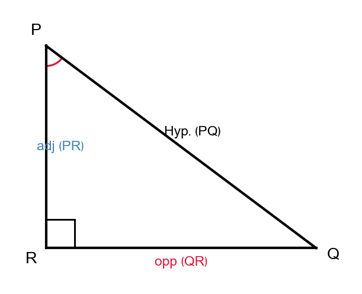

6. נתון משולש PQR עם זווית ישרה בקודקוד R.
עבור הזווית בקודקוד P, מהו הניצב ליד?

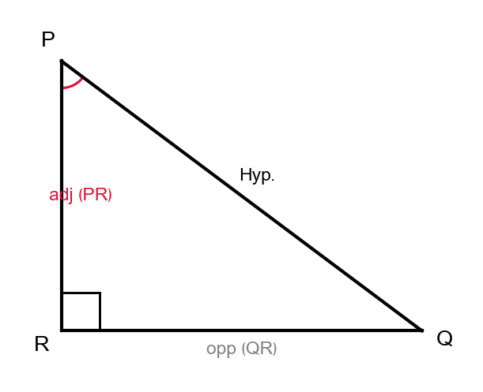

7. נתון משולש PQR עם זווית ישרה בקודקוד R.
עבור הזווית בקודקוד Q, מהו הניצב מול?

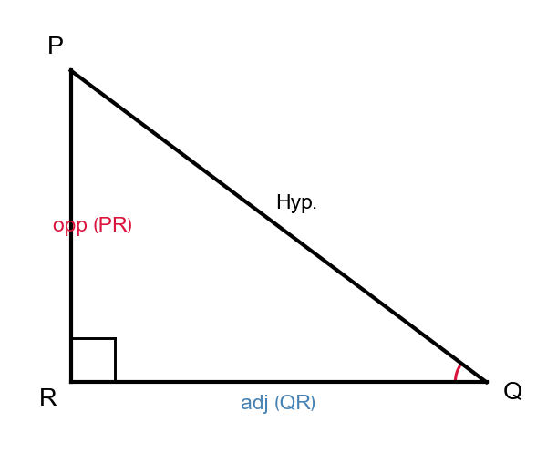

8. נתון משולש PQR עם זווית ישרה בקודקוד R.
עבור הזווית בקודקוד Q, מהו הניצב ליד?

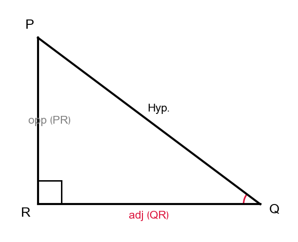

---

## רמה 2: תרגול שוטף ומשולב (8 תרגילים)

9. נתון משולש ABC עם זווית ישרה בקודקוד B.
$$AB = 6, \quad BC = 8, \quad AC = 10$$
עבור הזווית בקודקוד A, זהו: מהו ההיתר, הניצב מול, והניצב ליד? ציינו גם את הערך של כל אחד.

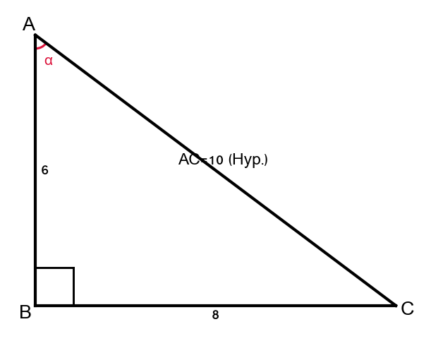

10. השתמשו במשולש מתרגיל 9.
עבור הזווית בקודקוד C, זהו: מהו ההיתר, הניצב מול, והניצב ליד? ציינו גם את הערך של כל אחד.

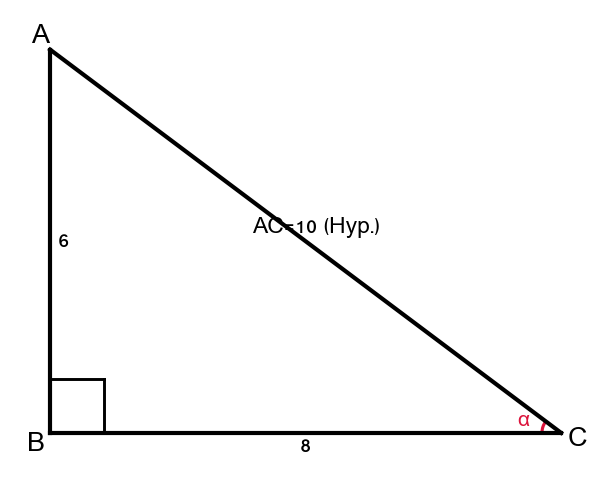

11. נתון משולש DEF עם זווית ישרה בקודקוד F.
$$DF = 3, \quad EF = 4, \quad DE = 5$$
עבור הזווית בקודקוד D, ציינו את הניצב מול ואת הניצב ליד עם ערכיהם.

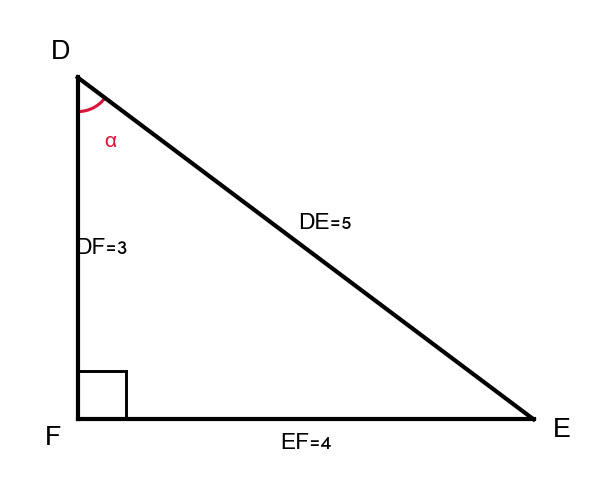

12. השתמשו במשולש מתרגיל 11.
עבור הזווית בקודקוד E, ציינו את הניצב מול ואת הניצב ליד עם ערכיהם.

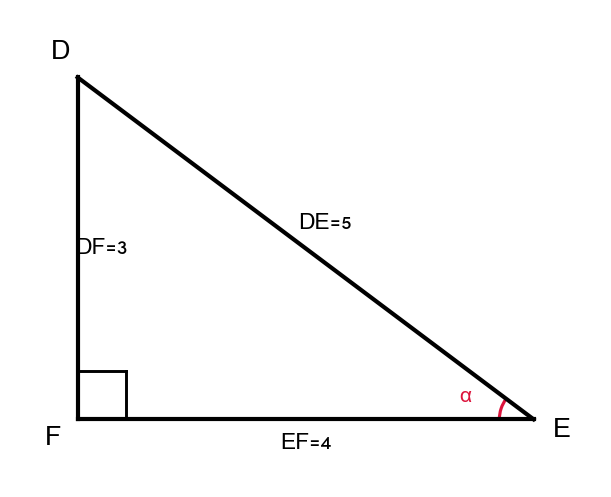

13. עבור זווית α במשולש ישר זווית, הניצב מול שווה 7 והניצב ליד שווה 24.
מצאו את אורך ההיתר.

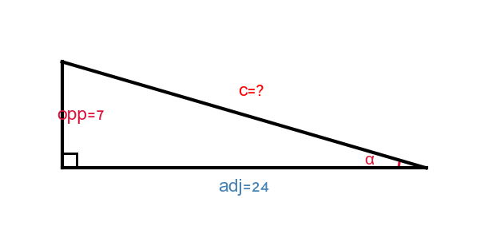

14. נתון משולש PQR עם זווית ישרה בקודקוד Q.
$$PQ = 15, \quad PR = 17$$
עבור הזווית בקודקוד P, הניצב ליד הוא PQ ואורכו 15, וההיתר הוא PR ואורכו 17.
מצאו את הניצב מול (QR).

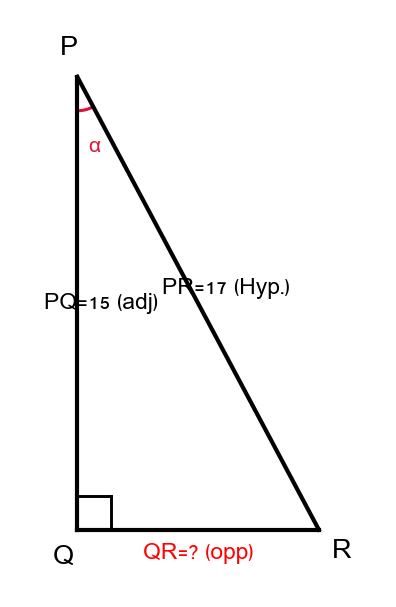

15. עבור זווית α במשולש ישר זווית, הניצב מול הוא פי 3 מהניצב ליד. אורך הניצב ליד הוא 4.
מצאו את אורך ההיתר.

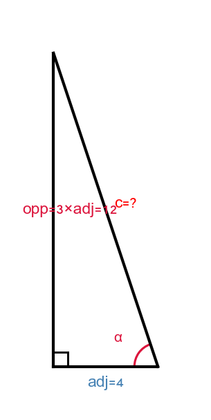

16. נתון משולש ABC עם זווית ישרה בקודקוד C.
$$AC = 5, \quad AB = 13$$
עבור הזווית בקודקוד A, הניצב ליד הוא AC ואורכו 5.
מצאו את הניצב מול (BC).

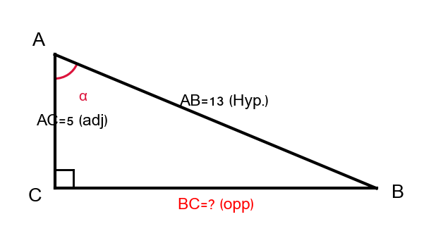

---

## רמה 3: רמת בחינת מה"ט (4 תרגילים)

17. מקור: רמת מה"ט

רמפה (מישור משופע) באורך 5 מטרים מחברת בין הרצפה לפלטפורמה. המרחק האופקי בין תחתית הרמפה לקצה הפלטפורמה הוא 3 מטרים. הזווית הישרה נמצאת בין הפלטפורמה לקיר.

עבור הזווית שבין הרמפה לרצפה:
א. זהו מהו הניצב מול ומהו הניצב ליד.
ב. חשבו את גובה הפלטפורמה (הניצב מול).

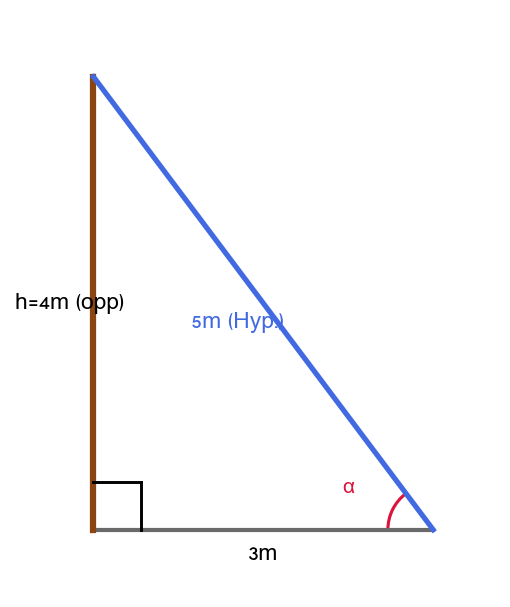

---

18. מקור: רמת מה"ט

נתון משולש XYZ עם זווית ישרה בקודקוד Z.
$$XY = 25, \quad XZ = 20$$
א. מצאו את YZ.
ב. עבור הזווית בקודקוד X, ציינו בבירור: מהו ההיתר, הניצב מול, והניצב ליד — כולל ערכים מספריים.

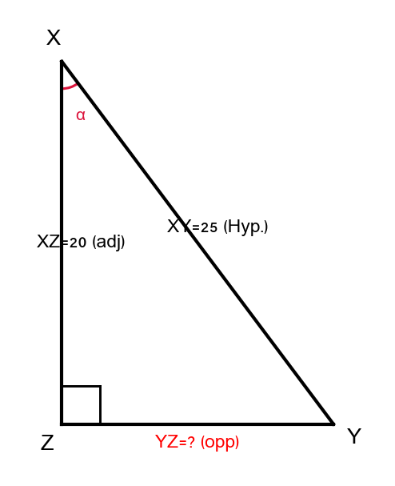

---

19. מקור: רמת מה"ט

עמוד אנכי עומד על קרקע ישרה. חוט מתיחה באורך 10 מטרים מחובר מראש העמוד לנקודה על הקרקע הנמצאת 6 מטרים מבסיס העמוד.

עבור הזווית שבין החוט לקרקע:
א. זהו מהו הניצב מול ומהו הניצב ליד (עם ערכים מספריים).
ב. חשבו את גובה העמוד (הניצב מול).

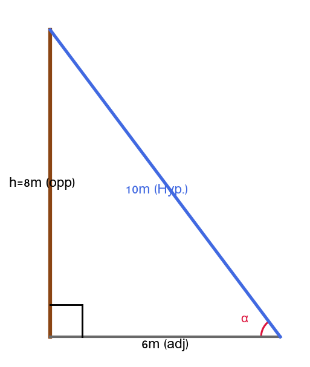

---

20. מקור: רמת מה"ט

נתון משולש ABC עם זווית ישרה בקודקוד C.
$$AB = 20, \quad BC = 10$$
עבור הזווית בקודקוד A:
א. מצאו את AC (הניצב ליד).
ב. ציינו בבירור: מהו ההיתר, הניצב מול, והניצב ליד — כולל ערכים מספריים.

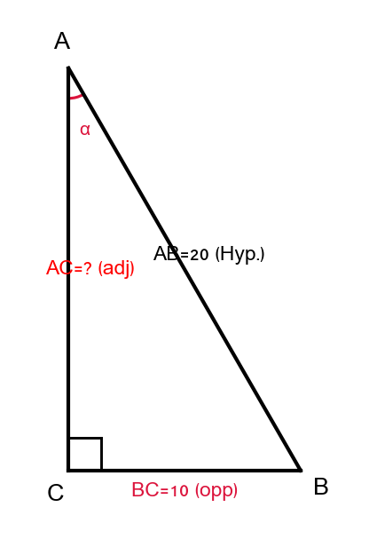

---

תשובות סופיות

1. הניצב מול הוא BC

2. הניצב ליד הוא AC

3. הניצב מול הוא AC

4. הניצב ליד הוא BC

5. הניצב מול הוא QR

6. הניצב ליד הוא PR

7. הניצב מול הוא PR

8. הניצב ליד הוא QR

9. ההיתר הוא
$AC=10$
הניצב מול הוא
$BC=8$
הניצב ליד הוא
$AB=6$

10. ההיתר הוא
$AC=10$
הניצב מול הוא
$AB=6$
הניצב ליד הוא
$BC=8$

11. הניצב מול הוא
$EF=4$
הניצב ליד הוא
$DF=3$

12. הניצב מול הוא
$DF=3$
הניצב ליד הוא
$EF=4$

13. $25$

14. $8$

15. $4\sqrt{10}$

16. $12$

17.
א.
הניצב מול הוא גובה הפלטפורמה
הניצב ליד הוא המרחק האופקי
ב.
$4$
מטרים

18.
א.
$15$
ב.
ההיתר הוא
$XY=25$
הניצב מול הוא
$YZ=15$
הניצב ליד הוא
$XZ=20$

19.
א.
הניצב מול הוא גובה העמוד
הניצב ליד הוא המרחק מבסיס העמוד
$6$
מטרים
ב.
$8$
מטרים

20.
א.
$10\sqrt{3}$
ב.
ההיתר הוא
$AB=20$
הניצב מול הוא
$BC=10$
הניצב ליד הוא
$AC=10\sqrt{3}$

