# יחידה 4.2 – תרגול מעורב: צלע או זווית?

## סיכום אסטרטגיית הפתרון

**שאל תמיד:** מה דרוש – **צלע** או **זווית**?

| מה ידוע | מה דרוש | כלי |
|---------|---------|-----|
| זווית + צלע | צלע אחרת | $\sin$, $\cos$, $\tan$ (כפל או חילוק) |
| שתי צלעות | זווית | $\sin^{-1}$, $\cos^{-1}$, $\tan^{-1}$ |

**סדר עבודה מומלץ:**
1. סמן את הצלע הנעלמת
$x$
(או את הזווית הנעלמת
$\alpha$
).

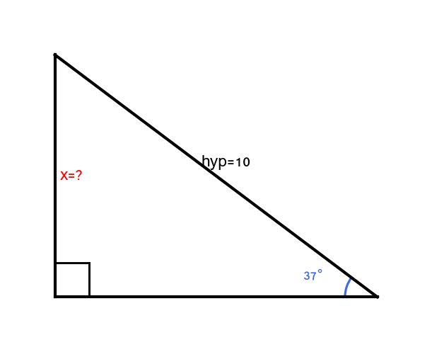

2. זהה את שתי הצלעות / צלע וזווית המעורבות.

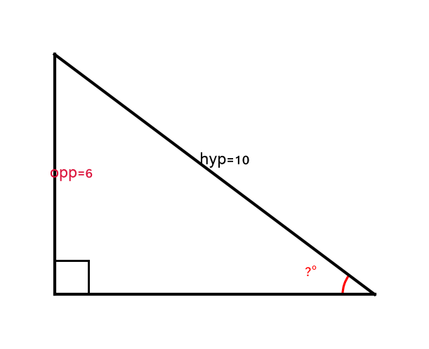

3. בחר את הפונקציה.

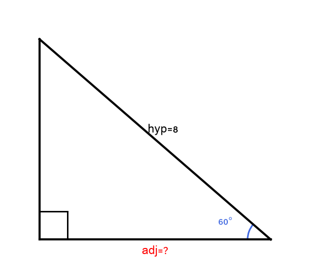

4. הצב וחשב.

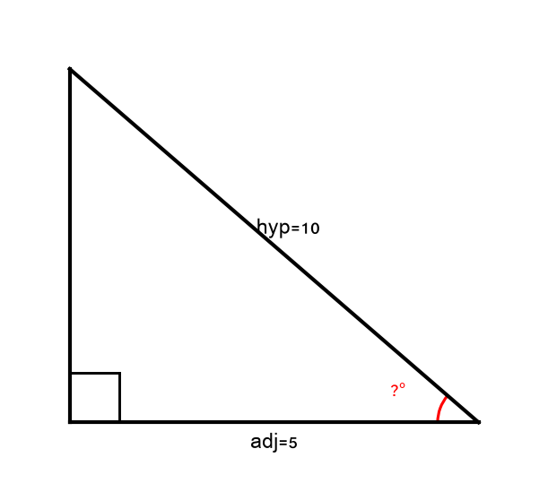

5. אמת בהיגיון (הניצב קצר מהיתר, שתי הזוויות החדות מסתכמות ל-
$90°$
).

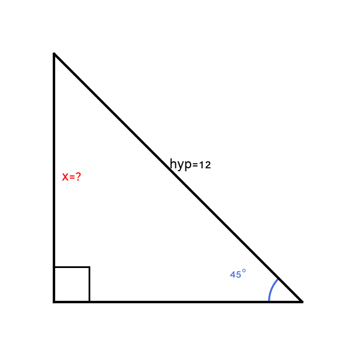

---

## רמה 1: בניית ביטחון (8 תרגילים)

**בכל תרגיל: קבע תחילה האם מחפשים צלע או זווית, ואז פתור.**

1. במשולש ישר זווית, הזווית הנחקרת היא
$37°$
וההיתר הוא
$10$
ס"מ.
חשבו את הניצב מול הזווית.

2. במשולש ישר זווית, הניצב מול הזווית הוא
$6$
ס"מ
וההיתר הוא
$10$
ס"מ.
מצאו את הזווית הנחקרת.

3. במשולש ישר זווית, הזווית הנחקרת היא
$60°$
וההיתר הוא
$8$
ס"מ.
חשבו את הניצב הצמוד לזווית.

4. במשולש ישר זווית, הניצב הצמוד לזווית הוא
$5$
ס"מ
וההיתר הוא
$10$
ס"מ.
מצאו את הזווית הנחקרת.

5. במשולש ישר זווית, הזווית הנחקרת היא
$45°$
וההיתר הוא
$12$
ס"מ.
חשבו את הניצב מול הזווית.

6. במשולש ישר זווית, הניצב מול הזווית הוא
$5$
ס"מ
והניצב הצמוד לזווית הוא
$5$
ס"מ.
מצאו את הזווית הנחקרת.

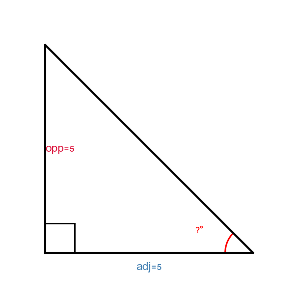

7. במשולש ישר זווית, הזווית הנחקרת היא
$53°$
והניצב מול הזווית הוא
$8$
ס"מ.
חשבו את ההיתר.

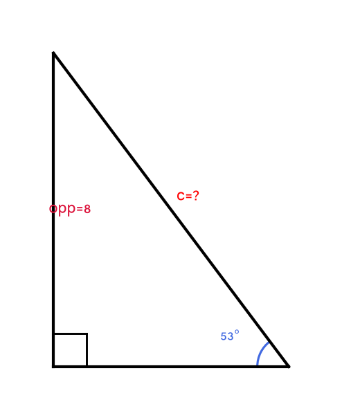

8. במשולש ישר זווית, הניצב מול הזווית הוא
$8$
ס"מ
והניצב הצמוד לזווית הוא
$6$
ס"מ.
מצאו את הזווית הנחקרת (השתמש ב-
$\tan^{-1}$
).

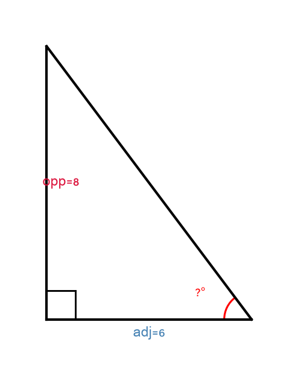

---

## רמה 2: תרגול שוטף ומשולב (8 תרגילים)

9. סולם באורך
$13$
מ' נשען על קיר. בסיס הסולם רחוק
$5$
מ' מן הקיר.
א. חשבו את הזווית שבין הסולם לקרקע.
ב. חשבו את גובה הסולם על הקיר.

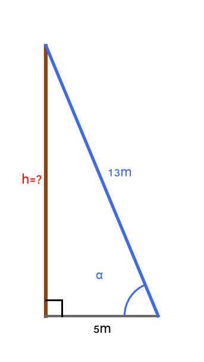

10. בניין גבוה
$24$
מ'. מסייר עומד במרחק
$18$
מ' מבסיס הבניין.
א. חשבו את זווית ההגבהה לראש הבניין.
ב. חשבו את המרחק הישיר (ההיתר) מהמסייר לראש הבניין.

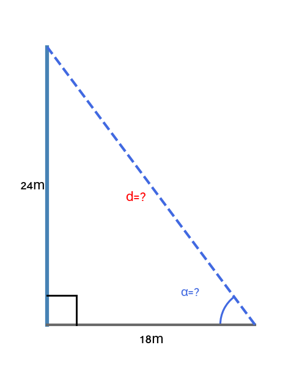

11. במשולש ישר זווית
$\triangle PQR$
כאשר
$\angle R = 90°$
:
$PQ = 20$
ס"מ,
$\angle P = 37°$
.

א. חשבו את
$QR$
(מול
$\angle P$
).
ב. חשבו את
$PR$
(צמוד ל-
$\angle P$
).
ג. חשבו את
$\angle Q$
.

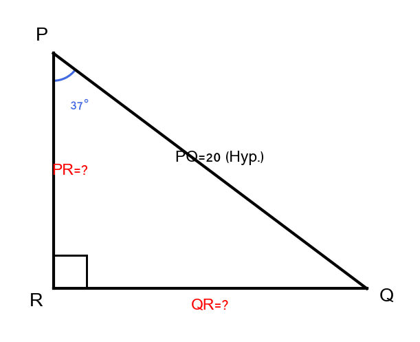

12. במשולש ישר זווית, הניצב מול הזווית הוא
$15$
ס"מ
והניצב הצמוד לזווית הוא
$20$
ס"מ.

א. מצאו את הזווית הנחקרת (השתמש ב-
$\tan^{-1}$
).
ב. חשבו את ההיתר (השתמש במשפט פיתגורס).
ג. אמת את תשובתך לסעיף א' על ידי שימוש בסעיף ב'.

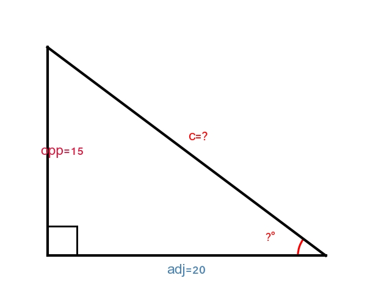

13. רמפה גישה ל-מחסן. הרמפה ארוכה
$5$
מ' וזוויתה עם הקרקע היא
$30°$.

א. חשבו את גובה הכניסה למחסן.
ב. חשבו את האורך האופקי של הרמפה.
ג. אם מעוניינים להגיע לאותו גובה עם רמפה בזווית
$20°$,
מהו האורך הדרוש? (
$\sin(20°) \approx 0.342$
)

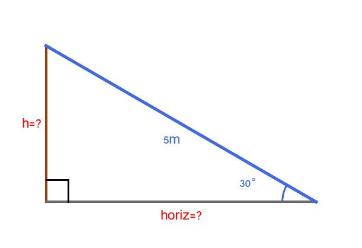

14. מגדל תצפית ניצב על גבעה. גובה הגבעה
$10$
מ' וגובה המגדל
$15$
מ'. מסייר עומד
$20$
מ' מבסיס הגבעה.

א. חשבו את זווית ההגבהה לבסיס המגדל (ראש הגבעה).
ב. חשבו את זווית ההגבהה לראש המגדל.
ג. מה ההפרש בין שתי הזוויות?

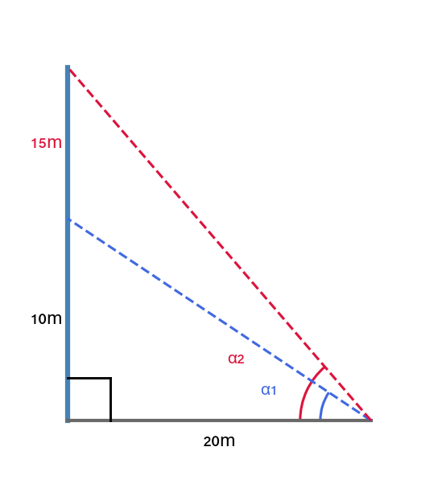

15. במשולש ישר זווית
$\triangle ABC$
כאשר
$\angle C = 90°$
:
$AC = 9$
ס"מ,
$BC = 12$
ס"מ.

א. חשבו את
$AB$
(ההיתר).
ב. חשבו את
$\angle A$
.
ג. חשבו את
$\angle B$
.
ד. אמת:
$\angle A + \angle B = 90°$
.

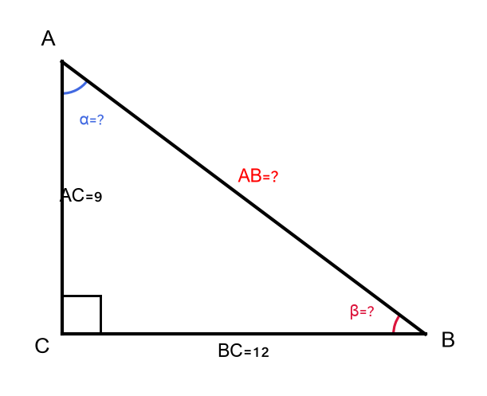

16. בגן ילדים מתקן מטוטלת: חוט באורך
$4$
מ' תלוי מקורה בגובה
$5$
מ'. בנקודת הקצה של החוט יושב ילד.

א. אם המטוטלת סוטה כך שהילד נמצא במרחק אופקי של
$2$
מ' מנקודת ההשעיה, חשבו את זווית ההסטה (זווית החוט עם הקורה האנכית).
ב. מהו גובה הילד מהקרקע כאשר החוט בסטייה זו?

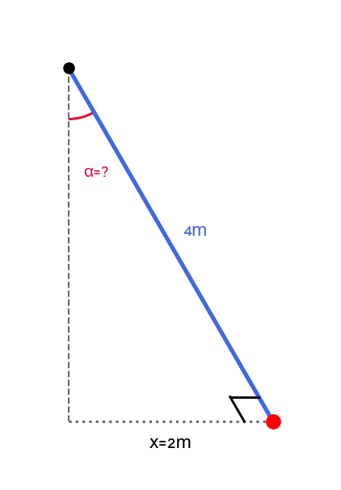

---

## רמה 3: רמת בחינת מה"ט (4 תרגילים)

17. בגן משחקים הותקנה מגלשה. הזווית
$\angle ACD$
היא
$46°$
והזווית
$\angle ABD$
היא
$63°$.
אורך הסולם (צלע
$AC$
) הוא
$2.5$
מטרים, כאשר
$D$
הוא בסיס הסולם ובסיס המגלשה (נקודה על הקרקע),
$B$
הוא ראש המגלשה (= ראש הסולם =
$A$
).

($\sin(46°) \approx 0.719$, $\cos(46°) \approx 0.695$, $\sin(63°) \approx 0.891$, $\cos(63°) \approx 0.454$)

א. חשבו את גובה הסולם
$AD$
(ניצב מול
$46°$
ב-
$\triangle ACD$
).
ב. חשבו את אורך המגלשה
$AB$
(ניצב מול
$63°$
ב-
$\triangle ABD$
; הגובה
$AD$
ידוע).
ג. חשבו את אורך קרקע הבסיס
$BD$
(ניצב צמוד ב-
$\triangle ABD$
).

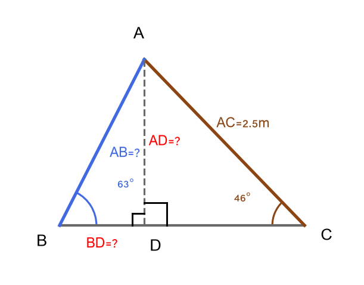

18. במשולש ישר זווית
$\triangle ABC$
(כאשר
$\angle C = 90°$
), הועבר תיכון
$BD$
אל הניצב
$AC$
.
נתון:
$BD = 14.3$
מ',
$\angle CDB = 68°$
.

($\sin(68°) \approx 0.927$, $\cos(68°) \approx 0.375$, $\tan(68°) \approx 2.475$)

א. חשבו את
$BC$
(מול
$\angle CDB$
ב-
$\triangle BCD$
;
$BD$
הוא ההיתר).
ב. חשבו את
$CD$
(צמוד ל-
$\angle CDB$
ב-
$\triangle BCD$
).
ג. מכיוון ש-
$D$
הוא אמצע
$AC$
, חשבו את
$AC$
המלא.
ד. חשבו את
$AB$
(ההיתר של
$\triangle ABC$
).
ה. חשבו את
$\angle A$
ואת
$\angle B$
ב-
$\triangle ABC$
.

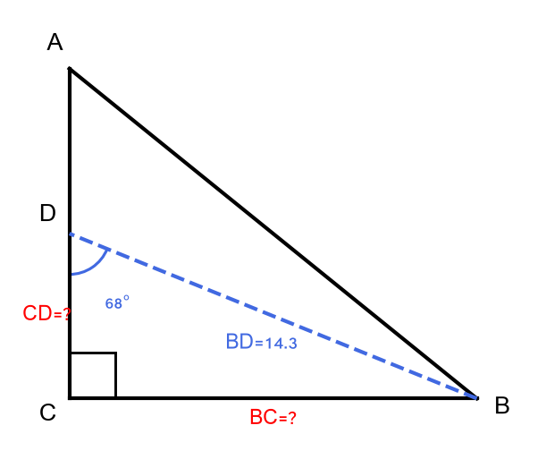

19. צוות בנייה מתכנן לבנות גשר מעל תעלה. הגשר יוצב בזווית
$37°$
מהאופקי. אורך הגשר הוא
$15$
מ'. בצד השני של התעלה יש קיר אנכי שגובהו
$7$
מ' מעל הקצה התחתון של הגשר.

א. חשבו את הגובה שהגשר מכסה (ניצב מול הזווית).
ב. חשבו את רוחב התעלה (ניצב צמוד לזווית – האורך האופקי).
ג. האם ראש הגשר (הקצה הגבוה) מגיע מעל ראש הקיר? הסבר בחישוב.
ד. חשבו את הזווית הנוצרת בין הגשר לבין ראש הקיר (זווית ההגבהה מראש הקיר לראש הגשר).

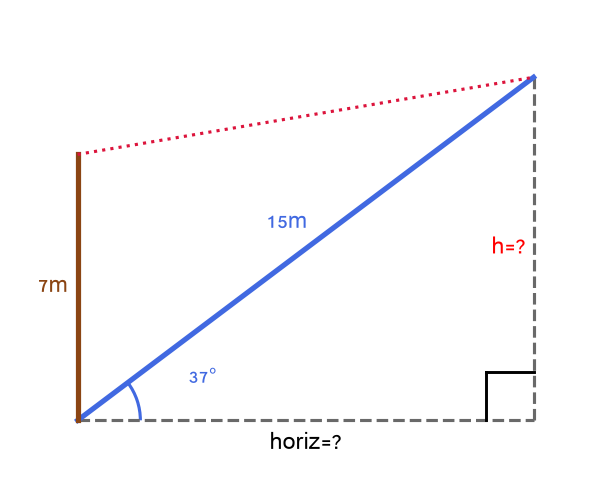

20. מגדלור ניצב בקצה ירכתי. ספינה מתקרבת ישר לחוף. ב-נקודה
$A$
זווית ההגבהה לראש המגדלור היא
$12°$.
לאחר שהספינה התקדמה
$300$
מ' לכיוון החוף, ב-נקודה
$B$
זווית ההגבהה לראש המגדלור היא
$20°$.

($\tan(12°) \approx 0.213$, $\tan(20°) \approx 0.364$)

נסמן את גובה המגדלור ב-
$h$
ואת המרחק מנקודה
$B$
לבסיס המגדלור ב-
$d$
.

א. כתוב שתי משוואות: אחת עבור נקודה
$B$
ואחת עבור נקודה
$A$
(הביע הכול ב-
$h$
וב-
$d$
).
ב. פתור את המערכת ומצא את
$h$
(גובה המגדלור) ואת
$d$
(מרחק
$B$
מהחוף).
ג. חשב את המרחק מנקודה
$A$
לבסיס המגדלור.

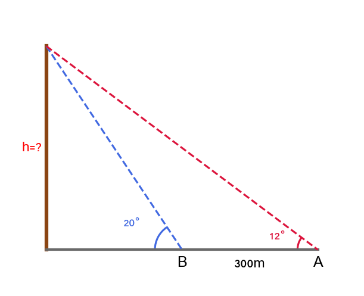

---

תשובות סופיות

1. $10 \cdot \sin(37°) \approx 10 \cdot 0.602 \approx 6.02$ס"מ (צלע)
2. $\sin^{-1}(0.6) \approx 36.87°$(זווית)
3. 4$ס"מ (צלע)
4. 60°$(זווית)
5. $6\sqrt{2} \approx 8.49$ס"מ (צלע)
6. 45°$(זווית)
7. $\dfrac{8}{\sin(53°)} \approx \dfrac{8}{0.799} \approx 10.01 \approx 10$ס"מ (צלע)
8. $\tan^{-1}\!\left(\dfrac{4}{3}\right) \approx 53.13°$(זווית)
9. א. $\cos^{-1}\!\left(\dfrac{5}{13}\right) \approx 67.38°$&nbsp;&nbsp; ב. $12$מ'
10. א. $\tan^{-1}\!\left(\dfrac{4}{3}\right) \approx 53.13°$&nbsp;&nbsp; ב. $30$מ'
11. א. $20 \cdot \sin(37°) \approx 12.04$ס"מ &nbsp;&nbsp; ב.$20 \cdot \cos(37°) \approx 15.97 \approx 16$ס"מ &nbsp;&nbsp; ג.$53°$
12. א. $\tan^{-1}(0.75) \approx 36.87°$&nbsp;&nbsp; ב. $25$ס"מ &nbsp;&nbsp; ג. $0.6$✓
13. א. $2.5$מ' &nbsp;&nbsp; ב. $\dfrac{5\sqrt{3}}{2} \approx 4.33$מ' &nbsp;&nbsp; ג. $\dfrac{2.5}{\sin(20°)} \approx \dfrac{2.5}{0.342} \approx 7.31$מ'
14. א. $\tan^{-1}(0.5) \approx 26.57°$&nbsp;&nbsp; ב.$\tan^{-1}(1.25) \approx 51.34°$&nbsp;&nbsp; ג.$51.34° - 26.57° \approx 24.77°$
15. א. $15$ס"מ &nbsp;&nbsp; ב. $\tan^{-1}\!\left(\dfrac{12}{9}\right) \approx 53.13°$&nbsp;&nbsp; ג. $\tan^{-1}\!\left(\dfrac{9}{12}\right) \approx 36.87°$&nbsp;&nbsp; ד. $90°$✓
16. א. 30°$ &nbsp;&nbsp; ב. 1.54$ מ'
17. א. $2.5 \cdot \sin(46°) \approx 2.5 \cdot 0.719 \approx 1.80$מ' &nbsp;&nbsp; ב. $AD \div \sin(63°) \approx 1.80 \div 0.891 \approx 2.02$מ' &nbsp;&nbsp; ג. $AD \div \tan(63°) \approx 1.80 \div 1.963 \approx 0.92$מ'
18. א. $BC = 14.3 \cdot \sin(68°) \approx 14.3 \cdot 0.927 \approx 13.26$מ' &nbsp;&nbsp; ב.$CD = 14.3 \cdot \cos(68°) \approx 14.3 \cdot 0.375 \approx 5.36$מ' &nbsp;&nbsp; ג.$AC = 2 \cdot CD \approx 10.73$מ' &nbsp;&nbsp; ד.$AB = \sqrt{BC^2 + AC^2} \approx \sqrt{13.26^2 + 10.73^2} \approx \sqrt{175.83 + 115.13} \approx \sqrt{290.96} \approx 17.06$מ' &nbsp;&nbsp; ה.$\angle A = \tan^{-1}\!\left(\dfrac{BC}{AC}\right) \approx \tan^{-1}(1.235) \approx 51°$;$\angle B \approx 39°$
19. א. 15 \cdot \sin(37°) \approx 15 \cdot 0.602 \approx 9.03$מ' &nbsp;&nbsp; ב.$15 \cdot \cos(37°) \approx 15 \cdot 0.799 \approx 11.98 \approx 12$מ' &nbsp;&nbsp; ג. $גובה הגשר$\approx 9.03$מ' > גובה הקיר$7$מ' – כן, ראש הגשר מעל ראש הקיר ✓ &nbsp;&nbsp; ד.$12$מ';$\tan^{-1}\!\left(\dfrac{2.03}{12}\right) \approx 9.6°$
20. א. 0.213(d+300)$ &nbsp;&nbsp; ב. 63.9$→$d \approx 423.2$מ';$h \approx 0.364 \cdot 423.2 \approx 154$ מ' &nbsp;&nbsp; ג. $d + 300 \approx 723.2$מ'

