# יחידה 5.1 – יישום במשולש שווה שוקיים ומשולש כללי

**שיטה:** מורידים גובה (אנך) מהקודקוד אל הבסיס. במשולש שווה שוקיים נוצרים שני משולשים ישרי זווית זהים. בכל אחד מהם ניתן להשתמש ביחסי סינוס, קוסינוס וטנגנס.

---

## רמה 1: בניית ביטחון (8 תרגילים)

---

1. נתון משולש שווה שוקיים ABC כאשר
$$AB = AC = 13 \text{cm}, \quad BC = 10 \text{cm}$$
מורידים גובה מ-A אל BC בנקודה D.
מצאו את אורך AD.

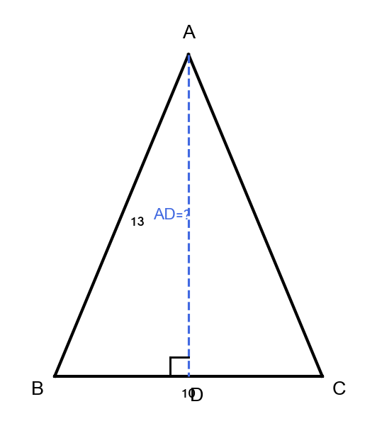

2. נתון משולש שווה שוקיים עם שוקיים באורך
$5$
ס"מ ובסיס באורך
$6$
ס"מ.
מורידים גובה אל הבסיס.
א. מצאו את אורך הגובה.
ב. חשבו את שטח המשולש.

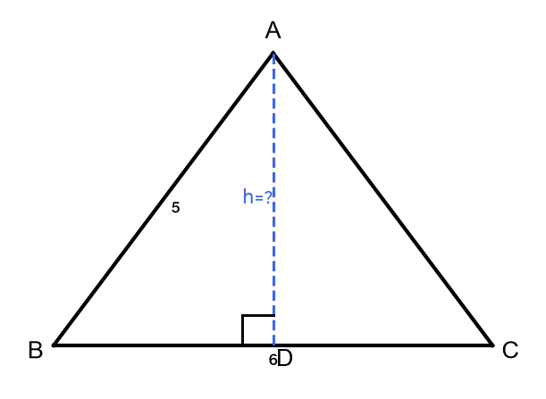

3. נתון משולש שווה שוקיים עם שוקיים באורך
$17$
ס"מ ובסיס באורך
$16$
ס"מ.
א. מצאו את הגובה אל הבסיס.
ב. חשבו את שטח המשולש.

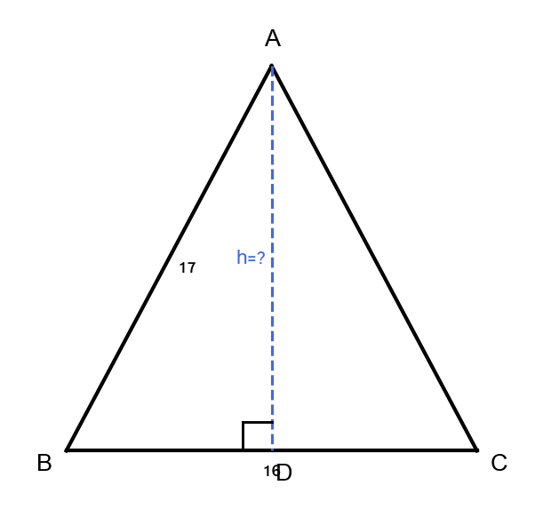

4. נתון משולש כללי עם בסיס
$14$
ס"מ וגובה
$9$
ס"מ.
חשבו את שטח המשולש.

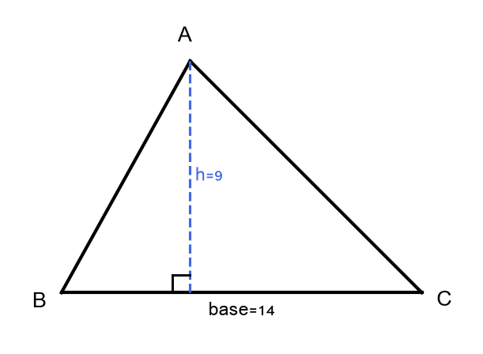

5. נתון משולש שווה שוקיים. זווית הבסיס שווה
$60°$
ואורך כל שוק הוא
$10$
ס"מ.
מצאו את הגובה מהקודקוד אל הבסיס.

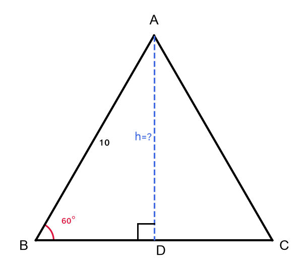

6. נתון משולש שווה שוקיים עם זווית קודקוד
$90°$
ושוקיים באורך
$8$
ס"מ.
א. מצאו את אורך הבסיס.
ב. חשבו את שטח המשולש.

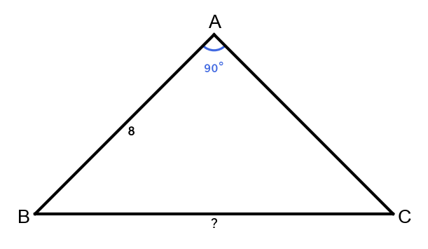

7. נתון משולש שווה שוקיים. הגובה אל הבסיס הוא
$12$
ס"מ ואורך הבסיס הוא
$10$
ס"מ.
מצאו את אורך השוקיים.

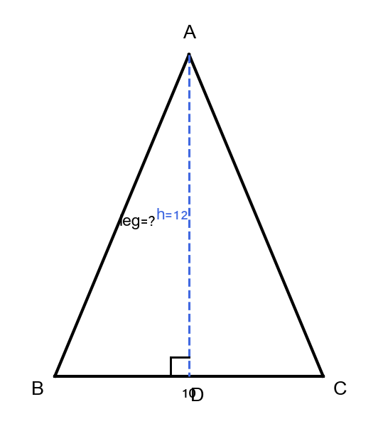

8. נתון משולש כללי ABC כאשר
$$BC = 20 \text{cm}, \quad AB = 15 \text{cm}, \quad \angle B = 35°$$
מורידים גובה מ-A אל BC בנקודה D.
א. מצאו את אורך AD.
ב. חשבו את שטח המשולש.

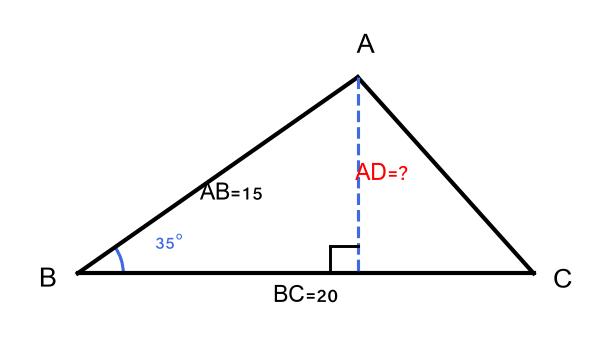

---

## רמה 2: תרגול שוטף ומשולב (8 תרגילים)

---

9. נתון משולש שווה שוקיים ABC כאשר
$$AB = AC = 26 \text{cm}, \quad BC = 20 \text{cm}$$
מורידים גובה מ-A אל BC בנקודה D.
א. מצאו את AD.
ב. חשבו את שטח המשולש.
ג. חשבו את היקף המשולש.

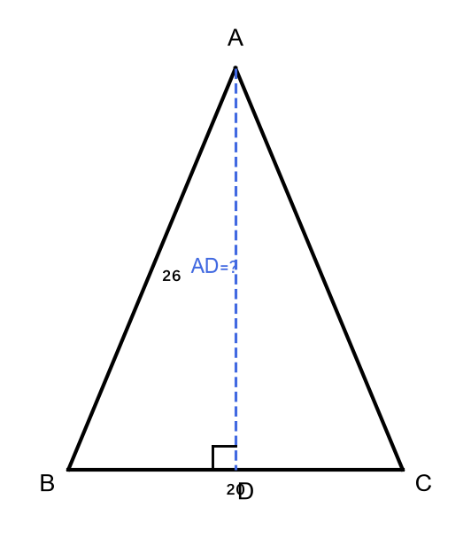

10. נתון משולש שווה שוקיים עם בסיס
$22$
ס"מ וזווית בסיס
$40°$.
א. מצאו את אורך השוקיים.
ב. מצאו את הגובה אל הבסיס.
ג. חשבו את שטח המשולש.

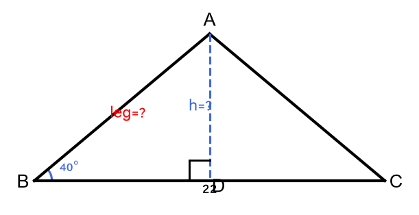

11. נתון משולש שווה שוקיים עם זווית קודקוד
$100°$
ושוקיים באורך
$15$
ס"מ.
א. מצאו את הגובה מהקודקוד אל הבסיס.
ב. מצאו את אורך הבסיס.
ג. חשבו את שטח המשולש.

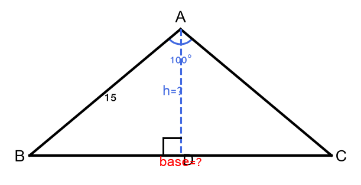

12. נתון משולש שווה שוקיים עם היקף
$56$
ס"מ ובסיס
$16$
ס"מ.
א. מצאו את אורך השוקיים.
ב. מצאו את הגובה אל הבסיס.
ג. חשבו את שטח המשולש.

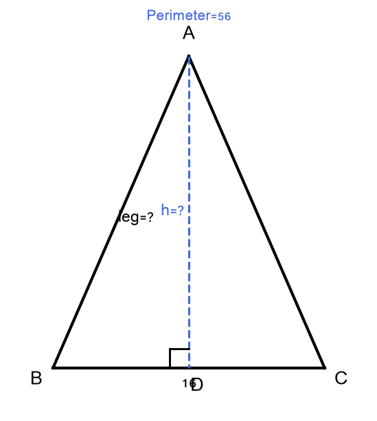

13. נתון משולש כללי ABC כאשר
$$BC = 25 \text{cm}, \quad AB = 18 \text{cm}, \quad \angle B = 50°$$
מורידים גובה מ-A אל BC בנקודה D.
א. מצאו את AD.
ב. חשבו את שטח המשולש.

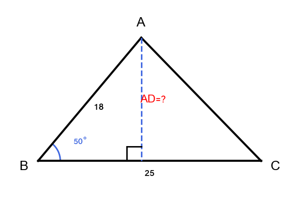

14. נתון משולש שווה שוקיים ABC כאשר
$AB = AC$,
שטח המשולש
$108$
ס"מ², ואורך הבסיס
$BC = 18$
ס"מ.
א. מצאו את הגובה AD.
ב. מצאו את אורך השוקיים AB ו-AC.
ג. מצאו את זווית הבסיס.

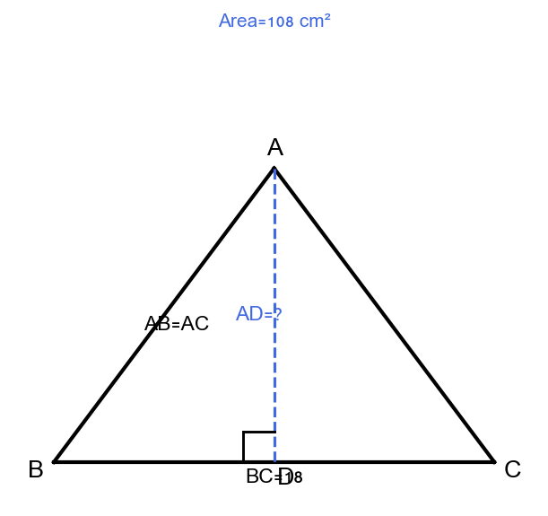

15. נתון משולש שווה צלעות (משוּשׁ) עם צלע
$12$
ס"מ.
א. מצאו את הגובה.
ב. חשבו את שטח המשולש.

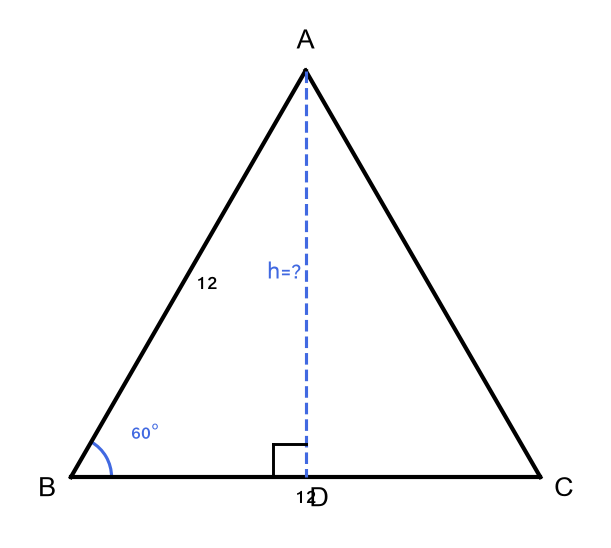

16. נתון משולש שווה שוקיים ABC כאשר
$$AB = AC = 20 \text{cm}$$
הגובה מ-A פוגש את BC בנקודה D, כאשר
$AD = 16$
ס"מ.
א. מצאו את BC.
ב. חשבו את שטח המשולש.
ג. מצאו את
$\angle ABC$.

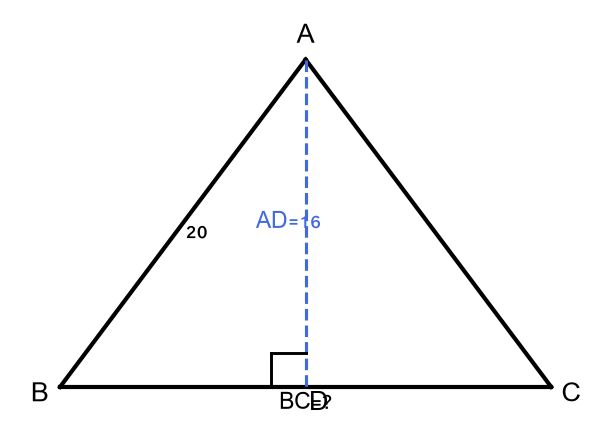

---

## רמה 3: רמת בחינת מה"ט (4 תרגילים)

---

17. נתון משולש שווה שוקיים ABC כאשר
$BC = 24$
ס"מ ושטח המשולש
$180$
ס"מ².
נקודה D נמצאת על BC כך ש-
$AD \perp BC$.
נקודה E היא נקודת האמצע של AB.

א. מצאו את AD, את AB, ואת
$\angle ABC$.

ב. מצאו את DE.

ג. חשבו את שטח משולש BDE.

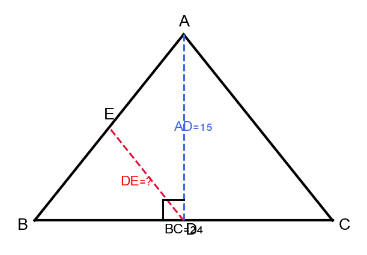

---

18. נתון משולש ישר זווית ABC כאשר
$$\angle B = 90°, \quad AB = 7 \text{cm}, \quad BC = 24 \text{cm}$$
נקודה D נמצאת על AC כך ש-
$BD \perp AC$.

א. מצאו את AC,
$\angle BAC$
ו-
$\angle BCA$.

ב. מצאו את BD, AD ו-DC.

ג. חשבו את היחס בין שטח משולש ABD לשטח משולש BCD.

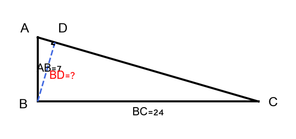

---

19. נתון משולש שווה שוקיים ABC כאשר
$$AB = AC = 25 \text{cm}, \quad BC = 14 \text{cm}$$
נקודה D על BC כך ש-
$AD \perp BC$.
נקודה E על AC כך ש-
$BE \perp AC$.

א. מצאו את AD.

ב. מצאו את BE.

ג. חשבו את שטח משולש ABE.

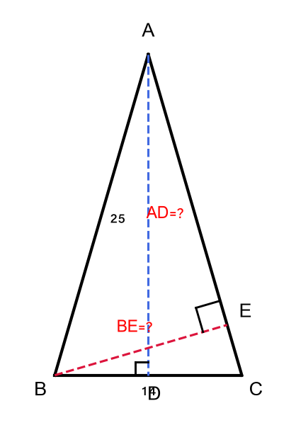

---

20. גג בית בצורת משולש שווה שוקיים, רוחבו (הבסיס)
$10$
מטר.
זווית הנטייה של כל מישור גג ביחס לאופקי שווה
$35°$.

א. מצאו את אורך כל מישור גג (השוקיים).

ב. מצאו את גובה הגג (מהאמצע עד לקודקוד).

ג. אורך הגג הוא
$15$
מטר. על כל מטר מרובע של שני מישורי הגג יש להניח
$12$
רעפים.
כמה רעפים דרושים סך הכל?

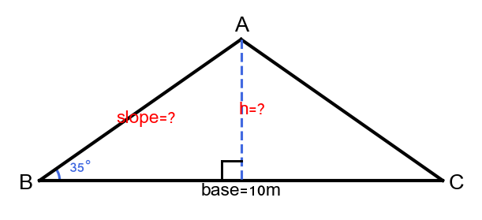

---

תשובות סופיות

1. $AD = 12$
ס"מ

2.
א.
גובה
$4$
ס"מ
ב.
שטח
$12$
ס"מ²

3.
א.
גובה
$15$
ס"מ
ב.
שטח
$120$
ס"מ²

4. שטח
$63$
ס"מ²

5. 5\sqrt{3} \approx $8.66$
ס"מ

6.
א.
בסיס
$8\sqrt{2} \approx $11.31$
ס"מ
ב.
שטח
$32$
ס"מ²

7. $13$
ס"מ

8.
א.
$AD = 15 \cdot \sin 35° \approx $8.60$
ס"מ
ב.
שטח
$\frac{1}{2} \cdot 20 \cdot 8.60 \approx $86$
ס"מ²

9.
א.
$24$
ס"מ
ב.
שטח
$240$
ס"מ²
ג.
היקף
$72$
ס"מ

10.
א.
שוק
$\frac{11}{\cos 40°} \approx $14.36$
ס"מ
ב.
גובה
$11 \cdot \tan 40° \approx $9.23$
ס"מ
ג.
שטח
$\approx $101.5$
ס"מ²

11.
א.
גובה
$15 \cdot \cos 50° \approx $9.64$
ס"מ
ב.
בסיס
$2 \cdot 15 \cdot \sin 50° \approx $22.98$
ס"מ
ג.
שטח
$\approx $110.8$
ס"מ²

12.
א.
שוקיים
$20$
ס"מ
ב.
\sqrt{336} \approx $18.33$
ס"מ
ג.
שטח
$\approx $146.6$
ס"מ²

13.
א.
$AD = 18 \cdot \sin 50° \approx $13.79$
ס"מ
ב.
שטח
$\frac{1}{2} \cdot 25 \cdot 13.79 \approx $172.4$
ס"מ²

14.
א.
$AD = 12$
ס"מ
ב.
$15$
ס"מ
ג.
זווית בסיס
$= \arccos\!\left(\frac{9}{15}\right) \approx 53.13°$

15.
א.
גובה
$6\sqrt{3} \approx $10.39$
ס"מ
ב.
שטח
$36\sqrt{3} \approx $62.35$
ס"מ²

16.
א.
$BC = 24$
ס"מ
ב.
שטח
$= $192$
ס"מ²
ג.
$\angle ABC \approx 53.13°$

17.
א.
$AD = 15$
ס"מ,
$AB \approx $19.21$
ס"מ,
$\angle ABC \approx 51.3°$
ב.
$DE = \frac{AB}{2} \approx $9.61$
ס"מ
ג.
שטח
$\triangle BDE = 45$
ס"מ²

18.
א.
$AC = 25$
ס"מ,
$\angle BAC \approx 73.74°$,
$\angle BCA \approx 16.26°$
ב.
$23.04$
ס"מ
ג.
יחס
$\frac{49}{576}$

19.
א.
$AD = 24$
ס"מ
ב.
$13.44$
ס"מ
ג.
שטח
$\triangle ABE \approx $141.7$
ס"מ²

20.
א.
מישור גג
$\frac{5}{\cos 35°} \approx $6.10$
מ'
ב.
גובה
$5 \cdot \tan 35° \approx $3.50$
מ'
ג.
$2{ }196$
רעפים

