# יחידה 5.2 – יישום במלבן ומעוין

**שיטות:**

**מלבן:** האלכסון יוצר משולש ישר זווית עם שתי הצלעות.
$$a = d \cdot \cos\alpha \qquad b = d \cdot \sin\alpha$$
כאשר
$d$
הוא אורך האלכסון ו-
$\alpha$
הזווית שבין האלכסון לצלע הארוכה.

**מעוין:** האלכסונים מאונכים זה לזה ומחלקים זה את זה לשניים. כל אלכסון מחלק את הזווית שלו לשניים.
$$d_1 = 2a \cdot \cos\!\left(\frac{\alpha}{2}\right) \qquad d_2 = 2a \cdot \sin\!\left(\frac{\alpha}{2}\right)$$
כאשר
$a$
הוא צלע המעוין ו-
$\alpha$
הזווית החדה של המעוין.

---

## רמה 1: בניית ביטחון (8 תרגילים)

---

1. נתון מלבן שאורך אלכסונו
$10$
ס"מ והזווית שבין האלכסון לצלע הארוכה היא
$30°$.
חשבו את אורך הצלע הארוכה.

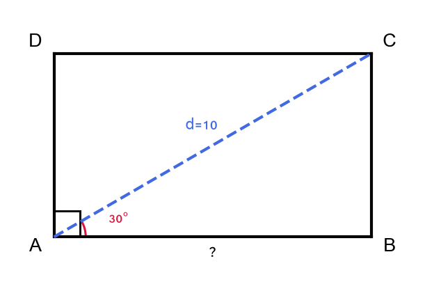

2. נתון מלבן שאורך אלכסונו
$13$
ס"מ והזווית שבין האלכסון לצלע הארוכה היא
$22°$.
חשבו את אורך הצלע הקצרה.

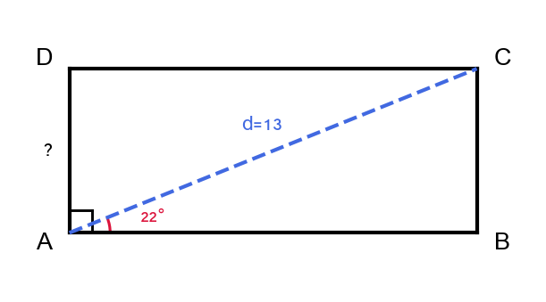

3. נתון מלבן שצלעותיו
$6$
ס"מ ו-
$8$
ס"מ.
מצאו את אורך האלכסון.

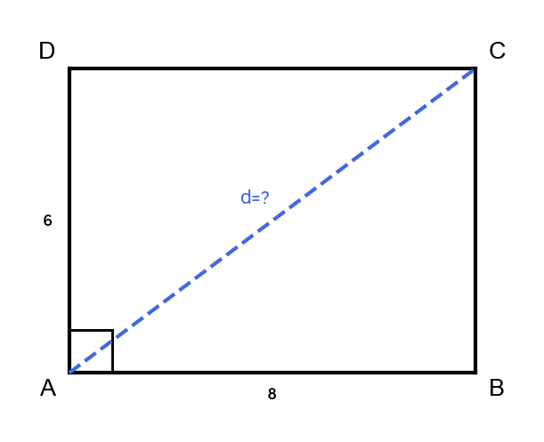

4. נתון מעוין עם צלע
$10$
ס"מ וזווית חדה
$60°$.
חשבו את אורך כל אחד משני האלכסונים.

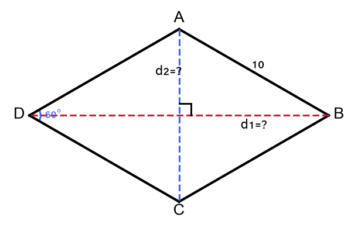

5. נתון מעוין שכל זוויותיו שוות
$90°$
(ריבוע) עם צלע
$6$
ס"מ.
מצאו את אורך האלכסון.

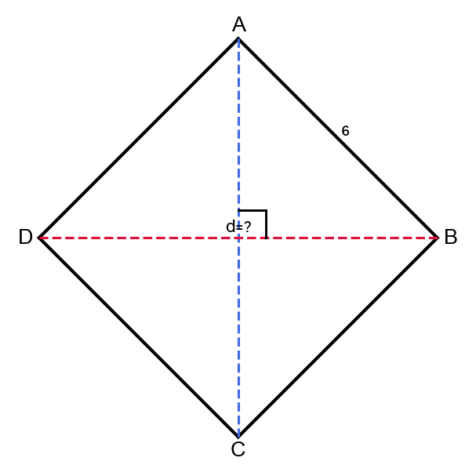

6. נתון מלבן שאורך אלכסונו
$20$
ס"מ והזווית שבין האלכסון לצלע הארוכה היא
$35°$.
חשבו את שטח המלבן.

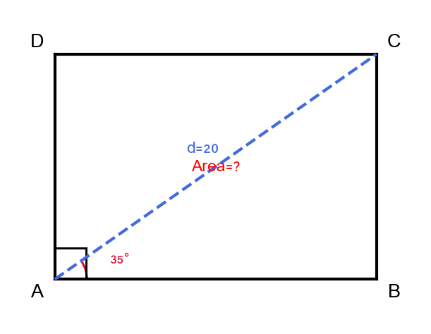

7. נתון מעוין עם צלע
$8$
ס"מ וזווית חדה
$90°$
(ריבוע).
מצאו את אורך האלכסונים.

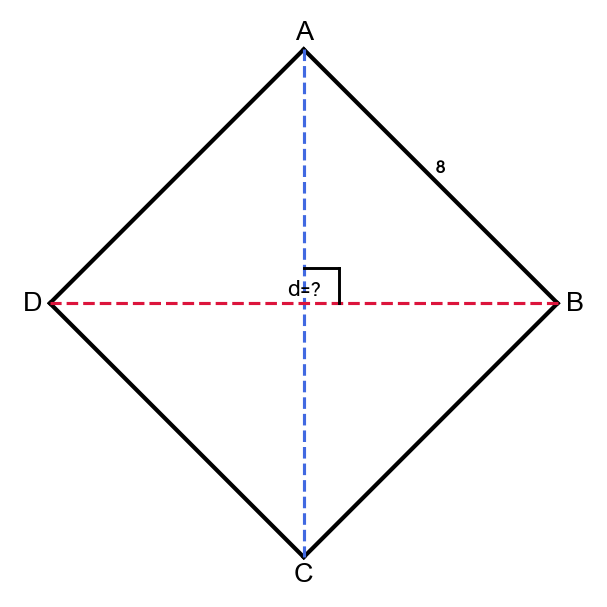

8. נתון מלבן שצלעותיו
$15$
ס"מ ו-
$8$
ס"מ.
א. מצאו את אורך האלכסון.
ב. מצאו את הזווית שבין האלכסון לצלע הארוכה.

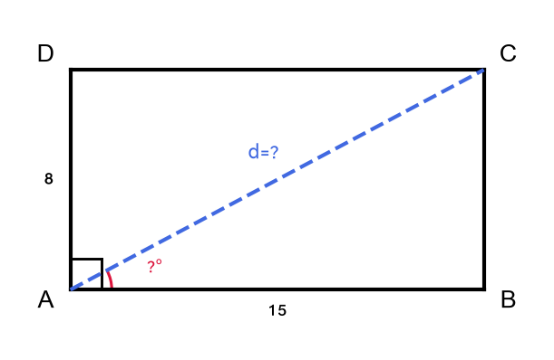

---

## רמה 2: תרגול שוטף ומשולב (8 תרגילים)

---

9. נתון מלבן ABCD.
אורך האלכסון
$AC = 16$
ס"מ.
הזווית
$\angle BAC = 38°$.
א. חשבו את אורכי צלעות המלבן.
ב. חשבו את שטח המלבן.
ג. חשבו את היקף המלבן.

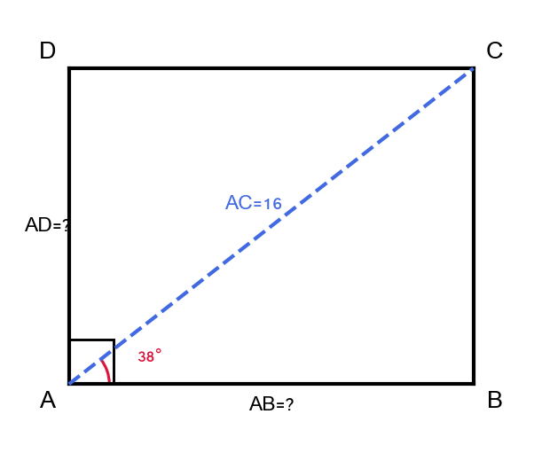

10. נתון מעוין ABCD עם צלע
$12$
ס"מ וזווית חדה
$72°$.
א. חשבו את אורכי שני האלכסונים.
ב. חשבו את שטח המעוין.
ג. מה היקף המעוין?

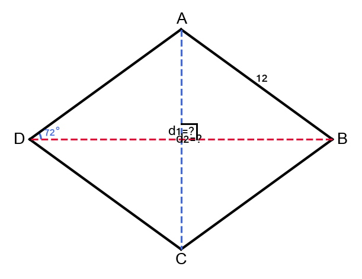

11. נתון מלבן שהיקפו
$34$
ס"מ ואורך אלכסונו
$13$
ס"מ.
מצאו את אורכי צלעות המלבן ואת שטחו.

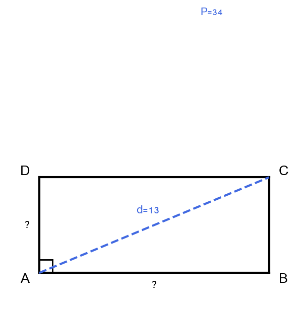

12. נתון מעוין שאורכי אלכסוניו
$24$
ס"מ ו-
$10$
ס"מ.
א. מצאו את אורך צלע המעוין.
ב. מצאו את הזווית החדה של המעוין.
ג. חשבו את שטח המעוין.

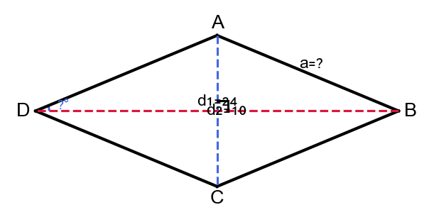

13. נתון מלבן שצלעו הקצרה
$9$
ס"מ ואורך האלכסון
$15$
ס"מ.
א. מצאו את הצלע הארוכה.
ב. חשבו את שטח המלבן ואת היקפו.
ג. מצאו את הזווית שבין האלכסון לצלע הקצרה.

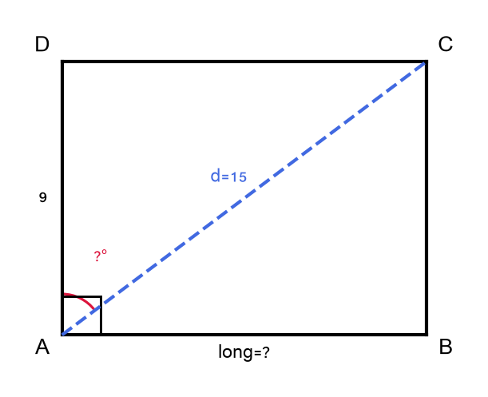

14. נתון מעוין עם צלע
$7$
ס"מ וזווית קהה
$120°$.
א. חשבו את אורכי שני האלכסונים.
ב. חשבו את שטח המעוין.

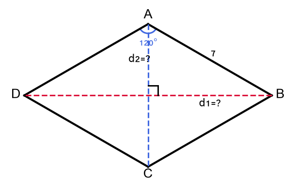

15. נתון מלבן ששטחו
$60$
ס"מ² ואורך האלכסון
$13$
ס"מ.
מצאו את אורכי צלעות המלבן ואת היקפו.

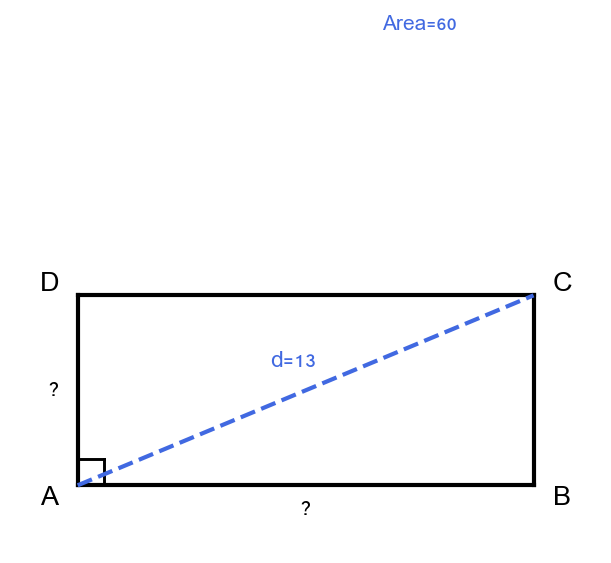

16. נתון מעוין ששטחו
$120$
ס"מ² ואחד האלכסונים הוא
$20$
ס"מ.
א. מצאו את האלכסון השני.
ב. מצאו את אורך צלע המעוין.
ג. מצאו את הזווית החדה של המעוין.

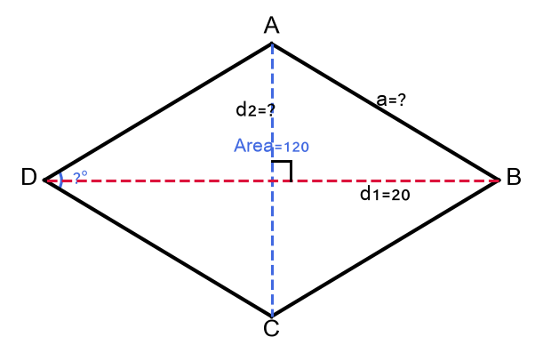

---

## רמה 3: רמת בחינת מה"ט (4 תרגילים)

---

17. מקור: מה"ט 2023

נתון מלבן ABCD, נקודה M היא מפגש אלכסוני המלבן.
נקודה E נמצאת על צלע CD כך ש-
$ME \parallel AD$.
נתונים:
$$CM = 7.8 \text{m}, \quad \angle ABD = 63°$$

א. חשבו את אורכי צלעות המלבן AB ו-AD.

ב. מצאו את שטח ואת היקף הטרפז AMED.

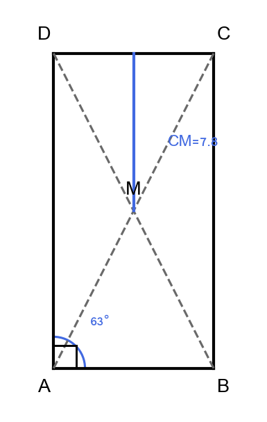

---

18. מקור: מה"ט 2024

נתון מלבן ABCD כאשר AC הוא אלכסון.
נקודה E נמצאת על צלע BC כך ש-
$AB = BE$.
נתונים:
$$AE = 11.32 \text{cm}, \quad EC = 4 \text{cm}$$

א. מצאו את BC ואת AB.

ב. מצאו את AC.

ג. מצאו את הזווית
$\angle BAC$
ואת הזווית
$\angle DAC$.

ד. חשבו את שטח המלבן ואת היקפו.

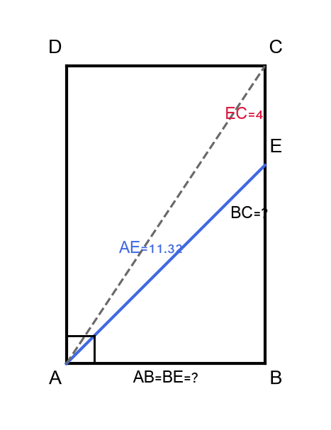

---

19. מקור: מה"ט 2025

נתון מעוין ABCD כאשר
$$AB = 10.3 \text{cm}, \quad \angle ABC = 128°$$

א. חשבו את אורכי האלכסונים AC ו-BD.

ב. חשבו את שטח המעוין.

ג. נקודה E היא רגל הגובה מ-C אל הישר המכיל את AB (מורחב מעבר ל-B), ונקודה F היא רגל הגובה מ-D אל הישר המכיל את AB.
מרובע CEDF הוא מלבן.
חשבו את שטח המלבן CEDF ואת היקפו.

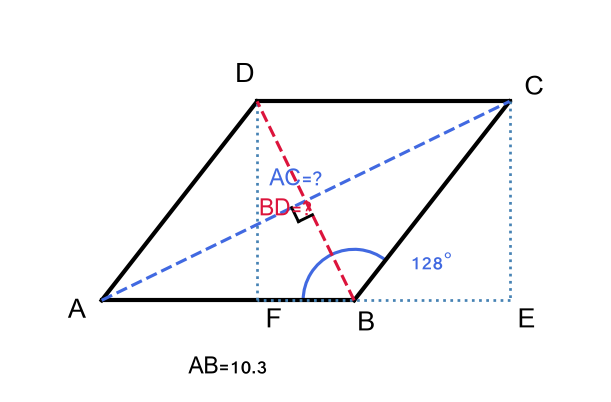

---

20. נתון מלבן ABCD ומעוין PQRS כאשר:
$$AB = 12 \text{cm}, \quad BC = 9 \text{cm}$$
$$PQ = 10 \text{cm}, \quad \angle PQR = 110°$$

א. חשבו את אורך האלכסון AC של המלבן ואת הזווית
$\angle BAC$.

ב. חשבו את אורכי האלכסונים של המעוין.

ג. לאיזה מהם שטח גדול יותר?

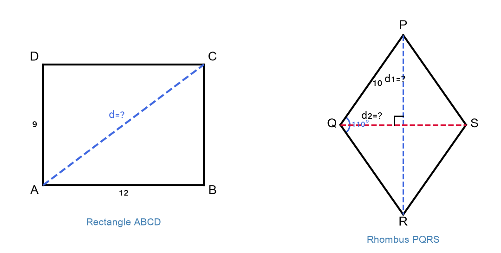

---

תשובות סופיות

1.
$5\sqrt{3}\approx 8{,}66$
סנטימטרים.

2.
$13\sin(22^{\circ})\approx 4{,}87$
סנטימטרים.

3.
$10$
סנטימטרים.

4.
$d_{1}=10\sqrt{3}\approx 17{,}32$
סנטימטרים ו-
$d_{2}=10$
סנטימטרים.

5.
$6\sqrt{2}\approx 8{,}49$
סנטימטרים.

6.
צלעות בערך
$16{,}38$
סנטימטרים ו-
$11{,}47$
סנטימטרים — לפי
$20\cos(35^{\circ})$
ו-
$20\sin(35^{\circ})$
שטח בערך
$187{,}9$
סנטימטרים מרובעים.

7.
$d = 8\sqrt{2}\approx 11{,}31$
סנטימטרים לכל אלכסון.

8.
א.
$\sqrt{8^{2}+15^{2}}=17$
סנטימטרים.
ב.
$\angle BAC\approx \arctan\left(\dfrac{8}{15}\right)\approx 28{,}07^{\circ}$

9.
א.
צלעות בערך
$9{,}85$
סנטימטרים ו-
$12{,}60$
סנטימטרים — לפי
$16\sin(38^{\circ})$
ו-
$16\cos(38^{\circ})$
ב.
שטח בערך
$124{,}2$
סנטימטרים מרובעים.
ג.
היקף בערך
$44{,}92$
סנטימטרים.

10.
א.
$d_{1}\approx 19{,}41$
סנטימטרים,
$d_{2}\approx 14{,}11$
סנטימטרים (
$24\cos(36^{\circ})$,
$24\sin(36^{\circ})$
).
ב.
שטח בערך
$137$
סנטימטרים מרובעים.
ג.
ההיקף
$48$
סנטימטרים.

11.
צלעות
$5$
סנטימטרים ו-
$12$
סנטימטרים.
שטח
$60$
סנטימטרים מרובעים.

12.
א.
$13$
סנטימטרים צלע.
ב.
$2\arctan\left(\dfrac{5}{12}\right)\approx 45{,}24^{\circ}$
זווית חדה.
ג.
השטח
$120$
סנטימטרים מרובעים.

13.
א.
$\sqrt{15^{2}-9^{2}}=12$
סנטימטרים.
ב.
שטח
$108$
סנטימטרים מרובעים.
היקף
$42$
סנטימטרים.
ג.
$\arcsin\left(\dfrac{9}{15}\right)\approx 36{,}87^{\circ}$

14.
א.
$7\sqrt{3}\approx 12{,}12$
סנטימטרים ו-
$7$
סנטימטרים.
לזווית הקהה מתאים ערך חד
$60^{\circ}$
לשם נוסחת האלכסונים.
ב.
$\dfrac{49\sqrt{3}}{2}\approx 42{,}44$
סנטימטרים מרובעים.

15.
מתקבל טיפוסית צמד הצלעות
$5$
ו-
$12$
סנטימטרים (כמו בתרגיל
$11$
), והיקף
$34$
סנטימטרים.

16.
א.
חישוב מתוך
$120=\tfrac12\cdot 20\cdot d_{2}$
מניב
$d_{2}=12$
סנטימטרים.
ב.
$\sqrt{136}\approx 11{,}66$
סנטימטרים צלע.
ג.
$\approx 61{,}93^{\circ}$
זווית חדה משוערת.

17.
א.
$AB \approx 7{,}06$
מטר,
$AD \approx 13{,}90$
מטר.
ב.
$\dfrac{(AB)\cdot(AD)}{4}\approx 24{,}6$
מרובע, והיקף בערך
$32{,}3$
מ'.

18.
א.
$BC = 12$
סנטימטרים,
$AB = 8$
סנטימטרים.
ב.
$\sqrt{208}\approx 14{,}42$
סנטימטרים.
ג.
זווית
$\angle BAC$
בערך
$56{,}31^{\circ}$.
זווית
$\angle DAC$
בערך
$33{,}69^{\circ}$
ד.
שטח
$96$
סנטימטרים מרובעים, היקף
$40$
סנטימטרים.

19.
א.
$\approx 18{,}53$
סנטימטרים ו-
$\approx 9{,}03$
סנטימטרים לאורכי האלכסונים הנגזרים.
ב.
$\approx 83{,}8$
סנטימטרים מרובעים.
ג.
$\approx 36{,}84$
סנטימטרים בהתאם להיקף המלבן מהנתונים.

20.
א.
אורך האלכסון במלבן
$15$
סנטימטרים.
זווית
$\angle BAC$
בערך
$36{,}87^{\circ}$
ב.
$18{,}79$
סנטימטרים בערך אלכסוני המעוין מהנוסחאות הגיאומטריות.
ג.
$108$
לעומת
$\approx 93{,}97$
לכן למלבן שטח גדול יותר (
$100\sin(70^{\circ})$
מהמודל הפשוט לשטח המעוין).

