# יחידה 5.3 – יישום בטרפז שווה שוקיים וטרפז כללי

**שיטות:**

**טרפז שווה שוקיים:** מורידים גבהים מקצות הבסיס הקצר אל הבסיס הארוך. נוצרים שני משולשים ישרי זווית זהים בצדדים ומלבן באמצע.
$$x = \frac{BC - AD}{2}, \qquad h = x \cdot \tan(\angle B), \qquad l = \frac{x}{\cos(\angle B)}$$

**טרפז כללי:** מורידים שני גבהים (אנכים) מהבסיס הקצר אל הבסיס הארוך. נוצרים שני משולשים ישרי זווית שונים.

---

## רמה 1: בניית ביטחון (8 תרגילים)

---

1. נתון טרפז שווה שוקיים עם בסיס ארוך
$30$
ס"מ, בסיס קצר
$10$
ס"מ וזווית בסיס
$30°$.
מצאו את הגובה.

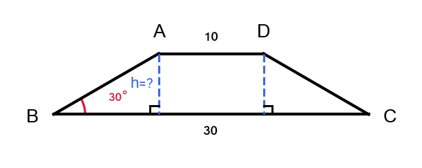

2. נתון טרפז שווה שוקיים עם בסיס ארוך
$20$
ס"מ, בסיס קצר
$8$
ס"מ וגובה
$6$
ס"מ.
חשבו את שטח הטרפז.

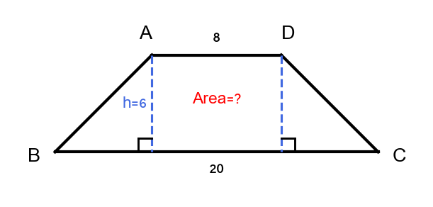

3. נתון טרפז שווה שוקיים עם בסיס ארוך
$26$
ס"מ, בסיס קצר
$10$
ס"מ וזווית בסיס
$45°$.
א. מצאו את הגובה.
ב. מצאו את אורך השוקיים.

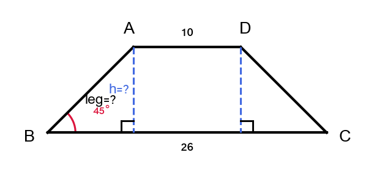

4. נתון טרפז שווה שוקיים עם שוק
$10$
ס"מ, בסיס ארוך
$22$
ס"מ וזווית בסיס
$60°$.
מצאו את הבסיס הקצר.

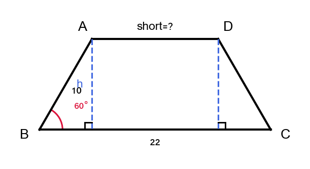

5. נתון טרפז שווה שוקיים עם גובה
$12$
ס"מ, בסיס ארוך
$28$
ס"מ, שוק
$13$
ס"מ.
א. מצאו את הבסיס הקצר.
ב. חשבו את שטח הטרפז.

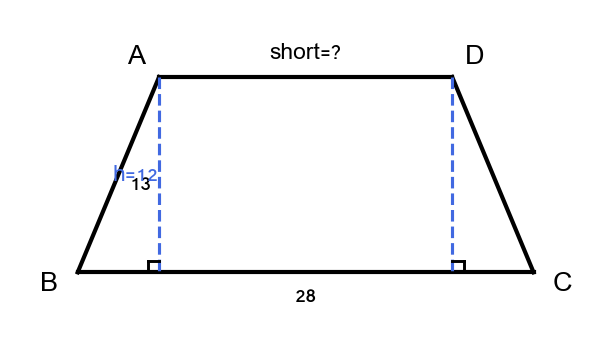

6. נתון טרפז כללי עם בסיסים
$10$
ס"מ ו-
$18$
ס"מ וגובה
$7$
ס"מ.
חשבו את שטח הטרפז.

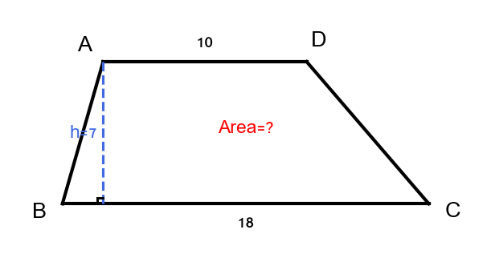

7. נתון טרפז שווה שוקיים עם בסיסים
$14$
ס"מ ו-
$30$
ס"מ. הגובה הוא
$8$
ס"מ.
א. חשבו את שטח הטרפז.
ב. מצאו את אורך השוק.

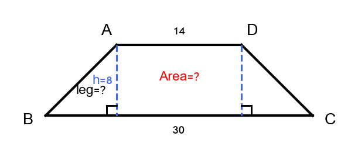

8. נתון טרפז שווה שוקיים. זווית הבסיס שווה
$50°$
ואורך השוק
$15$
ס"מ.
מצאו את הגובה.

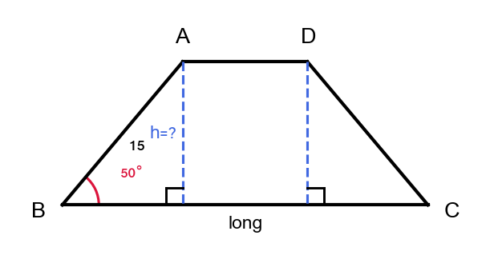

---

## רמה 2: תרגול שוטף ומשולב (8 תרגילים)

---

9. נתון טרפז שווה שוקיים ABCD כאשר
$AD \parallel BC$.
$$AD = 12 \\text{cm}, \quad BC = 30 \\text{cm}, \quad \angle ABC = 55°$$
א. מצאו את הגובה.
ב. מצאו את אורך השוקיים AB ו-DC.
ג. חשבו את שטח הטרפז.

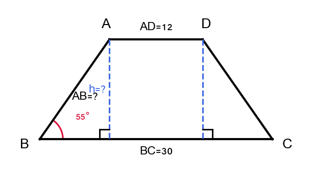

10. נתון טרפז שווה שוקיים עם בסיסים
$18$
ס"מ ו-
$42$
ס"מ ושוקיים
$15$
ס"מ.
א. מצאו את הגובה.
ב. חשבו את שטח הטרפז ואת היקפו.

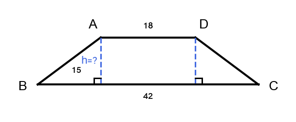

11. נתון טרפז שווה שוקיים עם שטח
$150$
ס"מ², גובה
$10$
ס"מ ובסיס ארוך
$22$
ס"מ.
א. מצאו את הבסיס הקצר.
ב. מצאו את אורך השוק.
ג. מצאו את הזווית עם הבסיס הארוך.

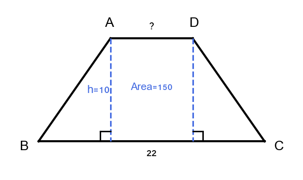

12. נתון טרפז שווה שוקיים עם היקף
$72$
ס"מ, בסיסים
$16$
ס"מ ו-
$24$
ס"מ.
א. מצאו את אורך השוקיים.
ב. מצאו את הגובה.
ג. חשבו את שטח הטרפז.

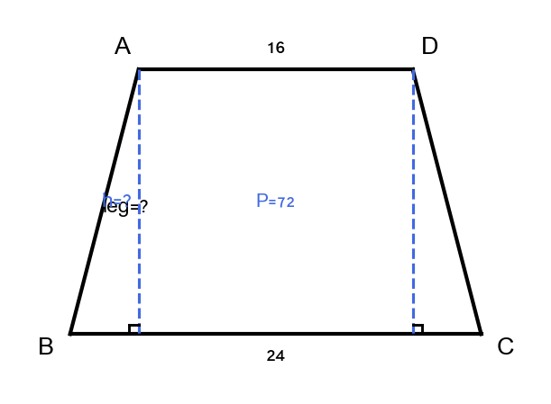

13. נתון טרפז כללי ABCD עם
$AB \parallel DC$.
$$AB = 20 \\text{m}, \quad AD = 13 \\text{m}, \quad \angle ADC = 67.4°$$
מורידים גובה מ-A אל DC בנקודה E.
א. מצאו את הגובה AE.
ב. מצאו את DE.
ג. אם
$BC = 15$
מ' ו-
$\angle BCD = 53°$,
מצאו את DC ואת שטח הטרפז.

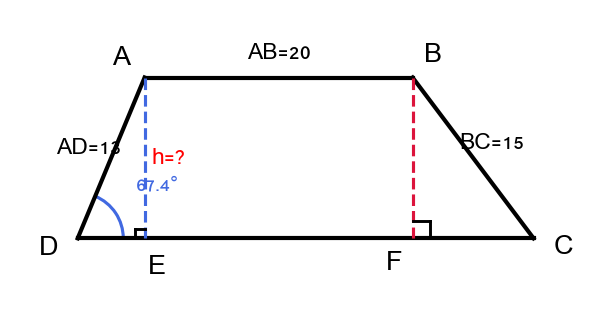

14. נתון טרפז שווה שוקיים ABCD כאשר
$AD \parallel BC$.
האלכסון AC הוא
$25$
ס"מ, הבסיס הארוך
$BC = 40$
ס"מ, וזווית הבסיס
$\angle ABC = 45°$.
א. מצאו את הגובה.
ב. מצאו את הבסיס הקצר AD.

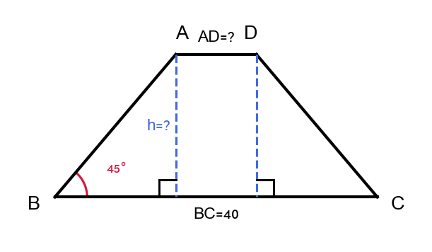

15. נתון טרפז שווה שוקיים עם גובה שווה לשוק. אורך הבסיס הארוך הוא
$30$
ס"מ וזווית הבסיס היא
$45°$.
א. מצאו את אורך השוק.
ב. מצאו את הבסיס הקצר.

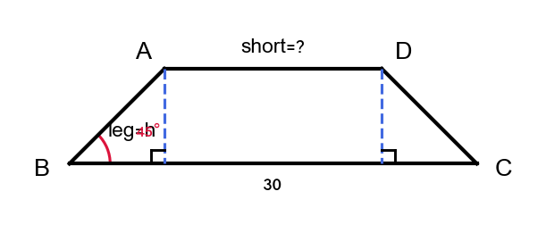

16. נתון טרפז שווה שוקיים.
$$B = 50 \\text{cm}, \quad l = 17 \\text{cm}, \quad h = 15 \\text{cm}$$
א. מצאו את הבסיס הקצר.
ב. חשבו את שטח הטרפז.
ג. מצאו את הזווית עם הבסיס.
ד. מצאו את אורך האלכסון.

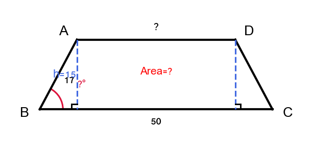

---

## רמה 3: רמת בחינת מה"ט (4 תרגילים)

---

17. מקור: מה"ט 2024

נתון טרפז שווה שוקיים ABCD כאשר
$AD \parallel BC$
(AD הוא הבסיס הקצר).
נקודות G ו-H הן רגלי הגבהים שמ-A ומ-D בהתאמה אל BC.
$$AD = 12 \\text{cm}, \quad BC = 48 \\text{cm}, \quad \angle DCB = 40°$$

א. חשבו את שטח הטרפז ABCD ואת שטח המלבן AGHD.

ב. חשבו את היקף משולש DHC.

ג. מצאו את אורך האלכסון AC.

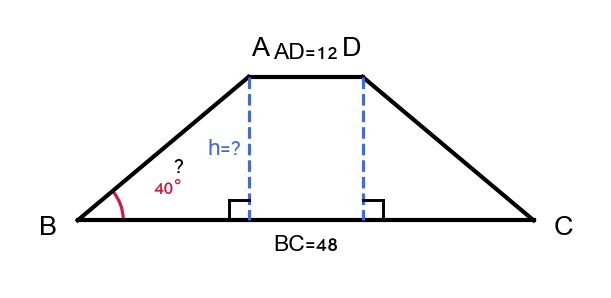

---

18. מקור: מה"ט 2024

נתון טרפז כללי ABCD כאשר
$AB \parallel DC$.
מורידים גובה מ-A אל DC בנקודה E, ומורידים גובה מ-B אל DC בנקודה F.
$$AB = 17 \\text{m}, \quad AD = 13 \\text{m}, \quad BC = 15 \\text{m}, \quad \angle BCD = 53°$$

א. מצאו את זוויות משולש ADE.

ב. מצאו את DC.

ג. חשבו את שטח הטרפז.

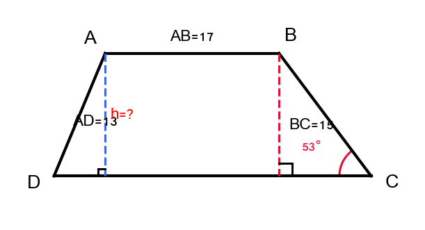

---

19. נתון טרפז שווה שוקיים ABCD כאשר
$AB \parallel DC$.
$$AB = 10 \\text{cm}, \quad DC = 34 \\text{cm}, \quad \angle BCD = 35°$$

א. מצאו את הגובה ואת אורך השוקיים.

ב. חשבו את שטח הטרפז ואת היקפו.

ג. מצאו את אורך האלכסון AC.

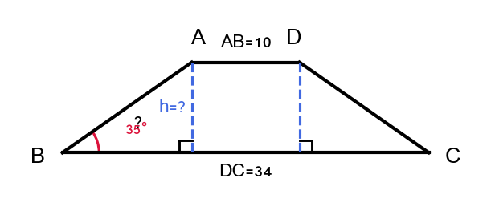

---

20. נתון טרפז שווה שוקיים ABCD כאשר
$AD \parallel BC$.
$$AD = 8 \\text{cm}, \quad BC = 24 \\text{cm}, \quad l AB = 10 \\text{cm}$$

א. מצאו את הגובה ואת זווית הבסיס.

ב. חשבו את שטח הטרפז.

ג. מצאו את אורך האלכסון AC.

ד. נקודה M היא אמצע AB ונקודה N היא אמצע DC.
הוכיחו ש-MN מחבר את אמצעי השוקיים, ומצאו את אורכו.

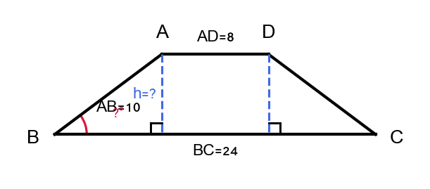

---

תשובות סופיות

1. גובה
$= 10 \cdot \tan 30° = \frac{10}{\sqrt{3}} \approx 5.77$
ס"מ

2. שטח
$= \frac{1}{2}(20 + 8) \cdot 6 = 84$
ס"מ²

3. מרחק עודף
$= 8$
ס"מ;
א. גובה
$= 8 \cdot \tan 45° = 8$
ס"מ
ב. שוק
$= \frac{8}{\cos 45°} = 8\sqrt{2} \approx 11.31$
ס"מ

4.
$h = 10\sin 60° = 5\sqrt{3}$
ס"מ, מרחק עודף
$= 10\cos 60° = 5$
ס"מ, בסיס קצר
$= 22 - 2 \times 5 = 12$
ס"מ

5. מרחק עודף
$= \sqrt{13^2 - 12^2} = 5$
ס"מ;
א. בסיס קצר
$= 28 - 2 \times 5 = 18$
ס"מ
ב. שטח
$= \frac{1}{2}(28 + 18) \cdot 12 = 276$
ס"מ²

6. שטח
$= \frac{1}{2}(10 + 18) \cdot 7 = 98$
ס"מ²

7. מרחק עודף
$= 8$
ס"מ;
א. שטח
$= \frac{1}{2}(14 + 30) \cdot 8 = 176$
ס"מ²
ב. שוק
$= \sqrt{8^2 + 8^2} = 8\sqrt{2} \approx 11.31$
ס"מ

8. גובה
$= 15 \cdot \sin 50° \approx 11.49$
ס"מ

9. מרחק עודף
$= 9$
ס"מ;
א. גובה
$= 9\tan 55° \approx 12.85$
ס"מ
ב. שוק
$= \frac{9}{\cos 55°} \approx 15.69$
ס"מ
ג. שטח
$\approx \frac{1}{2}(12 + 30) \cdot 12.85 \approx 269.9$
ס"מ²

10. מרחק עודף
$= 12$
ס"מ;
א. גובה
$= \sqrt{15^2 - 12^2} = 9$
ס"מ
ב. שטח
$= \frac{1}{2}(18 + 42) \cdot 9 = 270$
ס"מ², היקף
$= 18 + 42 + 2 \times 15 = 90$
ס"מ

11. א.
$\frac{1}{2}(22 + x) \cdot 10 = 150 \Rightarrow x = 8$
ס"מ
ב. מרחק עודף
$= 7$
, שוק
$= \sqrt{7^2 + 10^2} = \sqrt{149} \approx 12.21$
ס"מ
ג.
$\angle \approx \arctan(10/7) \approx 55.0°$

12. שוק
$= (72 - 16 - 24)/2 = 16$
ס"מ; מרחק עודף
$= 4$
;
גובה
$= \sqrt{16^2 - 4^2} = \sqrt{240} \approx 15.49$
ס"מ;
שטח
$\approx \frac{1}{2}(16 + 24) \cdot 15.49 \approx 309.8$
ס"מ²

13. א.
$AE = 13\sin 67.4° \approx 12$
מ'
ב.
$DE = 13\cos 67.4° \approx 5$
מ'
ג.
$FC = 15\cos 53° \approx 9$
מ',
$BF \approx 12$
מ',
$DC = 5 + 20 + 9 = 34$
מ';
שטח
$= \frac{1}{2}(20 + 34) \cdot 12 = 324$
מ"ר

14. א. גובה
$= BC\sin 45° = ?$
(נדרש מידע נוסף);
אם האלכסון
$AC = 25$
ס"מ, הגובה
$= 25\sin(\angle ACB)$

15. שוק
$= h$
;
$\tan 45° = h/x \Rightarrow x = h$
(מרחק עודף
$= h$
);
שוק
$= h\sqrt{2}$
ס"מ; בסיס קצר
$= 30 - 2h$
;
אם גובה
$= $
שוק:
$h = h\sqrt{2}$
– רק אפשרי כש-
$h = 0$
.
תיקון:
$\sin 45° = h / l \Rightarrow$
שוק
$= h\sqrt{2}$
;
$\cos 45° = x/l \Rightarrow x = h$
; בסיס קצר
$= 30 - 2h$
  (לוחות המה"ט ינתנו; פתרון מלא בשיעור)

16. מרחק עודף
$= \sqrt{17^2 - 15^2} = 8$
ס"מ;
א. בסיס קצר
$= 50 - 16 = 34$
ס"מ
ב. שטח
$= \frac{1}{2}(50 + 34) \cdot 15 = 630$
ס"מ²
ג.
$\angle = \arccos(8/17) \approx 61.93°$
(מן הבסיס)
ד. אלכסון
$= \sqrt{(50-8)^2 + 15^2} = \sqrt{1764 + 225} = \sqrt{1989} \approx 44.6$
ס"מ
    (תלוי בנקודות; ראו פתרון מלא)

17. מרחק עודף
$= 18$
ס"מ; שוק
$= 18 / \cos 40° \approx 23.50$
ס"מ; גובה
$= 18\tan 40° \approx 15.12$
ס"מ;
א. שטח טרפז
$= \frac{1}{2}(12 + 48) \cdot 15.12 \approx 453.6$
ס"מ²;
שטח מלבן AGHD
$= 12 \times 15.12 \approx 181.4$
ס"מ²
ב. היקף
$\triangle DHC = 15.12 + 18 + 23.50 \approx 56.62$
ס"מ
ג.
$AC = \sqrt{30^2 + 15.12^2} = \sqrt{1128.6} \approx 33.59$
ס"מ

18. $\sin 53° \approx 0.8$, $\cos 53° \approx 0.6$;
$BF = 15 \times 0.8 = 12$
מ',
$FC = 15 \times 0.6 = 9$
מ';
א.
$AE = BF = 12$
מ',
$DE = \sqrt{13^2 - 12^2} = 5$
מ';
זוויות:
$\angle AED = 90°$
,
$\angle ADE \approx 67.38°$
,
$\angle DAE \approx 22.62°$
ב.
$DC = 5 + 17 + 9 = 31$
מ'
ג. שטח
$= \frac{1}{2}(17 + 31) \cdot 12 = 288$
מ"ר

19. מרחק עודף
$= 12$
ס"מ; גובה
$= 12\tan 35° \approx 8.40$
ס"מ;
שוק
$= 12/\cos 35° \approx 14.64$
ס"מ;
א. גובה
$\approx 8.40$
ס"מ, שוק
$\approx 14.64$
ס"מ
ב. שטח
$= \frac{1}{2}(10 + 34) \cdot 8.40 \approx 184.8$
ס"מ²;
היקף
$= 10 + 34 + 2 \times 14.64 \approx 73.28$
ס"מ
ג.
$A = (12, 8.40)$
,
$C = (34, 0)$
:
$AC = \sqrt{22^2 + 8.40^2} = \sqrt{484 + 70.6} \approx 23.55$
ס"מ

20. מרחק עודף
$= 8$
ס"מ; גובה
$= \sqrt{10^2 - 8^2} = 6$
ס"מ;
א. גובה
$= 6$
ס"מ, זווית בסיס
$= \arccos(8/10) \approx 36.87°$
ב. שטח
$= \frac{1}{2}(8 + 24) \cdot 6 = 96$
ס"מ²
ג.
$A = (8, 6)$
,
$C = (24, 0)$
:
$AC = \sqrt{16^2 + 6^2} = \sqrt{256 + 36} = \sqrt{292} \approx 17.09$
ס"מ
ד.
$MN = \frac{AD + BC}{2} = \frac{8 + 24}{2} = 16$
ס"מ

