# יחידה 6.1 – בעיות מילוליות יישומיות מהעולם האמיתי

**כיצד לפתור בעיה מילולית טריגונומטרית:**
1. קראו בעיון וזהו את המשולש ישר הזווית הרלוונטי.

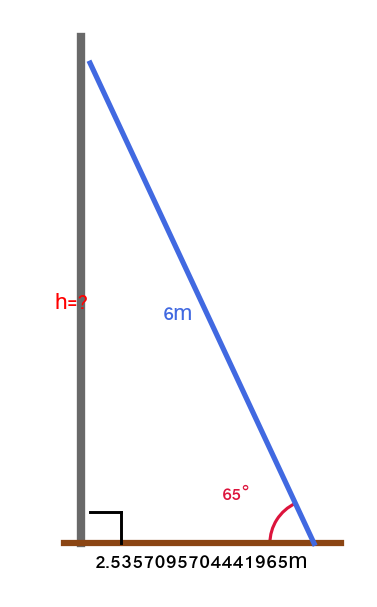

2. סמנו את הידוע: צלע ו/או זווית.

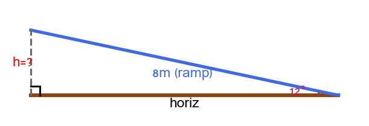

3. בחרו את הפונקציה המתאימה (sin, cos, tan).

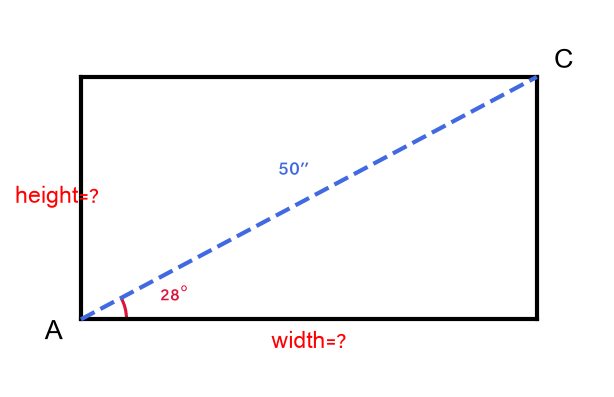

4. חשבו ובדקו שהתשובה הגיונית.

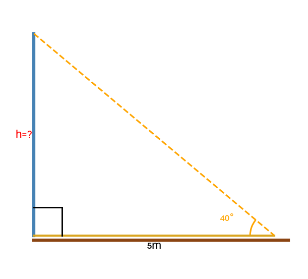

---

## רמה 1: בניית ביטחון (8 תרגילים)

---

1. סולם באורך
$6$
מטר נשען על קיר אנכי.
זווית הסולם עם הקרקע היא
$65°$.
מצאו את הגובה שבו הסולם נוגע בקיר.

2. רמפה לנכים אורכה
$8$
מטר ושיפועה
$12°$.
מצאו את ההפרש בגובה בין שני קצוות הרמפה.

3. מסך טלוויזיה אלכסונו
$50$
אינצ' והזווית בין האלכסון לצלע האופקית היא
$28°$.
א. מצאו את רוחב המסך.
ב. מצאו את גובה המסך.

4. עמוד חשמל זורק צל באורך
$5$
מ' כאשר זווית השמש (מהאופקי) היא
$40°$.
מצאו את גובה עמוד החשמל.

5. גובהה של מגלשה בגן שעשועים הוא
$3$
מטר.
זווית הנטייה של המגלשה ביחס לאופקי היא
$40°$.
מצאו את אורך המגלשה עצמה.

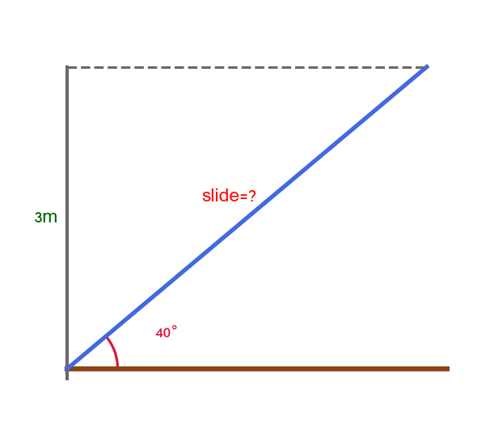

6. מפרש בצורת משולש ישר זווית.
הצלע האנכית (התורן) גבוהה
$3$
מ' וזווית הבסיס של המפרש היא
$50°$.
מצאו את אורך צלע ה"יתר" של המפרש.

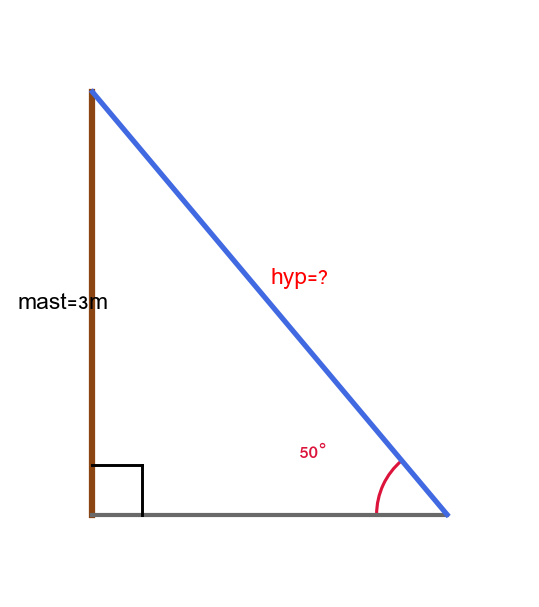

7. מדרגה בגרם מדרגות עולה
$20$
ס"מ לאורך ריצה של
$28$
ס"מ.
מצאו את זווית הנטייה של הגרם ביחס לאופקי.

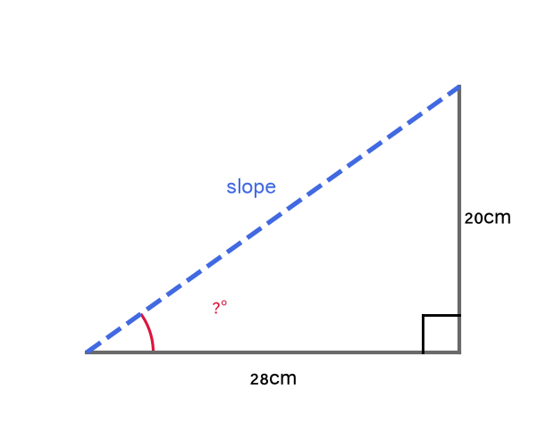

8. רכב עולה בכביש הררי בשיפוע של
$8°$
למרחק של
$200$
מ' לאורך הכביש.
מצאו את הגובה האנכי שהרכב עלה.

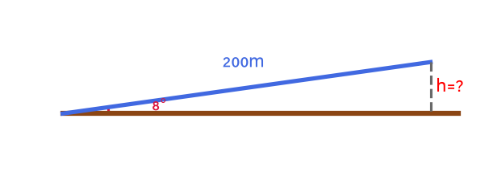

---

## רמה 2: תרגול שוטף ומשולב (8 תרגילים)

---

9. סולם באורך
$5$
מ' נשען על קיר כך שראשו נמצא בגובה
$4$
מ' מהקרקע.
א. מצאו את הזווית שהסולם יוצר עם הקרקע.
ב. כמה מטרים מרוחק תחתית הסולם מהקיר?
ג. אם רוצים לשים את הסולם גבוה יותר ב-
$50$
ס"מ, כמה יהיה קצרה המרחק של הסולם מהקיר?

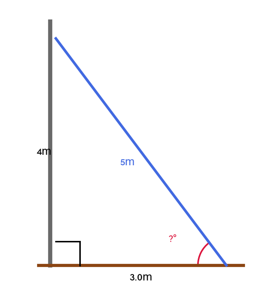

10. בניין גבוה זורק צל.
כאשר זווית השמש מהאופקי היא
$35°$,
אורך הצל הוא
$42$
מ'.
א. מצאו את גובה הבניין.
ב. מאוחר יותר הצל התקצר ל-
$28$
מ'. מהי זווית השמש החדשה?

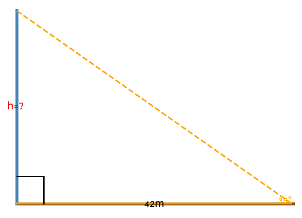

11. רמפת נכים חייבת לעמוד בתקן: שיפוע מרבי של
$5°$
וגובה מרבי של
$0.75$
מ'.
א. מה האורך המינימלי של הרמפה כדי לעמוד בתנאי הזווית?
ב. מה האורך המינימלי של הרמפה כדי לעמוד בתנאי הגובה?
ג. איזה תנאי הוא המגביל?

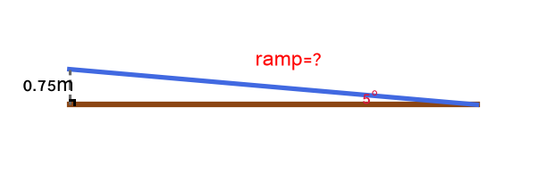

12. מסך טלוויזיה עם יחס צלעות
$16:9$
ואלכסון
$55$
אינצ'.
א. חשבו את רוחב המסך ואת גובהו.
(רמז: אם רוחב
$= 16k$
וגובה
$= 9k$,
מצאו את
$k$
מתוך משפט פיתגורס.)
ב. מה הזווית בין האלכסון לצלע הארוכה (הרוחב)?

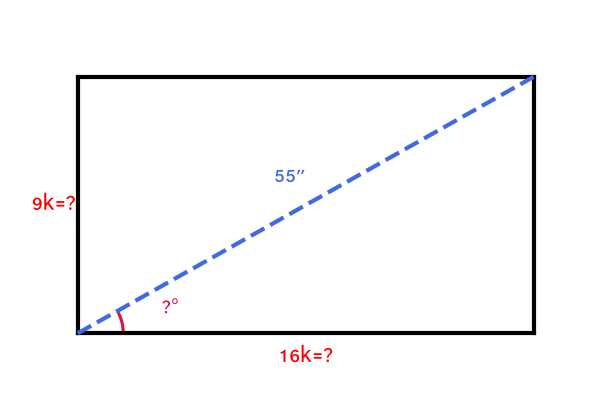

13. מפרש בצורת משולש שווה שוקיים. הבסיס של המפרש
$4$
מ' (צמוד לסיפון) וזווית הקודקוד היא
$50°$.
א. מצאו את אורכי השוקיים (צלעות המפרש).
ב. חשבו את שטח המפרש.

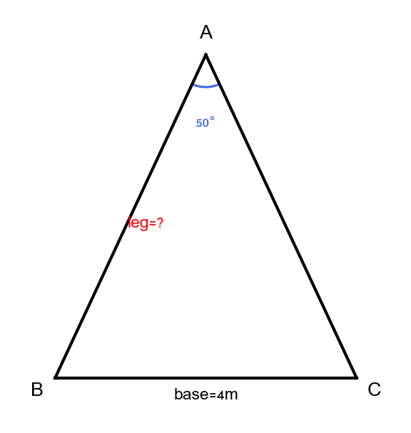

14. גרם מדרגות מחבר שתי קומות בהפרש גובה של
$3$
מ'.
כל מדרגה גבוהה
$17$
ס"מ.
זווית הגרם ביחס לאופקי היא
$34°$.
א. כמה מדרגות יש בגרם?
ב. מה אורך ה"ריצה" של כל מדרגה?
ג. מה אורך הגרם (ציר ה"יתר")?

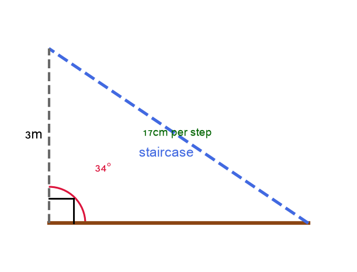

15. נקודת תצפית על צוק בגובה
$80$
מ' מעל פני הים.
זווית ההורדה (ממבטן) אל ספינה הוא
$12°$.
א. מצאו את המרחק האופקי בין בסיס הצוק לספינה.
ב. מה המרחק הישיר (קו אוויר) בין נקודת התצפית לספינה?

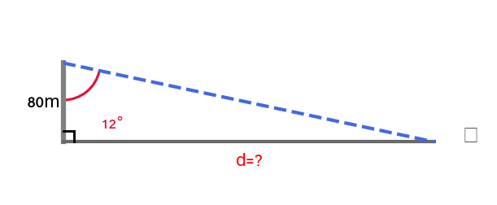

16. שתי בניינים עומדים זה מול זה.
גובה הבניין הגבוה
$48$
מ'.
זווית ההגבהה (זווית מבט למעלה) מראש הבניין הנמוך אל ראש הגבוה היא
$20°$
ומרחק אופקי בין הבניינים
$60$
מ'.
מצאו את גובה הבניין הנמוך.

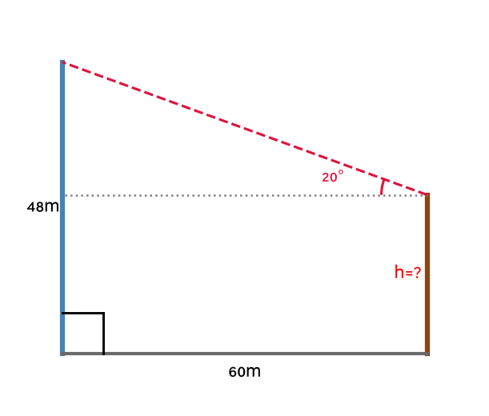

---

## רמה 3: רמת בחינת מה"ט (4 תרגילים)

---

17. מקור: מה"ט 2023

מגלשה בגן ילדים מורכבת ממישור משופע ישר.
נתונות הזוויות בתחתית ובראש המגלשה:
$$\angle bot = 28°, \quad \angle top = 90°$$
והמרחק האנכי מקרקע לפסגת המגלשה הוא
$2.4$
מ'.

א. מצאו את אורך המגלשה (המישור המשופע).

ב. מצאו את המרחק האופקי בין בסיס המגלשה לנקודה שמתחת לפסגתה.

ג. מתכננים להאריך את המגלשה בגורם של
$1.5$
(כלומר אורך המגלשה יגדל פי
$1.5$).
מה הגובה החדש של המגלשה?

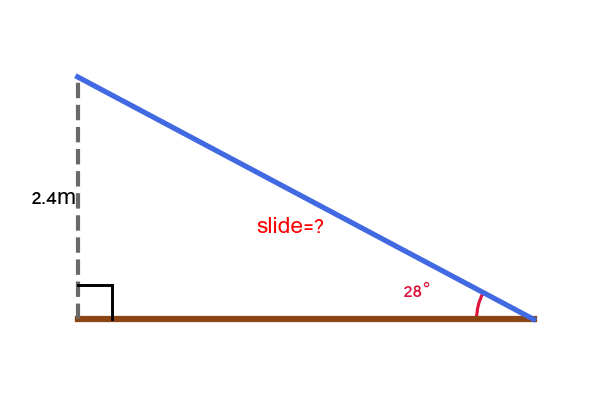

---

18. מקור: מה"ט 2023

סורג ביטחון נבנה כקיר משופע מברזל.
הסורג נשען מהתקרה לאורך
$3.5$
מ' ומגיע לקרקע במרחק אופקי של
$1.8$
מ' מהקיר האנכי.

א. מצאו את זווית הנטייה של הסורג ביחס לאופקי.

ב. מצאו את גובה נקודת ההיצמדות של הסורג בתקרה.

ג. עלות חומר הברזל הינה
$85$
₪ לכל מטר.
עלות הצביעה הינה
$40$
₪ לכל מטר.
עלות ההתקנה הינה
$320$
₪.
חשבו את העלות הכוללת של הסורג.

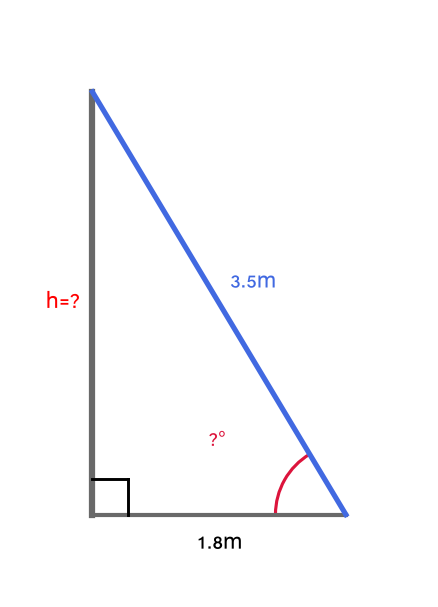

---

19. מקור: מה"ט 2024

צוות הנדסה מכין תוכנית לגשר מעל נחל.
הגשר יתחיל בגדה אחת בגובה
$0$
מ' ויסתיים בגדה השנייה בגובה
$4.5$
מ'.
המרחק האופקי בין שתי הגדות הוא
$18$
מ'.

א. מצאו את זווית הנטייה של הגשר ביחס לאופקי.

ב. מצאו את אורך הגשר.

ג. על כל מ"ר של הגשר יש לשים
$32$
ק"ג של בטון.
רוחב הגשר הוא
$3$
מ'.
כמה ק"ג בטון דרושים?
הציגו את התשובה בסימון מדעי.

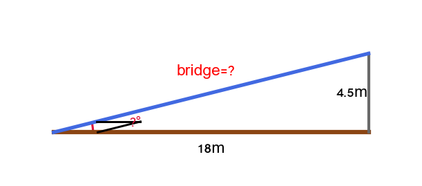

---

20. מקור: מה"ט 2025

מגרש ספורט בצורת מלבן עם אלכסון באורך
$52$
מ'.
האלכסון יוצר זווית של
$38°$
עם הצלע הארוכה.

א. מצאו את ממדי המגרש (אורך ורוחב).

ב. מציבים תורן דגל בפינת המגרש. חוט מתיחה מחבר את ראש התורן לפינה השנייה (לאורך הצלע הארוכה) ויוצר זווית של
$25°$
עם הקרקע.
מצאו את גובה התורן.

ג. עלות גידור המגרש היא
$85$
₪ למטר.
עלות ריצוף הרצפה היא
$120$
₪ למ"ר.
חשבו את העלות הכוללת.

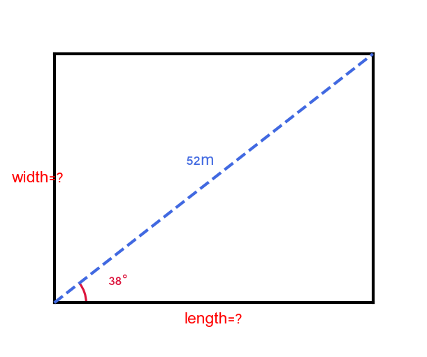

---

תשובות סופיות

1. $h = 6\sin 65° \approx 5.44$מ'
2. $h = 8\sin 12° \approx 1.66$מ'
3. א. רוחב$50\cos 28° \approx 44.13$אינצ' ב. גובה$50\sin 28° \approx 23.47$אינצ'
4. גובה$5\tan 40° \approx 4.20$מ'
5. אורך מגלשה$\frac{3}{\sin 40°} \approx 4.67$מ'
6.

$$\dfrac{3}{\sin 50^{\circ}}\approx 3{,}92$$
מ' ליתר.

7.

$$\arctan\left(\dfrac{20}{28}\right)\approx 35{,}54^{\circ}$$

8.

$$200\sin(8^{\circ})\approx 27{,}83$$
מ'.

9. א. $\arcsin(4/5) \approx 53.13°$ ב. $3$מ' ג. בגובה$4.5$מ':$\sqrt{5^2 - 4.5^2} \approx 2.18$מ'; הסולם מתקרב בכ-$0.82$מ'
10. א. $42\tan 35° \approx 29.40$מ' ב.$\arctan(29.40/28) \approx 46.4°$
11. א. $0.75/\sin 5° \approx 8.60$מ' ב. 8.60$ מ' (אותו חישוב) ג. שני התנאים נותנים אותו תוצאה; הגובה הוא המגביל
12. א. $55/\sqrt{337} \approx 2.996$; רוחב$\approx 47.93$אינצ', גובה$\approx 26.96$אינצ' ב.$\arctan(9/16) \approx 29.36°$
13. \frac{1}{2} \cdot 4 \cdot 2\tan 65° \approx \frac{1}{2} \cdot 4 \cdot 4.29 \approx 8.58$ מ"ר
14. א. $3 / 0.17 \approx 17.6 \approx 18$מדרגות ב. $17\cos(\arctan(17/run))$... ריצה$17/\tan 34° \approx 17/0.6745 \approx 25.2$ס"מ ג. אורך גרם$3/\sin 34° \approx 5.37$מ'
15. א. מרחק אופקי$80/\tan 12° \approx 376.4$מ' ב. $\sqrt{80^2 + 376.4^2} \approx 385.8$מ'
16. 48 - 21.83 \approx 26.17$ מ'
17. א. אורך מגלשה$2.4/\sin 28° \approx 5.11$מ' ב. מרחק אופקי$2.4/\tan 28° \approx 4.51$מ' ג. 7.67\sin 28° \approx 3.60$ מ'
18. א. $\arctan(3.00/1.80) \approx 59.0°$ ב. גובה$\approx 3.00$מ' ג. 757.5$ ₪
19. א. $\arctan(4.5/18) \approx 14.04°$ ב. \sqrt{344.25} \approx 18.55$ מ' ג. 55.65 \times 32 \approx 1{ }780.8$ק"ג$\approx 1.78 \times 10^3$ ק"ג
20. א. 52\sin 38° \approx 32.02$ מ' ב. גובה תורן$40.98\tan 25° \approx 19.11$מ' ג. 157{ }440$₪; סה"כ$\approx 169{ }850$ ₪

