# יחידה 6.2 – שאלות מה"ט מלאות

שאלות אלה מדמות את פורמט השאלות בבחינת מה"ט (שאלון 99913).
כל שאלה מכילה מספר סעיפים הבונים זה על זה.

---

## רמה 1: בניית ביטחון (8 תרגילים)

---

1. נתון משולש ישר זווית ABC כאשר
$\angle C = 90°$,
$AB = 20$
ס"מ ו-
$\angle A = 32°$.

א. מצאו את BC.

ב. מצאו את AC.

ג. חשבו את שטח המשולש.

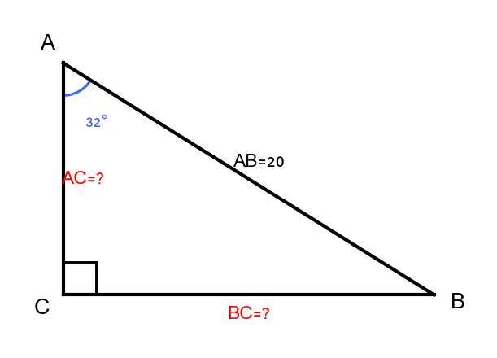

---

2. נתון מלבן ABCD כאשר
$AB = 9$
ס"מ ו-
$BC = 12$
ס"מ.

א. מצאו את אורך האלכסון AC.

ב. מצאו את הזווית
$\angle BAC$.

ג. חשבו את היקף המלבן.

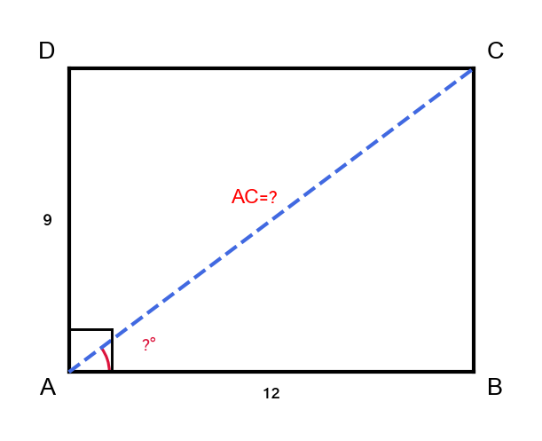

---

3. נתון מעוין ABCD עם צלע
$8$
ס"מ וזווית חדה
$50°$.

א. מצאו את אורכי שני האלכסונים.

ב. חשבו את שטח המעוין.

ג. חשבו את היקף המעוין.

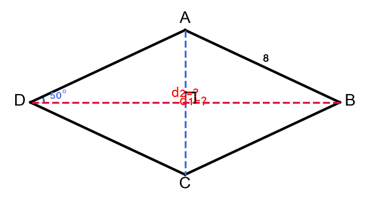

---

4. נתון טרפז שווה שוקיים עם
$$B = 32 \text{cm}, \quad b = 18 \text{cm}, \quad \alpha = 55°$$

א. מצאו את הגובה.

ב. מצאו את אורך השוקיים.

ג. חשבו את שטח הטרפז.

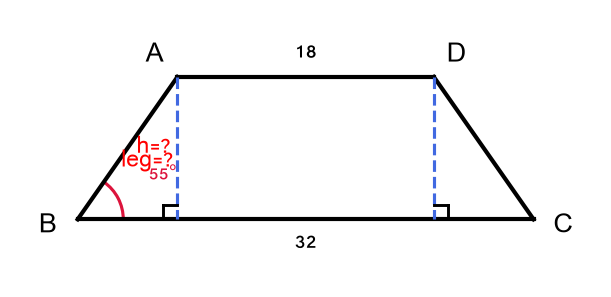

---

5. סולם באורך
$10$
מ' נשען על קיר.
ראש הסולם מגיע לגובה של
$8$
מ'.

א. מצאו את הזווית שהסולם יוצר עם הקרקע.

ב. מצאו את המרחק של תחתית הסולם מהקיר.

ג. אם מזיזים את בסיס הסולם
$1$
מ' קרוב יותר לקיר, מה הגובה החדש?

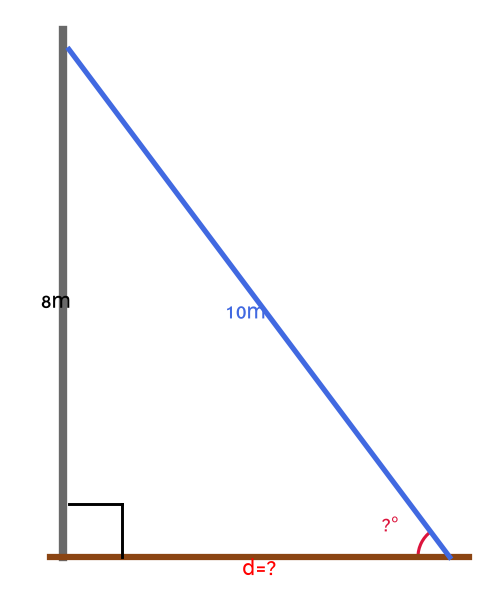

---

6. נתון משולש שווה שוקיים ABC עם
$AB = AC = 15$
ס"מ ו-
$BC = 18$
ס"מ.

א. מצאו את הגובה מ-A אל BC.

ב. מצאו את
$\angle ABC$.

ג. חשבו את שטח המשולש.

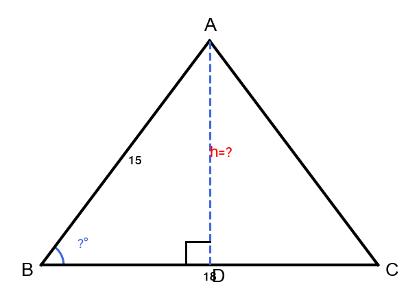

---

7. נתון מלבן שאורך אלכסונו
$26$
ס"מ וזווית
$\angle BAC = 42°$.

א. מצאו את צלעות המלבן.

ב. חשבו את שטח המלבן ואת היקפו.

ג. נקודה M היא אמצע האלכסון.
מצאו את המרחק מ-M לכל פינה.

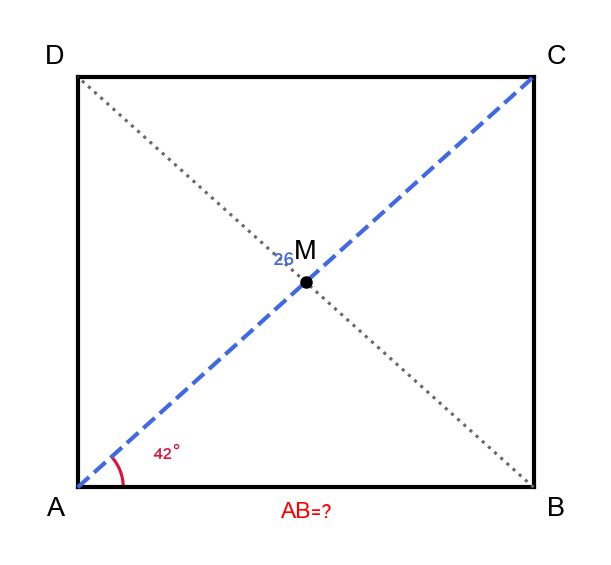

---

8. נתון טרפז שווה שוקיים עם שטח
$220$
ס"מ², גובה
$11$
ס"מ ובסיס ארוך
$26$
ס"מ.

א. מצאו את הבסיס הקצר.

ב. מצאו את אורך השוק.

ג. מצאו את הזווית שהשוק יוצר עם הבסיס הארוך.

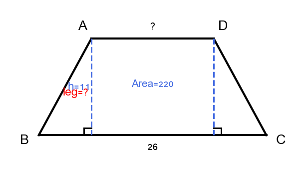

---

## רמה 2: תרגול שוטף ומשולב (8 תרגילים)

---

9. נתון משולש ישר זווית ABC כאשר
$\angle C = 90°$,
$AB = 17$
ס"מ ו-
$BC = 8$
ס"מ.
נקודה D על AC כך ש-
$BD \perp AC$.

א. מצאו את AC ואת הזוויות
$\angle A$
ו-
$\angle B$.

ב. מצאו את BD, AD ו-DC.

ג. חשבו את שטח משולש ABD ואת שטח משולש BDC.
האם שני השטחים מסתכמים לשטח ABC?

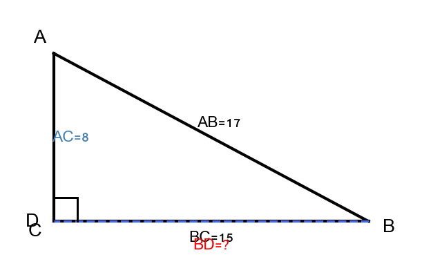

---

10. נתון מלבן ABCD כאשר
$\angle ABD = 55°$
ו-
$BD = 18$
ס"מ
(BD הוא אלכסון).

א. מצאו את צלעות המלבן.

ב. נקודה M היא מפגש האלכסונים.
מצאו את היחס
$\frac{AM}{MD}$.

ג. מצאו את הזווית
$\angle AMD$.

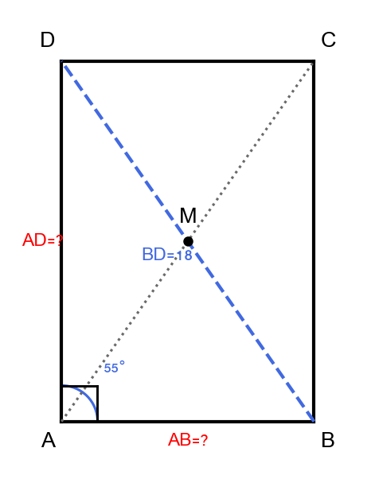

---

11. נתון מעוין ABCD כאשר
$AB = 13$
ס"מ ואלכסון
$AC = 24$
ס"מ (האלכסון הארוך).

א. מצאו את האלכסון BD.

ב. מצאו את הזווית החדה של המעוין.

ג. חשבו את שטח המעוין ואת היקפו.

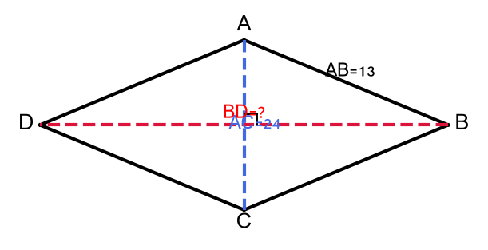

---

12. נתון טרפז שווה שוקיים ABCD עם
$AD \parallel BC$.
$$AD = 10 \text{cm}, \quad AB = 13 \text{cm}, \quad \angle ABC = 67.4°$$

א. מצאו את הגובה.

ב. מצאו את BC.

ג. מצאו את אורך האלכסון AC.

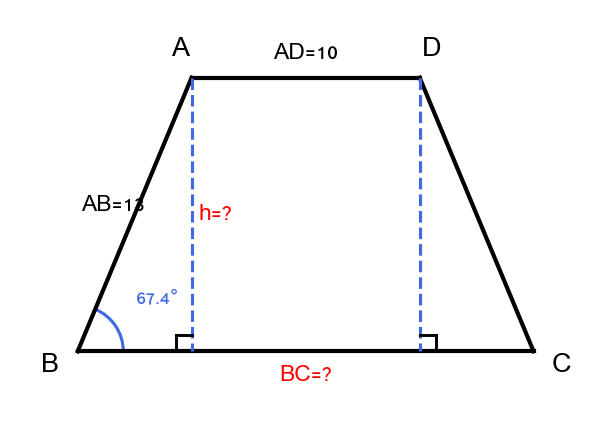

---

13. בניין זורק צל כאשר זווית השמש היא
$28°$.
מודדים ומגלים שהצל ארוך
$63.2$
מ'.
בצד השני של הבניין עומד עץ שגובהו
$8$
מ'.

א. מצאו את גובה הבניין.

ב. כאשר זווית השמש תהיה
$45°$,
מה יהיה אורך צל הבניין?

ג. כמה מטרים ארוך צל הבניין מצל העץ כאשר זווית השמש
$45°$?

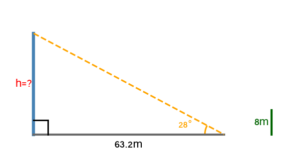

---

14. נתון משולש שווה שוקיים ABC עם
$AB = AC = 25$
ס"מ וזווית קודקוד
$\angle BAC = 50°$.

א. מצאו את BC ואת הגובה.

ב. נקודה D נמצאת על BC כך ש-
$AD \perp BC$.
מצאו את BD.

ג. נקודה E נמצאת על AB כך ש-
$DE \perp AB$.
מצאו את DE.

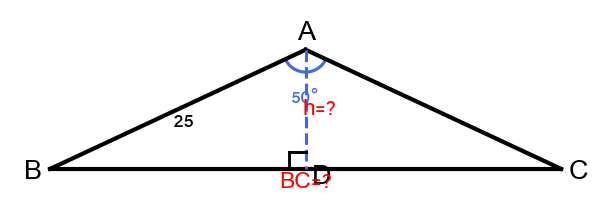

---

15. נתון מלבן ABCD שאלכסונו
$AC = 20$
ס"מ ו-
$\angle BAC = 36°$.

א. מצאו את צלעות המלבן ואת שטחו.

ב. נקודה P על הצלע CD כך ש-
$AP \perp CD$.
מצאו את AP.

ג. חשבו את שטח משולש APC.

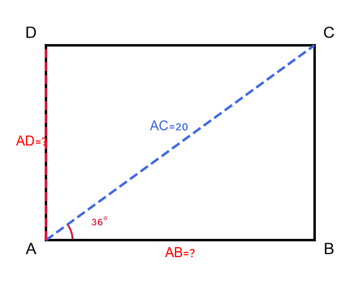

---

16. נתון טרפז כללי ABCD עם
$AB \parallel DC$.
$$AB = 20 \text{m}, \quad AD = 15 \text{m}, \quad BC = 25 \text{m}, \quad \angle ADC = 60°$$

מורידים גבהים AE ו-BF אל DC.

א. מצאו את הגובה AE ואת DE.

ב. מצאו את FC.

ג. מצאו את DC ואת שטח הטרפז.

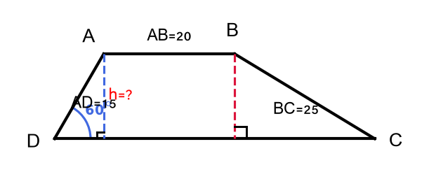

---

## רמה 3: רמת בחינת מה"ט (4 תרגילים)

---

17. מקור: מה"ט קיץ 2023 א'

מגלשה בגן ילדים בנויה כך שהמישור המשופע יוצר זווית עם הקרקע.
$$\angle ground = 28°, \quad T = 2.4 \text{m}$$

א. מצאו את אורך המגלשה (המישור המשופע).

ב. מצאו את המרחק האופקי בין בסיס המגלשה לנקודה שמתחת לפסגה.

ג. מתכנן הגן רוצה להגדיל את אורך המגלשה בגורם של
$1.5$.
מה הגובה החדש של המגלשה?
מה הזווית החדשה של המגלשה עם הקרקע?

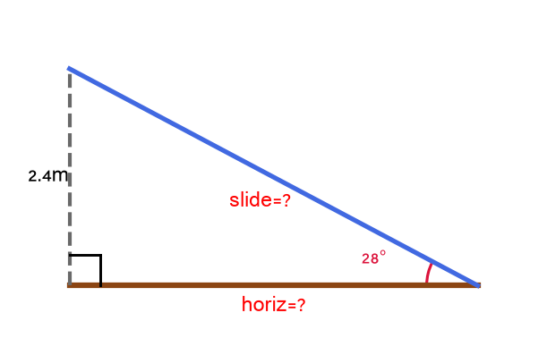

---

18. מקור: מה"ט אביב 2024 ב'

נתון טרפז שווה שוקיים ABCD כאשר
$AD \parallel BC$
(AD הוא הבסיס הקצר).
נקודות G ו-H הן רגלי הגבהים מ-A ומ-D בהתאמה אל BC.
$$AD = 12 \text{cm}, \quad BC = 48 \text{cm}, \quad \angle DCB = 40°$$

א. חשבו את שטח הטרפז ABCD ואת שטח המלבן AGHD.

ב. חשבו את היקף משולש DHC.

ג. מצאו את אורך האלכסון AC.

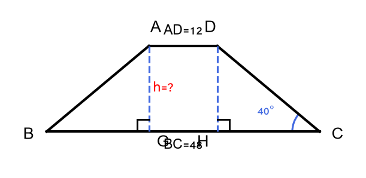

---

19. מקור: מה"ט קיץ 2024 ב'

מפרש סירה בצורת משולש ABC מורכב משני חלקים:
$$\triangle ABC = \triangle ABD + \triangle ACD$$
כאשר
$AD \perp BC$
(AD הוא הגובה ממ-A אל BC).
$$CD = 4.7 \text{m}, \quad \angle ACD = 55°, \quad \angle ABD = 38°$$

א. מצאו את AD, BD ואת שטח כל אחד משני המשולשים.
חשבו את שטח המפרש כולו.

ב. עלות בד המפרש היא
$142$
₪ למ"ר.
עלות מוט BC (בסיס המפרש) היא
$52$
₪ למטר.
עלות ההתקנה הינה
$650$
₪.
חשבו את העלות הכוללת של המפרש.

ג. הציגו את שטח המפרש ואת העלות הכוללת בסימון מדעי.

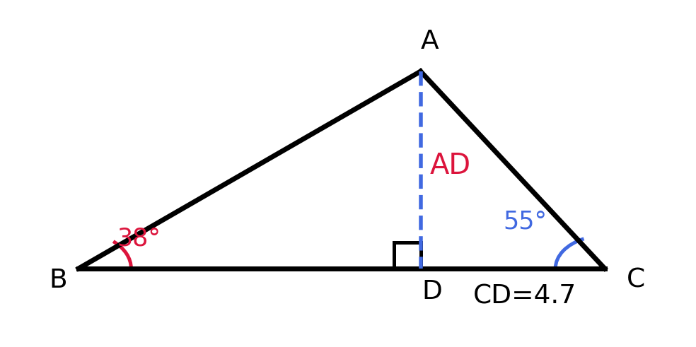

---

20. מקור: מה"ט קיץ 2025 א'

נתון מעוין ABCD כאשר
$$AB = 10.3 \text{cm}, \quad \angle ABC = 128°$$
נקודה E היא רגל הגובה מ-C אל הישר המכיל את AB (מורחב מעבר ל-B),
ונקודה F היא רגל הגובה מ-D אל הישר המכיל את AB.
מרובע CEDF הוא מלבן.

א. מצאו את האלכסונים AC ו-BD.

ב. חשבו את שטח המעוין ABCD.

ג. חשבו את שטח המלבן CEDF ואת היקפו.
מה הקשר בין שטח המלבן לשטח המעוין? הסבירו מדוע.

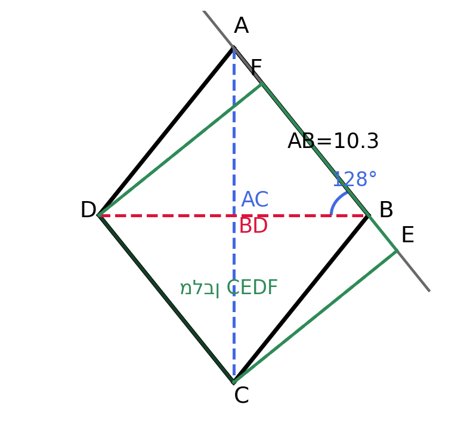

---

תשובות סופיות

1. א. $BC = 20\sin 32° \approx 10.60$ס"מ ב. $AC = 20\cos 32° \approx 16.96$ס"מ ג. שטח$\approx 89.88$ס"מ²
2. א. 15$ ס"מ ב. $\angle BAC = \arctan(12/9) \approx 53.13°$ ג. היקף$42$ס"מ
3. א. 2 \cdot 8\sin 25° \approx 6.76$ ס"מ ב. שטח$64\sin 50° \approx 49.03$ס"מ² ג. היקף$32$ס"מ
4. \frac{1}{2}(32 + 18) \cdot 9.99 \approx 249.8$ ס"מ²
5. א. $\arcsin(8/10) \approx 53.13°$ ב. $6$מ' ג. \sqrt{75} \approx 8.66$ מ'
6. א. 12$ ס"מ ב. $\angle ABC = \arccos(9/15) \approx 53.13°$ ג. 108$ ס"מ²
7. א. 26\sin 42° \approx 17.40$ ס"מ ב. שטח$\approx 336.2$ס"מ², היקף$\approx 73.44$ס"מ ג. $AM = 13$ס"מ (חצי אלכסון)
8. א. x = 14$ס"מ ב. $\sqrt{157} \approx 12.53$ס"מ ג.$\arctan(11/6) \approx 61.4°$
9. א. $\arcsin(8/17) \approx 28.07°$;$\angle B \approx 61.93°$ ב. 8^2/17 \approx 3.76$ ס"מ ג. שטח ABD$\approx \frac{1}{2} \cdot 13.24 \cdot 7.06 \approx 46.74$ס"מ²; שטח BDC$\approx \frac{1}{2} \cdot 3.76 \cdot 7.06 \approx 13.27$ס"מ²; סה"כ$60$✓
10. א. 18\sin 55° \approx 14.74$ ס"מ ב. $AM/MD = 1$(M אמצע שני האלכסונים) ג. 70°$(ב$\triangle ABM$ שווה שוקיים)
11. א. 10$ ס"מ ב. $\theta \approx 45.24°$ ג. 52$ ס"מ
12. \sqrt{369} \approx 19.21$ ס"מ
13. א. $h = 63.2\tan 28° \approx 33.65$מ' ב. $33.65$מ' ג. 25.65$ מ'
14. BD\sin 65° \approx 9.57$ ס"מ
15. א. 20\sin 36° \approx 11.76$ס"מ; שטח$\approx 190.2$ ס"מ² ב. 11.76$ ס"מ (גובה המלבן) ג. \frac{1}{2} \cdot 16.18 \cdot 11.76 \approx 95.1$ ס"מ²
16. א. 7.5$ מ' ב. \sqrt{625 - 168.7} \approx 21.38$ מ' ג. \frac{1}{2}(20 + 48.88) \cdot 12.99 \approx 447.2$ מ"ר
17. א. אורך מגלשה$2.4/\sin 28° \approx 5.11$מ' ב. מרחק אופקי$2.4/\tan 28° \approx 4.51$מ' ג. 7.67\sin 28° \approx 3.60$מ'; הזווית נשארת$28°$ (הגובה והאורך גדלים באותו יחס)
18. \sqrt{30^2 + 15.12^2} \approx 33.59$ ס"מ
19. 6{ }331.78 + 691.08 + 650 \approx 7{ }672.86$₪ ג. שטח$\approx 4.459 \times 10^1$מ"ר; עלות$\approx 7.673 \times 10^3$ ₪
20. $52°$; א.$AC = 2 \times 10.3 \times \cos 26° \approx 18.52$ס"מ;$BD = 2 \times 10.3 \times \sin 26° \approx 9.03$ס"מ ב. שטח מעוין$10.3^2 \times \sin 52° \approx 83.6$ס"מ² ג. מלבן CEDF: רוחב$10.3$ס"מ, גובה$10.3\sin 52° \approx 8.12$ס"מ; שטח$\approx 83.6$ס"מ² (שווה לשטח המעוין!); היקף$2(10.3 + 8.12) \approx 36.84$ס"מ; שטח המלבן שווה לשטח המעוין כי לשניהם אותה בסיס (10.3 ס"מ) ואותו גובה ($10.3\sin 52°$)

