# תת-נושא 10: השוואת קצבים — זיהוי ויזואלי וחישובי של הקצב הגדול/קטן ביותר

עיקרון: ככל שהגרף **תלול יותר** (שינוי גדול ב-y לכל שינוי קטן ב-x), כך הקצב **גדול יותר**.

$$|\text{rate}| = \left|\frac{\Delta y}{\Delta x}\right|$$

---

## רמה 1: בניית ביטחון (8 תרגילים)

**1.** גרף מתאר כמות מים (ליטרים) לפי זמן (דקות).
שני קטעים ליניאריים:

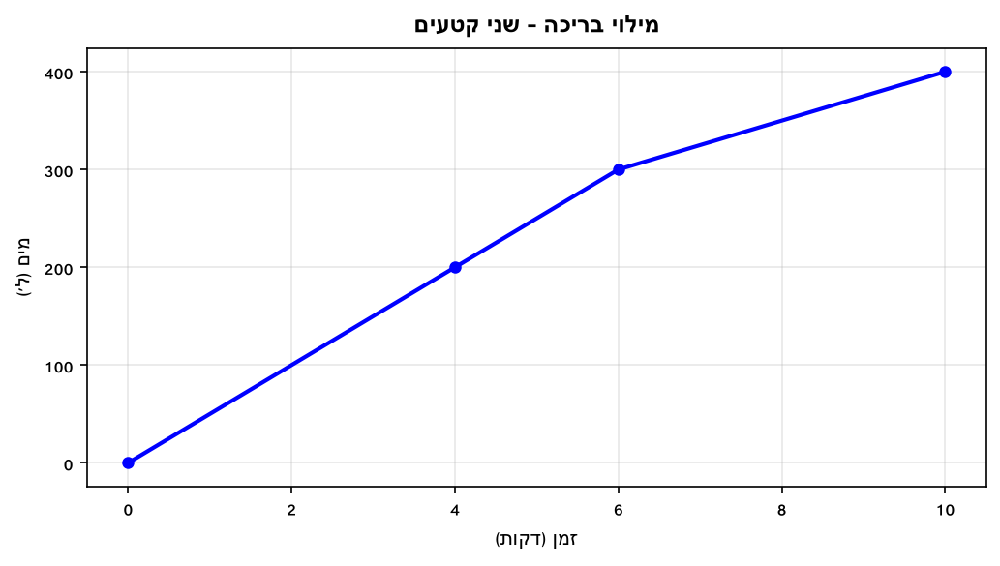

א. חשבו את קצב השינוי בכל קטע.

ב. באיזה קטע המילוי מהיר יותר?

---

**2.** גרף מתאר מרחק (ק"מ) לפי זמן (שעות).

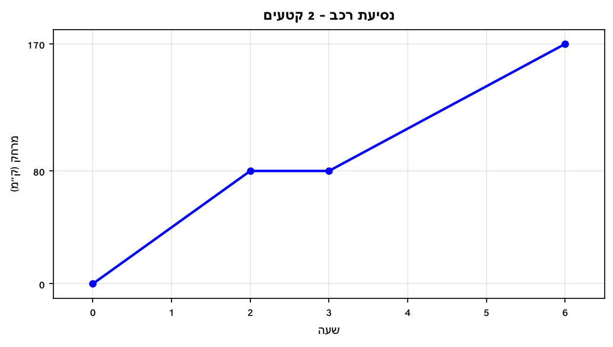

א. חשבו מהירות בכל קטע.

ב. בשלב מה הרכב נסע מהר יותר?

---

**3.** גרף מתאר גובה (ס"מ) של ילד לפי גיל (שנים).

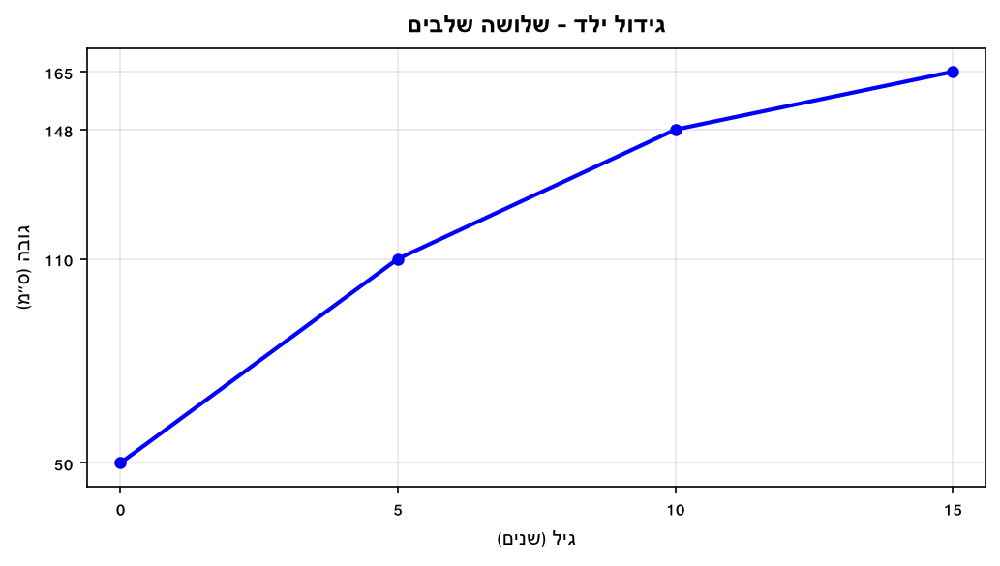

א. חשבו קצב גדילה (ס"מ לשנה) בכל תקופה.

ב. באיזו תקופה הילד גדל הכי מהר?

---

**4.** גרף מתאר טמפרטורה (°C) לפי שעות.
שלושה קטעים:

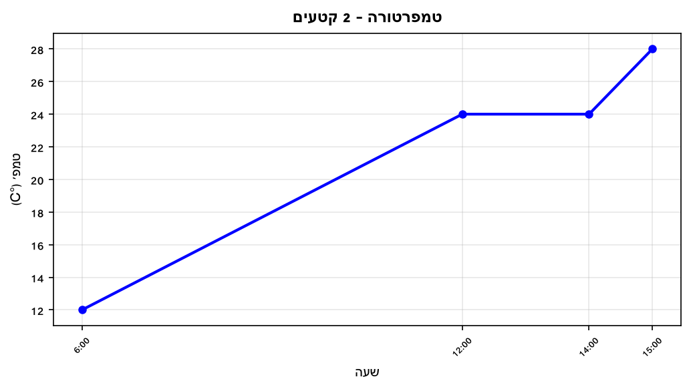

א. חשבו קצב עליית הטמפרטורה בכל קטע.

ב. בשלב מה הטמפרטורה עלתה מהר יותר?

---

**5.** גרף מתאר מחיר מניה (₪) לפי ימים.

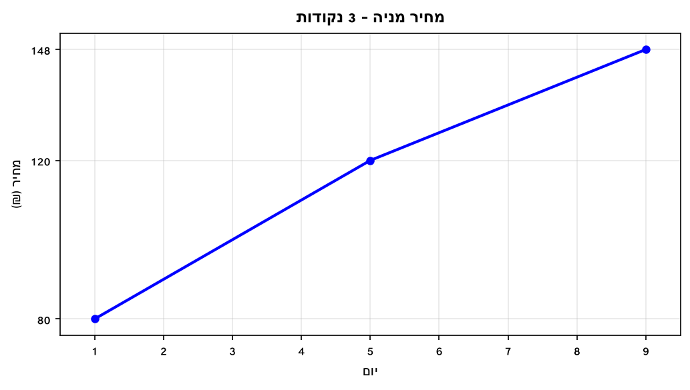

א. מהו קצב עלייה ממוצע בין יום 1 ל-5?

ב. מהו קצב עלייה ממוצע בין יום 5 ל-9?

ג. בשלב מה המחיר עלה מהר יותר?

---

**6.** גרף מתאר מילוי שני מיכלים שונים.

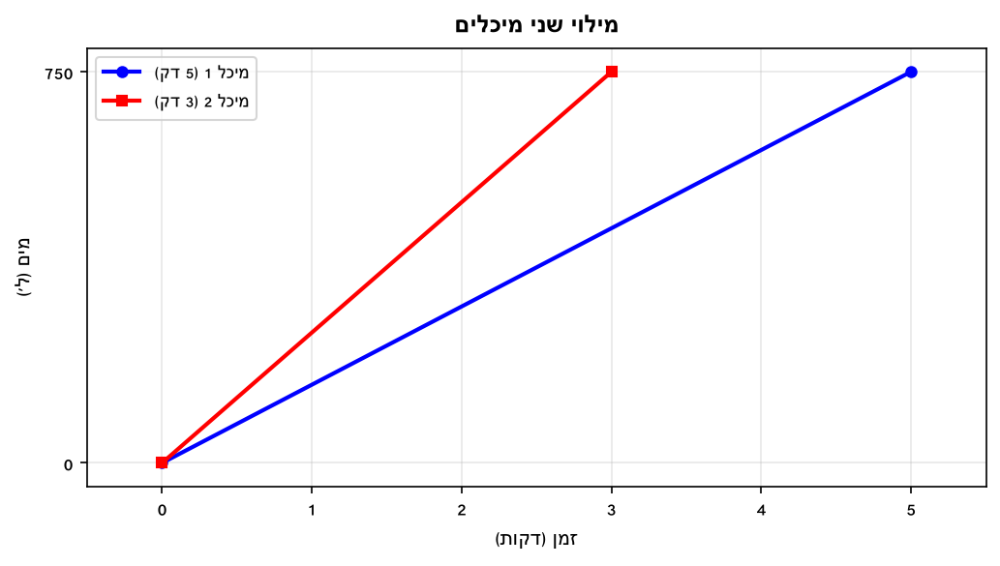

א. חשבו את קצב מילוי כל מיכל.

ב. איזה מיכל מתמלא מהר יותר?

---

**7.** גרף מתאר ריקון מיכלים.

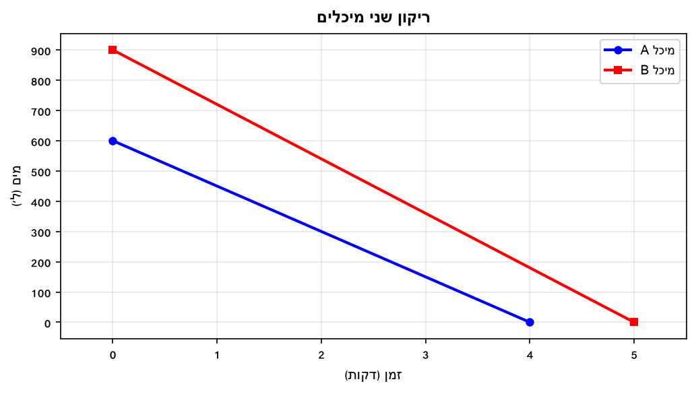

א. חשבו קצב ריקון כל מיכל.

ב. איזה מיכל מתרוקן מהר יותר?

---

**8.** גרף מתאר הכנסות (₪ אלפים) לפי חודשים.

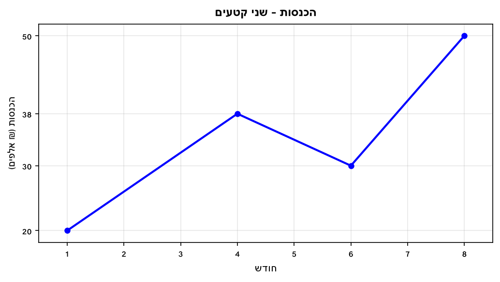

א. חשבו קצב גידול הכנסות בכל קטע.

ב. בשלב מה ההכנסות גדלו מהר יותר?

---

## רמה 2: תרגול שוטף ומשולב (8 תרגילים)

**9.** גרף מתאר מרחק (ק"מ) של רכב לפי שעות.

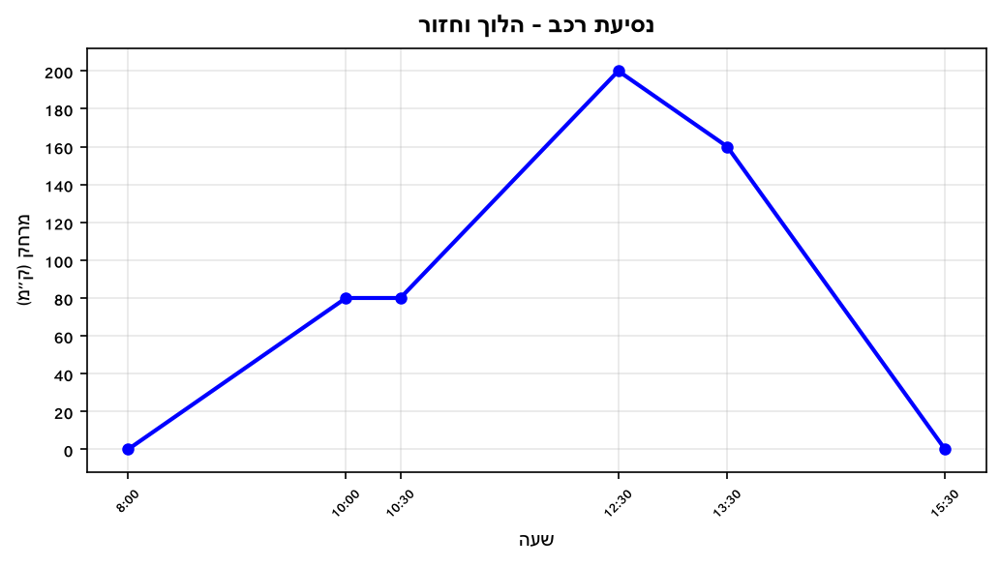

א. חשבו מהירות בכל קטע תנועה (כולל קטע חזרה).

ב. בשלב מה הרכב נסע במהירות הגבוהה ביותר?

ג. בשלב מה שינוי המרחק מנקודת המוצא היה הגדול ביותר (בערכו המוחלט)?

---

**10.** גרף מתאר כמות מים (ל') בבריכה לאורך 32 דקות.

א. חשבו קצב שינוי (ל/דקה) בכל קטע.

ב. בשלב מה קצב המילוי הגדול ביותר?

ג. בשלב מה קצב הריקון הגדול ביותר?

---

**11.** גרף מתאר מסלול ריצה:

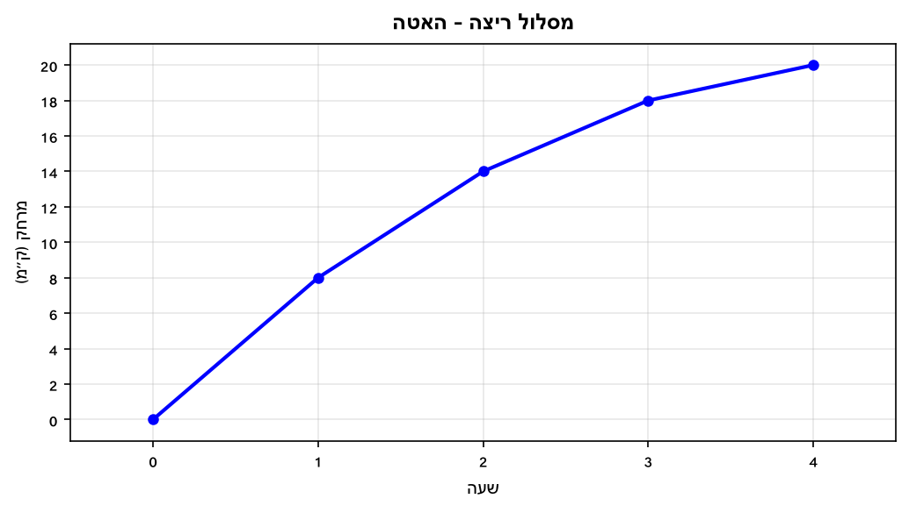

א. חשבו מהירות בכל שעה.

ב. האם הרץ האיץ, האט, או נע בקצב קבוע?

ג. בשלב מה הרץ נע מהר יותר — בשעה הראשונה או בשעה הרביעית?

---

**12.** גרף מתאר גידול ילד לפי גיל:

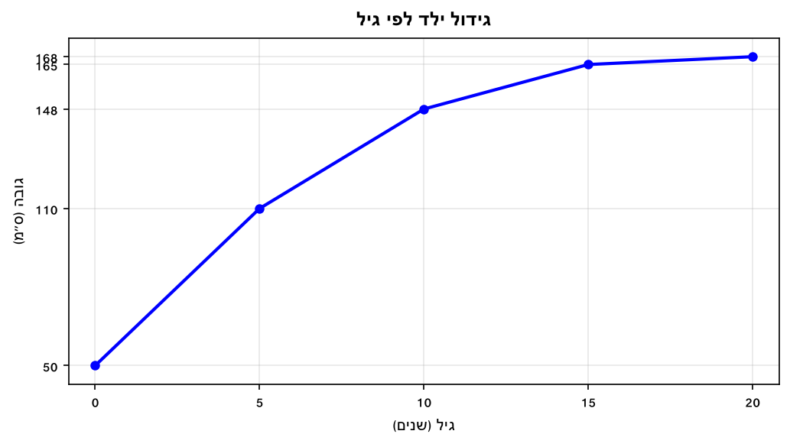

א. חשבו קצב גדילה בכל קטע (ס"מ לשנה).

ב. בין אילו גילאים הקצב גבוה ביותר?

ג. בין אילו גילאים הקצב נמוך ביותר?

---

**13.** שני שחיינים מתחרים. לכל שחיין גרף זמן (שניות) לפי מספר סיבוב.

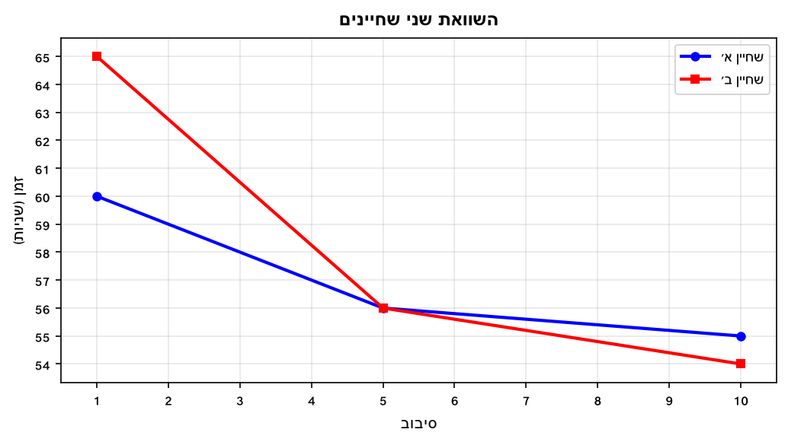

א. מי השתפר יותר בין סיבוב 1 לסיבוב 5?

ב. מי השתפר יותר בין סיבוב 5 לסיבוב 10?

ג. מי השתפר יותר בסך הכל (מסיבוב 1 ל-10)?

---

**14.** גרף מתאר מחיר מניה לאורך 10 ימים.

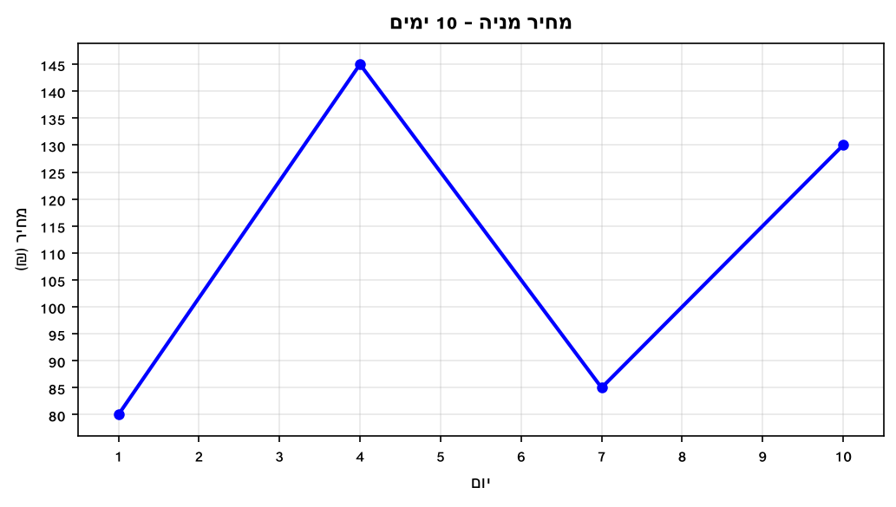

א. חשבו קצב שינוי בכל קטע.

ב. בשלב מה קצב השינוי בערכו המוחלט הגדול ביותר?

---

**15.** גרף מתאר כמות עובדים בחברה לפי שנים.

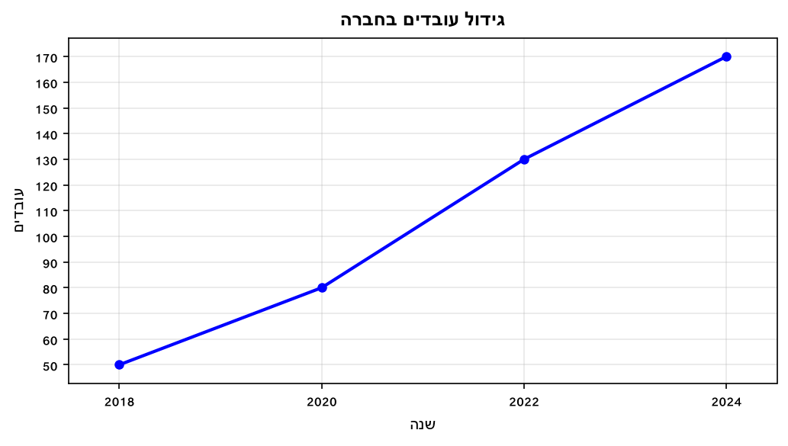

א. חשבו קצב גידול (עובדים לשנה) בכל קטע.

ב. בשלב מה החברה גייסה עובדים בקצב הגבוה ביותר?

---

**16.** גרף מתאר ריצה של שלושה ספורטאים לאותה מרחק של 10 ק"מ.

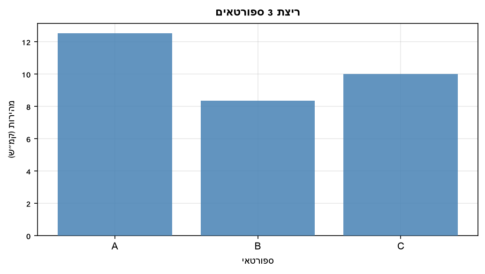

א. חשבו מהירות ממוצעת של כל ספורטאי.

ב. דרגו מהיר לאיטי.

ג. בכמה קמ"ש ספורטאי A מהיר יותר מספורטאי B?

---

## רמה 3: רמת בחינת מה"ט (4 תרגילים)

**17.** הגרף הבא מתאר את המרחק (מטרים) של שליח פיצה מנקודת ה-0 לפי זמן (דקות).
(מבוסס על שאלה 6, אביב מועד ב' 2024)

א. חשבו קצב שינוי (מ/דקה) בכל קטע.

ב. בין אילו זמנים קצב השינוי (בערך מוחלט) הוא הגדול ביותר?

ג. בין אילו זמנים קצב השינוי הוא הנמוך ביותר (מלבד עצירות)?

ד. מה פירוש הקצב השלילי (בין דקה 54 לדקה 79)?

---

**18.** הגרף הבא מתאר את המרחק (ק"מ) של דניאלה על רולרבליידס לפי שעה.
(מבוסס על שאלה 7, קיץ מועד א' 2024)

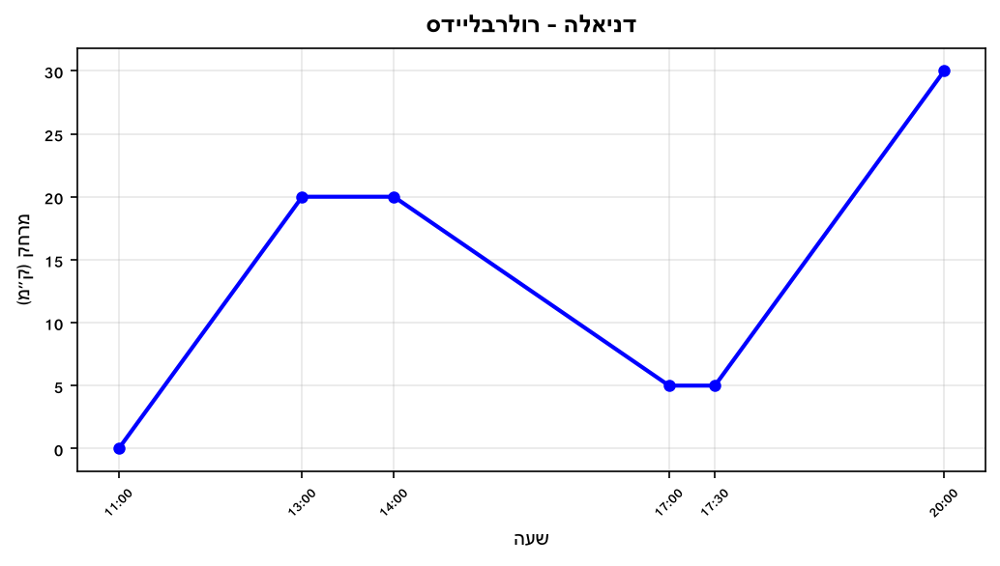

א. חשבו קצב שינוי בכל קטע תנועה.

ב. באילו שעות קצב השינוי (בערך מוחלט) הוא הגדול ביותר?

ג. האם קצב השינוי בין 17:30 ל-20:00 שווה לקצב בין 11:00 ל-13:00?

ד. מה פירוש הקצב השלילי בין 14:00 ל-17:00?

---

**19.** גרף מתאר גובה (ס"מ) של מיכל לפי גיל.

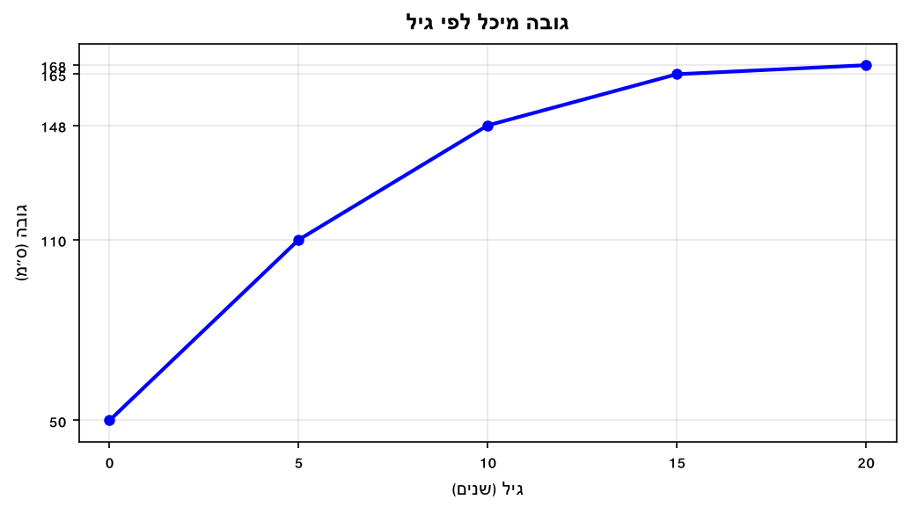

א. חשבו קצב גדילה בכל תקופת חיים.

ב. בין אילו גילאים קצב הגדילה הגדול ביותר? ומה הוא?

ג. קבעו ונמקו אם הטענה הבאה נכונה:
"קצב גדילתה של מיכל בין גיל 10 ל-15 גדול יותר מקצב גדילתה בין גיל 15 ל-20."

---

**20.** הגרף הבא מתאר את טמפרטורת גוף חולה לאורך 8 שעות.
(מבוסס על שאלה 8, קיץ מועד ב' 2024)

א. חשבו קצב שינוי (°C לשעה) בכל קטע.

ב. בין אילו שעות קצב העלייה בטמפרטורה הגדול ביותר?

ג. קבעו ונמקו: האם קצב ירידת החום בין 14:00 ל-16:00 גדול או קטן מהקצב בין 16:00 ל-18:00?

ד. בין אילו שעות קצב השינוי בטמפרטורה (בערך מוחלט) גדול ביותר מבין כל הקטעים?

---

תשובות סופיות

1.
א. קטע 0–6:
$50$
ל/דקה. קטע 6–10:
$25$
ל/דקה.
ב. קטע A (0–6) מהיר יותר ($50 > 25$).

2.
א. 0–2:
$40$
קמ"ש. 2–3:
$0$
(עצירה). 3–6:
$30$
קמ"ש.
ב. קטע A (40 > 30).

3.
א. 0–5:
$12$
ס"מ/שנה. 5–10:
$7.6$
ס"מ/שנה. 10–15:
$3.4$
ס"מ/שנה.
ב. 0–5 (12 ס"מ/שנה).

4.
א. 6–12:
$2$
°C/שעה. 12–14:
$0$
. 14–15:
$4$
°C/שעה.
ב. קטע 14–15 (4 > 2).

5.
א. ימים 1–5:
$10$
₪/יום.
ב. ימים 5–9:
$7$
₪/יום.
ג. בין יום 1 ל-5 (10 > 7).

6.
א. מיכל 1:
$150$
ל/דקה. מיכל 2:
$250$
ל/דקה.
ב. מיכל 2.

7.
א. מיכל A:
$150$
ל/דקה. מיכל B:
$180$
ל/דקה.
ב. מיכל B (180 > 150).

8.
א. 1–4:
$6$
אלפי ₪/חודש. 4–6:
$-4$
(ירידה). 6–8:
$10$
אלפי ₪/חודש.
ב. חודשים 6–8 ($10 > 6$).

9.
א. 8–10: 40 קמ"ש. 10–10:30: 0 (עצירה). 10:30–12:30: 60 קמ"ש. 12:30–13:30:
$-40$
קמ"ש (חזרה). 13:30–15:30:
$80$
קמ"ש (חזרה).
ב. בין 13:30 ל-15:30 (80 קמ"ש — גם בחזרה).
ג. 13:30–15:30 (שינוי של 160 ק"מ, בערך מוחלט).

10.
א. 0–8:
$30$
ל/דקה. 8–12:
$10$
ל/דקה. 12–16:
$0$
. 16–32:
$-30$
ל/דקה.
ב. 0–8: 30 ל/דקה.
ג. 16–32: 30 ל/דקה (מוחלט).

11.
א. שעה 1: 8 קמ"ש. שעה 2: 6 קמ"ש. שעה 3: 4 קמ"ש. שעה 4: 2 קמ"ש.
ב. הרץ האט בהדרגה.
ג. בשעה הראשונה (8 > 2).

12.
א. 0–5: 12 ס"מ/שנה. 5–10: 7.6 ס"מ/שנה. 10–15: 3.4 ס"מ/שנה. 15–20: 0.6 ס"מ/שנה.
ב. 0–5 (12 ס"מ/שנה).
ג. 15–20 (0.6 ס"מ/שנה).

13.
א.
$9$
שניות שיפור ב-4 סיבובים → ב' השתפר יותר.
ב.
$2$
שניות ב-5 סיבובים → ב' השתפר יותר.
ג.
$11$
שניות → ב' השתפר יותר בסך הכל.

14.
א. 1–4:
$21.67$
₪/יום. 4–7:
$-20$
₪/יום. 7–10:
$15$
₪/יום.
ב. יום 1–4 (מוחלט: ≈21.7 > 20 > 15).

15.
א. 2018–2020:
$15$
עובדים/שנה. 2020–2022:
$25$
. 2022–2024:
$20$
עובדים/שנה.
ב. 2020–2022 (25 > 20 > 15).

16.
א. A:
$12.5$
קמ"ש. B:
$8.33$
קמ"ש. C:
$10$
קמ"ש.
ב. A > C > B.
ג.
$12.5-8.33 \approx 4.17$
קמ"ש.

17.
א. 0–17:
$30$
מ/דקה. 17–29:
$10$
מ/דקה. 29–40:
$\frac{240}{11} \approx 21.8$
מ/דקה. 40–54:
$0$
. 54–68:
$\frac{-510}{14} \approx -36.4$
מ/דקה. 68–79:
$\frac{-360}{11} \approx -32.7$
מ/דקה.
ב. 54–68:
$\approx 36.4$
מ/דקה (ערך מוחלט).
ג. 17–29:
$10$
מ/דקה.
ד. השליח חוזר לנקודת המוצא (מרחק פוחת).

18.
א. 11–13:
$10$
קמ"ש. 14–17:
$-5$
קמ"ש. 17:30–20:
$10$
קמ"ש.
ב. 11–13 ו-17:30–20 שניהם 10 קמ"ש (גדול יותר מ-5).
ג. כן — שניהם 10 קמ"ש.
ד. דניאלה מתקרבת לאשקלון (חוזרת לכיוון ה-0).

19.
א. 0–5: 12 ס"מ/שנה. 5–10: 7.6 ס"מ/שנה. 10–15: 3.4 ס"מ/שנה. 15–20: 0.6 ס"מ/שנה.
ב. 0–5: 12 ס"מ/שנה.
ג. נכון: בין 10–15:
$3.4$
ס"מ/שנה > בין 15–20:
$0.6$
ס"מ/שנה.

20.
א. 10–12:
$0.5$
°C/שעה. 12–14:
$0.75$
°C/שעה. 14–16:
$-0.25$
°C/שעה. 16–18:
$-0.5$
°C/שעה.
ב. 12–14:
$0.75$
°C/שעה.
ג. בין 14–16:
$-0.25$
°C/שעה. בין 16–18:
$-0.5$
°C/שעה. הקצב של 16–18 גדול יותר.
ד. 12–14 הוא
$0.75$
לעומת
$0.5$
— הגדול ביותר הוא 12–14.

