# תת-נושא 11: טכניקת חישוב שטח מלבן ומשולש בסיסי מתוך משבצות וצירי הגרף

הנוסחאות הבסיסיות:
$$\text{rectangle area} = \text{base} \times h$$

$$\text{right-triangle area} = \frac{1}{2} \times \text{base} \times h$$

**שיטת הפירוק:** כאשר הצורה היא טרפז (קטע הגרף אינו מתחיל ואינו מסתיים ב-0), מפרקים אותו ל:
$$\text{trapezoid} = \text{rectangle} + \text{triangle}$$

---

## רמה 1: בניית ביטחון (8 תרגילים)

**1.** גרף מתאר מהירות (קמ"ש) לפי זמן (שעות).
קטע קבוע:
$y = 60$
בין
$x = 1$
לבין
$x = 4$
.

החישוב:

צורת הקטע: מלבן

א. מהו הבסיס (רוחב) של המלבן?

ב. מהו הגובה?

ג. חשבו את שטח המלבן.

---

**2.** גרף מתאר מהירות (קמ"ש) לפי זמן (שעות).
הגרף עולה בצורה קווית מ-
$(0, 0)$
עד
$(4, 80)$
.

החישוב:

צורת הקטע: משולש ישר-זווית

א. מהו הבסיס?

ב. מהו הגובה?

ג. חשבו את שטח המשולש.

---

**3.** גרף מתאר כמות מים (ליטרים) לפי זמן (דקות).
קטע קבוע:
$y = 40$
בין
$x = 2$
לבין
$x = 7$
.

חשבו את שטח האזור שמתחת לגרף (שטח המלבן).

---

**4.** גרף מתאר מהירות לפי זמן.
הגרף יורד בצורה קווית מ-
$(0, 30)$
עד
$(6, 0)$
.

א. זהו את צורת האזור שמתחת לגרף.

ב. חשבו את השטח.

---

**5.** גרף מתאר ספיקה (ליטרים לדקה) לפי זמן (דקות).
קטע קבוע:
$y = 80$
בין
$x = 0$
לבין
$x = 2.5$
.

חשבו את שטח המלבן שמתחת לגרף.

---

**6.** גרף מתאר מהירות לפי זמן.
הגרף עולה מ-
$(0, 0)$
עד
$(3, 50)$
.

חשבו את שטח המשולש שמתחת לגרף.

---

**7.** גרף מתאר כמות ליטרים לפי שעות.
קטע קבוע:
$y = 45$
בין
$x = 3$
לבין
$x = 7$
.

חשבו את שטח האזור שמתחת לגרף.

---

**8.** גרף מתאר מהירות לפי זמן.
הגרף יורד מ-
$(0, 60)$
עד
$(5, 0)$
.

חשבו את שטח המשולש שמתחת לגרף.

---

## רמה 2: תרגול שוטף ומשולב (8 תרגילים)

**9.** גרף מתאר מהירות (קמ"ש) לפי זמן (שעות).
הגרף מורכב משני קטעים:

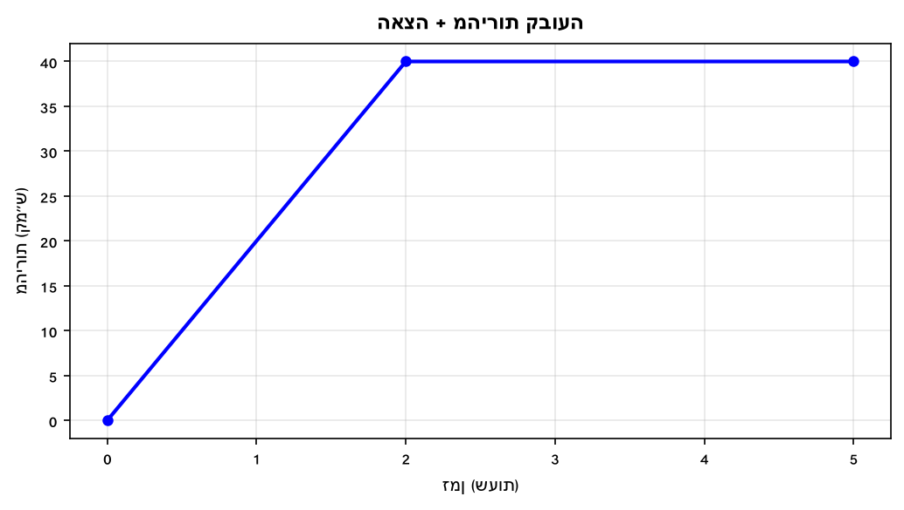

חשבו את השטח הכולל מתחת לגרף.

---

**10.** גרף מתאר מהירות (קמ"ש) לפי זמן (שעות).
שלושה קטעים:

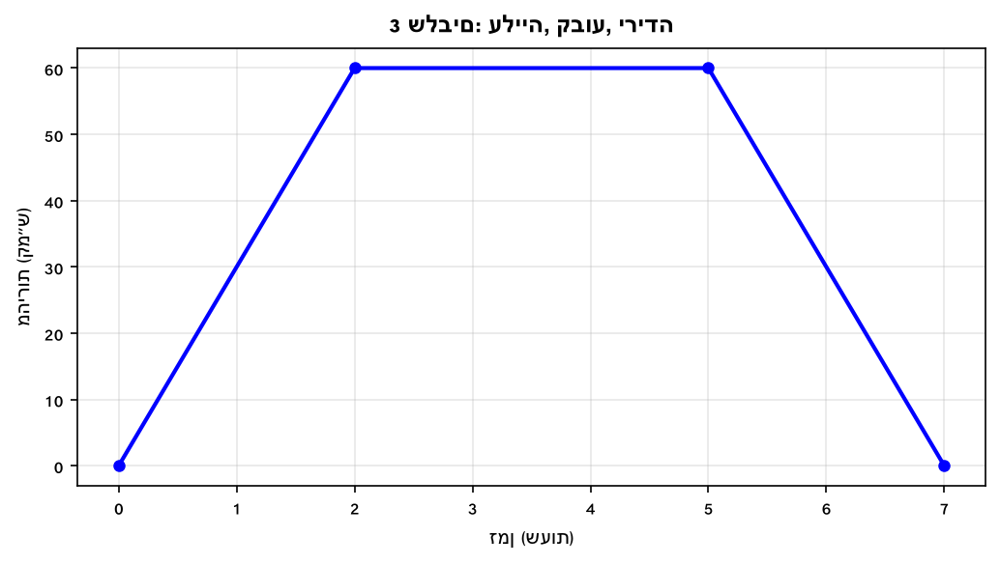

חשבו את השטח הכולל מתחת לגרף.

---

**11.** גרף מתאר ספיקה (ל/שעה) לפי זמן (שעות).
שני קטעים:

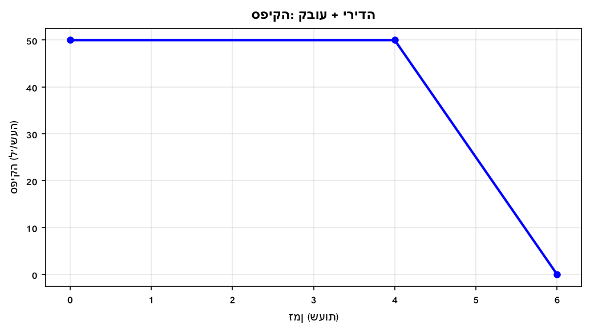

חשבו את השטח הכולל.

---

**12.** גרף מתאר מהירות לפי זמן.
שני קטעים:

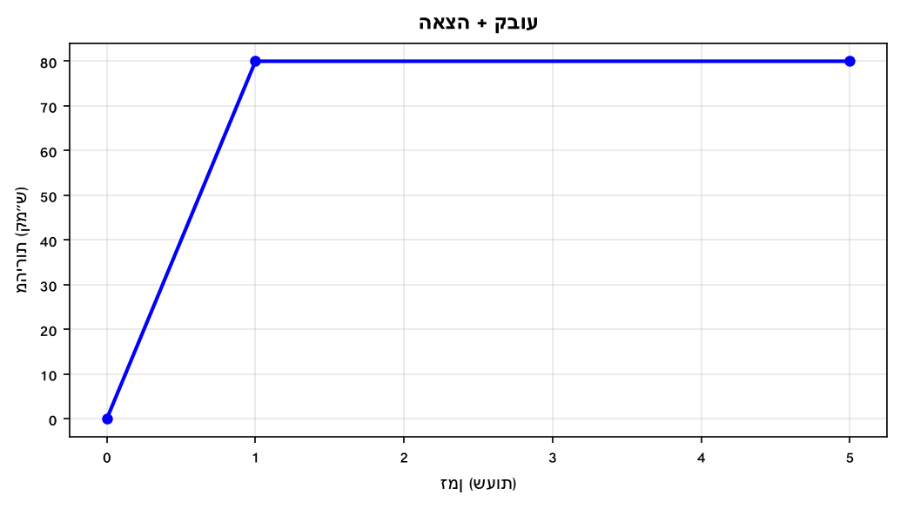

חשבו את השטח הכולל.

---

**13.** גרף מתאר מהירות בשלושה קטעים (גרף מדרגה):

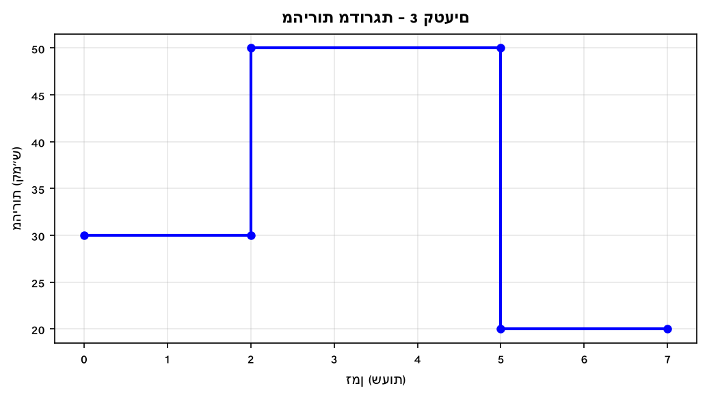

חשבו את השטח הכולל.

---

**14.** גרף מתאר מהירות לפי זמן.
שלושה קטעים:

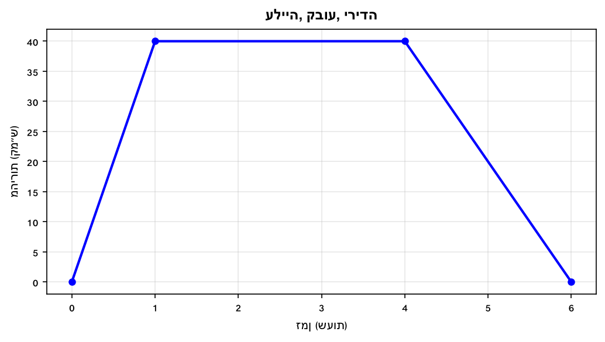

חשבו את השטח הכולל.

---

**15.** גרף מתאר ספיקה (ל/שעה) לפי זמן.
שני קטעים:

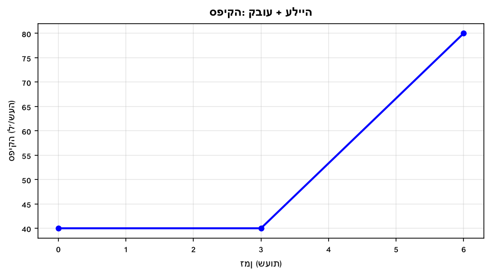

(רמז: פרקו את קטע העלייה ל-מלבן + משולש)

חשבו את השטח הכולל.

---

**16.** גרף מתאר מהירות בארבעה קטעים:

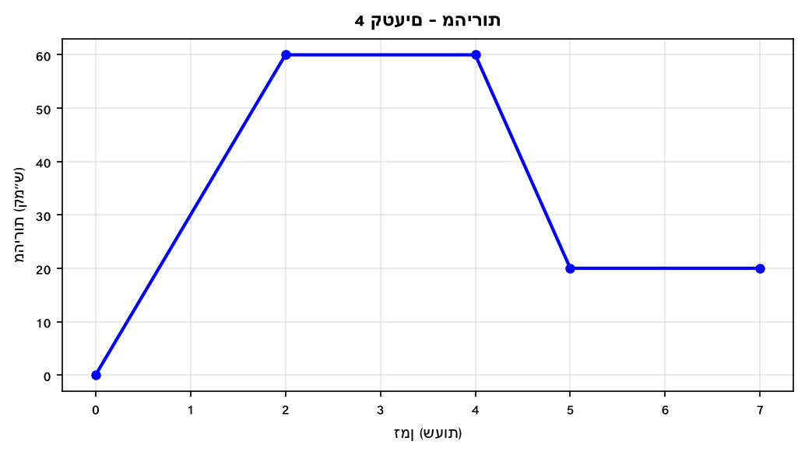

(פרקו את קטע הירידה ל-מלבן + משולש)

חשבו את השטח הכולל.

---

## רמה 3: רמת בחינת מה"ט (4 תרגילים)

**17.** הגרף הבא מתאר את מהירות (קמ"ש) של אופנוע לפי זמן (שעות).
הנקודות על הגרף:

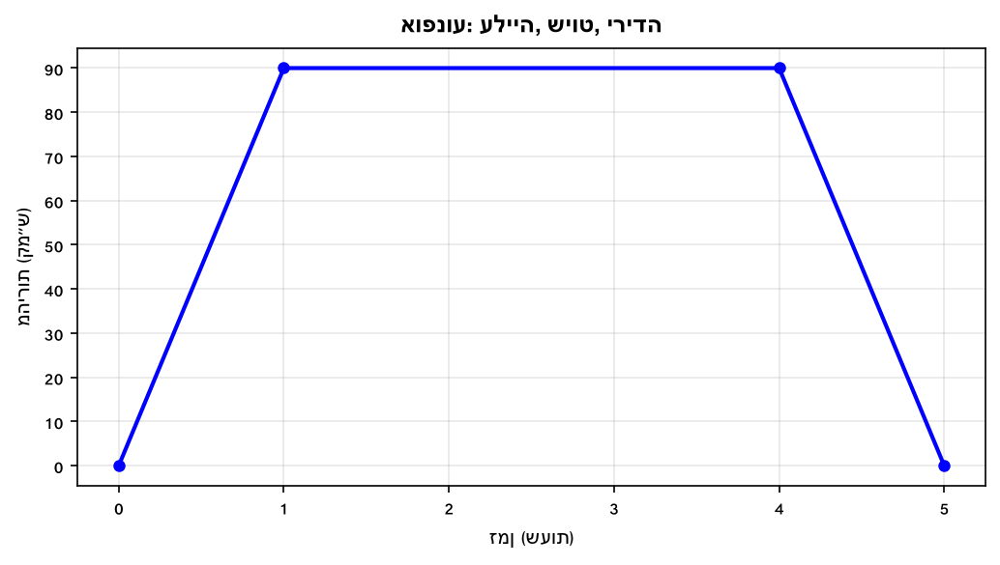

א. פרטו את כל הצורות הגיאומטריות שמרכיבות את האזור מתחת לגרף.

ב. חשבו כל שטח בנפרד.

ג. מהו השטח הכולל מתחת לגרף (מ-
$x = 0$
עד
$x = 5$
)?

ד. מה מייצג השטח הכולל בהקשר הסיפור?

---

**18.** הגרף הבא מתאר את המרחק (ק"מ) של רכב מנקודת מוצא לפי זמן (שעות).
(מבוסס על סגנון שאלה 11, אביב מועד א' 2024)

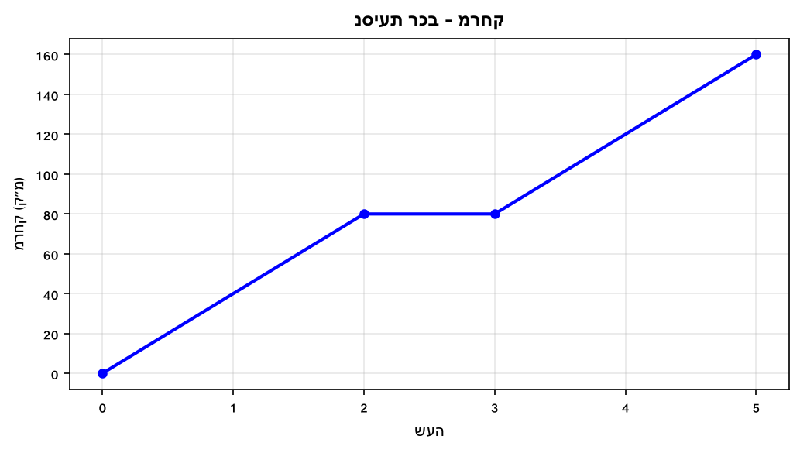

א. פרטו את הצורות שמרכיבות את האזור שמתחת לגרף.

ב. חשבו את שטח כל צורה.

ג. מהו השטח הכולל מ-
$x = 0$
עד
$x = 5$
?

---

**19.** הגרף הבא מתאר את ספיקת המים (ל/דקה) לצינור מים לפי זמן (דקות).

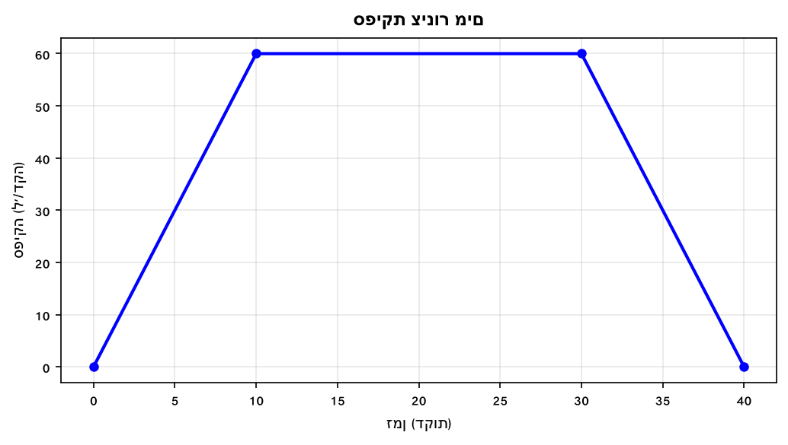

א. פרטו את הצורות שמרכיבות את האזור מתחת לגרף.

ב. חשבו את שטח כל צורה.

ג. מהו השטח הכולל?

ד. מה מייצג השטח הכולל בהקשר הסיפור?

---

**20.** הגרף הבא מתאר את המרחק (ק"מ) של דניאלה על רולרבליידס לפי שעות.
(מבוסס על שאלה 7, קיץ מועד א' 2024)

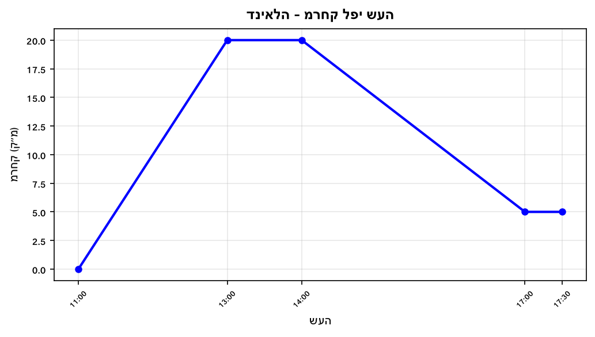

חשבו את השטח שמתחת לגרף מ-11:00 עד 14:00.

**בנוסף:** באותו גרף מתוארת גם המשך הנסיעה מ-14:00 עד 17:30 (היריעה מימין להמשך ציר הזמן).

א. חשבו את שטח הקטע בין 14:00 ל-17:30 (פרקו ל-טרפז + מלבן).

ב. מהו השטח הכולל מ-11:00 עד 17:30?

---

תשובות סופיות

1.
א.
$3$
שעות.
ב. גובה =
$60$
קמ"ש.
ג.
$180$
יחידות רבועות.

2.
א. בסיס =
$4$
שעות.
ב. גובה =
$80$
קמ"ש.
ג.
$160$
יחידות רבועות.

3.
$200$
יחידות רבועות.

4.
א. משולש ישר-זווית.
ב.
$\frac{1}{2} \cdot 6 \cdot 30 = 90$
יחידות רבועות.

5.
שטח:
$80 \cdot 2.5 = 200$

6.
שטח:
$\frac{1}{2} \cdot 3 \cdot 50 = 75$

7.
שטח:
$45 \cdot (7-3) = 180$

8.
שטח:
$\frac{1}{2} \cdot 5 \cdot 60 = 150$

9.
$160$
יחידות רבועות.

10.
$300$
יחידות רבועות.

11.
$250$
יחידות רבועות.

12.
$360$
יחידות רבועות.

13.
$250$
יחידות רבועות.

14.
$180$
יחידות רבועות.

15.
$300$
יחידות רבועות.

16.
$260$
יחידות רבועות.

17.
א. משולש (עלייה), מלבן (שיוט), משולש (ירידה).
ב. משולש עלייה:
$\frac{1}{2} \cdot 1 \cdot 90 = 45$
מלבן:
$3 \cdot 90 = 270$
משולש ירידה:
$\frac{1}{2} \cdot 1 \cdot 90 = 45$
(קמ"ש·שעה).
ג.
$360$
ק"מ (מרחק כולל).
ד. המרחק הכולל שנסע האופנוע:
$360$
ק"מ.

18.
א. משולש (עלייה), מלבן (קבוע), טרפז (עלייה).
ב.
משולש:
$\frac{1}{2} \cdot 2 \cdot 80 = 80$
מלבן:
$1 \cdot 80 = 80$
טרפז:
$\frac{1}{2} \cdot (80 + 160) \cdot 2 = 240$
ג.
$80 + 80 + 240 = 400$
יחידות רבועות.

19.
א. משולש (עלייה), מלבן (קבוע), משולש (ירידה).
ב.
משולש עלייה:
$\frac{1}{2} \cdot 10 \cdot 60 = 300$
מלבן:
$20 \cdot 60 = 1200$
משולש ירידה:
$\frac{1}{2} \cdot 10 \cdot 60 = 300$
ג.
$300 + 1200 + 300 = 1800$
יחידות.
ד. השטח הכולל מייצג את סך כמות המים שזרמה בצינור:
$1800$
ליטרים.

20.
שטח מ-11:00 עד 14:00:
משולש (11:00–13:00):
$\frac{1}{2} \cdot 2 \cdot 20 = 20$
מלבן (13:00–14:00):
$1 \cdot 20 = 20$
סה"כ עד 14:00:
$40$
יח"ר.
א. קטע 14:00–17:30:
טרפז (14:00–17:00):
$\frac{1}{2} \cdot (20 + 5) \cdot 3 = 37.5$
מלבן (17:00–17:30):
$0.5 \cdot 5 = 2.5$
סה"כ לקטע זה:
$40$
יח"ר.
ב. שטח כולל מ-11:00 עד 17:30:
$40 + 40 = 80$
יח"ר.

