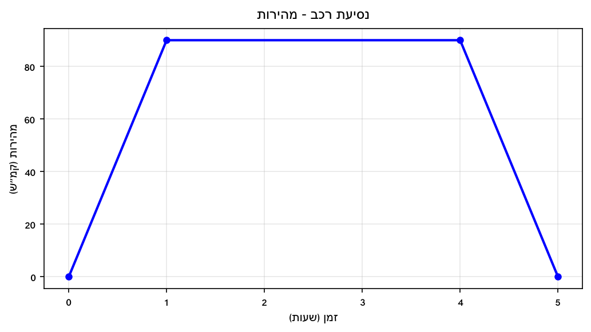
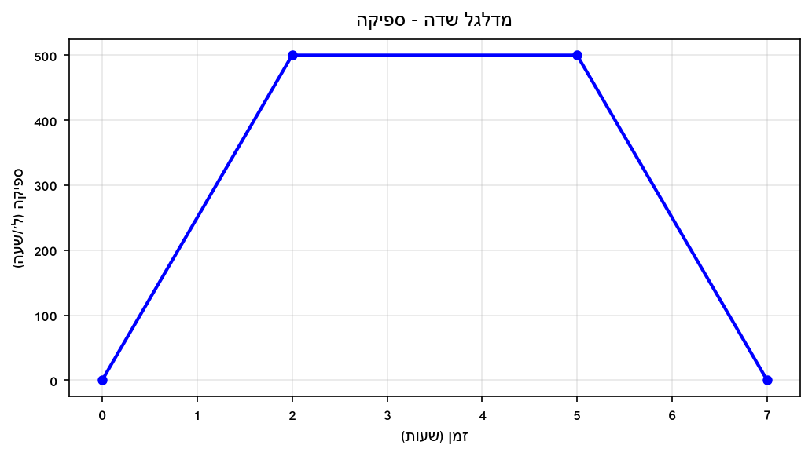
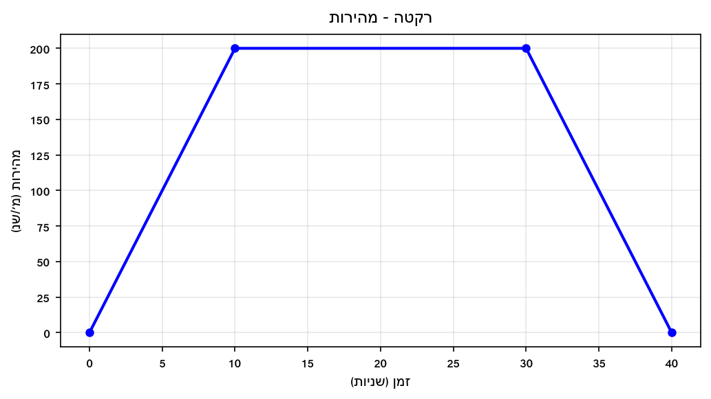
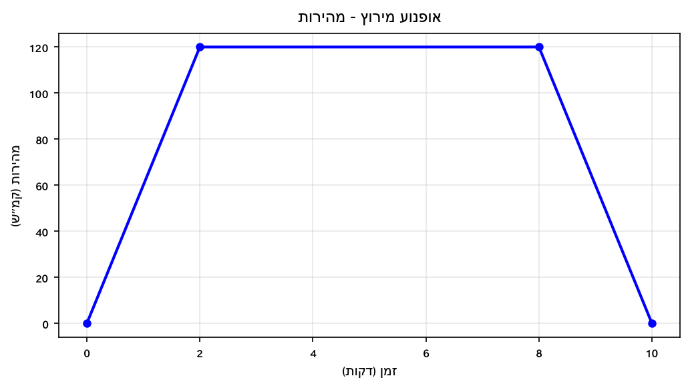
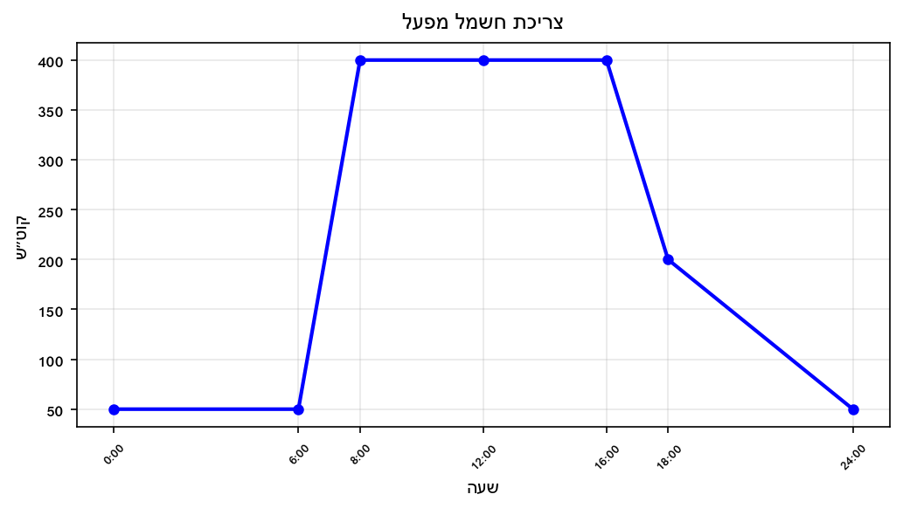
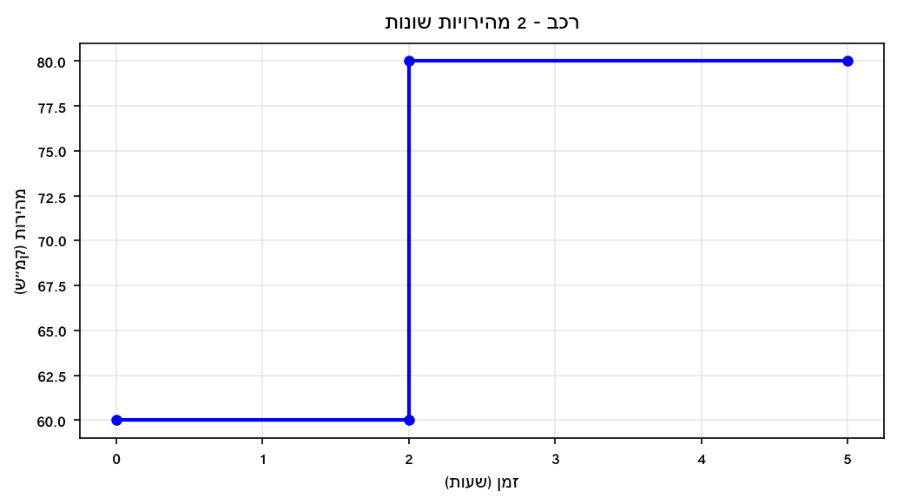
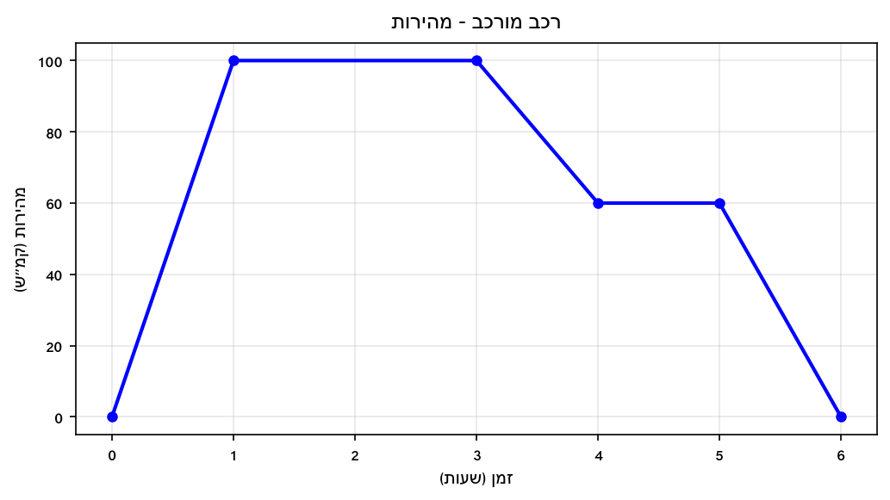
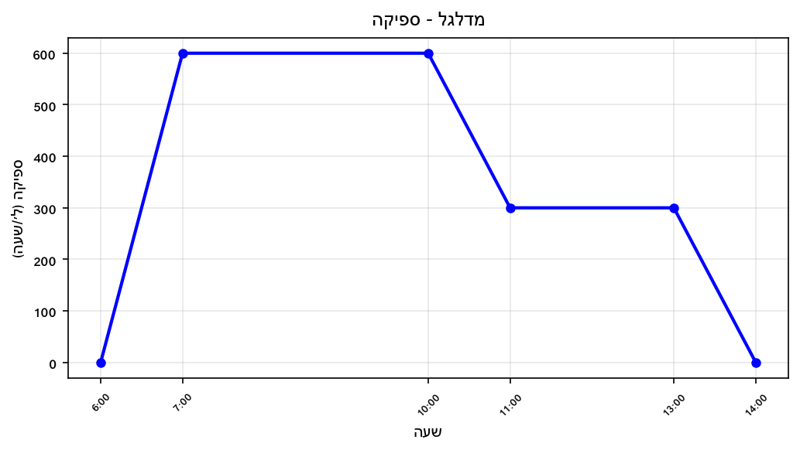
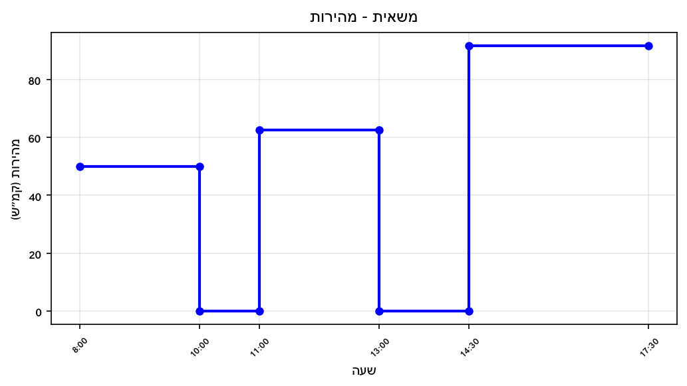
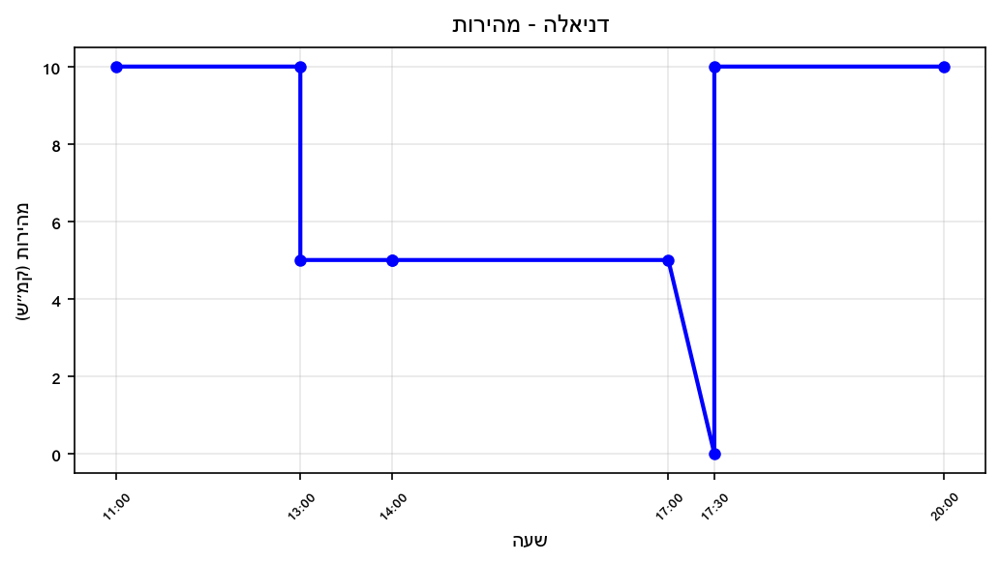

# תת-נושא 12: הבנת המשמעות של השטח בסיפור המעשה

## עיקרון מרכזי:

כאשר מחשבים את השטח שמתחת לגרף, ה**יחידות** של השטח נקבעות לפי:

$$A_{units}=x_{units}\times y_{units}$$

הדוגמאות החשובות ביותר:

| ציר y | ציר x | יחידות שטח | משמעות |
|---|---|---|---|
| מהירות (קמ"ש) | זמן (שעות) | ק"מ | **מרחק שעבר הגוף** |
| ספיקה (ל/שעה) | זמן (שעות) | ליטרים | **כמות המים הכוללת** |
| תשלום (₪/דקה) | זמן (דקות) | ₪ | **העלות הכוללת** |
| כוח (קוט"ש) | זמן (שעות) | קוט"ש × שעה | **האנרגיה הכוללת** |

---

## רמה 1: בניית ביטחון (8 תרגילים)

**1.** גרף מתאר את **מהירות** (קמ"ש) רכב לפי זמן (שעות).

הרכב נסע בקצב קבוע של 60 קמ"ש למשך 3 שעות.

א. מהו השטח שמתחת לגרף (מלבן)?

ב. מה מייצג השטח שחישבתם, ובאיזו יחידה?

---

**2.** גרף מתאר את **ספיקת מים** (ל/דקה) של צינור לפי זמן (דקות).

הצינור הזרים 30 ל/דקה במשך 20 דקות.

א. חשבו את השטח שמתחת לגרף.

ב. מה מייצג השטח שחישבתם?

---

**3.** גרף מתאר **עלות** (₪ לדקה) של שיחה טלפונית לפי זמן (דקות).

עלות קבועה: 0.5 ₪ לדקה למשך 10 דקות.

א. חשבו את השטח שמתחת לגרף.

ב. מה מייצג השטח שחישבתם?

---

**4.** גרף מתאר **מהירות** (קמ"ש) של אופניים לפי זמן (שעות).

הגרף עולה בצורה קווית מ-0 קמ"ש ל-30 קמ"ש תוך שעה אחת (האצה אחידה).

א. מהי צורת האזור שמתחת לגרף?

ב. חשבו את השטח.

ג. מה מייצג שטח זה?

---

**5.** גרף מתאר **ספיקת** גז (ליטרים לשנייה) לפי זמן (שניות).

ספיקה קבועה: 5 ל/שנ למשך 60 שניות.

א. חשבו את השטח שמתחת לגרף.

ב. מה מייצג השטח, ובאיזו יחידה?

---

**6.** גרף מתאר **מהירות** (מ/שנ) של כדור לפי זמן (שניות).

הגרף יורד בצורה קווית מ-20 מ/שנ ל-0 תוך 4 שניות (בלימה אחידה).

א. מהי צורת האזור שמתחת לגרף?

ב. חשבו את השטח.

ג. מה מייצג שטח זה?

---

**7.** גרף מתאר **מהירות** (קמ"ש) לפי זמן (שעות).

שני קטעים:
- 0–2 שעות: מהירות קבועה 50 קמ"ש.
- 2–4 שעות: מהירות קבועה 80 קמ"ש.

א. חשבו את שטח כל קטע.

ב. מה מייצג השטח הכולל?

---

**8.** גרף מתאר **ספיקה** (ל/שעה) של ברז לפי זמן (שעות).

שלושה קטעים:
- 0–2 שעות: 100 ל/שעה.
- 2–4 שעות: 0 ל/שעה (ברז סגור).
- 4–6 שעות: 150 ל/שעה.

א. חשבו שטח כל קטע.

ב. מהי סך כמות המים שהוזרמה?

---

## רמה 2: תרגול שוטף ומשולב (8 תרגילים)

**9.** גרף מתאר **מהירות** (קמ"ש) של רכב לפי זמן (שעות).

א. פרטו את הצורות שמרכיבות את האזור מתחת לגרף.

ב. חשבו את השטח הכולל.

ג. מה מייצג השטח?

---

**10.** גרף מתאר **ספיקת** מים (ל/שעה) של מדלגל שדה לפי שעות.

א. פרטו את הצורות.

ב. חשבו את השטח הכולל.

ג. מה מייצג השטח?

---

**11.** גרף מתאר **מהירות** (מ/שנ) של רקטה לפי זמן (שניות).

א. חשבו את השטח הכולל.

ב. מה מייצג השטח?

---

**12.** גרף מתאר **עלות** (₪ לדקה) של שכירת קורקינט לפי זמן (דקות).

ציר y: עלות לדקה (₪/דקה) — עלות בסיסית 0.5 ₪/דקה + 0.1 ₪/דקה נוספים (סך הכל 0.6 ₪/דקה).
הנסיעה ארכה 30 דקות.

א. חשבו את השטח שמתחת לגרף.

ב. מה מייצג השטח?

---

**13.** גרף מתאר **מהירות** (קמ"ש) של אופנוע במסלול מירוץ לפי זמן (דקות).

(שימו לב: x בדקות, y בקמ"ש — השטח יהיה בקמ"ש × דקות, המירו לק"מ!)

א. חשבו את השטח הכולל.

ב. המירו את יחידות השטח מ-קמ"ש×דקות לק"מ (חלקו ב-60).

ג. מה מייצג השטח לאחר ההמרה?

---

**14.** גרף מתאר **ספיקת** חשמל (קוט"ש) של מפעל לפי שעות.

א. חשבו את שטח האזור בין שעה 8 לשעה 16 (מלבן).

ב. מה מייצג השטח בהקשר הסיפור?

---

**15.** גרף מתאר **מהירות** (קמ"ש) של ספינה לפי שעות:
שלב 1 (0–2 שעות): האצה מ-0 ל-40 קמ"ש.
שלב 2 (2–6 שעות): 40 קמ"ש קבוע.
שלב 3 (6–8 שעות): האטה מ-40 ל-0.

א. חשבו שטח כל שלב.

ב. מה הסך הכולל?

ג. מה מייצג הסכום?

---

**16.** גרף מתאר **מהירות** (קמ"ש) של רכב לפי זמן (שעות).

(הרכב עלה מיידית מ-60 לקמ"ש ל-80 קמ"ש בשעה 2)

א. חשבו שטח כל קטע.

ב. מהי המרחק הכולל שנסע הרכב?

---

## רמה 3: רמת בחינת מה"ט (4 תרגילים)

**17.** גרף מתאר **מהירות** (קמ"ש) של רכב לפי זמן (שעות).
(בסגנון שאלת מה"ט)

א. פרטו את הצורות הגיאומטריות שמרכיבות את האזור מתחת לגרף.

ב. חשבו שטח כל צורה.

ג. מהו השטח הכולל ומה הוא מייצג?

ד. האם ניתן לומר שהרכב חזר לנקודת ההתחלה? הסבירו.

---

**18.** גרף מתאר **ספיקת** מים (ל/שעה) של מדלגל לפי שעות עבודה.

א. חשבו שטח כל קטע.

ב. מהי כמות המים הכוללת שהוזרמה (בליטרים)?

ג. בין אילו שעות הוזרמו הכי הרבה מים?

---

**19.** הגרף הבא מתאר את **מהירות** (קמ"ש) של משאית לפי שעות.
(מבוסס על סגנון שאלה 11, אביב מועד א' 2025)

(שימו לב: המשאית עוצרת בין הנסיעות — ספיקה 0)

א. חשבו שטח כל קטע נסיעה.

ב. מהו המרחק הכולל שנסעה המשאית?

ג. מה מייצג השטח הכולל?

---

**20.** גרף מתאר **מהירות** (קמ"ש) של דניאלה על רולרבליידס לפי שעות.
(מבוסס על שאלה 7, קיץ מועד א' 2024 — ממהירות לא מרחק)

(שימו לב: דניאלה זזה לכיוון הפוך מ-14:00 ל-17:00, אך המהירות מבחינת ערך מוחלט היא 5 קמ"ש)

א. חשבו שטח כל קטע (מרחק שעבר, לא נטו).

ב. מהו המרחק הכולל שחלקה דניאלה (כולל החזרה)?

ג. בהקשר הסיפור, מה מייצג השטח הכולל?

---

תשובות סופיות

1. א.
$3 \times 60 = 180$
קמ"ש × שעה. ב. המרחק שנסע הרכב: **180 ק"מ**.

2. א.
$20 \times 30 = 600$
ל/דקה × דקה. ב. כמות המים הכוללת: **600 ליטרים**.

3. א.
$10 \times 0.5 = 5$
₪. ב. העלות הכוללת של השיחה: **5 ₪**.

4. א. משולש ישר-זווית. ב.
$\frac{1}{2} \times 1 \times 30 = 15$
קמ"ש × שעה. ג. המרחק שנסעו האופניים בשעה ההאצה: **15 ק"מ**.

5. א.
$60 \times 5 = 300$
ל/שנ × שנ. ב. כמות הגז הכוללת: **300 ליטרים**.

6. א. משולש ישר-זווית. ב.
$\frac{1}{2} \times 4 \times 20 = 40$
מ/שנ × שנ. ג. המרחק שעבר הכדור עד שעצר: **40 מטרים**.

7. א. קטע 1:
$2 \times 50 = 100$
ק"מ. קטע 2:
$2 \times 80 = 160$
ק"מ. ב. המרחק הכולל:
$100+160 = 260$
ק"מ.

8. א. קטע 1:
$2 \times 100 = 200$
ל'. קטע 2:
$0$
ל'. קטע 3:
$2 \times 150 = 300$
ל'. ב.
$200+0+300 = 500$
ליטרים.

9. א. משולש + מלבן + משולש. ב.
$\frac{1}{2}(1)(90) + 3(90) + \frac{1}{2}(1)(90) = 45+270+45 = 360$
קמ"ש × שעה. ג. המרחק הכולל: **360 ק"מ**.

10. א. משולש + מלבן + משולש. ב.
$\frac{1}{2}(2)(500) + 3(500) + \frac{1}{2}(2)(500) = 500+1{ }500+500 = 2{ }500$
ל/שעה × שעה. ג. כמות המים הכוללת: **2,500 ליטרים**.

11. א.
$\frac{1}{2}(10)(200) + 20(200) + \frac{1}{2}(10)(200) = 1{ }000+4{ }000+1{ }000 = 6{ }000$
מ/שנ × שנ. ב. המרחק הכולל: **6,000 מטרים = 6 ק"מ**.

12. א.
$0.6 \times 30 = 18$
₪/דקה × דקה. ב. העלות הכוללת: **18 ₪**.

13. א. משולש + מלבן + משולש:
$\frac{1}{2}(2)(120) + 6(120) + \frac{1}{2}(2)(120) = 120+720+120 = 960$
קמ"ש × דקות. ב.
$960 \div 60 = 16$
ק"מ. ג. המרחק הכולל במירוץ: **16 ק"מ**.

14. א.
$8 \times 400 = 3{ }200$
קוט"ש × שעות. ב. כמות האנרגיה שנצרכה בשעות 8–16: **3,200 קוט"ש**.

15. א. שלב 1:
$\frac{1}{2}(2)(40)=40$
. שלב 2:
$4(40)=160$
. שלב 3:
$\frac{1}{2}(2)(40)=40$
. ב.
$40+160+40=240$
ק"מ. ג. המרחק הכולל שנסעה הספינה: **240 ק"מ**.

16. א. קטע 1 (0–2 שעות):
$2 \times 60 = 120$
ק"מ. קטע 2 (2–5 שעות):
$3 \times 80 = 240$
ק"מ. ב.
$120+240 = 360$
ק"מ.

17. א. משולש (0–1), מלבן (1–3), טרפז (3–4), מלבן (4–5), משולש (5–6). ב. משולש:
$\frac{1}{2}(1)(100)=50$
. מלבן:
$2(100)=200$
. טרפז (3–4):
$\frac{100+60}{2} \times 1=80$
. מלבן (4–5):
$1(60)=60$
. משולש (5–6):
$\frac{1}{2}(1)(60)=30$
. ג.
$50+200+80+60+30=420$
ק"מ — המרחק הכולל שנסע הרכב. ד. לא ניתן לדעת מגרף המהירות — נדרש גרף המרחק כדי לדעת אם חזר.

18. א. 6–7: משולש:
$\frac{1}{2}(1)(600)=300$
. 7–10:
$3(600)=1{ }800$
. 10–11: טרפז:
$\frac{600+300}{2}(1)=450$
. 11–13:
$2(300)=600$
. 13–14: משולש:
$\frac{1}{2}(1)(300)=150$
. ב.
$300+1{ }800+450+600+150=3{ }300$
ליטרים. ג. בין שעות 7:00 ל-10:00 (
$1{ }800$
ל' — מלבן הגדול).

19. א. 8–10:
$2 \times 50 = 100$
ק"מ. 11–13:
$2 \times 62.5 = 125$
ק"מ. 14:30–17:30:
$3 \times 91.7 \approx 275$
ק"מ. ב.
$100+125+275=500$
ק"מ. ג. המרחק הכולל שנסעה המשאית מנקודת המוצא: **500 ק"מ**.

20. א. 11–13:
$2 \times 10=20$
ק"מ. 13–14:
$1 \times 5=5$
ק"מ. 14–17:
$3 \times 5=15$
ק"מ. 17:30–20:
$2.5 \times 10=25$
ק"מ. ב.
$20+5+15+25=65$
ק"מ (מרחק גיאומטרי כולל, כולל חזרה). ג. סך כל הדרך שחלקה דניאלה (הלוך ושוב): **65 ק"מ**.

