# תת-נושא 13: התמודדות עם שאלות רב-סעיפיות ברמת מה"ט

שאלות אלו משלבות את כל המיומנויות שנלמדו: קריאת נקודות, חישוב הפרשים, ממוצעים, אחוזים, קצב שינוי, המרת יחידות, חישוב שטח ופרשנות.

---

## רמה 1: בניית ביטחון (8 תרגילים)

**1.** הגרף הבא מתאר את גובה (ס"מ) של ילד לפי גילו.

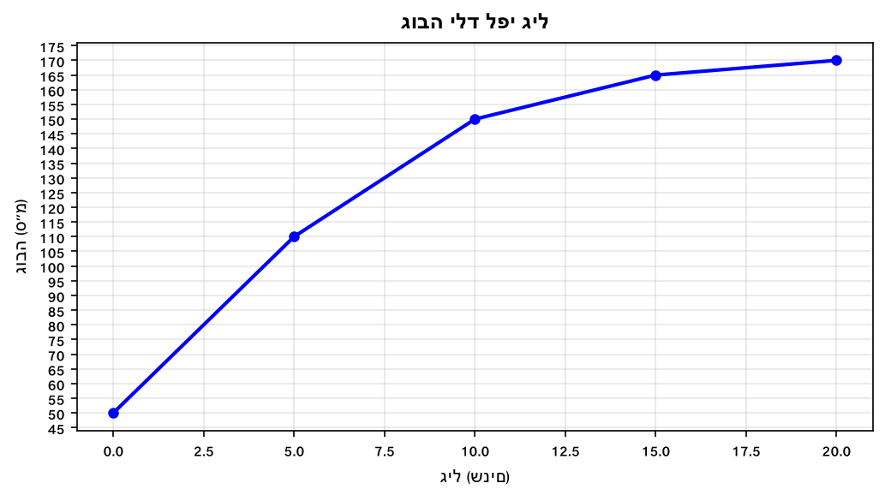

א. מה היה גובה הילד בלידתו?

ב. בכמה ס"מ גדל הילד בעשור הראשון לחייו?

ג. בכמה ס"מ בשנה גדל הילד בממוצע בין גיל 5 לגיל 15?

ד. בכמה אחוזים גדל גובה הילד מגיל 5 עד גיל 15?

---

**2.** הגרף הבא מתאר כמות מים (ליטרים) בבריכה לפי זמן (דקות).

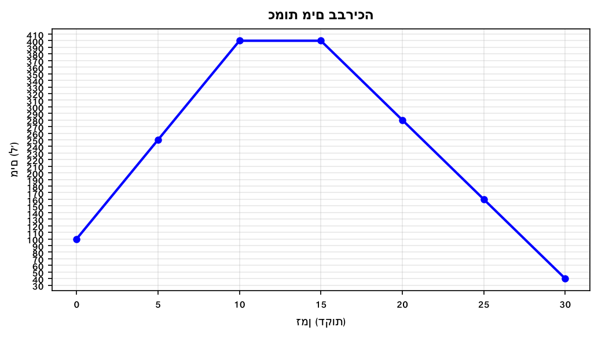

א. כמה מים היו בבריכה בתחילת המדידה?

ב. מהי הכמות המקסימלית ובאיזה זמן הגיעה אליה?

ג. האם בין הדקה ה-20 לדקה ה-25 כמות המים גדלה או קטנה? הסבירו.

ד. מהו קצב השינוי (ל/דקה) בין הדקה ה-0 לדקה ה-10?

---

**3.** הגרף הבא מתאר מחיר מניה (₪) לפי ימים.

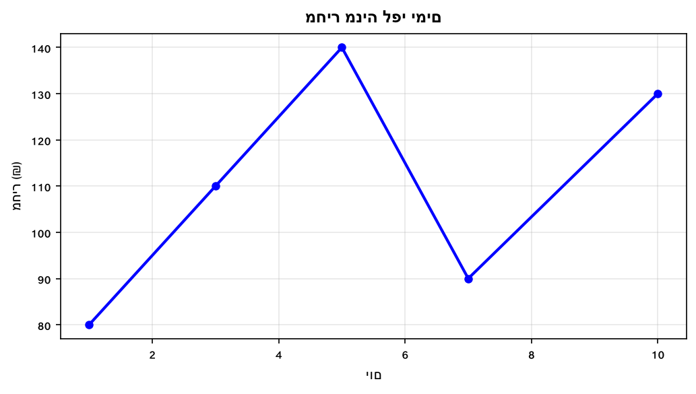

א. מהו מחיר הפתיחה של המניה (יום 1)?

ב. מהו המחיר הגבוה ביותר ובאיזה יום?

ג. מהו קצב השינוי הממוצע בין יום 1 ליום 5?

ד. בכמה אחוזים ירד המחיר מיום 5 ליום 7?

---

**4.** הגרף הבא מתאר הכנסות חנות (₪ אלפים) לפי חודשים.

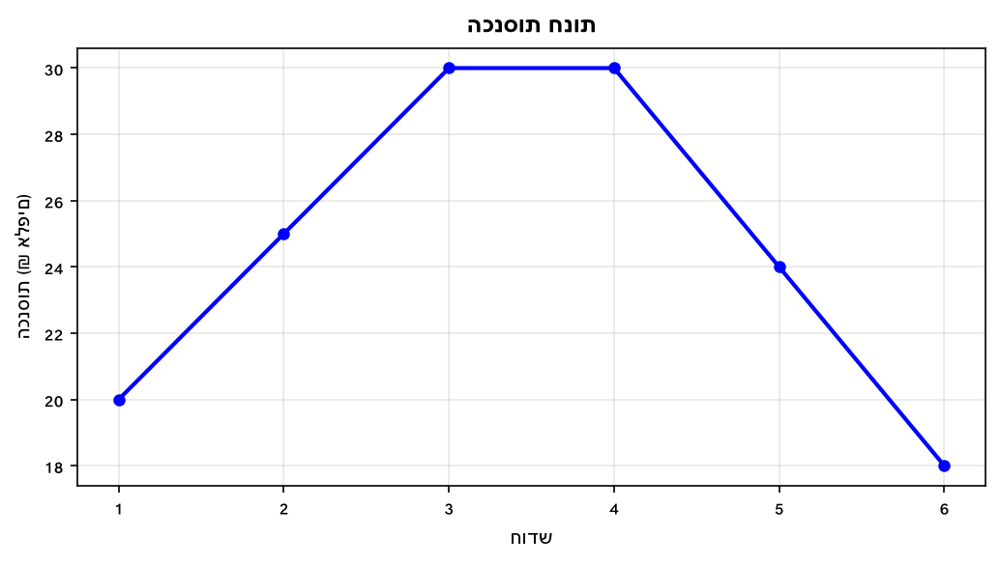

א. מהי ההכנסה הממוצעת לחודש לאורך כל התקופה (בשקלים ממש)?

ב. בין אילו חודשים ההכנסות קבועות?

ג. בכמה אחוזים ירדו ההכנסות מחודש 3 לחודש 6?

ד. מהו קצב השינוי (₪ אלפים לחודש) בין חודש 4 לחודש 6?

---

**5.** הגרף הבא מתאר מרחק (ק"מ) של רכב מנקודת מוצא לפי שעות.

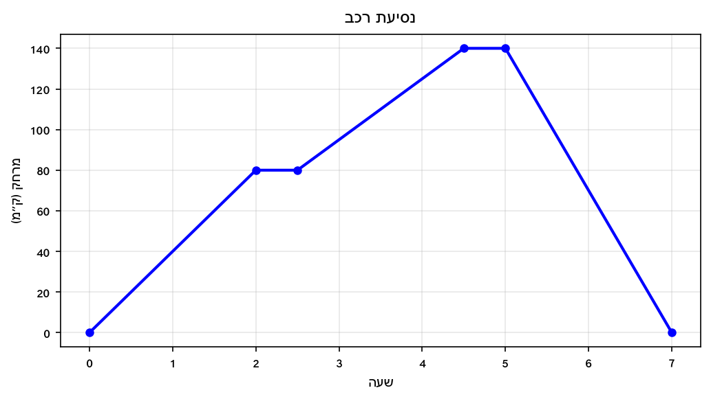

א. מהי המהירות בכל קטע נסיעה?

ב. כמה זמן עצר הרכב?

ג. מהו המרחק הגדול ביותר מנקודת המוצא?

ד. מהי המהירות הממוצעת לכל המסע (כולל עצירות)?

---

**6.** הגרף הבא מתאר טמפרטורת גוף חולה (°C) לפי שעות.

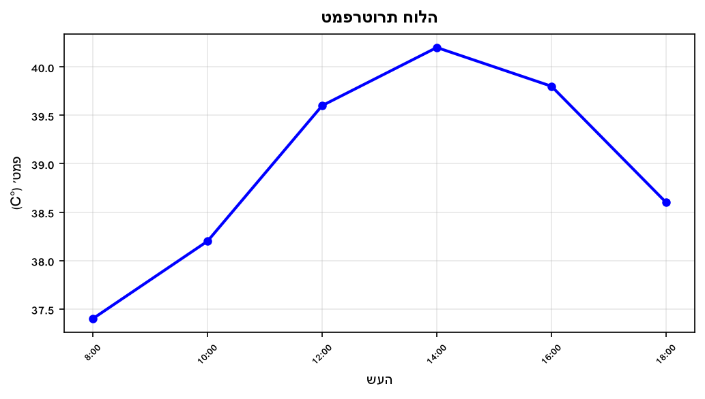

א. מהי הטמפרטורה המקסימלית ובאיזו שעה?

ב. מהו קצב עליית הטמפרטורה בין 8:00 ל-14:00?

ג. קבעו ונמקו: האם קצב הירידה בין 14:00 ל-16:00 שווה לקצב בין 16:00 ל-18:00?

ד. מהי הטמפרטורה הממוצעת לאורך כל 6 המדידות?

---

**7.** הגרף הבא מתאר עלות השכרת קורקינט (₪) לפי דקות נסיעה.

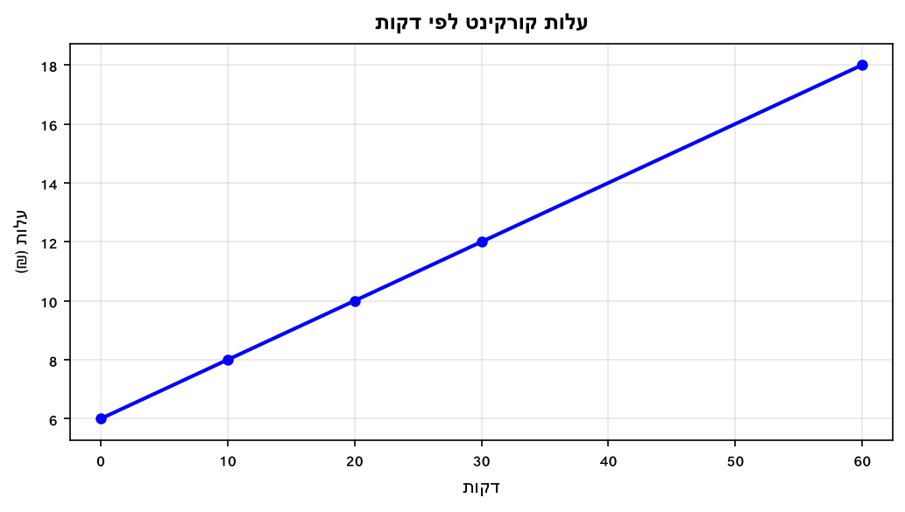

א. מה עלות ה"פתיחה" (גם ללא נסיעה)?

ב. מהו העלות לכל דקת נסיעה נוספת?

ג. אם נסעתם 45 דקות, כמה שילמתם?

ד. אם שילמתם 14 ₪, כמה דקות נסעתם?

---

**8.** הגרף הבא מתאר ייצור (יחידות) של מפעל לפי ימות השבוע.

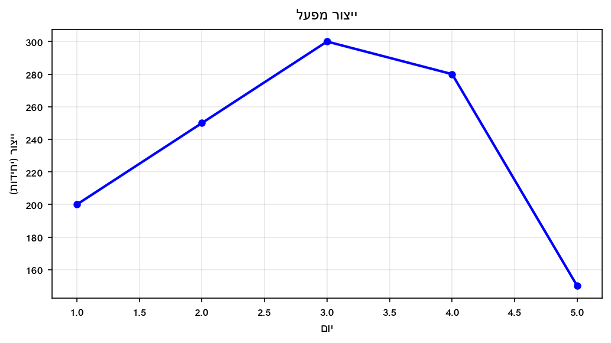

א. מהו הייצור הממוצע ליום?

ב. ביום איזה יום הגיע הייצור לשיאו?

ג. בכמה אחוזים ירד הייצור מיום 3 ליום 5?

ד. מהו קצב הירידה (יחידות ליום) בין יום 3 ליום 5?

---

## רמה 2: תרגול שוטף ומשולב (8 תרגילים)

**9.** הגרף הבא מתאר כמות מים (ליטרים) בבריכה. שני ברזים פתוחים בו-זמנית: ממלא ומרוקן.
(מבוסס על שאלה 2, קיץ מועד ב' 2023)

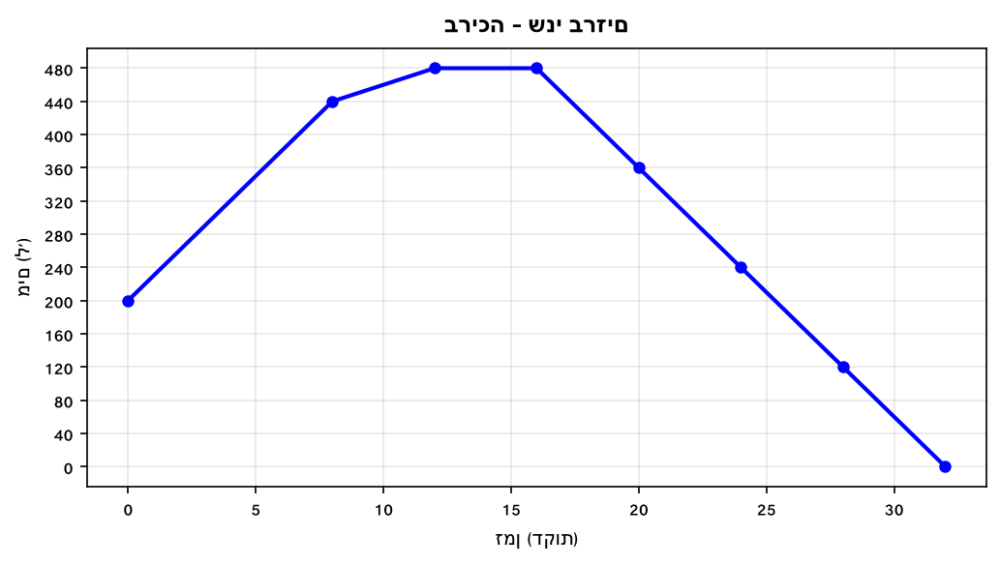

א. כמה מים היו בבריכה כעבור 12 דקות מתחילת הזרימה?

ב. באיזה זמן הייתה כמות המים 360 ליטרים?

ג. מהי הכמות הגדולה ביותר של מים שהייתה בבריכה?

ד. בין הדקה ה-22 לדקה ה-24 — גדלה או קטנה כמות המים? נמקו בעזרת חישוב.

---

**10.** הגרף הבא מתאר את מחיר ספרים לפי כמות הנרכשים.
(מבוסס על שאלה 6, אביב מועד א' 2024)

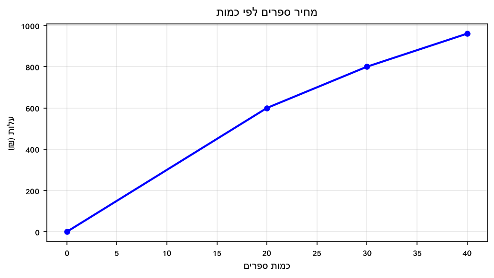

א. מהי עלות רכישת 25 ספרים?

ב. מהו מחירם של כל אחד מ-20 הספרים הראשונים?

ג. מהו המחיר לכל ספר בין 20 ל-30 ספרים?

ד. סוחר קנה 30 ספרים. כמה שילם בסך הכל? כמה שילם בממוצע לכל ספר?

---

**11.** הגרף הבא מתאר הכנסות והוצאות (₪ אלפים) של חברת הייטק (אוקטובר 2008 עד מאי 2009).
(מבוסס על שאלה 6, אביב מועד ב' 2024)

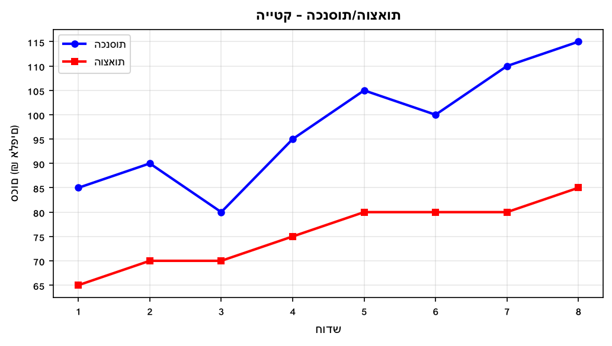

א. מה היו הכנסות החברה בחודש פברואר (בשקלים ממש)?

ב. באיזה חודש הפרש ההכנסות-הוצאות היה הגדול ביותר, ומה היה הפרש זה?

ג. מה היו הוצאות החברה בחודש מאי (בשקלים ממש)?

ד. מה היה ממוצע ההוצאות בארבעת החודשים האחרונים (פברואר-מאי, בשקלים ממש)?

---

**12.** הגרף הבא מתאר מרחק (ק"מ) של זיו בטיול רגלי לפי שעות.
(מבוסס על שאלה 11, אביב מועד א' 2024)

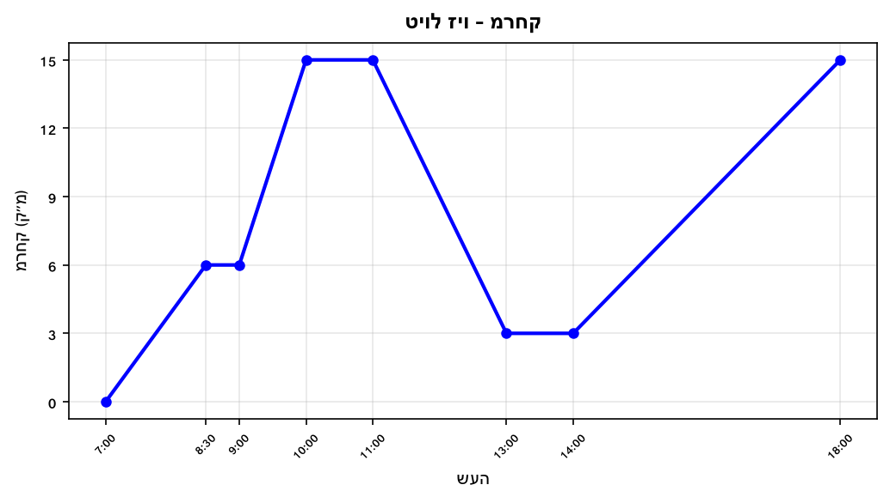

א. מהי מהירות הליכתו של זיו בכל קטע שבו הוא היה בתנועה (ק"מ/שעה)?

ב. מהי מהירות הליכתו המהירה ביותר (ב-מ/שנ, שמרו 3 ספרות)?

ג. מהו השטח שמתחת לגרף מן השעה 7 ועד השעה 11?

ד. האם ניתן לומר שבין 9:00 ל-10:00 זיו הלך מהר יותר מאשר בין 7:00 ל-8:30? נמקו.

---

**13.** הגרף הבא מתאר מרחק (מטרים) של שליח פיצה מנקודת ה-0 לפי זמן (דקות).
(מבוסס על שאלה 6, אביב מועד ב' 2024)

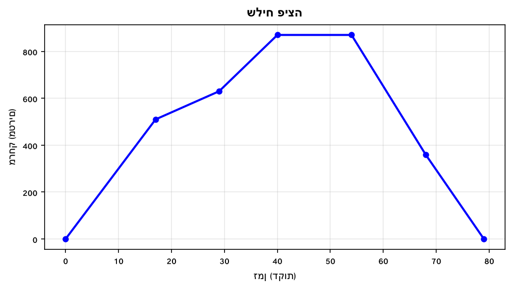

א. בין אילו זמנים קצב השינוי במרחק (בערך מוחלט) הוא הגדול ביותר?

ב. חשבו את השטח מתחת לגרף מדקה 0 עד דקה 40.

ג. נתבונן בנקודה שבה השליח במרחק 360 מטר לאחר 68 דקות. המירו: 360 מטר ל-ק"מ, ו-68 דקות ל-שעות (2 ספרות אחרי הנקודה).

ד. מהו קצב השינוי בין דקה 17 לדקה 29? (בעזרת חישוב הישר)

---

**14.** הגרף הבא מתאר את ביצועי דניאלה על רולרבליידס: מרחק (ק"מ) מאשקלון לפי שעות.
(מבוסס על שאלה 7, קיץ מועד א' 2024)

א. באילו שעות קצב השינוי (בערך מוחלט) הוא הגדול ביותר?

ב. חשבו את השטח מתחת לגרף מ-11:00 עד 14:00.

ג. חשבו את משוואת הישר בין 15:00 ל-17:00 ומצאו מהו המרחק בשעה 16:00.

ד. נתבונן בנקודה שבה דניאלה נמצאת במרחק 15 ק"מ, לאחר שעתיים מהתחלה. המירו: 15 ק"מ למטרים ו-2 שעות לדקות.

---

**15.** הגרף הבא מתאר טמפרטורת גוף חולה (°C) לפי שעות.
(מבוסס על שאלה 8, קיץ מועד ב' 2024)

א. באיזו שעה הגיע חום הגוף ל-39.5? ומה היה החום בשעה 12:00?

ב. קבעו ונמקו: "ההפרש בין טמפרטורות 10:00 ל-12:00 נמוך מהפרש 14:00 ל-16:00."

ג. האם קצב עליית הטמפרטורה בין 10:00 ל-14:00 גדול יותר מהקצב בין 16:00 ל-18:00?

ד. החולה לקח כדור הורדת חום בשעה 14:00 ו-18:00. האם קצב ירידת החום שווה בשני המקרים?

---

**16.** הגרף הבא מתאר מרחק (ק"מ) של משאית מנקודת מוצא לפי שעות.
(מבוסס על שאלה 11, אביב מועד א' 2025)

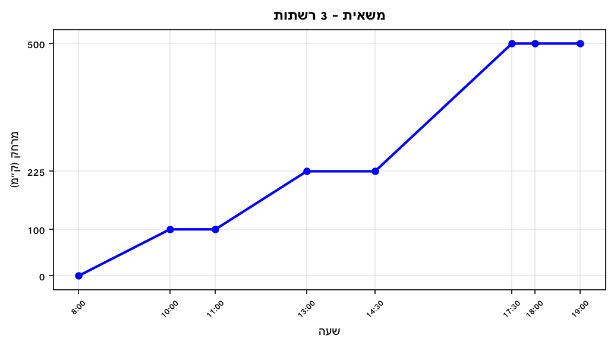

א. מהי מהירות הנסיעה לכל אחת מרשתות השיווק (קמ"ש)?

ב. המירו את מהירות הנסיעה לכל רשת ל-מ/שנ (3 ספרות).

ג. מהו השטח מתחת לגרף מן השעה 8 עד השעה 19?

---

## רמה 3: רמת בחינת מה"ט (4 תרגילים)

**17.** הגרף הבא מתאר את מחיר (₪) של השכרת מסוק לאורך דקות הטיסה.
(מבוסס ישירות על שאלה 10, אביב מועד ב' 2025)

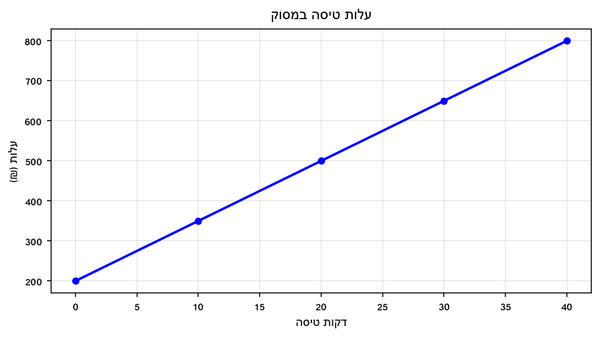

ציר ה-x מייצג את דקות הטיסה, ציר ה-y מייצג את העלות.
התשלום כולל דמי טיפול שלא יוחזרו בכל מקרה, וכן תשלום לפי דקות.

א. יצחק החליט לשכור את שירותי המסוק ובאחרון הדד החליט לא לטוס. כמה עליו לשלם?

ב. בהתחלה יצחק תכנן לטוס 20 דקות, ובמהלך הטיסה החליט להוסיף עוד 10 דקות. כמה כסף יצטרך להוסיף לתשלום?

ג. בסופו של דבר יצחק טס 40 דקות. כמה עלתה לו בממוצע דקת טיסה אחת?

ד. אם היה טס רק 20 דקות, מה הייתה העלות הממוצעת לדקת טיסה אחת?

---

**18.** הגרף הבא מתאר חשבון שנתי (₪) של משפחת צרפתי בחברת הכבלים.
(מבוסס ישירות על שאלה 11, קיץ מועד ב' 2025)

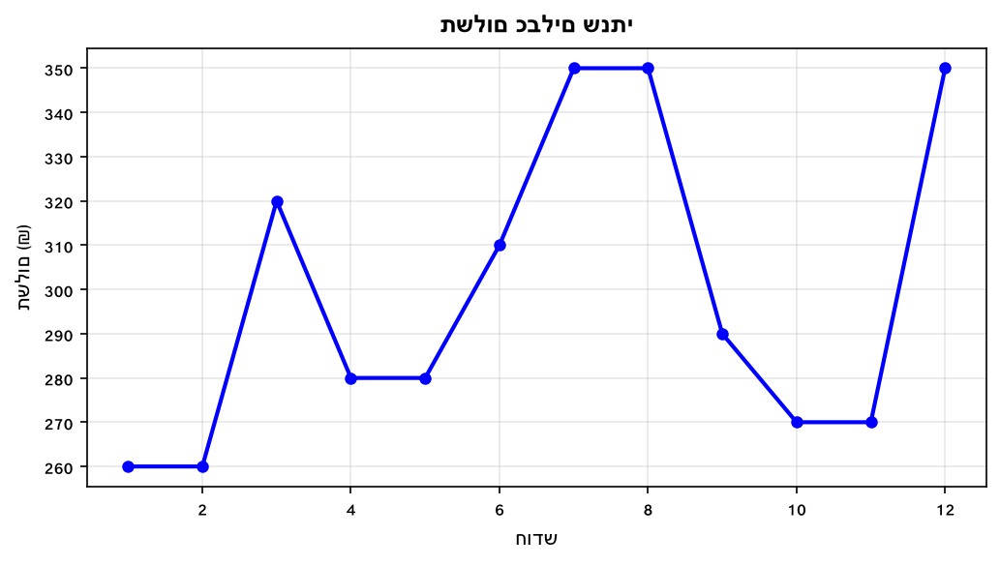

א. באיזה חודש התשלום היה הגבוה ביותר, ומה היה התשלום החודשי?

ב. בין אילו חודשים סמוכים היה פער התשלומים הגבוה ביותר, ומה היה הפרש זה?

ג. כמה שילמה משפחת צרפתי בממוצע לחודש צפייה בכבלים?

ד. חברת כבלים אחרת מציעה 850 ₪ לרבעון. האם כדאי לעבור? נמקו בעזרת חישוב.

---

**19.** הגרף הבא מתאר את מרחק (ק"מ) של דניאלה על רולרבליידס לפי שעות.
(מבוסס ישירות על שאלה 7, קיץ מועד א' 2024)

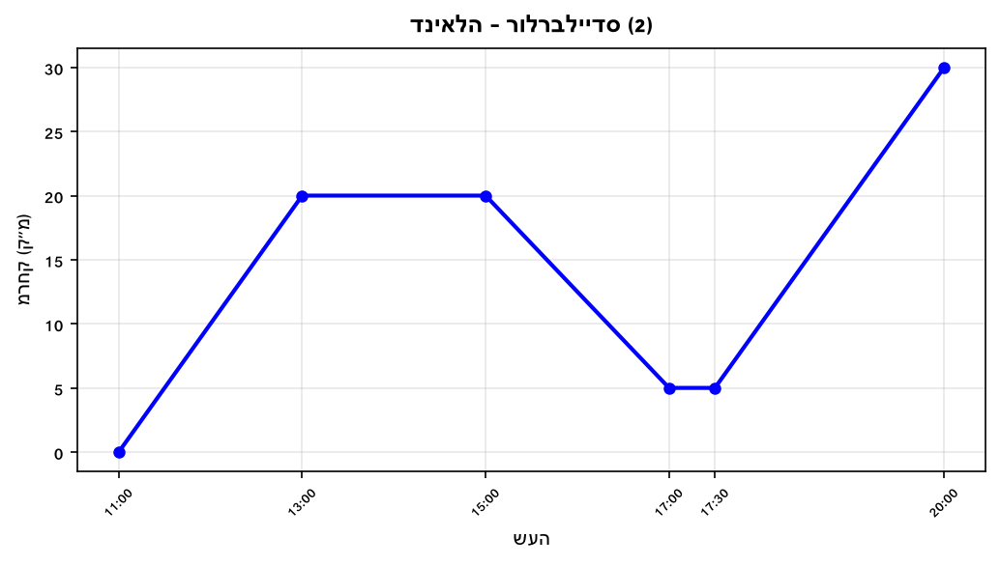

א. באילו שעות החליקה דניאלה במהירות הגבוהה ביותר?

ב. חשבו את השטח מתחת לגרף מ-11:00 עד 14:00.

ג. חשבו את משוואת הישר בין 15:00 ל-17:00 ומצאו את מרחקה בשעה 16:00.

ד. נתבונן בנקודה שבה דניאלה במרחק 15 ק"מ, לאחר שעתיים מתחילת התנועה. המירו: 15 ק"מ למטרים, ו-2 שעות לדקות. הציגו ב-2 ספרות אחרי הנקודה.

---

**20.** הגרף הבא מתאר מרחק (ק"מ) של משאית מנקודת מוצא לפי שעות.
(מבוסס ישירות על שאלה 11, אביב מועד א' 2025)

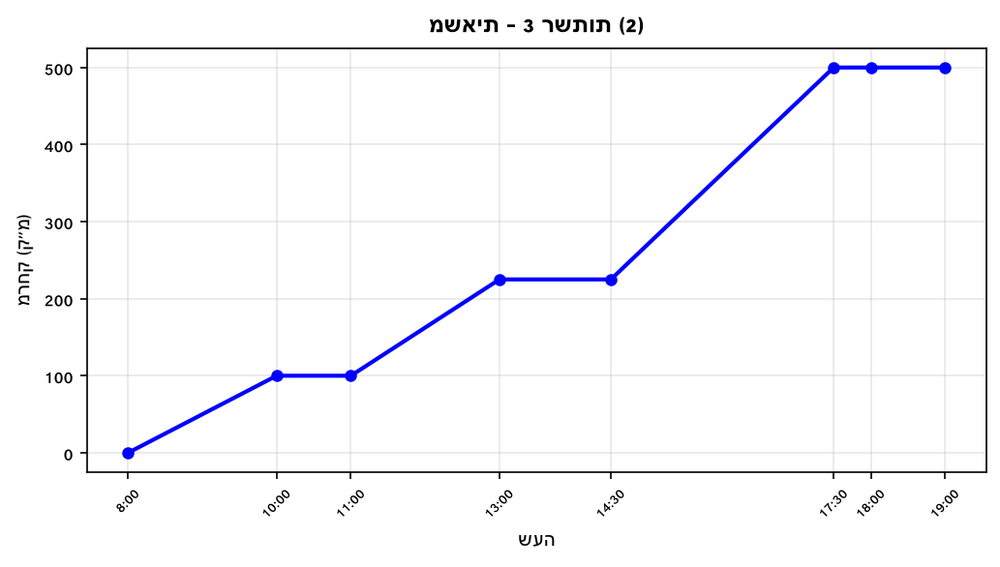

**שמרו על רמת דיוק של 3 ספרות אחרי הנקודה העשרונית.**

א. מהי מהירות הנסיעה של המשאית לכל אחת מרשתות השיווק (ק"מ/שעה)?

ב. מהי מהירות הנסיעה לכל רשת שיווק ב-מ/שנ?

ג. מהו השטח מתחת לגרף המרחק מן השעה 8 ועד השעה 19?

---

תשובות סופיות

1.
א. 50 ס"מ.
ב.
$98$
ס"מ.
ג.
$5.5$
ס"מ/שנה.
ד.
$50\%$

2.
א. 100 ליטרים.
ב. 400 ליטרים (בין דקה 10 לדקה 15).
ג. קטנה — מ-280 ל-160.
ד.
$30$
ל/דקה.

3.
א. 80 ₪.
ב. 140 ₪ ביום 5.
ג.
$15$
₪/יום.
ד.
$\frac{-50}{140} \times 100 \approx -35.7\%$

4.
א.
$24{ }500$
₪.
ב. חודשים 3–4.
ג.
$40\%$
ד.
$-6$
אלפי ₪/חודש.

5.
א. 0–2:
$40$
קמ"ש. 2.5–4.5:
$30$
קמ"ש. 5–7:
$-70$
קמ"ש.
ב. 1 שעה (0.5+0.5).
ג. 140 ק"מ.
ד.
$40$
קמ"ש.

6.
א. 40.2°C בשעה 14:00.
ב.
$\frac{2.8}{6} \approx 0.467$
°C/שעה.
ג.
$-0.6$
°C/שעה — לא שווה; 16–18 ירד מהר יותר.
ד.
$\frac{233.8}{6} \approx 38.97$
°C.

7.
א. 6 ₪.
ב.
$0.2$
₪/דקה.
ג.
$15$
₪.
ד.
$40$
דקות.

8.
א.
$236$
יחידות.
ב. יום 3 (300 יחידות).
ג.
$50\%$
ד.
$-75$
יחידות/יום.

9.
א. 480 ליטרים.
ב. ב-20 דקות.
ג. 480 ליטרים (בין דקה 12 לדקה 16).
ד. שיעור ירידה בין 20–24:
$-30$
ל/דקה; בין 22 לדקה 24 הכמות קטנה.

10.
א. 600 ₪ ל-20 ספרים + 5×20 ₪ = 700 ₪.
ב.
$30$
₪.
ג.
$20$
₪.
ד. 800 ₪ סה"כ;
$800 \div 30 \approx 26.67$
₪ לספר.

11.
א.
$105{ }000$
₪.
ב. אפריל ומאי: שניהם 30 אלפי ₪.
ג.
$85{ }000$
₪.
ד.
$81{ }250$
₪.

12.
א. 7:00–8:30: 4 קמ"ש. 9:00–10:00: 9 קמ"ש. 11:00–13:00: 6 קמ"ש. 14:00–18:00: 3 קמ"ש.
ב.
$2.500$
מ/שנ.
ג.
$33$
ק"מ·שעה.
ד. 4 קמ"ש.

13.
א. 54–68:
$\frac{510}{14} \approx 36.4$
מ/דקה — הגבוה ביותר.
ב.
$20{ }205$
מ·דקות.
ג.
$1.13$
שעות.
ד.
$540$
מ'.

14.
א. 11:00–13:00 ו-17:30–20:00 (שניהם 10 קמ"ש).
ב.
$40$
ק"מ·שעה.
ג.
$12.5$
ק"מ.
ד.
$120.00$
דקות.

15.
א. 40.0°C בשעה 14:00; 38.5°C בשעה 12:00.
ב.
$0.5$
°C — הטענה נכונה.
ג.
$0.5$
°C/שעה — כן, קצב העלייה גדול יותר.
ד.
$-0.5$
— לא שווה.

16.
א. 8–10: 50 קמ"ש. 11–13: 62.5 קמ"ש. 14:30–17:30:
$275 \div 3 \approx 91.667$
קמ"ש.
ב.
$50 \div 3.6 \approx 13.889$
מ/שנ;
$62.5 \div 3.6 \approx 17.361$
מ/שנ;
$91.667 \div 3.6 \approx 25.463$
מ/שנ.
ג.
$2{ }700$
ק"מ·שעה.

17.
א. 200 ₪ (דמי טיפול).
ב. עלות 30 דקות: 650 ₪; עלות 20 דקות: 500 ₪; הפרש:
$150$
₪.
ג.
$20$
₪/דקה.
ד.
$25$
₪/דקה.

18.
א. חודשים 7, 8, 12 — 350 ₪.
ב. חודש 2 לחודש 3:
$60$
₪ (הגדול ביותר).
ג.
$\frac{3{ }590}{12} \approx 299.17$
₪.
ד. 4 רבעונים × 850 = 3,400 ₪; הסכום הנוכחי: 3,590 ₪. כן, כדאי לעבור — חסכון של 190 ₪.

19.
א. 11–13 ו-17:30–20 (10 קמ"ש — גדול מ-5 קמ"ש של 14–17).
ב.
$40$
ק"מ·שעה.
ג.
$12.5$
ק"מ.
ד.
$120.00$
דקות.

20.
א.
$91.667$
קמ"ש.
ב.
$25.463$
מ/שנ.
ג. סה"כ:
$\mathbf{2{ }700}$
ק"מ·שעה.

