# תת-נושא 1: היכרות עם ציר האופקי (x) והציר האנכי (y) ומשמעותם ב"סיפור"

---

## רמה 1: בניית ביטחון (8 תרגילים)

**1.** גרף מתאר את עלות חשמל חודשית לפי כמות הצריכה.

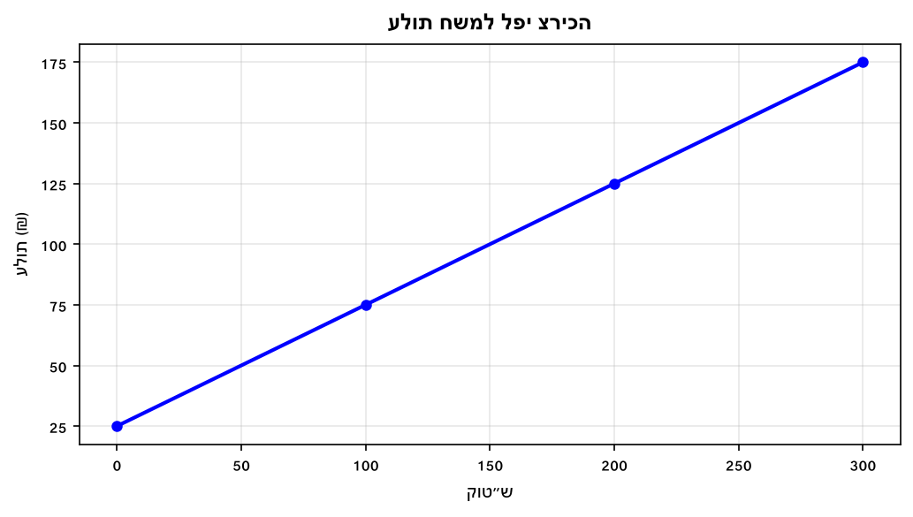

א. מה מציין ציר ה-x בגרף זה?

ב. מה מציין ציר ה-y בגרף זה?

ג. מה פירוש הנקודה הראשונה בטבלה (קוט"ש = 0)?

---

**2.** גרף מתאר את גובה ילדה לפי גילה.

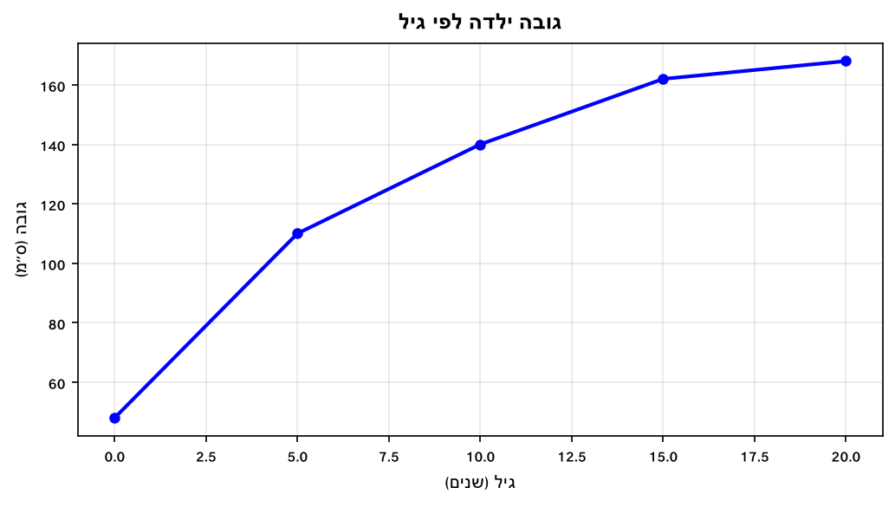

א. מה מציין ציר ה-x?

ב. מה מציין ציר ה-y?

ג. מה פירוש הנקודה הראשונה בטבלה?

---

**3.** גרף מתאר את כמות המים בבריכה לפי הזמן שעבר מאז פתיחת ברז המילוי.

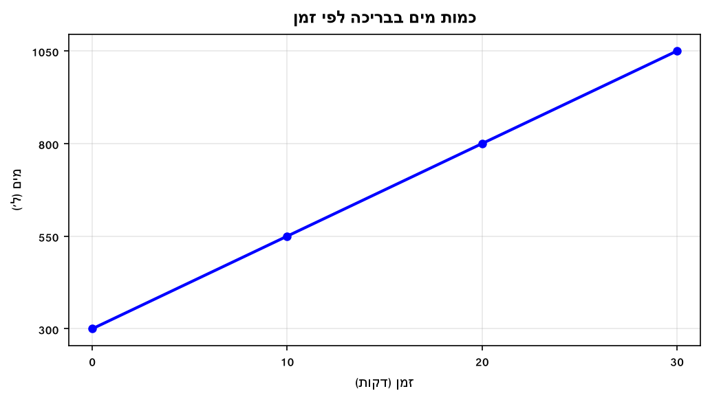

א. מה מציין ציר ה-x?

ב. מה מציין ציר ה-y?

ג. מה פירוש הנקודה הראשונה בטבלה?

---

**4.** גרף מתאר את כמות הדלק בבריכת הדלק של רכב לפי מרחק הנסיעה.

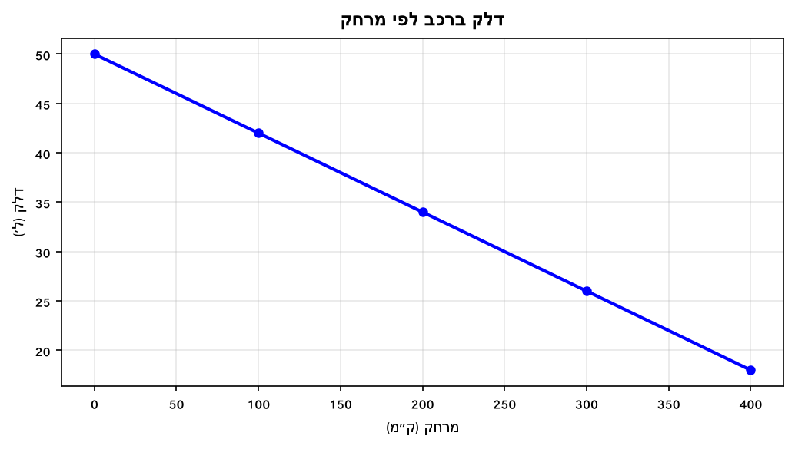

א. מה מציין ציר ה-x?

ב. מה מציין ציר ה-y?

ג. מה פירוש הנקודה האחרונה בטבלה?

---

**5.** גרף מתאר את עלות מנוי חדר כושר לפי מספר חודשי המנוי.

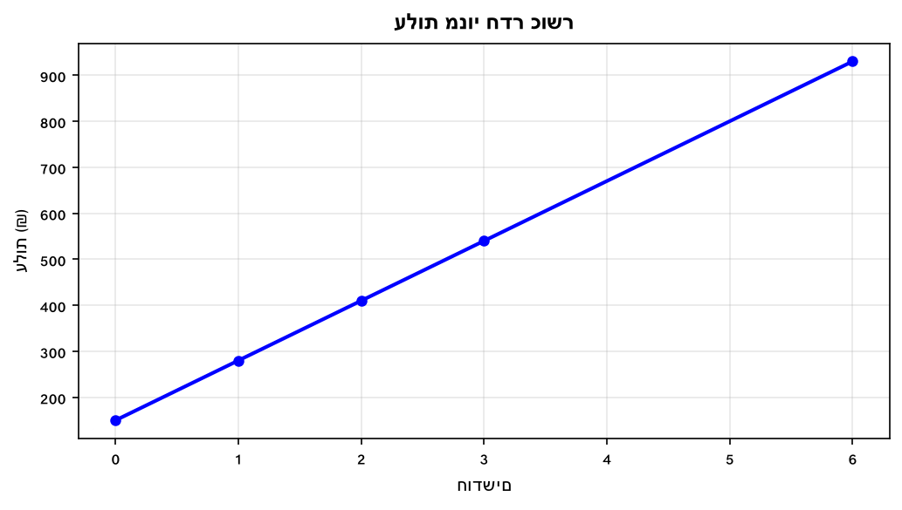

א. מה מציין ציר ה-x?

ב. מה מציין ציר ה-y?

ג. מה פירוש הנקודה שבה ה-x שווה לאפס?

---

**6.** גרף מתאר את טמפרטורת גוף חולה לפי שעות היום.

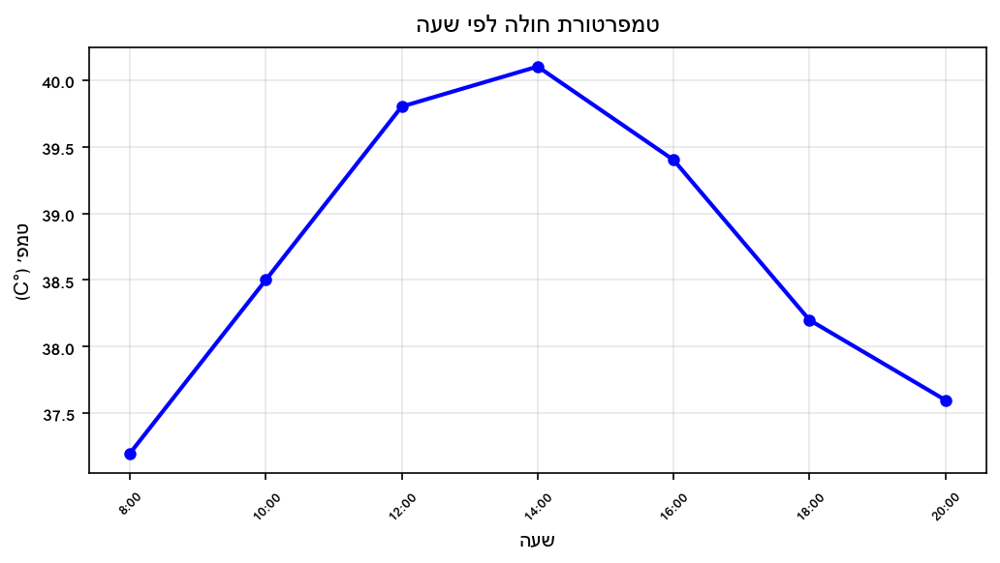

א. מה מציין ציר ה-x?

ב. מה מציין ציר ה-y?

ג. מה פירוש הנקודה שבה ה-x שווה ל-14:00?

---

**7.** גרף מתאר את הכנסות חנות לפי חודשי השנה (ינואר = חודש 1).

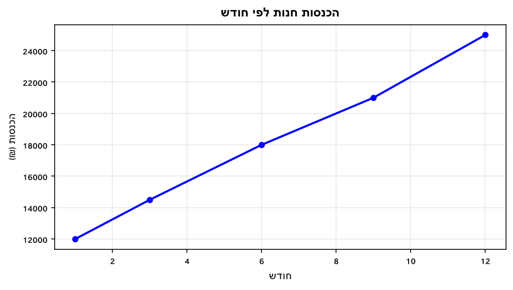

א. מה מציין ציר ה-x?

ב. מה מציין ציר ה-y?

ג. מה פירוש הנקודה שבה ה-x שווה ל-12?

---

**8.** גרף מתאר את עלות שיחת טלפון לפי אורכה בדקות.

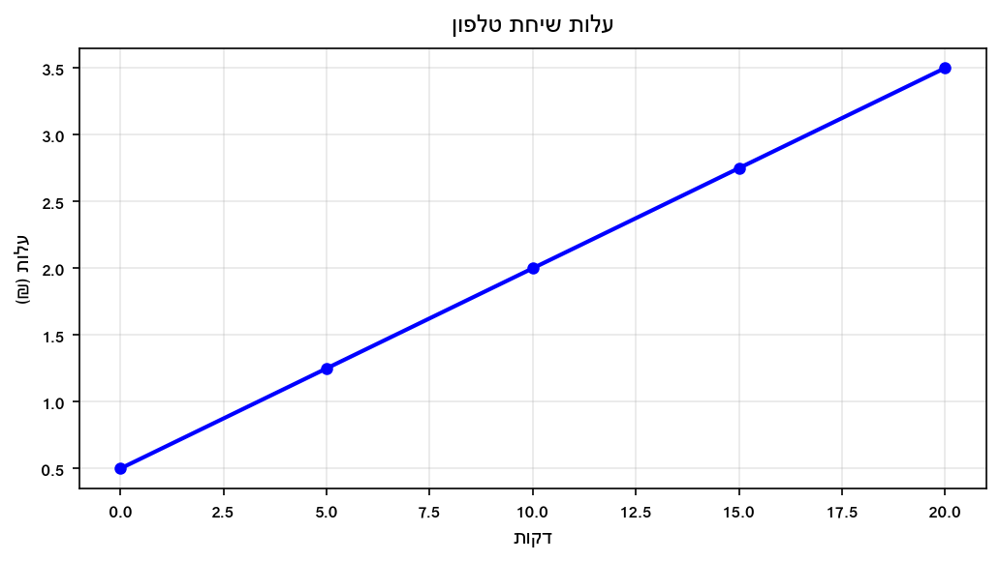

א. מה מציין ציר ה-x?

ב. מה מציין ציר ה-y?

ג. מה פירוש הנקודה שבה ה-x שווה לאפס?

---

## רמה 2: תרגול שוטף ומשולב (8 תרגילים)

**9.** גרף מתאר מסלול ריצה של ספורטאי.
ציר ה-x מייצג זמן בדקות, ציר ה-y מייצג מרחק בק"מ.

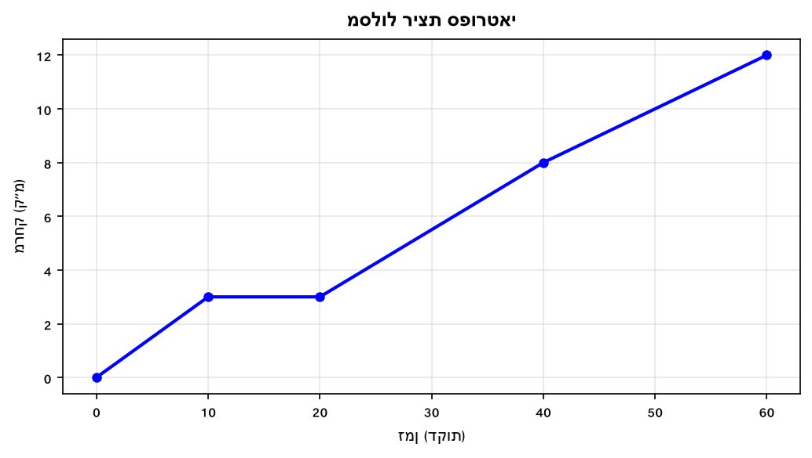

א. מה מייצג כל ציר?

ב. מה פירוש הקטע שבו ה-y שווה לאותו ערך לאורך זמן?

ג. מה פירוש הנקודה האחרונה בטבלה?

ד. בין אילו דקות עמד הספורטאי במקום?

---

**10.** גרף מתאר את מחיר מניה לפי ימי מסחר (1 עד 10).

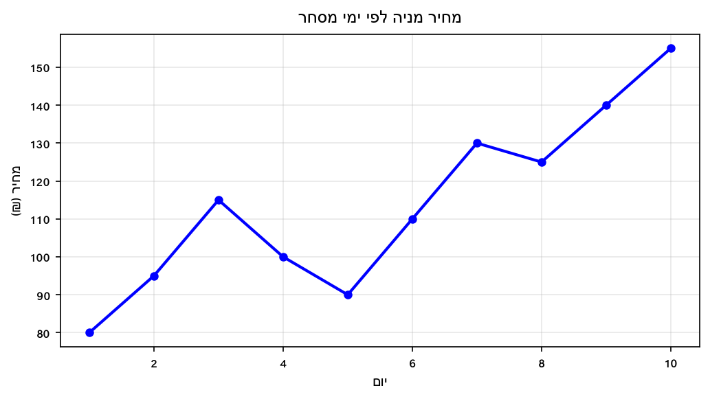

א. מה מציין כל ציר?

ב. מה פירוש הנקודה שבה x=1?

ג. באיזה יום הייתה הירידה הגדולה ביותר במחיר, ומה גודל הירידה?

---

**11.** גרף מתאר את עלות השכרת קורקינט חשמלי לפי דקות הנסיעה.
ציר ה-x: דקות נסיעה. ציר ה-y: עלות (₪).

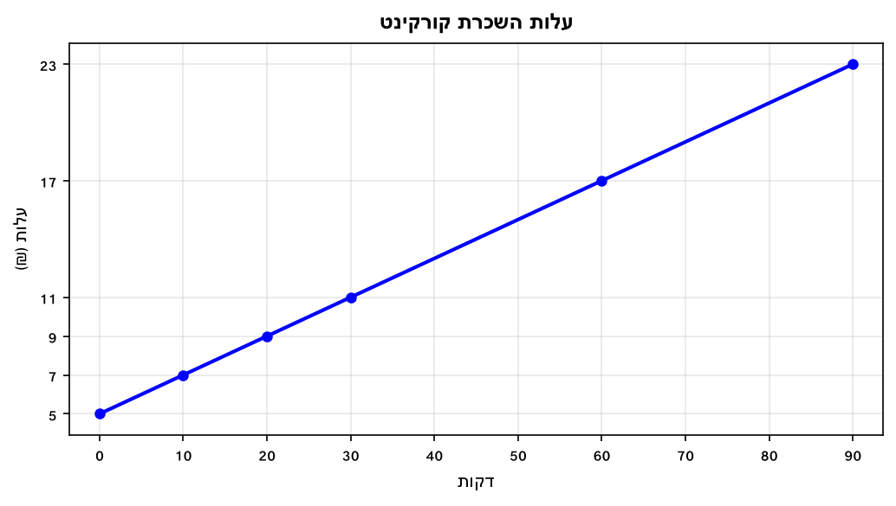

א. מה מציין כל ציר?

ב. מה פירוש הנקודה שבה x=0?

ג. מה פירוש הנקודה שבה x=90?

ד. בכמה שקלים עולה כל דקת נסיעה נוספת?

---

**12.** גרף מתאר טמפרטורת תנור לפי זמן (דקות): חימום, שמירה ואחר-כך כיבוי.

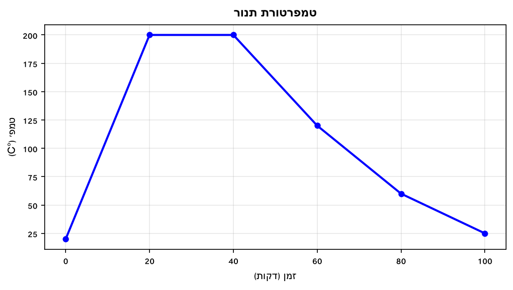

א. מה מציין כל ציר?

ב. בין אילו דקות הטמפרטורה קבועה?

ג. מה פירוש הטמפרטורה הקבועה?

ד. בין אילו דקות התנור מתקרר?

---

**13.** גרף מתאר ביצועי שחיין בתחרות.
ציר ה-x: מספר סיבוב. ציר ה-y: זמן הסיבוב (שניות).

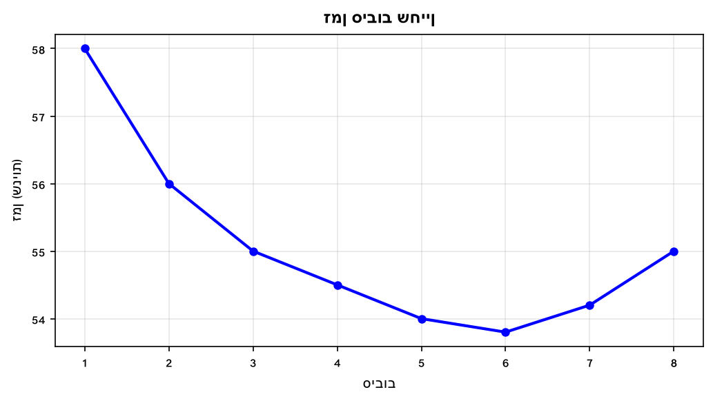

א. מה מציין כל ציר?

ב. מה פירוש ירידה ב-y מסיבוב לסיבוב?

ג. מאיזה סיבוב החל השחיין להאט?

---

**14.** גרף מתאר גובה כדור (מטרים) שנזרק כלפי מעלה לפי זמן (שניות).

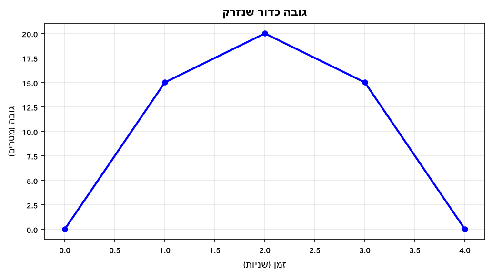

א. מה מציין כל ציר?

ב. מה פירוש הנקודה הראשונה?

ג. מה פירוש הנקודה האחרונה?

ד. מה המשמעות הפיזיקלית של הנקודה שבה x=2?

---

**15.** גרף מתאר כמות חיידקים (אלפים) בצלחת גידול לפי שעות.

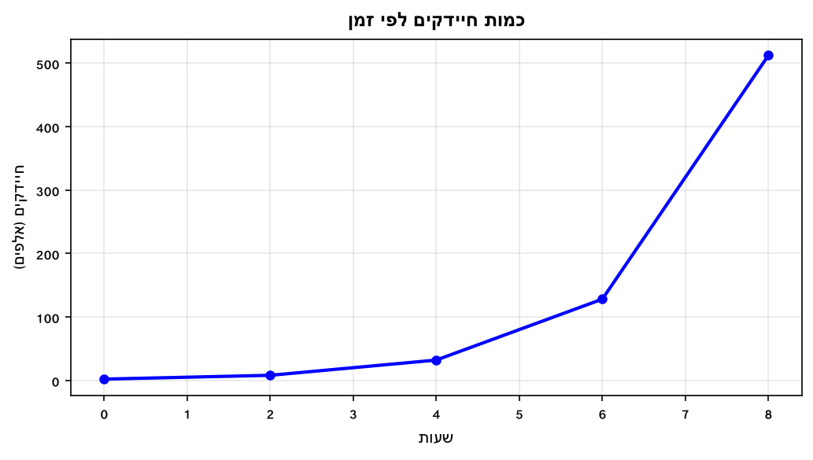

א. מה מציין כל ציר?

ב. מה פירוש הנקודה הראשונה בטבלה?

ג. מה כמות החיידקים לאחר 8 שעות בחיידקים ממש (לא באלפים)?

---

**16.** גרף מתאר תכולת מיכל מים (ליטרים) לאורך שעות היום.

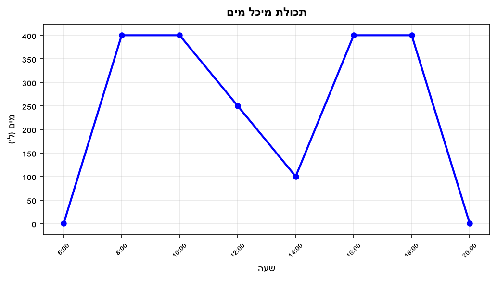

א. מה מציין כל ציר?

ב. בין אילו שעות עמדה כמות המים על 400 ליטרים?

ג. מה פירוש הנקודות שבהן ה-y שווה לאפס?

---

## רמה 3: רמת בחינת מה"ט (4 תרגילים)

**17.** הגרף הבא מתאר את עלות השכרת רכב (₪) לפי מרחק הנסיעה (ק"מ).
הנקודות המסומנות בגרף:

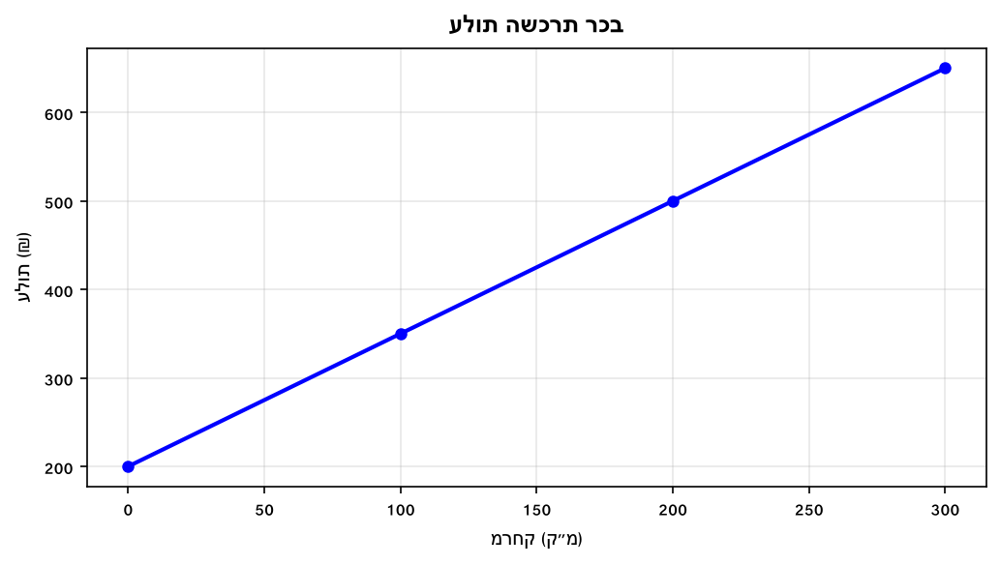

א. מה מציין כל ציר?

ב. מה פירוש הנקודה שבה x=0, ומה המשמעות המעשית שלה?

ג. כמה עולה נסיעה של 150 ק"מ?

ד. לקוח שילם 500 ₪ — כמה ק"מ נסע?

---

**18.** גרף מתאר צריכת חשמל (קוט"ש) של מפעל לפי שעות היום.

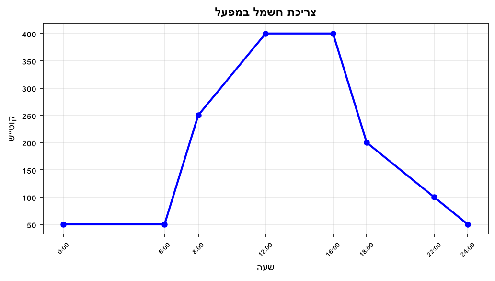

א. מה מציין כל ציר?

ב. בין אילו שעות המפעל פעל בעומס מלא (צריכה מקסימלית)?

ג. מה פירוש ערך ה-y הקבוע של 50 קוט"ש בין חצות לשעה 6:00?

ד. בין אילו שעות עלתה הצריכה בצורה המשמעותית ביותר?

---

**19.** גרף מתאר הכנסות חברה (₪ אלפים) לאורך 8 חודשים.

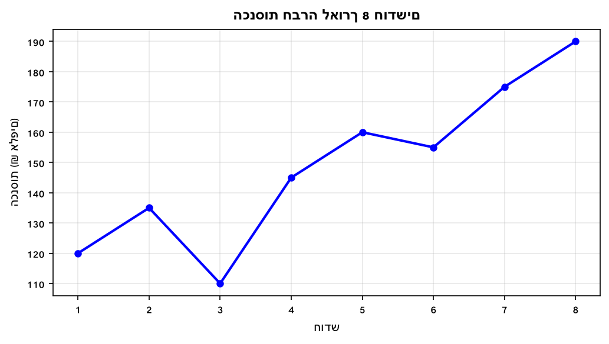

א. מה מציין כל ציר?

ב. מה הכנסות חודש 2 בשקלים ממש (לא אלפים)?

ג. באיזה חודש הייתה ירידה בהכנסות לעומת החודש הקודם?

ד. מה ההפרש בין הכנסות חודש 8 לחודש 1, בשקלים ממש?

---

**20.** גרף מתאר טיול של משפחה.
ציר ה-x: שעות ביום. ציר ה-y: מרחק מהבית (ק"מ).

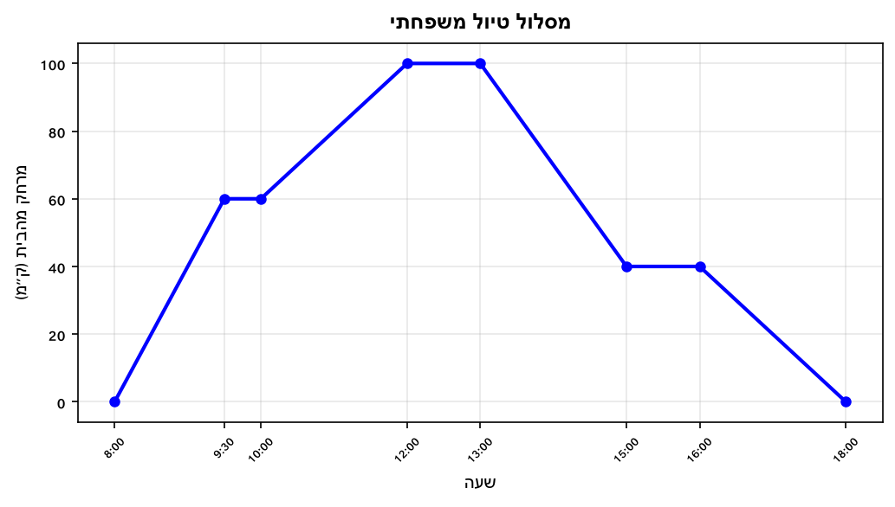

א. מה מציין כל ציר?

ב. מה פירוש הקטעים שבהם ה-y קבוע לאורך זמן?

ג. בין אילו שעות חזרה המשפחה לכיוון הבית?

ד. מה המרחק המקסימלי מהבית שאליו הגיעה המשפחה?

---

תשובות סופיות

1. א. ציר x: כמות קוט"ש שנצרכו. ב. ציר y: עלות בשקלים. ג. גם ללא כל צריכה קיים תשלום קבוע של 25 ₪ (דמי קבועה).

2. א. ציר x: גיל בשנים. ב. ציר y: גובה בס"מ. ג. בלידתה (גיל 0) גובה הילדה היה 48 ס"מ.

3. א. ציר x: זמן (דקות) מאז פתיחת הברז. ב. ציר y: כמות מים (ליטרים) בבריכה. ג. לפני פתיחת הברז היו בבריכה 300 ליטרים.

4. א. ציר x: מרחק נסיעה (ק"מ). ב. ציר y: כמות דלק (ליטרים) בבריכת הדלק. ג. לאחר נסיעה של 400 ק"מ נותרו 18 ליטרים בבריכת הדלק.

5. א. ציר x: מספר חודשי המנוי. ב. ציר y: עלות מצטברת (₪). ג. דמי הרשמה (תשלום חד-פעמי) של 150 ₪ גם ללא אף חודש מנוי.

6. א. ציר x: שעות היום. ב. ציר y: טמפרטורת הגוף (°C). ג. בשעה 14:00 הגיעה טמפרטורת החולה לשיאה: 40.1°C.

7. א. ציר x: מספר החודש בשנה (1–12). ב. ציר y: הכנסות החנות (₪). ג. בחודש דצמבר (חודש 12) ההכנסות היו 25,000 ₪.

8. א. ציר x: אורך השיחה (דקות). ב. ציר y: עלות השיחה (₪). ג. עלות חיבור קבועה של 0.50 ₪ לפני תחילת השיחה.

9. א. ציר x: זמן (דקות), ציר y: מרחק (ק"מ). ב. הספורטאי עמד במקום (לא זז). ג. לאחר 60 דקות הספורטאי עבר 12 ק"מ בסך הכל. ד. בין דקה 15 לדקה 30.

10. א. ציר x: יום מסחר (1–10), ציר y: מחיר מניה (₪). ב. ביום הראשון מחיר המניה היה 80 ₪. ג. ביום ה-4: ירידה מ-115 ₪ ל-100 ₪ — ירידה של 15 ₪.

11. א. ציר x: דקות נסיעה, ציר y: עלות (₪). ב. עלות פתיחה (גם ללא נסיעה) היא 5 ₪. ג. לאחר 90 דקות נסיעה העלות הכוללת היא 23 ₪. ד. עלות כל דקת נסיעה נוספת:
$\frac{7-5}{10-0} = \frac{2}{10} = 0.2$
₪ לדקה.

12. א. ציר x: זמן (דקות), ציר y: טמפרטורה (°C). ב. בין דקה 20 לדקה 40. ג. התנור הגיע לטמפרטורת פעולה מקסימלית (200°C) ושמר עליה. ד. בין דקה 40 לדקה 100.

13. א. ציר x: מספר סיבוב, ציר y: זמן הסיבוב (שניות). ב. השחיין שחה מהר יותר — פחות שניות משמע ביצוע טוב יותר. ג. מסיבוב 7 (עלייה מ-53.8 ל-54.2 שניות).

14. א. ציר x: זמן (שניות), ציר y: גובה (מטרים). ב. הכדור הושלך מגובה 0 (מהקרקע). ג. הכדור חזר לקרקע לאחר 4 שניות. ד. גובה מקסימלי — לאחר 2 שניות הכדור הגיע לגובה 20 מטרים (שיאו).

15. א. ציר x: זמן (שעות), ציר y: כמות חיידקים (אלפים). ב. בתחילת הניסוי (שעה 0) היו 2,000 חיידקים. ג. לאחר 8 שעות:
$512 \times 1{ }000 = 512{ }000$
חיידקים.

16. א. ציר x: שעות היום, ציר y: כמות מים (ליטרים). ב. בין 8:00 ל-10:00 ובין 16:00 ל-18:00. ג. המיכל ריק לחלוטין — בשעה 6:00 (לפני המילוי) ובשעה 20:00 (לאחר ריקון מלא).

17. א. ציר x: מרחק נסיעה (ק"מ), ציר y: עלות (₪). ב. עלות בסיס (דמי השכרה ללא נסיעה) = 200 ₪. ג. שיפוע:
$\frac{350-200}{100-0} = 1.5$
₪ לק"מ. עלות 150 ק"מ:
$200 + 150 \times 1.5 = 425$
₪. ד.
$500 - 200 = 300$
₪ לנסיעה;
$300 \div 1.5 = 200$
ק"מ.

18. א. ציר x: שעות היום, ציר y: צריכת חשמל (קוט"ש). ב. בין 12:00 ל-16:00 (400 קוט"ש). ג. צריכת חשמל בסיסית לתשתיות ואבטחה בשעות הלילה. ד. בין 6:00 ל-12:00: עלייה של
$400 - 50 = 350$
קוט"ש ב-6 שעות.

19. א. ציר x: מספר חודש (1–8), ציר y: הכנסות (₪ אלפים). ב.
$135 \times 1{ }000 = 135{ }000$
₪. ג. בחודש 3 (ירידה מ-135 ל-110 אלפי ₪) ובחודש 6 (ירידה מ-160 ל-155 אלפי ₪). ד.
$(190 - 120) \times 1{ }000 = 70{ }000$
₪.

20. א. ציר x: שעות ביום, ציר y: מרחק מהבית (ק"מ). ב. המשפחה עצרה (שהתה במקום). ג. בין 13:00 ל-18:00 (עם עצירה בין 15:00 ל-16:00 ב-40 ק"מ). ד. 100 ק"מ מהבית.

