# תת-נושא 2: קריאת נקודות מפתח — נקודת ההתחלה, ערכי מינימום ומקסימום

---

## רמה 1: בניית ביטחון (8 תרגילים)

**1.** גרף מתאר את טמפרטורת האוויר לאורך יום אחד.

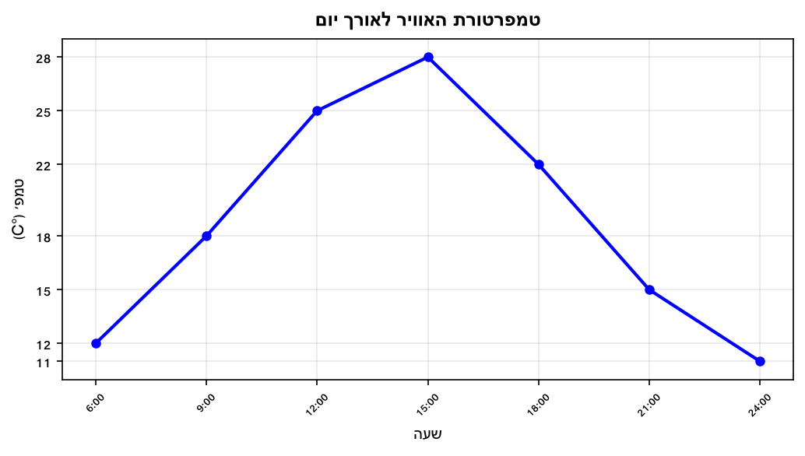

א. מהי הטמפרטורה בתחילת המדידה (6:00)?

ב. מהי הטמפרטורה המקסימלית, ובאיזו שעה הייתה?

ג. מהי הטמפרטורה המינימלית במהלך היום, ובאיזו שעה הייתה?

---

**2.** גרף מתאר את כמות המים במאגר לאורך היום.

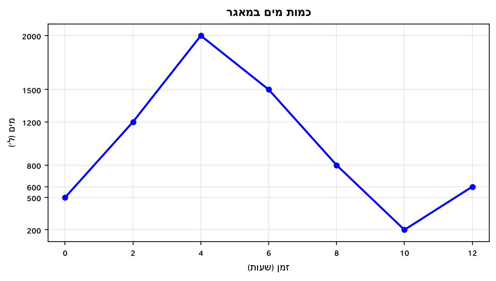

א. כמה מים היו במאגר בתחילת המדידה?

ב. מהי כמות המים המקסימלית, ובאיזו שעה הייתה?

ג. מהי כמות המים המינימלית, ובאיזו שעה הייתה?

---

**3.** גרף מתאר את מחיר מניה לאורך 10 ימי מסחר.

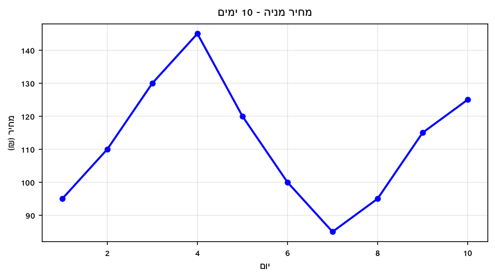

א. מהו מחיר הפתיחה של המניה (יום 1)?

ב. מהו המחיר הגבוה ביותר ובאיזה יום הושג?

ג. מהו המחיר הנמוך ביותר ובאיזה יום הושג?

---

**4.** גרף מתאר את גובה כדור שנזרק כלפי מעלה לפי הזמן.

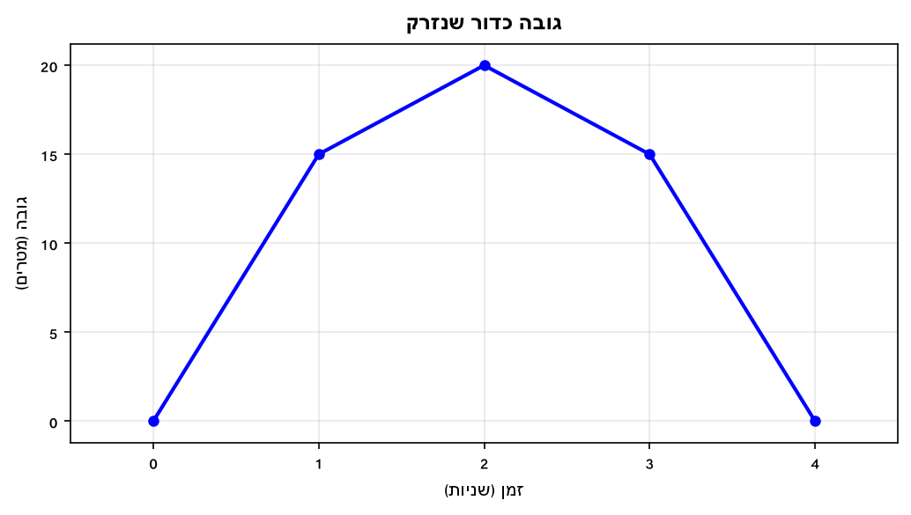

א. מהו הגובה ההתחלתי של הכדור?

ב. מהו הגובה המקסימלי שאליו הגיע הכדור, ומתי?

ג. מתי הכדור חזר לגובה ההתחלתי?

---

**5.** גרף מתאר מילוי וריקון של בריכת שחייה.

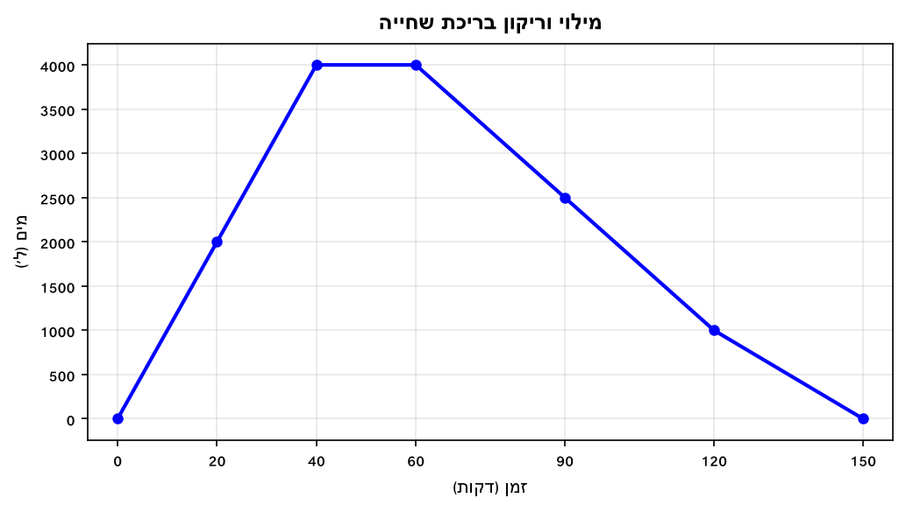

א. כמה מים היו בבריכה בתחילת התהליך?

ב. מהי כמות המים המקסימלית, ובאיזה זמן הגיעה אליה?

ג. מתי הבריכה התרוקנה לחלוטין?

---

**6.** גרף מתאר הכנסות חנות לפי חודשי השנה (כמה חודשים נבחרו).

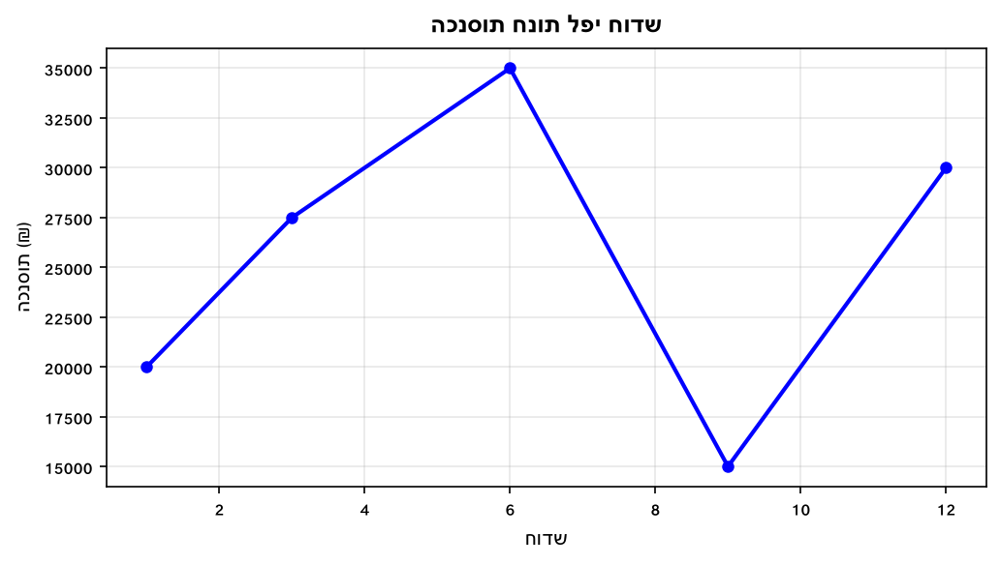

א. מהן הכנסות החנות בחודש הראשון?

ב. באיזה חודש ההכנסות היו הגבוהות ביותר, ומהן?

ג. באיזה חודש ההכנסות היו הנמוכות ביותר, ומהן?

---

**7.** גרף מתאר את גובה שתיל (ס"מ) לפי שבועות הגידול.

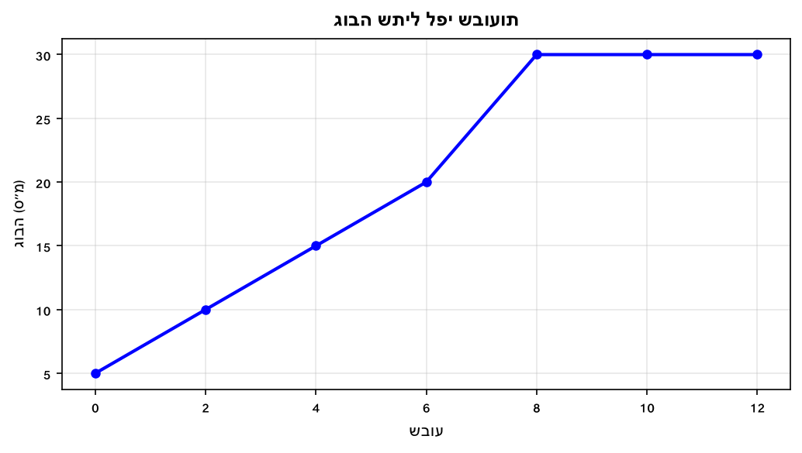

א. מהו הגובה ההתחלתי של השתיל?

ב. מהו הגובה המקסימלי שאליו הגיע השתיל?

ג. מאיזה שבוע הפסיק השתיל לגדול?

---

**8.** גרף מתאר מהירות נסיעה של רכב (קמ"ש) לפי שעות.

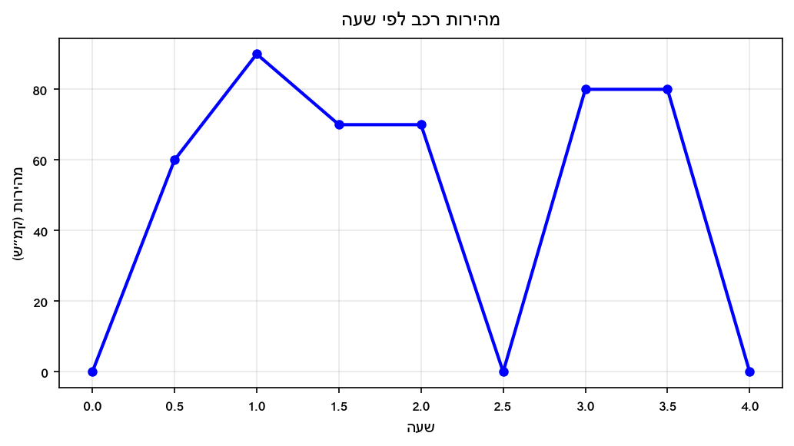

א. מהי מהירות הרכב בתחילת הנסיעה?

ב. מהי המהירות המקסימלית ובאיזו שעה הגיע אליה הרכב?

ג. כמה פעמים עצר הרכב לחלוטין (מהירות = 0) לאורך המדידה?

---

## רמה 2: תרגול שוטף ומשולב (8 תרגילים)

**9.** גרף מתאר את טמפרטורת גוף חולה לאורך יממה שלמה.

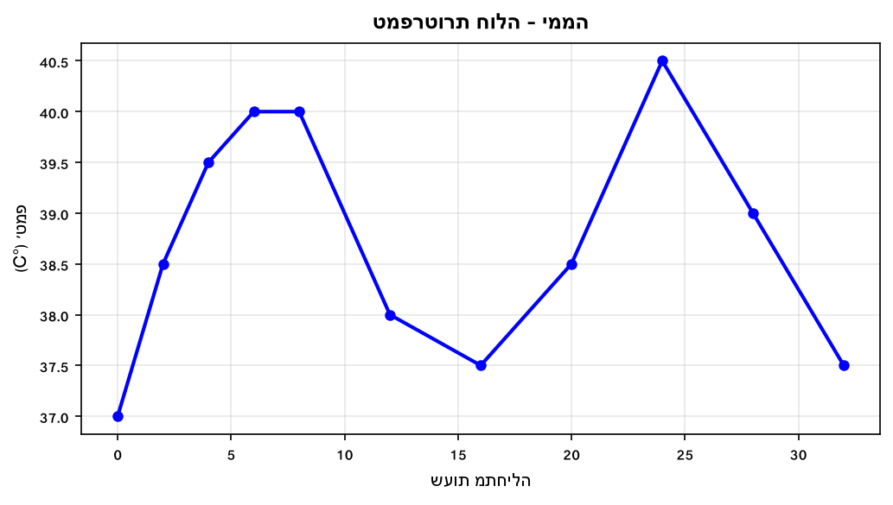

א. מהי הטמפרטורה ההתחלתית של המדידה?

ב. מהי טמפרטורת הגוף המקסימלית הכוללת לאורך כל היממה, ובאיזו שעה הגיעה אליה?

ג. מהי הטמפרטורה המינימלית וכמה שעות לאחר תחילת המדידה הגיעה אליה?

---

**10.** גרף מתאר צריכת חשמל (קוט"ש) בבית לאורך 24 שעות.

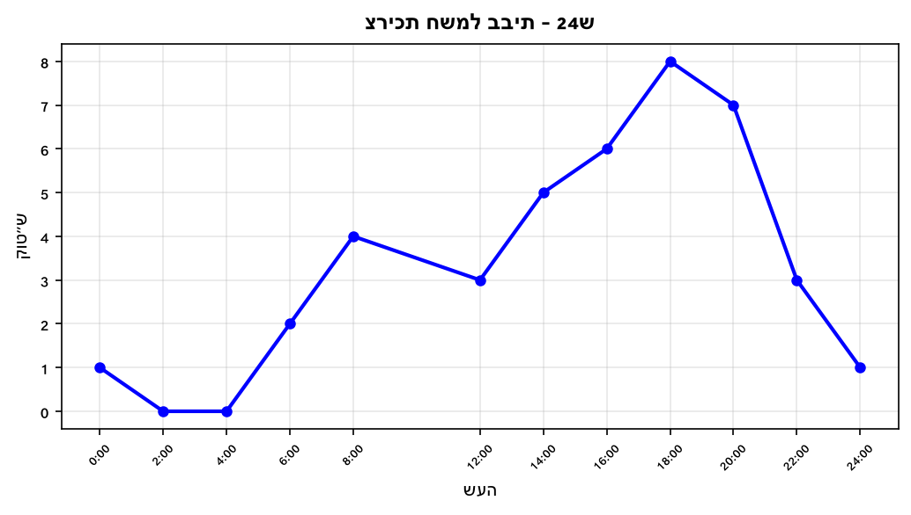

א. מהי הצריכה בתחילת המדידה (חצות)?

ב. מהי הצריכה המקסימלית ובאיזו שעה?

ג. מהי הצריכה המינימלית ובין אילו שעות?

---

**11.** גרף מתאר מרחק רץ מנקודת הפתיחה (ק"מ) לפי שעות.

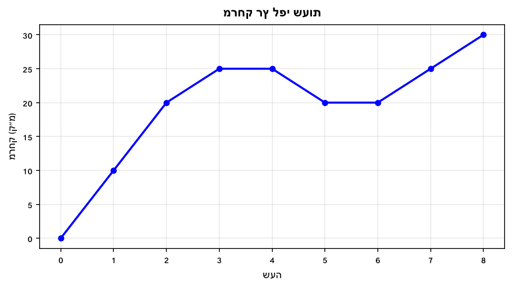

א. מהו המרחק ההתחלתי?

ב. מהו המרחק המקסימלי מנקודת הפתיחה לאורך כל המסע?

ג. בין אילו שעות חזר הרץ לכיוון נקודת הפתיחה?

---

**12.** גרף מתאר רווחים והפסדים (₪ אלפים) של חברה לאורך שנה.
ערכים חיוביים = רווח. ערכים שליליים = הפסד.

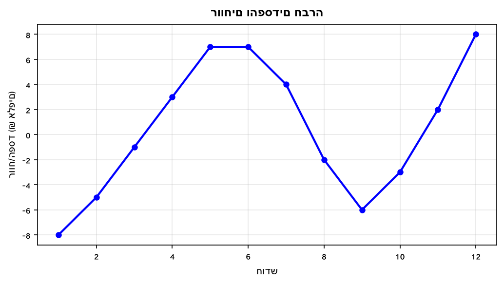

א. מה מצב החברה בחודש הראשון (רווח או הפסד, ובכמה)?

ב. מהו הרווח המקסימלי ובאיזה חודש?

ג. מהו ההפסד המקסימלי ובאיזה חודש?

---

**13.** גרף מתאר גובה מים במיכל מלבני (ס"מ) לאורך 60 דקות (ממלאים ומרוקנים לסירוגין).

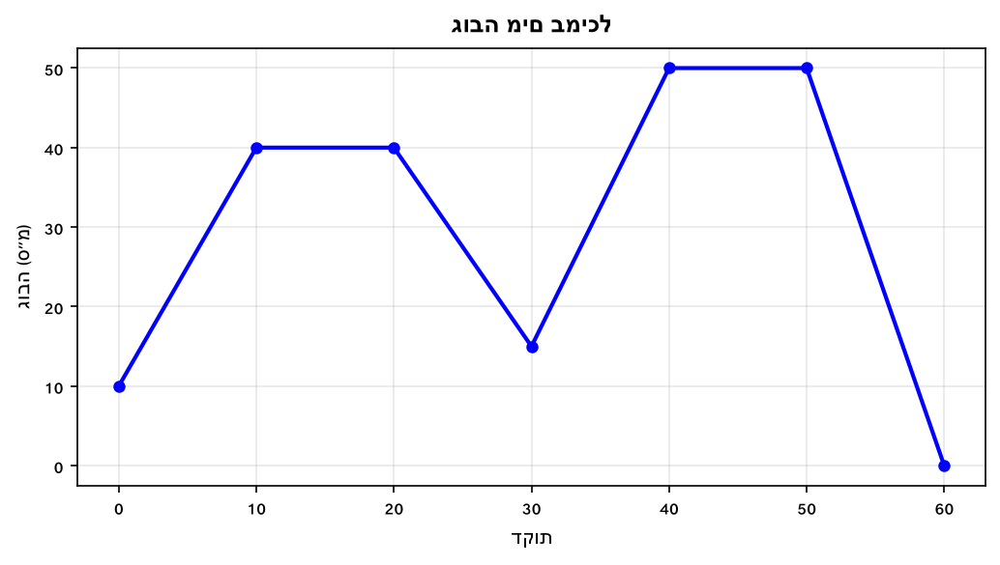

א. מהו גובה המים בתחילת התהליך?

ב. מהו גובה המים המקסימלי שהושג?

ג. מהו גובה המים המינימלי בסוף התהליך (לא בהתחלה)?

---

**14.** גרף מתאר טמפרטורות ממוצעות בעיר (°C) לפי חודשי השנה.

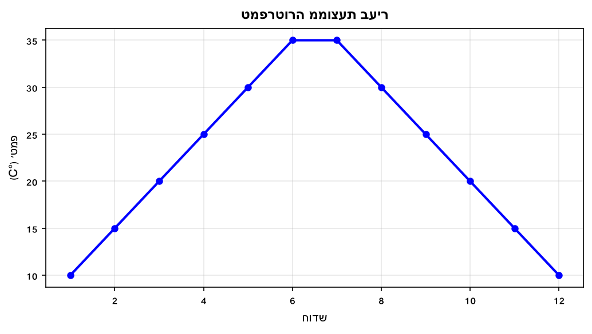

א. מהי הטמפרטורה הממוצעת בחודש ינואר (חודש 1)?

ב. מהי הטמפרטורה הממוצעת הגבוהה ביותר ובאיזה חודש?

ג. מהי הטמפרטורה הממוצעת הנמוכה ביותר ובאיזה חודש?

---

**15.** גרף מתאר ייצור של מפעל (יחידות ליום) לאורך שבוע עבודה.

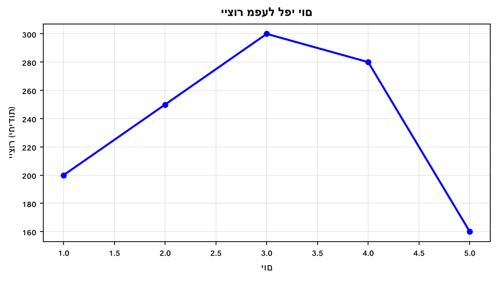

א. מהו הייצור ביום הראשון?

ב. ביום איזה יום הגיע הייצור לשיאו ומהו הייצור?

ג. ביום איזה יום הייצור היה הנמוך ביותר ומהו?

ד. מהו ההפרש בין הייצור המקסימלי לייצור המינימלי?

---

**16.** גרף מתאר גובה מטוס (מטרים) לפי זמן (דקות) מרגע ההמראה.

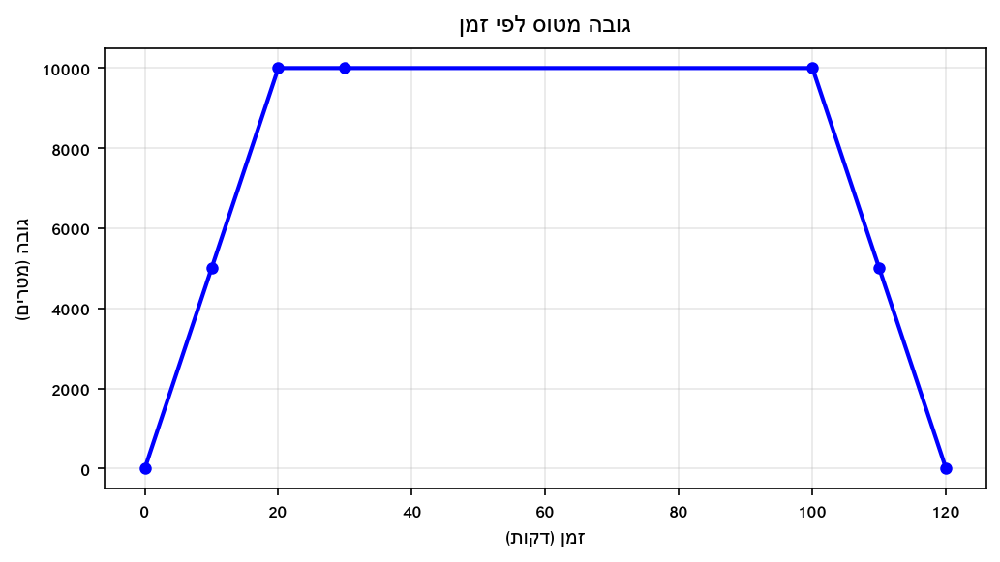

א. מהו גובה המטוס בתחילת הטיסה?

ב. מהו גובה השיוט המקסימלי שאליו הגיע המטוס?

ג. בין אילו דקות טס המטוס בגובה שיוט קבוע?

ד. כמה דקות נמשכה כל שלב (עלייה / שיוט / ירידה)?

---

## רמה 3: רמת בחינת מה"ט (4 תרגילים)

**17.** הגרף הבא מתאר את הגובה (ס"מ) של מיכל לפי גילה (שנים).
(מבוסס על סגנון בחינת מה"ט 99913)

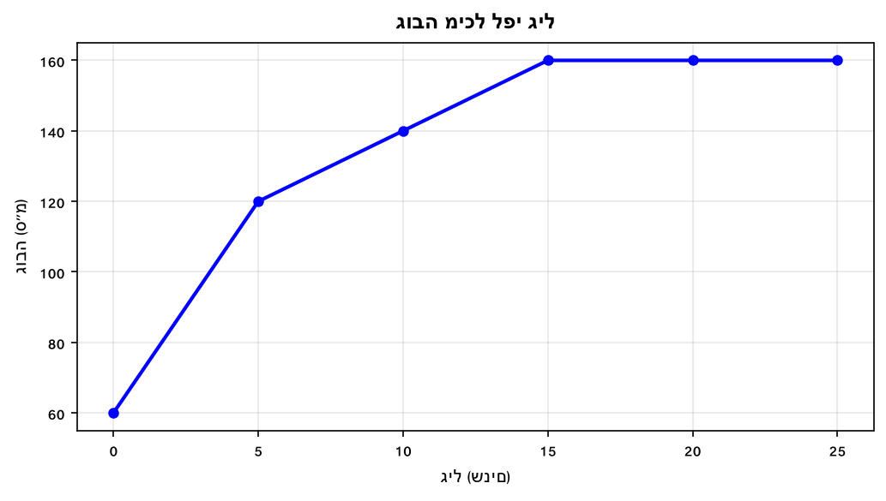

א. מה היה גובה מיכל בלידתה?

ב. מהו הגובה המקסימלי שהגיעה אליו מיכל ומאיזה גיל הגובה נשאר קבוע?

ג. בין אילו גילאים גדלה מיכל הכי מהר (עלייה הגדולה ביותר בגובה)?

ד. מהו סך הגידול של מיכל (בס"מ) מלידה עד גובה מקסימלי?

---

**18.** הגרף הבא מתאר את כמות המים (ליטרים) בבריכה לפי הזמן (דקות), כאשר שני ברזים פתוחים: ברז ממלא וברז מרוקן.

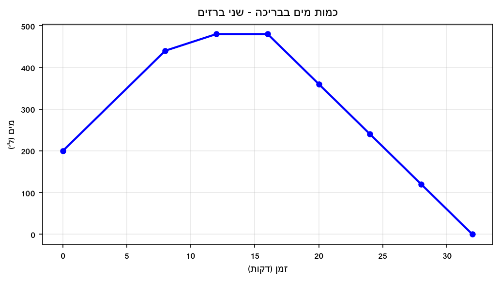

א. כמה מים היו בבריכה בתחילת המדידה?

ב. מהי כמות המים המקסימלית שהייתה בבריכה, ובאיזה פרק זמן?

ג. מתי ומאיזה כמות החלה הבריכה להתרוקן?

ד. האם ניתן לומר בוודאות שמדקה 12 עד 16 הברז הממלא והמרוקן פעלו בקצב שווה? נמקו.

---

**19.** הגרף הבא מתאר את מחיר מניה (₪) לאורך 10 ימי מסחר.

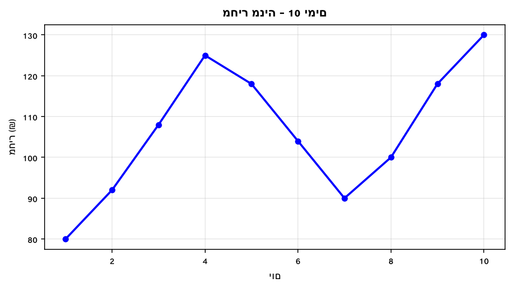

א. מהו מחיר הפתיחה של המניה (יום 1)?

ב. מהו המחיר המקסימלי ובאיזה יום?

ג. מהו המחיר המינימלי (לא כולל יום 1) ובאיזה יום?

ד. מהו ההפרש בין מחיר סגירה (יום 10) לבין מחיר הפתיחה (יום 1)?

---

**20.** גרף מתאר ביצועי רצנית מרתון: זמן הסיבוב (שניות) לפי מספר הסיבוב (סה"כ 10 סיבובים).

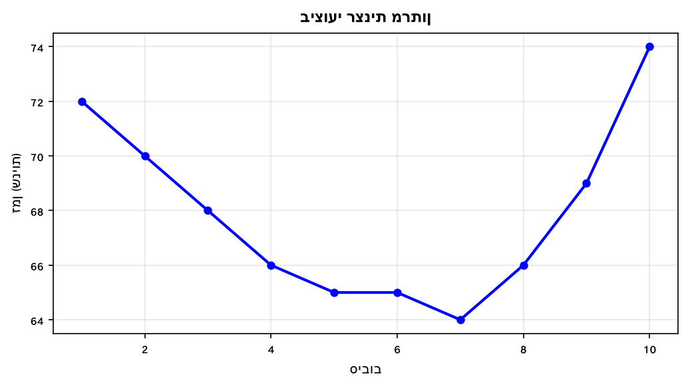

א. מהו זמן הסיבוב ההתחלתי?

ב. מהו הסיבוב המהיר ביותר (זמן מינימלי) ובאיזה סיבוב?

ג. מהו הסיבוב האיטי ביותר (זמן מקסימלי) ובאיזה סיבוב?

ד. מהו ההפרש בין זמן הסיבוב הראשון לסיבוב האיטי ביותר (סיבוב 10)?

---

תשובות סופיות

1.
א. 12°C.
ב. 28°C בשעה 15:00.
ג. 11°C בשעה 24:00.

2.
א. 500 ליטרים.
ב. 2,000 ליטרים בשעה 4.
ג. 200 ליטרים בשעה 10.

3.
א. 95 ₪.
ב. 145 ₪ ביום 4.
ג. 85 ₪ ביום 7.

4.
א. 0 מטרים (מהקרקע).
ב. 20 מטרים בשנייה ה-2.
ג. בשנייה ה-4.

5.
א. 0 ליטרים (בריכה ריקה).
ב. 4,000 ליטרים החל מדקה 40 (פלאטו בין דקה 40 לדקה 60).
ג. בדקה 150.

6.
א. 18,000 ₪.
ב. בחודש 6 — 35,000 ₪.
ג. בחודש 9 — 15,000 ₪.

7.
א. 3 ס"מ.
ב. 30 ס"מ.
ג. משבוע 8.

8.
א. 0 קמ"ש (רכב עצור).
ב. 90 קמ"ש בשעה 1.
ג. 3 פעמים (בשעה 0, בשעה 2.5, בשעה 4).

9.
א. 37.2°C.
ב. 40.5°C בשעה 24 מתחילת המדידה.
ג. 37.2°C — בתחילת המדידה (שעה 0).

10.
א. 1 קוט"ש.
ב. 8 קוט"ש בשעה 18:00.
ג. 0.5 קוט"ש בין שעה 2:00 לשעה 4:00.

11.
א. 0 ק"מ.
ב. 30 ק"מ (שעה 8).
ג. בין שעה 4 לשעה 5 (המרחק ירד מ-24 ל-18 ק"מ).

12.
א. הפסד של 8,000 ₪.
ב. רווח מקסימלי: 8,000 ₪ בחודש 12.
ג. הפסד מקסימלי: 8,000 ₪ בחודש 1.

13.
א. 10 ס"מ.
ב. 50 ס"מ (דקות 40–50).
ג. 0 ס"מ (המיכל מתרוקן לחלוטין בדקה 60).

14.
א. 12°C.
ב. 32°C בחודש 7 (יולי).
ג. 12°C בחודש 1 (ינואר).

15.
א. 200 יחידות.
ב. יום 3 — 300 יחידות.
ג. יום 5 — 150 יחידות.
ד.
$150$
יחידות.

16.
א. 0 מטרים.
ב. 10,000 מטרים.
ג. בין דקה 20 לדקה 100.
ד. עלייה: 20 דקות, שיוט: 80 דקות, ירידה: 20 דקות.

17.
א. 50 ס"מ.
ב. 168 ס"מ, החל מגיל 20.
ג. בין גיל 0 ל-5 (עלייה של 60 ס"מ ב-5 שנים).
ד.
$118$
ס"מ.

18.
א. 200 ליטרים.
ב. 480 ליטרים בין דקה 12 לדקה 16.
ג. מדקה 16 — 480 ליטרים.
ד. כן: בפרק זמן זה הכמות קבועה (480 ליטרים), דבר המעיד שקצב המילוי שווה לקצב הריקון.

19.
א. 80 ₪.
ב. 130 ₪ ביום 10.
ג. 88 ₪ ביום 7.
ד.
$50$
₪.

20.
א. 72 שניות.
ב. 64 שניות בסיבוב 7.
ג. 74 שניות בסיבוב 10.
ד.
$2$
שניות.

