# תת-נושא 3.1: מבוא חזותי – קריאת נתונים ממערכת צירים

---

## רמה 1: בניית ביטחון (8 תרגילים)

1. הגרף מתאר את גובה ילדה (בסנטימטרים) לפי גילה (בשנים):

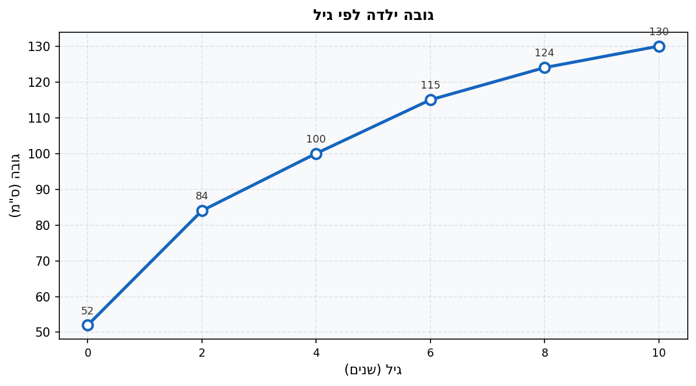

מה היה גובהה של הילדה בגיל
$4$?

2. בהתבסס על הגרף מתרגיל 1, מה היה גובהה של הילדה בלידתה (גיל
$0$)?

3. הגרף מתאר את טמפרטורת החדר (במעלות צלזיוס) לאורך היום:

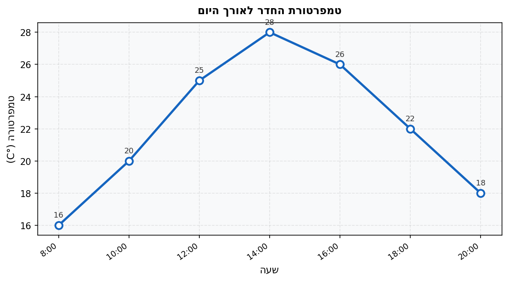

מהי הטמפרטורה המקסימלית? באיזו שעה הושגה?

4. בהתבסס על הגרף מתרגיל 3, מהי הטמפרטורה המינימלית? באיזו שעה הושגה?

5. הגרף מתאר כמות מים בבריכה (בליטרים) לפי זמן (בדקות):

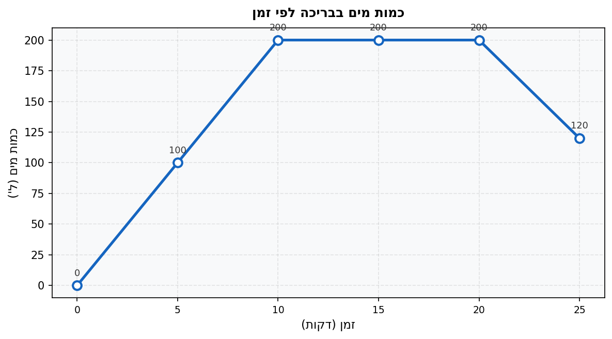

בין אילו דקות נשארה כמות המים קבועה?

6. הגרף מתאר את הכנסות חנות (בשקלים) לפי חודשי השנה (
$1$ = ינואר):

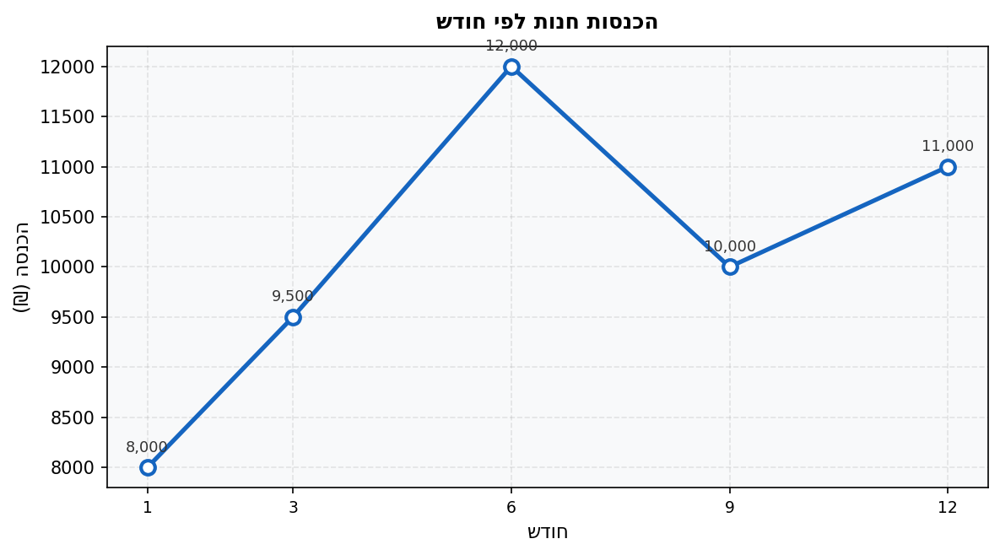

מה הייתה ההכנסה בחודש
$6$?

7. הגרף מתאר את המרחק של רכב (בק"מ) מנקודת המוצא לפי הזמן (בשעות):

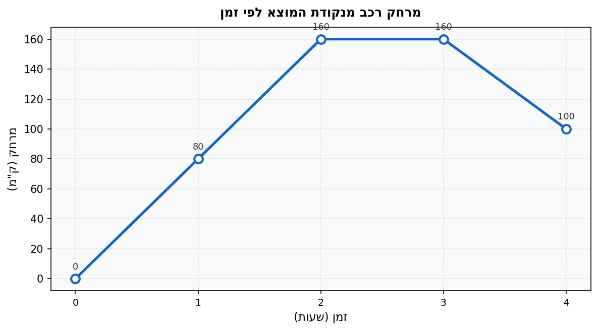

באיזה קטע זמן היה הרכב הרחוק ביותר מנקודת המוצא?

8. הגרף מתאר את ציוני תלמיד במבחנים (מתוך 100):

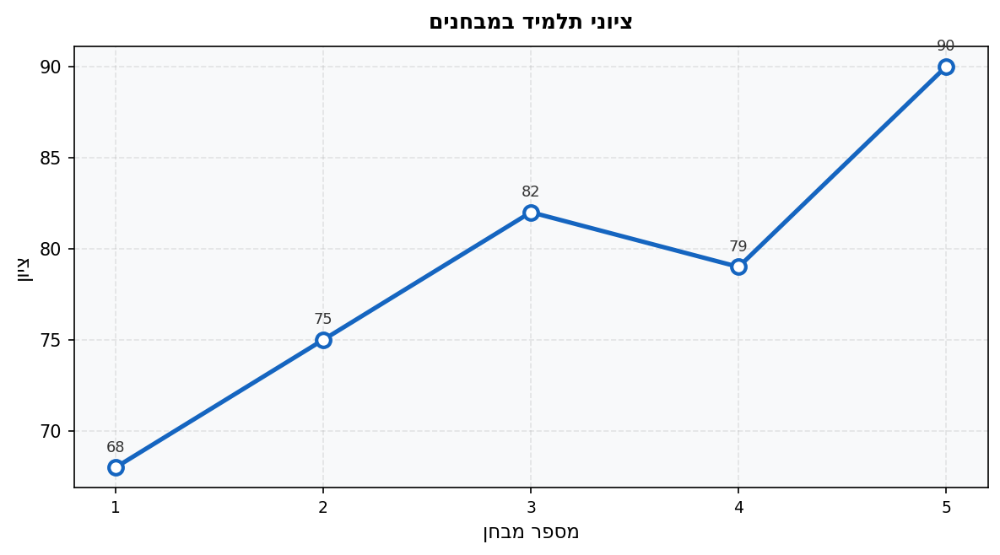

מהו הציון הנמוך ביותר? באיזה מבחן הוא התקבל?

---

## רמה 2: תרגול שוטף ומשולב (8 תרגילים)

9. הגרף מתאר את מחיר מניה (בשקלים) לפי ימי המסחר בשבוע (
$1$ = ראשון,
$5$ = חמישי):

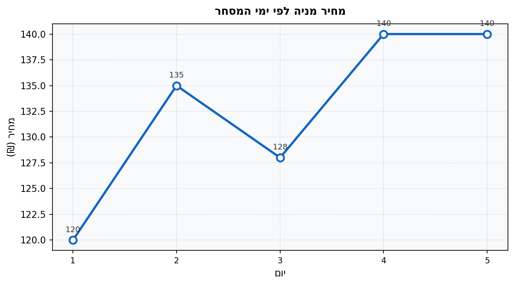

א. בין אילו ימים עלה מחיר המניה בכמות הגדולה ביותר? מהי כמות העלייה?

ב. בין אילו ימים ירד מחיר המניה?

ג. בין אילו ימים נשאר מחיר המניה קבוע?

10. הגרף מתאר את גובה כדור (במטרים) שנזרק כלפי מעלה לפי הזמן (בשניות):

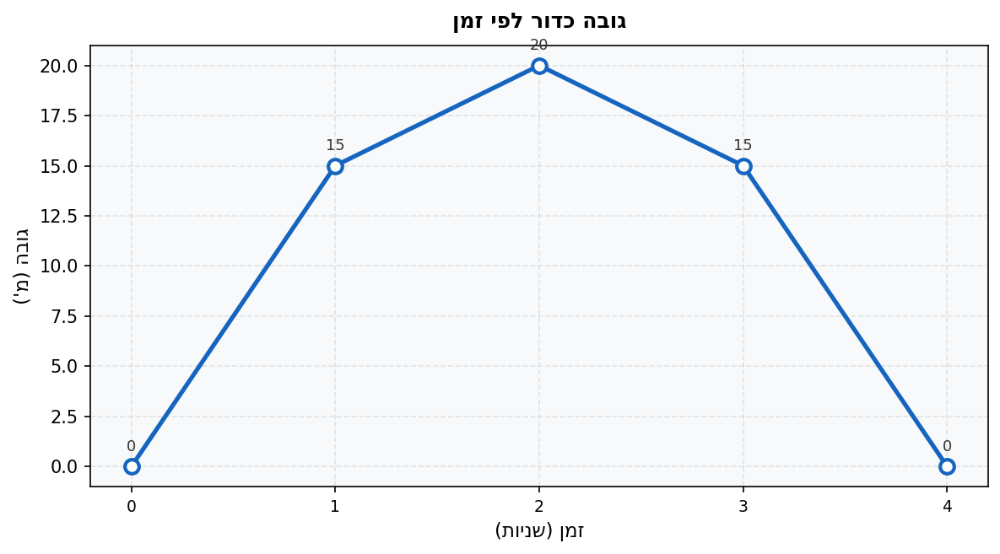

א. מהו הגובה המקסימלי שאליו הגיע הכדור?

ב. מתי חזר הכדור לגובה
$0$?

ג. תאר את מגמת הגובה בין שנייה
$0$ לשנייה
$2$, ובין שנייה
$2$ לשנייה
$4$.

11. הגרף מתאר את טמפרטורת גופו של חולה (במעלות צלזיוס) לאורך היום:

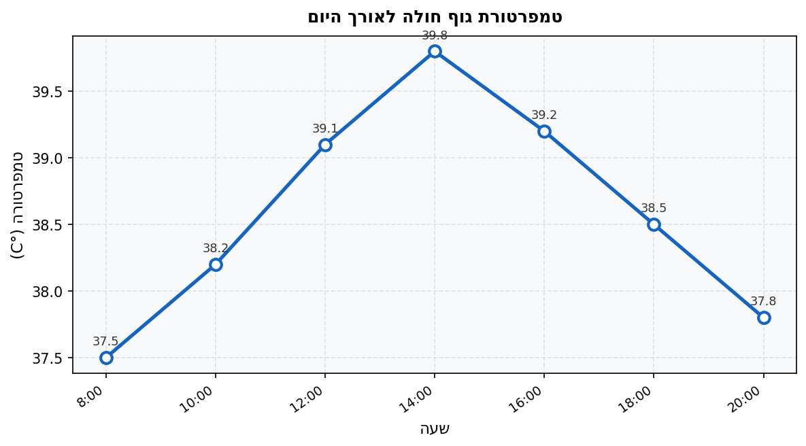

א. מה הייתה טמפרטורת החולה בשעה 12:00?

ב. מתי הגיע החולה לחום הגבוה ביותר? מה הייתה הטמפרטורה?

ג. בין אילו שעות הייתה מגמת הטמפרטורה יורדת?

12. הגרף מתאר את מספר המבקרים היומי בגן חיות לפי חודשי השנה:

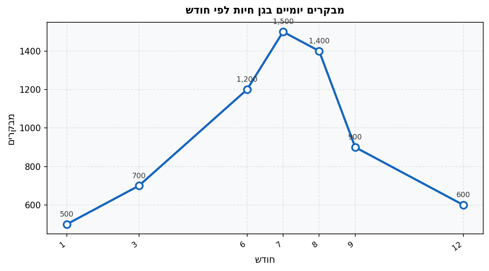

א. באיזה חודש הגיע מספר המבקרים לשיאו? מה היה המספר?

ב. תאר את מגמת מספר המבקרים בין חודשים 7 ל-9.

ג. מה היה מספר המבקרים בחודש 3?

13. הגרף מתאר את ההוצאות החודשיות (בשקלים) של משפחה בחצי הראשון של השנה:

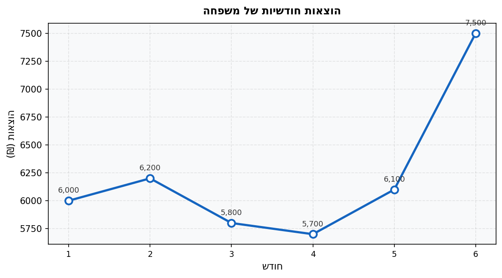

א. באיזה חודש ההוצאות היו הנמוכות ביותר?

ב. בין אילו חודשים חלה ירידה בהוצאות?

ג. מה הייתה ההוצאה בחודש 5?

14. הגרף מתאר את כמות הגשם (במילימטרים) שנפלה בכל חודש בעיר מסוימת:

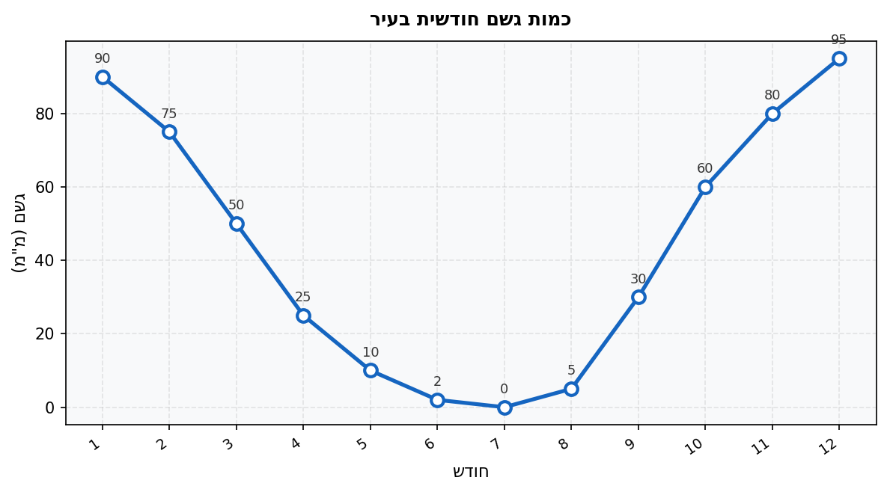

א. באיזה חודש לא ירד גשם כלל?

ב. מהי כמות הגשם המקסימלית? באיזה חודש נמדדה?

ג. האם המגמה בין חודשים 1 ל-7 היא עלייה או ירידה?

15. הגרף מתאר את עלות חשמל (בשקלים) לפי כמות הצריכה (בקוו"ש):

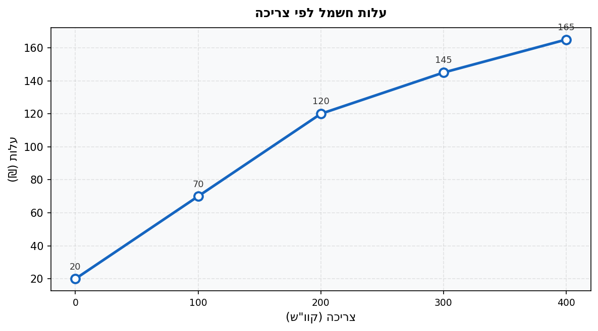

א. מה עלות הצריכה עבור
$100$ קוו"ש?

ב. מה עלות הצריכה עבור
$300$ קוו"ש?

ג. האם עלות כל יחידת קוו"ש נשארת קבועה לאורך כל הצריכה? הסבר.

16. הגרף מתאר את מספר הלקוחות שנכנסו לקניון לפי שעות ביום:

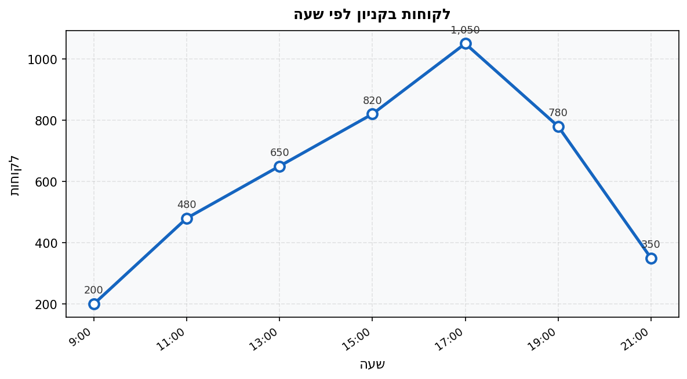

א. באיזו שעה היה מספר הלקוחות הגבוה ביותר?

ב. תאר את מגמת מספר הלקוחות בין השעות 17:00 ל-21:00.

ג. מהו הערך המינימלי? מהו הערך המקסימלי?

---

## רמה 3: רמת בחינת מה"ט (4 תרגילים)

17. מתוך: סגנון שנת 2023 – שאלה בסגנון מה"ט

הגרף מתאר את גובה רונית (בסנטימטרים) לפי גילה (בשנים). ציר ה-X מייצג גיל בשנים, ציר ה-Y מייצג גובה בסנטימטרים.

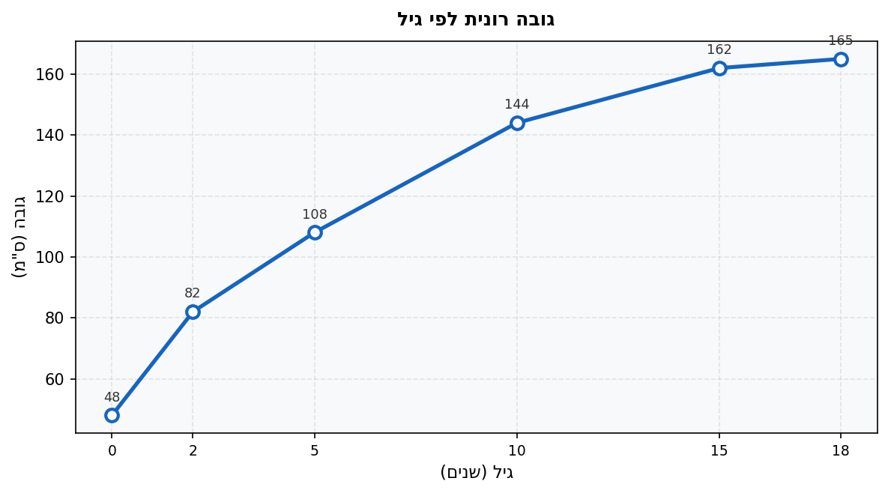

א. מה היה גובהה של רונית בלידתה?

ב. בין אילו גילאים הייתה מגמת הגדילה בעלייה?

ג. בין אילו גילאים הגרף "שטוח" יחסית (קצב גדילה נמוך)?

ד. כמה סנטימטרים גדלה רונית בין גיל 15 לגיל 18?

18. מתוך: סגנון שאלת חום גוף – סגנון מה"ט

בגרף מוצגות טמפרטורות (מעלות צלזיוס) של חולה הנמדדות כל שעתיים:

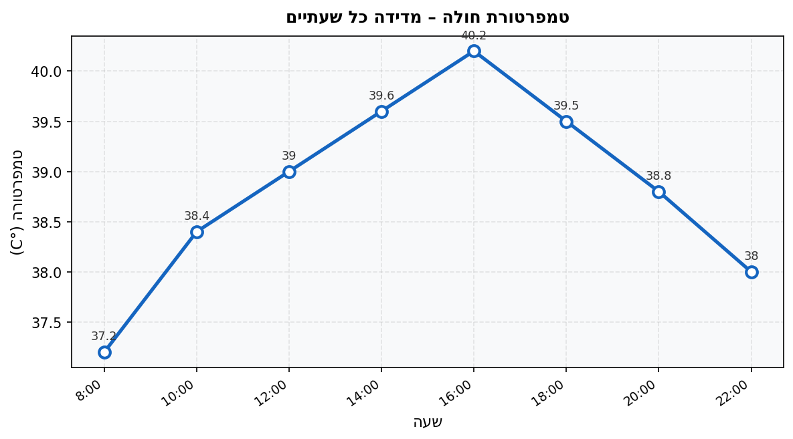

א. מה הייתה טמפרטורת החולה בשעה 12:00? בשעה 22:00?

ב. באיזו שעה הגיע החולה לטמפרטורה הגבוהה ביותר? מה הייתה הטמפרטורה?

ג. בין אילו שעות הייתה הטמפרטורה יורדת?

ד. מה הייתה טמפרטורת החולה בשעה 20:00?

19. מתוך: סגנון שאלת חברת הייטק – סגנון מה"ט

הגרף מתאר הכנסות והוצאות (בשקלים) של חברת הייטק בששת החודשים הראשונים של השנה:

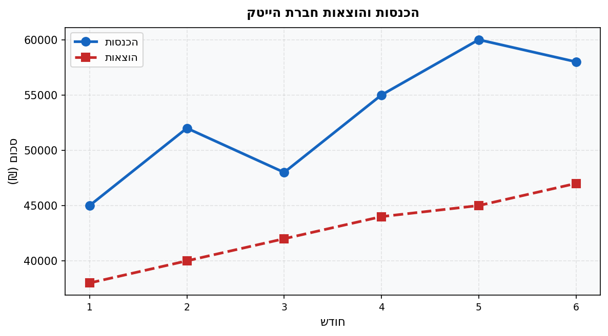

א. מה היו הכנסות החברה בחודש 3?

ב. באיזה חודש הפרש בין ההכנסות להוצאות היה הגדול ביותר? מה גובה הפרש זה?

ג. מה היו הוצאות החברה בחודש 5?

ד. האם היה חודש שבו ההוצאות עלו על ההכנסות? נמק.

20. מתוך: סגנון שאלת עלות שירות – סגנון מה"ט

הגרף מתאר את עלות שכירת אולם אירועים (בשקלים) לפי מספר שעות השכרה. קיים תשלום קבוע ראשוני ותשלום נוסף עבור כל שעה:

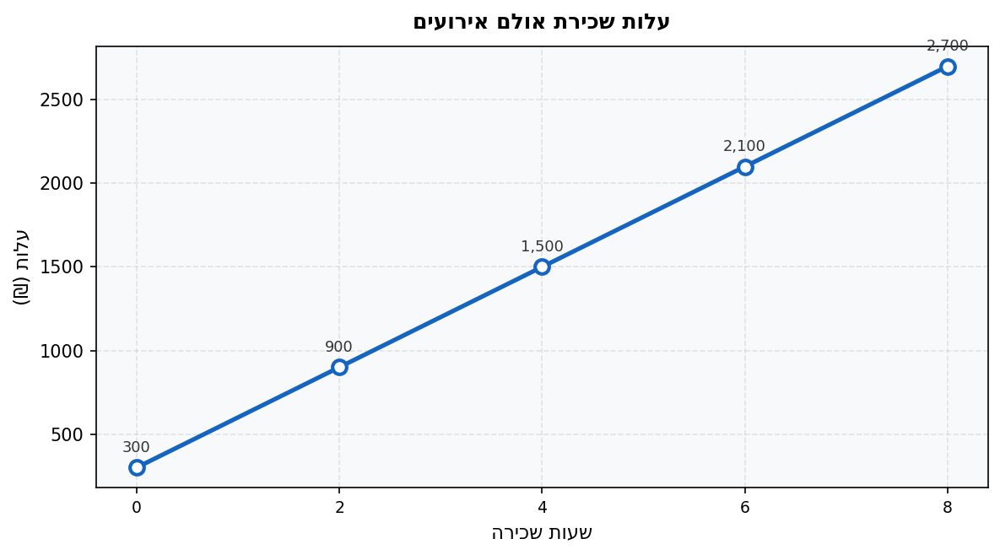

א. לקוח הזמין את האולם ובסוף ביטל לפני שהתחיל. כמה עליו לשלם?

ב. מהי עלות השכרה לכל שעה נוספת (מעבר לתשלום הקבוע)?

ג. לקוח תכנן לשכור את האולם ל-4 שעות, ובמהלך האירוע הוסיף 2 שעות. כמה נוסף לחשבונו?

ד. לקוח שכר את האולם ל-6 שעות. מה הייתה העלות הממוצעת לשעה?

---

תשובות סופיות

1. $100$ ס"מ

2. $48$ ס"מ

3. הטמפרטורה המקסימלית היא $28°C$, בשעה 14:00

4. הטמפרטורה המינימלית היא $16°C$, בשעה 8:00

5. בין דקה $10$ לדקה $20$

6. $12{,}000$ ₪

7. בין שעה $2$ לשעה $3$ (המרחק נשאר על $160$ ק"מ)

8. הציון הנמוך ביותר הוא $68$, במבחן מספר $1$

9. א. בין יום 1 ליום 2 (עלייה של $15$ ₪)
ב. בין יום 2 ליום 3
ג. בין יום 4 ליום 5

10. א. $20$ מטר (בשנייה $2$)
ב. בשנייה $4$
ג. עולה בין שנייה $0$ ל-$2$, יורד בין שנייה $2$ ל-$4$

11. א. $39.1°C$
ב. בשעה 14:00, טמפרטורה $39.8°C$
ג. בין 14:00 ל-20:00

12. א. חודש $7$ ($1{,}500$ מבקרים)
ב. ירידה (מ-$1{,}500$ ל-$900$)
ג. $700$ מבקרים

13. א. חודש $4$ ($5{,}700$ ₪)
ב. בין חודשים 2–3 ובין חודשים 3–4
ג. $6{,}100$ ₪

14. א. חודש $7$
ב. $95$ מ"מ, בחודש $12$
ג. ירידה עקבית

15. א. $70$ ₪
ב. $145$ ₪
ג. לא. בין 0–200 קוו"ש העלות היא $0.50$ ₪ ליחידה, לאחר 200 קוו"ש העלות יורדת – הגרף הופך שטוח יותר

16. א. שעה 17:00 ($1{,}050$ לקוחות)
ב. ירידה (מ-$1{,}050$ ל-$350$)
ג. מינימום $200$ (בשעה 9:00), מקסימום $1{,}050$ (בשעה 17:00)

17. א. $48$ ס"מ
ב. לאורך כל התקופה (גיל 0 עד 18) יש עלייה מתמשכת
ג. בין גיל $15$ לגיל $18$ (עלייה של $3$ ס"מ ב-3 שנים בלבד)
ד. $165 - 162 = 3$ ס"מ

18. א. בשעה 12:00: $39.0°C$; בשעה 22:00: $38.0°C$
ב. בשעה 16:00, טמפרטורה $40.2°C$
ג. בין 16:00 ל-22:00
ד. $38.8°C$

19. א. $48{,}000$ ₪
ב. חודש $5$, הפרש $15{,}000$ ₪
ג. $45{,}000$ ₪
ד. לא. בכל חודש ההכנסות גבוהות מההוצאות

20. א. $300$ ₪ (התשלום הקבוע)
ב. $300$ ₪ לשעה
ג. $2 \times 300 = 600$ ₪
ד.
$$\frac{2{,}100}{6} = 350 \text{ ₪ לשעה}$$

