# תת-נושא 3.2: חישובי מרווחים, הפרשים וממוצעים מתוך גרף

---

## רמה 1: בניית ביטחון (8 תרגילים)

1. הגרף מתאר את גובה עץ (בסנטימטרים) לפי שנות גידול:

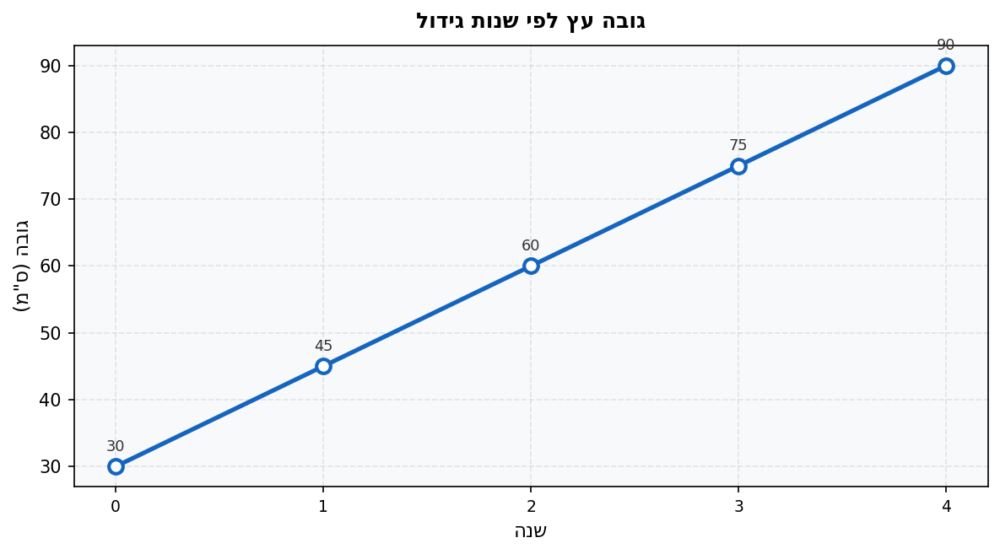

מהו ההפרש בגובה בין שנה
$1$ לשנה
$3$?

2. הגרף מתאר מספר מבקרים יומי במוזיאון לפי חודשי השנה:

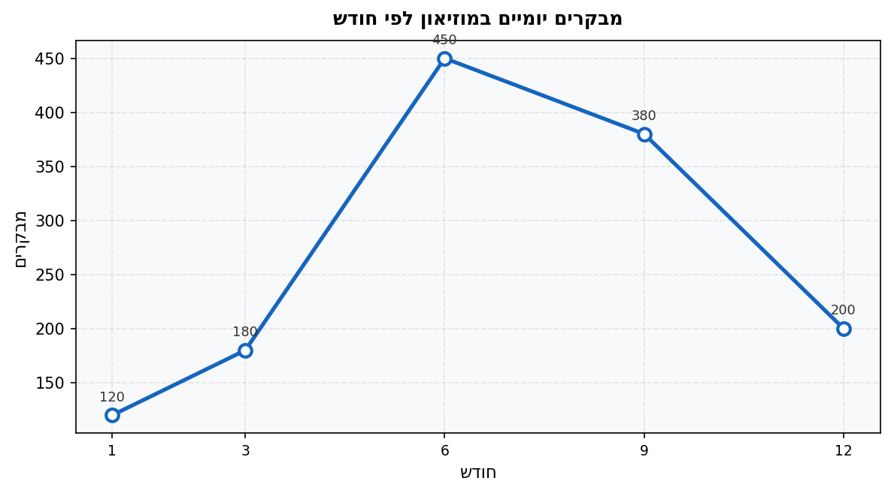

מהו ההפרש בין מספר המבקרים הרב ביותר לבין הנמוך ביותר?

3. הגרף מתאר את משקל תינוק (בק"ג) לפי גיל (בחודשים):

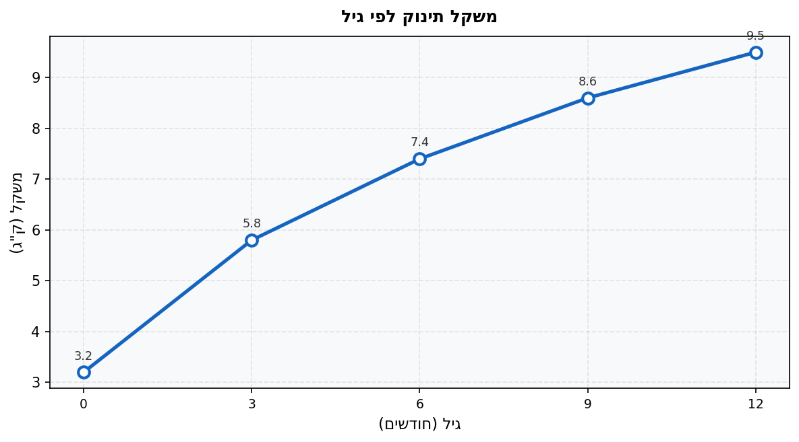

חשב את הממוצע של המשקל בחודש
$3$ ובמשקל בחודש
$9$.

4. הגרף מתאר ציוני תלמידה בארבעה מבחנים:

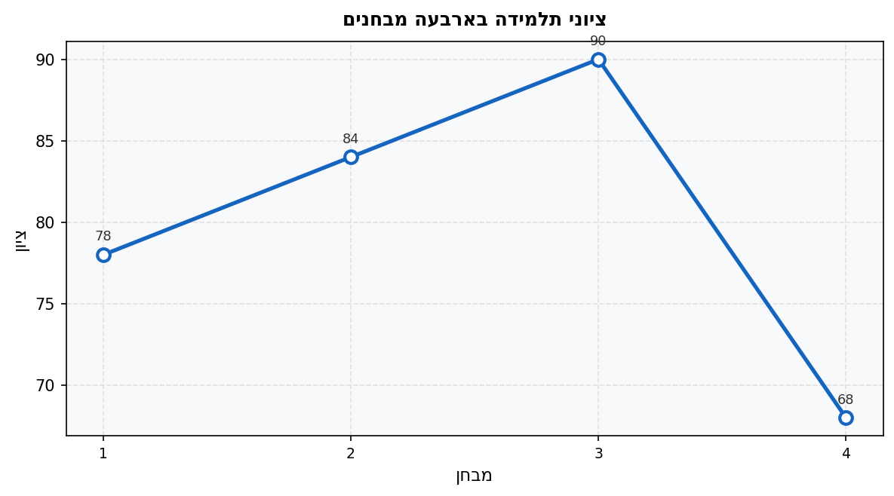

מהו ממוצע ציוניה?

5. הגרף מתאר את כמות המוצרים שמכרה חנות בשני חודשים:

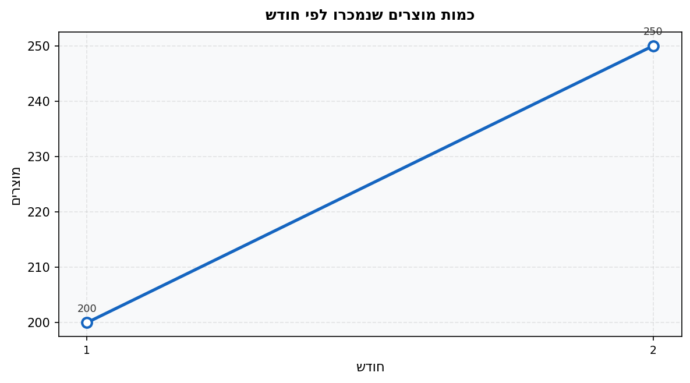

בכמה אחוזים עלתה כמות המכירות מחודש
$1$ לחודש
$2$?

6. הגרף מתאר את מחיר הדלק (שקלים לליטר) בשני מועדים:

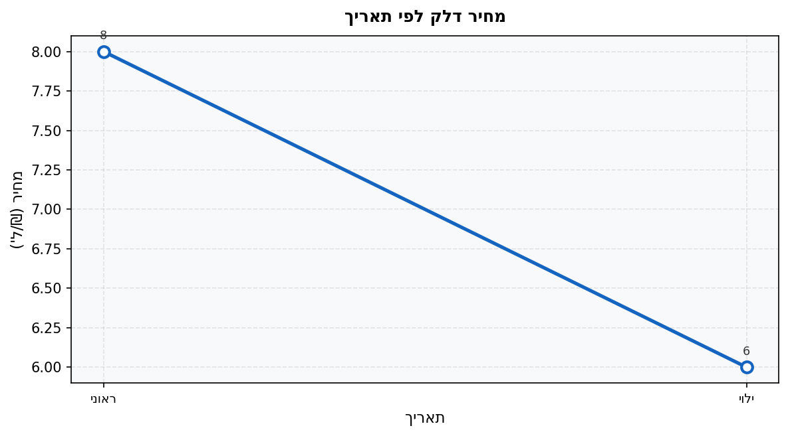

בכמה אחוזים ירד מחיר הדלק?

7. הגרף מתאר את גובה ילד (בסנטימטרים) לפי גיל:

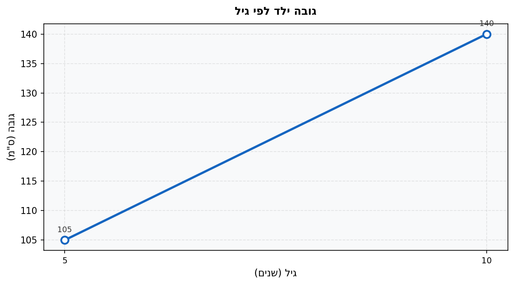

כמה סנטימטרים בממוצע צמח הילד בכל שנה בין גיל
$5$ לגיל
$10$?

8. גרף מתאר הכנסות חנות (בשקלים) בשלושה חודשים. הכנסות חודש 1 הן
$5{,}000$ ₪ והכנסות חודש 2 הן
$7{,}000$ ₪.
ממוצע ההכנסות בשלושת החודשים הוא
$6{,}500$ ₪.

מהי ההכנסה בחודש 3?

---

## רמה 2: תרגול שוטף ומשולב (8 תרגילים)

9. הגרף מתאר את ההוצאות החודשיות (בשקלים) של משפחה בחצי שנה:

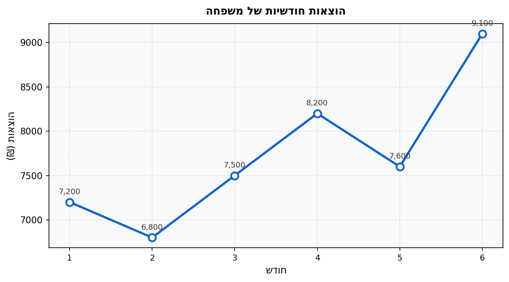

א. מהו ממוצע ההוצאות בחצי שנה זו?

ב. מהו ההפרש בין ההוצאות הגבוהות ביותר לנמוכות ביותר?

10. הגרף מתאר את משקל אדם (בק"ג) בתהליך דיאטה לפי שבועות:

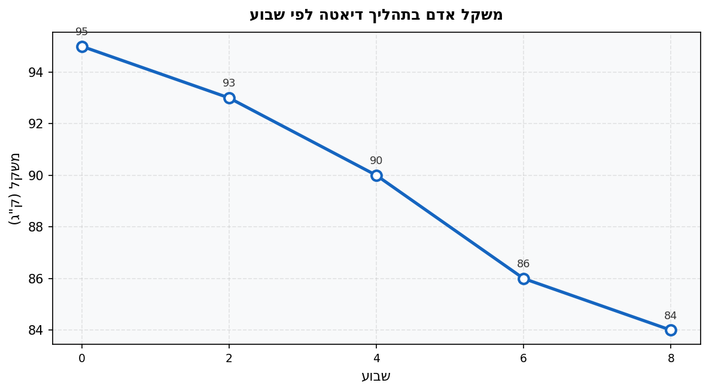

א. כמה ק"ג ירד האדם בין שבוע
$2$ לשבוע
$6$?

ב. בכמה אחוזים ירד משקלו בין תחילת הדיאטה (שבוע
$0$) לשבוע
$8$?

11. הגרף מתאר כמות גשם (במ"מ) בחודשי החורף:

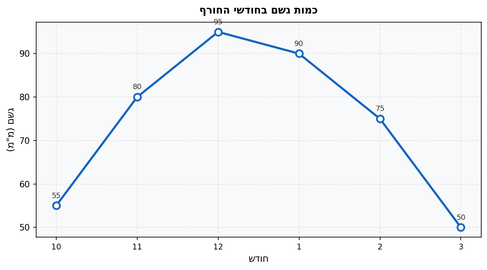

א. מהו ממוצע כמות הגשם החודשי בחודשים אלו?

ב. מהו ההפרש בכמות הגשם בין חודש 12 לחודש 3?

12. הגרף מתאר את מחיר מניה (בשקלים) לפי שבועות:

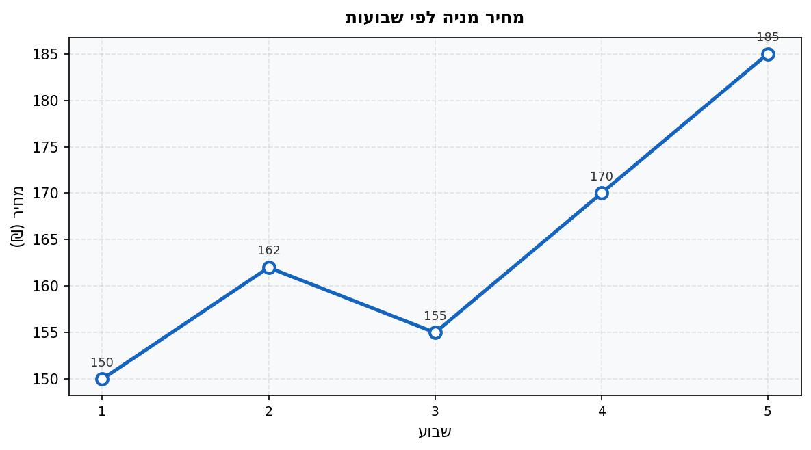

א. בין אילו שבועות עלה המחיר בכמות הגדולה ביותר? מהי כמות העלייה?

ב. מהו האחוז הכולל של עליית המחיר בין שבוע
$1$ לשבוע
$5$?

13. הגרף מתאר צבירת קילומטרים (באלפי ק"מ) ברכב לפי שנות שימוש:

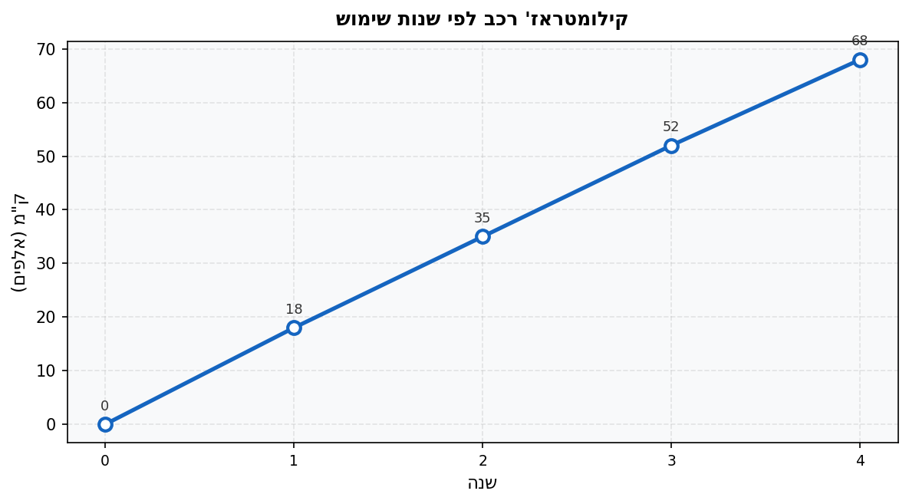

א. כמה ק"מ בממוצע נסע הרכב מדי שנה בין שנה
$1$ לשנה
$3$?

ב. כמה ק"מ נסע בין שנה
$3$ לשנה
$4$?

14. הגרף מתאר מכירות חברה (באלפי שקלים) לפי רבעונים:

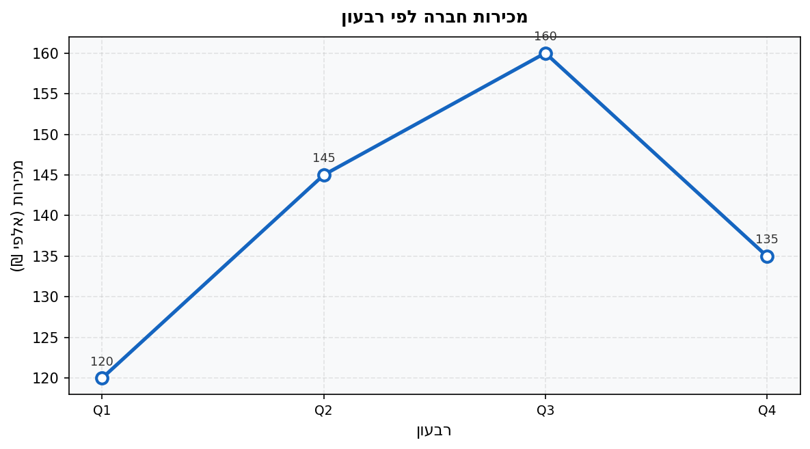

א. מהו ממוצע המכירות לרבעון?

ב. בכמה אחוזים גבוהות מכירות Q3 ממכירות Q1?

15. הגרף מתאר טמפרטורות (מעלות צלזיוס) בעיר לאורך שנה:

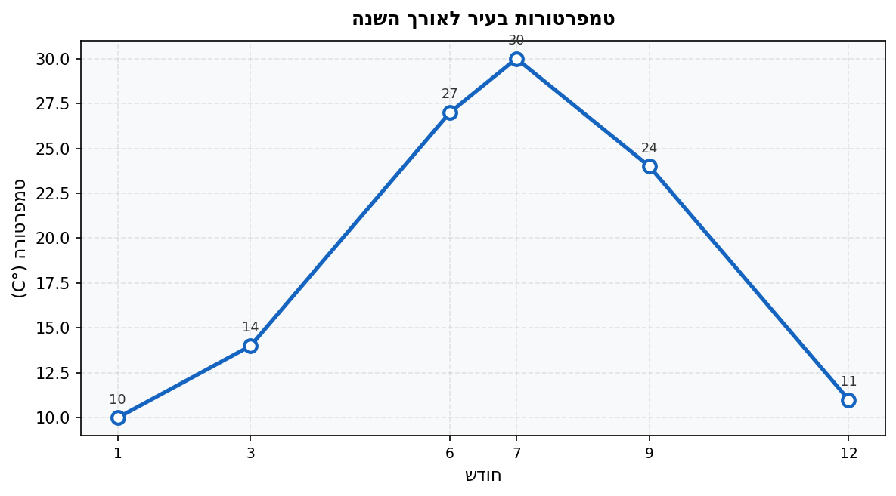

א. מהו ממוצע הטמפרטורה בחודשים 6, 7 ו-9?

ב. בכמה מעלות גבוהה הטמפרטורה בחודש 7 לעומת חודש 1?

ג. מהו ממוצע הטמפרטורה בחודשים 1 ו-12?

16. הגרף מתאר הכנסות ממכירת שלגוניות (בשקלים) לפי שעות ביום:

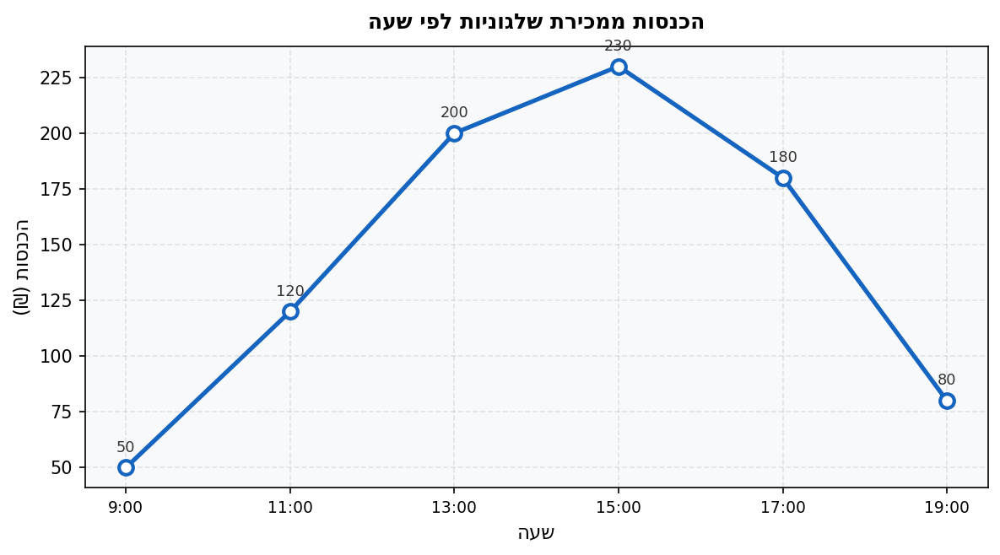

א. מהו ממוצע ההכנסות על פני שש הנקודות?

ב. באיזו שעה הייתה ההכנסה הגבוהה ביותר?

ג. מהו ההפרש בהכנסות בין השעה 13:00 לשעה 19:00?

---

## רמה 3: רמת בחינת מה"ט (4 תרגילים)

17. מתוך: סגנון שנת 2024, אביב מועד ב׳ – שאלה בסגנון מה"ט

הגרף מתאר הכנסות והוצאות (בשקלים) של עסק ב-6 חודשים:

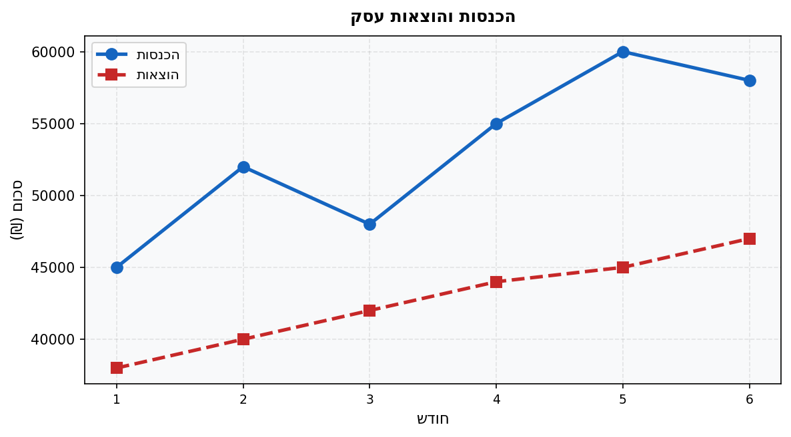

א. מה היו הכנסות העסק בחודש 3?

ב. באיזה חודש הפרש בין ההכנסות להוצאות היה הגדול ביותר? מה גובה הפרש זה?

ג. מה היו הוצאות העסק בחודש 5?

ד. מהו ממוצע ההוצאות ב-6 החודשים?

18. מתוך: סגנון שנת 2023 – שאלת גרף גובה

גרף מתאר את גובה (בסנטימטרים) של נתי לפי גילו (בשנים):

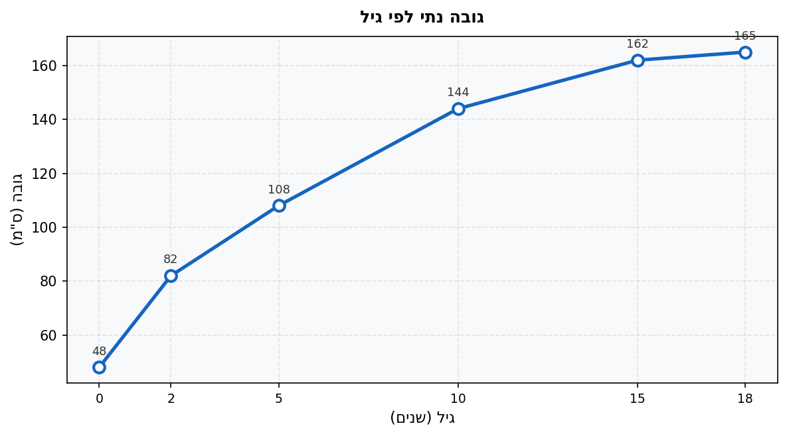

א. מה היה גובהו של נתי בלידתו?

ב. בכמה אחוזים גדל גובהו בין גיל
$2$ לגיל
$10$?

ג. כמה סנטימטרים בממוצע צמח נתי בכל שנה בין גיל
$5$ לגיל
$15$?

ד. מהו ההפרש בין גובהו בגיל
$15$ לגובהו בגיל
$18$?

19. מתוך: סגנון שנת 2024 – שאלת גרף נקודות חולה

בגרף מוצגות טמפרטורות (מעלות צלזיוס) של חולה הנמדדות כל שעתיים:

א. מה הייתה טמפרטורת החולה בשעה 12:00? בשעה 20:00?

ב. בין אילו שעות ירדה הטמפרטורה?

ג. מהו ממוצע הטמפרטורה בין השעות 16:00 ל-22:00?

ד. בכמה מעלות עלה החום בין 8:00 ל-16:00?

20. מתוך: סגנון שנת 2024 – שאלת מחיר ספרים

גרף מתאר את המחיר הכולל (בשקלים) לרכישת ספרים בחנות:

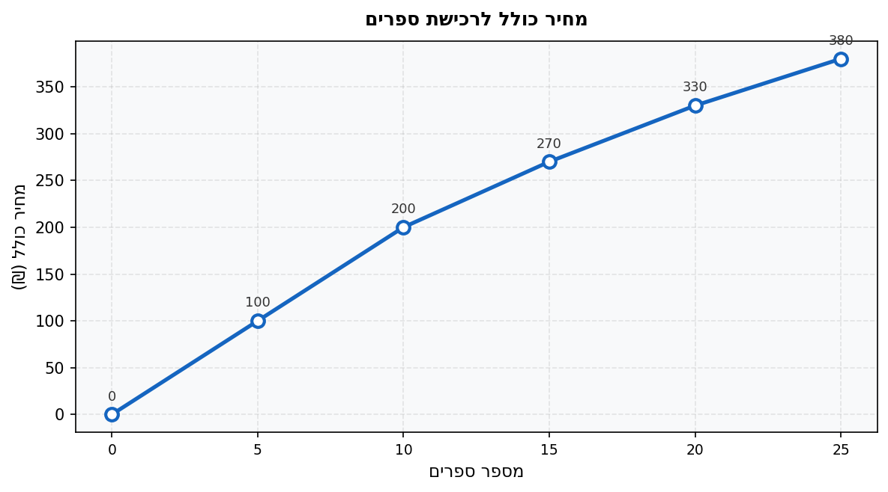

א. מהי עלות רכישת 10 ספרים?

ב. מהו מחיר כל אחד מ-10 הספרים הראשונים?

ג. מהו המחיר של כל אחד מהספרים בתחום שבין 10 ל-15 ספרים?

ד. קונה רכש 20 ספרים. כמה שילם בסך הכל? כמה שילם בממוצע על כל ספר?

---

תשובות סופיות

1. $75 - 45 = 30$ ס"מ

2. $450 - 120 = 330$ מבקרים

3. $\frac{5.8 + 8.6}{2} = \frac{14.4}{2} = 7.2$ ק"ג

4. $\frac{78 + 84 + 90 + 68}{4} = \frac{320}{4} = 80$

5. $\frac{250 - 200}{200} \times 100 = 25\%$

6. $\frac{8.00 - 6.00}{8.00} \times 100 = 25\%$

7. $\frac{140 - 105}{10 - 5} = \frac{35}{5} = 7$ ס"מ לשנה

8. סכום כולל:
$$6{,}500 \times 3 = 19{,}500$$
חודש 3:
$$19{,}500 - 5{,}000 - 7{,}000 = 7{,}500 \text{ ₪}$$

9. א.
$$\frac{7{,}200 + 6{,}800 + 7{,}500 + 8{,}200 + 7{,}600 + 9{,}100}{6} = \frac{46{,}400}{6} \approx 7{,}733.33 \text{ ₪}$$
ב. $9{,}100 - 6{,}800 = 2{,}300$ ₪

10. א. $93 - 86 = 7$ ק"ג
ב.
$$\frac{95 - 84}{95} \times 100 = \frac{11}{95} \times 100 \approx 11.58\%$$

11. א.
$$\frac{55 + 80 + 95 + 90 + 75 + 50}{6} = \frac{445}{6} \approx 74.17 \text{ מ"מ}$$
ב. $95 - 50 = 45$ מ"מ

12. א. בין שבוע $4$ לשבוע $5$ (עלייה של $185 - 170 = 15$ ₪)
ב.
$$\frac{185 - 150}{150} \times 100 = \frac{35}{150} \times 100 \approx 23.33\%$$

13. א.
$$\frac{52{,}000 - 18{,}000}{3 - 1} = \frac{34{,}000}{2} = 17{,}000 \text{ ק"מ לשנה}$$
ב. $68{,}000 - 52{,}000 = 16{,}000$ ק"מ

14. א.
$$\frac{120 + 145 + 160 + 135}{4} = \frac{560}{4} = 140 \text{ אלף ₪}$$
ב.
$$\frac{160 - 120}{120} \times 100 \approx 33.33\%$$

15. א.
$$\frac{27 + 30 + 24}{3} = \frac{81}{3} = 27°C$$
ב. $30 - 10 = 20$ מעלות
ג.
$$\frac{10 + 11}{2} = 10.5°C$$

16. א.
$$\frac{50 + 120 + 200 + 230 + 180 + 80}{6} = \frac{860}{6} \approx 143.33 \text{ ₪}$$
ב. 15:00 (הכנסה של $230$ ₪)
ג. $200 - 80 = 120$ ₪

17. א. $48{,}000$ ₪
ב. הפרשים לפי חודשים: $7{,}000$; $12{,}000$; $6{,}000$; $11{,}000$; $\mathbf{15{,}000}$; $11{,}000$ → חודש $5$, הפרש $15{,}000$ ₪
ג. $45{,}000$ ₪
ד.
$$\frac{38{,}000 + 40{,}000 + 42{,}000 + 44{,}000 + 45{,}000 + 47{,}000}{6} = \frac{256{,}000}{6} \approx 42{,}667 \text{ ₪}$$

18. א. $48$ ס"מ
ב.
$$\frac{144 - 82}{82} \times 100 = \frac{62}{82} \times 100 \approx 75.61\%$$
ג.
$$\frac{162 - 108}{15 - 5} = \frac{54}{10} = 5.4 \text{ ס"מ לשנה}$$
ד. $165 - 162 = 3$ ס"מ

19. א. בשעה 12:00: $39.0°C$; בשעה 20:00: $38.8°C$
ב. בין 16:00 ל-22:00
ג.
$$\frac{40.2 + 39.5 + 38.8 + 38.0}{4} = \frac{156.5}{4} = 39.125°C$$
ד. $40.2 - 37.2 = 3.0$ מעלות

20. א. $200$ ₪
ב.
$$\frac{200}{10} = 20 \text{ ₪ לספר}$$
ג.
$$\frac{270 - 200}{15 - 10} = \frac{70}{5} = 14 \text{ ₪ לספר}$$
ד.
$$330 \text{ ₪}, \quad \frac{330}{20} = 16.5 \text{ ₪ לספר}$$

