# תת-נושא 3.3: קצבים ומהירויות – חישוב "שיפוע" מילולי והגיוני

**כלל יסוד:**
$$\text{קצב שינוי} = \frac{\Delta Y}{\Delta X} = \frac{\text{הפרש ב-}Y}{\text{הפרש ב-}X}$$

**המרת יחידות מהירות:**
$$1 \text{ ק"מ/שעה} = \frac{1000 \text{ מ'}}{3600 \text{ שנ'}} = \frac{1}{3.6} \text{ מ'/שנ'}$$

---

## רמה 1: בניית ביטחון (8 תרגילים)

1. רכב נסע
$120$ ק"מ ב-2 שעות בקצב קבוע.

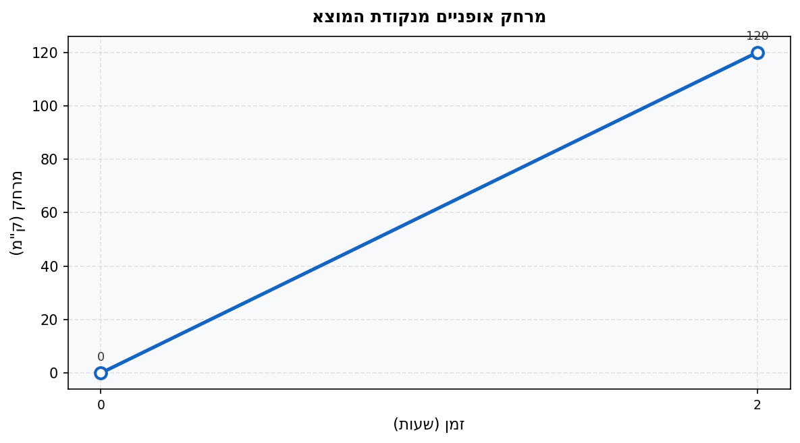

מהי מהירות הרכב (בק"מ/שעה)?

2. הגרף מתאר מרחק אופניים (בק"מ) מנקודת המוצא לפי הזמן (בשעות). שתי הנקודות הן:
$(0,\ 0)$ ו-$(3,\ 60)$.

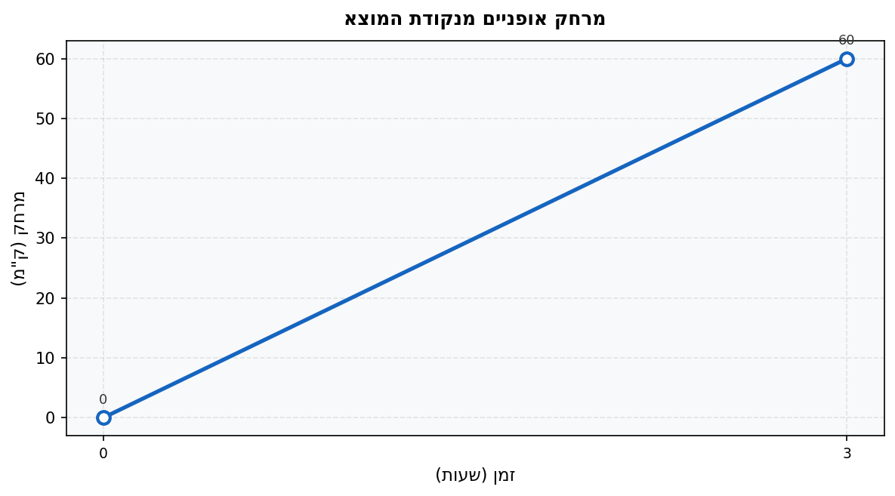

מהי מהירות האופניים (בק"מ/שעה)?

3. גרף מתאר כמות מים בבריכה (ליטרים) לפי הזמן (דקות):

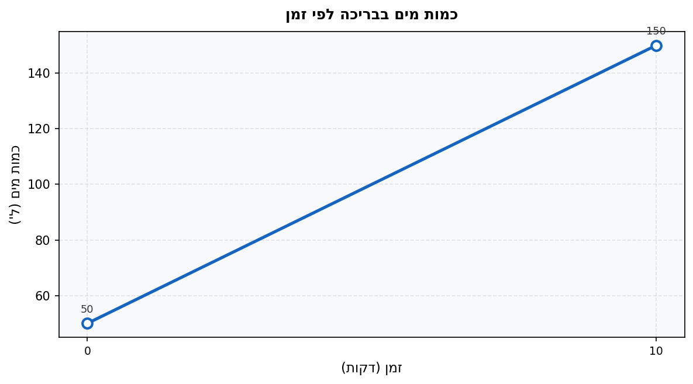

מהו קצב מילוי המים (ליטרים לדקה)?

4. המר את המהירות הבאה מק"מ/שעה למ'/שנ':
$$72 \text{ ק"מ/שעה} = ?\ \text{מ'/שנ'}$$

5. המר את המהירות הבאה ממ'/שנ' לק"מ/שעה:
$$15 \text{ מ'/שנ'} = ?\ \text{ק"מ/שעה}$$

6. הגרף מתאר מרחק (בק"מ) של רצה מנקודת המוצא לפי זמן (שעות):

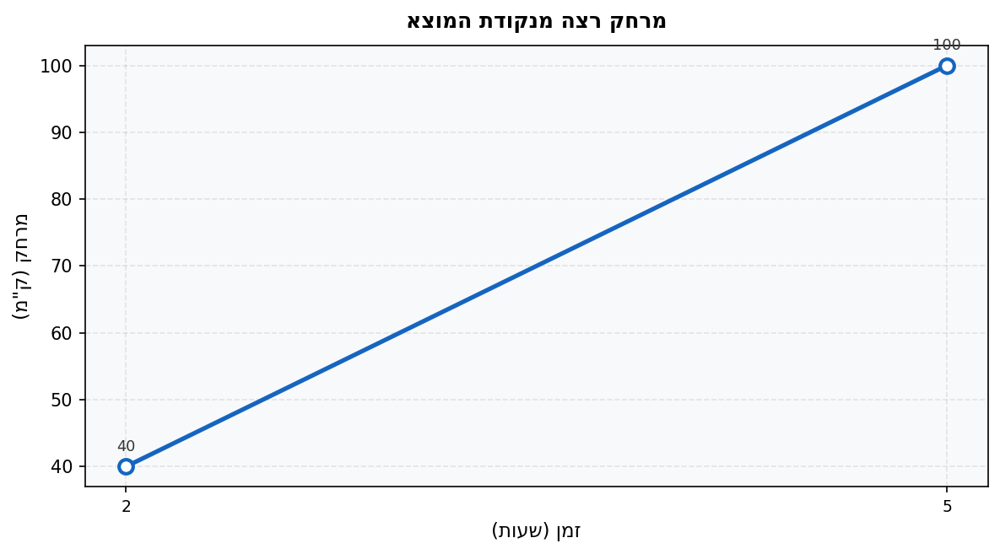

מהי מהירות הרצה (בק"מ/שעה)?

7. הגרף מתאר מרחק רכב (בק"מ) מנקודת המוצא לפי זמן (שעות). שני קטעי תנועה:

קטע א: מ-$(0,\ 0)$ עד $(2,\ 80)$

קטע ב: מ-$(2,\ 80)$ עד $(5,\ 110)$

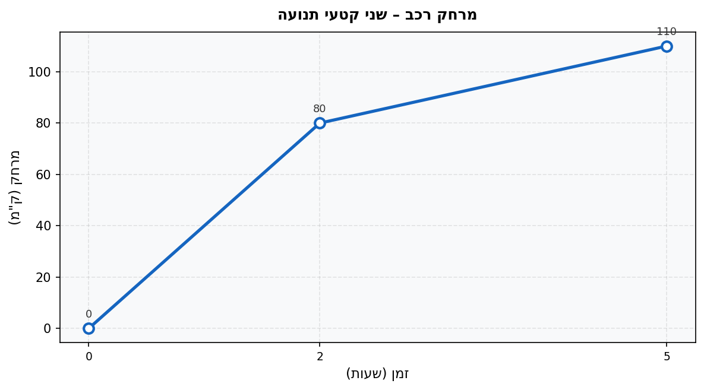

חשב את המהירות בכל קטע. באיזה קטע היה הרכב מהיר יותר?

8. גרף מתאר מרחק (בק"מ) מנקודת המוצא לפי זמן (שעות):

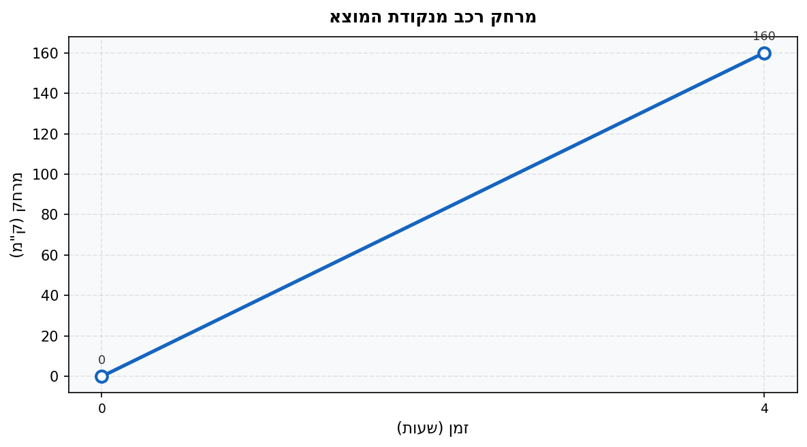

א. מהי מהירות הנסיעה (בק"מ/שעה)?

ב. המר את המהירות למ'/שנ' (שמור על 3 ספרות אחרי הנקודה).

---

## רמה 2: תרגול שוטף ומשולב (8 תרגילים)

9. הגרף מתאר מרחק רכב (בק"מ) מנקודת המוצא לפי זמן (שעות):

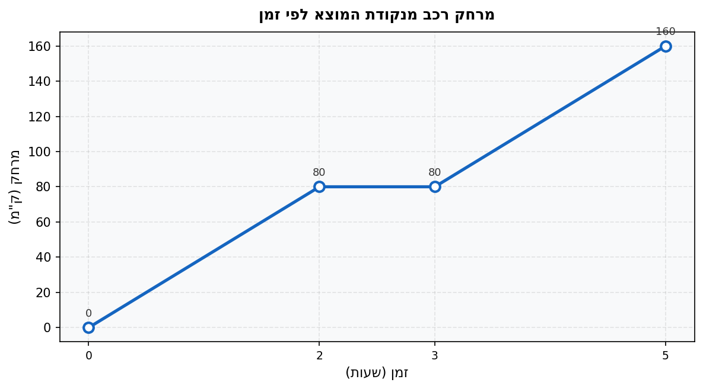

א. מהי המהירות בקטע שבין שעה
$0$ לשעה
$2$?

ב. מה קרה בין שעה
$2$ לשעה
$3$?

ג. מהי המהירות בקטע שבין שעה
$3$ לשעה
$5$?

10. המר את המהירות הבאה (שמור על 3 ספרות אחרי הנקודה):
$$90 \text{ ק"מ/שעה} = ?\ \text{מ'/שנ'}$$

11. הגרף מתאר את טמפרטורת חולה (°C) לפי שעות:

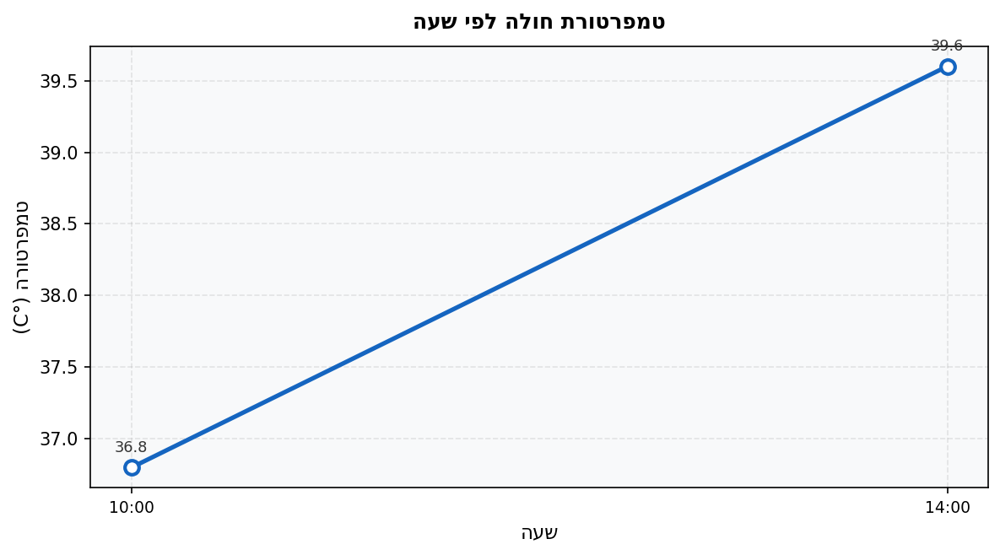

מהו קצב עליית הטמפרטורה (מעלות לשעה)?

12. הגרף מתאר מרחק (מ') של רצה מנקודת המוצא לפי זמן (שניות). שני קטעים:

קטע א: מ-$(0,\ 0)$ עד $(1,\ 30)$

קטע ב: מ-$(1,\ 30)$ עד $(3,\ 70)$

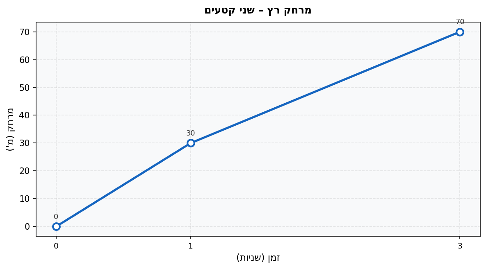

חשב את הקצב בכל קטע. באיזה קטע הרץ מהר יותר?

13. הגרף מתאר עלות שירות (בשקלים) לפי כמות יחידות:

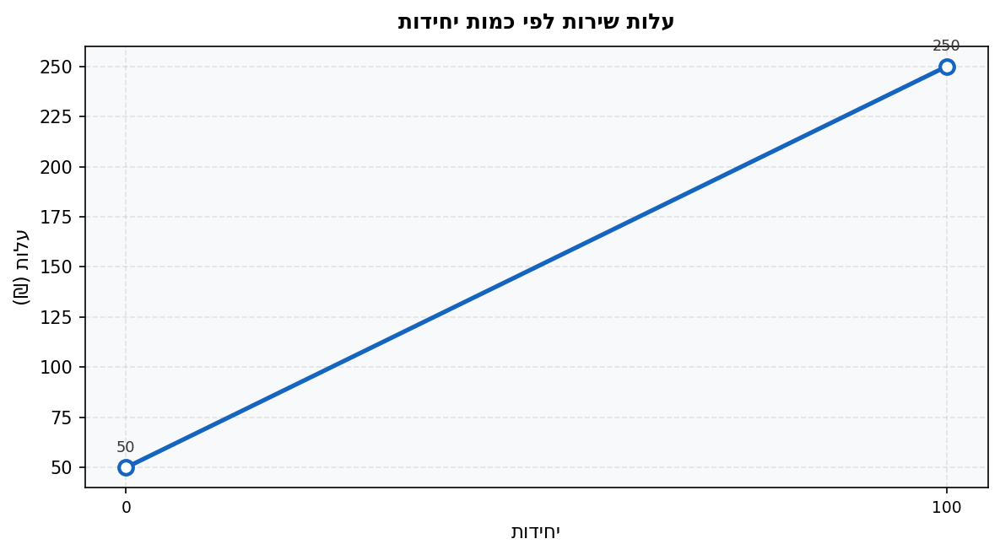

מהו קצב השינוי בעלות (שקלים ליחידה)?

14. נוסע נסע
$240$ ק"מ במהירות
$80$ ק"מ/שעה, ולאחר מכן נסע
$180$ ק"מ נוספים במהירות
$90$ ק"מ/שעה.

מהי המהירות הממוצעת לכל הנסיעה?

15. הגרף מתאר מרחק (בק"מ) לפי זמן (שעות):

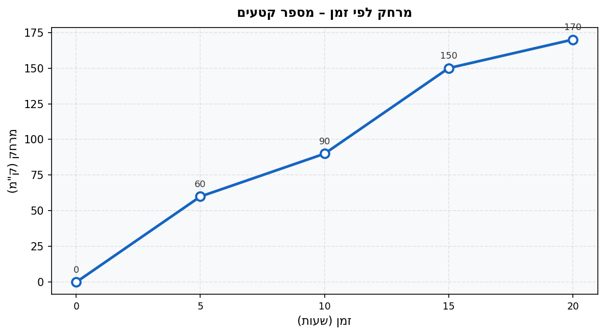

א. מהו הקצב בכל אחד מארבעת הקטעים?

ב. באיזה קטע הקצב הגדול ביותר?

16. מהירות נסיעה היא
$54$ ק"מ/שעה.

א. המר לטמ'/שנ' (שמור על 3 ספרות אחרי הנקודה).

ב. אם הנוסע נסע
$15$ דקות במהירות זו, מהו המרחק שעבר (בק"מ)?

---

## רמה 3: רמת בחינת מה"ט (4 תרגילים)

17. מתוך: סגנון שנת 2024, אביב מועד א׳ – שאלה 11

זיו יצא לטיול אופניים בשעה 6:00 בבוקר. הגרף הבא מתאר את המרחק (בק"מ) שעבר מנקודת המוצא:

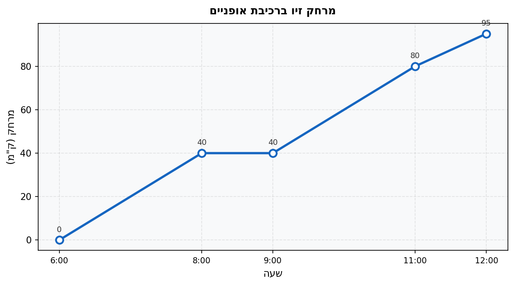

ענו על השאלות הבאות (שמרו על רמת דיוק של 3 ספרות אחרי הנקודה):

א. מהי מהירות הנסיעה של זיו בכל קטע שבו הוא רכב (מרחק בק"מ / זמן בשעות)?

ב. בין אילו שעות עצר זיו לנוח?

ג. המר את מהירות הנסיעה בקטע הראשון ממ'/שנ'.

18. מתוך: סגנון שנת 2024, קיץ מועד א׳ – שאלה 11

הגרף מתאר את המרחק (בק"מ) של רצה מאביב מנקודת המוצא
$(0,\ 0)$ כפונקציה של שעות הריצה:

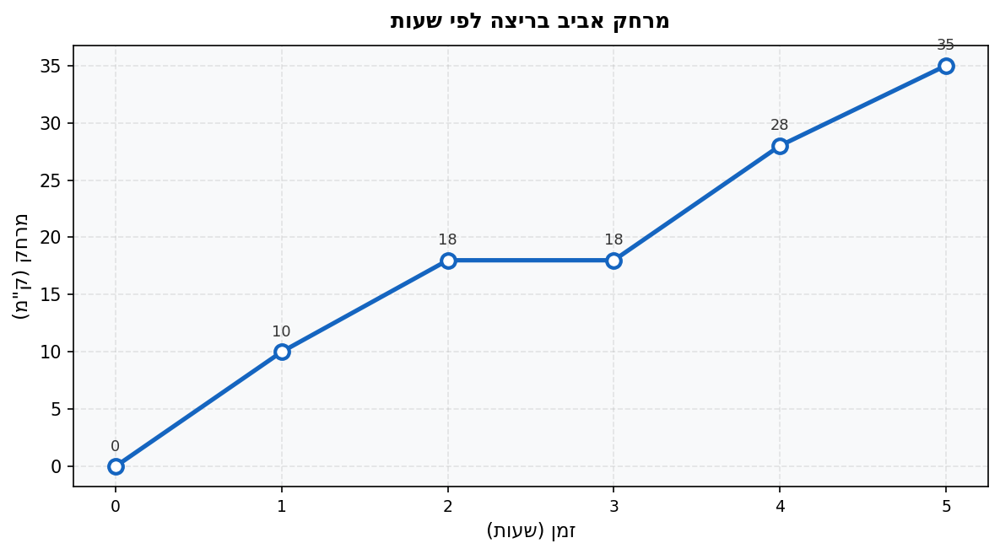

(המהירות = מרחק / זמן)

א. חשב את המהירות בכל קטע שבו היה הרצה בתנועה (בק"מ/שעה).

ב. באיזה קטע הקצב הגבוה ביותר?

ג. בשעה כמה עצר הרצה לנוח?

ד. מהי מהירותו הממוצעת לאורך כל 5 השעות (כולל זמן עמידה)?

19. מתוך: סגנון שנת 2025, אביב מועד א׳ – שאלה 11

משאית יוצאת בשעה 9:00 ממחסן האספקה. הגרף מתאר את המרחק (בק"מ) שלה מנקודת המוצא:

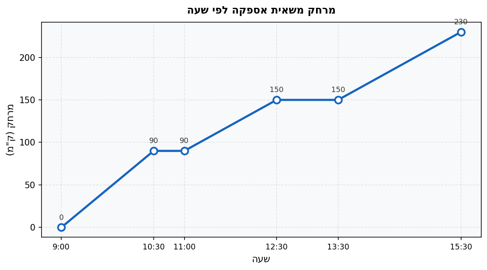

ענו על השאלות הבאות (שמרו על רמת דיוק של 3 ספרות אחרי הנקודה):

א. מהי מהירות הנסיעה של המשאית לכל רשת שיווק (מרחק בק"מ / זמן בשעות)?

ב. המר את המהירות בקטע הראשון ממ'/שנ'.

ג. כמה שעות עצרה המשאית בסך הכל?

20. מתוך: סגנון שנת 2024, אביב מועד ב׳ – שאלה 11

שליח פיצה יוצא מהמסעדה (נקודת
$(0,\ 0)$) ונע במשך 30 דקות. הגרף מתאר את המרחק שלו (במטרים) מהמסעדה לפי הזמן (בדקות):

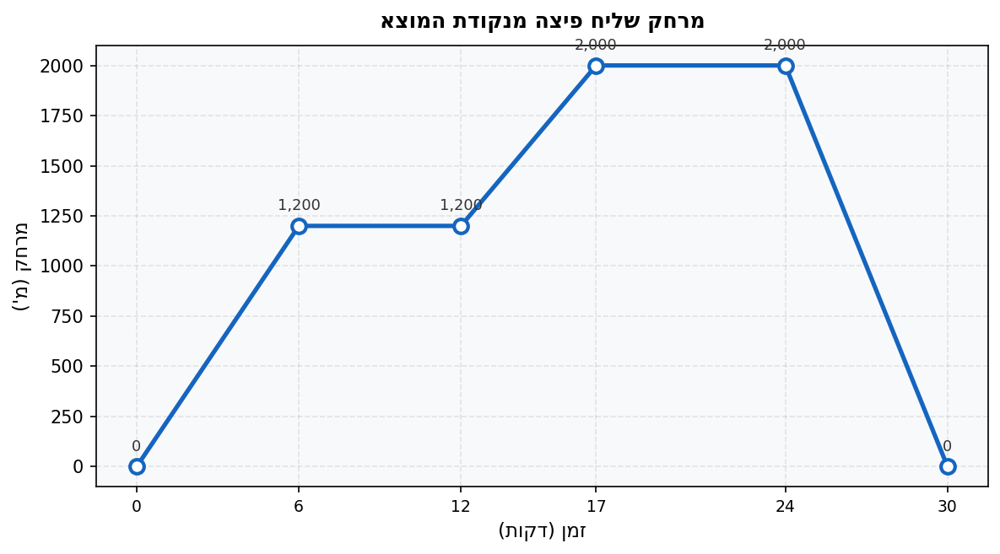

(קצב = מהירות / זמן)

א. באיזה קטע קצב השינוי במרחק (בערך מוחלט) הוא הגדול ביותר?

ב. חשב את קצב השינוי (במ'/דקה) בכל קטע תנועה.

ג. המר את הקצב בקטע הראשון מ-מ'/דקה ל-ק"מ/שעה.

ד. מהי מהירותו הממוצעת (כולל עצירות) מהתחלה ועד הדקה ה-30?

---

תשובות סופיות

1. $\frac{120}{2} = 60$ ק"מ/שעה

2. $\frac{60}{3} = 20$ ק"מ/שעה

3. $\frac{150 - 50}{10 - 0} = \frac{100}{10} = 10$ ל'/דקה

4. $72 \div 3.6 = 20$ מ'/שנ'

5. $15 \times 3.6 = 54$ ק"מ/שעה

6. $\frac{100 - 40}{5 - 2} = \frac{60}{3} = 20$ ק"מ/שעה

7. קטע א:
$$\frac{80}{2} = 40 \text{ ק"מ/שעה}$$
קטע ב:
$$\frac{110 - 80}{5 - 2} = \frac{30}{3} = 10 \text{ ק"מ/שעה}$$
קטע א מהיר יותר

8. א. $\frac{160}{4} = 40$ ק"מ/שעה
ב. $40 \div 3.6 \approx 11.111$ מ'/שנ'

9. א. $\frac{80}{2} = 40$ ק"מ/שעה
ב. עצירה (מרחק קבוע)
ג. $\frac{160 - 80}{5 - 3} = \frac{80}{2} = 40$ ק"מ/שעה

10. $90 \div 3.6 = 25.000$ מ'/שנ'

11. $\frac{39.6 - 36.8}{14 - 10} = \frac{2.8}{4} = 0.7$ מעלות/שעה

12. קטע א:
$$\frac{30}{1} = 30 \text{ מ'/שנ'}$$
קטע ב:
$$\frac{70 - 30}{3 - 1} = \frac{40}{2} = 20 \text{ מ'/שנ'}$$
קטע א מהיר יותר

13. $\frac{250 - 50}{100} = \frac{200}{100} = 2$ ₪ ליחידה

14. זמן נסיעה ראשון:
$$\frac{240}{80} = 3 \text{ שעות}$$
זמן נסיעה שני:
$$\frac{180}{90} = 2 \text{ שעות}$$
מהירות ממוצעת:
$$\frac{240 + 180}{3 + 2} = \frac{420}{5} = 84 \text{ ק"מ/שעה}$$

15. א. קטע 0–5: $\frac{60}{5} = 12$; קטע 5–10: $\frac{30}{5} = 6$; קטע 10–15: $\frac{60}{5} = 12$; קטע 15–20: $\frac{20}{5} = 4$ (כולם ק"מ/שעה)
ב. קטעים 0–5 ו-10–15 שווים ומהירים ביותר ($12$ ק"מ/שעה)

16. א. $54 \div 3.6 = 15.000$ מ'/שנ'
ב. $54 \times \frac{15}{60} = 54 \times 0.25 = 13.5$ ק"מ

17. א. קטע 6:00–8:00:
$$\frac{40}{2} = 20 \text{ ק"מ/שעה}$$
קטע 9:00–11:00:
$$\frac{80 - 40}{2} = 20 \text{ ק"מ/שעה}$$
קטע 11:00–12:00:
$$\frac{95 - 80}{1} = 15 \text{ ק"מ/שעה}$$
ב. בין 8:00 ל-9:00
ג. $20 \div 3.6 \approx 5.556$ מ'/שנ'

18. א. קטע 0–1: $10$ ק"מ/שעה; קטע 1–2: $8$ ק"מ/שעה; קטע 3–4: $10$ ק"מ/שעה; קטע 4–5: $7$ ק"מ/שעה
ב. קטעים 0–1 ו-3–4 שווים ומהירים ביותר ($10$ ק"מ/שעה)
ג. בין שעה $2$ לשעה $3$
ד.
$$\frac{35}{5} = 7 \text{ ק"מ/שעה}$$

19. א. קטע 9:00–10:30 (1.5 שעות):
$$\frac{90}{1.5} = 60 \text{ ק"מ/שעה}$$
קטע 11:00–12:30 (1.5 שעות):
$$\frac{60}{1.5} = 40 \text{ ק"מ/שעה}$$
קטע 13:30–15:30 (2 שעות):
$$\frac{80}{2} = 40 \text{ ק"מ/שעה}$$
ב. $60 \div 3.6 \approx 16.667$ מ'/שנ'
ג. $0.5 + 1 = 1.5$ שעות

20. א. קטע 24–30 (חזרה למסעדה): קצב $\frac{2{,}000}{6} \approx 333.33$ מ'/דקה – הגבוה ביותר
ב. קטע 0–6:
$$\frac{1{,}200}{6} = 200 \text{ מ'/דקה}$$
קטע 12–17:
$$\frac{800}{5} = 160 \text{ מ'/דקה}$$
קטע 24–30:
$$\frac{2{,}000}{6} \approx 333.33 \text{ מ'/דקה}$$
ג. $200 \text{ מ'/דקה} \times 60 \div 1{,}000 = 12$ ק"מ/שעה
ד. סה"כ מרחק שעבר (הלוך + חזור):
$$2{,}000 + 2{,}000 = 4{,}000 \text{ מ'}$$
$$\frac{4{,}000}{30} \approx 133.33 \text{ מ'/דקה} = 8 \text{ ק"מ/שעה}$$

