# תת-נושא 3.4: "שטח מתחת לגרף" ככלי צבירה

**כלל אצבע: שתי הצורות המותרות בחישוב שטח מגרף**

**מלבן** (קטע אופקי – ערך קבוע):
$$S_{\text{מלבן}} = \text{בסיס} \times \text{גובה}$$

**משולש ישר-זווית** (קטע עולה או יורד ל-0):
$$S_{\text{משולש}} = \frac{1}{2} \times \text{בסיס} \times \text{גובה}$$

**משמעות בגרף מהירות-זמן:** שטח מתחת לגרף = **סך המרחק שנעבר**

---

## רמה 1: בניית ביטחון (8 תרגילים)

1. בגרף מהירות-זמן, מכונית נוסעת במהירות קבועה של
$60$ ק"מ/שעה מ-
$t = 0$ עד
$t = 3$ שעות.

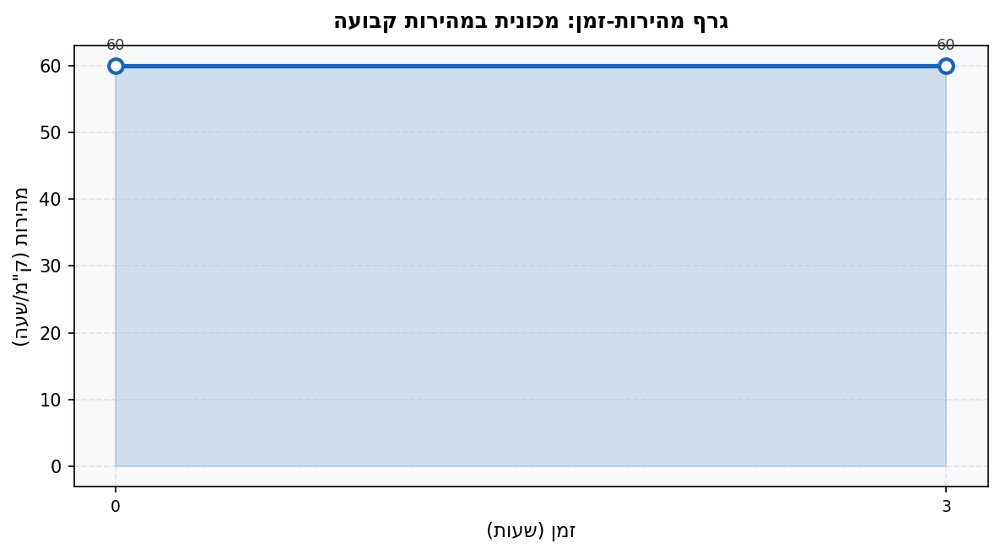

א. תאר את הצורה הגיאומטרית שנוצרת מתחת לגרף.

ב. חשב את שטח הצורה. מה משמעות התוצאה?

2. בגרף מהירות-זמן, אופנוע מאיץ בצורה אחידה ממהירות
$0$ למהירות
$80$ ק"מ/שעה תוך
$4$ שעות.

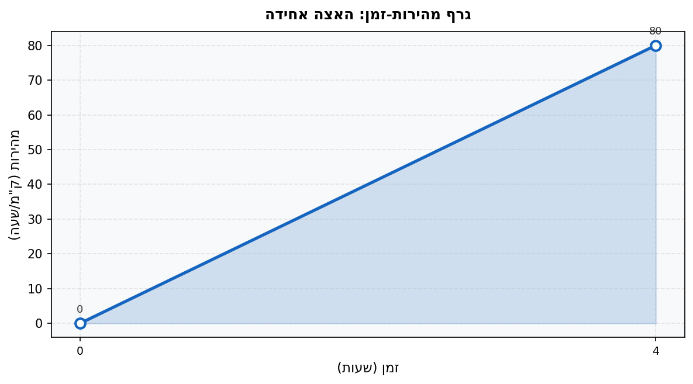

א. תאר את הצורה הגיאומטרית שנוצרת מתחת לגרף.

ב. חשב את שטח הצורה.

3. גרף מתאר שיעור זרימת מים לתוך מיכל (ליטר לדקה) לפי הזמן (דקות). הזרימה קבועה על
$15$ ל'/דקה בין הדקה
$0$ לדקה
$8$.

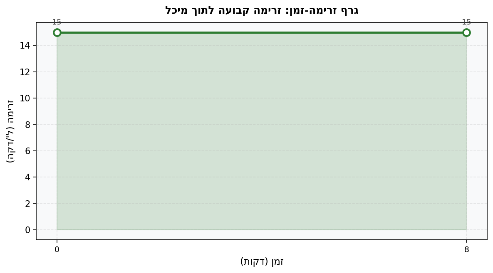

חשב את השטח מתחת לגרף. מה משמעות התוצאה?

4. גרף מתאר מהירות (בק"מ/שעה) לפי הזמן (שעות). הגרף יורד בצורה אחידה מ-
$90$ ק"מ/שעה ל-
$0$ במשך
$6$ שעות.

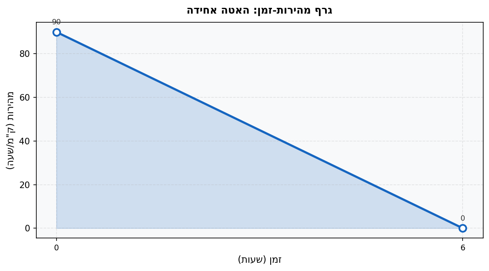

חשב את השטח מתחת לגרף.

5. חשב את שטח המלבן שנוצר בגרף שבו:

בסיס =
$5$ יחידות, גובה =
$12$ יחידות.

6. חשב את שטח המשולש ישר-הזווית שנוצר בגרף שבו:

בסיס =
$8$ יחידות, גובה =
$20$ יחידות.

7. גרף מהירות-זמן: גוף נע במהירות קבועה של
$50$ מ'/שנ' למשך
$10$ שניות.

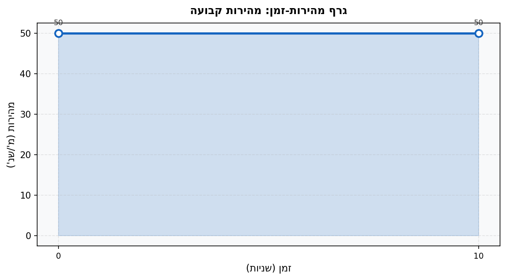

א. חשב את השטח מתחת לגרף.

ב. מה המרחק שעבר הגוף?

8. גרף מהירות-זמן: גוף מאיץ מ-
$0$ ל-
$60$ מ'/שנ' בצורה אחידה תוך
$6$ שניות.

א. חשב את השטח מתחת לגרף.

ב. מה המרחק שעבר הגוף?

---

## רמה 2: תרגול שוטף ומשולב (8 תרגילים)

9. גרף מהירות-זמן מורכב: אופניים נעים במהירות קבועה של
$30$ ק"מ/שעה למשך
$2$ שעות, ואז מאיטים בצורה אחידה עד לעצירה מוחלטת תוך
$3$ שעות נוספות.

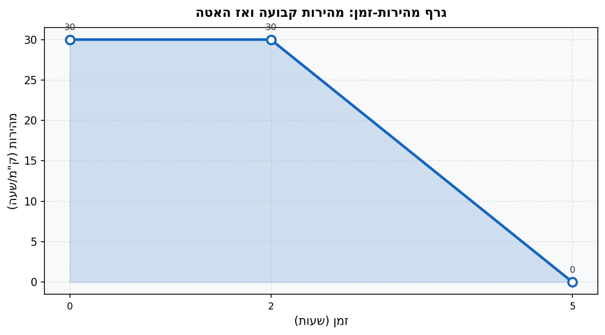

חשב את המרחק הכולל שעברו האופניים.

10. גרף מהירות-זמן: רכבת מאיצה מ-
$0$ ל-
$120$ ק"מ/שעה בצורה אחידה תוך
$0.5$ שעה, ואז נוסעת במהירות קבועה
$120$ ק"מ/שעה למשך
$2$ שעות.

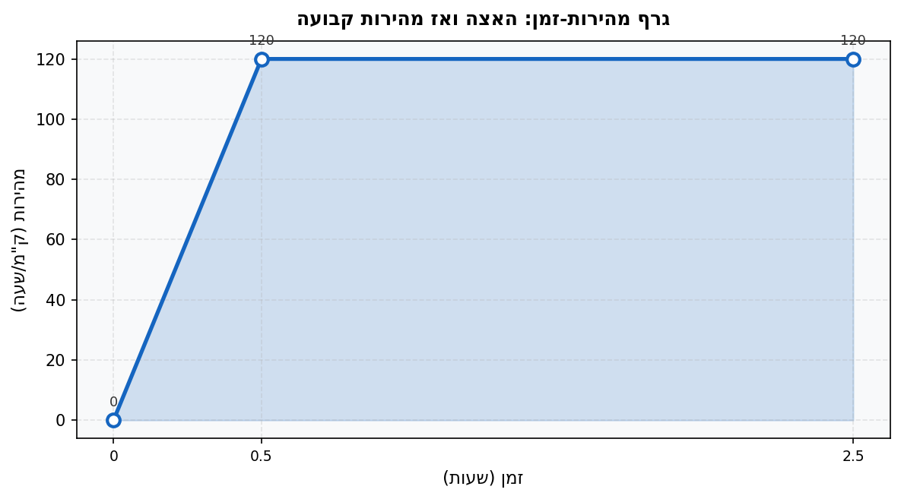

חשב את המרחק הכולל שנסעה הרכבת.

11. גרף מהירות-זמן מורכב: ספרינטר רץ במהירות קבועה של
$8$ מ'/שנ' למשך
$5$ שניות, ואז מאיץ לינארית ל-
$14$ מ'/שנ' תוך
$4$ שניות נוספות, ואז ממשיך במהירות קבועה
$14$ מ'/שנ' למשך
$6$ שניות.

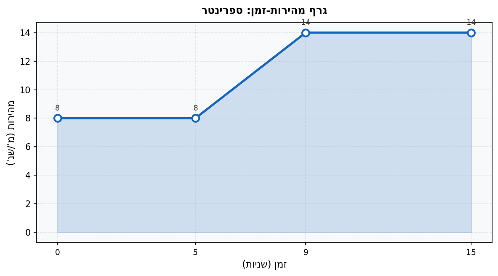

חשב את המרחק הכולל.

12. גרף מהירות-זמן: הגרף מתחיל ב-
$(0,\ 30)$, קבוע עד
$t = 5$, ואז יורד לינארית ל-
$0$ ב-
$t = 11$.

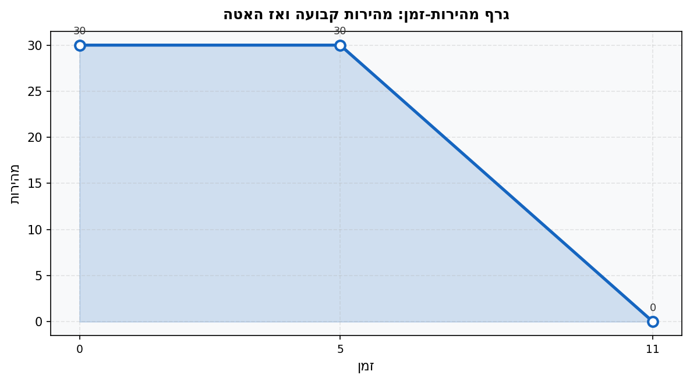

חשב את המרחק הכולל.

13. שטח מתחת לגרף מהירות-זמן הוא
$360$ מ"ר. זמן הנסיעה הוא
$9$ שניות.

מהי המהירות הממוצעת?

14. שטח מתחת לגרף מהירות-זמן הוא
$450$ ק"מ. הנסיעה ארכה
$5$ שעות.

מהי מהירות הנסיעה הממוצעת?

15. גרף מהירות-זמן יוצר טרפז: ב-
$t = 0$ המהירות היא
$20$ מ'/שנ', ב-
$t = 8$ המהירות היא
$60$ מ'/שנ'.

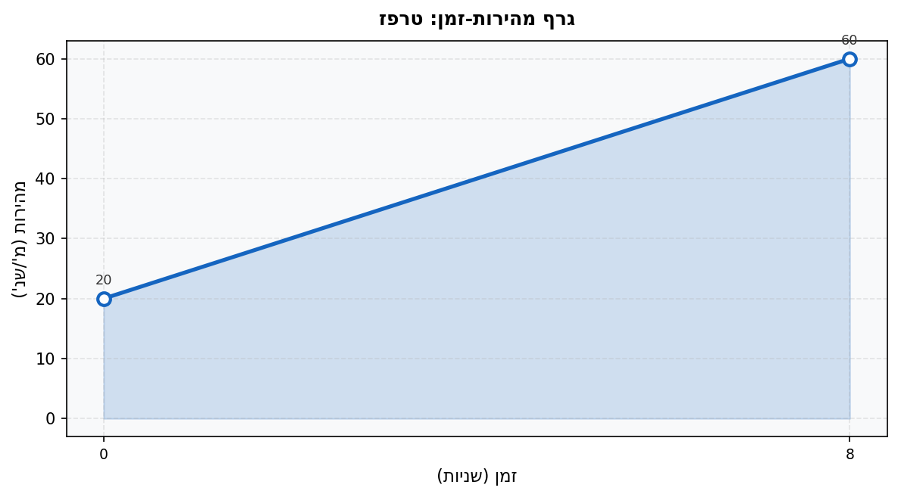

חשב את המרחק הכולל (שטח הטרפז).

16. גרף מהירות-זמן מורכב: שני משולשים. משולש ראשון: בסיס
$4$ שניות, גובה
$50$ מ'/שנ'. משולש שני: בסיס
$6$ שניות, גובה
$30$ מ'/שנ'.

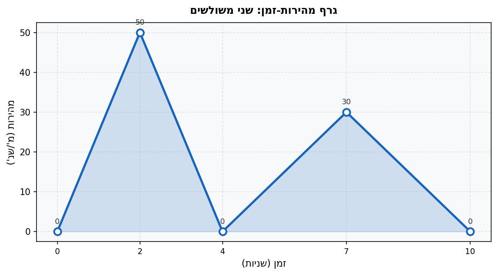

חשב את המרחק הכולל.

---

## רמה 3: רמת בחינת מה"ט (4 תרגילים)

17. מתוך: סגנון שנת 2024, אביב מועד א׳ – שאלה 11

הגרף הבא מתאר את המרחק (בק"מ) של נוסע מנקודת המוצא לפי הזמן (שעות):

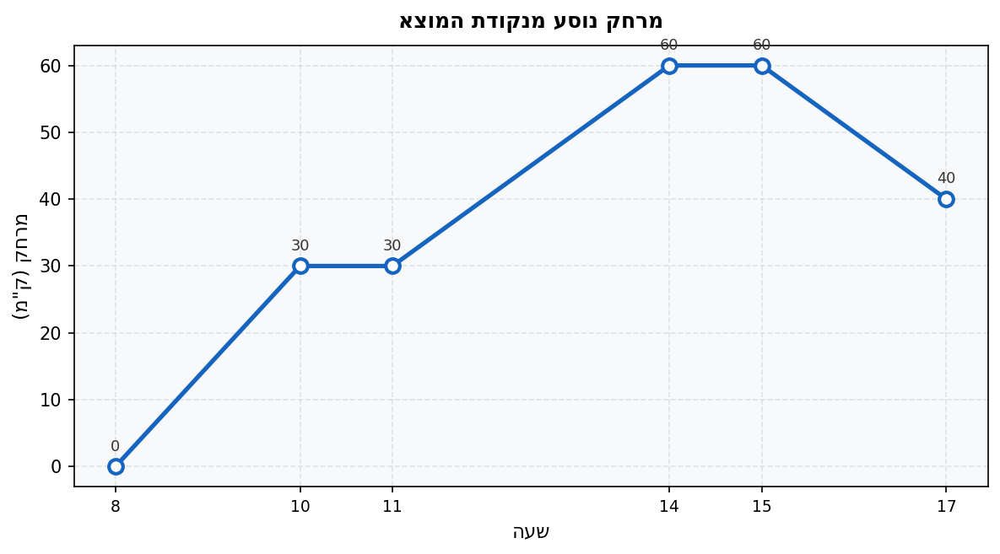

חשב את השטח הכולל מתחת לגרף המרחק מן השעה 8 ועד השעה 17.

**הנחיה:** זהה כל קטע כמשולש, מלבן או טרפז, וחשב בנפרד.

18. מתוך: סגנון שנת 2025, אביב מועד א׳ – שאלה 11

הגרף מתאר את המרחק (בק"מ) של משאית אספקה מנקודת המוצא לפי הזמן (שעות):

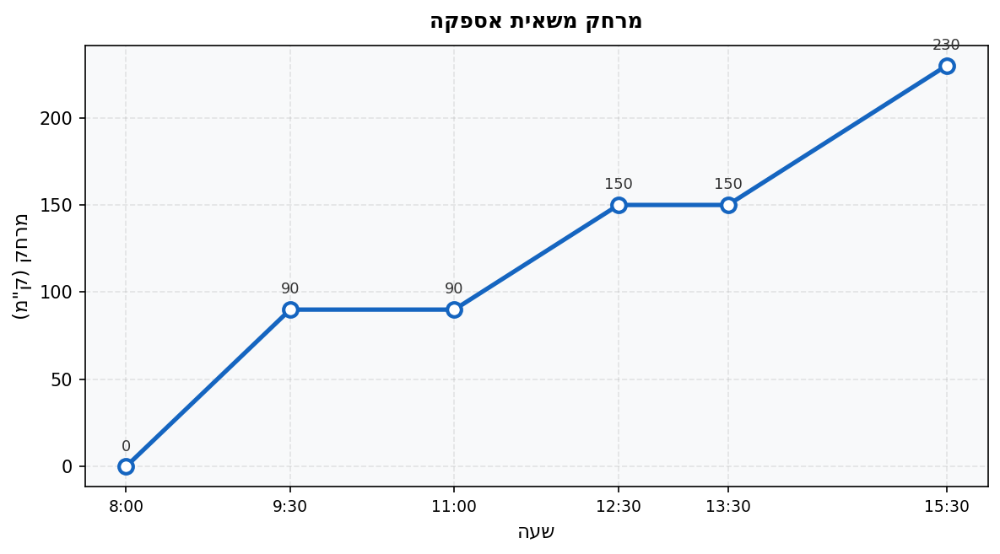

חשב את השטח הכולל מתחת לגרף המרחק מן השעה 8 ועד השעה 15.5.

**הנחיה:** זהה כל קטע כמשולש, מלבן או טרפז, וחשב בנפרד.

19. מתוך: סגנון שנת 2024, קיץ מועד א׳ – שאלה 11

הגרף מתאר את המרחק (בק"מ) של דניאלה מנקודת המוצא לפי הזמן (שעות):

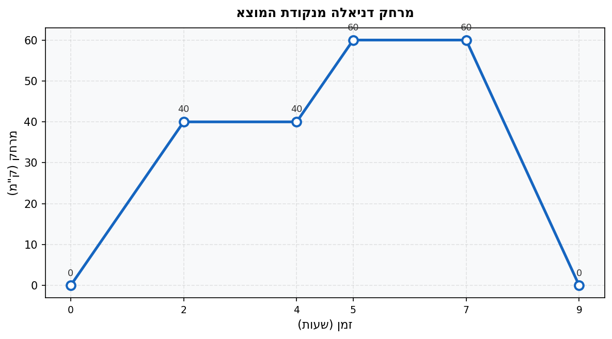

א. חשב את השטח הכולל מתחת לגרף מ-
$t = 0$ עד
$t = 9$.

ב. מהו המרחק הכולל שעבר הגוף (לא השטח, אלא סך הנסיעה הלוך וחזור)?

20. מתוך: סגנון שנת 2024, אביב מועד ב׳ – שאלה 11

גרף מתאר מרחק שליח (במטרים) מנקודת המוצא לפי הזמן (דקות):

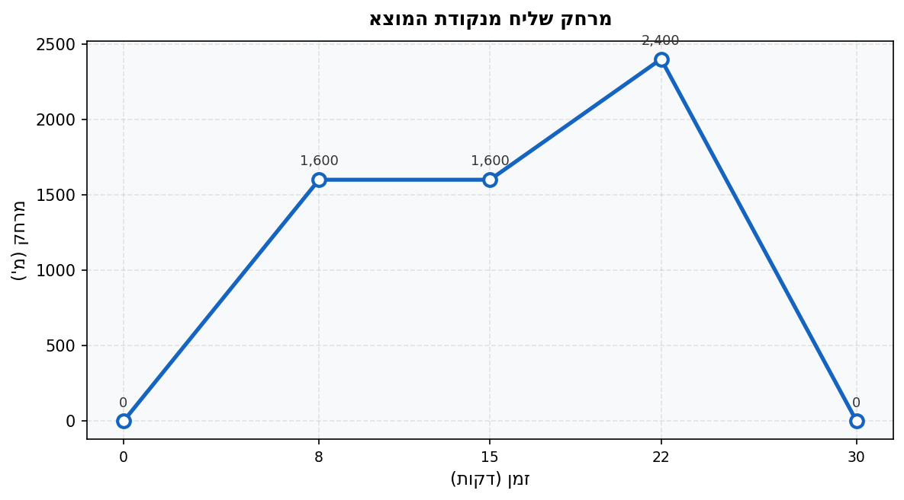

א. חשב את השטח הכולל מתחת לגרף מ-
$t = 0$ עד
$t = 30$.

ב. מהו ה"שטח" ביחידות של מ'·דקה?

---

תשובות סופיות

1. א. מלבן (רוחב 3, גובה 60)
ב.
$$3 \times 60 = 180 \text{ ק"מ·שעה}$$
המשמעות: המכונית נסעה $180$ ק"מ

2. א. משולש ישר-זווית (בסיס 4, גובה 80)
ב.
$$\frac{1}{2} \times 4 \times 80 = 160 \text{ ק"מ}$$

3.
$$8 \times 15 = 120 \text{ ליטרים}$$
המשמעות: $120$ ל' נכנסו למיכל

4.
$$\frac{1}{2} \times 6 \times 90 = 270 \text{ ק"מ}$$

5. $5 \times 12 = 60$ יחידות רבועות

6. $\frac{1}{2} \times 8 \times 20 = 80$ יחידות רבועות

7. א. $50 \times 10 = 500$ מ"ר
ב. $500$ מטרים

8. א. $\frac{1}{2} \times 6 \times 60 = 180$ מ"ר
ב. $180$ מטרים

9. מלבן:
$$2 \times 30 = 60$$
משולש:
$$\frac{1}{2} \times 3 \times 30 = 45$$
סה"כ: $60 + 45 = 105$ ק"מ

10. משולש:
$$\frac{1}{2} \times 0.5 \times 120 = 30$$
מלבן:
$$2 \times 120 = 240$$
סה"כ: $30 + 240 = 270$ ק"מ

11. מלבן ראשון:
$$5 \times 8 = 40$$
טרפז (האצה מ-8 ל-14):
$$\frac{8 + 14}{2} \times 4 = 44$$
מלבן שני:
$$6 \times 14 = 84$$
סה"כ: $40 + 44 + 84 = 168$ מ'

12. מלבן (0 עד 5, גובה 30):
$$5 \times 30 = 150$$
משולש (5 עד 11, יורד ל-0):
$$\frac{1}{2} \times 6 \times 30 = 90$$
סה"כ: $150 + 90 = 240$ מ' (או ק"מ, לפי יחידות)

13.
$$\frac{360}{9} = 40 \text{ מ'/שנ'}$$

14.
$$\frac{450}{5} = 90 \text{ ק"מ/שעה}$$

15. שטח טרפז:
$$\frac{20 + 60}{2} \times 8 = 40 \times 8 = 320 \text{ מ'}$$

16. משולש ראשון:
$$\frac{1}{2} \times 4 \times 50 = 100$$
משולש שני:
$$\frac{1}{2} \times 6 \times 30 = 90$$
סה"כ: $100 + 90 = 190$ מ'

17. קטע 8–10 (משולש, בסיס=2, גובה=30):
$$\frac{1}{2} \times 2 \times 30 = 30$$
קטע 10–11 (מלבן, בסיס=1, גובה=30):
$$1 \times 30 = 30$$
קטע 11–14 (טרפז, בסיס=3, גבהים 30 ו-60):
$$\frac{30 + 60}{2} \times 3 = 135$$
קטע 14–15 (מלבן, בסיס=1, גובה=60):
$$1 \times 60 = 60$$
קטע 15–17 (טרפז, בסיס=2, גבהים 60 ו-40):
$$\frac{60 + 40}{2} \times 2 = 100$$
סה"כ:
$$30 + 30 + 135 + 60 + 100 = 355 \text{ ק"מ·שעה}$$

18. קטע 8–9.5 (משולש, בסיס=1.5, גובה=90):
$$\frac{1}{2} \times 1.5 \times 90 = 67.5$$
קטע 9.5–11 (מלבן, בסיס=1.5, גובה=90):
$$1.5 \times 90 = 135$$
קטע 11–12.5 (טרפז, בסיס=1.5, גבהים 90 ו-150):
$$\frac{90 + 150}{2} \times 1.5 = 180$$
קטע 12.5–13.5 (מלבן, בסיס=1, גובה=150):
$$1 \times 150 = 150$$
קטע 13.5–15.5 (טרפז, בסיס=2, גבהים 150 ו-230):
$$\frac{150 + 230}{2} \times 2 = 380$$
סה"כ:
$$67.5 + 135 + 180 + 150 + 380 = 912.5 \text{ ק"מ·שעה}$$

19. א. קטע 0–2 (משולש, בסיס=2, גובה=40):
$$\frac{1}{2} \times 2 \times 40 = 40$$
קטע 2–4 (מלבן):
$$2 \times 40 = 80$$
קטע 4–5 (טרפז, גבהים 40 ו-60):
$$\frac{40 + 60}{2} \times 1 = 50$$
קטע 5–7 (מלבן):
$$2 \times 60 = 120$$
קטע 7–9 (טרפז, גבהים 60 ו-0):
$$\frac{60 + 0}{2} \times 2 = 60$$
סה"כ שטח:
$$40 + 80 + 50 + 120 + 60 = 350 \text{ ק"מ·שעה}$$
ב. המרחק הפיזי שעברה דניאלה (לוך וחזור):
$$60 + 60 = 120 \text{ ק"מ}$$

20. א. קטע 0–8 (משולש, בסיס=8, גובה=1,600):
$$\frac{1}{2} \times 8 \times 1{,}600 = 6{,}400$$
קטע 8–15 (מלבן, בסיס=7, גובה=1,600):
$$7 \times 1{,}600 = 11{,}200$$
קטע 15–22 (טרפז, גבהים 1,600 ו-2,400):
$$\frac{1{,}600 + 2{,}400}{2} \times 7 = 14{,}000$$
קטע 22–30 (טרפז, גבהים 2,400 ו-0):
$$\frac{2{,}400 + 0}{2} \times 8 = 9{,}600$$
סה"כ שטח:
$$6{,}400 + 11{,}200 + 14{,}000 + 9{,}600 = 41{,}200 \text{ מ'·דקה}$$
ב. $41{,}200$ מ'·דקה

