# תת-נושא 3.5: חזרה מסכמת – פתרון שאלות מבחן מלאות של מה"ט

**פרק זה משלב את כל המיומנויות:**
- קריאת ערכים מגרף (3.1)
- חישוב הפרשים, ממוצעים ואחוזים (3.2)
- חישוב קצבים ומהירויות + המרת יחידות (3.3)
- חישוב שטח מתחת לגרף (3.4)

---

## רמה 1: בניית ביטחון (8 תרגילים)

1. הגרף מתאר מרחק רכב (ק"מ) מנקודת המוצא לפי זמן (שעות):

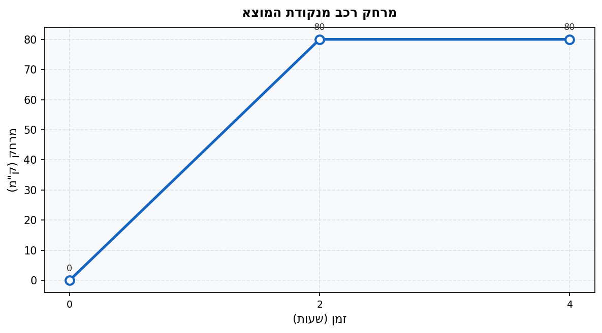

א. מהי מהירות הרכב בין שעה
$0$ לשעה
$2$?

ב. מה קרה בין שעה
$2$ לשעה
$4$?

ג. כמה ק"מ עבר הרכב בסך הכל?

2. גרף מתאר עלות חשמל (₪) לפי כמות הצריכה (קוו"ש):

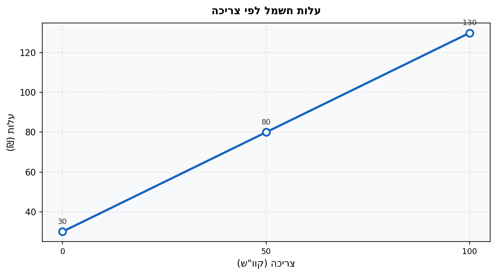

א. מהו התשלום הקבוע (כאשר הצריכה היא
$0$)?

ב. מהו מחיר כל קוו"ש?

ג. מהי העלות הכוללת עבור
$100$ קוו"ש?

3. בגרף מהירות-זמן, רוכב נע במהירות קבועה של
$12$ מ'/שנ' למשך
$20$ שניות.

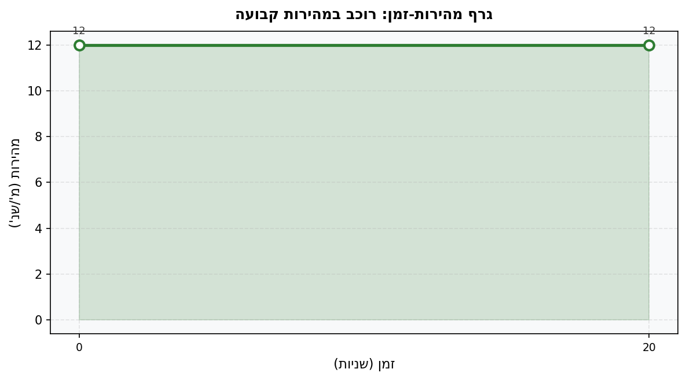

א. חשב את שטח מתחת לגרף.

ב. מה המרחק שעבר?

ג. המר את מהירות הרוכב ל-ק"מ/שעה.

4. גרף מתאר טמפרטורה (°C) לפי שעות:

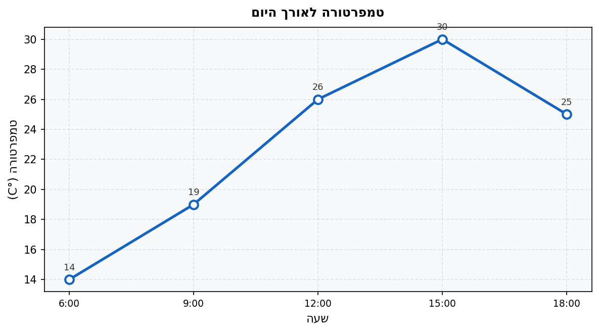

א. מהי הטמפרטורה המקסימלית? מתי?

ב. מהו ממוצע כל 5 התצפיות?

ג. בכמה מעלות עלתה הטמפרטורה בין 6:00 ל-15:00?

5. גרף מתאר הכנסות חנות (₪) בחמישה ימים:

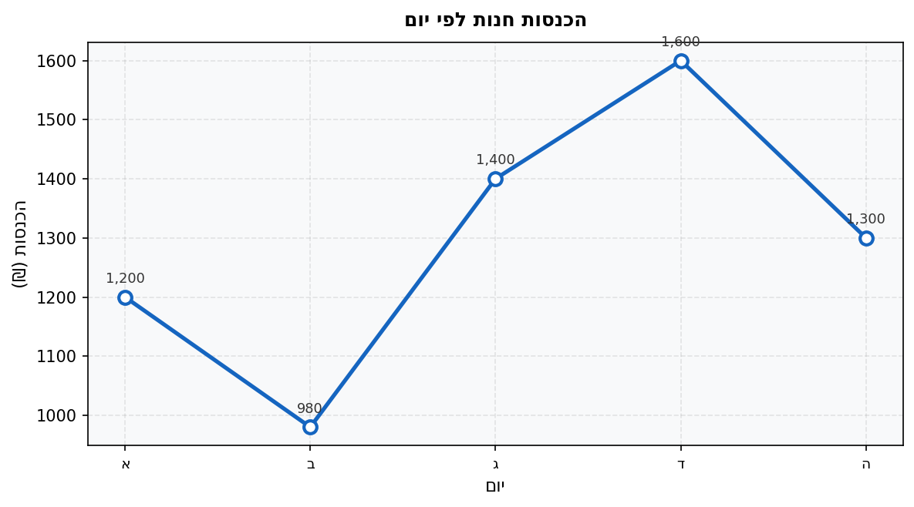

א. באיזה יום הייתה ההכנסה הגבוהה ביותר?

ב. מהו ממוצע ההכנסות היומי?

ג. מהו ההפרש בין ההכנסה היומית הגבוהה לנמוכה?

6. גרף מהירות-זמן: גוף מאיץ מ-
$0$ ל-
$40$ מ'/שנ' תוך
$5$ שניות, ואז נע בקצב קבוע
$40$ מ'/שנ' למשך
$10$ שניות.

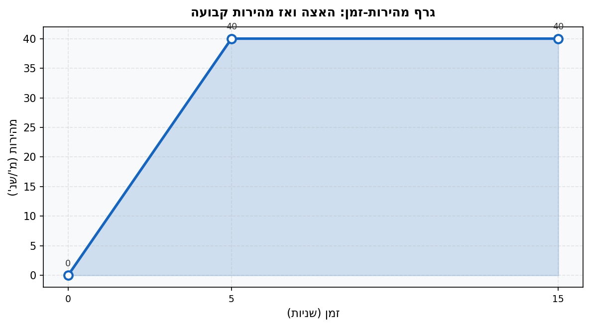

חשב את המרחק הכולל.

7. גרף מתאר ציון ממוצע בכיתה לפי חודשי השנה:

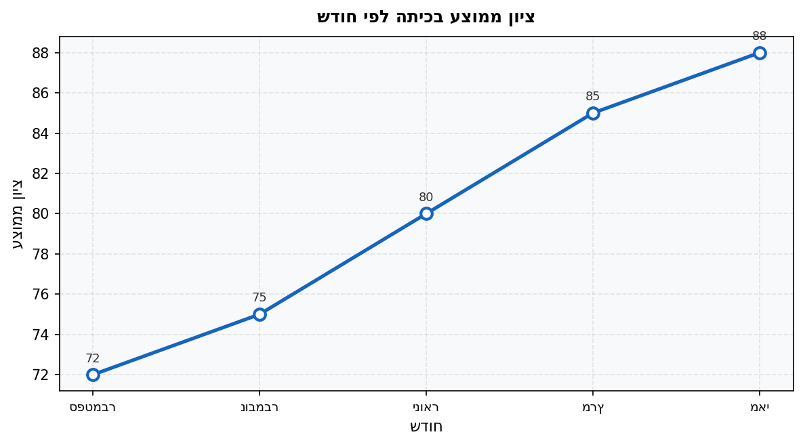

א. מהי מגמת הציון לאורך השנה?

ב. מהו ממוצע כל הציונים?

ג. בכמה אחוזים עלה הציון הממוצע בין ספטמבר למאי?

8. גרף מתאר מרחק (מ') של כדור מנקודת זריקה:

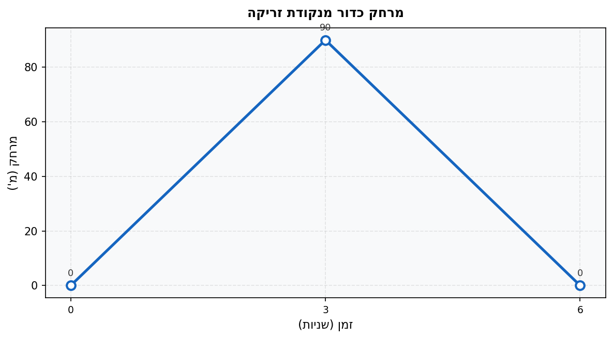

א. מהי מהירות הכדור בקטע הראשון?

ב. מהי מגמת הכדור בקטע האחרון?

ג. חשב את שטח מתחת לגרף מ-
$t = 0$ עד
$t = 6$.

---

## רמה 2: תרגול שוטף ומשולב (8 תרגילים)

9. הגרף מתאר מרחק (ק"מ) של רכב מנקודת המוצא לפי זמן (שעות):

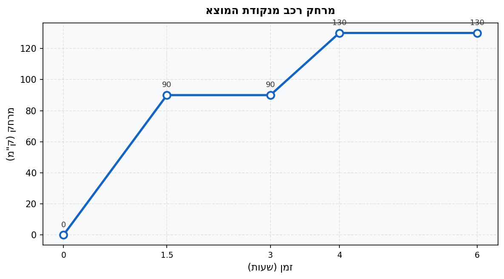

א. מהי המהירות בכל קטע נסיעה (ק"מ/שעה)?

ב. המר את המהירות בקטע הראשון ל-מ'/שנ' (3 ספרות).

ג. כמה שעות עצר הרכב בסך הכל?

ד. מהי המהירות הממוצעת לכל 6 השעות?

10. הגרף מתאר תשלום חודשי (₪) של משפחה לחברת כבלים בחודשי השנה:

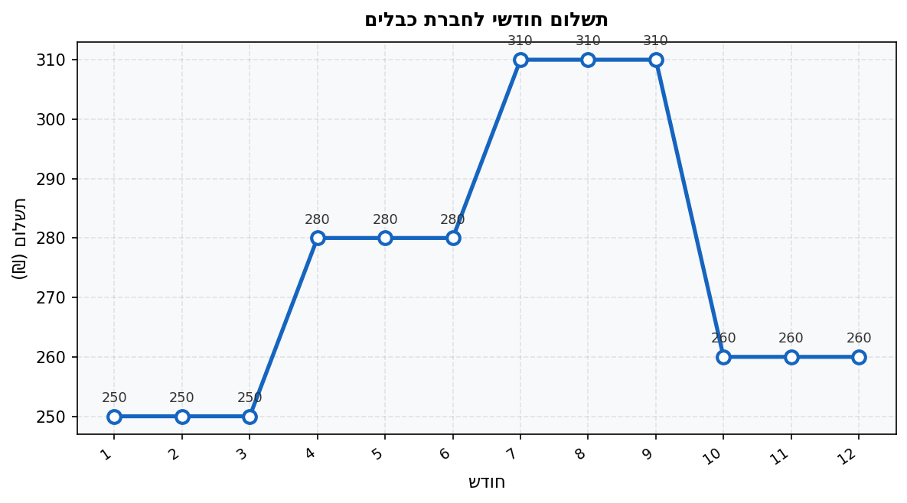

א. מהו התשלום הגבוה ביותר? באיזה חודשים?

ב. מהי העלות הכוללת לשנה?

ג. חברה מתחרה מציעה לשלם
$850$ ₪ לרבעון. האם כדאי לעבור? נמק.

11. הגרף מתאר מרחק (ק"מ) של רצה מנקודת המוצא לפי זמן (שעות):

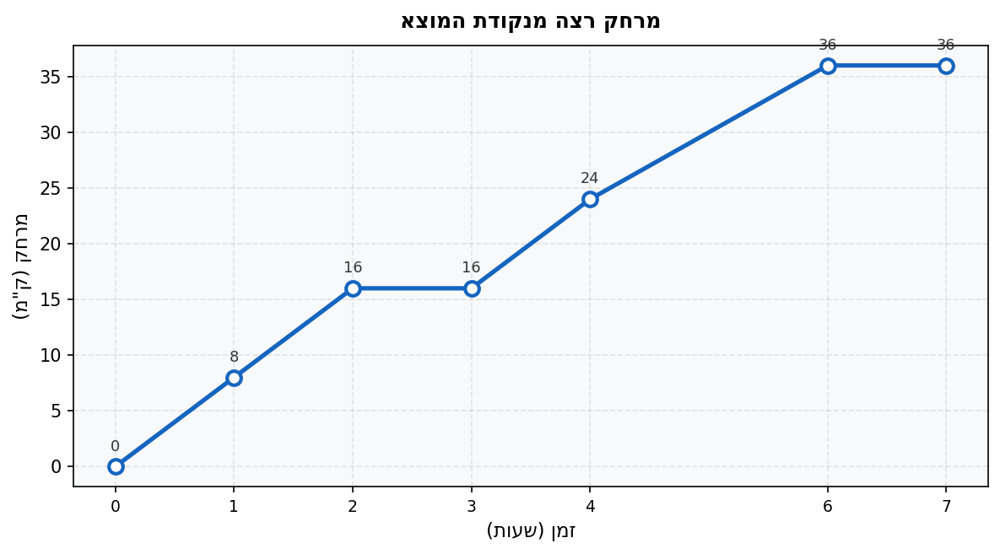

א. מהי מהירות הריצה בכל קטע?

ב. בין אילו שעות עצר הרצה?

ג. מהי מהירותו הממוצעת לאורך כל 7 השעות (כולל עצירה)?

ד. המר את המהירות בקטע הראשון ל-מ'/שנ' (3 ספרות).

12. הגרף מתאר הכנסות (₪) של עצמאי לפי חודשי השנה:

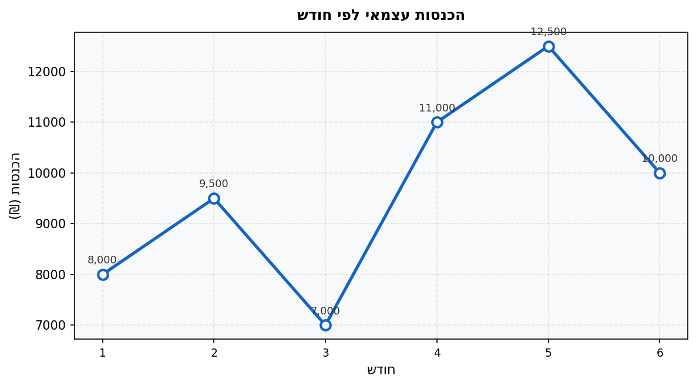

א. מהי ההכנסה הגבוהה ביותר? בחודש כמה?

ב. מהי ההכנסה הנמוכה ביותר? בחודש כמה?

ג. בכמה אחוזים גדלה ההכנסה בין חודש 3 לחודש 5?

ד. מהו ממוצע ההכנסות ב-6 חודשים?

13. גרף מהירות-זמן מורכב:

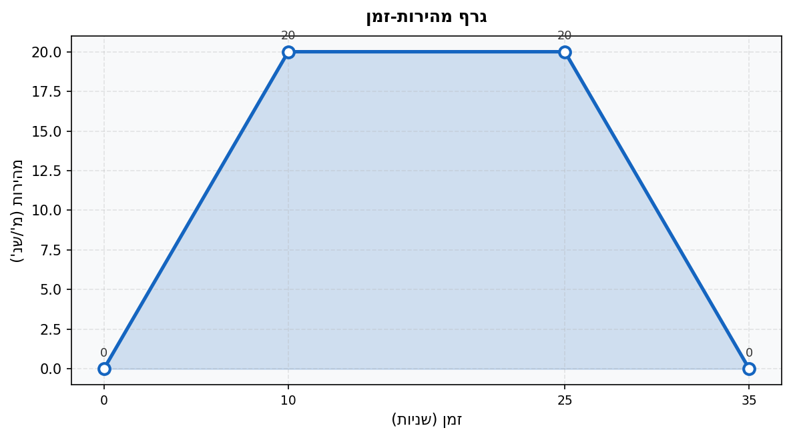

א. תאר כל קטע (משולש/מלבן).

ב. חשב את השטח הכולל.

ג. מה המרחק הכולל שעבר הגוף?

ד. מהי המהירות הממוצעת לאורך כל 35 השניות?

14. גרף מתאר מרחק (ק"מ) מנקודת המוצא לפי זמן (שעות):

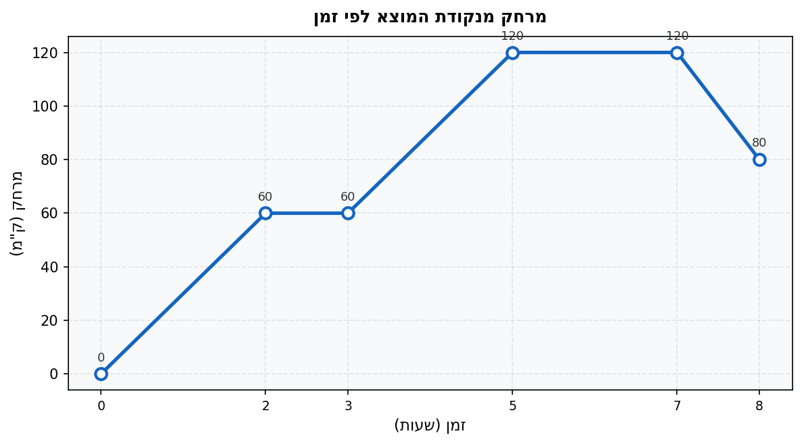

א. מהי המהירות בכל קטע תנועה (ק"מ/שעה)?

ב. חשב את השטח הכולל מתחת לגרף מ-
$t = 0$ עד
$t = 8$.

ג. מהי מהירות הממוצעת לאורך 8 השעות (כולל עצירות)?

15. גרף מתאר כמות מים בבריכה (ליטרים) לפי זמן (דקות):

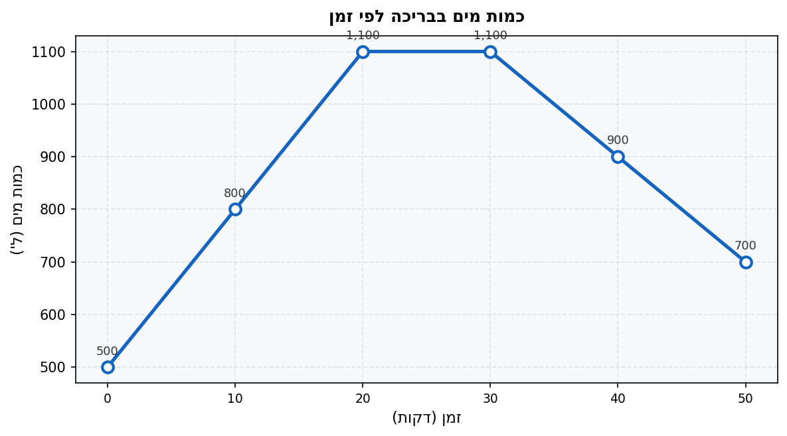

א. מהו קצב המילוי (ל'/דקה) בין דקה 0 לדקה 20?

ב. בין אילו דקות הייתה הבריכה בשיאה?

ג. מהו ממוצע כמות המים על פני 6 נקודות המדידה?

ד. בכמה אחוזים גדלה כמות המים בין דקה 0 לדקה 20?

16. גרף מתאר מרחק אופנוע (מ') מנקודת המוצא לפי זמן (שניות):

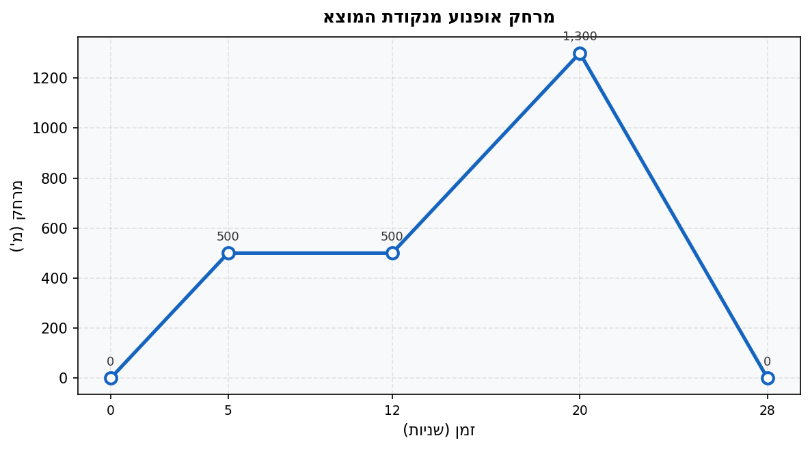

א. מהי המהירות (מ'/שנ') בכל קטע תנועה?

ב. באיזה קטע המהירות הגבוהה ביותר?

ג. חשב את השטח הכולל מתחת לגרף.

---

## רמה 3: רמת בחינת מה"ט (4 תרגילים)

17. מתוך: שנת 2025, אביב מועד א׳ – שאלה 11

משאית אספקה יוצאת בשעה 08:00 ממרכז האספקה לחלוקת מוצרים בשלוש רשתות שיווק. הגרף הבא מתאר את המרחק (בק"מ) של המשאית מנקודת המוצא בכל שעה מרגע יציאתה. בשעה 11 המרחק מנקודת המוצא הוא 225, ובשעה 17:30 המרחק הוא 500.

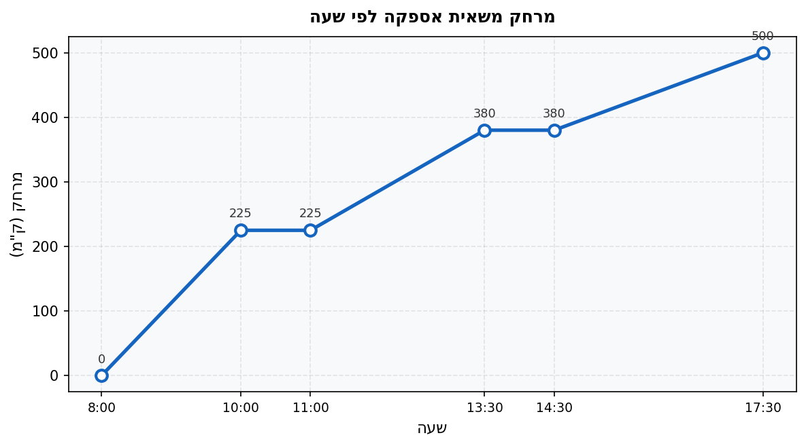

ענו על השאלות הבאות (שמרו על רמת דיוק של 3 ספרות אחרי הנקודה):

א. מהי מהירות הנסיעה של המשאית לכל אחת מרשתות השיווק (מרחק בק"מ / זמן בשעות)?

ב. מהי מהירות הנסיעה של המשאית, לכל רשת שיווק, במ'/שנ'?

ג. מהו השטח הכולל מתחת לגרף המרחק (מן השעה 8 ועד השעה 17:30)?

18. מתוך: שנת 2024, קיץ מועד א׳ – שאלה 11

דניאלה מחליקה על רולרבליידס. הגרף הבא מתאר את המרחק שלה מאשקלון
$(0,\ 0)$, כפונקציה של זמן. המהירות = מרחק / זמן.

**הערה:** בשעה 12:00 דניאלה נעצרת ומתחילה שוב.

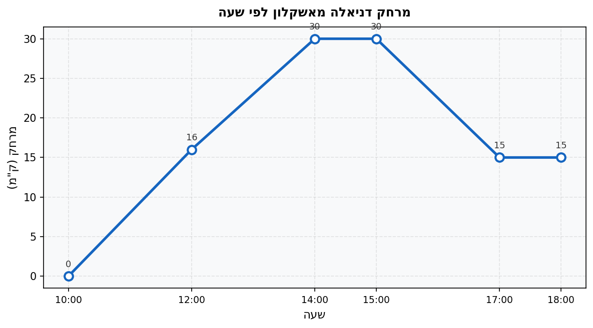

ענו על השאלות הבאות (שמרו על 2 ספרות אחרי הנקודה):

א. באיזה קטע החליקה דניאלה במהירות הגבוהה ביותר?

ב. חשב את השטח מתחת לגרף מן השעה 10:00 ועד השעה 14:00.

ג. חשב את משוואת הישר בין השעה 15:00 לבין השעה 17:00 וחשב את מרחקה של דניאלה בשעה 16:00.

ד. נתבונן בנקודה שבה דניאלה נמצאת במרחק 15 ק"מ, לאחר שעתיים מתחילת התנועה. מהו המרחק במטרים ומהו הזמן בדקות?

19. מתוך: שנת 2025, אביב מועד ב׳ – שאלה 10

להלן גרף המראה כמה ישלם לקוח עבור טיסה במסוק מעל שמי תל-אביב. התשלום כולל דמי טיפול קבועים (שלא יוחזרו) וכן תשלום עבור שעות הטיסה.

ציר ה-X: דקות טיסה; ציר ה-Y: עלות בשקלים.

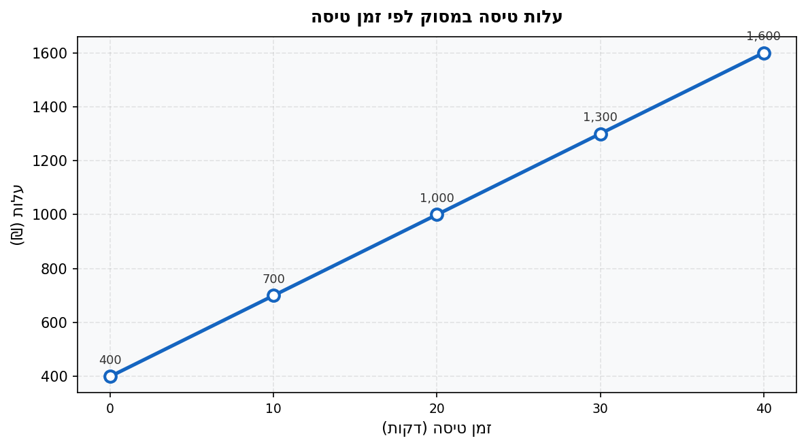

א. יצחק החליט לשכור את שירותי המסוק ובסוף ביטל לפני הטיסה. כמה עליו לשלם?

ב. בהתחלה תכנן לטוס
$20$ דקות, ובמהלך הטיסה הוסיף
$10$ דקות. כמה כסף עליו להוסיף לתשלום?

ג. בסופו של דבר יצחק טס
$40$ דקות. כמה עלתה לו בממוצע דקת טיסה אחת?

ד. אם היה טס רק
$20$ דקות, מהי הייתה העלות הממוצעת לדקה?

20. מתוך: שנת 2024, אביב מועד ב׳ – שאלה 11 (שאלת שליח פיצה)

שליח פיצה יוצא מהפיצריה
$(0,\ 0)$ ונע במשך 79 דקות. הגרף מתאר את המרחק (במטרים) של השליח מנקודת המוצא לפי הזמן (דקות):

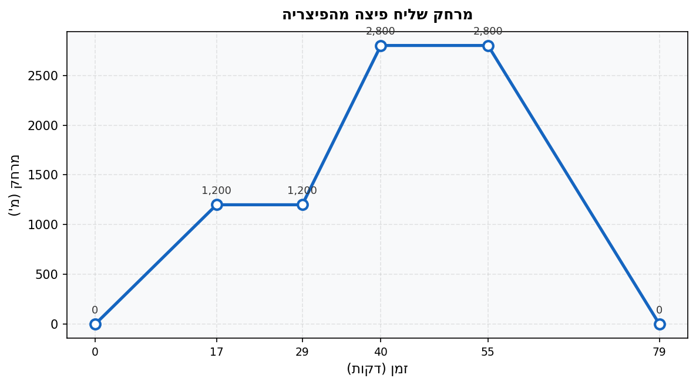

ענו על השאלות הבאות (שמרו על 2 ספרות אחרי הנקודה):

א. באיזה קטע קצב השינוי במרחק (בערך מוחלט) הוא הגבוה ביותר? (קצב = מהירות / זמן)

ב. חשב את משוואת הישר בין הדקה ה-17 לדקה ה-29 ומצא את מרחק השליח בדקה ה-20.

ג. חשב את השטח מתחת לגרף מרחק-זמן מתחילת התנועה ועד הדקה ה-40.

ד. נתבונן בנקודה שבה השליח נמצא במרחק 2,800 מ' לאחר 55 דקות. מהו המרחק בק"מ ומהו הזמן בשעות?

---

תשובות סופיות

1. א. $\frac{80}{2} = 40$ ק"מ/שעה
ב. עצירה (מרחק קבוע)
ג. $80$ ק"מ

2. א. $30$ ₪
ב. $\frac{130 - 30}{100} = 1$ ₪ לקוו"ש
ג. $130$ ₪

3. א. $12 \times 20 = 240$ מ"ר
ב. $240$ מ'
ג. $12 \times 3.6 = 43.2$ ק"מ/שעה

4. א. $30°C$, בשעה 15:00
ב. $\frac{14 + 19 + 26 + 30 + 25}{5} = \frac{114}{5} = 22.8°C$
ג. $30 - 14 = 16$ מעלות

5. א. יום ד' ($1{,}600$ ₪)
ב. $\frac{1{,}200 + 980 + 1{,}400 + 1{,}600 + 1{,}300}{5} = \frac{6{,}480}{5} = 1{,}296$ ₪
ג. $1{,}600 - 980 = 620$ ₪

6. משולש:
$$\frac{1}{2} \times 5 \times 40 = 100$$
מלבן:
$$10 \times 40 = 400$$
סה"כ: $100 + 400 = 500$ מ'

7. א. מגמת עלייה
ב. $\frac{72 + 75 + 80 + 85 + 88}{5} = \frac{400}{5} = 80$
ג. $\frac{88 - 72}{72} \times 100 \approx 22.22\%$

8. א. $\frac{90}{3} = 30$ מ'/שנ'
ב. ירידה (חזרה ל-0)
ג. מלבן (0–3):
$$3 \times 90 = 270$$
משולש (3–6):
$$\frac{1}{2} \times 3 \times 90 = 135$$
סה"כ: $270 + 135 = 405$ מ'·שנ'

9. א. קטע 0–1.5:
$$\frac{90}{1.5} = 60 \text{ ק"מ/שעה}$$
קטע 3–4:
$$\frac{40}{1} = 40 \text{ ק"מ/שעה}$$
ב. $60 \div 3.6 \approx 16.667$ מ'/שנ'
ג. עצירות: $3 - 1.5 = 1.5$ שעות ו-$6 - 4 = 2$ שעות → סה"כ $3.5$ שעות
ד. $\frac{130}{6} \approx 21.667$ ק"מ/שעה

10. א. $310$ ₪, חודשים 7–9
ב. $(250 \times 3) + (280 \times 3) + (310 \times 3) + (260 \times 3) = 750 + 840 + 930 + 780 = 3{,}300$ ₪
ג. חברה מתחרה: $850 \times 4 = 3{,}400$ ₪ לשנה → **לא כדאי** (יקר יותר ב-$100$ ₪)

11. א. קטע 0–1: $8$ ק"מ/שעה; קטע 1–2: $8$ ק"מ/שעה; קטע 3–4: $8$ ק"מ/שעה; קטע 4–6: $6$ ק"מ/שעה
ב. בין שעה $2$ לשעה $3$ (ובין שעה $6$ לשעה $7$ אם עצר שוב)
ג. $\frac{36}{7} \approx 5.143$ ק"מ/שעה
ד. $8 \div 3.6 \approx 2.222$ מ'/שנ'

12. א. $12{,}500$ ₪, חודש $5$
ב. $7{,}000$ ₪, חודש $3$
ג. $\frac{12{,}500 - 7{,}000}{7{,}000} \times 100 \approx 78.57\%$
ד. $\frac{8{,}000 + 9{,}500 + 7{,}000 + 11{,}000 + 12{,}500 + 10{,}000}{6} = \frac{58{,}000}{6} \approx 9{,}667$ ₪

13. א. קטע 0–10: משולש; קטע 10–25: מלבן; קטע 25–35: משולש
ב.
$$\frac{1}{2} \times 10 \times 20 + 15 \times 20 + \frac{1}{2} \times 10 \times 20 = 100 + 300 + 100 = 500$$
ג. $500$ מ'
ד. $\frac{500}{35} \approx 14.286$ מ'/שנ'

14. א. קטע 0–2: $30$ ק"מ/שעה; קטע 3–5: $30$ ק"מ/שעה; קטע 7–8: יורד $40$ ק"מ לכיוון המוצא = $-40$ ק"מ/שעה (גודל: $40$)
ב. קטע 0–2 (משולש): $\frac{1}{2} \times 2 \times 60 = 60$
קטע 2–3 (מלבן): $1 \times 60 = 60$
קטע 3–5 (טרפז): $\frac{60+120}{2} \times 2 = 180$
קטע 5–7 (מלבן): $2 \times 120 = 240$
קטע 7–8 (טרפז): $\frac{120+80}{2} \times 1 = 100$
סה"כ: $60 + 60 + 180 + 240 + 100 = 640$ ק"מ·שעה
ג. $\frac{120}{8} = 15$ ק"מ/שעה

15. א. $\frac{1{,}100 - 500}{20} = \frac{600}{20} = 30$ ל'/דקה
ב. בין דקה $20$ לדקה $30$
ג. $\frac{500 + 800 + 1{,}100 + 1{,}100 + 900 + 700}{6} = \frac{5{,}100}{6} = 850$ ל'
ד. $\frac{1{,}100 - 500}{500} \times 100 = \frac{600}{500} \times 100 = 120\%$

16. א. קטע 0–5: $\frac{500}{5} = 100$ מ'/שנ'; קטע 12–20: $\frac{800}{8} = 100$ מ'/שנ'; קטע 20–28: $\frac{1{,}300}{8} \approx 162.5$ מ'/שנ'
ב. קטע 20–28 ($\approx 162.5$ מ'/שנ')
ג. משולש (0–5): $\frac{1}{2} \times 5 \times 500 = 1{,}250$
מלבן (5–12): $7 \times 500 = 3{,}500$
טרפז (12–20): $\frac{500+1{,}300}{2} \times 8 = 7{,}200$
משולש (20–28, ירידה): $\frac{1}{2} \times 8 \times 1{,}300 = 5{,}200$
סה"כ: $1{,}250 + 3{,}500 + 7{,}200 + 5{,}200 = 17{,}150$ מ'·שנ'

17. א. רשת 1 (8:00–10:00, 2 שעות):
$$\frac{225}{2} = 112.5 \text{ ק"מ/שעה}$$
רשת 2 (11:00–13:30, 2.5 שעות):
$$\frac{380 - 225}{2.5} = \frac{155}{2.5} = 62 \text{ ק"מ/שעה}$$
רשת 3 (14:30–17:30, 3 שעות):
$$\frac{500 - 380}{3} = \frac{120}{3} = 40 \text{ ק"מ/שעה}$$
ב. רשת 1: $112.5 \div 3.6 = 31.250$ מ'/שנ'
רשת 2: $62 \div 3.6 \approx 17.222$ מ'/שנ'
רשת 3: $40 \div 3.6 \approx 11.111$ מ'/שנ'
ג. קטע 8–10 (משולש): $\frac{1}{2} \times 2 \times 225 = 225$
קטע 10–11 (מלבן): $1 \times 225 = 225$
קטע 11–13.5 (טרפז): $\frac{225 + 380}{2} \times 2.5 = 756.25$
קטע 13.5–14.5 (מלבן): $1 \times 380 = 380$
קטע 14.5–17.5 (טרפז): $\frac{380 + 500}{2} \times 3 = 1{,}320$
סה"כ: $225 + 225 + 756.25 + 380 + 1{,}320 = 2{,}906.25$ ק"מ·שעה

18. א. קצבים: קטע 10–12: $\frac{16}{2} = 8$ ק"מ/שעה; קטע 12–14: $\frac{14}{2} = 7$ ק"מ/שעה; קטע 15–17: $\frac{15}{2} = 7.5$ ק"מ/שעה → קטע 10–12 הכי מהיר
ב. קטע 10–12 (משולש): $\frac{1}{2} \times 2 \times 16 = 16$
קטע 12–14 (טרפז): $\frac{16 + 30}{2} \times 2 = 46$
סה"כ: $16 + 46 = 62$ ק"מ·שעה
ג. קצב בין 15–17: $\frac{15 - 30}{17 - 15} = \frac{-15}{2} = -7.5$ ק"מ/שעה
משוואת ישר: $y - 30 = -7.5(x - 15)$
בשעה 16: $y = 30 - 7.5(16 - 15) = 30 - 7.5 = 22.5$ ק"מ
ד. $15$ ק"מ $= 15{,}000$ מ'; $2$ שעות $= 120$ דקות

19. א. $400$ ₪
ב. הוספת 10 דקות: $10 \times 30 = 300$ ₪
ג.
$$\frac{1{,}600}{40} = 40 \text{ ₪ לדקה}$$
ד.
$$\frac{1{,}000}{20} = 50 \text{ ₪ לדקה}$$

20. א. קצבים: קטע 0–17: $\frac{1{,}200}{17} \approx 70.59$ מ'/דקה; קטע 29–40: $\frac{1{,}600}{11} \approx 145.45$ מ'/דקה; קטע 55–79: $\frac{2{,}800}{24} \approx 116.67$ מ'/דקה
→ קטע 29–40 הוא בעל הקצב הגבוה ביותר

ב. קצב בקטע 17–29: הגרף אופקי (מרחק קבוע 1,200), לכן הישר הוא:
$$y = 1{,}200$$
בדקה 20:
$$\text{מרחק} = 1{,}200 \text{ מ'}$$

ג. קטע 0–17 (משולש):
$$\frac{1}{2} \times 17 \times 1{,}200 = 10{,}200$$
קטע 17–29 (מלבן):
$$12 \times 1{,}200 = 14{,}400$$
קטע 29–40 (טרפז):
$$\frac{1{,}200 + 2{,}800}{2} \times 11 = 22{,}000$$
סה"כ:
$$10{,}200 + 14{,}400 + 22{,}000 = 46{,}600 \text{ מ'·דקה}$$

ד. $2{,}800$ מ' $= 2.80$ ק"מ; $55$ דקות $= \frac{55}{60} \approx 0.92$ שעות

