# תת-נושא 3: קריאת ערכי ביניים וזיהוי מגמות (עלייה, ירידה, קביעות)

---

## רמה 1: בניית ביטחון (8 תרגילים)

**1.** גרף מתאר את כמות המים (ליטרים) בבריכה לפי זמן (דקות).

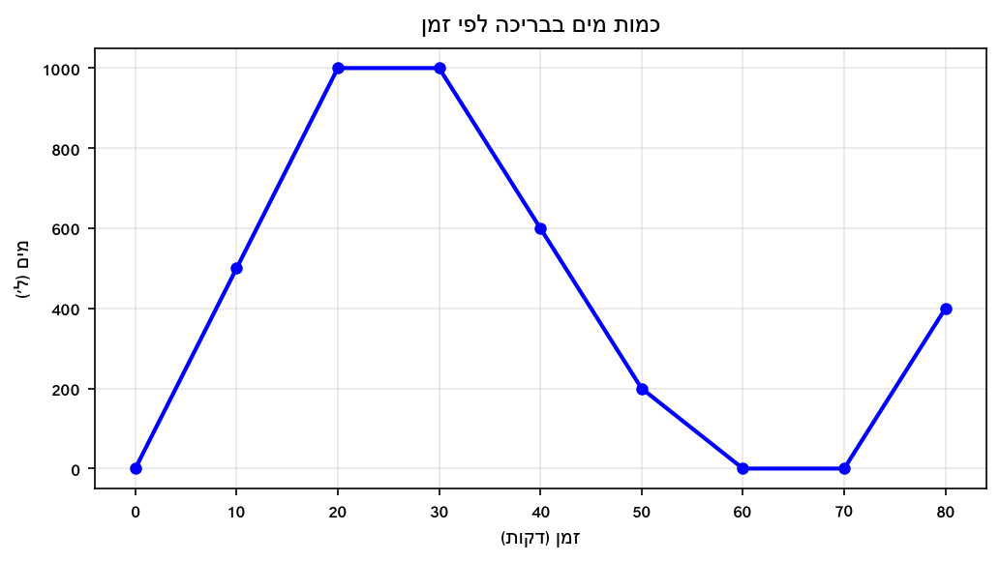

א. בין אילו דקות הגרף עולה?

ב. בין אילו דקות הגרף יורד?

ג. בין אילו דקות הגרף קבוע?

ד. מהי כמות המים בדקה 45?

---

**2.** גרף מתאר את טמפרטורת נוזל (°C) לפי זמן (דקות): חימום ואחר-כך קירור.

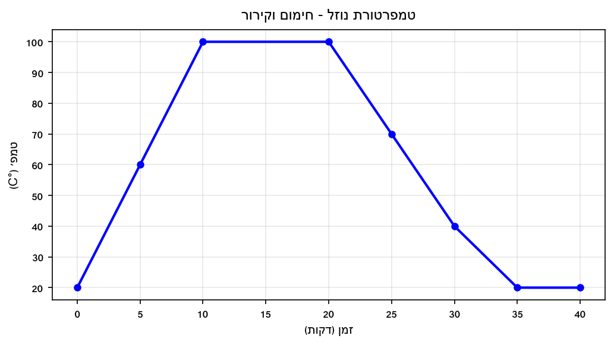

א. בין אילו דקות הטמפרטורה עולה?

ב. בין אילו דקות היא קבועה?

ג. בין אילו דקות היא יורדת?

ד. מהי הטמפרטורה בדקה 7? (הנחה: עלייה קווית בין הנקודות הנתונות)

---

**3.** גרף מתאר את טמפרטורת האוויר (°C) לאורך היום.

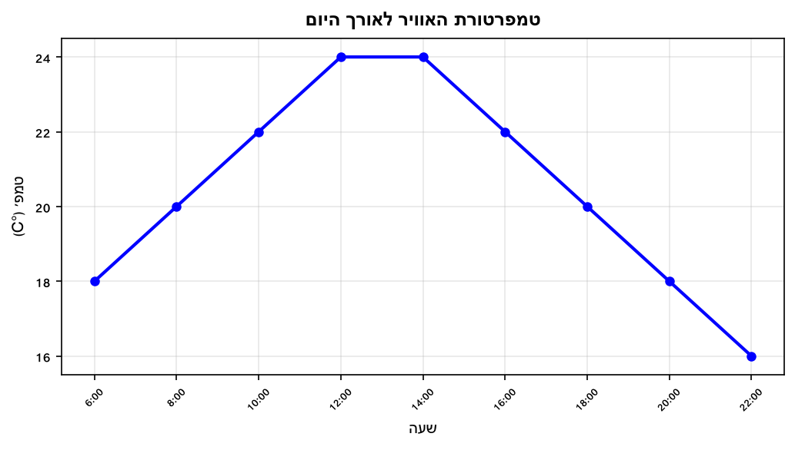

א. בין אילו שעות הטמפרטורה עולה?

ב. בין אילו שעות היא קבועה?

ג. בין אילו שעות היא יורדת?

ד. מהי הטמפרטורה בשעה 11:00? (עלייה קווית בין נקודות)

---

**4.** גרף מתאר מחיר מניה (₪) לפי ימי מסחר.

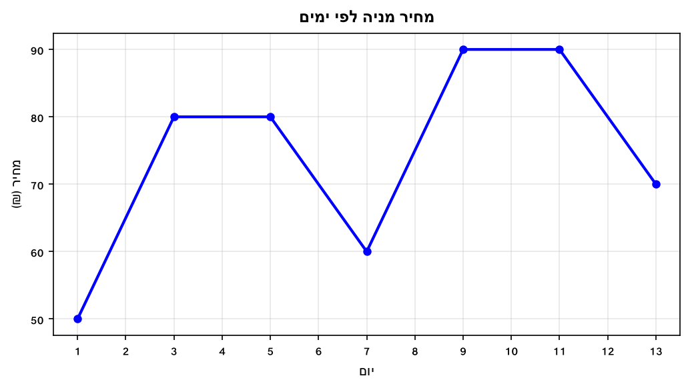

א. בין אילו ימים המחיר עולה?

ב. בין אילו ימים המחיר קבוע?

ג. בין אילו ימים המחיר יורד?

---

**5.** גרף מתאר ביצועי שחיין: זמן סיבוב (שניות) לפי מספר הסיבוב.

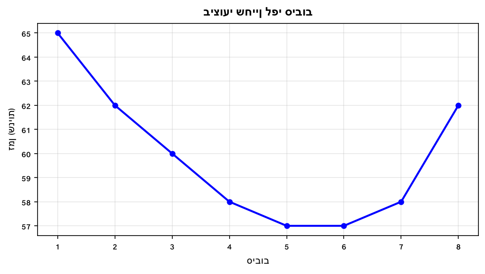

א. בין אילו סיבובים השחיין שיפר את ביצועיו (הגרף יורד)?

ב. בין אילו סיבובים הביצועים קבועים?

ג. בין אילו סיבובים הביצועים הורעו (הגרף עולה)?

---

**6.** גרף מתאר גובה שתיל (ס"מ) לפי שבועות.

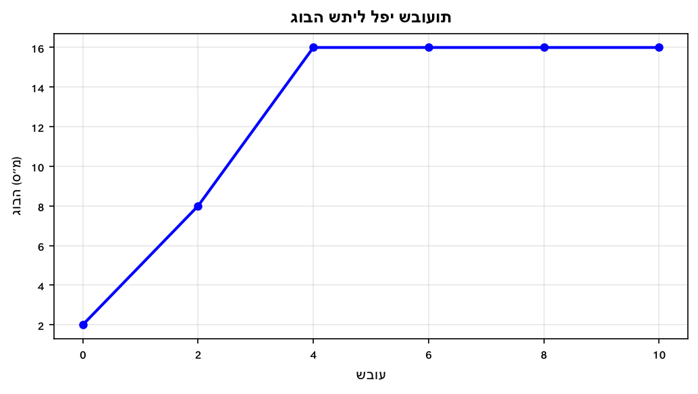

א. בין אילו שבועות הגרף עולה?

ב. בין אילו שבועות הגרף קבוע?

ג. האם הגרף יורד בכלל? מדוע?

ד. מהו גובה השתיל בשבוע 3? (עלייה קווית)

---

**7.** גרף מתאר הכנסות (₪ אלפים) של עסק לפי חודשים.

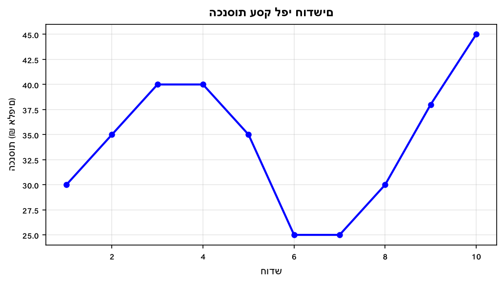

א. בין אילו חודשים ההכנסות עולות?

ב. בין אילו חודשים ההכנסות קבועות?

ג. בין אילו חודשים ההכנסות יורדות?

---

**8.** גרף מתאר כמות בני אדם (אלפים) בקניון לפי שעות.

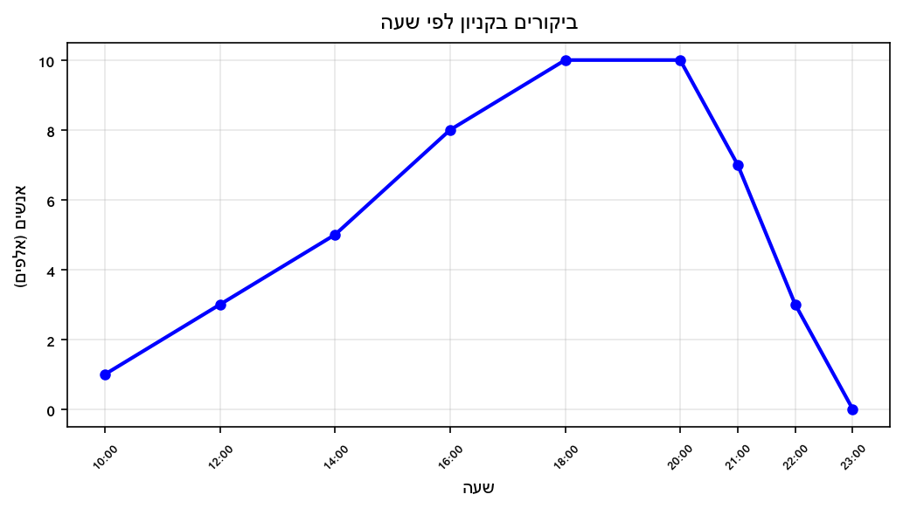

א. בין אילו שעות מספר הביקורים עולה?

ב. בין אילו שעות הוא קבוע?

ג. בין אילו שעות הוא יורד?

ד. מהו מספר הביקורים בשעה 19:00? (קווי בין נקודות)

---

## רמה 2: תרגול שוטף ומשולב (8 תרגילים)

**9.** גרף מתאר רווחים והפסדים (₪ אלפים) של חברה לאורך שנה.
ערכים חיוביים = רווח. ערכים שליליים = הפסד.

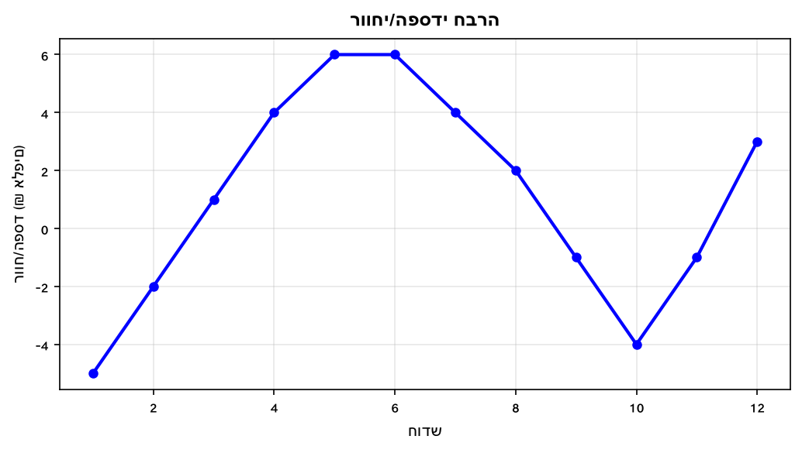

א. בין אילו חודשים הגרף עולה?

ב. בין אילו חודשים הגרף קבוע?

ג. בין אילו חודשים הגרף יורד?

ד. באיזה חודש עוברת החברה מהפסד לרווח?

---

**10.** גרף מתאר מרחק (ק"מ) של רכב מנקודת מוצא לפי שעות.

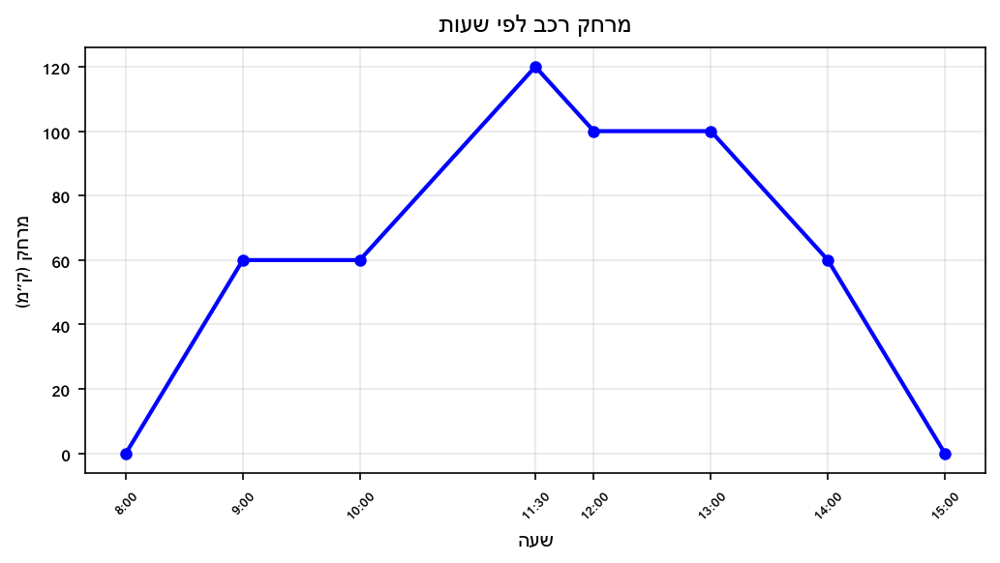

א. בין אילו שעות הרכב מתרחק מנקודת המוצא?

ב. בין אילו שעות הרכב עצר?

ג. בין אילו שעות הרכב חזר לכיוון נקודת המוצא?

ד. מה המרחק מנקודת המוצא בשעה 10:45? (קווי בין נקודות)

---

**11.** גרף מתאר כמות מלאי (יחידות) בסניף לפי ימות השבוע.

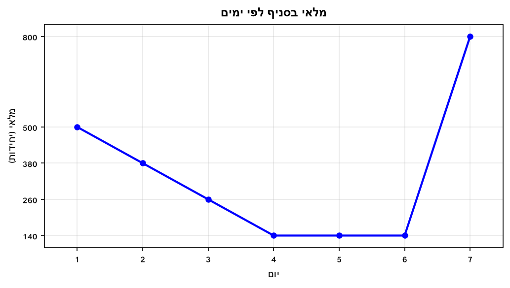

א. בין אילו ימים המלאי יורד?

ב. בין אילו ימים המלאי קבוע?

ג. בין אילו ימים המלאי עולה?

ד. מה כמות המלאי ביום 2.5 (אמצע יום 2 ל-3)? (ירידה קווית)

---

**12.** גרף מתאר לחץ דם (מ"מ כספית) של מטופל לאורך שעות.

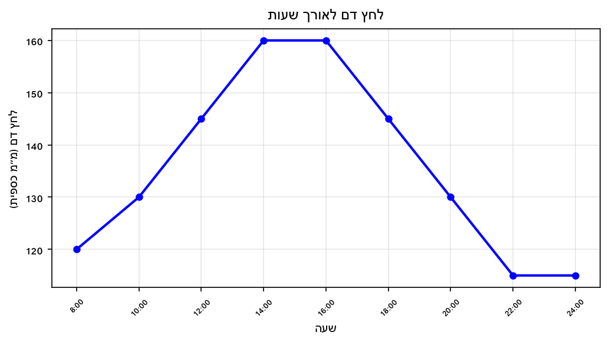

א. בין אילו שעות לחץ הדם עולה?

ב. בין אילו שעות לחץ הדם קבוע?

ג. בין אילו שעות לחץ הדם יורד?

ד. מה לחץ הדם בשעה 19:00? (קווי בין נקודות)

---

**13.** גרף מתאר כמות עוברי אורח (מאות) ברחוב מסחרי לפי שעות יום שישי.

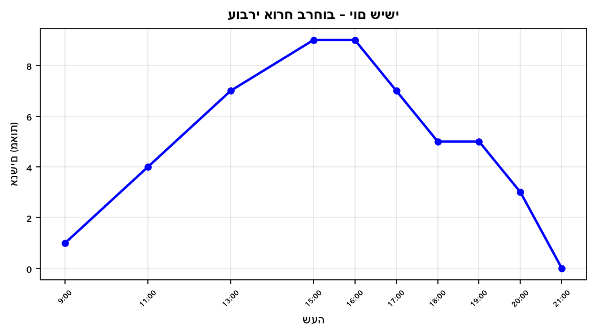

א. בין אילו שעות מספר עוברי האורח עולה?

ב. בין אילו שעות הוא קבוע?

ג. מהו מספר עוברי האורח בשעה 14:00? (קווי)

ד. בין אילו שעות הוא יורד?

---

**14.** גרף מתאר צריכת חשמל (קוט"ש) של דירה לאורך חודש.

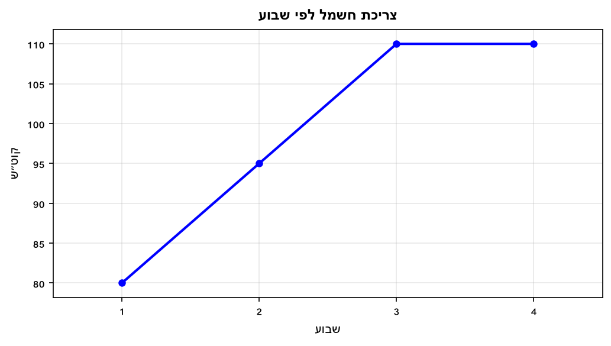

א. בין אילו שבועות הצריכה עולה?

ב. בין אילו שבועות היא קבועה?

ג. כמה קוט"ש נוספו בשבוע ה-1.5 לעומת שבוע 1? (קווי בין שבוע 1 לשבוע 2)

---

**15.** גרף מתאר גובה ים (ס"מ מעל קו הבסיס) לאורך 12 שעות.

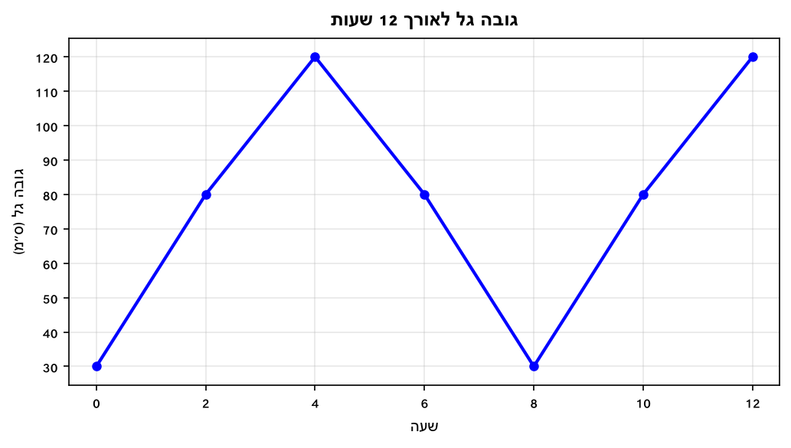

א. בין אילו שעות הגל עולה (מגמת עלייה)?

ב. בין אילו שעות הגל יורד?

ג. האם יש פרק זמן שבו הגל קבוע? אם כן, מתי?

ד. מהו גובה הגל בשעה 3? (קווי)

---

**16.** גרף מתאר כמות עצים ביער (אלפים) לפי שנים (כריתה ונטיעה לסירוגין).

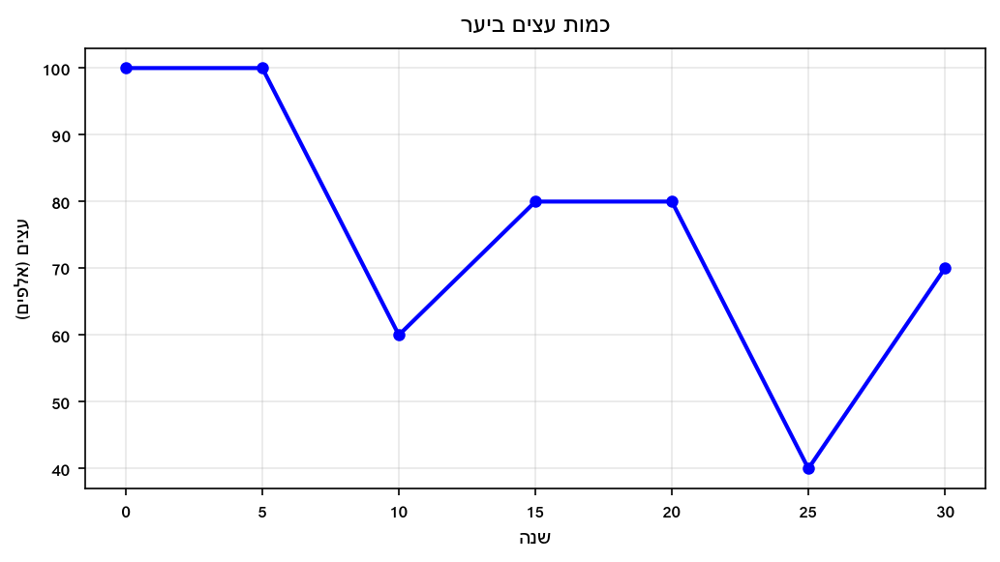

א. בין אילו שנים מספר העצים קבוע?

ב. בין אילו שנים הוא יורד?

ג. בין אילו שנים הוא עולה?

ד. מה כמות העצים בשנה 7? (קווי)

---

## רמה 3: רמת בחינת מה"ט (4 תרגילים)

**17.** הגרף הבא מתאר את כמות המים (ליטרים) בבריכה לפי הזמן (דקות).
שני ברזים פתוחים בו-זמנית: ברז ממלא וברז מרוקן.

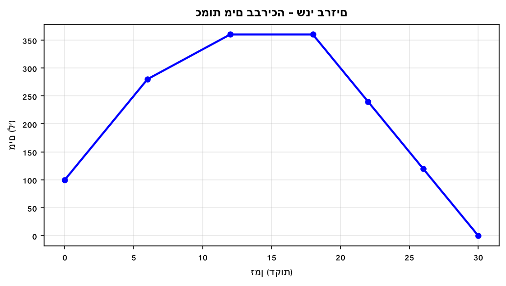

א. בין אילו דקות כמות המים עולה?

ב. בין אילו דקות כמות המים קבועה, ומה ניתן להסיק על הברזים בפרק זמן זה?

ג. מהי כמות המים בדקה 9? (עלייה קווית בין נקודות)

ד. בין אילו דקות כמות המים יורדת, ומה ניתן להסיק על הברזים בפרק זמן זה?

---

**18.** הגרף הבא מתאר את מאזן הכנסות (₪) של חברה לאורך שנה.

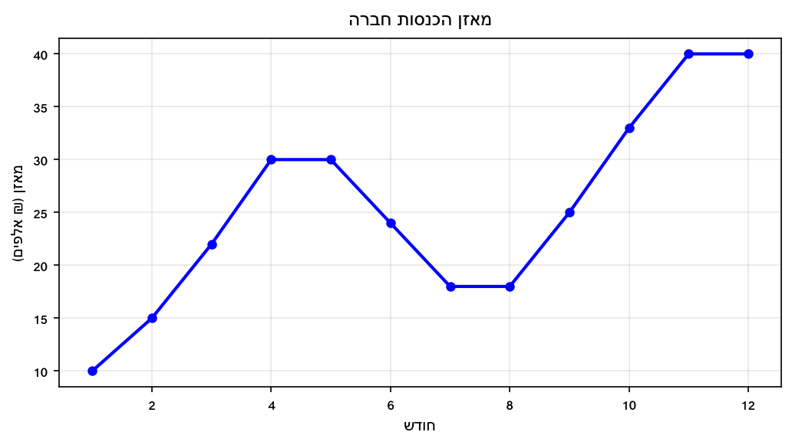

א. בין אילו חודשים המאזן עולה?

ב. בין אילו חודשים המאזן קבוע?

ג. בין אילו חודשים המאזן יורד?

ד. מהו המאזן בחודש 6.5? (ירידה קווית בין חודש 6 לחודש 7)

---

**19.** גרף מתאר מרחק (ק"מ) של משאית ממרכז הפצה לפי שעות (יציאה בשעה 8:00).

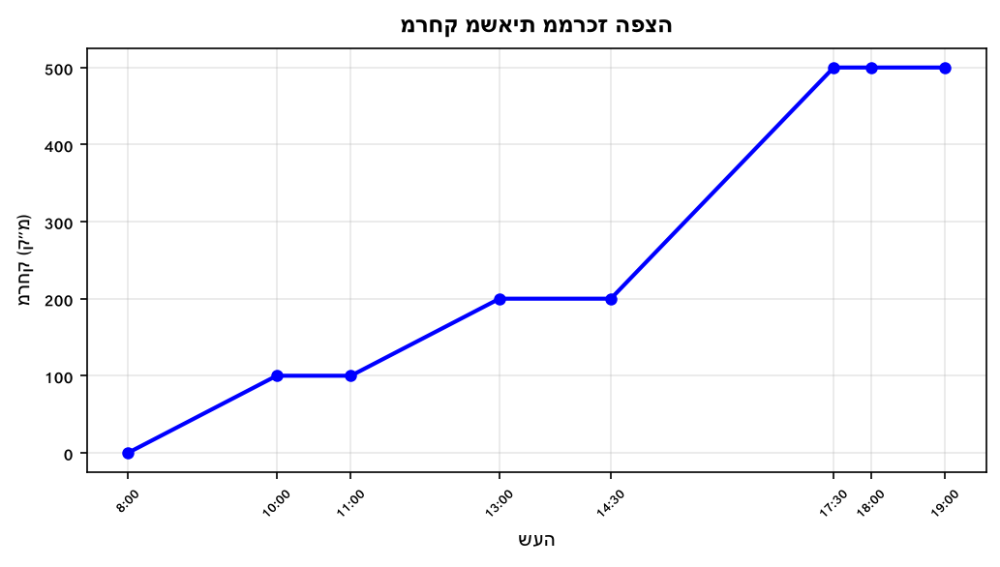

א. בין אילו שעות המשאית נעה?

ב. בין אילו שעות המשאית עוצרת?

ג. מה המרחק ממרכז ההפצה בשעה 12:00? (עלייה קווית בין 11:00 לשעה 13:00)

ד. מה המגמה החל מהשעה 17:30 ועד 19:00, ומה פירושה?

---

**20.** גרף מתאר את הטמפרטורה (°C) בעיר לאורך 24 שעות.

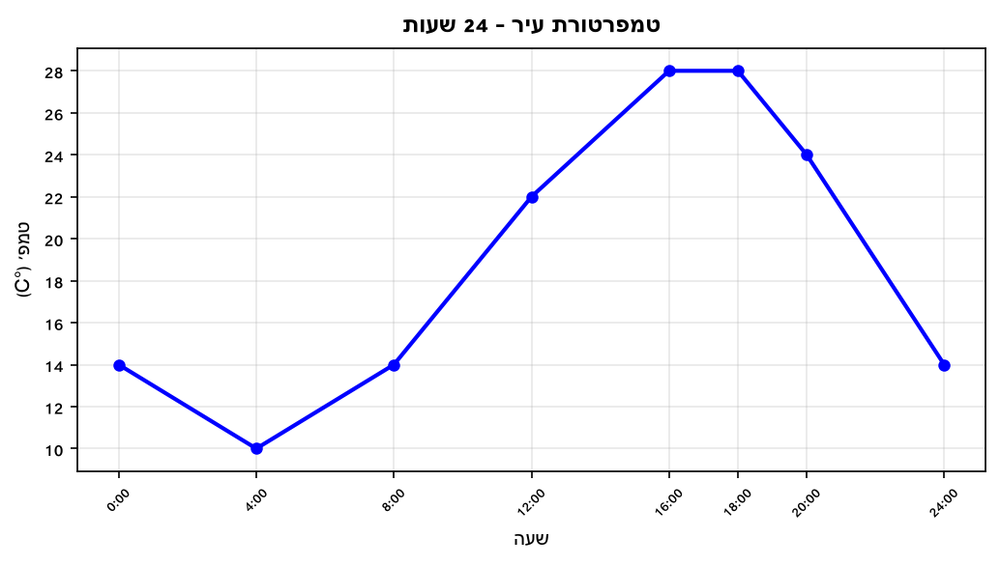

א. בין אילו שעות הטמפרטורה יורדת?

ב. בין אילו שעות הטמפרטורה קבועה?

ג. מהי הטמפרטורה בשעה 14:00? (עלייה קווית בין 12:00 ל-16:00)

ד. מהי הטמפרטורה המינימלית ומתי הייתה?

---

תשובות סופיות

1.
א. עולה: 0–20 ו-70–80.
ב. יורד: 30–60.
ג. קבוע: 20–30 ו-60–70.
ד.
$400$
ליטרים.

2.
א. עולה: 0–10.
ב. קבועה: 10–20 ו-35–40.
ג. יורדת: 20–35.
ד.
$76$
°C.

3.
א. עולה: 6:00–12:00.
ב. קבועה: 12:00–14:00.
ג. יורדת: 14:00–22:00.
ד.
$23$
°C.

4.
א. עולה: ימים 1–3 ו-7–9.
ב. קבוע: ימים 3–5 ו-9–11.
ג. יורד: ימים 5–7 ו-11–13.

5.
א. יורד (שיפור ביצועים): סיבובים 1–5.
ב. קבוע: סיבובים 5–6 (57 שניות).
ג. עולה (ירידה בביצועים): סיבובים 6–8.

6.
א. עולה: שבועות 0–4.
ב. קבוע: שבועות 4–10.
ג. לא — הגרף אינו יורד בשום שלב.
ד.
$12$
ס"מ.

7.
א. עולה: חודשים 1–3 ו-7–10.
ב. קבוע: חודשים 3–4 ו-6–7.
ג. יורד: חודשים 4–6.

8.
א. עולה: 10:00–18:00.
ב. קבוע: 18:00–20:00.
ג. יורד: 20:00–23:00.
ד. בשעה 19:00 — עדיין בפלאטו: 10 אלף.

9.
א. עולה: חודשים 1–5 ו-10–12.
ב. קבוע: חודשים 5–6.
ג. יורד: חודשים 6–10.
ד. בחודש 3 — הגרף עובר מ-
$-2$
ל-
$+1$
; המעבר מהפסד לרווח (חציית האפס) מתרחש בין חודש 2 לחודש 3 (בסביבות שני שלישי הדרך, בחודש ≈ 2.67).

10.
א. מתרחק: 8:00–9:00 ו-10:00–11:30.
ב. עצר: 9:00–10:00 ו-12:00–13:00.
ג. חזר: 11:30–12:00, 13:00–15:00.
ד.
$90$
ק"מ.

11.
א. יורד: ימים 1–4.
ב. קבוע: ימים 4–6.
ג. עולה: ימים 6–7.
ד.
$320$
יחידות.

12.
א. עולה: 8:00–14:00.
ב. קבוע: 14:00–16:00 ו-22:00–0:00.
ג. יורד: 16:00–22:00.
ד.
$137.5$
מ"מ.

13.
א. עולה: 9:00–15:00.
ב. קבוע: 15:00–16:00 ו-18:00–19:00.
ג. 800 איש.
ד. יורד: 16:00–18:00 ו-19:00–21:00.

14.
א. עולה: שבועות 1–3.
ב. קבועה: שבועות 3–4.
ג.
$7.5$
קוט"ש.

15.
א. עולה: 0–4 ו-8–12.
ב. יורד: 4–8.
ג. אין פרק זמן קבוע בגרף זה.
ד.
$100$
ס"מ.

16.
א. קבוע: שנים 0–5 ו-15–20.
ב. יורד: שנים 5–10 ו-20–25.
ג. עולה: שנים 10–15 ו-25–30.
ד.
$84$
אלף עצים.

17.
א. עולה: דקות 0–12.
ב. קבועה: דקות 12–18 — קצב הממלא שווה לקצב המרוקן.
ג.
$320$
ליטרים.
ד. יורדת: דקות 18–30 — קצב הריקון גדול מקצב המילוי.

18.
א. עולה: חודשים 1–4 ו-8–11.
ב. קבוע: חודשים 4–5, 7–8 ו-11–12.
ג. יורד: חודשים 5–7.
ד.
$21$
אלפי ₪.

19.
א. נעה: 8:00–10:00, 11:00–13:00, 14:30–17:30.
ב. עוצרת: 10:00–11:00, 13:00–14:30, 17:30–19:00.
ג.
$150$
ק"מ.
ד. מגמה קבועה (מרחק = 500 ק"מ) — המשאית עצרה לאחר הגעה ליעד.

20.
א. יורדת: 0:00–4:00 ו-18:00–24:00.
ב. קבועה: 16:00–18:00.
ג.
$25$
°C.
ד.
$10$
°C בשעה 4:00.

