# תת-נושא 4: חישוב הפרשים בין נקודות

---

## רמה 1: בניית ביטחון (8 תרגילים)

**1.** גרף מתאר את כמות המים בבריכה לאורך הזמן.

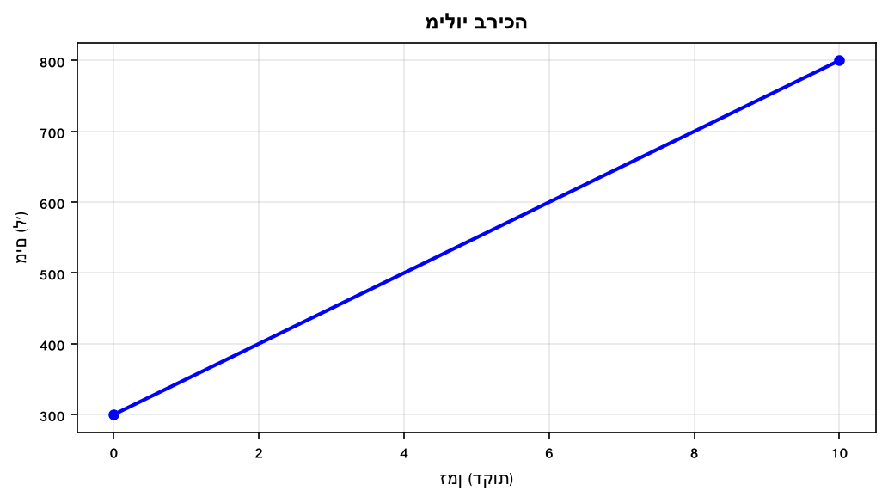

כמה ליטרים נוספו לבריכה בין דקה 0 לדקה 10?

---

**2.** גרף מתאר את טמפרטורת האוויר לאורך היום.

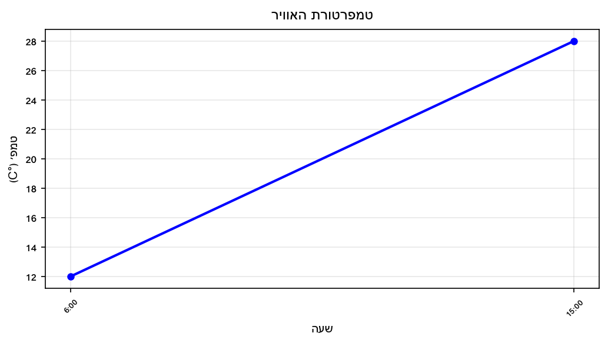

בכמה מעלות עלתה הטמפרטורה מהשעה 6:00 ועד השעה 15:00?

---

**3.** גרף מתאר את גובה ילדה (ס"מ) לפי גילה.

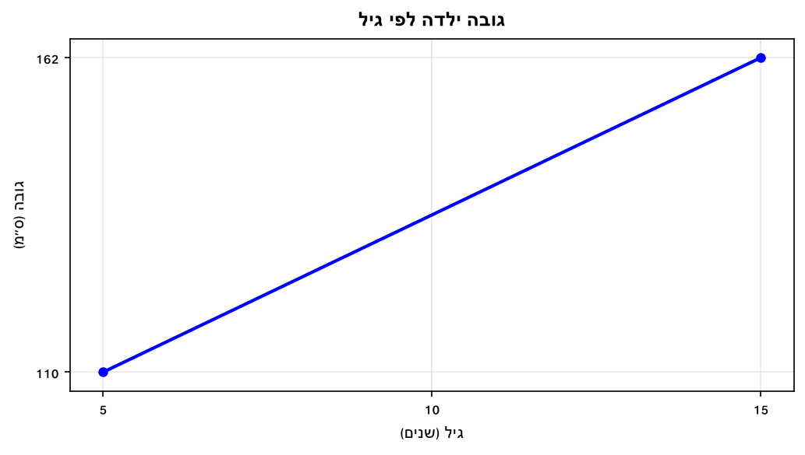

בכמה ס"מ גדלה הילדה מגיל 5 עד גיל 15?

---

**4.** גרף מתאר הכנסות חנות (₪) לפי חודשים.

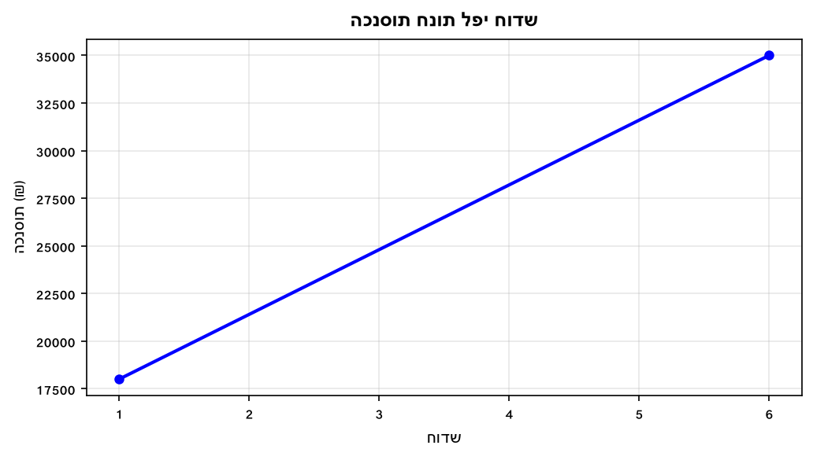

מה גדלו ההכנסות מחודש 1 לחודש 6 (בשקלים)?

---

**5.** גרף מתאר מחיר מניה (₪) לפי ימי מסחר.

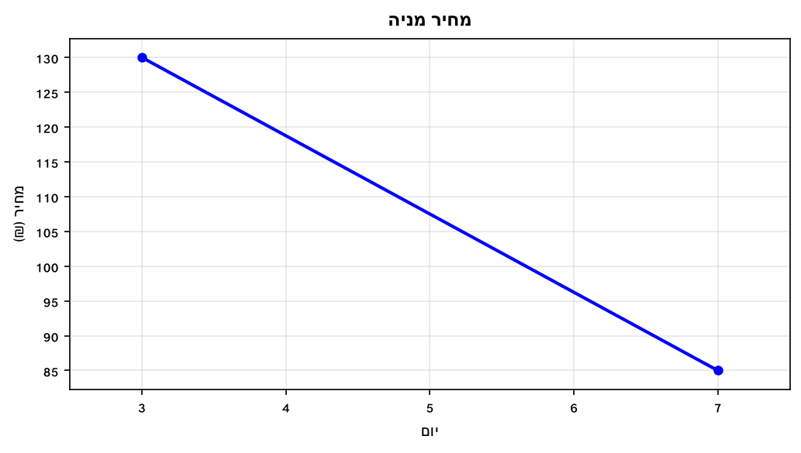

מה השתנה מחיר המניה מיום 3 עד יום 7 (ציינו + לעלייה ו- לירידה)?

---

**6.** גרף מתאר כמות דלק (ליטרים) בבריכת הדלק של רכב לפי מרחק הנסיעה.

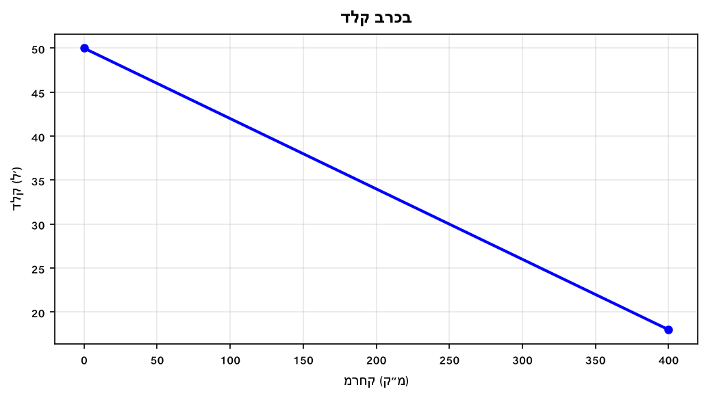

כמה ליטרים דלק נצרכו בנסיעה של 400 ק"מ?

---

**7.** גרף מתאר גובה שתיל (ס"מ) לפי שבועות.

מה סך הגידול של השתיל (בס"מ) מתחילת המדידה ועד שבוע 8?

---

**8.** גרף מתאר מרחק (ק"מ) שעבר אדם רגלי לפי זמן.

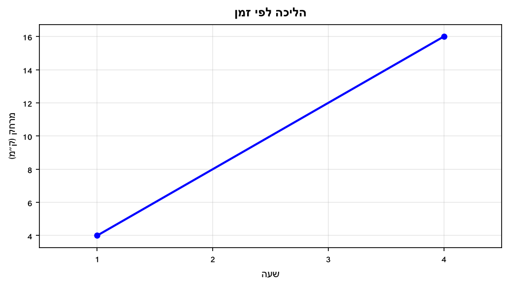

כמה ק"מ הלך האדם בין השעה הראשונה לשעה הרביעית?

---

## רמה 2: תרגול שוטף ומשולב (8 תרגילים)

**9.** גרף מתאר כמות מים (ליטרים) בבריכה לאורך זמן.

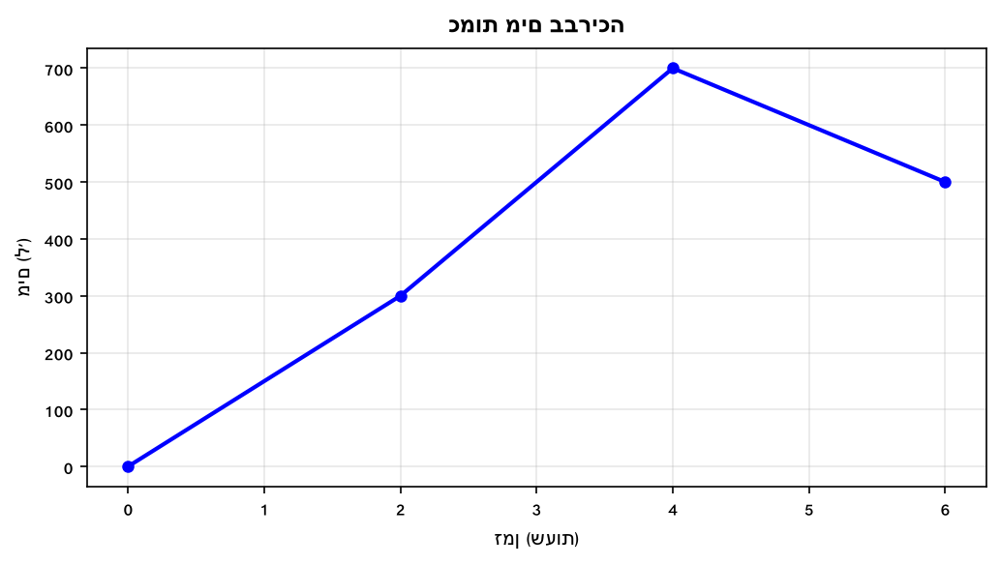

א. כמה ליטרים נוספו בין שעה 0 לשעה 2?

ב. כמה ליטרים נוספו בין שעה 2 לשעה 4?

ג. כמה ליטרים ירדו בין שעה 4 לשעה 6?

ד. מה השינוי הכולל בכמות המים בין שעה 0 לשעה 6?

---

**10.** גרף מתאר מאזן הכנסות–הוצאות (₪ אלפים) של חברה.

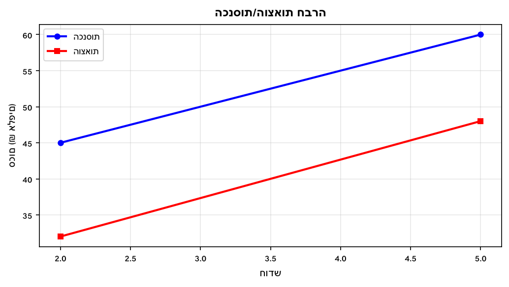

א. מה הרווח (הכנסות פחות הוצאות) בפברואר?

ב. מה הרווח בחודש מאי?

ג. בכמה גדל הרווח בין פברואר למאי?

---

**11.** גרף מתאר מרחק (ק"מ) של רכב מנקודת מוצא לפי שעות.

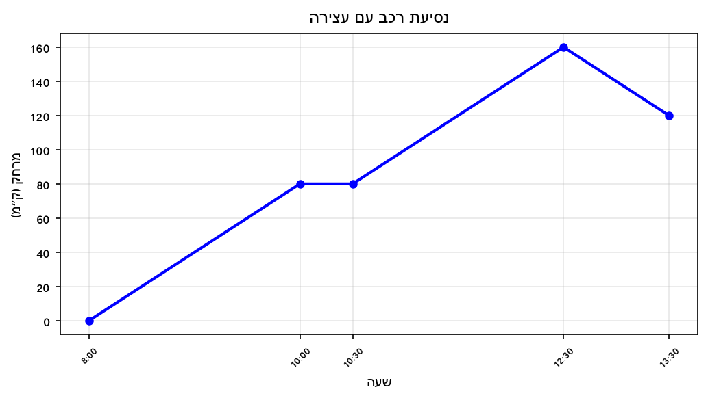

א. כמה ק"מ נסע הרכב בין 8:00 ל-10:00?

ב. כמה ק"מ נסע הרכב בין 10:30 ל-12:30?

ג. כמה ק"מ חזר הרכב לאחור בין 12:30 ל-13:30?

ד. מה ה"מרחק נטו" (ביחס לנקודת המוצא) בשעה 13:30?

---

**12.** גרף מתאר מחיר מניה (₪) לאורך שבוע (5 ימי מסחר).

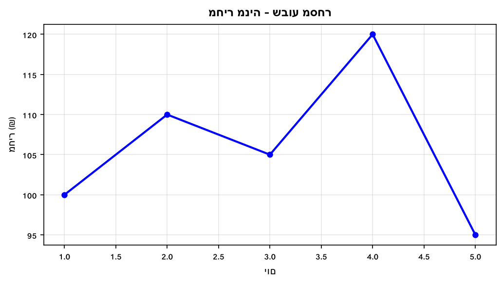

א. מה השינוי במחיר מיום 1 ליום 2?

ב. מה השינוי במחיר מיום 2 ליום 3?

ג. מה השינוי הכולל מיום 1 ליום 5?

ד. מהי הירידה הגדולה ביותר שהייתה ביום אחד?

---

**13.** גרף מתאר עלייה וירידה של מטוס לפי זמן (דקות).

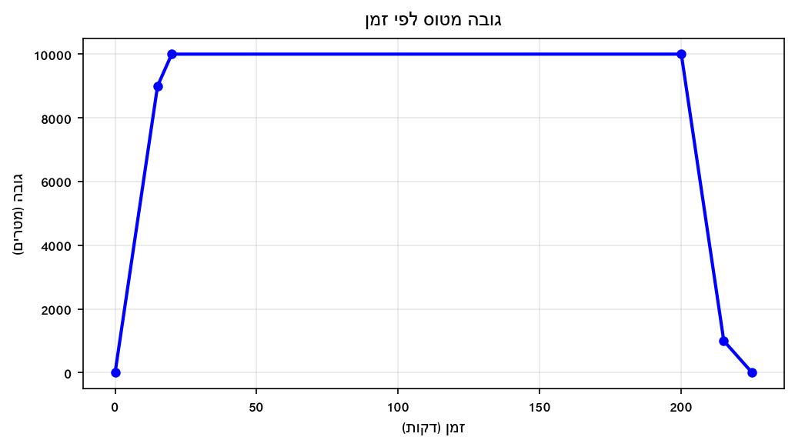

א. כמה מטרים עלה המטוס בין דקה 0 לדקה 15?

ב. כמה מטרים נוספים עלה בין דקה 15 לדקה 20?

ג. כמה מטרים ירד בין דקה 200 לדקה 215?

ד. כמה מטרים ירד בין דקה 215 לדקה 225?

---

**14.** גרף מתאר כמות עוברי אורח (מאות) ברחוב לפי שעות.

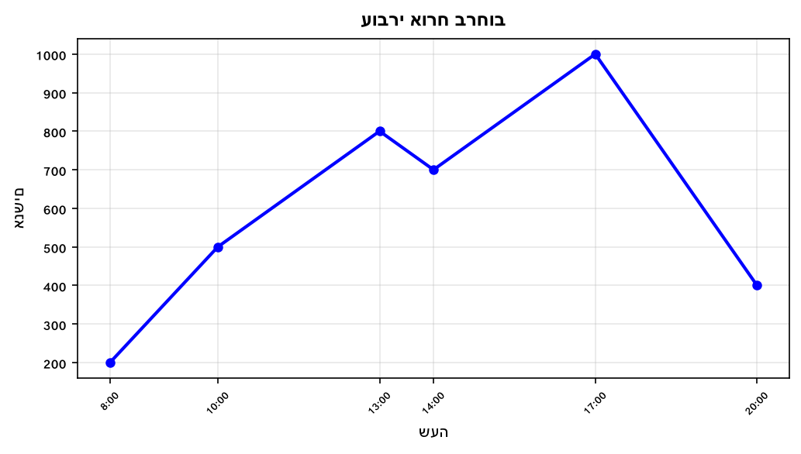

א. מה גדל מספר האנשים בין 8:00 ל-13:00 (בבני אדם ממש)?

ב. בין אילו שעות הייתה הירידה המהירה ביותר?

ג. מה ה"טווח" (ההפרש בין מקסימום למינימום) של מספר עוברי האורח?

---

**15.** גרף מתאר תשלום חשמל (₪) לפי חודשים.

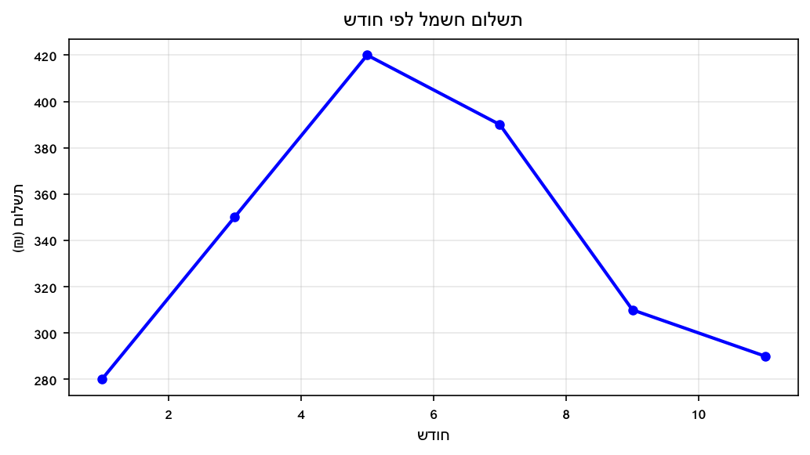

א. מה השינוי בתשלום מחודש 1 לחודש 5?

ב. מה השינוי מחודש 5 לחודש 11?

ג. מה ההפרש בין התשלום הגבוה ביותר לנמוך ביותר לאורך כל התקופה?

---

**16.** גרף מתאר מסלול ריצה של שני ספורטאים, A ו-B.
בדקה ה-60 שניהם נמצאים בנקודות הבאות:

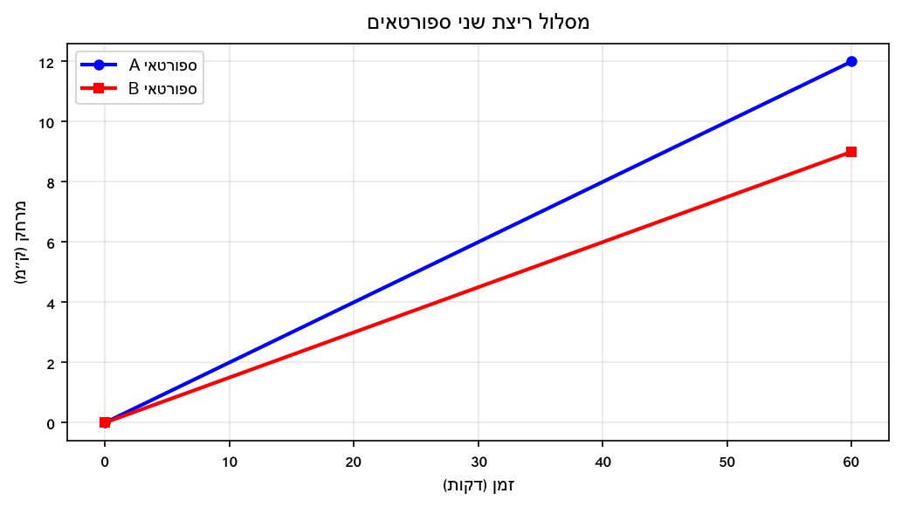

א. כמה ק"מ רץ ספורטאי A בשעה?

ב. כמה ק"מ רץ ספורטאי B בשעה?

ג. מה ההפרש במרחק ביניהם לאחר 60 דקות?

---

## רמה 3: רמת בחינת מה"ט (4 תרגילים)

**17.** הגרף הבא מתאר את מאזן הכנסות-הוצאות (₪ אלפים) של חברת הייטק מאוקטובר 2008 עד מאי 2009.
שימו לב: בכל חודש ההכנסות גבוהות מההוצאות.
(מבוסס על שאלה 6, אביב מועד ב' 2024)

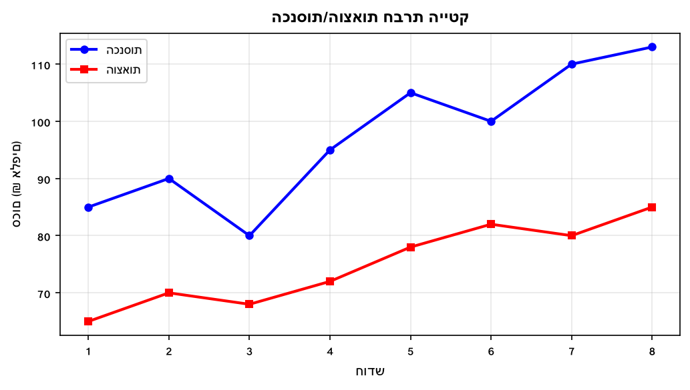

א. מה היו הכנסות החברה בחודש פברואר?

ב. באיזה חודש הפער בין ההכנסות להוצאות היה הגדול ביותר? מה היה הפרש זה?

ג. מה היו הוצאות החברה בחודש מאי?

ד. מה ההפרש בין הפרש ההכנסות-הוצאות של חודש אפריל לחודש דצמבר?

---

**18.** הגרף הבא מתאר את גובה (ס"מ) של מיכל לפי גילה.
(מבוסס על שאלה 1, קיץ מועד א' 2023)

א. מה היה גובה מיכל בלידתה?

ב. בכמה ס"מ גדלה מיכל בעשור הראשון לחייה (מגיל 0 עד 10)?

ג. בכמה ס"מ גדלה מיכל בעשור השני (מגיל 10 עד 20)?

ד. בכמה ס"מ גדלה מיכל כל שנה בממוצע בעשור הראשון?

---

**19.** הגרף הבא מתאר את ספירת הלקוחות בחנות לאורך היום.

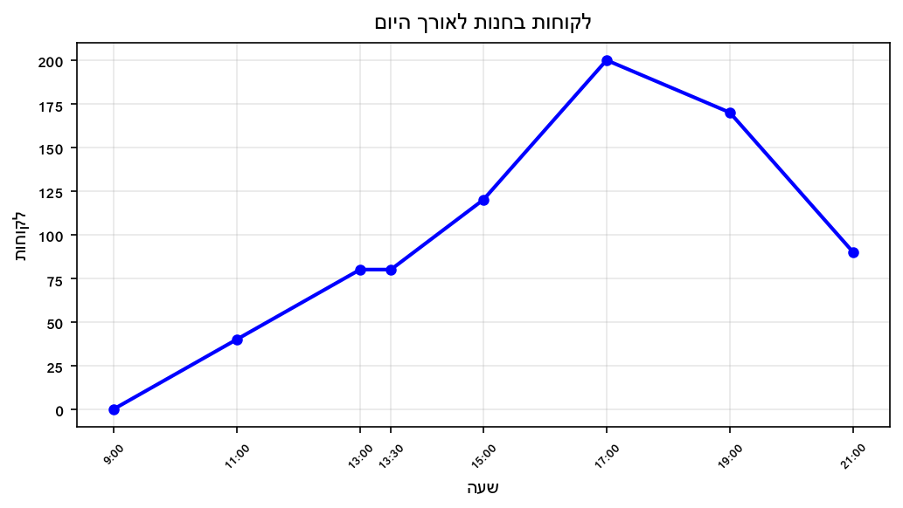

א. כמה לקוחות הגיעו לחנות בין 9:00 ל-13:00?

ב. בין אילו שעות הגיע מספר הלקוחות המצטבר לשיאו?

ג. מה ההפרש בין מספר הלקוחות בשיא (17:00) לבין מספרם בסגירה (21:00)?

ד. בין אילו שעות גדל מספר הלקוחות המצטבר בקצב הגבוה ביותר (עלייה מהירה)?

---

**20.** הגרף הבא מתאר חשבון שנתי (₪) של משפחה בחברת כבלים לאורך 12 חודשים.
(מבוסס על שאלה 11, קיץ מועד ב' 2025)

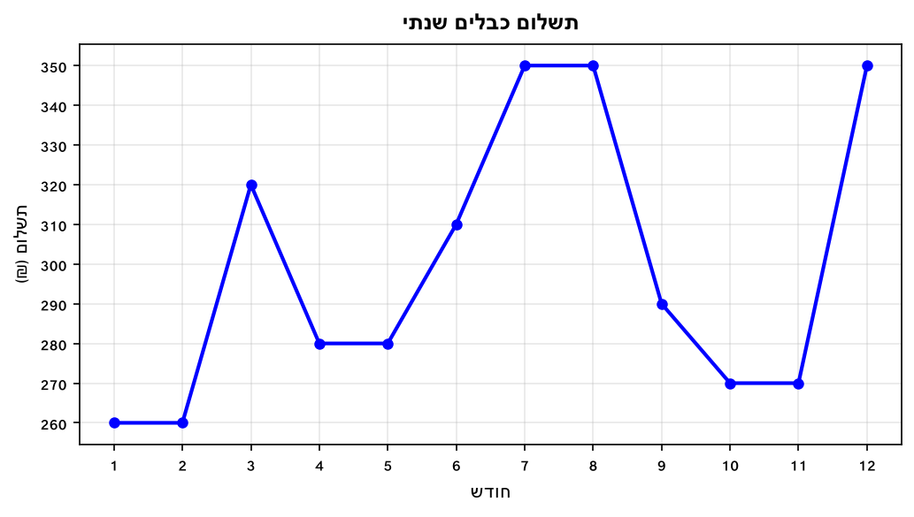

א. באיזה חודש או חודשים התשלום היה הגבוה ביותר?

ב. בין אילו חודשים סמוכים היה ההפרש הגדול ביותר בתשלום, ומה היה ההפרש?

ג. מה סך התשלום השנתי הכולל?

ד. חברה מתחרה מציעה 850 ₪ לרבעון (כל 3 חודשים). האם כדאי לעבור? הסבירו.

---

תשובות סופיות

1.
$800-300=500$
ליטרים.

2.
הפרש טמפרטורות מתוך הגרף:
$28-12=16$
מעלות צלסיוס.

3.
הפרש גובה לפי הגרף:
$162-110=52$
סנטימטרים.

4.
הפרש ההכנסות בשקלים:
$35{ }000-18{ }000=17{ }000$

5.
מתוך הגרף: מ-
$130$
ל-
$-45$
כלומר השינוי
$-175$
שקלים (ירידה).

6.
מתוך נקודות הגרף:
$50-18=32$
ליטרים נצרכו.

7.
גידול בגובה השתיל בין שבוע
$0$
לשבוע
$8$
:
$30-3=27$
סנטימטרים.

8.
לפי הגרף: בשעה
$1$
המרחק הוא
$4$
קילומטרים, ובשעה
$4$
הוא
$16$
קילומטרים.
ההפרש:
$16-4=12$
קילומטרים.

9.
א.
$300$
ליטרים.
ב.
$400$
ליטרים.
ג.
$200$
ליטרים.
ד.
$500$
ליטרים (עלייה נטו).

10.
א.
$13$
אלפי ₪.
ב.
$12$
אלפי ₪.
ג.
$-1$
אלפי ₪ (הרווח קטן ב-1,000 ₪).

11.
א.
$80$
ק"מ.
ב.
$80$
ק"מ.
ג.
$40$
ק"מ.
ד. 120 ק"מ מנקודת המוצא.

12.
א.
$+10$
₪.
ב.
$-5$
₪.
ג.
$-5$
₪ (ירידה של 5 ₪).
ד. מיום 4 ליום 5:
$-25$
₪.

13.
א.
$9{ }000$
מטרים.
ב.
$1{ }000$
מטרים.
ג.
$9{ }000$
מטרים.
ד.
$1{ }000$
מטרים.

14.
א.
$600$
איש (מ-200 ל-800).
ב. ירידה מהירה של 600 איש ב-3 שעות.
ג. 800 איש.

15.
א.
$+140$
₪ (עלייה).
ב.
$-130$
₪ (ירידה).
ג. 280 ₪ (הפרש בין הגבוה ביותר לנמוך ביותר).

16.
א.
$12$
ק"מ.
ב.
$9$
ק"מ.
ג.
$3$
ק"מ.

17.
א. 105 אלפי ₪ =
$105{ }000$
₪.
ב. הפער הגדול ביותר: 30 אלפי ₪.
ג.
$85{ }000$
₪.
ד.
$18$
אלפי ₪.

18.
א. 50 ס"מ.
ב.
$98$
ס"מ.
ג.
$20$
ס"מ.
ד.
$9.8$
ס"מ לשנה בממוצע.

19.
א.
$80$
לקוחות.
ב. בשעה 17:00.
ג.
$110$
לקוחות.
ד. בקצב של 40 לקוחות לשעה — גבוה מכל קטע אחר.

20.
א. חודשים 7, 8, 12 — 350 ₪ כל אחד.
ב. ההפרש הגדול ביותר הוא 60 ₪ (חודש 2–3).
ג.
$3{ }590$
₪.
ד. חברה מתחרה: 4 רבעונים × 850 = 3,400 ₪. כן, כדאי לעבור — חוסכים 190 ₪ לשנה.

