# תת-נושא 5: חישוב ממוצעים על סמך נתונים גרפיים

---

## רמה 1: בניית ביטחון (8 תרגילים)

**1.** גרף מתאר את הטמפרטורה (°C) באתר נופש לאורך 5 ימים.

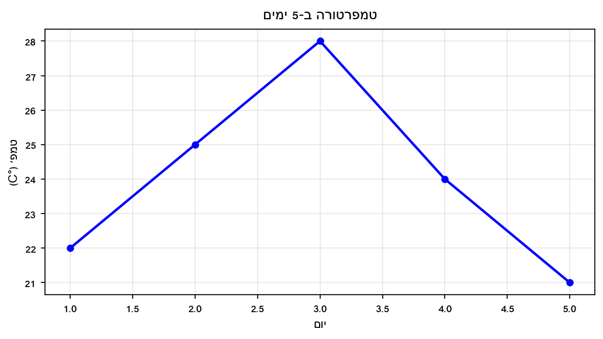

מהי הטמפרטורה הממוצעת לאורך 5 הימים?

---

**2.** גרף מתאר את הכנסות חנות (₪ אלפים) לאורך 6 חודשים.

מהי ההכנסה החודשית הממוצעת (בשקלים ממש)?

---

**3.** גרף מתאר את צריכת המים (ליטרים) של בית לפי ימים.

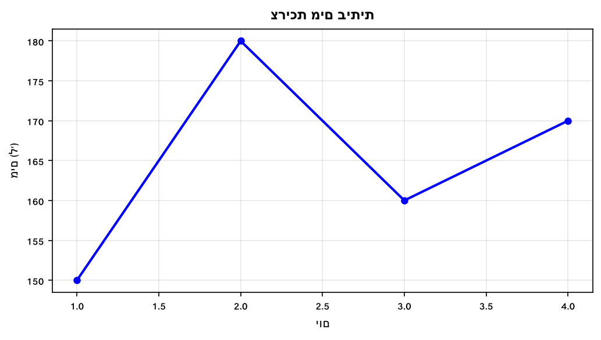

מהי צריכת המים הממוצעת ליום?

---

**4.** גרף מתאר את מחיר מניה (₪) לאורך 5 ימי מסחר.

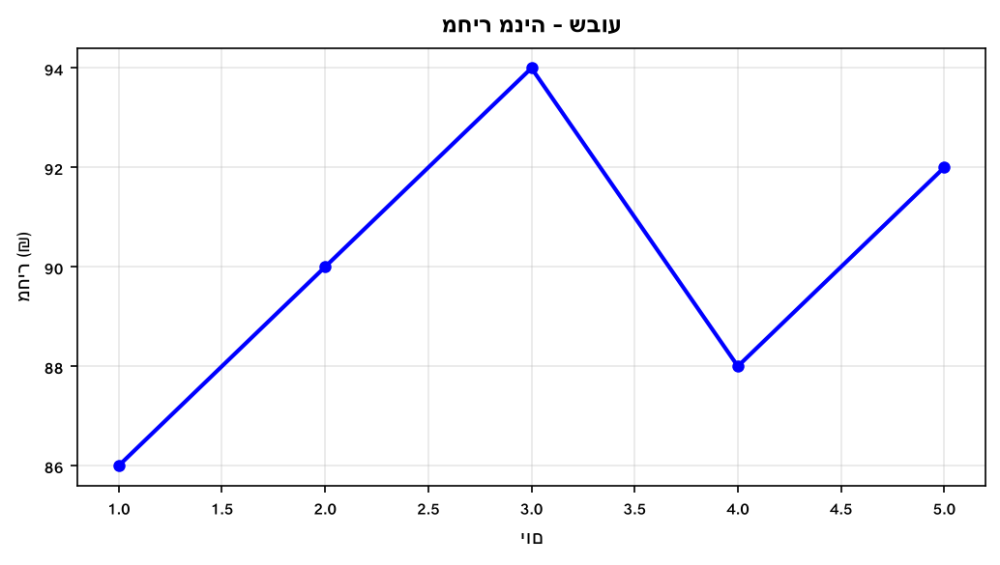

מהו מחיר המניה הממוצע לאורך שבוע המסחר?

---

**5.** גרף מתאר ציוני מבחנים של תלמיד לאורך 4 מבחנים.

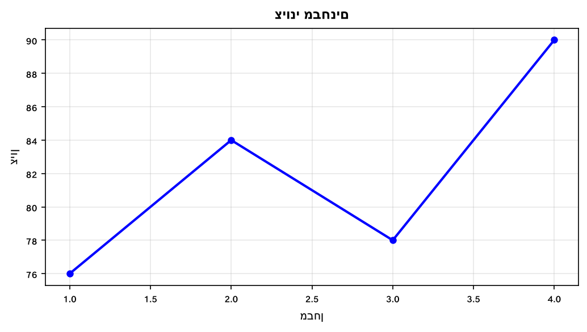

מהו הציון הממוצע של התלמיד?

---

**6.** גרף מתאר את חשבון החשמל (₪) של דירה לאורך 4 חודשים.

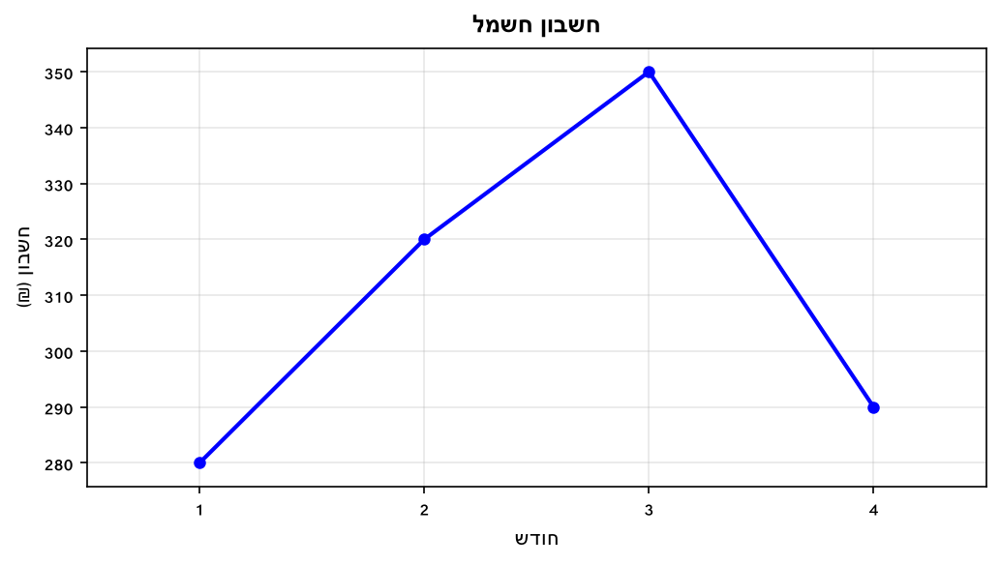

מהו חשבון החשמל הממוצע לחודש?

---

**7.** גרף מתאר את גובה (ס"מ) 5 תלמידים בכיתה.

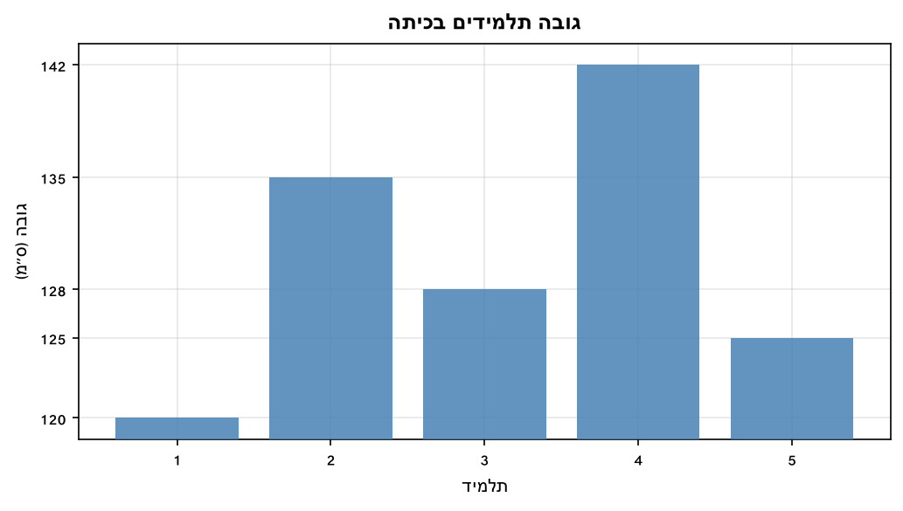

מהו הגובה הממוצע של תלמידי הכיתה?

---

**8.** גרף מתאר את מספר הלקוחות בחנות לאורך 5 ימים.

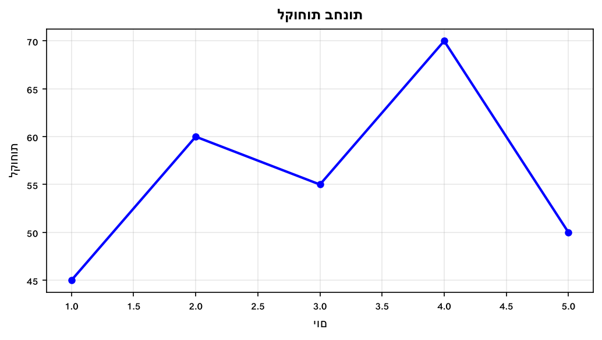

מהו מספר הלקוחות הממוצע ליום?

---

## רמה 2: תרגול שוטף ומשולב (8 תרגילים)

**9.** גרף מתאר הכנסות חנות (₪ אלפים) ב-6 חודשים.

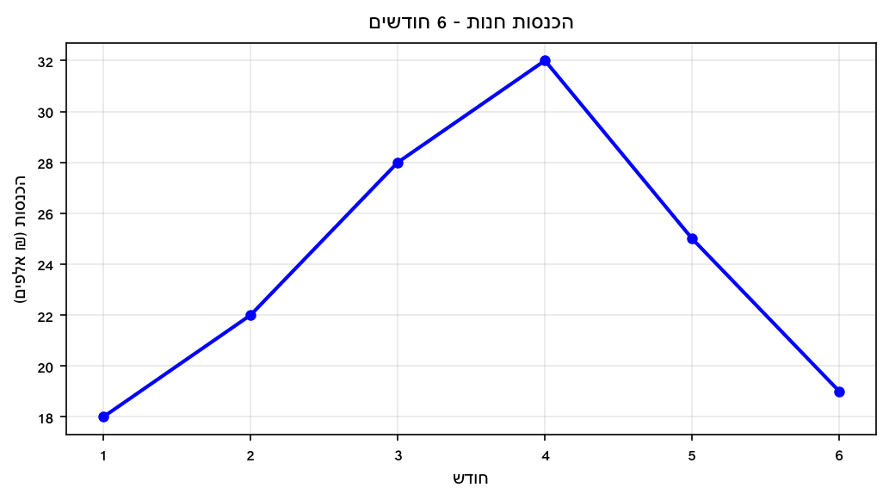

א. מהי ההכנסה הממוצעת ברבעון הראשון (חודשים 1–3)?

ב. מהי ההכנסה הממוצעת ברבעון השני (חודשים 4–6)?

ג. באיזה רבעון ההכנסה הממוצעת גבוהה יותר, ובכמה?

---

**10.** גרף מתאר גובה (ס"מ) של תלמידים בשתי קבוצות.

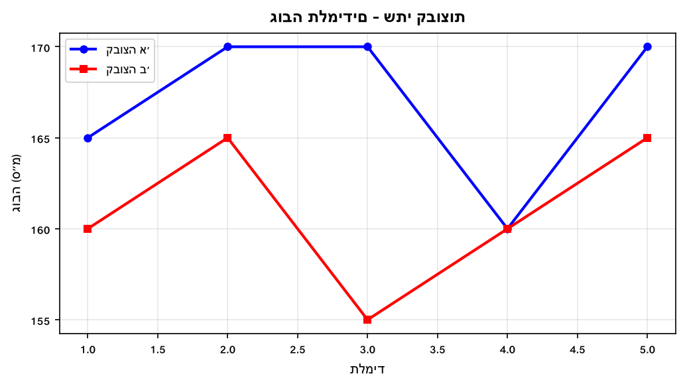

א. מהו הגובה הממוצע בקבוצה א'?

ב. מהו הגובה הממוצע בקבוצה ב'?

ג. מה ההפרש בין ממוצעי הקבוצות?

---

**11.** ציוני מבחן של תלמיד: 70, 75, 80 ו-x.

הממוצע הרצוי הוא 80.

א. מהי סכום כל הציונים הדרוש?

ב. מה ערך x?

---

**12.** גרף מתאר טמפרטורות חורפיות (°C) ב-8 ימים.

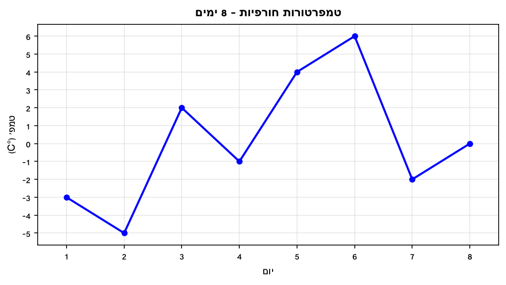

מהי הטמפרטורה הממוצעת ב-8 הימים?

---

**13.** חנות רכשה מוצרים בשלושה מחירים שונים.

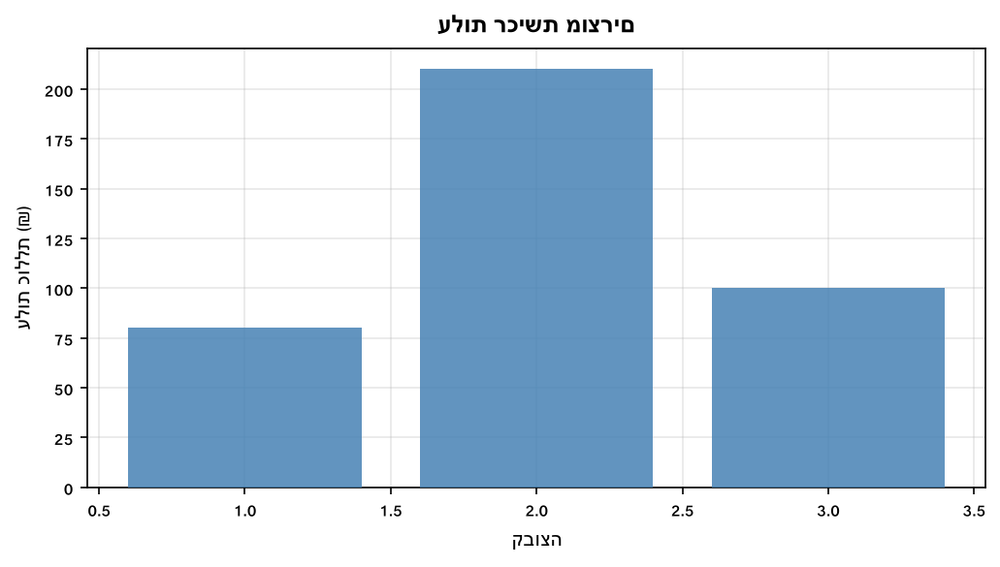

א. מהי עלות הרכישה הכוללת?

ב. מהו המחיר הממוצע לכל יחידה?

---

**14.** ציוני מבחן: 70, 75, 80, 85 ו-x.

הממוצע הרצוי הוא 80.

מה ערך x?

---

**15.** גרף מתאר רווחים והפסדים (₪ אלפים) של חברה ב-6 חודשים.

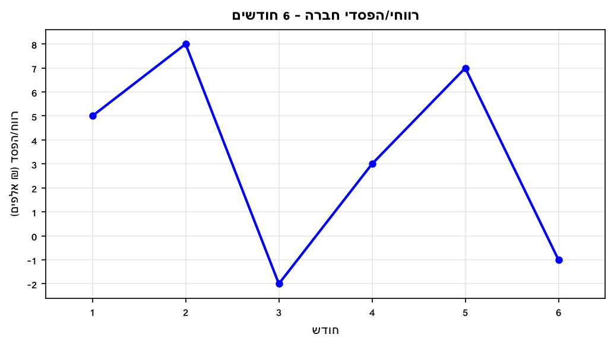

מהו הרווח/הפסד החודשי הממוצע (בשקלים ממש)?

---

**16.** גרף מתאר צריכת חשמל (קוט"ש) בדירה לאורך 7 ימים.

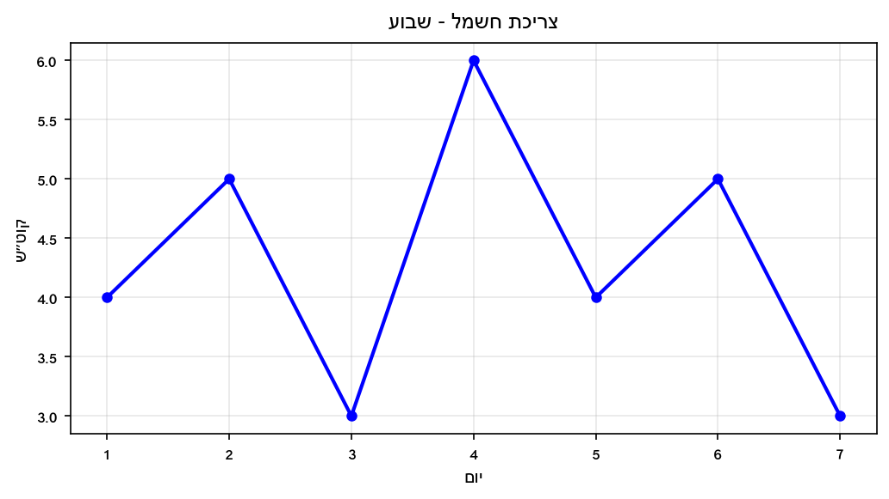

א. מהי הצריכה הכוללת לאורך השבוע?

ב. מהי הצריכה הממוצעת ליום?

---

## רמה 3: רמת בחינת מה"ט (4 תרגילים)

**17.** הגרף הבא מתאר את העלות (₪) של טיסה במסוק לפי דקות הטיסה.
העלות כוללת דמי טיפול קבועים (שלא יוחזרו) ותשלום לפי דקות.
הנקודות המסומנות בגרף:

א. כמה עלתה הטיסה לאדם שהזמין את המסוק אך לא טס (0 דקות)?

ב. אם טס 20 דקות, מהי העלות הממוצעת לדקת טיסה?

ג. אם טס 40 דקות, מהי העלות הממוצעת לדקת טיסה?

ד. הסבירו מדוע העלות הממוצעת לדקה קטנה ככל שטסים יותר דקות.

---

**18.** הגרף הבא מתאר תשלומים חודשיים (₪) של משפחה בחברת כבלים לאורך שנה שלמה.
(מבוסס על שאלה 11, קיץ מועד ב' 2025)

א. מהו התשלום הגבוה ביותר ובאיזה חודש?

ב. מהו סך התשלום השנתי?

ג. כמה שילמה המשפחה בממוצע לחודש?

ד. חברה מתחרה גובה 850 ₪ לרבעון. האם כדאי לעבור? הסבירו בעזרת חישוב.

---

**19.** הגרף הבא מתאר את הכנסות והוצאות חברה (₪ אלפים) ב-4 חודשים.
(מבוסס על שאלה 6, אביב מועד ב' 2024)

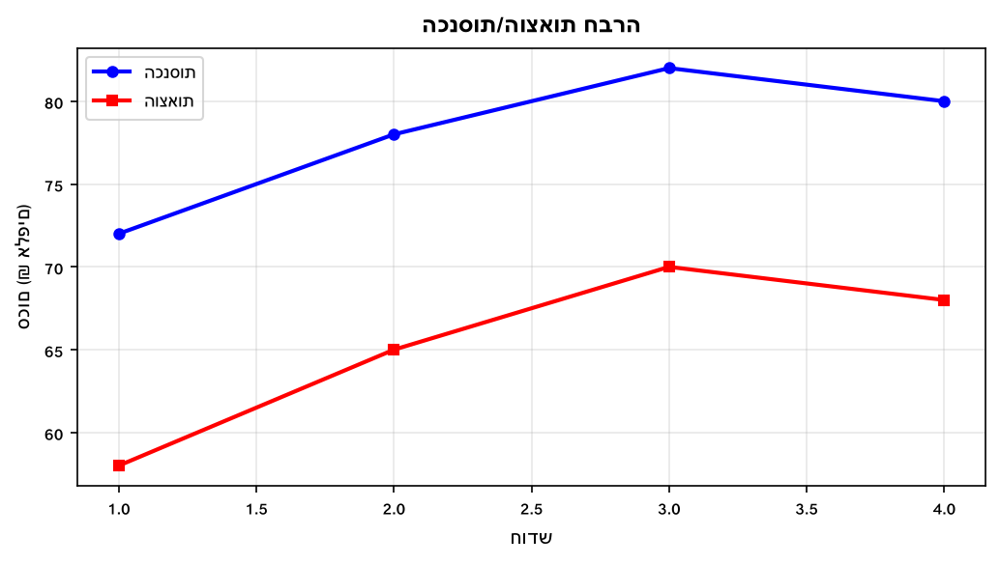

א. מה היו הכנסות החברה בפברואר (בשקלים ממש)?

ב. מהו ממוצע ההוצאות בארבעת החודשים (בשקלים ממש)?

ג. באיזה חודש הפרש ההכנסות-הוצאות היה הגדול ביותר, ומה היה הפרש זה?

ד. מהו הרווח הממוצע לחודש בפרק הזמן זה?

---

**20.** הגרף הבא מתאר את מחיר ספרים לפי כמות הספרים הנרכשים.
(מבוסס על שאלה 6, אביב מועד א' 2024)
הנקודות המסומנות בגרף:

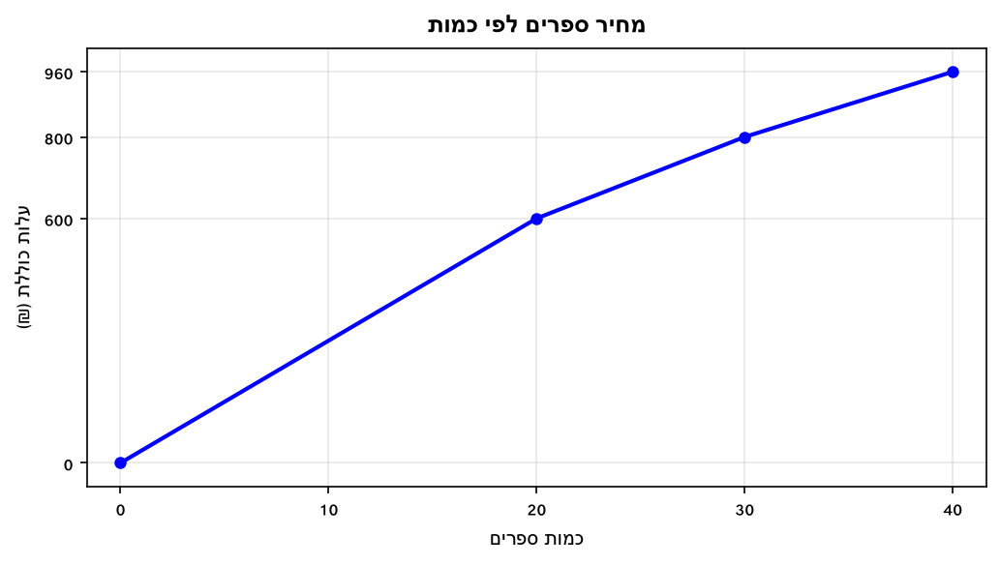

א. מה עלות רכישת 25 ספרים? (שימו לב לשינוי המחיר)

ב. מהו המחיר לכל ספר בין 0 ל-20 ספרים?

ג. מהו המחיר לכל ספר בין 20 ל-30 ספרים?

ד. סוחר קנה 30 ספרים. כמה שילם בסך הכל? כמה שילם בממוצע לכל ספר?

---

תשובות סופיות

1. $\frac{22+25+28+24+21}{5} = \frac{120}{5} = 24$°C.

2.
$\frac{18+22+28+32+25+19}{6} = \frac{144}{6} = 24$
אלפי ₪ =
$24{ }000$
₪ לחודש.

3.
$\frac{150+180+160+170}{4} = \frac{660}{4} = 165$
ליטרים ליום.

4. $\frac{85+90+95+88+92}{5} = \frac{450}{5} = 90$ ₪.

5. $\frac{72+85+78+91}{4} = \frac{326}{4} = 81.5$.

6.
$\frac{280+320+350+290}{4} = \frac{1{ }240}{4} = 310$
₪ לחודש.

7.
$\frac{120+135+128+142+125}{5} = \frac{650}{5} = 130$
ס"מ.

8.
$\frac{45+60+55+70+50}{5} = \frac{280}{5} = 56$
לקוחות ליום.

9. א.
$\frac{18+22+28}{3} = \frac{68}{3} \approx 22.67$
אלפי ₪. ב.
$\frac{32+25+19}{3} = \frac{76}{3} \approx 25.33$
אלפי ₪. ג. הרבעון השני גבוה יותר ב-
$\frac{76-68}{3} = \frac{8}{3} \approx 2.67$
אלפי ₪.

10. א.
$\frac{165+168+172+160+170}{5} = \frac{835}{5} = 167$
ס"מ. ב.
$\frac{160+163+155+158+169}{5} = \frac{805}{5} = 161$
ס"מ. ג.
$167 - 161 = 6$
ס"מ.

11. א.
$80 \times 4 = 320$
. ב.
$320 - (70+75+80) = 320 - 225 = 95$
.

12. $\frac{-3+(-5)+2+(-1)+4+6+(-2)+0}{8} = \frac{1}{8} = 0.125$°C $\approx 0.1$°C.

13. א.
$4 \times 20 + 6 \times 35 + 2 \times 50 = 80+210+100 = 390$
₪. ב.
$\frac{390}{4+6+2} = \frac{390}{12} = 32.5$
₪ ליחידה.

14. $80 \times 5 = 400$; $70+75+80+85+x = 310+x = 400$; $x = 90$.

15.
$\frac{5+8+(-2)+3+7+(-1)}{6} = \frac{20}{6} = \frac{10}{3} \approx 3{ }333$
₪ לחודש.

16. א.
$4+5+3+6+4+5+3 = 30$
קוט"ש. ב.
$\frac{30}{7} \approx 4.29$
קוט"ש ליום.

17. א. 200 ₪ (דמי טיפול). ב.
$\frac{500}{20} = 25$
₪ לדקה. ג.
$\frac{800}{40} = 20$
₪ לדקה. ד. דמי הטיפול הקבועים (200 ₪) מתחלקים על יותר דקות — ככל שטסים יותר, ה-200 ₪ הקבועים משפיעים פחות על הממוצע.

18. א. 350 ₪ (חודשים 7, 8 ו-12). ב.
$260+260+320+280+280+310+350+350+290+270+270+350 = 3{ }590$
₪. ג.
$\frac{3{ }590}{12} \approx 299.2$
₪ לחודש. ד. חברה מתחרה:
$850 \times 4 = 3{ }400$
₪ לשנה. הסכום הנוכחי: 3,590 ₪ לשנה. כן, כדאי לעבור — חוסכים
$3{ }590 - 3{ }400 = 190$
₪ לשנה.

19. א.
$78{ }000$
₪. ב.
$\frac{(58+65+70+68) \times 1{ }000}{4} = \frac{261{ }000}{4} = 65{ }250$
₪. ג. ינואר:
$72-58=14$
; פברואר:
$78-65=13$
; מרץ:
$82-70=12$
; אפריל:
$80-68=12$
— ינואר עם הפרש 14 אלפי ₪. ד. רווח ינואר–אפריל: 14+13+12+12=51K;
$\frac{51{ }000}{4} = 12{ }750$
₪ לחודש.

20. א. 20 ספרים ראשונים × 30₪ = 600₪; 5 ספרים נוספים × 20₪ = 100₪; סה"כ:
$600+100 = 700$
₪. ב.
$\frac{600}{20} = 30$
₪ לספר. ג.
$\frac{800-600}{30-20} = \frac{200}{10} = 20$
₪ לספר. ד. תשלום: 800 ₪. ממוצע לספר:
$\frac{800}{30} \approx 26.67$
₪.

