# תת-נושא 6: שילוב אחוזים בסיסיים מתוך גרף

הנוסחה לשינוי באחוזים:
$$\Delta\% = \frac{V_1 - V_0}{V_0} \times 100$$

---

## רמה 1: בניית ביטחון (8 תרגילים)

**1.** גרף מתאר את גובה ילדה (ס"מ) לפי גילה.

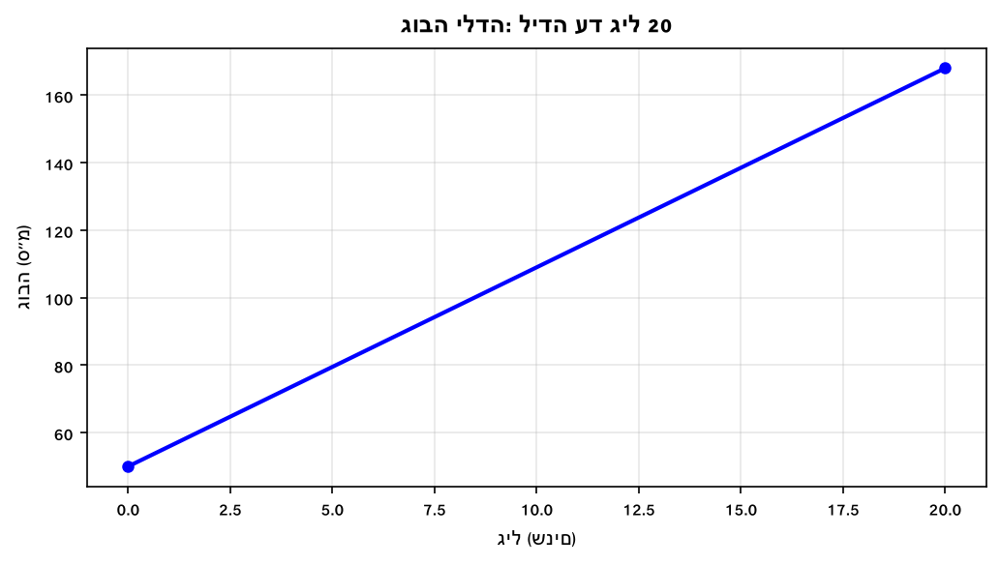

בכמה אחוזים גדל גובה הילדה מלידה עד גיל 20?

---

**2.** גרף מתאר הכנסות חנות (₪ אלפים) לפי חודשים.

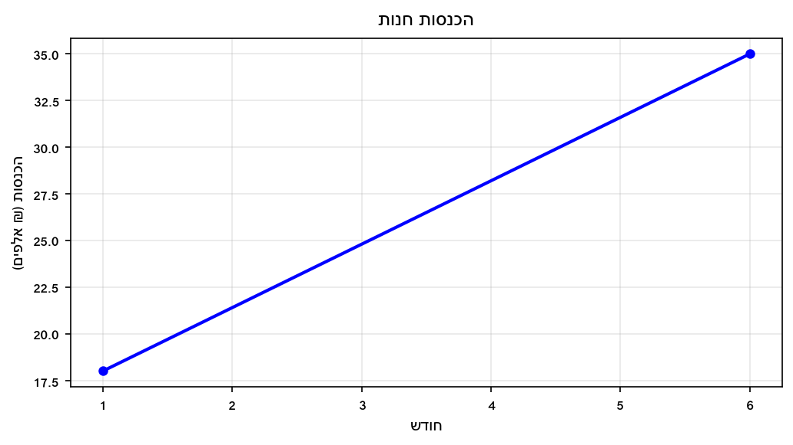

בכמה אחוזים גדלו ההכנסות מחודש 1 לחודש 6?

---

**3.** גרף מתאר מחיר מניה (₪) לפי ימים.

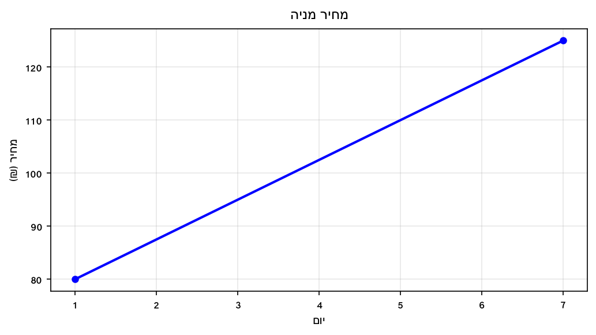

בכמה אחוזים עלה מחיר המניה מיום 1 ליום 7?

---

**4.** גרף מתאר את טמפרטורת תנור (°C) לפי זמן.

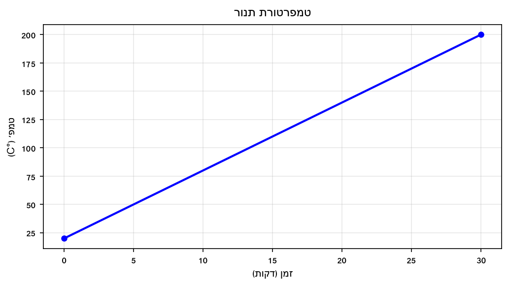

בכמה אחוזים עלתה טמפרטורת התנור מדקה 0 לדקה 30?

---

**5.** גרף מתאר כמות דלק (ליטרים) בבריכת הדלק לפי מרחק.

כמה אחוזים מהדלק המקורי נצרך בנסיעה של 400 ק"מ?

---

**6.** גרף מתאר כמות מים בבריכה (ליטרים) לפי זמן.

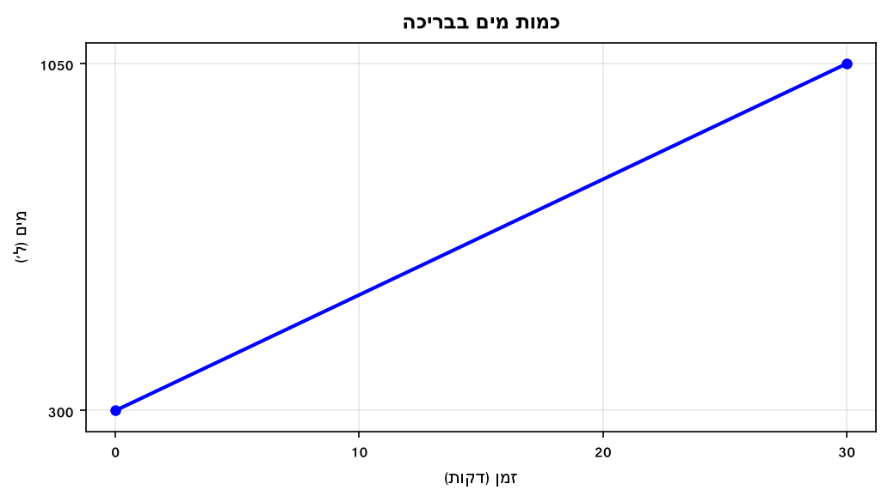

בכמה אחוזים גדלה כמות המים מדקה 0 לדקה 30?

---

**7.** גרף מתאר הכנסות חנות (₪ אלפים) לפי חודשים.

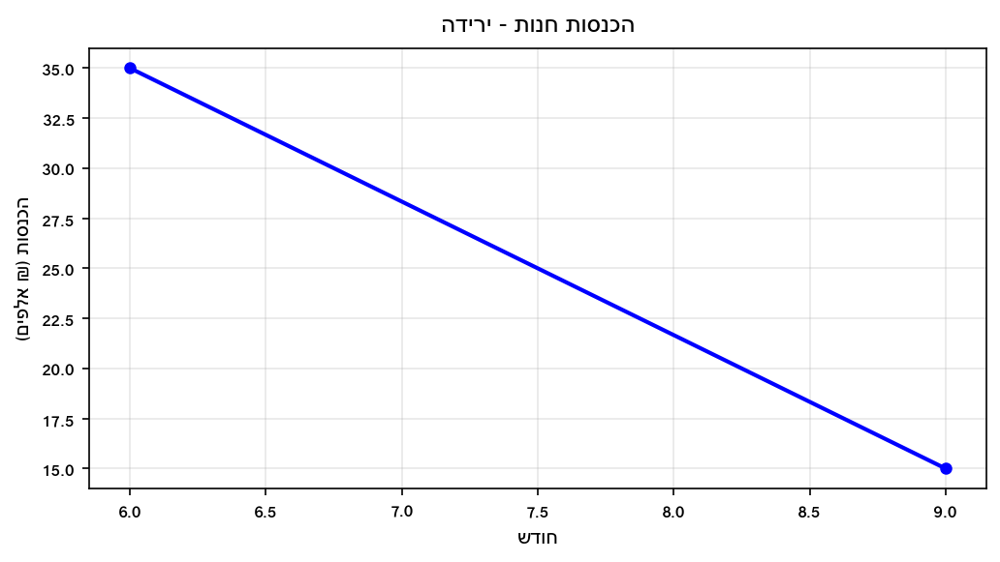

בכמה אחוזים ירדו ההכנסות מחודש 6 לחודש 9?

---

**8.** גרף מתאר גובה שתיל (ס"מ) לפי שבועות.

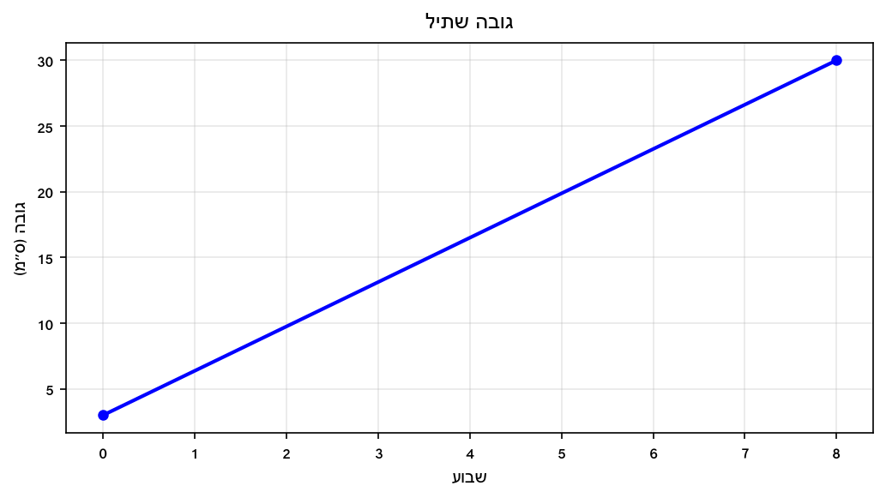

בכמה אחוזים גדל גובה השתיל מתחילה ועד שבוע 8?

---

## רמה 2: תרגול שוטף ומשולב (8 תרגילים)

**9.** גרף מתאר מחיר מניה (₪) לפי ימים.

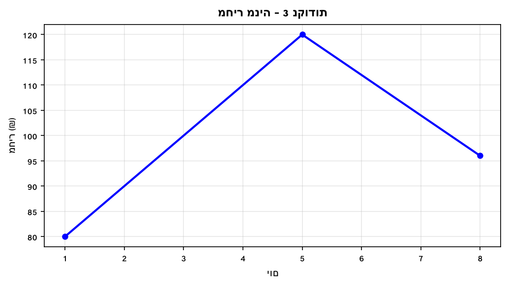

א. בכמה אחוזים עלה המחיר מיום 1 ליום 5?

ב. בכמה אחוזים ירד המחיר מיום 5 ליום 8?

ג. מה השינוי הכולל (באחוזים) מיום 1 ליום 8?

---

**10.** גרף מתאר גובה ילדה (ס"מ) לפי גילה.

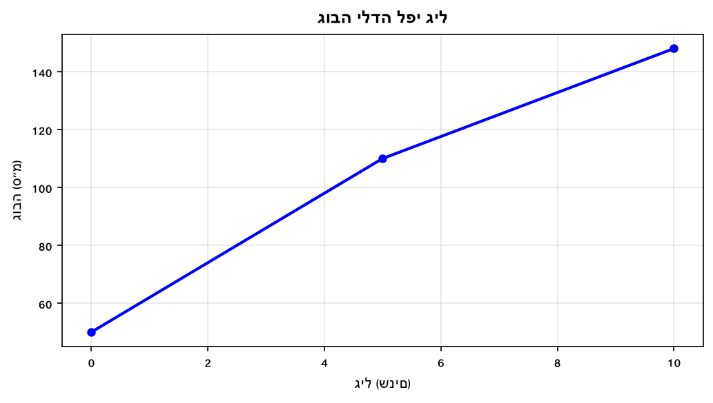

א. בכמה אחוזים גדלה הילדה בחמש השנים הראשונות (מגיל 0 עד גיל 5)?

ב. בכמה אחוזים גדלה בחמש השנים השניות (מגיל 5 עד גיל 10)?

ג. בכמה אחוזים גדלה מגיל 0 עד גיל 10 בסך הכל?

---

**11.** פריט עלה 350 ₪ לפי הגרף. המוכר מעניק הנחה של 20%.

א. מה גובה ההנחה בשקלים?

ב. מה המחיר לאחר ההנחה?

---

**12.** משכורת עובדת עלתה ב-15% לפי גרף ההכנסות.
משכורתה לפני העלאה: 8,000 ₪.

א. בכמה שקלים עלתה משכורתה?

ב. מהי משכורתה לאחר העלאה?

---

**13.** מחיר מוצר עלה ב-25% ועכשיו הוא עולה 500 ₪.

מהו המחיר המקורי (לפני העלאה)?

---

**14.** מחיר מוצר ירד ב-20%, ואחר-כך עלה שוב ב-20%.

א. אם המחיר ההתחלתי היה 200 ₪, מה המחיר לאחר הירידה?

ב. מה המחיר לאחר העלאה של 20% על המחיר שאחרי הירידה?

ג. מהו השינוי הנטו (באחוזים) מהמחיר ההתחלתי?

---

**15.** גרף מתאר הכנסות והוצאות (₪ אלפים) של חברה.

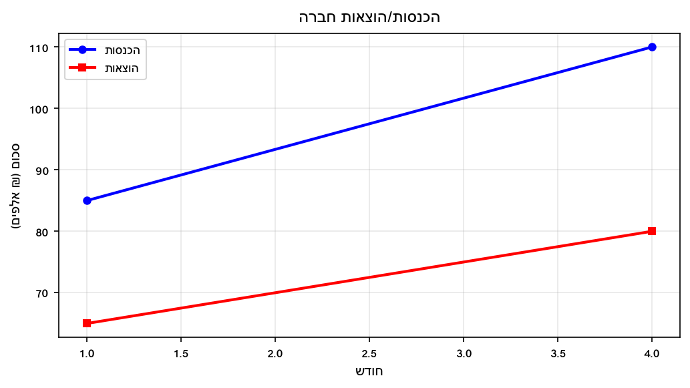

א. ההוצאות בינואר הן כמה אחוזים מההכנסות בינואר?

ב. ההוצאות באפריל הן כמה אחוזים מההכנסות באפריל?

---

**16.** גרף מתאר טמפרטורה (°C) ב-2 נקודות.

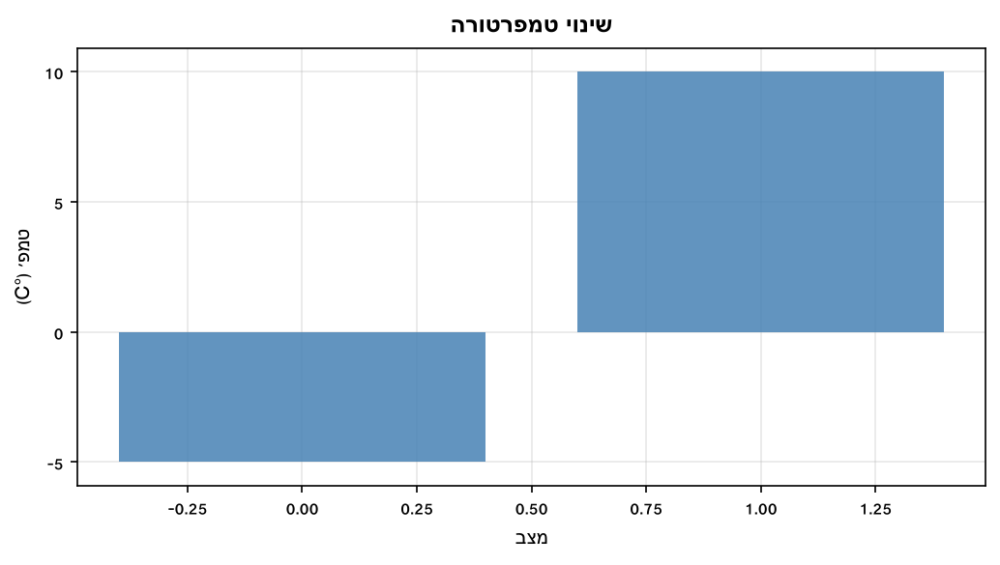

א. מהו השינוי המוחלט בטמפרטורה?

ב. אם נחשב שינוי אחוזי יחסית לערך ה**מוחלט** של הטמפרטורה ההתחלתית, מהו השינוי?

---

## רמה 3: רמת בחינת מה"ט (4 תרגילים)

**17.** הגרף הבא מתאר את הגובה (ס"מ) של מיכל לפי גילה.
(מבוסס על שאלה 1, קיץ מועד א' 2023)

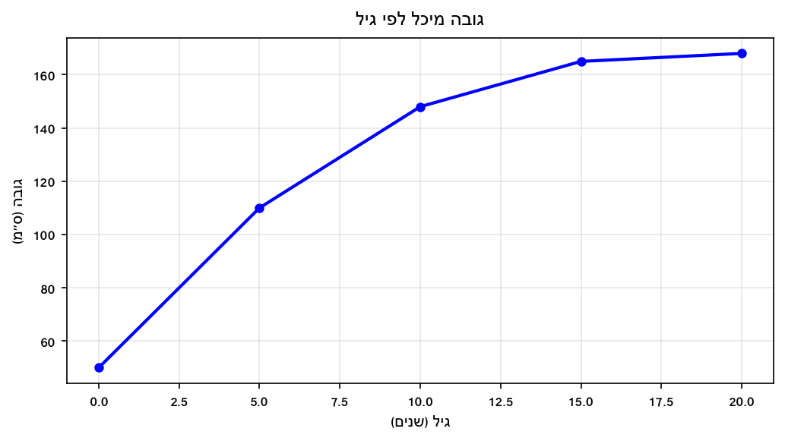

א. מה היה גובה מיכל בלידתה?

ב. בכמה אחוזים גדל גובה מיכל מגיל 5 עד גיל 15?

ג. בכמה אחוזים גדל גובה מיכל מלידה עד גיל 20?

ד. בכמה ס"מ בשנה גדלה מיכל בממוצע בעשור הראשון לחייה?

---

**18.** הגרף הבא מתאר את הכנסות חברת הייטק (₪ אלפים) לאורך שנה.

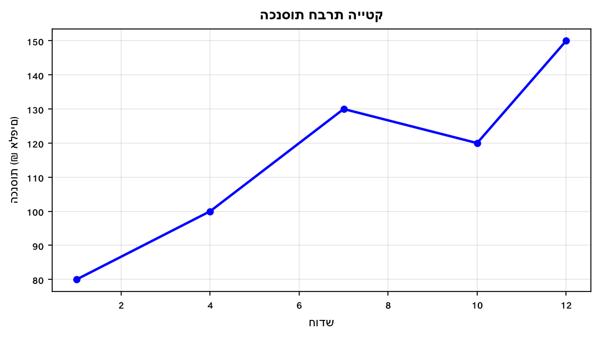

א. בכמה אחוזים גדלו הכנסות החברה מחודש 1 לחודש 7?

ב. בכמה אחוזים ירדו ההכנסות מחודש 7 לחודש 10?

ג. מהי ההכנסה הממוצעת ב-5 הנקודות הנמדדות?

ד. בכמה אחוזים גדלו ההכנסות מחודש 1 לחודש 12?

---

**19.** גרף מתאר מחיר ספרים לפי כמות הנרכשים.

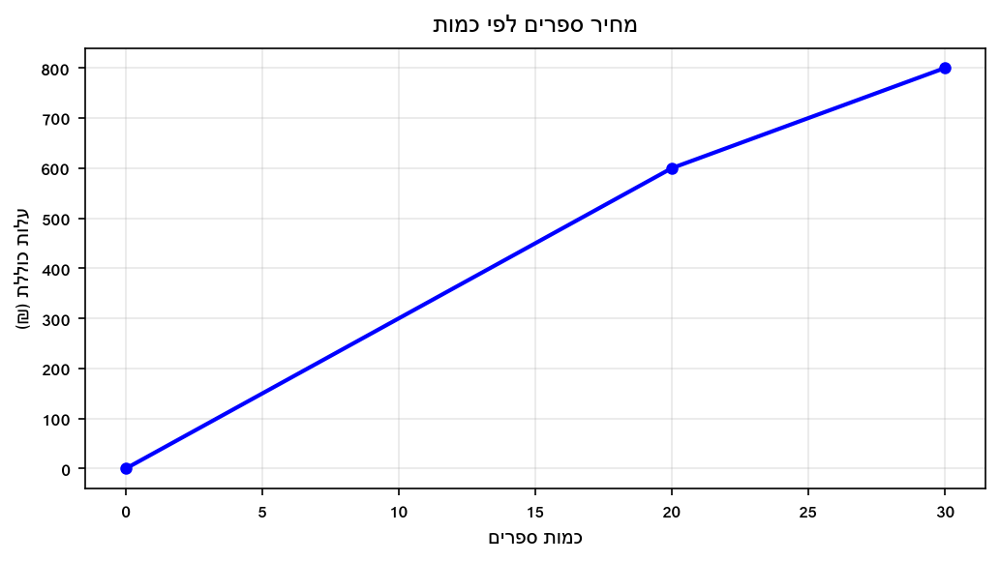

א. בכמה אחוזים יורד מחיר הספר כאשר קונים יותר מ-20 ספרים?

ב. סוחר קנה 20 ספרים ב-30 ₪ כל אחד. בפעם הבאה קנה 30 ספרים. בכמה אחוזים השתנתה עלות רכישתו הכוללת?

ג. מה העלות הכוללת ל-30 ספרים, ומה המחיר הממוצע לספר?

---

**20.** גרף מתאר את מאזן ההכנסות-הוצאות (₪ אלפים) של חברה ב-4 חודשים.

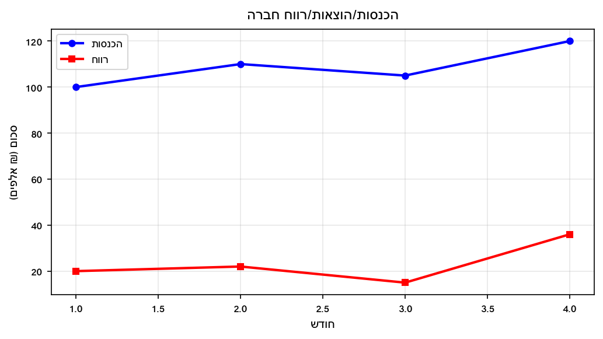

א. בכמה אחוזים גדל הרווח מחודש 1 לחודש 4?

ב. בכמה אחוזים ירד הרווח מחודש 2 לחודש 3?

ג. ההוצאות בחודש 4 הן כמה אחוזים מההכנסות בחודש 4?

ד. בכמה אחוזים גדלו ההכנסות מחודש 1 לחודש 4?

---

תשובות סופיות

1.
$236\%$

2.
$\frac{17}{18} \times 100 \approx 94.4\%$

3.
$56.25\%$

4.
$900\%$

5.
$64\%$

6.
$\frac{20}{35} \times 100 \approx 57.1\%$
ירידה.

7.
ירידה יחסית מחודש
$6$
לחודש
$9$
:
$\frac{15-35}{35}\times 100 = -\frac{400}{7}\approx -57.1\%$
כלומר ירידה בשיעור קרוב ל־
$57.1\%$

8.
$900\%$

9.
א.
$50\%$
עלייה.
ב.
$-20\%$
(ירידה של 20%).
ג.
$20\%$
עלייה כוללת.

10.
א.
$120\%$
ב.
$\frac{38}{110} \times 100 \approx 34.5\%$
ג.
$196\%$

11.
א.
$70$
₪.
ב.
$280$
₪.

12.
א.
$1{ }200$
₪.
ב.
$9{ }200$
₪.

13.
המחיר לפני העלאה המדוברת:
$\frac{500}{1+0.25}=\frac{500}{1.25}=400$
שקלים.

14.
א.
$160$
₪.
ב.
$192$
₪.
ג. ירידה נטו של
$4\%$
יחסית למחיר ההתחלתי אחרי שרשרת −20%+20%.

15.
א.
$\frac{65}{85} \times 100 \approx 76.5\%$
ב.
$\frac{80}{110} \times 100 \approx 72.7\%$

16.
א.
$15$
°C.
ב.
$300\%$

17.
א. 50 ס"מ.
ב.
$50\%$
ג.
$236\%$
ד.
$9.8$
ס"מ לשנה.

18.
א.
$62.5\%$
ב.
$\frac{-10}{130} \times 100 \approx -7.7\%$
(ירידה).
ג.
$116$
אלפי ₪.
ד.
$87.5\%$

19.
א.
$\frac{30-20}{30} \times 100 \approx 33.3\%$
ירידה.
ב. שינוי:
$\frac{800-600}{600} \times 100 \approx 33.3\%$
עלייה.
ג.
$800$
₪ סה"כ;
$\frac{800}{30} \approx 26.67$
₪ לספר.

20.
א.
$80\%$
ב.
$\frac{-7}{22} \times 100 \approx -31.8\%$
(ירידה).
ג.
$70\%$
ד.
$20\%$

