# תת-נושא 7: חישוב קצב שינוי — (הפרש ב-y) חלקי (הפרש ב-x)

הנוסחה לחישוב קצב שינוי בין שתי נקודות:
$$m = \frac{\Delta y}{\Delta x} = \frac{y_2 - y_1}{x_2 - x_1}$$

---

## רמה 1: בניית ביטחון (8 תרגילים)

**1.** גרף מתאר מילוי בריכה. הנקודות המסומנות:

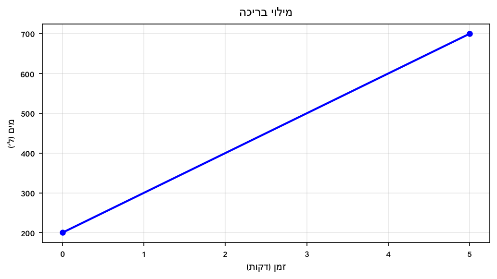

חשבו את קצב המילוי (ליטרים לדקה).

---

**2.** גרף מתאר חימום נוזל. הנקודות המסומנות:

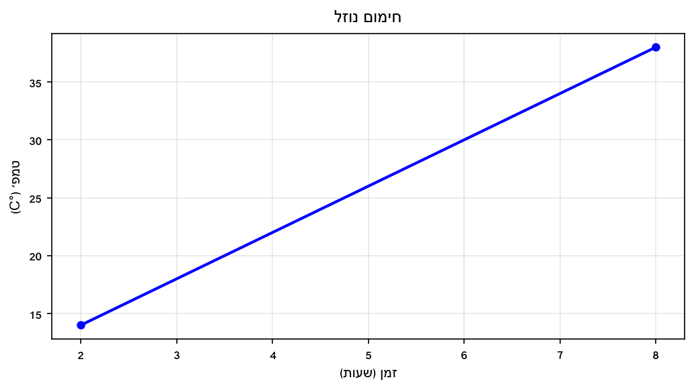

חשבו את קצב עליית הטמפרטורה (°C לשעה).

---

**3.** גרף מתאר גידול ילדה לפי גיל. הנקודות המסומנות:

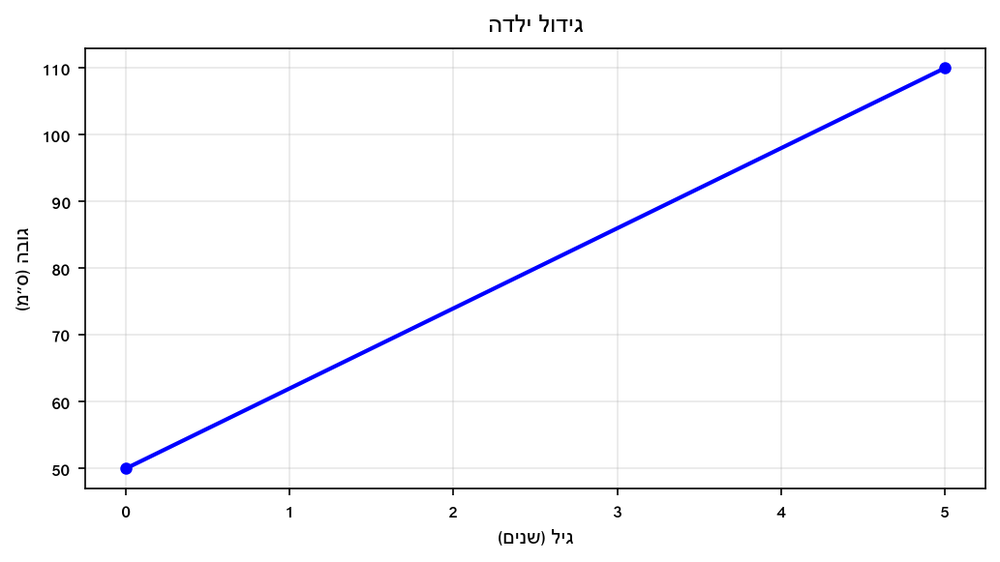

חשבו את קצב הגדילה הממוצע (ס"מ לשנה).

---

**4.** גרף מתאר עלות נסיעה לפי מרחק. הנקודות המסומנות:

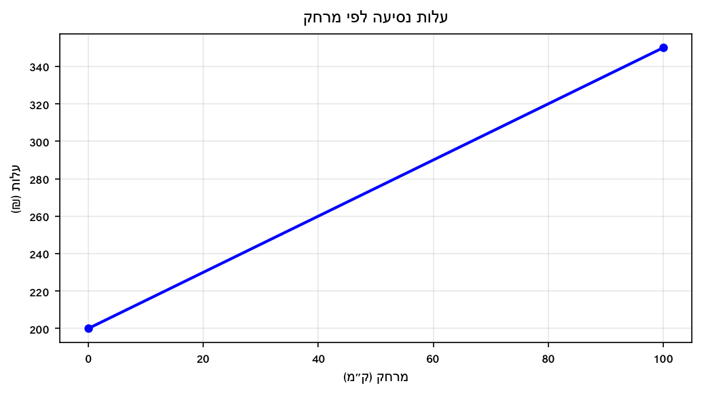

חשבו את קצב עלייה בעלות (₪ לכל ק"מ).

---

**5.** גרף מתאר מחיר מניה לפי ימים. הנקודות המסומנות:

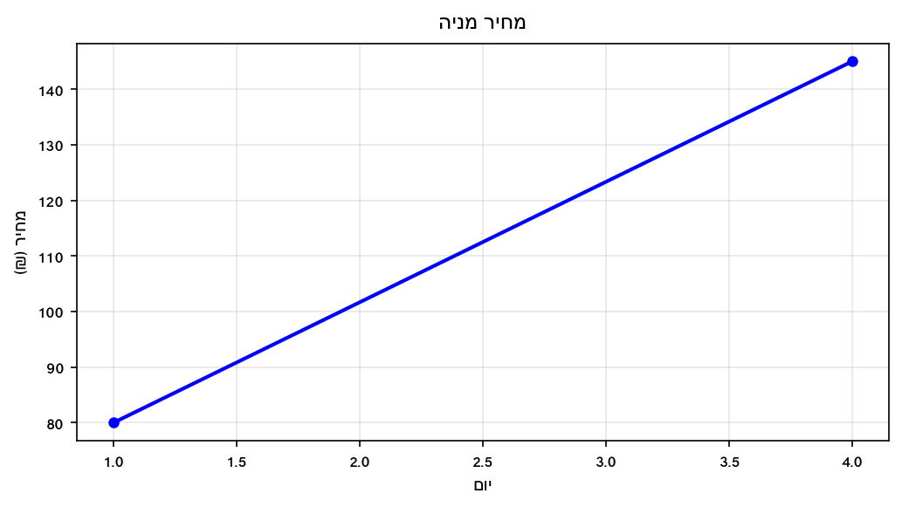

חשבו את קצב עליית המחיר הממוצע (₪ ליום).

---

**6.** גרף מתאר הכנסות חנות לפי חודשים. הנקודות המסומנות:

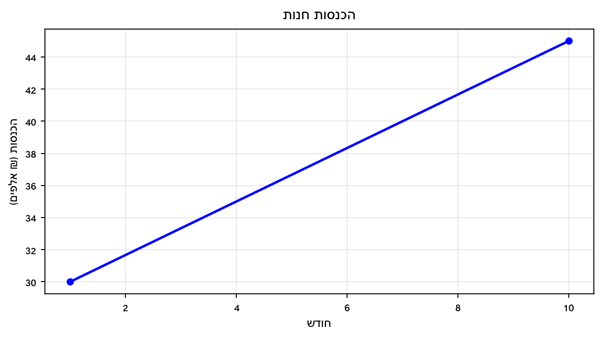

חשבו את קצב גידול ההכנסות (₪ אלפים לחודש).

---

**7.** גרף מתאר ריקון מיכל. הנקודות המסומנות:

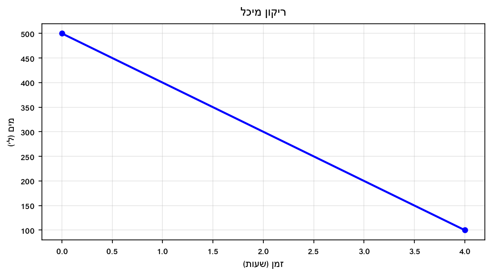

חשבו את קצב השינוי (ליטרים לשעה) — ציינו הסימן.

---

**8.** גרף מתאר גובה שתיל. הנקודות המסומנות:

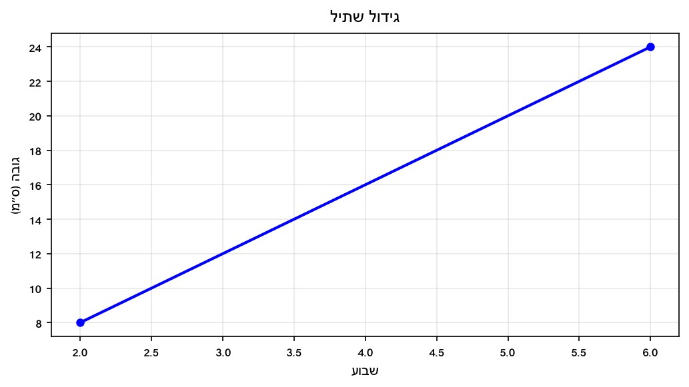

חשבו את קצב הגדילה (ס"מ לשבוע).

---

## רמה 2: תרגול שוטף ומשולב (8 תרגילים)

**9.** גרף מתאר כמות מים בבריכה לפי זמן. שני קטעים ליניאריים:

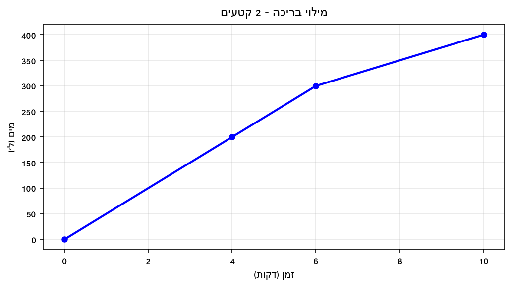

א. מהו קצב השינוי בקטע הראשון (בין דקה 0 לדקה 4)?

ב. מהו קצב השינוי בקטע השני (בין דקה 6 לדקה 10)?

ג. באיזה קטע המילוי מהיר יותר?

---

**10.** גרף מתאר ריקון מיכל. הנקודות המסומנות:

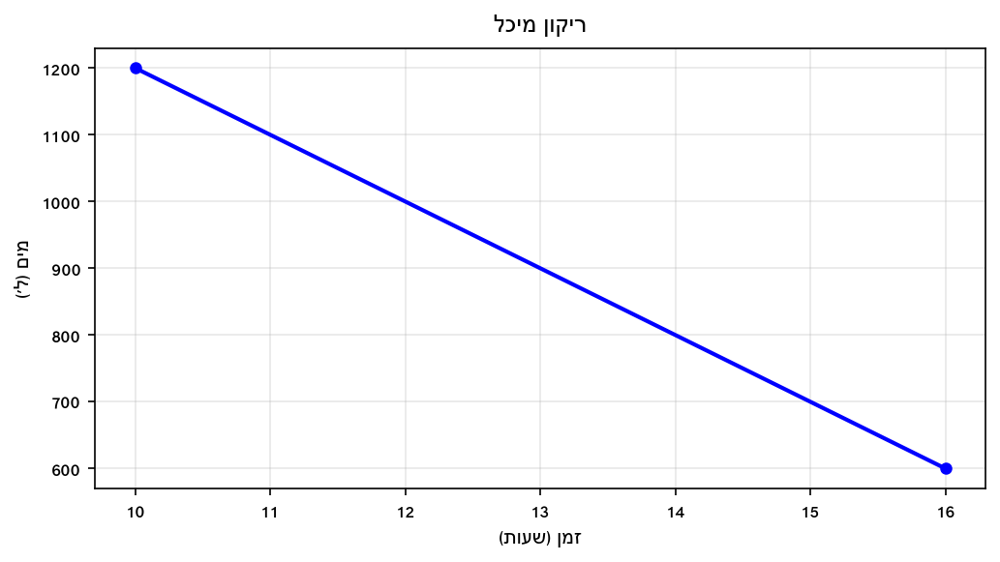

א. חשבו את קצב השינוי (ליטרים לשעה).

ב. מה המשמעות של הסימן השלילי?

ג. כמה שעות ייקח לרוקן את כל 600 הליטרים שנותרו (באותו קצב)?

---

**11.** קצב השינוי בין שתי נקודות על גרף הוא 30 קמ"ש (ק"מ לשעה).
בשעה 2 הרכב נמצא במרחק 80 ק"מ מנקודת המוצא.

א. מה המרחק בשעה 5?

ב. מתי היה הרכב ב-0 ק"מ מנקודת המוצא? (חשבו אחורה)

---

**12.** קצב עליית טמפרטורה הוא 3°C לשעה.
בשעה 8:00 הטמפרטורה הייתה 15°C.

א. מהי הטמפרטורה בשעה 15:00?

ב. באיזו שעה תגיע הטמפרטורה ל-36°C?

---

**13.** גרף מתאר מילוי וריקון בריכה.

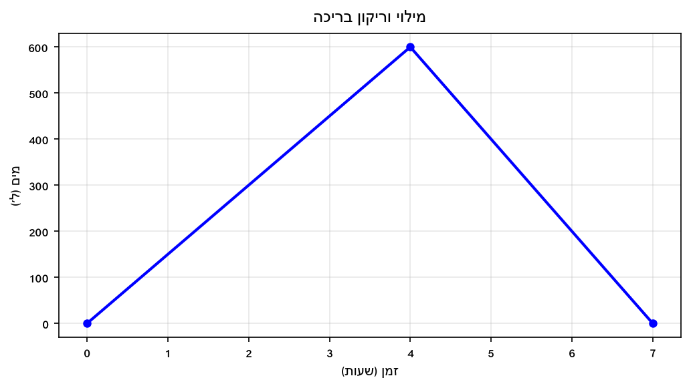

א. מהו קצב המילוי (בין שעה 0 לשעה 4)?

ב. מהו קצב הריקון (בין שעה 4 לשעה 7)?

ג. בשלב מה קצב השינוי בערכו המוחלט גדול יותר?

---

**14.** גרף מתאר טמפרטורה לאורך היום.

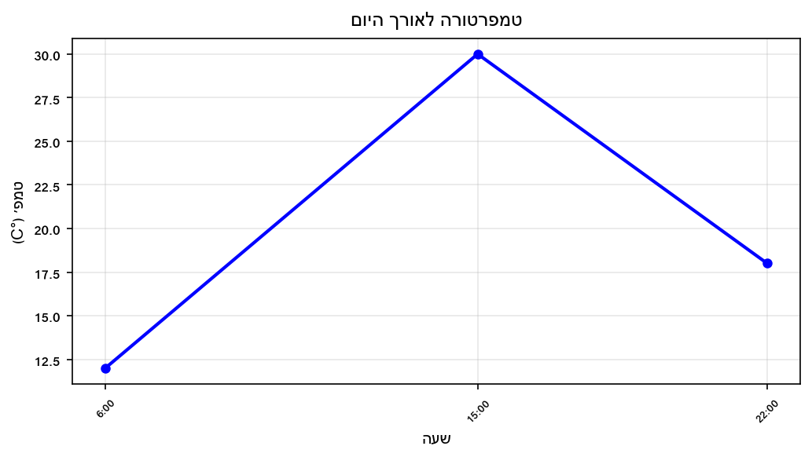

א. מהו קצב עליית הטמפרטורה בין 6:00 ל-15:00?

ב. מהו קצב ירידת הטמפרטורה בין 15:00 ל-22:00?

ג. בשלב איזה קצב השינוי גדול יותר בערכו המוחלט?

---

**15.** גרף מתאר מרחק אדם מביתו לפי שעות.

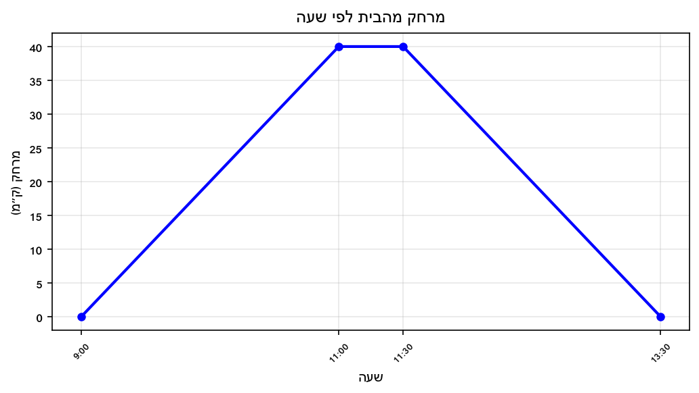

א. מהו קצב ההתרחקות (9:00–11:00)?

ב. מה קצב השינוי בין 11:00 ל-11:30?

ג. מהו קצב החזרה הביתה (11:30–13:30)?

---

**16.** גרף מתאר כמות מוצרים במלאי לפי ימים.

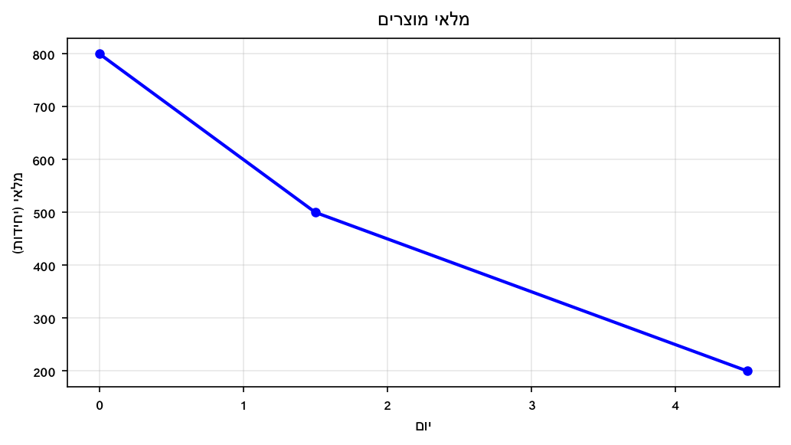

א. מהו קצב השינוי בין יום 0 ליום 1.5?

ב. מהו קצב השינוי בין יום 1.5 ליום 4.5?

ג. האם קצב ירידת המלאי קבוע לאורך כל התקופה?

---

## רמה 3: רמת בחינת מה"ט (4 תרגילים)

**17.** גרף מתאר את ביצועי שחיינית בתחרות: מרחק (ק"מ) לפי זמן (שעות).

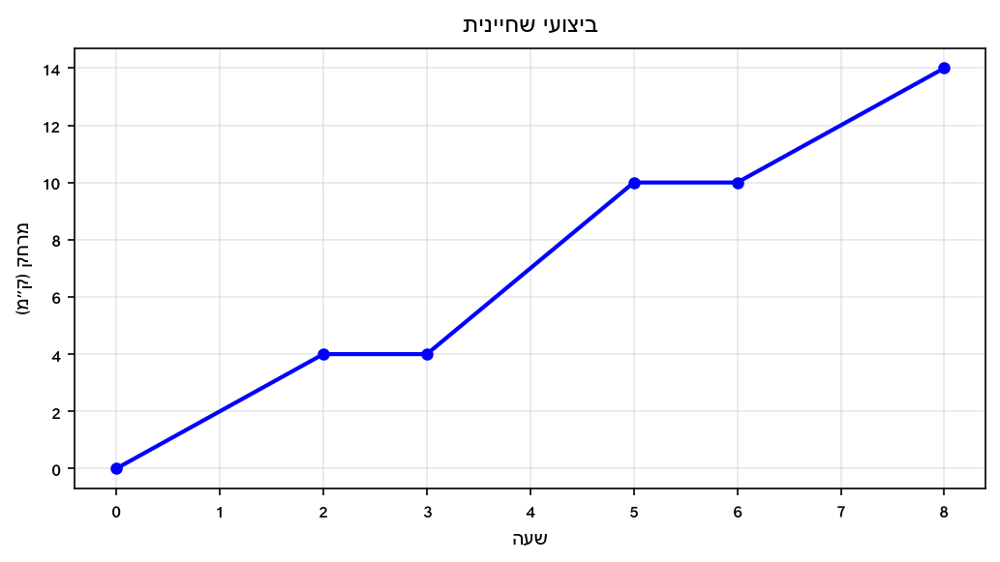

א. חשבו את קצב השינוי (מהירות) בכל קטע שבו השחיינית נעה.

ב. בין אילו שעות השחיינית הגיעה לקצב הגבוה ביותר?

ג. מהו קצב השינוי הממוצע (המהירות הממוצעת) על פני כל 8 השעות?

ד. בין שעה 3 לשעה 5 קצב שחייתה היה גבוה יותר מאשר בין שעה 0 לשעה 2. האם הטענה נכונה? נמקו.

---

**18.** הגרף הבא מתאר את המרחק (מטרים) של שליח פיצה מנקודת ה-0 לפי זמן (דקות).
(מבוסס על שאלה 6, אביב מועד ב' 2024)

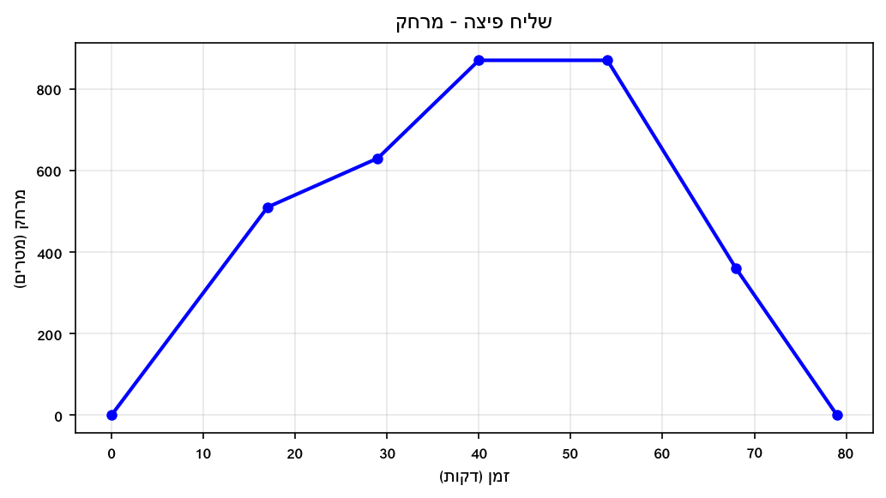

א. בין אילו זמנים קצב השינוי במרחק (בערך מוחלט) הוא הגדול ביותר?

ב. מהו קצב השינוי בין דקה 0 לדקה 17 (מטרים לדקה)?

ג. מהו קצב השינוי בין דקה 54 לדקה 68?

ד. מהו קצב השינוי בין דקה 68 לדקה 79?

---

**19.** הגרף הבא מתאר מרחק (ק"מ) של דניאלה על רולרבליידס לפי שעה.
(מבוסס על שאלה 7, קיץ מועד א' 2024)

א. חשבו את קצב השינוי בכל קטע תנועה.

ב. באיזה קטע קצב השינוי (בערך מוחלט) הוא הגבוה ביותר?

ג. מהי המהירות הממוצעת הכוללת של דניאלה מ-11:00 עד 20:00?

---

**20.** הגרף הבא מתאר את הטמפרטורה (°C) של חולה לאורך 24 שעות.
(מבוסס על שאלה 8, קיץ מועד ב' 2024)

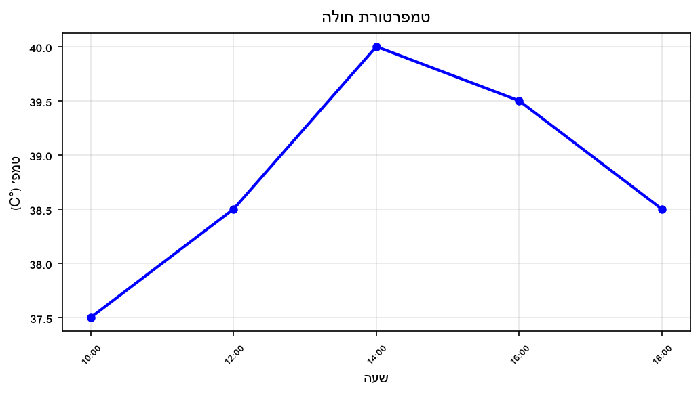

א. מהו קצב עליית הטמפרטורה בין 10:00 ל-14:00?

ב. מהו קצב ירידת הטמפרטורה בין 16:00 ל-18:00?

ג. בין אילו שעות קצב שינוי הטמפרטורה גדול יותר בערכו המוחלט?

ד. האם קצב ירידת החום בין 14:00 ל-16:00 שווה לקצב בין 16:00 ל-18:00? הוכיחו.

---

תשובות סופיות

1.
$\frac{700-200}{5-0} = \frac{500}{5} = 100$
ליטרים לדקה.

2.
$\frac{38-14}{8-2} = \frac{24}{6} = 4$
°C לשעה.

3.
$\frac{110-50}{5-0} = \frac{60}{5} = 12$
ס"מ לשנה.

4.
$\frac{350-200}{100-0} = \frac{150}{100} = 1.5$
₪ לק"מ.

5.
$\frac{145-80}{4-1} = \frac{65}{3} \approx 21.67$
₪ ליום.

6.
$\frac{45-30}{10-1} = \frac{15}{9} \approx 1.67$
אלפי ₪ לחודש.

7.
$\frac{100-500}{4-0} = \frac{-400}{4} = -100$
ל/שעה (הסימן השלילי = הכמות פוחתת).

8.
$\frac{24-8}{6-2} = \frac{16}{4} = 4$
ס"מ לשבוע.

9. א.
$\frac{200-0}{4-0} = \frac{200}{4} = 50$
ל/דקה. ב.
$\frac{400-300}{10-6} = \frac{100}{4} = 25$
ל/דקה. ג. הקטע הראשון (50 > 25).

10. א.
$\frac{600-1{ }200}{16-10} = \frac{-600}{6} = -100$
ל/שעה. ב. המיכל מתרוקן בקצב של 100 ל/שעה. ג.
$\frac{600}{100} = 6$
שעות.

11. א.
$80 + (5-2) \times 30 = 80 + 90 = 170$
ק"מ. ב.
$0 = 80 - t \times 30 \Rightarrow t = \frac{80}{30} \approx 2.67$
שעות לפני שעה 2, כלומר בשעה
$2 - 2.67 \approx -0.67$
— הרכב יצא כ-40 דקות לפני שעה 2.

12. א.
$15 + (15-8) \times 3 = 15 + 21 = 36$
°C. ב.
$15 + (t-8) \times 3 = 36 \Rightarrow (t-8) \times 3 = 21 \Rightarrow t - 8 = 7 \Rightarrow t = 15$
, כלומר בשעה 15:00.

13. א. $\frac{600-0}{4-0} = \frac{600}{4} = 150$ ל/שעה. ב. $\frac{0-600}{7-4} = \frac{-600}{3} = -200$ ל/שעה (קצב ריקון). ג. בשלב הריקון: $|-200| > 150$.

14. א.
$\frac{30-12}{15-6} = \frac{18}{9} = 2$
°C/שעה. ב.
$\frac{18-30}{22-15} = \frac{-12}{7} \approx -1.71$
°C/שעה. ג. שלב העלייה (2 > 1.71).

15. א.
$\frac{40-0}{11-9} = \frac{40}{2} = 20$
ק"מ/שעה. ב.
$\frac{40-40}{11.5-11} = 0$
— עמד במקום. ג.
$\frac{0-40}{13.5-11.5} = \frac{-40}{2} = -20$
ק"מ/שעה.

16. א.
$\frac{500-800}{1.5-0} = \frac{-300}{1.5} = -200$
יחידות/יום. ב.
$\frac{200-500}{4.5-1.5} = \frac{-300}{3} = -100$
יחידות/יום. ג. לא — הקצב השתנה: 200 ביום 1 ו-100 ביום 2.

17. א. שעות 0–2:
$\frac{4-0}{2} = 2$
קמ"ש. שעות 3–5:
$\frac{10-4}{2} = 3$
קמ"ש. שעות 6–8:
$\frac{14-10}{2} = 2$
קמ"ש. ב. בין שעה 3 לשעה 5 (קצב = 3 קמ"ש). ג.
$\frac{14-0}{8-0} = \frac{14}{8} = 1.75$
קמ"ש. ד. נכון: קצב 3–5 = 3 קמ"ש > קצב 0–2 = 2 קמ"ש.

18. א. בין דקות 0–17: $\frac{510}{17} = 30$ מ/דקה. בין 17–29: $\frac{120}{12} = 10$. בין 29–40: $\frac{240}{11} \approx 21.8$. בין 54–68: $\frac{|360-870|}{14} = \frac{510}{14} \approx 36.4$ מ/דקה. בין 68–79: $\frac{360}{11} \approx 32.7$. הקצב הגדול ביותר בין דקות 54–68. ב. 30 מ/דקה. ג. $\frac{360-870}{68-54} = \frac{-510}{14} \approx -36.4$ מ/דקה. ד. $\frac{0-360}{79-68} = \frac{-360}{11} \approx -32.7$ מ/דקה.

19. א. 11–13:
$\frac{20}{2} = 10$
קמ"ש. 14–17:
$\frac{5-20}{3} = -5$
קמ"ש. 17.5–20:
$\frac{30-5}{2.5} = 10$
קמ"ש. ב. 11–13 ו-17.5–20 שניהם בקצב 10 קמ"ש (גדול מ-5 קמ"ש של 14–17). ג.
$\frac{30-0}{20-11} = \frac{30}{9} \approx 3.33$
קמ"ש (ממוצע כולל, כולל עצירות).

20. א.
$\frac{40-37.5}{14-10} = \frac{2.5}{4} = 0.625$
°C/שעה. ב.
$\frac{38.5-39.5}{18-16} = \frac{-1}{2} = -0.5$
°C/שעה. ג. בין 10:00 ל-14:00: קצב 0.625 > קצב בין 16:00 ל-18:00: 0.5. ד. בין 14:00 ל-16:00:
$\frac{39.5-40}{2} = -0.25$
°C/שעה. בין 16:00 ל-18:00:
$-0.5$
°C/שעה. הקצבים שונים, לא.

