# תת-נושא 8: יישום בבעיות תנועה — חישוב מהירות על ידי חלוקת המרחק בזמן

הנוסחה הבסיסית לבעיות תנועה:
$$v = \frac{d}{t}$$

$$d = v \times t$$

$$t = \frac{d}{v}$$

---

## רמה 1: בניית ביטחון (8 תרגילים)

**1.** גרף מתאר מרחק (ק"מ) של אוטובוס מנקודת מוצא לפי שעות.

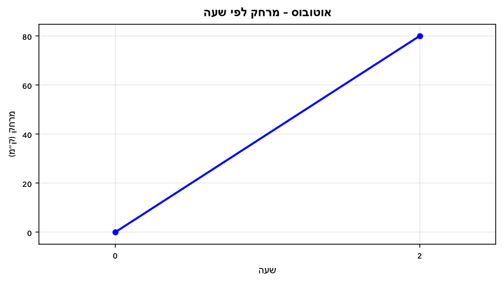

מהי מהירות האוטובוס (ק"מ לשעה)?

---

**2.** גרף מתאר מרחק (ק"מ) של רכב לפי שעות.

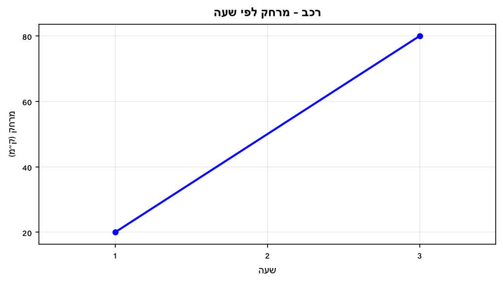

מהי מהירות הרכב (ק"מ לשעה)?

---

**3.** גרף מתאר מרחק (ק"מ) של אופנוע לפי שעות.

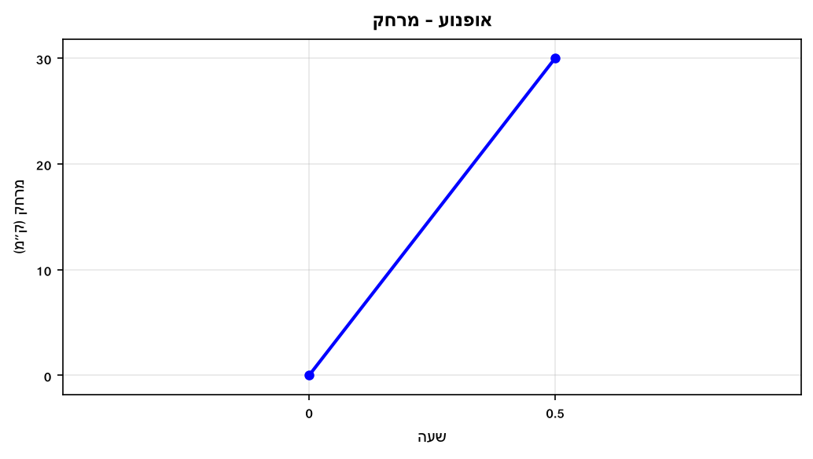

מהי מהירות האופנוע (ק"מ לשעה)?

---

**4.** רכב נוסע במהירות קבועה של 50 קמ"ש.
כמה שעות ייקח לו לנסוע 150 ק"מ?

---

**5.** אופניים נוסעות במהירות 20 קמ"ש.
כמה ק"מ יעבורו האופניים ב-2.5 שעות?

---

**6.** גרף מתאר מרחק (ק"מ) של רץ לפי שעות.

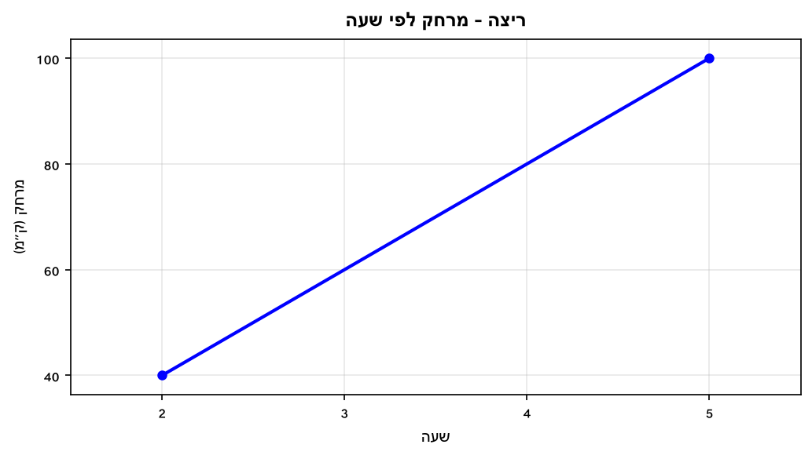

מהי מהירות הרץ (ק"מ לשעה)?

---

**7.** גרף מתאר מרחק (ק"מ) של הולך רגל לפי שעות.

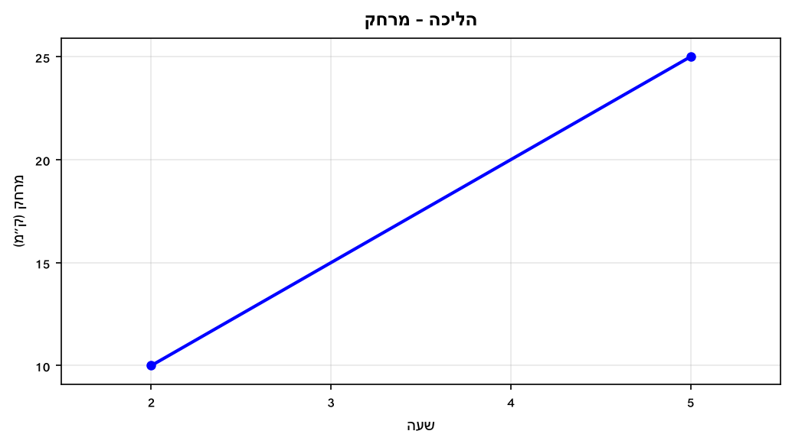

מהי מהירות הולך הרגל (ק"מ לשעה)?

---

**8.** גרף מתאר מרחק (ק"מ) של מכונית מנקודת מוצא לפי שעות.

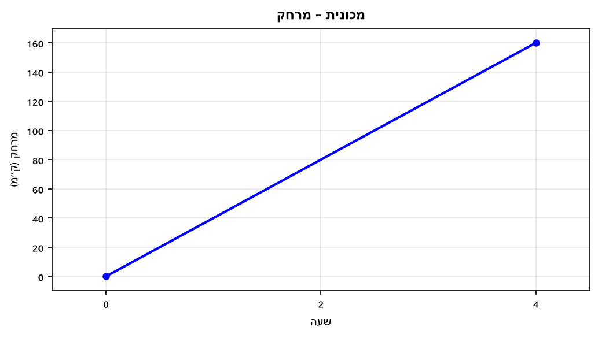

מהי מהירות המכונית (ק"מ לשעה)?

---

## רמה 2: תרגול שוטף ומשולב (8 תרגילים)

**9.** גרף מתאר מסע של רכב בשלושה קטעים.

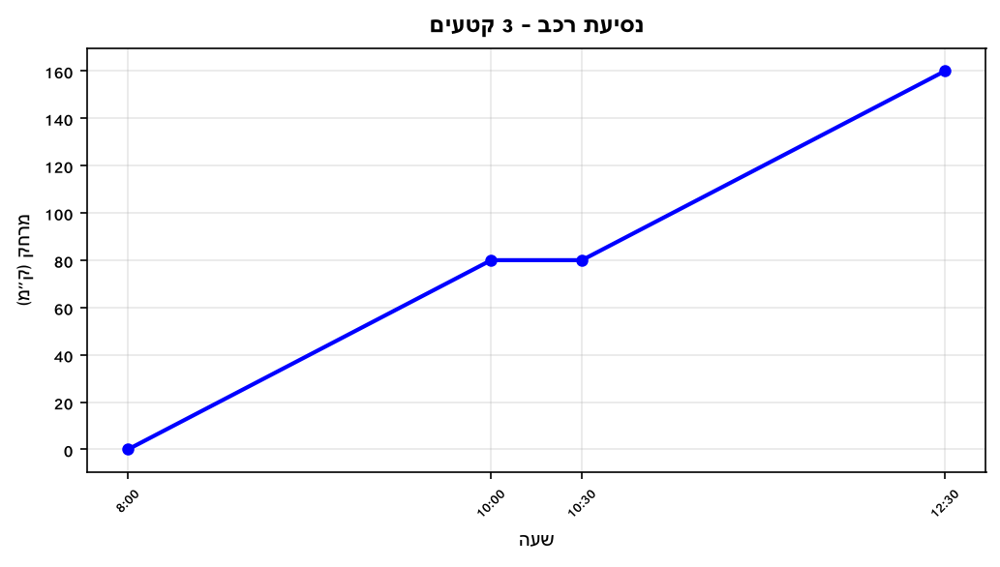

א. מהי המהירות בקטע הראשון (8:00–10:00)?

ב. מה קרה בין 10:00 ל-10:30?

ג. מהי המהירות בקטע השלישי (10:30–12:30)?

ד. מהי המהירות הממוצעת לכל המסע (כולל עצירה)?

---

**10.** אדם נסע 60 ק"מ בשעה וחצי, עצר חצי שעה, ואז חזר 60 ק"מ ב-2 שעות.

א. מהי מהירותו בנסיעה הראשונה?

ב. מהי מהירותו בנסיעה החזרה?

ג. מה הסך הכולל של הזמן שעבר?

ד. מהי המהירות הממוצעת של כל המסע (הוצע: מרחק כולל / זמן כולל)?

---

**11.** גרף מתאר מרחק (ק"מ) של משאית מנקודת מוצא לפי שעות.

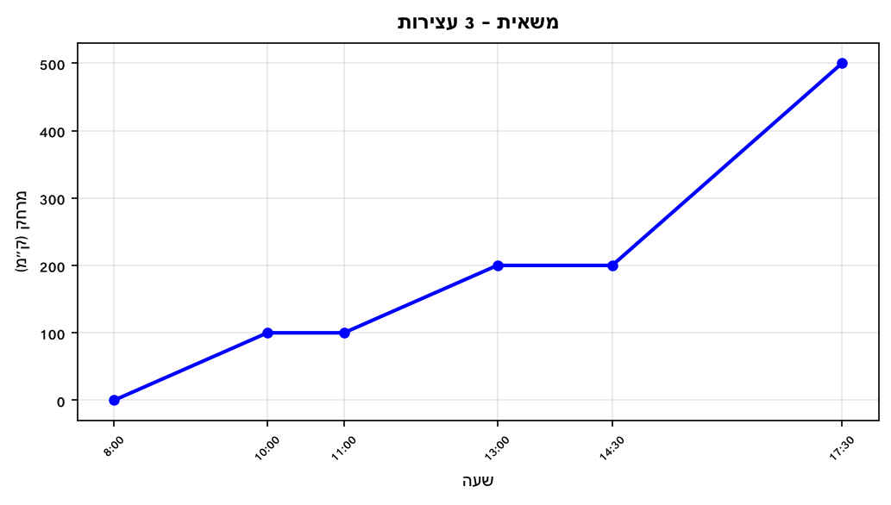

א. מהי מהירות המשאית בין 8:00 ל-10:00?

ב. מהי מהירותה בין 11:00 ל-13:00?

ג. מהי מהירותה בין 14:30 ל-17:30?

ד. מהי המהירות הממוצעת הכוללת מ-8:00 עד 17:30?

---

**12.** שני רצים יוצאים מאותה נקודה בו-זמנית לאותו כיוון.
רץ א' רץ במהירות 10 קמ"ש, רץ ב' רץ במהירות 8 קמ"ש.

א. לאחר 3 שעות, מה המרחק של כל רץ מנקודת ההתחלה?

ב. מה הפרש המרחק ביניהם לאחר 3 שעות?

ג. לאחר כמה שעות יהיה ביניהם פרש של 10 ק"מ?

---

**13.** שני רכבים נוסעים זה לקראת זה.
רכב א' יוצא מעיר A לכיוון עיר B במהירות 80 קמ"ש.
רכב ב' יוצא מעיר B לכיוון עיר A במהירות 60 קמ"ש.
המרחק בין הערים הוא 280 ק"מ.

א. בכמה ק"מ מתקרבים הרכבים זה לזה בכל שעה?

ב. לאחר כמה שעות ייפגשו הרכבים?

ג. באיזה מרחק מעיר A ייפגשו?

---

**14.** גרף מתאר מרחק (ק"מ) של הרכב מהבית לפי שעות.

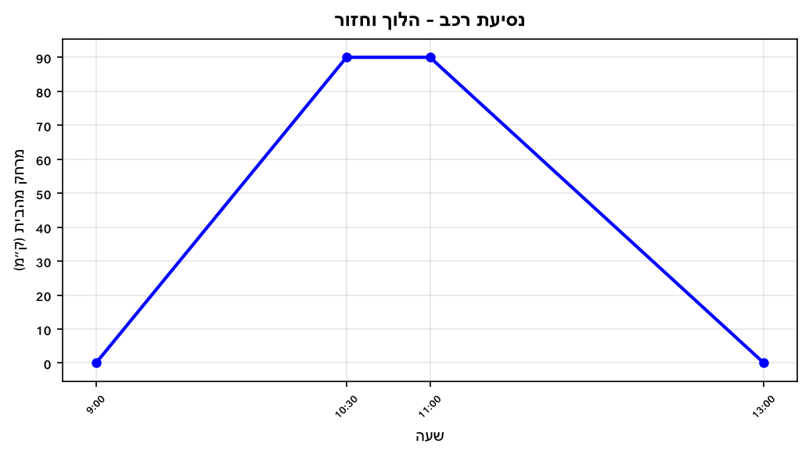

א. מהי מהירות הנסיעה בקטע היציאה?

ב. מהי מהירות הנסיעה בקטע החזרה?

ג. מהי המהירות הממוצעת לכל הנסיעה (כולל עצירה)?

---

**15.** טיול ברגל: מסלול הלוך 12 ק"מ, מסלול חזור 12 ק"מ.
הלוך: 3 שעות. חזור: 4 שעות.

א. מהי המהירות בהלוך?

ב. מהי המהירות בחזור?

ג. מהי המהירות הממוצעת של הטיול כולו?

---

**16.** גרף מתאר מרחק (ק"מ) של אופניים מנקודת התחלה לפי זמן (שעות).
בשלב ראשון הם נסעו 30 ק"מ בשעה. עצרו לנוח. אחר-כך נסעו עוד 20 ק"מ ב-30 דקות.

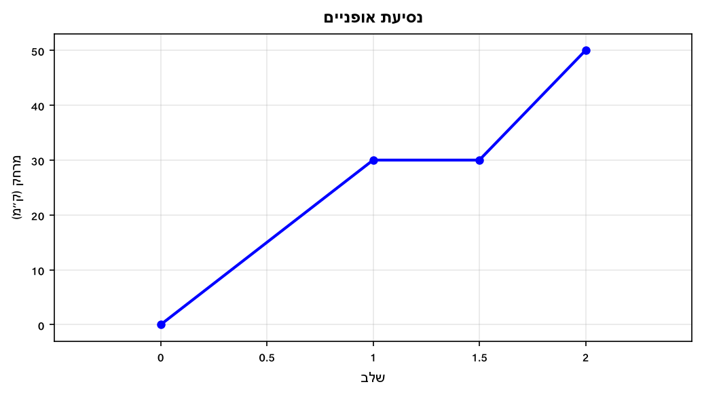

א. מהי מהירות הנסיעה הראשונה?

ב. מהי מהירות הנסיעה השנייה?

ג. מהי המהירות הממוצעת לכל הדרך (כולל מנוחה)?

---

## רמה 3: רמת בחינת מה"ט (4 תרגילים)

**17.** זיו יצא לטיול רגלי בשעה 7:00. הגרף הבא מתאר את המרחק (ק"מ) שעבר.
בשעה 10:00 הגיע למרחק 15 ק"מ מנקודת המוצא.
(מבוסס על שאלה 11, אביב מועד א' 2024)

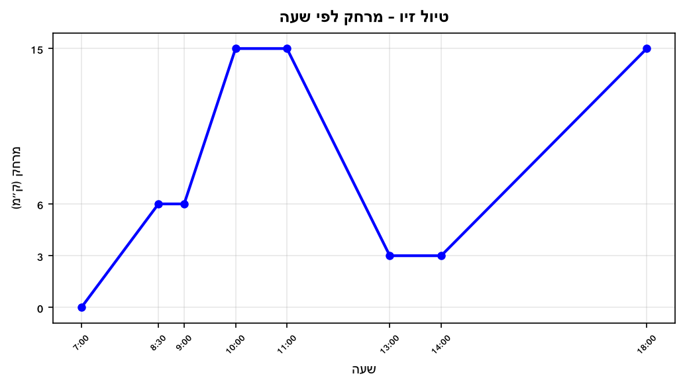

א. מהי מהירות הליכתו של זיו בכל קטע שבו הוא היה בתנועה (ק"מ לשעה)?

ב. בשלב מה הוא הגיע למהירות הגבוהה ביותר?

ג. מה הסך הכולל של שעות התנועה (ללא עצירות)?

ד. מהי המהירות הממוצעת של כל המסע מ-7:00 עד 18:00?

---

**18.** משאית אספקה יוצאת בשעה 8:00 ממרכז האספקה לשלוש רשתות שיווק.
הגרף מתאר את המרחק (ק"מ) מנקודת המוצא לפי שעה.
(מבוסס על שאלה 11, אביב מועד א' 2025)

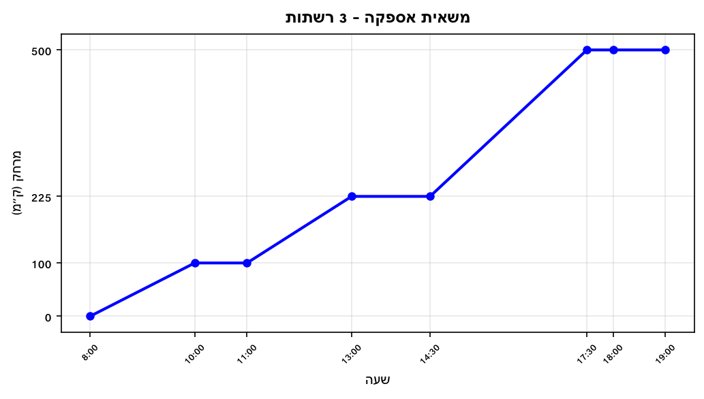

א. מהי מהירות הנסיעה לכל אחת מרשתות השיווק (ק"מ לשעה)?

ב. לאיזו רשת הגיעה המשאית בשיא המהירות?

ג. מה הזמן הכולל של עצירות הפריקה?

ד. מהי מהירות הנסיעה הממוצעת (ללא עצירות)?

---

**19.** דניאלה מחליקה על רולרבליידס.
הגרף מתאר את המרחק (ק"מ) שלה מאשקלון לפי שעות.
(מבוסס על שאלה 7, קיץ מועד א' 2024)

א. מהי מהירות החלקתה בכל קטע שבו היא נעה?

ב. באילו שעות החליקה דניאלה במהירות הגבוהה ביותר?

ג. מה המרחק שבו נמצאת דניאלה בשעה 16:00?
(שימוש בקצב בין 14:00 ל-17:00)

ד. מהי מהירות החלקתה הממוצעת הכוללת מ-11:00 עד 20:00?

---

**20.** זוג נשואים יצא לנסיעה מביתם. הגרף מתאר מרחק (ק"מ) מהבית לפי שעות.

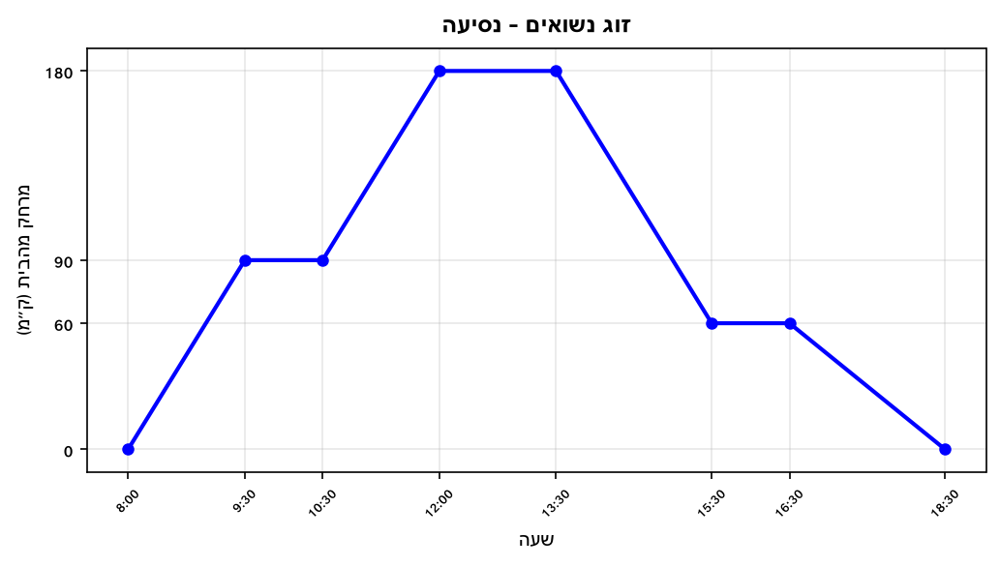

א. מהי המהירות בכל קטע נסיעה?

ב. מהי המהירות הממוצעת של נסיעת ההלוך (עד הנקודה הרחוקה ביותר)?

ג. מהי המהירות הממוצעת של נסיעת החזרה?

ד. מהי מהירות הנסיעה הממוצעת הכוללת מ-8:00 עד 18:30?

---

תשובות סופיות

1.
$40$
קמ"ש.

2.
$30$
קמ"ש.

3.
$60$
קמ"ש.

4.
$3$
שעות.

5.
$50$
ק"מ.

6.
$20$
קמ"ש.

7.
$5$
קמ"ש.

8.
$40$
קמ"ש.

9.
א.
$40$
קמ"ש.
ב. הרכב עצר (מרחק קבוע).
ג.
$40$
קמ"ש.
ד. 4.5 שעות:
$\frac{160}{4.5} \approx 35.6$
קמ"ש.

10.
א.
$40$
קמ"ש.
ב.
$30$
קמ"ש.
ג.
$4$
שעות.
ד.
$30$
קמ"ש.

11.
א.
$50$
קמ"ש.
ב.
$50$
קמ"ש.
ג.
$100$
קמ"ש.
ד.
$\frac{500}{9.5} \approx 52.6$
קמ"ש.

12.
א.
$24$
ק"מ ו-
$18$
ק"מ.
ב.
$6$
ק"מ.
ג.
$t = 5$
שעות.

13.
א.
$140$
ק"מ לשעה.
ב.
$2$
שעות.
ג. רכב א' נסע
$160$
ק"מ מעיר A.

14.
א.
$60$
קמ"ש.
ב.
$45$
קמ"ש.
ג.
$45$
קמ"ש.

15.
א.
$4$
קמ"ש.
ב.
$3$
קמ"ש.
ג.
$\frac{24}{7} \approx 3.43$
קמ"ש.

16.
א.
$30$
קמ"ש.
ב.
$40$
קמ"ש.
ג.
$25$
קמ"ש.

17.
א. 7:00–8:30:
$4$
קמ"ש; 9:00–10:00:
$9$
קמ"ש; 11:00–13:00:
$6$
קמ"ש; 14:00–18:00:
$3$
קמ"ש.
ב. 9:00–10:00 (9 קמ"ש).
ג.
$8.5$
שעות תנועה.
ד.
$\frac{39}{11} \approx 3.55$
קמ"ש (ממוצע כולל מ-7:00 עד 18:00).

18.
א. 8:00–10:00:
$50$
קמ"ש; 11:00–13:00:
$62.5$
קמ"ש; 14:30–17:30:
$\frac{275}{3} \approx 91.7$
קמ"ש.
ב. לרשת השלישית (14:30–17:30) בכ-91.7 קמ"ש.
ג. 4 שעות.
ד. 7 שעות נסיעה;
$\frac{500}{7} \approx 71.4$
קמ"ש (ללא עצירות).

19.
א. 11:00–13:00:
$10$
קמ"ש; 14:00–17:00:
$5$
קמ"ש; 17:30–20:00:
$10$
קמ"ש.
ב. 11:00–13:00 ו-17:30–20:00 (שניהם 10 קמ"ש).
ג.
$10$
ק"מ.
ד.
$\frac{30}{9} \approx 3.33$
קמ"ש.

20.
א. 8:00–9:30:
$60$
קמ"ש; 10:30–12:00:
$60$
קמ"ש; 13:30–15:30:
$60$
קמ"ש; 16:30–18:30:
$30$
קמ"ש.
ב.
$45$
קמ"ש.
ג.
$\frac{180}{6.5} \approx 27.7$
קמ"ש.
ד.
$\frac{360}{10.5} \approx 34.3$
קמ"ש (ממוצע כולל מ-8:00 עד 18:30).

