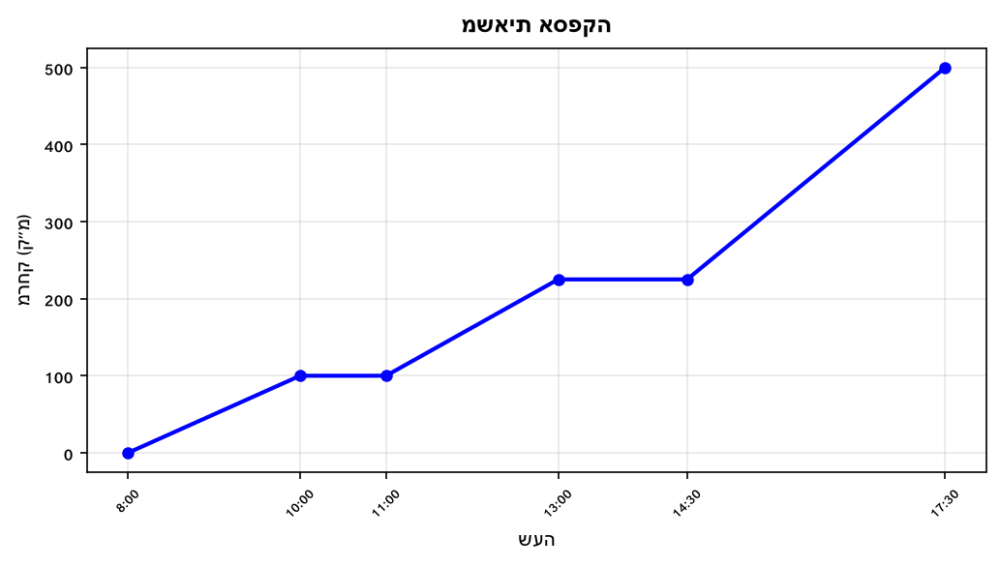
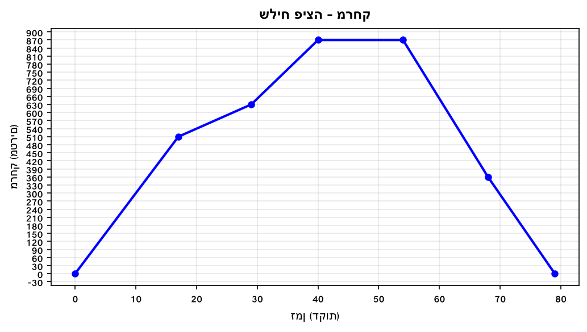

# תת-נושא 9: המרת יחידות — מקמ"ש למטר/שנייה ובחזרה

הנוסחאות הבסיסיות:
$$1 \text{km} = 1{ }000 \text{m} \quad , \quad 1 \text{hour} = 3{ }600 \text{s}$$

$$v \left(\frac{\text{m}}{\text{s}}\right) = \frac{v \left(\text{km/h}\right)}{3.6}$$

$$v \left(\text{km/h}\right) = v \left(\frac{\text{m}}{\text{s}}\right) \times 3.6$$

---

## רמה 1: בניית ביטחון (8 תרגילים)

**1.** המירו את המהירות מקמ"ש למטר לשנייה:

$$72 \text{km/h} = ? \text{m/s}$$

---

**2.** המירו את המהירות מקמ"ש למטר לשנייה:

$$90 \text{km/h} = ? \text{m/s}$$

---

**3.** המירו את המהירות מקמ"ש למטר לשנייה:

$$18 \text{km/h} = ? \text{m/s}$$

---

**4.** המירו את המהירות ממטר לשנייה לקמ"ש:

$$10 \text{m/s} = ? \text{km/h}$$

---

**5.** המירו את המהירות ממטר לשנייה לקמ"ש:

$$25 \text{m/s} = ? \text{km/h}$$

---

**6.** המירו את המהירות מקמ"ש למטר לשנייה:

$$45 \text{km/h} = ? \text{m/s}$$

---

**7.** המירו את המהירות ממטר לשנייה לקמ"ש:

$$15 \text{m/s} = ? \text{km/h}$$

---

**8.** המירו את המהירות מקמ"ש למטר לשנייה:

$$108 \text{km/h} = ? \text{m/s}$$

---

## רמה 2: תרגול שוטף ומשולב (8 תרגילים)

**9.** גרף מתאר נסיעת רכב. המהירות הנמדדת היא 80 קמ"ש.

א. המירו את המהירות ממטר לשנייה (שמרו על 3 ספרות אחרי הנקודה).

ב. כמה מטרים עובר הרכב בשנייה אחת?

---

**10.** רץ נע במהירות של 15 מ/שנ.

א. המירו ממטר לשנייה לקמ"ש.

ב. כמה ק"מ ירוץ בשעה שלמה?

---

**11.** שתי מכוניות נוסעות:
מכונית א' במהירות 50 קמ"ש.
מכונית ב' במהירות 13 מ/שנ.

א. המירו את מהירות מכונית ב' לקמ"ש.

ב. איזו מכונית נוסעת מהר יותר?

---

**12.** רכב נוסע בקצב של 60 קמ"ש למשך 90 דקות.

א. המירו את המהירות ממטר לשנייה.

ב. המירו את הזמן (90 דקות) לשניות.

ג. חשבו את המרחק בשניות × מ/שנ (במטרים).

ד. ודאו שהתשובה זהה לחישוב ק"מ/שעה × שעות.

---

**13.** גרף מתאר מסע ומציין מהירות מירבית של 100 קמ"ש.

המירו ל-מ/שנ (שמרו על 3 ספרות אחרי הנקודה).

---

**14.** אדם עבר 200 מטר ב-8 שניות.

א. מהי מהירותו (מ/שנ)?

ב. המירו לקמ"ש.

---

**15.** רכב נוסע בקצב של 54 קמ"ש.

א. המירו ל-מ/שנ.

ב. כמה מטרים עובר הרכב ב-20 שניות?

---

**16.** רץ עבר 100 מטר ב-10 שניות (ריצת 100 מטר).

א. מהי מהירותו (מ/שנ)?

ב. המירו לקמ"ש.

ג. מה ממוצע מהירותו בדקה שלמה?

---

## רמה 3: רמת בחינת מה"ט (4 תרגילים)

**17.** הגרף הבא מתאר את המרחק (ק"מ) של זיו בטיול רגלי לפי שעות.
(מבוסס על שאלה 11, אביב מועד א' 2024)

א. מהי מהירות הליכתו של זיו (ק"מ לשעה) בכל קטע שבו הוא נע?

ב. המירו את מהירויותיו ל-מ/שנ (שמרו על 3 ספרות אחרי הנקודה).

ג. מהי המהירות הגבוהה ביותר שהשיג זיו (ב-מ/שנ)?

---

**18.** הגרף הבא מתאר את המרחק (ק"מ) של משאית מנקודת המוצא לפי שעות.
(מבוסס על שאלה 11, אביב מועד א' 2025)

א. מהי מהירות נסיעת המשאית לכל אחת מרשתות השיווק (קמ"ש)?

ב. המירו את מהירויות הנסיעה ל-מ/שנ (שמרו על 3 ספרות).

---

**19.** הגרף הבא מתאר את המרחק (ק"מ) של דניאלה על רולרבליידס לפי שעה.
(מבוסס על שאלה 7, קיץ מועד א' 2024)

א. חשבו את מהירות החלקתה של דניאלה (קמ"ש) בכל קטע תנועה.

ב. המירו את מהירויותיה ל-מ/שנ (שמרו על 3 ספרות).

ג. נתבונן בנקודה שבה דניאלה נמצאת במרחק 15 ק"מ, לאחר שעתיים מתחילת התנועה (שעה 13:00).
המירו: 15 ק"מ ל-מטרים, ו-2 שעות ל-דקות.

---

**20.** הגרף הבא מתאר מרחק (מטרים) של שליח מנקודת ה-0 לפי זמן (דקות).
(מבוסס על שאלה 6, אביב מועד ב' 2024)

א. חשבו את קצב השינוי (מ/דקה) בכל קטע תנועה.

ב. המירו את המהירות בקטע הראשון (0–17 דקות) ל-מ/שנ (שמרו על 3 ספרות).

ג. המירו את המהירות בקטע השישי (54–68 דקות) ל-מ/שנ (שמרו על 3 ספרות).

ד. נתבונן בנקודה שבה השליח נמצא במרחק 360 מטר, לאחר 68 דקות.
המירו: 360 מטר ל-ק"מ, ו-68 דקות ל-שעות. הציגו ברמת דיוק של 2 ספרות.

---

תשובות סופיות

1.
$20$
מ/שנ.

2.
$25$
מ/שנ.

3.
$5$
מ/שנ.

4.
$36$
קמ"ש.

5.
$90$
קמ"ש.

6.
$12.5$
מ/שנ.

7.
$54$
קמ"ש.

8.
$30$
מ/שנ.

9.
א.
$80 \div 3.6 \approx 22.222$
מ/שנ.
ב. כ-22.222 מטרים לשנייה.

10.
א.
$54$
קמ"ש.
ב.
$54$
ק"מ.

11.
א.
$46.8$
קמ"ש.
ב. מכונית א' (50 > 46.8).

12.
א.
$60 \div 3.6 \approx 16.667$
מ/שנ.
ב.
$5{ }400$
שניות.
ג. 90 ק"מ.
ד.
$90$
ק"מ — זהה.

13.
$100 \div 3.6 \approx 27.778$
מ/שנ.

14.
א.
$25$
מ/שנ.
ב.
$90$
קמ"ש.

15.
א.
$15$
מ/שנ.
ב.
$300$
מטרים.

16.
א.
$10$
מ/שנ.
ב.
$36$
קמ"ש.
ג.
$10$
מ/שנ (המהירות קבועה — זהה).

17.
א.
$3$
קמ"ש (ערכים נוספים בקטעי תנועה).
ב.
$4 \div 3.6 \approx 1.111$
מ/שנ;
$2.500$
מ/שנ;
$6 \div 3.6 \approx 1.667$
מ/שנ;
$3 \div 3.6 \approx 0.833$
מ/שנ.
ג. הגבוהה ביותר:
$2.500$
מ/שנ (בין 9:00 ל-10:00).

18.
א.
$62.5$
קמ"ש; בין 14:30 ל-17:30:
$275 \div 3 \approx 91.667$
קמ"ש.
ב.
$50 \div 3.6 \approx 13.889$
מ/שנ;
$62.5 \div 3.6 \approx 17.361$
מ/שנ;
$91.667 \div 3.6 \approx 25.463$
מ/שנ.

19.
א. 11:00–13:00:
$10$
קמ"ש. 14:00–17:00:
$5$
קמ"ש. 17:30–20:00:
$10$
קמ"ש.
ב.
$10 \div 3.6 \approx 2.778$
מ/שנ;
$5 \div 3.6 \approx 1.389$
מ/שנ;
$10 \div 3.6 \approx 2.778$
מ/שנ.
ג.
$15{ }000$
מטרים;
$120$
דקות.

20.
א. בין 0–17:
$30$
מ/דקה. 29–40:
$\frac{240}{11} \approx 21.8$
מ/דקה. 54–68:
$\frac{510}{14} \approx 36.429$
מ/דקה. 68–79:
$360 \div 11 \approx 32.727$
מ/דקה.
ב.
$30 \div 60 = 0.5$
מ/שנ.
ג.
$36.429 \div 60 \approx 0.607$
מ/שנ.
ד.
$360 \div 1{ }000 = 0.36$
ק"מ;
$68 \div 60 \approx 1.13$
שעות.

