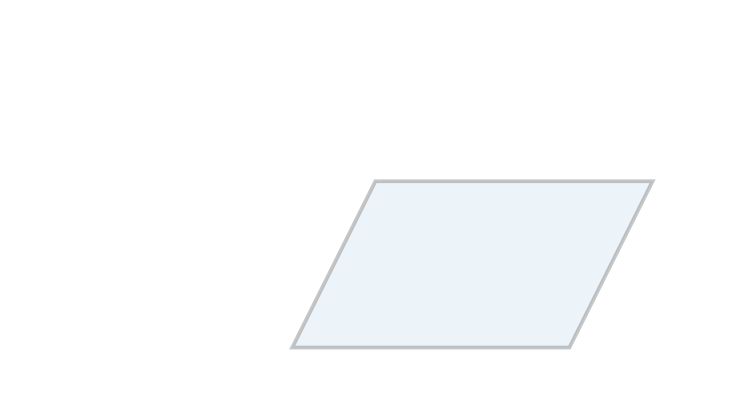
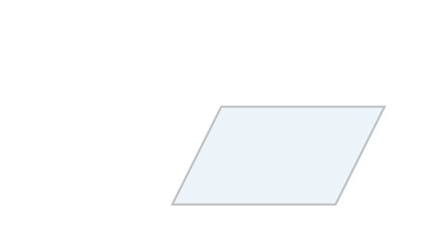
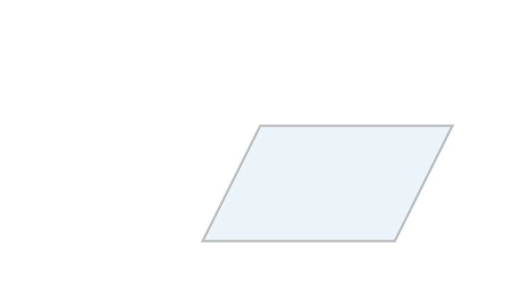
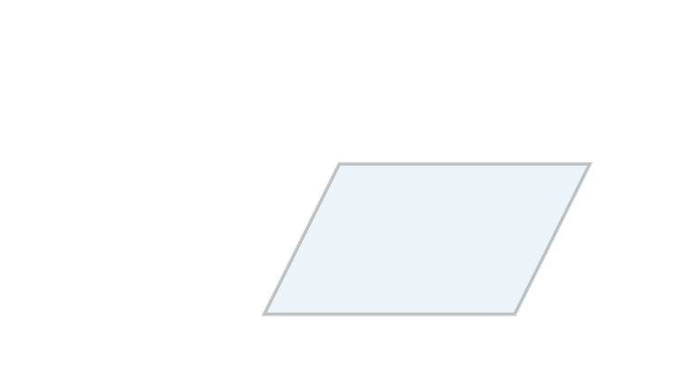
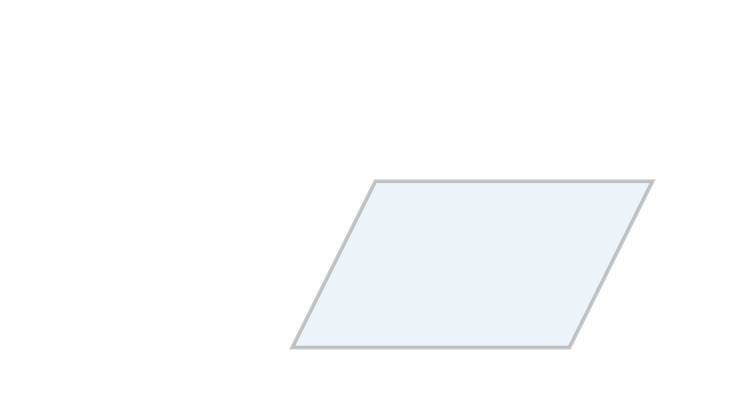
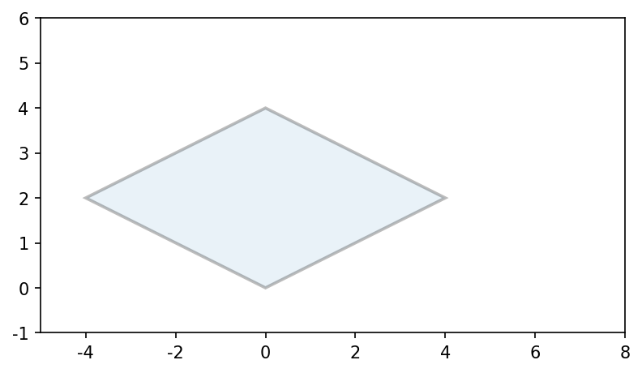

# תת-נושא 10: תכונות המקבילית והמעוין (צלעות, זוויות ואלכסונים)

---

## רמה 1: בניית ביטחון (8 תרגילים)

1. ציינו את תכונות המקבילית:
אילו צלעות מקבילות? אילו שוות? מה היחס בין זוויות נגדיות?

2. ציינו את תכונות המיוחדות של המעוין לעומת מקבילית רגילה.

3. במקבילית
$ABCD$,
$AB = 8$
ס"מ ו-
$BC = 5$
ס"מ.
מה אורכי
$CD$
ו-
$DA$?

4. במעוין
$ABCD$,
$AB = 7$
ס"מ.
מה אורכי שאר הצלעות?

5. במקבילית
$ABCD$,
$\angle A = 70°$.
מה גודל הזוויות
$B$,
$C$,
$D$?

6. האלכסונים של מקבילית חוצים זה את זה.
אם האלכסון
$AC = 12$
ס"מ, מה המרחק
$AO$
כאשר
$O$
הוא נקודת המפגש?

7. במעוין, האלכסונים ניצבים זה לזה.
אם האלכסון
$AC = 10$
ס"מ ו-
$BD = 8$
ס"מ, מה אורך כל קטע הנוצר בחצייה?

8. מה ההבדל בין אלכסוני מקבילית לאלכסוני מעוין?

---

## רמה 2: תרגול שוטף ומשולב (8 תרגילים)

9. במקבילית
$ABCD$,
$\angle A = (3x + 10)°$
ו-
$\angle B = (5x - 10)°$.
מצאו את
$x$
ואת כל ארבע הזוויות.
(זוויות סמוכות במקבילית משלימות)

10. מעוין שצלעו
$13$
ס"מ ואלכסון אחד מודד
$10$
ס"מ.
חשבו את האלכסון השני.
(רמז: פיתגורס עם מחצית האלכסונים)

11. אלכסוני מקבילית הם
$18$
ס"מ ו-
$14$
ס"מ.
מצאו את הקטעים שנוצרים בנקודת החציה.

12. במקבילית
$ABCD$,
$\angle A = (2x + 10)°$
ו-
$\angle C = (4x - 30)°$.
מצאו את
$x$
ואת הזוויות.
(זוויות נגדיות שוות)

13. מעוין
$ABCD$,
אלכסון אחד
$AC = 30$
ס"מ ואלכסון שני
$BD = 16$
ס"מ.
האלכסונים חוצים זה את זה בנקודה
$O$.
חשבו את
$AO$,
$CO$,
$BO$,
$DO$.

14. מעוין שצלעו
$5$
ס"מ ואלכסון אחד מודד
$8$
ס"מ.
האם ניתן לחשב את האלכסון השני? חשבו אותו.

15. האם כל מעוין הוא מקבילית? האם כל מקבילית היא מעוין? הסבירו.

16. במקבילית
$ABCD$,
זווית
$A = 70°$.
מהן ארבע הזוויות?
מה הסכום של כל ארבע הזוויות?

---

## רמה 3: רמת בחינת מה"ט (4 תרגילים)

17. מעוין
$ABCD$:
$AC = 30$
ס"מ,
$BD = 16$
ס"מ.

א. חשבו את שטח המעוין.

ב. חשבו את אורך צלע המעוין.
(רמז: פיתגורס עם מחצית האלכסונים)

ג. חשבו את היקף המעוין.

18. במקבילית
$ABCD$:
$\angle A = (2x + 10)°$,
$\angle B = (4x - 10)°$.

א. מצאו את
$x$.

ב. חשבו את כל ארבע זוויות המקבילית.

ג. אם בסיס המקבילית
$AB = 15$
ס"מ, הצלע הנטויה
$BC = 13$
ס"מ וגובה המקבילית
$h = 12$
ס"מ, חשבו את שטחה ואת היקפה.

19. נתון מלבן
$ABCD$,
נקודה
$E$
על
$AB$,
נקודה
$F$
על
$CD$,
כך שנוצר מעוין
$EBFD$.
נתון:
$EB = 8.9$
ס"מ,
$\angle BFD = 130°$.

א. מהו
$\angle BED$?

ב. מהו
$\angle EBF$?

ג. חשבו את אורך
$BF$
(=
$EF$
= צלע המעוין).

20. נתון מעוין
$ABCD$:
אלכסון
$BD = 12$
ס"מ,
צלע
$AB = 10$
ס"מ.

א. חשבו את אורך האלכסון
$AC$.

ב. חשבו את שטח המעוין.

ג. חשבו את היקף המעוין.

---

תשובות סופיות

1. $AB\|CD$, $AD\|BC$; $AB=CD$, $AD=BC$; זוויות נגדיות שוות; זוויות סמוכות משלימות
2. במעוין: כל ארבע הצלעות שוות; האלכסונים ניצבים זה לזה
3.
$CD=8$
ס"מ,
$DA=5$
ס"מ
4. כולן
$7$
ס"מ
5. $B=110°$, $C=70°$, $D=110°$
6.
$AO=6$
ס"מ
7.
$AO=OC=5$
ס"מ,
$BO=OD=4$
ס"מ
8. אלכסוני מקבילית: חוצים זה את זה; אלכסוני מעוין: גם ניצבים זה לזה
9. $3x+10+5x-10=180 \Rightarrow x=22.5$; $A=C=77.5°$, $B=D=102.5°$
10.
$\sqrt{13^2-5^2}=\sqrt{144}=12$
ס"מ; האלכסון
$=24$
ס"מ
11.
$AO=OC=9$
ס"מ,
$BO=OD=7$
ס"מ
12. $2x+10=4x-30 \Rightarrow x=20$; $A=C=50°$, $B=D=130°$
13.
$AO=OC=15$
ס"מ,
$BO=OD=8$
ס"מ
14.
$\sqrt{5^2-4^2}=3$
ס"מ; האלכסון
$=6$
ס"מ
15. כל מעוין הוא מקבילית (יש שתי זוגות צלעות מקבילות); לא כל מקבילית היא מעוין (נדרשות כל צלעות שוות)
16.
$70°$
,
$110°$
,
$70°$
,
$110°$
; סכום
$=360°$
17. א.
$\frac{30\times16}{2}=240$
ס"מ²; ב.
$\sqrt{15^2+8^2}=\sqrt{289}=17$
ס"מ; ג.
$68$
ס"מ
18. א.
$2x+10+4x-10=180 \Rightarrow x=30$
; ב.
$70°$
,
$110°$
,
$70°$
,
$110°$
; ג. שטח
$=15\times12=180$
ס"מ²; היקף
$=2(15+13)=56$
ס"מ
19. א.
$\angle BED = 180°-130°=50°$
(זוויות נגדיות במעוין שוות, והמשלים); ב.
$\angle EBF=180°-130°=50°$
(זוויות סמוכות); ג.
$BF=EB=8.9$
ס"מ (צלעות מעוין שוות)
20. א.
$AO=\sqrt{10^2-6^2}=\sqrt{64}=8$
ס"מ;
$AC=16$
ס"מ; ב.
$\frac{12\times16}{2}=96$
ס"מ²; ג.
$4\times10=40$
ס"מ

