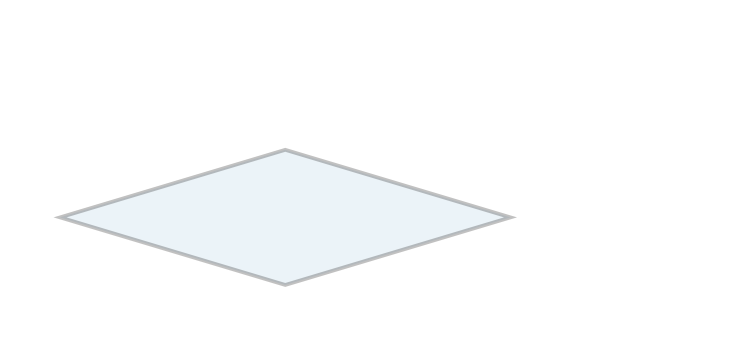
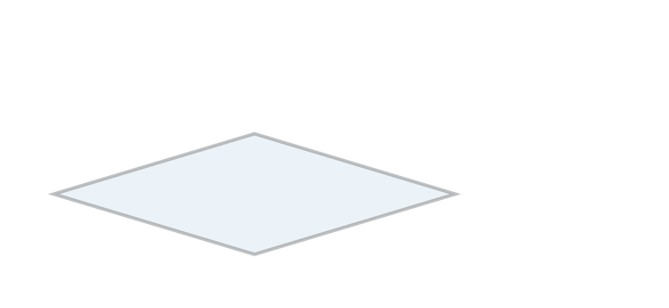

# תת-נושא 11: חישובי היקף ושטח (מקבילית ומעוין)

---

## רמה 1: בניית ביטחון (8 תרגילים)

1. חשבו את שטח המקבילית שבסיסה
$8$
ס"מ וגובהה
$5$
ס"מ.

2. חשבו את שטח המקבילית שבסיסה
$12$
ס"מ וגובהה
$7$
ס"מ.

3. חשבו את שטח המעוין שאלכסוניו
$6$
ס"מ ו-
$8$
ס"מ.

4. חשבו את שטח המעוין שאלכסוניו
$10$
ס"מ ו-
$14$
ס"מ.

5. מעוין שצלעו
$9$
ס"מ.
מה היקפו?

6. מקבילית שצלעותיה
$7$
ס"מ ו-
$5$
ס"מ.
מה היקפה?

7. מעוין שאלכסוניו
$12$
ס"מ ו-
$16$
ס"מ.
חשבו את שטחו ואת היקפו.
(רמז: צלע בעזרת פיתגורס עם מחצית האלכסונים)

8. שטח מקבילית הוא
$60$
ס"מ² ובסיסה
$12$
ס"מ.
מה גובהה?

---

## רמה 2: תרגול שוטף ומשולב (8 תרגילים)

9. שטח מעוין הוא
$48$
ס"מ².
אלכסון אחד הוא
$8$
ס"מ.
מצאו את האלכסון השני.

10. מקבילית שבסיסה
$(x + 3)$
ס"מ וגובהה
$x$
ס"מ.
שטחה
$40$
ס"מ².
מצאו את
$x$.

11. מעוין שצלעו
$13$
ס"מ ואלכסון אחד מודד
$10$
ס"מ.
חשבו את האלכסון השני ואת שטח המעוין.

12. מקבילית ומלבן בעלי אותו בסיס
$10$
ס"מ ואותו גובה
$6$
ס"מ.
השוו את שטחיהם.

13. אלכסוני מעוין הם
$x$
ס"מ ו-
$(x + 6)$
ס"מ.
שטחו
$80$
ס"מ².
מצאו את האלכסונים.

14. מעוין
$ABCD$
שצלעו
$5$
ס"מ ואלכסון אחד מודד
$8$
ס"מ.

א. חשבו את האלכסון השני.

ב. חשבו את שטח המעוין.

15. במקבילית
$ABCD$:
$AB = 15$
ס"מ,
$BC = 13$
ס"מ,
גובה
$h = 12$
ס"מ.

א. חשבו את שטח המקבילית.

ב. חשבו את היקף המקבילית.

16. שטח מעוין הוא
$\frac{2}{3}$
משטח מקבילית שבסיסה
$9$
ס"מ וגובהה
$6$
ס"מ.
אלכסוני המעוין מקיימים
$d_1 = 2d_2$.
מצאו את האלכסונים.

---

## רמה 3: רמת בחינת מה"ט (4 תרגילים)

17. מעוין
$ABCD$:
$AC = 30$
ס"מ,
$BD = 16$
ס"מ.

א. חשבו את שטח המעוין.

ב. חשבו את אורך צלע המעוין.

ג. חשבו את היקף המעוין.

18. מקבילית
$ABCD$:
בסיס
$AB = 14$
ס"מ,
גובה
$h = 9$
ס"מ,
הצלע הנטויה
$BC = 15$
ס"מ.

א. חשבו את שטח המקבילית.

ב. חשבו את היקף המקבילית.

ג. כף הגובה נופלת על
$AB$.
מצאו את המרחק מ-
$B$
לכף הגובה.
(רמז: פיתגורס)

19. נתון מלבן
$ABCD$,
נקודה
$E$
על
$AB$,
נקודה
$F$
על
$CD$,
כך שנוצר מעוין
$EBFD$.
נתון:
$EB = 8.9$
ס"מ ו-
$\angle BFD = 130°$.

א. חשבו את אורכי הצלעות של המלבן
$AB$
ו-
$AD$.

ב. חשבו את שטח המעוין
$EBFD$.

ג. חשבו את שטח שני המשולשים הנותרים (
$\triangle AEF$
ו-
$\triangle CFD$
).

20. בסרטוט
$ABCD$
הוא מעוין,
$EHGF$
הוא מלבן.
$AK = MC = BI = JD = 15$
ס"מ.
$AC = 70$
ס"מ,
$BD = 50$
ס"מ.

א. חשבו את שטח המעוין
$ABCD$.

ב. מצאו את ממדי המלבן
$EHGF$.
(
$EF = AC - 2 \cdot AK$,
$FG = BD - 2 \cdot BI$)

ג. חשבו את שטח המלבן
$EHGF$.

ד. חשבו את שטח המשולש
$AEF$.

---

תשובות סופיות

1.
$40$
ס"מ²
2.
$84$
ס"מ²
3.
$24$
ס"מ²
4.
$70$
ס"מ²
5.
$36$
ס"מ
6.
$24$
ס"מ
7. שטח
$=\frac{12\times16}{2}=96$
ס"מ²; צלע
$=\sqrt{6^2+8^2}=10$
ס"מ; היקף
$=40$
ס"מ
8.
$5$
ס"מ
9.
$\frac{8\times d_2}{2}=48 \Rightarrow d_2=12$
ס"מ
10.
$x(x+3)=40$
; ניסוי:
$x=5 \Rightarrow 40$
✓;
$x=5$
11. מחצית אלכסון א'
$=5$
; שני
$=\sqrt{13^2-5^2}=12$
; אלכסון שני
$=24$
ס"מ; שטח
$=\frac{10\times24}{2}=120$
ס"מ²
12. שניהם
$60$
ס"מ² (שטח = בסיס × גובה)
13.
$\frac{x(x+6)}{2}=80 \Rightarrow x^2+6x-160=0 \Rightarrow x=10$
;
$d_1=10$
,
$d_2=16$
ס"מ
14. א.
$\sqrt{5^2-4^2}=3$
ס"מ; אלכסון שני
$=6$
ס"מ; ב.
$\frac{8\times6}{2}=24$
ס"מ²
15. א.
$180$
ס"מ²; ב.
$56$
ס"מ
16. שטח מקבילית
$=54$
ס"מ²; שטח מעוין
$=36$
ס"מ²;
$\frac{d_1 \cdot d_2}{2}=36$
;
$d_1=2d_2 \Rightarrow d_2^2=36 \Rightarrow d_2=6$
ס"מ,
$d_1=12$
ס"מ
17. א.
$240$
ס"מ²; ב.
$\sqrt{15^2+8^2}=17$
ס"מ; ג.
$68$
ס"מ
18. א.
$126$
ס"מ²; ב.
$58$
ס"מ; ג.
$\sqrt{15^2-9^2}=12$
ס"מ
19. א.
$AB = AE + EB$
;
$\angle BED = 180°-130°=50°$
;
$\angle EBF=50°$
; בעזרת טריגונומטריה ב-
$\triangle EBF$
:
$\sin50°= h/8.9 \Rightarrow h\approx6.8$
ס"מ;
$AD=h\approx6.8$
ס"מ; ב. שטח
$=\frac{1}{2}\times d_1 \times d_2$
(חשב לפי ממדים); ג. שני משולשים ישר-זווית
20. א.
$\frac{70\times50}{2}=1{ }750$
ס"מ²; ב.
$EF=70-30=40$
ס"מ,
$FG=50-30=20$
ס"מ; ג.
$800$
ס"מ²; ד.
$\frac{1}{2}\times15\times\frac{FG}{2}=\frac{1}{2}\times15\times10=75$
ס"מ²... (שטח
$\triangle AEF = \frac{1750-800}{4}=237.5$
ס"מ²)

