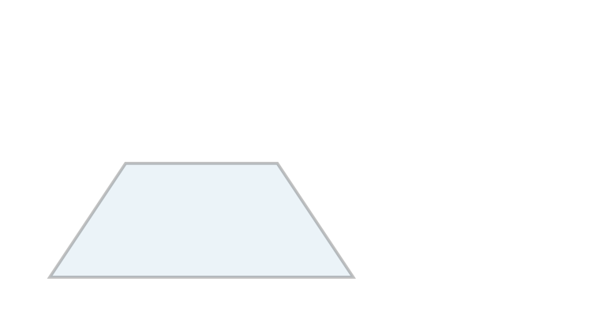
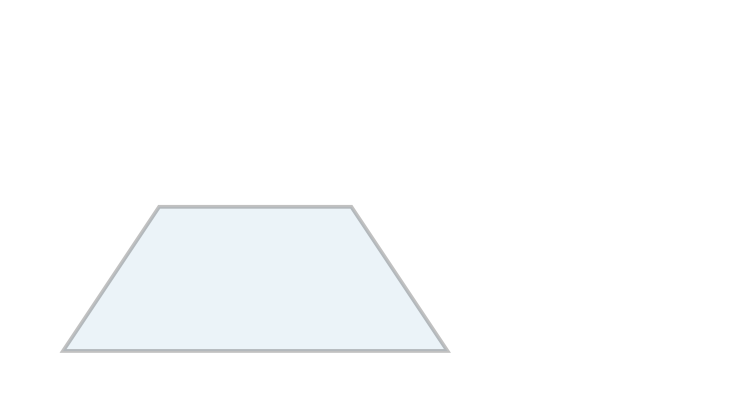
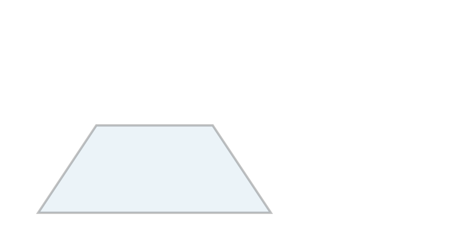
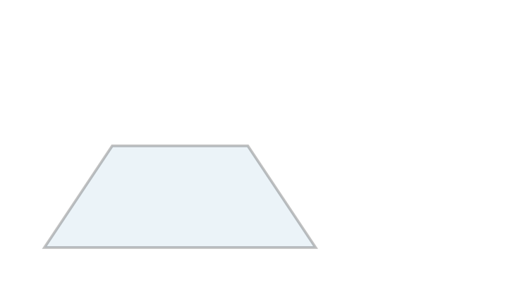
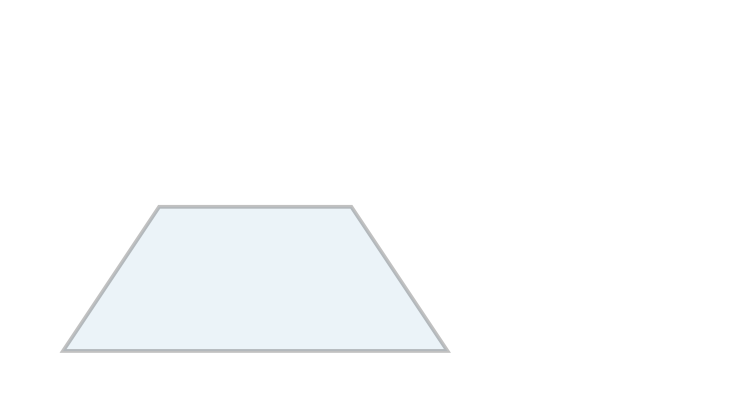
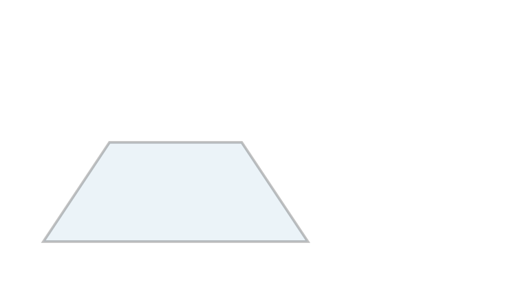
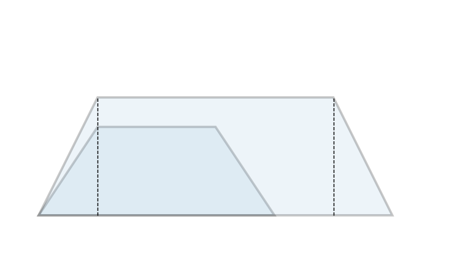
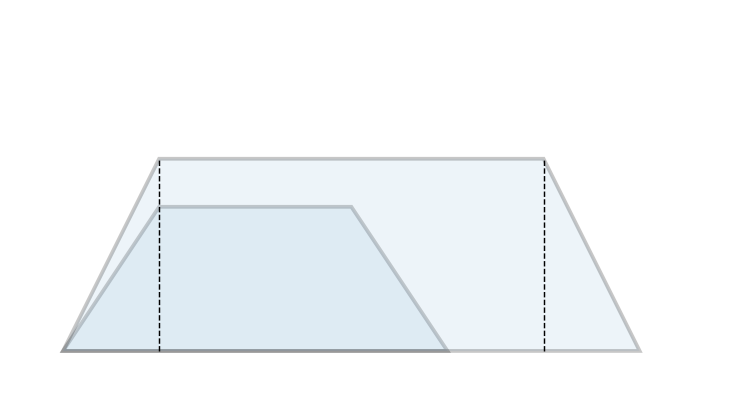
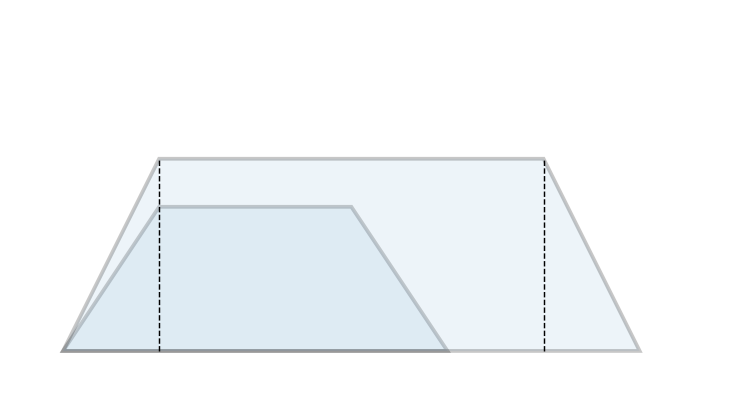
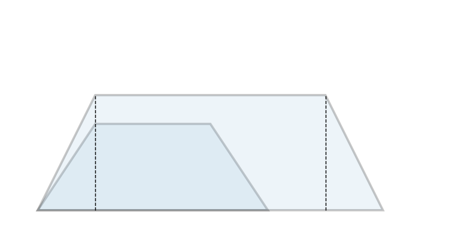

# תת-נושא 12: תכונות הטרפז (בדגש על טרפז שווה-שוקיים) והדלתון

---

## רמה 1: בניית ביטחון (8 תרגילים)

1. ציינו את ההגדרה של טרפז.
כמה זוגות צלעות מקבילות יש לו?

2. בטרפז שווה-שוקיים
$ABCD$
(
$AB \| CD$),
$\angle A = 70°$.
מה גודל
$\angle B$?
(הסבירו: מדוע
$\angle A = \angle B$
בטרפז שווה-שוקיים?)

3. בטרפז
$ABCD$
(
$AB \| CD$),
$\angle A = 60°$.
מה גודל
$\angle D$?
(זוויות חד-צדדיות על
$AD$
משלימות)

4. טרפז שווה-שוקיים עם בסיסים
$AB = 16$
ס"מ ו-
$CD = 8$
ס"מ,
ושוק
$AD = BC = 5$
ס"מ.
חשבו את היקפו.

5. ציינו שתי תכונות מיוחדות של טרפז שווה-שוקיים לעומת טרפז כללי.

6. ציינו את ההגדרה של דלתון (כייט).
אילו צלעות שוות?

7. דלתון עם צלעות
$a = 5$
ס"מ ו-
$b = 8$
ס"מ
(כל זוג צלעות סמוכות שוות).
מה היקפו?

8. בדלתון
$ABCD$,
$AB = AD = 6$
ס"מ ו-
$CB = CD = 9$
ס"מ.
מה היקפו?

---

## רמה 2: תרגול שוטף ומשולב (8 תרגילים)

9. טרפז שווה-שוקיים
$ABCD$:
$AB = 20$
ס"מ (בסיס גדול),
$CD = 8$
ס"מ (בסיס קטן),
$AD = BC = 10$
ס"מ.

א. חשבו את גובה הטרפז.
(רמז: הפרש הבסיסים מחולק לשניים נותן את הצד האופקי של המשולש שנוצר)

ב. חשבו את שטח הטרפז.

10. בטרפז כללי
$ABCD$
(
$AB \| CD$):
$\angle B = 60°$,
$\angle A = 80°$.
מצאו את
$\angle C$
ו-
$\angle D$.

11. טרפז שווה-שוקיים
$ABCD$:
$AD = 12$
ס"מ,
$BC = 48$
ס"מ,
$\angle DCB = 40°$.
האלכסון
$AG \perp BC$
ו-
$DH \perp BC$.

א. חשבו את אורך
$GH = AD$.

ב. חשבו את
$\angle DHA$,
$\angle ADH$
ו-
$\angle DAH$.

12. בדלתון
$ABCD$:
$AB = AD = 5$
ס"מ,
$CB = CD = 7$
ס"מ,
האלכסון
$AC = 8$
ס"מ.

א. הוכיחו שהאלכסון
$BD \perp AC$.

ב. חשבו את
$BO$
כאשר
$O$
נקודת החיתוך.
(רמז: פיתגורס ב-
$\triangle ABO$)

13. בטרפז שווה-שוקיים
$ABCD$,
$AB = 11.8$
ס"מ,
$CD = 20.4$
ס"מ,
$AD = BC = 12.57$
ס"מ.
חשבו את זוויות הטרפז.
(רמז: הפיל גובה וחשב עם טריגונומטריה)

14. בדלתון, האלכסון הארוך מחלק אותו לשני משולשים ישר-זווית.
האלכסון הארוך
$= 10$
ס"מ ואחד האלכסון הקצר
$= 6$
ס"מ.
מצאו את שטח הדלתון.

15. טרפז שווה-שוקיים: בסיס גדול
$b_1$,
בסיס קטן
$b_2$,
שוק
$c$.
הביעו את גובה הטרפז בנוסחה.

16. הוכיחו כי בטרפז שווה-שוקיים, האלכסונים שווים.
(עיינו בצלעות של שני המשולשים שנוצרים)

---

## רמה 3: רמת בחינת מה"ט (4 תרגילים)

17. בסרטוט
$ABCD$
הוא טרפז שווה-שוקיים.
הישרים
$AG$
ו-
$DH$
מאונכים לישר
$BC$.
נתונים:
$AD = 12$
ס"מ,
$BC = 48$
ס"מ,
$\angle DCB = 40°$.

א. חשבו את השטח הצבוע באפור (טרפז
$AGHD$
שבין הגבהות, שהוא מלבן).

ב. חשבו את היקף המשולש
$DHC$.

ג. חשבו את אורך האלכסון
$AC$.
(רמז: מצאו את
$GC$
ואת
$AG$,
ואז השתמשו בפיתגורס ב-
$\triangle AGC$)

18. נתון טרפז
$ABCD$
כללי.
הקטעים
$AE$
ו-
$BF$
מאונכים לצלע
$DC$.
נתונים:
$AB = 17$
מ',
$BC = 51$
מ',
$AD = 14$
מ',
$\angle B = 60°$.

א. חשבו את
$BF$
(גובה הטרפז).
(
$BF = BC \cdot \sin 60°$)

ב. חשבו את הבסיס הגדול
$DC$.

ג. חשבו את שטח הטרפז
$ABCD$.

19. נתון טרפז שווה-שוקיים
$ABCD$:
$AB = 11.8$
ס"מ,
$CD = 20.4$
ס"מ,
$AD = BC = 12.57$
ס"מ.

א. חשבו את גובה הטרפז.

ב. חשבו את שטח ואת היקף המשולש
$ACD$.

ג. מה גודל הזוויות
$\angle ACD$
ו-
$\angle ADC$?

20. נתון טרפז
$ABCD$
(
$AB \| CD$):
$AB = 26$
ס"מ,
$CD = 10$
ס"מ,
$AD = BC = 13$
ס"מ (שווה-שוקיים).

א. חשבו את גובה הטרפז.

ב. חשבו את שטח הטרפז.

ג. חשבו את היקף הטרפז.

ד. חשבו את זוויות הטרפז.

---

תשובות סופיות

1. טרפז: מרובע עם זוג אחד בלבד של צלעות מקבילות (הבסיסים)
2.
$\angle B = 70°$
(זוויות הבסיס שוות בטרפז שווה-שוקיים)
3. $\angle D = 180°-60°=120°$
4.
$16+8+5+5=34$
ס"מ
5. (1) הבסיסים שוני-האורך אבל שוקיים שווים; (2) אלכסונים שווים; (3) זוויות הבסיס שוות
6. דלתון: מרובע עם שני זוגות של צלעות סמוכות שוות
7.
$2(5+8)=26$
ס"מ
8.
$2(6+9)=30$
ס"מ
9. א. הפרש
$=\frac{20-8}{2}=6$
ס"מ; גובה
$=\sqrt{10^2-6^2}=8$
ס"מ; ב.
$\frac{1}{2}(20+8)\times8=112$
ס"מ²
10. $\angle C = 180°-60°=120°$; $\angle D = 180°-80°=100°$
11. א.
$GH=12$
ס"מ; ב.
$\angle DHA=90°$
;
$\angle ADH=\angle DCB=40°$
;
$\angle DAH=50°$
12. א. בדלתון האלכסון
$AC$
הוא ציר סימטריה;
$BD\perp AC$
; ב.
$BO=\sqrt{5^2-4^2}=3$
ס"מ
13. הפרש בסיסים
$= \frac{20.4-11.8}{2}=4.3$
ס"מ;
$\cos\angle D = \frac{4.3}{12.57}\approx0.342$
;
$\angle D\approx70°$
; זוויות
$70°$
,
$70°$
,
$110°$
,
$110°$
14. שטח
$= \frac{1}{2}\times10\times6=30$
ס"מ²
15. $h = \sqrt{c^2 - \left(\frac{b_1-b_2}{2}\right)^2}$
16. ב-
$\triangle ABD$
ו-
$\triangle ABC$
:
$AB$
משותף,
$AD=BC$
,
$\angle DAB=\angle CBA$
; לכן חופפים;
$BD=AC$
✓
17. א.
$GH=AD=12$
ס"מ;
$AG = DH$
:
$\sin40°=\frac{AG}{DC-AD/... }$
– ב-
$\triangle BGC$
:
$\tan40°=\frac{AG}{GC}$
;
$GC=\frac{48-12}{2}=18$
ס"מ;
$AG=18\tan40°\approx15.1$
ס"מ; שטח
$AGHD=12\times15.1\approx181$
ס"מ²; ב.
$HC=18$
ס"מ,
$DH=AG\approx15.1$
ס"מ,
$DC=12$
ס"מ; היקף
$\approx45.1$
ס"מ; ג.
$AC=\sqrt{18^2+15.1^2}\approx23.5$
ס"מ
18. א.
$BF=51\sin60°=51\times\frac{\sqrt{3}}{2}\approx44.2$
מ'; ב.
$FC=51\cos60°=25.5$
מ';
$AE\parallel BF$
:
$AE=AD\sin\angle ADE$
...;
$DC=AB+FC-AE\cos...$
; קישור לנתוני השאלה:
$DC\approx17+25.5+7=...$
; ג. שטח
$=\frac{1}{2}(AB+DC)\times h$
19. א. הפרש
$=\frac{20.4-11.8}{2}=4.3$
ס"מ; גובה
$=\sqrt{12.57^2-4.3^2}\approx12$
ס"מ; ב. שטח
$ACD=\frac{1}{2}\times20.4\times12=122.4$
ס"מ²; היקף
$=12.57+20.4+\sqrt{12^2+4.3^2}$
; ג. בדומה לחישוב הזוויות
20. א. הפרש
$=\frac{26-10}{2}=8$
ס"מ; גובה
$=\sqrt{13^2-8^2}=\sqrt{105}\approx10.25$
ס"מ; ב.
$\frac{1}{2}(26+10)\times10.25\approx184.4$
ס"מ²; ג.
$26+10+13+13=62$
ס"מ; ד.
$\cos\angle B=\frac{8}{13}$
;
$\angle B\approx52.1°$
;
$\angle A\approx52.1°$
;
$\angle C=\angle D\approx127.9°$

