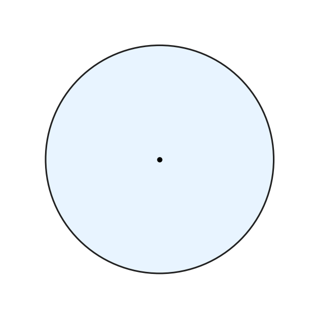

# תת-נושא 13: תכונות המעגל (רדיוס, קוטר)

---

## רמה 1: בניית ביטחון (8 תרגילים)

1. מעגל שרדיוסו
$5$
ס"מ.
מה קוטרו?

2. מעגל שקוטרו
$18$
ס"מ.
מה רדיוסו?

3. האם כל נקודות המעגל מרוחקות מהמרכז באותו מרחק?
מה שם המרחק הזה?

4. רדיוס מעגל הוא
$r$.
כתבו נוסחה לקוטר.

5. נקודה
$A$
נמצאת על מעגל שמרכזו
$O$
ורדיוסו
$6$
ס"מ.
מה המרחק
$OA$?

6. שתי נקודות
$A$
ו-
$B$
נמצאות על מעגל שמרכזו
$O$.
האם
$OA = OB$?
מדוע?

7. קוטר מעגל הוא
$14$
ס"מ.
נקודה
$P$
נמצאת על המעגל.
מה המרחק מ-
$P$
למרכז?

8. מהו ההבדל בין מיתר למעגל לבין קוטר?

---

## רמה 2: תרגול שוטף ומשולב (8 תרגילים)

9. שני מעגלים קונצנטריים (מרכז משותף
$O$).
רדיוס המעגל הגדול
$= 10$
ס"מ,
רדיוס הקטן
$= 6$
ס"מ.
מה רוחב הרצועה ביניהם?

10. מעגל גדול שרדיוסו
$R$
ומעגל קטן שרדיוסו
$r$.
שניהם קונצנטריים.
מה היחס בין הקוטרים שלהם?

11. נקודה
$A$
נמצאת על מעגל שמרכזו
$O$.
$OA = 3x - 2$
ס"מ.
מעגל אחר שרדיוסו
$x + 4$
ס"מ.
אם שני המעגלים שווים (אותו רדיוס), מצאו את
$x$.

12. שני קטרים
$AB$
ו-
$CD$
של אותו מעגל.
מה המרחק מהמרכז לכל נקודה (A, B, C, D)?

13. ריבוע
$ABCD$
שצלעו
$10$
ס"מ.
בתוכו מעגל חסום שקוטרו שווה לצלע הריבוע.
מה רדיוס המעגל?

14. מעגל שרדיוסו
$r$.
המרכז ב-
$O$.
קטע
$AB$
הוא מיתר שאורכו שווה לרדיוס.
מה סוג המשולש
$OAB$?

15. שלושה מעגלים עם אותו מרכז.
רדיוסיהם
$3$,
$6$
ו-
$9$
ס"מ.
כמה פעמים גדול כל קוטר מקודמו?

16. מעגל חיצוני (רדיוס
$R$
) ומעגל פנימי (רדיוס
$r$)
שניהם קונצנטריים.
אם
$R = 3r$,
הביעו את רוחב הרצועה ביניהם בנוסחה.

---

## רמה 3: רמת בחינת מה"ט (4 תרגילים)

17. שני מעגלים קונצנטריים.
רדיוס הגדול
$= 30$
ס"מ,
רדיוס הקטן
$= 20$
ס"מ.

א. חשבו את הפרש הרדיוסים.

ב. חשבו את הפרש הקוטרים.

ג. מה יחס הרדיוסים (גדול לקטן)?

ד. נגדיל פי
$2$
את הרדיוס של המעגל הגדול.
מה הרדיוס החדש?
מה יחס הרדיוסים החדש?

18. מעגל שרדיוסו
$r = 5$
ס"מ.
נקודה
$P$
נמצאת על המעגל.
נקודה
$Q$
נמצאת על הקוטר כך ש-
$OQ = 2$
ס"מ.

א. מה המרחק
$OP$?

ב. האם
$Q$
נמצאת בתוך המעגל, על המעגל, או מחוצה לו?

ג. מה המרחק המרבי האפשרי מ-
$P$
ל-
$Q$?

19. נקודה
$M$
נמצאת בתוך מעגל שרדיוסו
$8$
ס"מ.
$OM = 3$
ס"מ.
מיתר
$AB$
עובר דרך
$M$.

א. מה הטווח האפשרי לאורך
$AM + MB$?

ב. מה האורך המרבי של מיתר
$AB$?
(מיתר עובר דרך המרכז)

ג. מה האורך המינימלי של מיתר העובר דרך
$M$?

20. ריבוע
$ABCD$
שצלעו
$2r$.
בתוכו מעגל חסום שרדיוסו
$r$.

א. הביעו את שטח המעגל כפונקציה של
$r$.

ב. הביעו את שטח הריבוע כפונקציה של
$r$.

ג. מה שטח האזור שבין המעגל לריבוע?

ד. אם
$r = 7$
ס"מ, חשבו את כל השטחים.

---

תשובות סופיות

1.
$10$
ס"מ.
2.
$9$
ס"מ.
3. כן; המרחק הוא הרדיוס.
4.
$d=2r$.
5.
$OA=6$
ס"מ.
6. כן – כי שתיהן רדיוסים של אותו מעגל.
7.
$7$
ס"מ (רדיוס).
8. קוטר הוא המיתר הארוך ביותר; מיתר כללי קצר ממנו או שווה לו.
9.
$4$
ס"מ.
10. יחס הקוטרים שווה ליחס הרדיוסים
$\frac{R}{r}$.
11.
$x=3$.
12. המרחק מ-
$O$
לכל אחת מנקודות
$A,B,C,D$
שווה לרדיוס המעגל.
13.
$r=5$
ס"מ.
14. משולש שווה-צלעות.
15. מ-
$6$
ל-
$12$
הקוטר גדל פי
$2$
; מ-
$12$
ל-
$18$
הקוטר גדל פי
$\frac{3}{2}$.
16.
$2r$
(או
$2(R-r)$
כשמרשמים במפורש).
17. א. פרש רדיוסים
$10$
ס"מ; ב. פרש קוטרים
$20$
ס"מ; ג.
$3:2$;
ד. רדיוס חדש
$60$
ס"מ, יחס
$3:1$.
18. א.
$OP=5$
ס"מ; ב. על המעגל; ג. מרחק מרבי
$7$
ס"מ.
19. א. אורך המיתר אינו קבוע אך חייב להתאים למעגל; ב. מיתר מקסימלי
$16$
ס"מ; ג. מיתר מינימלי דרך
$M$
ניצב ל-
$OM$.
20. א.
$\pi r^2$;
ב.
$4r^2$;
ג.
$4r^2-\pi r^2$;
ד. עבור
$r=7$:
מעגל
$49\pi\approx153.9$
ס"מ², ריבוע
$196$
ס"מ², המפרש ביניהם כ-
$42.1$
ס"מ².

