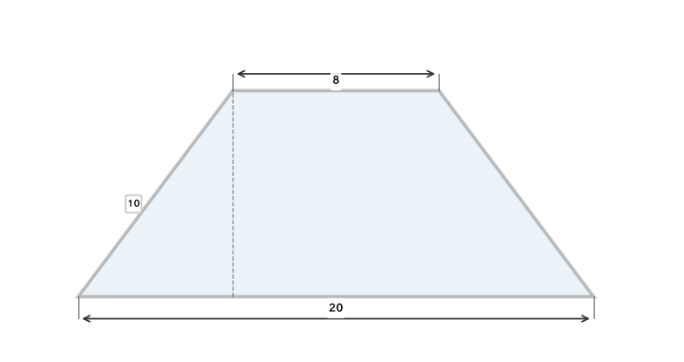
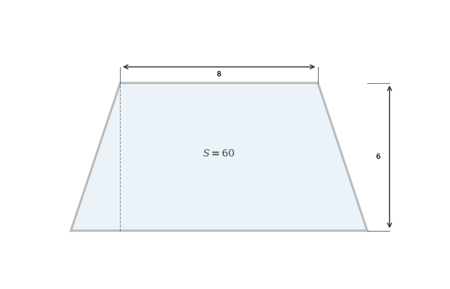
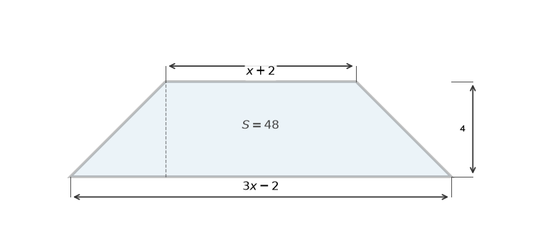
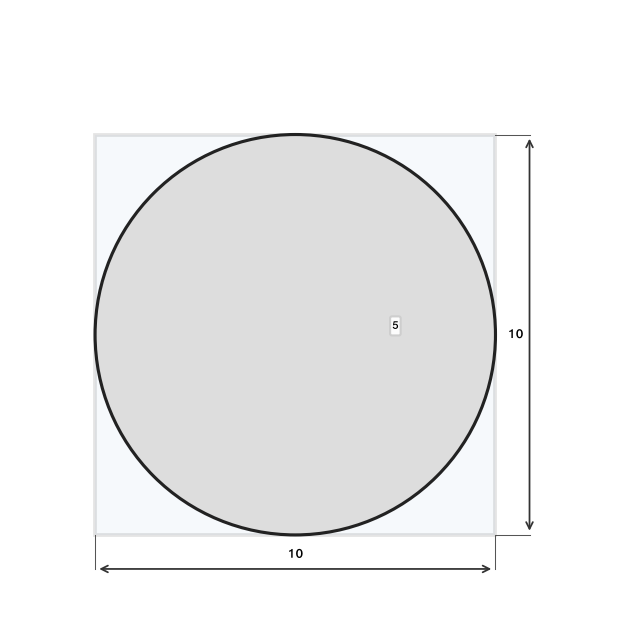
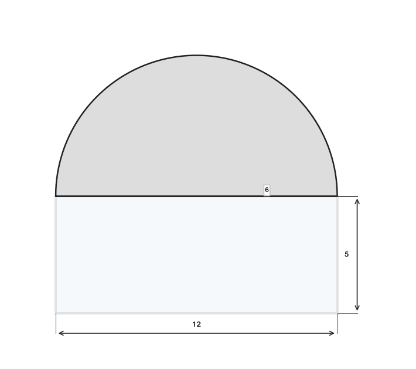
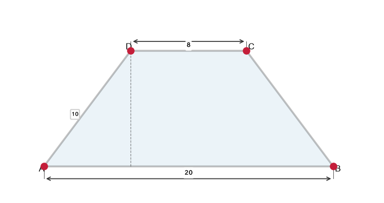
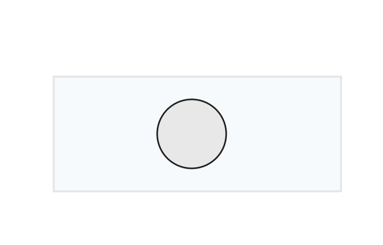
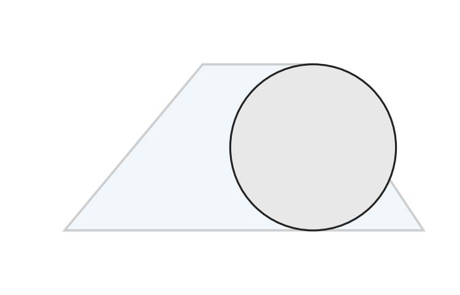

# תת-נושא 14: חישובי היקף ושטח (טרפז, דלתון ומעגל)

---

## רמה 1: בניית ביטחון (8 תרגילים)

1. חשבו את שטח הטרפז שבסיסיו המקבילים הם
$6$
ס"מ ו-
$10$
ס"מ, וגובהו
$4$
ס"מ.

2. חשבו את שטח הטרפז שבסיסיו המקבילים הם
$8$
ס"מ ו-
$14$
ס"מ, וגובהו
$5$
ס"מ.

3. מעגל שרדיוסו
$7$
ס"מ.
חשבו את שטחו ואת היקפו
(השאירו עם
$\pi$).

4. מעגל שרדיוסו
$5$
ס"מ.
חשבו את שטחו ואת היקפו.

5. דלתון שאלכסוניו
$6$
ס"מ ו-
$10$
ס"מ.
חשבו את שטחו.

6. דלתון שאלכסוניו
$8$
ס"מ ו-
$12$
ס"מ.
חשבו את שטחו.

7. טרפז שבסיסיו
$8$
ס"מ ו-
$12$
ס"מ, ושוקיו (הצלעות הלא-מקבילות) שניהם
$5$
ס"מ.
חשבו את היקפו.

8. שטח מעגל הוא
$36\pi$
ס"מ².
מה רדיוסו?

---

## רמה 2: תרגול שוטף ומשולב (8 תרגילים)

9. טרפז שווה-שוקיים שבסיסיו
$8$
ס"מ ו-
$20$
ס"מ, ושוקיו
$10$
ס"מ.
חשבו את גובה הטרפז ואת שטחו.

10. היקף מעגל הוא
$20\pi$
ס"מ.
חשבו את רדיוסו ואת שטחו.

11. שטח מעגל הוא
$64\pi$
ס"מ².
הוכפל הרדיוס פי
$3$.
פי כמה גדל שטח המעגל?

12. שטח טרפז הוא
$60$
ס"מ², גובהו
$6$
ס"מ ובסיס אחד מודד
$8$
ס"מ.
מצאו את הבסיס השני.

13. בסיסי טרפז הם
$(x + 2)$
ס"מ ו-
$(3x - 2)$
ס"מ, וגובהו
$4$
ס"מ.
שטחו
$48$
ס"מ².
מצאו את
$x$
ואת אורכי הבסיסים.

14. ריבוע שצלעו
$10$
ס"מ.
בתוכו מעגל חסום שרדיוסו
$5$
ס"מ.
חשבו את שטח האזור שבין המעגל לריבוע.

15. חצי מעגל שרדיוסו
$6$
ס"מ נבנה על בסיס מלבן שאורכו
$12$
ס"מ ורוחבו
$5$
ס"מ.
חשבו את שטח הצורה המורכבת הכוללת.

16. מעגל שרדיוסו הוכפל פי
$2$.
חשבו:
א. פי כמה גדל שטחו?
ב. פי כמה גדל היקפו?

---

## רמה 3: רמת בחינת מה"ט (4 תרגילים)

17. שני מעגלים קונצנטריים (מרכז משותף
$O$).
רדיוס הגדול
$= 30$
ס"מ,
רדיוס הקטן
$= 20$
ס"מ.

א. חשבו את השטח הצבוע באפור (בין שני המעגלים).

ב. חשבו את ההיקף של המעגל החיצוני.

ג. נגדיל פי
$2$
את הרדיוס של המעגל הגדול.
פי כמה יגדל שטח המעגל הגדול?

18. טרפז שווה-שוקיים
$ABCD$:
$AB = 20$
ס"מ (הבסיס הגדול),
$CD = 8$
ס"מ (הבסיס הקטן),
$AD = BC = 10$
ס"מ.

א. חשבו את גובה הטרפז.

ב. חשבו את שטח הטרפז.

ג. חשבו את היקף הטרפז.

19. מגרש מלבני שאורכו
$20$
מ' ורוחבו
$10$
מ'.
בתוכו בריכה עגולה שרדיוסה
$3$
מ'.

א. חשבו את שטח המגרש הכולל.

ב. חשבו את שטח הבריכה (עם
$\pi$).

ג. חשבו את שטח המגרש שמחוץ לבריכה.

ד. עלות ריצוף השטח שמחוץ לבריכה:
$50$
₪ למ"ר. מה העלות הכוללת (עם
$\pi$)?

20. טרפז
$ABCD$
(שבו
$AB \| CD$):
$AB = 26$
ס"מ,
$CD = 10$
ס"מ,
$AD = BC = 13$
ס"מ (שווה-שוקיים).
כמו כן, בתוך הטרפז נמצא מעגל שקוטרו שווה לגובה הטרפז.

א. חשבו את גובה הטרפז.

ב. חשבו את שטח הטרפז.

ג. חשבו את שטח המעגל.

ד. חשבו את שטח הטרפז שמחוץ למעגל.

---

תשובות סופיות

1.
$32$
ס"מ².

2.
$55$
ס"מ².

3. שטח
$49\pi$
ס"מ²; היקף
$14\pi$
ס"מ.

4. שטח
$25\pi$
ס"מ²; היקף
$10\pi$
ס"מ.

5.
$30$
ס"מ².

6.
$48$
ס"מ².

7. היקף
$30$
ס"מ.

8.
$r=6$
ס"מ.

9. גובה
$8$
ס"מ; שטח
$112$
ס"מ².

10.
$r=10$
ס"מ; שטח
$100\pi$
ס"מ².

11. פי
$9$.

12.
$b_2=12$
ס"מ.

13.
$x=6$;
בסיסים
$8$
ס"מ ו-
$16$
ס"מ.

14.
$100-25\pi$
ס"מ².

15.
$60+18\pi$
ס"מ².

16.
א.
השטח גדל פי
$4$;
ב.
ההיקף גדל פי
$2$.

17.
א.
$500\pi$
ס"מ²;
ב.
$60\pi$
ס"מ;
ג.
פי
$4$.

18.
א.
גובה
$8$
ס"מ;
ב.
שטח
$112$
ס"מ²;
ג.
היקף
$48$
ס"מ.

19.
א.
$200$
מ"ר;
ב.
$9\pi$
מ"ר;
ג.
$(200-9\pi)$
מ"ר;
ד.
$50(200-9\pi)$
₪.

20.
א.
גובה
$\sqrt{105}$
ס"מ;
ב.
שטח טרפז
$18\sqrt{105}$
ס"מ²;
ג.
שטח מעגל
$\frac{105\pi}{4}$
ס"מ²;
ד.
פרש
$18\sqrt{105}-\frac{105\pi}{4}$
ס"מ².

