# תת-נושא 15: פירוק צורות מורכבות לצורות פשוטות

---

## רמה 1: בניית ביטחון (8 תרגילים)

1. צורה בצורת L מורכבת משני מלבנים.
מלבן עליון:
$6 \times 3$
ס"מ.
מלבן תחתון:
$10 \times 4$
ס"מ.
חשבו את השטח הכולל.

2. ריבוע גדול שצלעו
$10$
ס"מ.
ממנו נחתך מלבן:
$3 \times 4$
ס"מ.
חשבו את שטח הצורה הנותרת.

3. צורה בצורת T:
מלבן אופקי
$12 \times 3$
ס"מ ועליו מלבן אנכי
$4 \times 6$
ס"מ.
חשבו את השטח הכולל.

4. ריבוע שצלעו
$8$
ס"מ.
על צלעו העליונה נבנה משולש שבסיסו
$8$
ס"מ וגובהו
$5$
ס"מ.
חשבו את השטח הכולל.

5. מלבן
$10 \times 6$
ס"מ.
מוסרים ממנו שני משולשים זהים בפינות שמאל וימין.
כל משולש: בסיס
$4$
ס"מ, גובה
$6$
ס"מ.
חשבו את שטח הצורה שנותרה.

6. מלבן
$8 \times 5$
ס"מ.
בו מוכנס מלבן קטן
$3 \times 2$
ס"מ (לא בפינה).
חשבו את שטח "המסגרת" שנותרה.

7. ריבוע
$12 \times 12$
ס"מ.
ממנו מוסרים ארבעה ריבועים קטנים (אחד בכל פינה) שצלעם
$2$
ס"מ.
חשבו את שטח הצורה שנותרה.

8. צורה מורכבת:
חצי-מעגל שרדיוסו
$4$
ס"מ בנוי על גג מלבן שממדיו
$8 \times 5$
ס"מ.
חשבו את שטח הצורה (עם
$\pi$).

---

## רמה 2: תרגול שוטף ומשולב (8 תרגילים)

9. צורה בצורת U:
מלבן גדול
$12 \times 10$
ס"מ, ממנו הוצא מלבן פנימי
$8 \times 6$
ס"מ מהחלק העליון.
חשבו את שטח הצורה ואת היקפה.

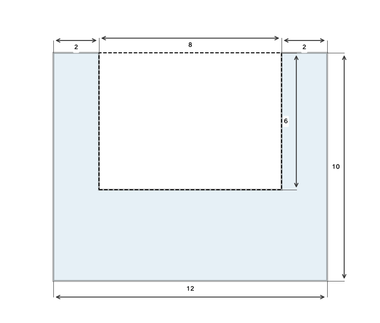
10. מגרש בצורת L:
חלק א':
$15 \times 8$
מ'.
חלק ב':
$7 \times 5$
מ' (מחובר לאחד מהצלעות של חלק א').
חשבו את השטח הכולל ואת היקף הצורה.

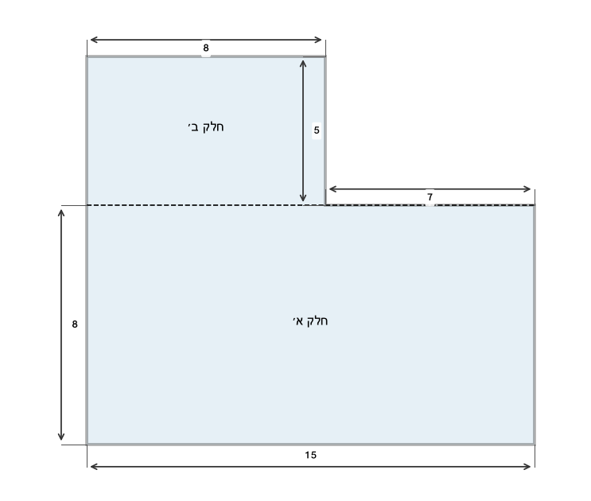
11. ריבוע
$a \times a$
ס"מ.
מוסרים ממנו ריבוע
$b \times b$
ס"מ (
$b < a$).
הביעו את שטח הצורה הנותרת ואת ההיקף.

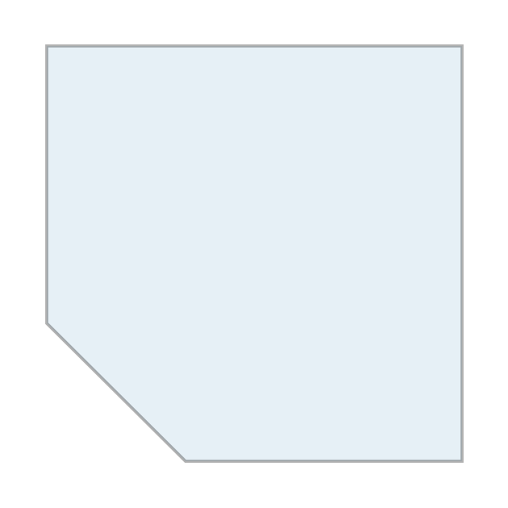
12. מסגרת מלבנית:
מלבן חיצוני
$20 \times 15$
ס"מ.
מלבן פנימי (חלל)
$14 \times 9$
ס"מ.
חשבו את שטח המסגרת.

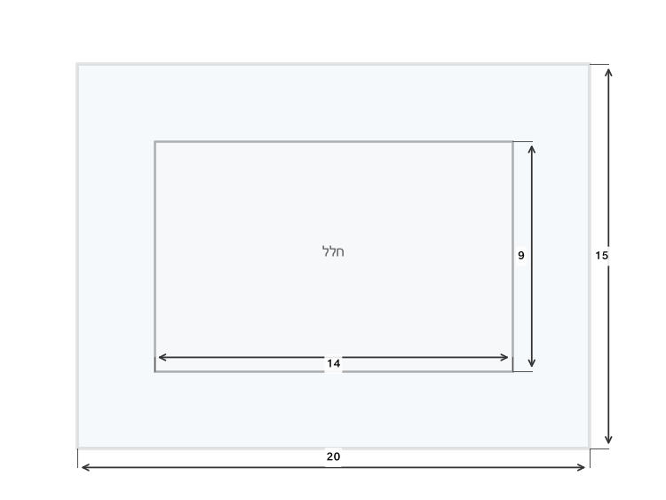
13. בניין בהיתוך תוכנית:
מלבן
$30 \times 20$
מ'.
שני חלחולים מלבניים:
- כניסה:
$4 \times 3$
מ' (בולטת מהחזית).
- קיר חיצוני:
$6 \times 2$
מ' (בולט מהצד).
חשבו את השטח הכולל של הבניין.

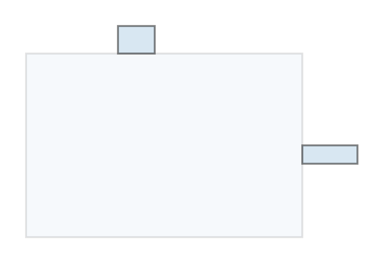
14. ריבוע
$16 \times 16$
ס"מ.
בו שמונה ריבועים קטנים
$2 \times 2$
ס"מ (ארבעה מוסרים, ארבעה נשארים).
חשבו את שטח הצורה אם מוסרים את הריבועים מכל פינה.

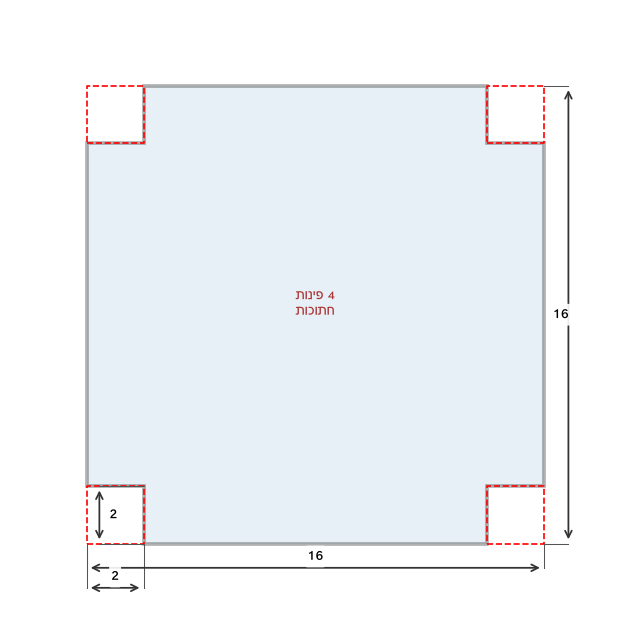
15. מחומש (צורה עם חמישה צלעות):
מלבן
$10 \times 6$
ס"מ ועליו משולש שקודקוד על גג המלבן.
גובה המשולש
$4$
ס"מ.
חשבו את השטח הכולל.

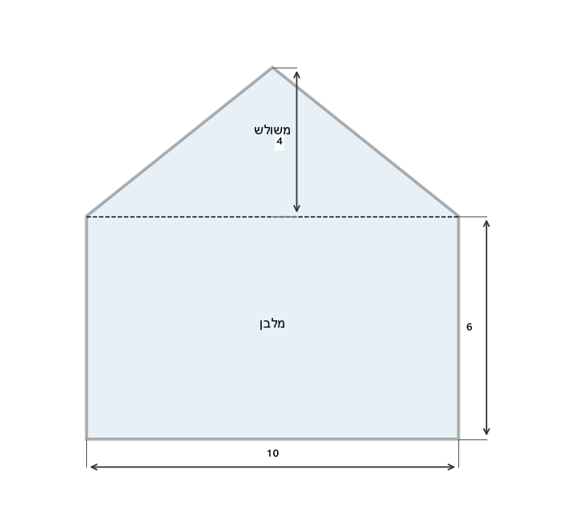
16. ציפוי חלון:
מסגרת חיצונית ריבועית
$60 \times 60$
ס"מ.
ארבעה חלונות מרובעים שווים בגודל
$15 \times 15$
ס"מ כל אחד (לוח יחיד).
חשבו את שטח המסגרת (בלי החלונות).

---

## רמה 3: רמת בחינת מה"ט (4 תרגילים)

17. בסרטוט
$CDFG$
הוא מלבן.
$AB \| GC$,
$BC = AG = 5$
מ',
$CD = 22$
מ',
$AB = 20$
מ'.
$DF$
מהווה
$60\%$
מ-
$AB$.
$DE = FE$
וכל אחד מהם הוא
$35\%$
מ-
$AB$.

א. חשבו את הזווית
$A$.

ב. חשבו את הזווית
$E$.

ג. חשבו את השטח של כל אחד משלושת החדרים:
חדר
$ABCG$,
חדר
$ADEF$
(משולש?),
חדר
$GCFD$
פחות
$ADEF$.

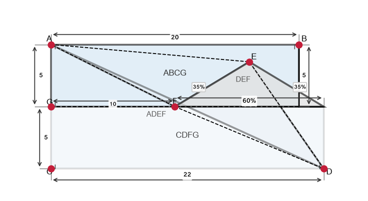
18. תוכנית בית:
מלבן
$12 \times 8$
מ'.
מוסרים:
- חצי-עיגול מהחזית (קשת הכניסה):
רדיוס
$2$
מ'.
- ריבוע המטבח:
$3 \times 3$
מ' מהפינה האחורית שמאל.

א. חשבו את שטח הבית (ללא הוצאת הפינות).

ב. חשבו את שטח הבית שנותר.

ג. חשבו את היקף הבית (מסביב לתוכנית המורכבת).

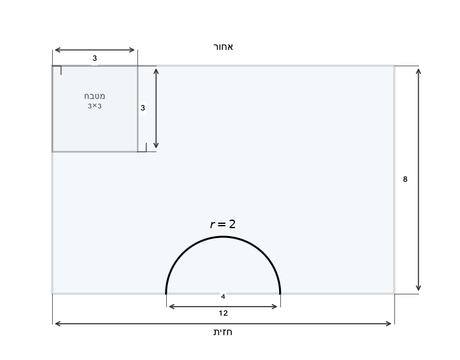
19. לפניכם סקיצה של מתחם.
הגבול הכולל הוא מלבן
$A(0,0)$,
$B(10,0)$,
$C(10,8)$,
$D(0,8)$.
בריכה: ריבוע
$P(2,2)$,
$Q(6,2)$,
$R(6,6)$,
$S(2,6)$.
שטח א': מלבן
$2 \times 8$
מ' (עמודה שמאלית שמחוץ לבריכה).
שטח ב': מלבן
$4 \times 8$
מ' (עמודה ימנית).

א. חשבו את שטח הכולל של הגבול.

ב. חשבו את שטח הבריכה.

ג. חשבו את שטח שטח ב'.

ד. חשבו את שטח שטח ג' (מה שנשאר).

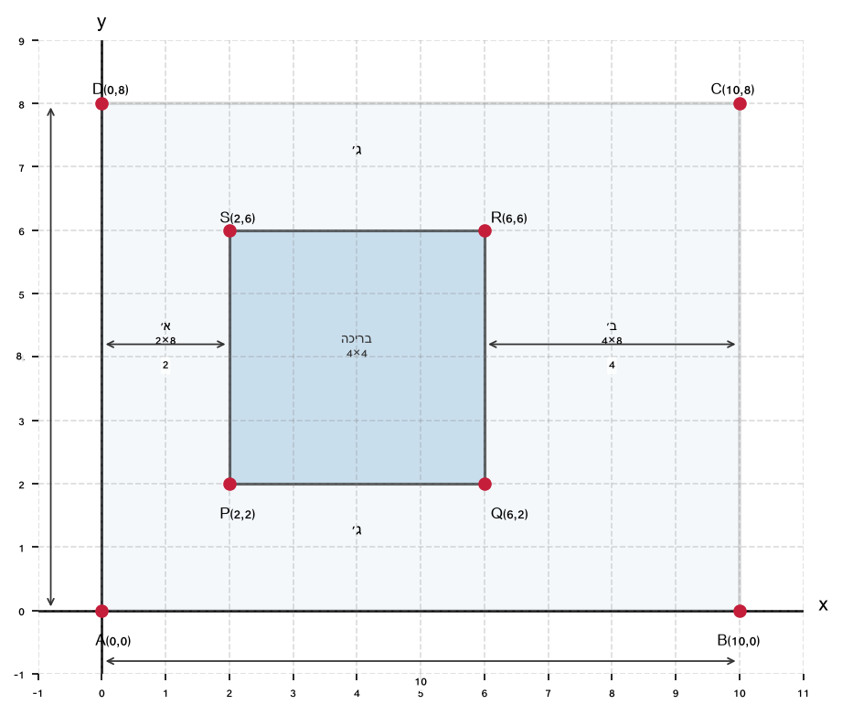
20. מפעל שמתארת קירותיו החיצוניים:
$CDFG$
הוא מלבן שממדיו
$CD = 22$
מ' ו-
$GC = 5$
מ' (גובה).
$AB = 20$
מ' (מקביל ל-
$GC$).
$BC = AG = 5$
מ'.
$DF = 60\%$
מ-
$AB = 12$
מ'.
$DE = FE = 35\%$
מ-
$AB = 7$
מ' כל אחד.

א. חשבו את שטח המלבן
$CDFG$.

ב. חשבו את שטח חדר
$ABCG$.

ג. חשבו את שטח המשולש
$AEF$
(חדר אמצעי).

ד. חשבו את שטח חדר
$GCFD$
פחות שני החדרים האחרים.

---

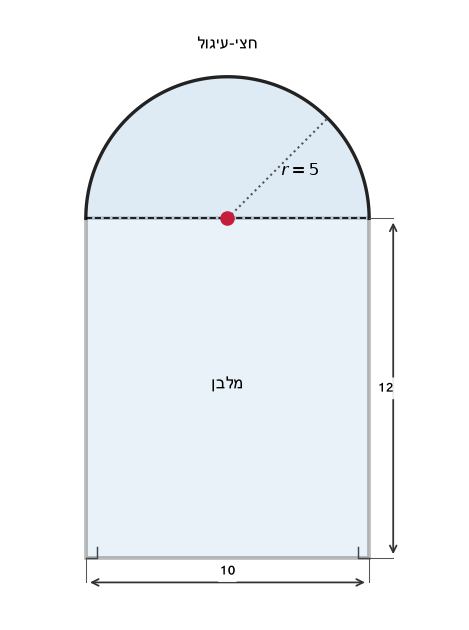

תשובות סופיות

1.
$58$
ס"מ².
2.
$88$
ס"מ².
3.
$60$
ס"מ².
4.
$84$
ס"מ².
5.
$36$
ס"מ².
6.
$34$
ס"מ².
7.
$128$
ס"מ².
8.
$40+8\pi$
ס"מ².
9. שטח
$72$
ס"מ²; היקף לפי שרטוט החיצון.
10. שטח כולל
$155$
מ"ר; היקף לפי חיבור החלקים.
11. שטח
$a^2-b^2$;
היקף
$4a$
או משתנה לפי מיקום החיתוך.
12.
$174$
ס"מ².
13.
$624$
מ"ר.
14.
$240$
ס"מ².
15.
$80$
ס"מ².
16.
$2{ }700$
ס"מ².
17. לפי הממדים בשרטוט: זוויות מתוך
$35\%$
מ-
$AB$;
שטחי חדרים בפירוק למלבנים ומשולש.
18. א. שטח שלם
$96$
מ"ר לפני חיתוך; ב. אחרי הפחתות; ג. היקף חיצוני.
19. א. שטח
$80$
יח"ר;
ב. בריכה
$16$
יח"ר;
ג. שטח ב'
$32$
יח"ר;
ד. נשאר
$32$
יח"ר.
20. א. שטח
$110$
מ"ר;
ב. שטח
$100$
מ"ר;
ג. וד. לפי חלוקת החדרים בשרטוט.

