# תת-נושא 16: התמודדות עם שאלות מה"ט הכוללות "שטחים צבועים באפור" ויחסי צלעות

---

## רמה 1: בניית ביטחון (8 תרגילים)

1. מלבן
$ABCD$:
$AB = 10$
ס"מ,
$BC = 6$
ס"מ.
נקודה
$E$
על
$AB$
כך ש-
$AE = 4$
ס"מ.
חשבו את שטח המשולש
$AEC$.

2. ריבוע
$ABCD$
שצלעו
$8$
ס"מ.
נקודה
$E$
על
$BC$
כך ש-
$BE = 3$
ס"מ.
חשבו את שטח המשולש
$ABE$.

3. מלבן
$ABCD$:
$AB = 12$
ס"מ,
$AD = 5$
ס"מ.
נקודה
$E$
אמצע
$AB$.
חשבו את שטח המשולש
$AED$.

4. ריבוע שצלעו
$10$
ס"מ.
האלכסון מחלק אותו לשני משולשים שווים.
מה שטח כל משולש?

5. מלבן
$ABCD$:
$AB = 9$
ס"מ,
$BC = 4$
ס"מ.
האלכסון
$AC$
מחלק אותו לשני משולשים.
מה שטח כל משולש?

6. נקודה
$E$
על
$CD$
של מלבן
$ABCD$
כך ש-
$DE = 2 \cdot EC$.
אם
$CD = 9$
ס"מ, מצאו את
$DE$
ואת
$EC$.

7. ריבוע גדול שצלעו
$10$
ס"מ.
בתוכו ריבוע קטן שצלעו
$6$
ס"מ (מרכזים לא בהכרח משותפים).
מה שטח האזור הצבוע שבין שני הריבועים?

8. מלבן
$ABCD$:
$AB = 16$
ס"מ,
$BC = 9$
ס"מ.
נקודה
$M$
אמצע האלכסון.
מה שטח המשולש
$ABM$?

---

## רמה 2: תרגול שוטף ומשולב (8 תרגילים)

9. מלבן
$ABCD$:
$AB = 18$
ס"מ,
$BC = 10$
ס"מ.
נקודה
$E$
על
$AB$
כך ש-
$AE:EB = 1:2$.

א. מצאו את
$AE$
ואת
$EB$.

ב. חשבו את שטח המשולש
$AEC$.

ג. חשבו את שטח הטרפז
$EBCD$.

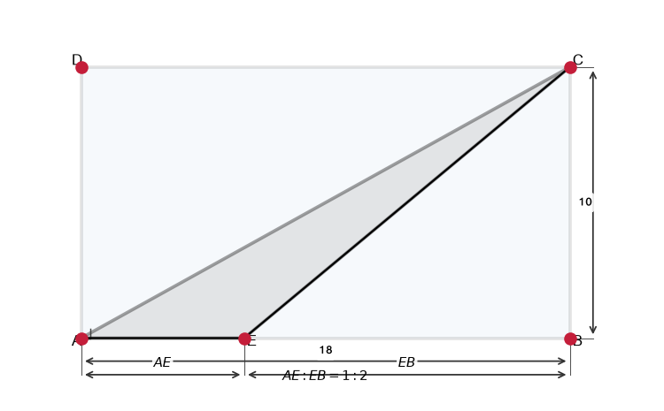
10. ריבוע
$ABCD$
שצלעו
$12$
ס"מ.
נקודה
$E$
על
$BC$
כך ש-
$BE:EC = 1:3$.

א. מצאו את
$BE$
ואת
$EC$.

ב. חשבו את שטח המשולש
$ABE$
(הצבוע).

ג. חשבו את שטח הצורה שנותרה (ריבוע פחות משולש).

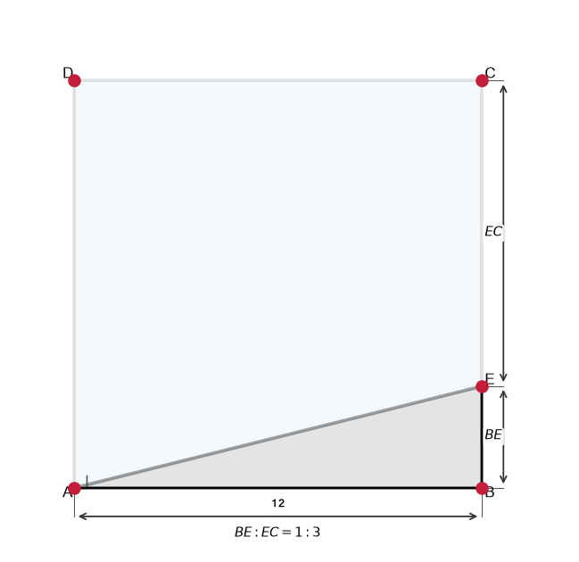
11. מלבן
$ABCD$:
$AB = 50$
ס"מ,
$AD = 20$
ס"מ.
נקודה
$E$
על
$BC$
כך ש-
$BE = 10$
ס"מ.
נקודה
$F$
על
$AB$
כך ש-
$BF = 5$
ס"מ.
חשבו את שטח המשולש
$BEF$
(הצבוע באפור).

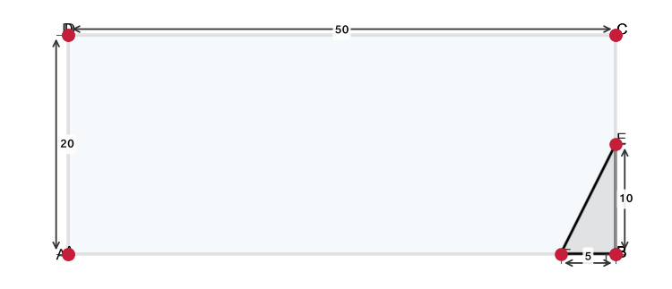
12. שני מעגלים קונצנטריים.
רדיוס פנימי
$r = 6$
ס"מ, רדיוס חיצוני
$R = 10$
ס"מ.
חשבו את שטח הרצועה הצבועה.

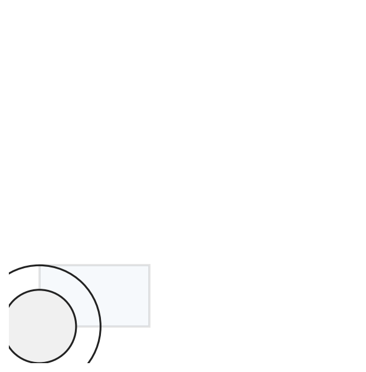
13. מלבן
$ABCD$:
$AB = 25$
ס"מ,
$BC = 48$
ס"מ.
נקודה
$E$
על
$BC$
כך ש-
$BE = 2 \cdot EC$.

א. מצאו את
$BE$
ואת
$EC$.

ב. חשבו את שטח המשולש
$ABE$.

ג. חשבו את שטח המשולש
$AEC$.

14. ריבוע
$ABCD$
שצלעו
$a$
ס"מ.
נקודה
$E$
על
$BC$
כך ש-
$BE = \frac{a}{3}$.
הביעו את שטח המשולש
$ABE$
ואת שטח הצורה הנותרת כפונקציה של
$a$.

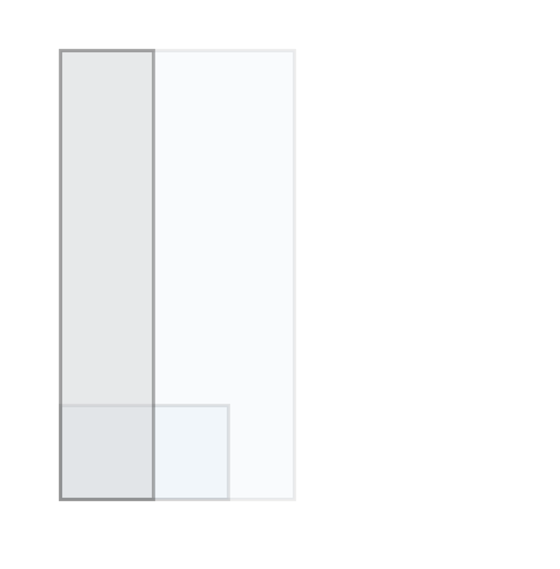
15. מלבן
$ABCD$:
$AB = 8$
ס"מ,
$BC = 15$
ס"מ.
$E$
על
$BC$
כך ש-
$BE = 2 \cdot EC$.
חשבו:

א. שטח המשולש
$ABE$.

ב. שטח המשולש
$AEC$.

ג. היקף המשולש
$AEC$
(חשבו את
$AE$
ואת
$AC$).

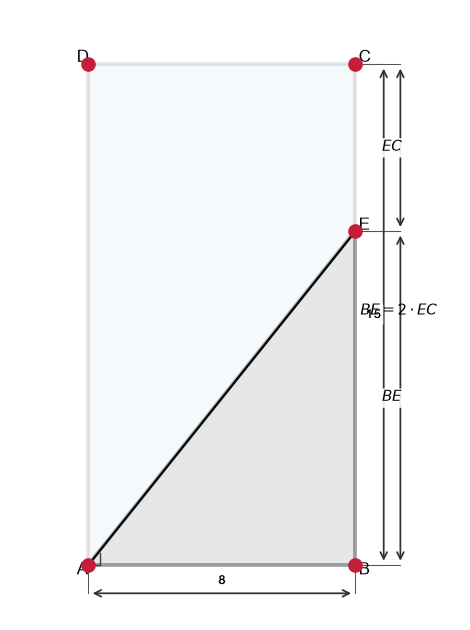
16. מעוין
$ABCD$:
$AC = 70$
ס"מ,
$BD = 50$
ס"מ.
מלבן
$EHGF$
חסום בתוך המעוין כך ש-
$AK = MC = BI = JD = 15$
ס"מ.
חשבו את השטח הצבוע בין המעוין למלבן.

---

## רמה 3: רמת בחינת מה"ט (4 תרגילים)

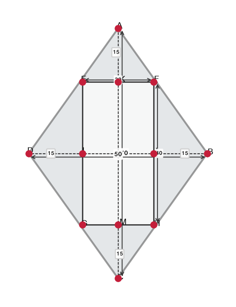
17. נתון מלבן
$ABCD$:
$AB = 7.5$
מ',
$BC = 4.5$
מ'.
נקודה
$E$
על הצלע
$CD$
כך ש-
$DE = 2 \cdot EC$.

א. מה שטח המלבן
$ABCD$?
מה היקפו?

ב. חשבו את שטח שלושת המשולשים:
$\triangle ADB$,
$\triangle AEB$
ו-
$\triangle ACB$.

ג. חשבו את ההיקף של המשולש
$AEB$.
(השתמשו בפיתגורס לחישוב
$AE$
ו-
$BE$)

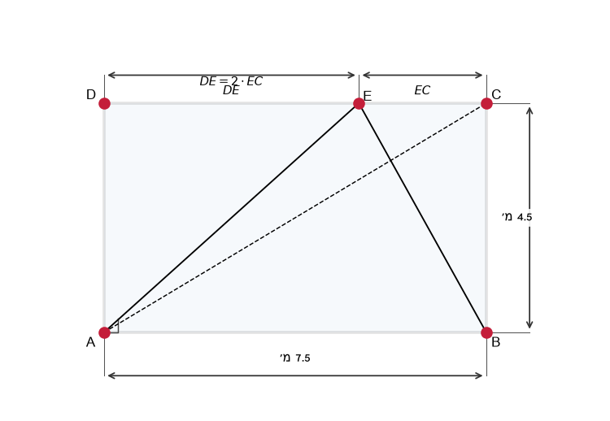
18. בסרטוט
$ABCD$
הוא מלבן.
$EB = 10$
ס"מ,
$DC = 50$
ס"מ,
$BF = 5$
ס"מ,
$AD = 20$
ס"מ.
(
$E$
על
$BC$,
$F$
על
$AB$)

א. חשבו את שטח המשולש
$DEF$
(הצבוע באפור).
(רמז:
$A=\frac{1}{2}\cdot BF\cdot EB$
)

ב. חשבו את ממדי המשולש
$DEF$:
$DE$,
$EF$
ו-
$DF$.

ג. חשבו את היקף המשולש
$DEF$.

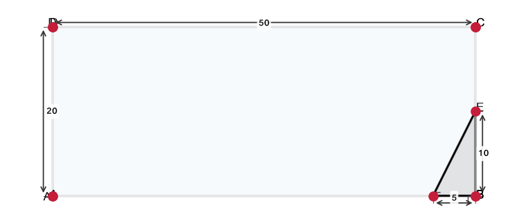
19. נתון מלבן
$ABCD$:
$AB = 25$
ס"מ,
$BC = 48$
ס"מ.
נקודה
$E$
על
$BC$
כך ש-
$BE = 2 \cdot EC$.

א. חשבו את
$BE$
ו-
$EC$.

ב. חשבו את שטח המשולש
$ABE$.

ג. חשבו את שטחו ואת היקפו של המשולש
$AEC$.
(חשבו תחילה את
$AE$
ואת
$AC$
בעזרת פיתגורס)

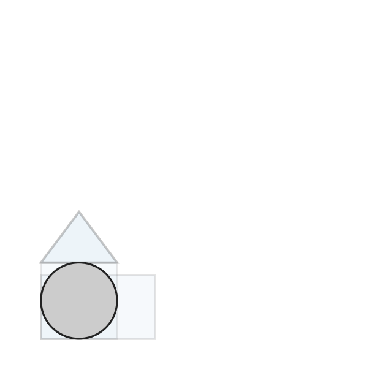
20. בסרטוט
$ABCD$
הוא מעוין.
$EHGF$
הוא מלבן.
$AK = MC = BI = JD = 15$
ס"מ.
$AC = 70$
ס"מ,
$BD = 50$
ס"מ.

א. חשבו את שטח המעוין
$ABCD$.

ב. חשבו את היקף המלבן
$EHGF$.

ג. חשבו את שטח המשולש
$AEF$.

---

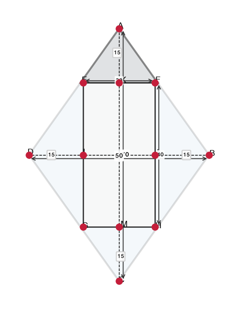

תשובות סופיות

1.
$12$
ס"מ².
2.
$12$
ס"מ².
3.
$15$
ס"מ².
4.
$50$
ס"מ².
5.
$18$
ס"מ².
6.
$DE=6$
ס"מ,
$EC=3$
ס"מ.
7.
$64$
ס"מ².
8.
$36$
ס"מ².
9. א.
$AE=6$,
$EB=12$
ס"מ;
ב.
$30$
ס"מ²;
ג.
$150$
ס"מ².
10. א.
$BE=3$,
$EC=9$
ס"מ;
ב.
$18$
ס"מ²;
ג.
$126$
ס"מ².
11.
$25$
ס"מ².
12.
$64\pi$
ס"מ².
13. א.
$BE=32$,
$EC=16$
ס"מ;
ב.
$400$
ס"מ²;
ג.
$200$
ס"מ².
14. שטח
$ABE$
הוא
$\frac{a^2}{6}$;
נשאר
$\frac{5a^2}{6}$.
15. א.
$40$
ס"מ²;
ב.
$20$
ס"מ²;
ג. היקף
$\approx47.6$
ס"מ (אחרי
$AE$,
$EC$,
$AC$).
16.
$950$
ס"מ².
17. א. שטח
$33.75$
מ"ר; היקף
$24$
מ';
ב. כל משולש
$\frac{33.75}{2}=16.875$
מ"ר;
ג. היקף
$\approx22.1$
מ'.
18. א.
$25$
ס"מ²;
ב. צלעות לפי פיתגורס;
ג. היקף משולש
$\approx85.4$
ס"מ.
19. א. כמו תרגיל 13;
ב.-ג. שטחים והיקף עם
$AE$
ו-
$AC$.
20. א. שטח מעוין
$1{ }750$
ס"מ²;
ב. היקף מלבן
$120$
ס"מ;
ג. שטח משולש
$237.5$
ס"מ².

