# תת-נושא 19: חישוב אורכי קטעים המקבילים לצירים בלבד

---

## רמה 1: בניית ביטחון (8 תרגילים)

1. חשבו את אורך הקטע
$AB$,
כאשר
$A(1, 3)$
ו-
$B(7, 3)$.
(הקטע מקביל לציר ה-
$X$)

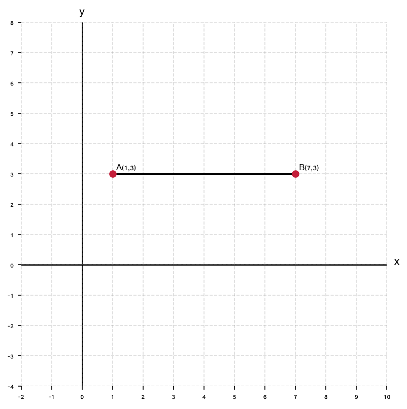

2. חשבו את אורך הקטע
$CD$,
כאשר
$C(4, -2)$
ו-
$D(4, 5)$.
(הקטע מקביל לציר ה-
$Y$)

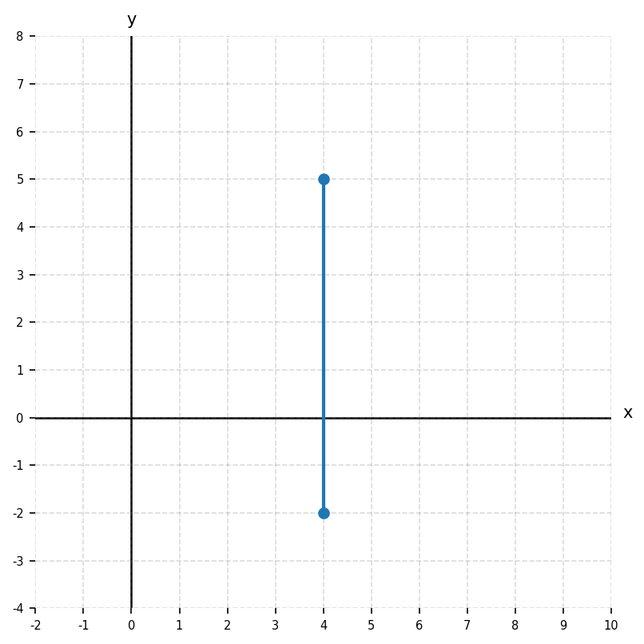

3. חשבו את אורך הקטע
$EF$,
כאשר
$E(-3, 2)$
ו-
$F(5, 2)$.

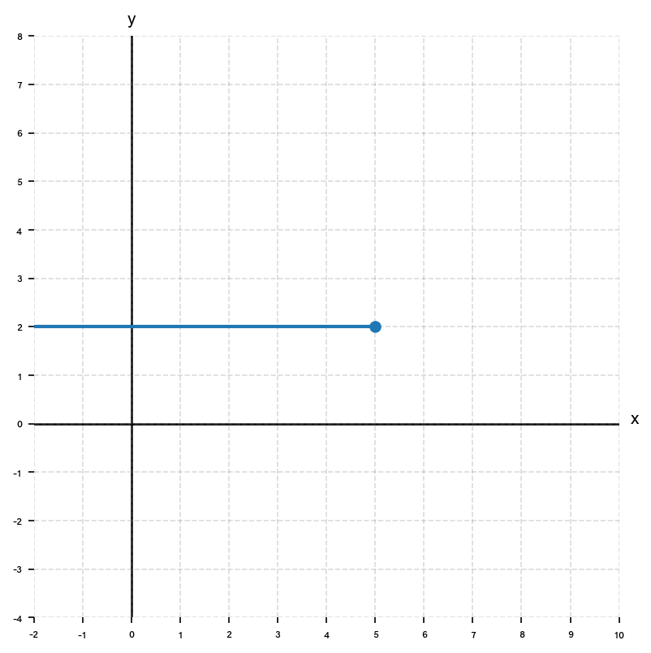

4. חשבו את אורך הקטע
$GH$,
כאשר
$G(2, -4)$
ו-
$H(2, 3)$.

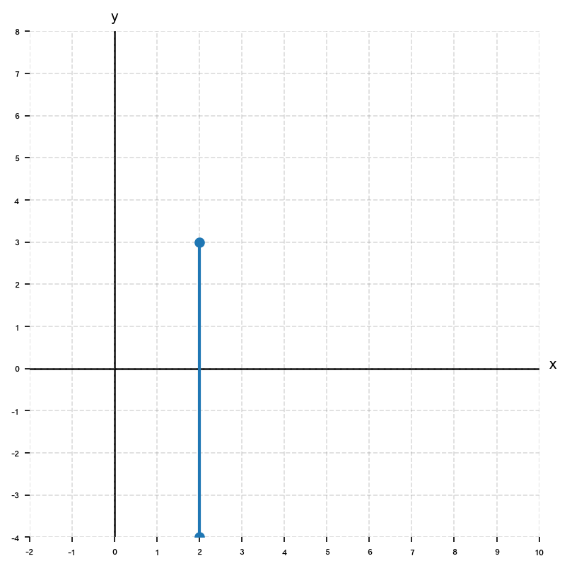

5. נתון
$P(0, 0)$
ו-
$Q(6, 0)$.
חשבו את אורך
$PQ$.

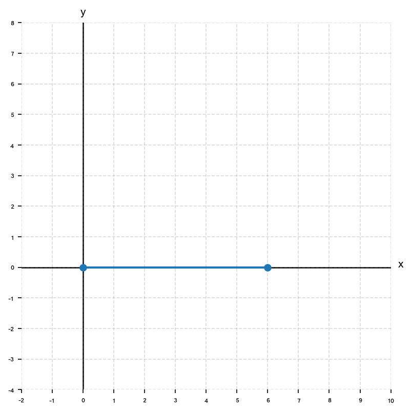

6. נתון
$M(-5, 4)$
ו-
$N(3, 4)$.
חשבו את אורך
$MN$.

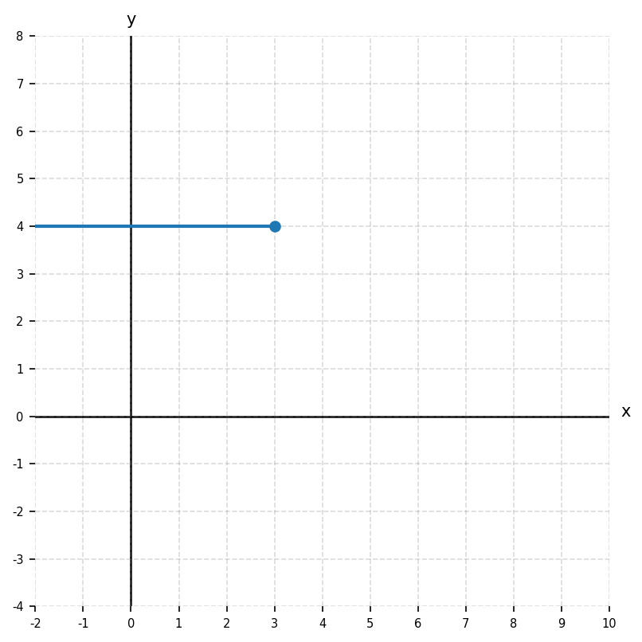

7. נתון
$A(0, 7)$
ו-
$B(0, -2)$.
חשבו את אורך
$AB$.

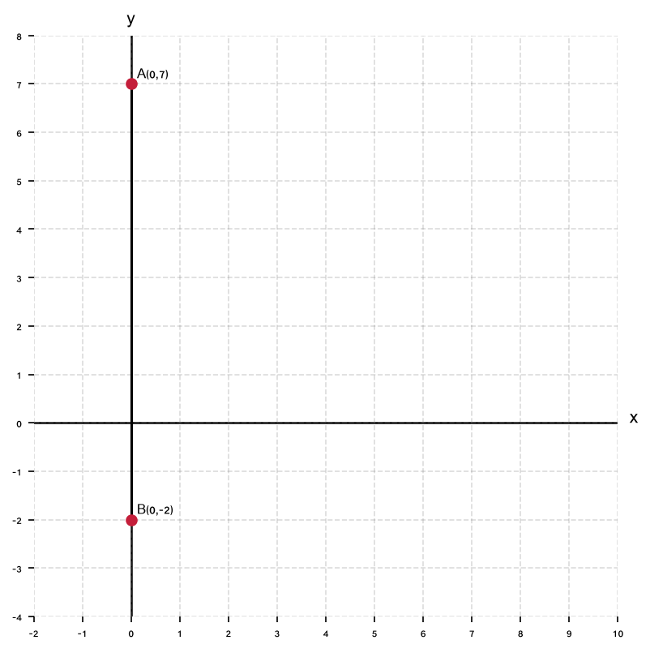

8. על ציר ה-
$X$
נמצאות נקודות
$A(a, 0)$
ו-
$B(b, 0)$
כאשר
$a < b$.
הביעו את אורך
$AB$
בעזרת
$a$
ו-
$b$.

---

## רמה 2: תרגול שוטף ומשולב (8 תרגילים)

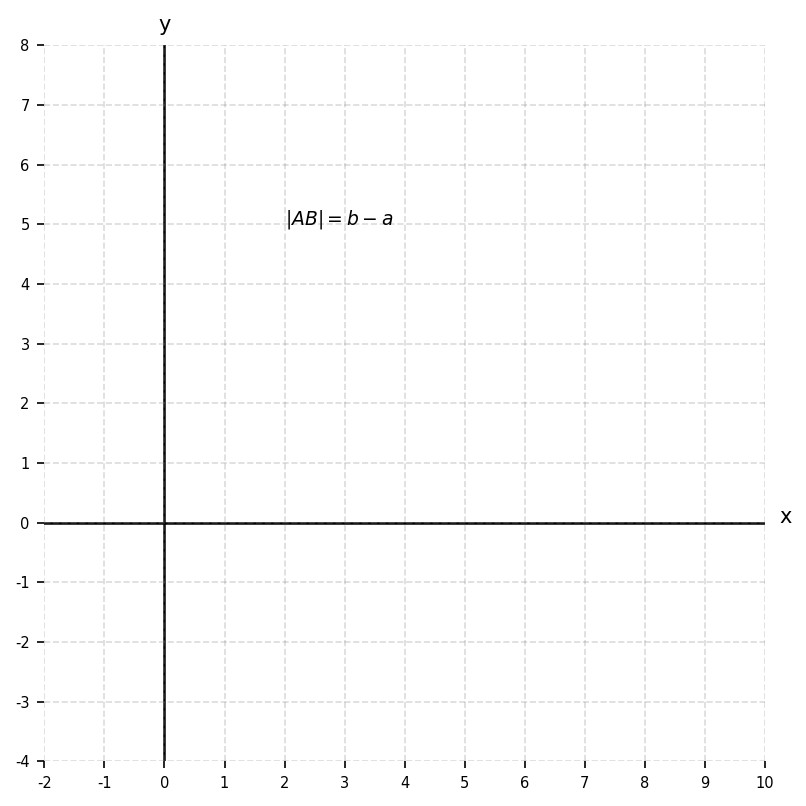

9. נתונות הנקודות
$A(0, -1)$,
$B(4, -1)$,
$C(4, 2)$,
$D(0, 2)$.

א. חשבו את אורכי הצלעות
$AB$,
$BC$,
$CD$,
$DA$.

ב. הוכיחו שהמרובע
$ABCD$
הוא מלבן.

10. נקודה
$P$
נמצאת על ציר ה-
$X$
(
$y = 0$)
וקואורדינטת ה-
$x$
שלה היא
$5$.
נקודה
$Q$
נמצאת על ציר ה-
$Y$
(
$x = 0$)
וקואורדינטת ה-
$y$
שלה היא
$-3$.
חשבו את אורך הקטע
$PQ$.
(רמז: משפט פיתגורס)

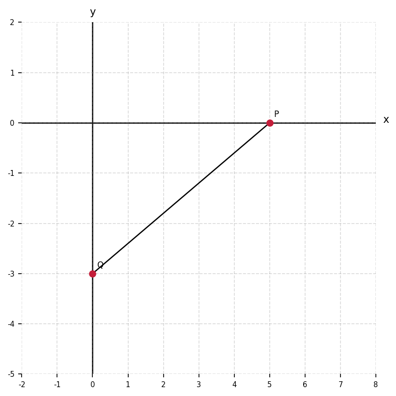

11. נתון מלבן
$ABCD$
כאשר
$A(0, 0)$,
$B(6, 0)$,
$C(6, 4)$,
$D(0, 4)$.

א. חשבו את אורכי כל הצלעות.

ב. חשבו את שטח המלבן.

ג. חשבו את היקף המלבן.

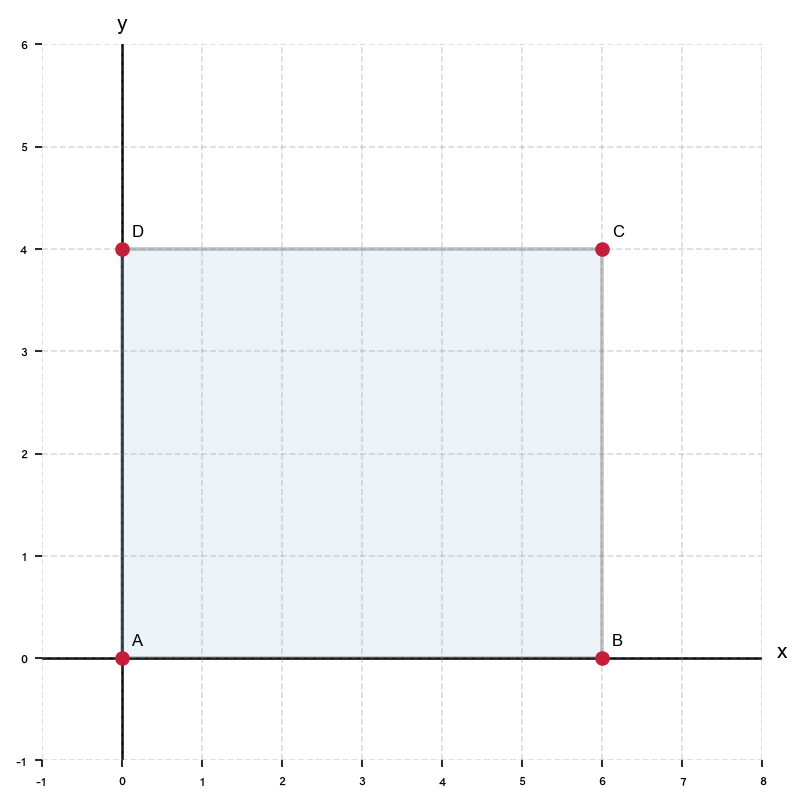

12. נתון ריבוע
$PQRS$
כאשר
$P(1, 1)$,
$Q(5, 1)$,
$R(5, 5)$,
$S(1, 5)$.

א. חשבו שטח והיקף הריבוע.

ב. מצאו את נקודת החיתוך של האלכסונים.

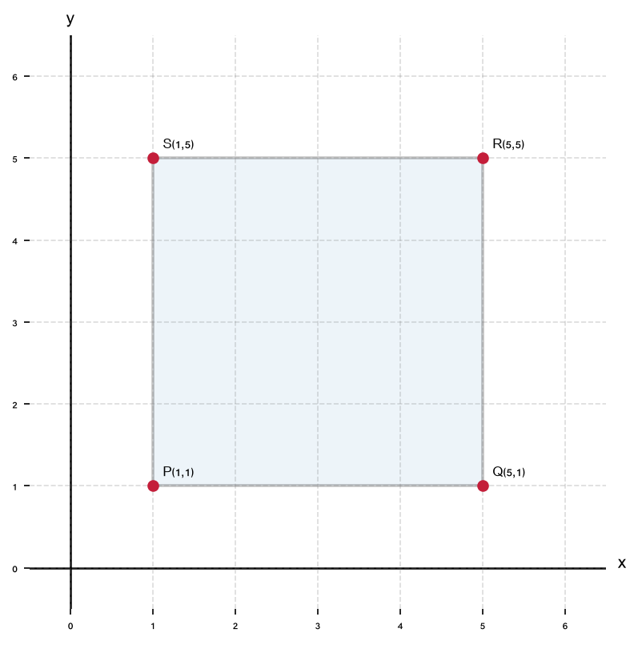

13. נקודה
$A(-4, 3)$,
נקודה
$B(2, 3)$
ו-
$C(2, -1)$.

א. חשבו את אורכי
$AB$
ו-
$BC$.

ב. הוכיחו שהזווית ב-
$B$
ישרה.

ג. חשבו את שטח משולש
$ABC$.

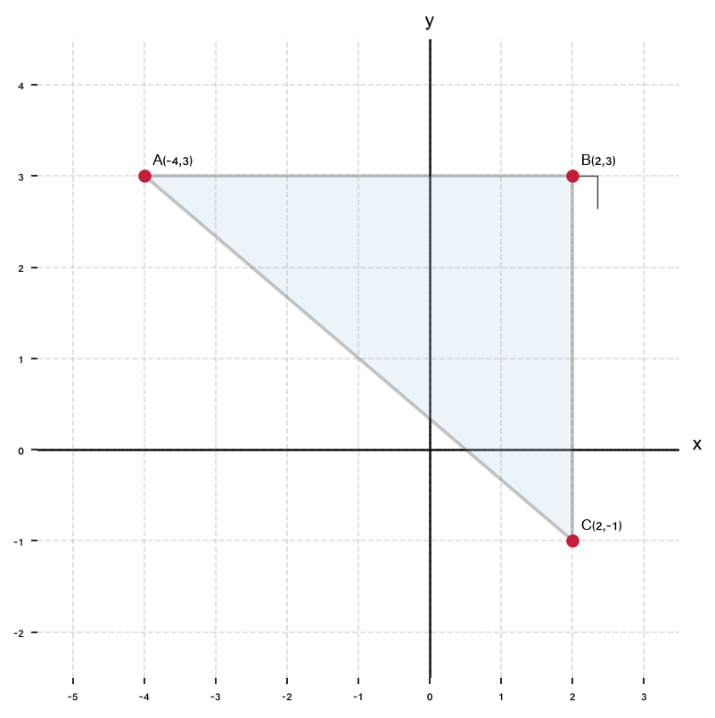

14. נקודות
$A(0, 0)$,
$B(8, 0)$,
$C(8, 6)$.

א. חשבו את אורכי
$AB$,
$BC$,
$CA$.

ב. הוכיחו שהמשולש ישר-זווית.

ג. חשבו את שטח המשולש.

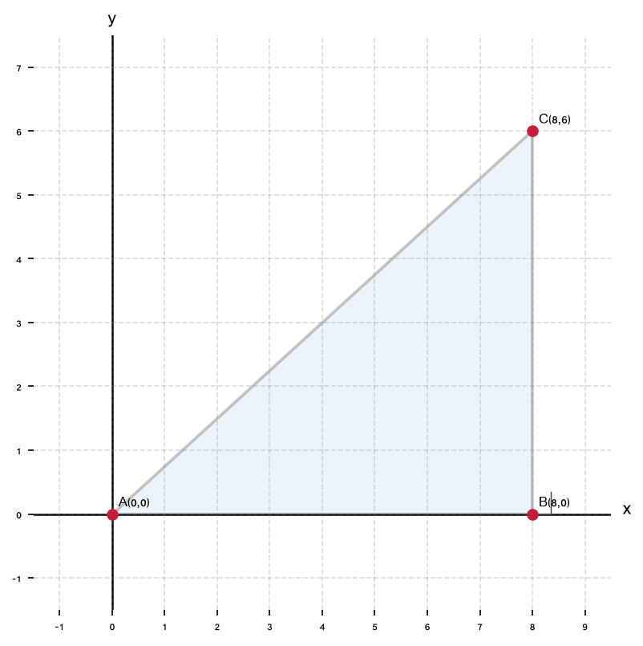

15. נתון מלבן שקודקודיו הנגדיים הם
$A(1, 2)$
ו-
$C(9, 8)$.

א. מצאו את אורך ורוחב המלבן.

ב. חשבו שטח והיקף.

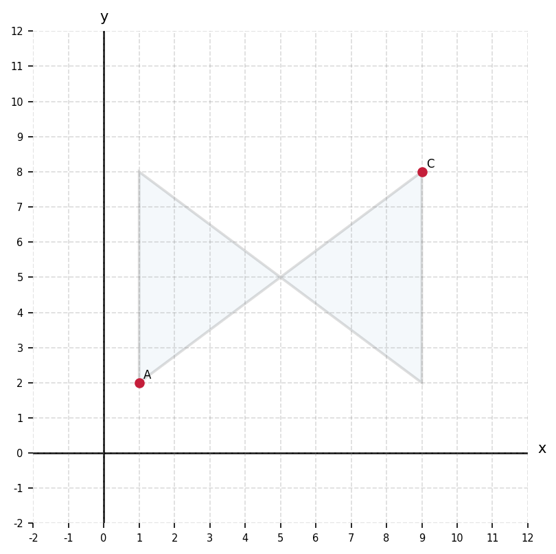

16. על ציר ה-
$X$
נמצאות נקודות
$A(2, 0)$,
$B(9, 0)$.
על ציר ה-
$Y$
נמצאות
$C(0, 1)$,
$D(0, 7)$.
מצאו:

א. אורך
$AB$.

ב. אורך
$CD$.

ג. האם
$AB = CD$?

---

## רמה 3: רמת בחינת מה"ט (4 תרגילים)

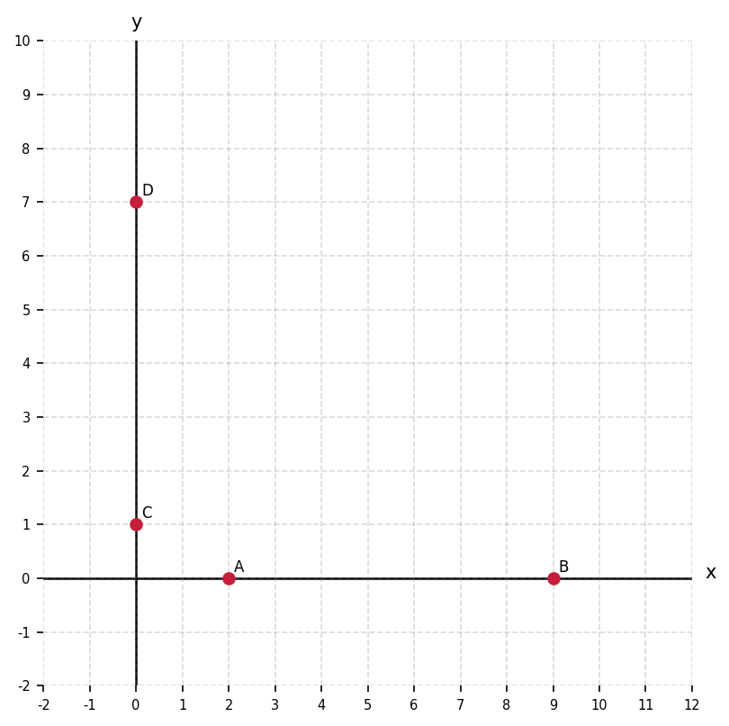

17. נתון מרובע שקודקודיו:
$D(0, 2)$,
$C(4, 2)$,
$B(4, -1)$,
$A(0, -1)$.

א. סרטטו את המרובע.

ב. הוכיחו שהמרובע הוא מלבן (חישבו את הצלעות והראו שניצבות).

ג. חשבו את שטח המלבן.

ד. אלכסוני המלבן נחתכים בנקודה
$M$.
מצאו את שיעורי
$M$.

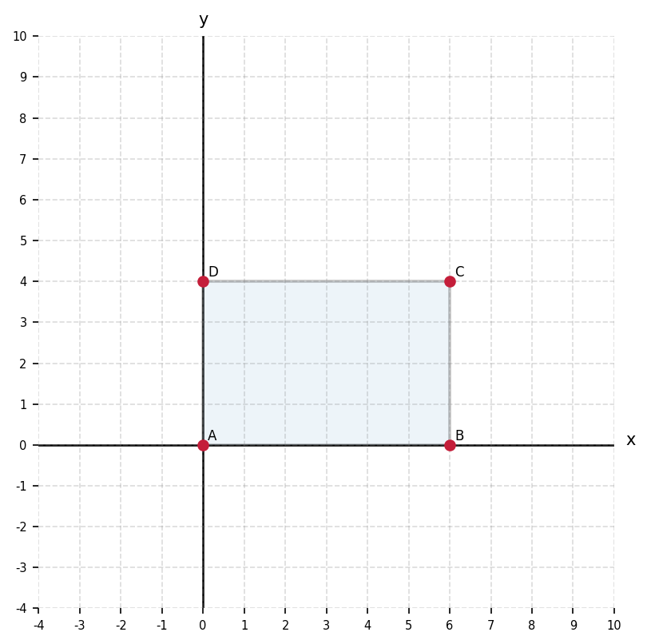

18. נתונות הנקודות
$A(0, 0)$,
$B(5, 0)$,
$C(5, 12)$.

א. חשבו את אורכי הצלעות
$AB$,
$BC$,
$CA$.

ב. הוכיחו שהמשולש ישר-זווית.

ג. חשבו את שטח המשולש.

ד. נקודה
$D(0, 12)$.
הוכיחו ש-
$ABCD$
מלבן וחשבו את שטחו.

19. שלוש ערים במפה מסומנות:
$X(0, 0)$,
$Y(12, 0)$,
$Z(12, 9)$.

א. חשבו את המרחק
$XY$.

ב. חשבו את המרחק
$YZ$.

ג. חשבו את המרחק
$XZ$.
(רמז: פיתגורס)

ד. הוכיחו שמשולש
$XYZ$
ישר-זווית.

ה. חשבו את שטח "משולש הערים".

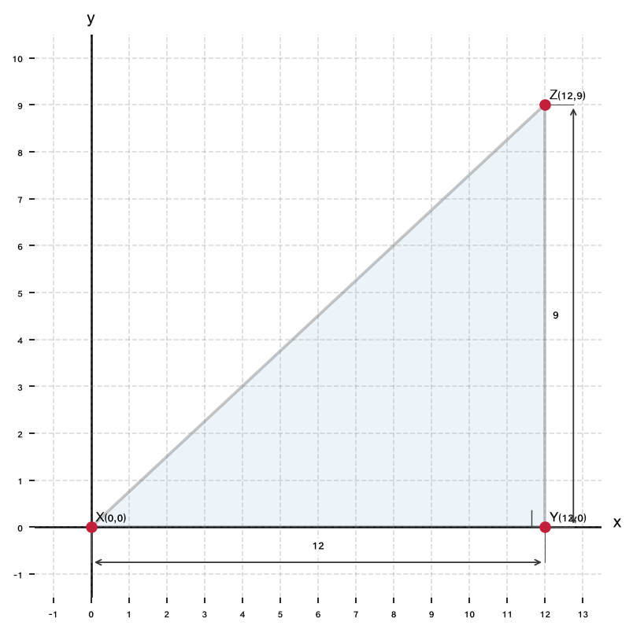

20. נתון מלבן
$ABCD$:
$A(0, 0)$,
$B(8, 0)$,
$C(8, 6)$,
$D(0, 6)$.
נקודה
$E(3, 0)$
נמצאת על
$AB$.
נמתח קטע
$CE$.

א. חשבו את אורך
$CE$.

ב. חשבו את שטח המשולש
$ACE$.

ג. חשבו את שטח הטרפז
$EBCD$.

---

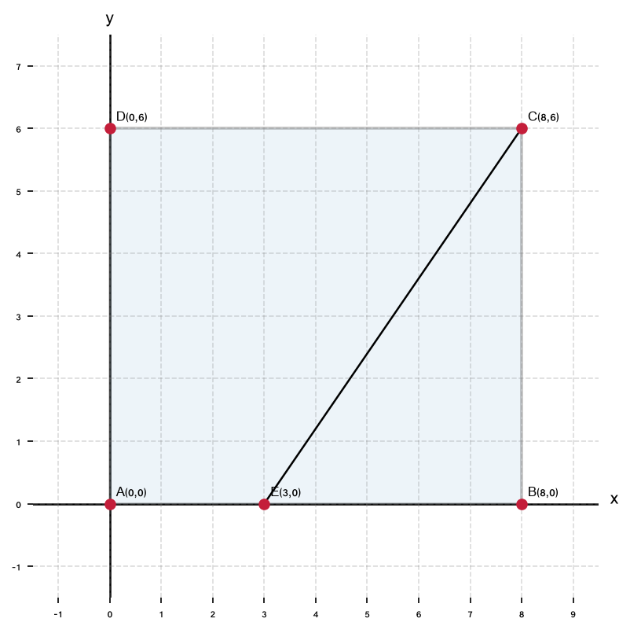

תשובות סופיות

1.
$6$
יחידות אורך

2.
$7$
יחידות אורך

3.
$8$
יחידות אורך

4.
$7$
יחידות אורך

5.
$6$
יחידות אורך

6.
$8$
יחידות אורך

7.
$9$
יחידות אורך

8.
$AB = b-a$
יחידות אורך על ציר
$X$

9.
א.
$AB=4$,
$BC=3$,
$CD=4$,
$DA=3$
ב.
זוויות ישרות וצלעות נגדיות שוות —
$ABCD$
מלבן.

10.
$\sqrt{34} \approx 5.83$
יחידות אורך.

11.
א.
$AB=6$,
$BC=4$,
$CD=6$,
$DA=4$
ב.
$24$
יחידות ריבוע
ג.
$20$
יחידות אורך

12.
א.
שטח
$16$
יחידות ריבוע; היקף
$16$
יחידות אורך
ב.
$(3,3)$

13.
א.
$AB=6$,
$BC=4$
ב.
ב-
$B$
זווית ישרה (בין צלע אופקית לאנכית).
ג.
$12$
יחידות ריבוע

14.
א.
$AB=8$,
$BC=6$,
$CA=10$
ב.
$8^2+6^2=10^2$
ג.
$24$
יחידות ריבוע

15.
א.
אורך
$8$
ו-
$6$
ב.
שטח
$48$
יחידות ריבוע; היקף
$28$
יחידות אורך

16.
א.
$7$
יחידות אורך;
ב.
$6$
יחידות אורך;
ג.
לא —
$7 \neq 6$

17.
א.
מרובע
$ABCD$
עם
$A(0,-1)$,
$B(4,-1)$,
$C(4,2)$,
$D(0,2)$.
ב.
צלעות
$4$
ו-
$3$
וניצבות — מלבן.
ג.
$12$
יחידות ריבוע
ד.
$M(2,\,0.5)$

18.
א.
$AB=5$,
$BC=12$,
$CA=13$
ב.
$5^2+12^2=13^2$
ג.
$30$
יחידות ריבוע
ד.
$60$
יחידות ריבוע

19.
א.
$12$
יחידות אורך
ב.
$9$
יחידות אורך
ג.
$15$
יחידות אורך
ד.
$12^2+9^2=15^2$
ה.
$54$
יחידות ריבוע

20.
א.
$\sqrt{61} \approx 7.81$
יחידות אורך
ב.
$9$
יחידות ריבוע
ג.
$39$
יחידות ריבוע

