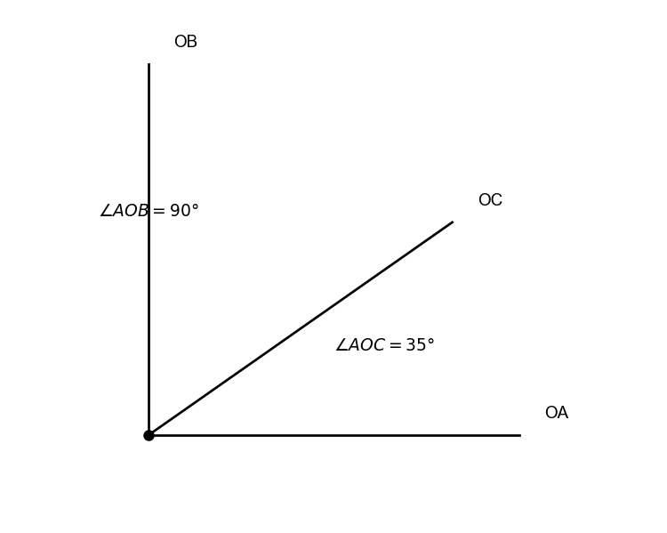
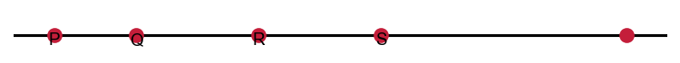

# תת-נושא 1: מהי נקודה, קטע, ישר וקרן

---

## רמה 1: בניית ביטחון (8 תרגילים)

1. ציינו כמה נקודות קצה יש לכל אחד מהאובייקטים הבאים:
קטע, קרן, ישר.

2. על קטע
$AB$
נקודה
$M$
היא נקודת האמצע.
אם
$AM = 6$
ס"מ, מה אורך הקטע
$AB$?

3. על ישר נמצאות שלוש נקודות
$A$,
$B$,
$C$
בסדר זה (B בין A לבין C).
נתון
$AB = 5$
ס"מ ו-
$BC = 3$
ס"מ.
מה אורך
$AC$?

4. נקודה
$D$
היא נקודת האמצע של קטע
$EF$.
נתון
$EF = 18$
ס"מ.
מה אורך
$ED$?

5. על קטע
$MN$
נמצאת נקודה
$P$
כך ש-
$MP = 4$
ס"מ ו-
$PN = 7$
ס"מ.
מה אורך
$MN$?

6. קטע
$AB = 20$
ס"מ.
נקודה
$C$
מחלקת אותו כך ש-
$AC = 3 \cdot CB$.
מצאו את
$AC$
ואת
$CB$.

7. על ישר נמצאות ארבע נקודות בסדר
$A, B, C, D$.
$AB = 4$
ס"מ,
$BC = 6$
ס"מ,
$CD = 3$
ס"מ.
מה אורך
$AD$?

8. קטע
$PQ = 14$
ס"מ.
נקודה
$R$
נמצאת על הקטע כך ש-
$PR = 9$
ס"מ.
מה אורך
$RQ$?

---

## רמה 2: תרגול שוטף ומשולב (8 תרגילים)

9. על קטע
$AC$,
נקודה
$B$
נמצאת כך ש-
$AB = 2BC$.
אם
$AC = 18$
ס"מ, מצאו את
$AB$
ואת
$BC$.

10. שלוש נקודות
$A$,
$B$,
$C$
על ישר.
$AB = (2x + 1)$
ס"מ,
$BC = (x + 3)$
ס"מ,
$AC = (4x - 2)$
ס"מ.
מצאו את
$x$
ואת אורך כל קטע.

11. נקודה
$M$
היא נקודת האמצע של קטע
$AB$,
ונקודה
$N$
היא נקודת האמצע של קטע
$MB$.
אם
$AB = 24$
ס"מ, מצאו את
$AN$
ואת
$NB$.

12. על קטע
$AD$
נמצאות הנקודות
$B$
ו-
$C$
בסדר
$A, B, C, D$.
$AB:BC:CD = 1:2:3$
ו-
$AD = 36$
ס"מ.
מצאו את אורך כל קטע.

13. שני קרניים
$OA$
ו-
$OB$
יוצאות מנקודה
$O$.
קרן
$OC$
נמצאת ביניהן.
אם
$\angle AOB = 90°$
ו-
$\angle AOC = 35°$,
מה גודל הזווית
$\angle COB$?

14. קטע
$AB = 30$
ס"מ.
נקודה
$C$
על הקטע כך ש-
$AC:CB = 2:3$.
נקודה
$D$
היא נקודת האמצע של
$CB$.
מצאו את
$CD$.

15. ארבע נקודות
$P, Q, R, S$
על ישר בסדר זה.
$PQ = 2a$,
$QR = a + 3$,
$RS = 3a - 1$,
$PS = 5a + 8$.
מצאו את
$a$
ואת
$PS$.

16. קטע
$XY = 40$
ס"מ.
נקודה
$Z$
על הקטע כך ש-
$XZ = \frac{3}{8} \cdot XY$.
נקודה
$W$
היא נקודת האמצע של
$ZY$.
מצאו את
$ZW$.

---

## רמה 3: רמת בחינת מה"ט (4 תרגילים)

17. על קטע
$AC$
נמצאת נקודה
$B$
כך ש-
$AB = \frac{2}{5} \cdot AC$.
אם
$BC = 18$
ס"מ:

א. מצאו את
$AB$.

ב. מצאו את
$AC$.

ג. נקודה
$M$
היא נקודת האמצע של
$AB$.
מצאו את המרחק
$MC$.

18. על ישר נמצאות חמש נקודות בסדר
$A, B, C, D, E$.
$AB = BC = CD = DE = 5$
ס"מ.
נקודה
$F$
היא נקודת האמצע של
$BD$.

א. מצאו את
$AE$.

ב. מצאו את
$BF$
ואת
$AF$.

ג. מצאו את
$CE$.

19. נקודה
$B$
על קטע
$AC$
מחלקת אותו כך ש-
$AB:BC = 3:5$.
נקודה
$D$
היא נקודת האמצע של
$AB$,
ונקודה
$E$
היא נקודת האמצע של
$BC$.
אם
$AC = 32$
ס"מ:

א. מצאו את
$AB$
ואת
$BC$.

ב. מצאו את
$DE$.

ג. הוכיחו שנקודה
$B$
היא נקודת האמצע של
$DE$.

20. ארבע נקודות
$A, B, C, D$
על ישר בסדר זה.
$BC = 10$
ס"מ.
נתון ש-
$AB = CD$,
ו-
$AD = 3 \cdot BC$.

א. מצאו את
$AB$
ואת
$CD$.

ב. מצאו את
$AC$
ואת
$BD$.

ג. הוכיחו שנקודות האמצע של
$AC$
ו-
$BD$
חופפות.

---

תשובות סופיות

1. לקטע
$2$
קצוות; לקרן
$1$
קצה; לישר אין קצוות.

2. $AB = 12$
ס"מ.

3. $AC = 8$
ס"מ.

4. $ED = 9$
ס"מ.

5. $MN = 11$
ס"מ.

6. $CB = 5$
ס"מ,
$AC = 15$
ס"מ.

7. $AD = 13$
ס"מ.

8. $RQ = 5$
ס"מ.

9. $BC = 6$
ס"מ,
$AB = 12$
ס"מ.

10. $x = 6$
;
$AB = 13$
ס"מ,
$BC = 9$
ס"מ,
$AC = 22$
ס"מ.

11. $AN = 18$
ס"מ,
$NB = 6$
ס"מ.

12. $AB = 6$
ס"מ,
$BC = 12$
ס"מ,
$CD = 18$
ס"מ.

13. $\angle COB = 55°$

14. $CD = 9$
ס"מ.

15. $a = 6$
,
$PS = 38$

16. $ZW = 12.5$
ס"מ.

17. א.
$AB = 12$
ס"מ

ב.
$AC = 30$
ס"מ

ג.
$MC = 24$
ס"מ

18. א.
$AE = 20$
ס"מ

ב.
$BF = 5$
ס"מ,
$AF = 10$
ס"מ

ג.
$CE = 10$
ס"מ

19. א.
$AB = 12$
ס"מ,
$BC = 20$
ס"מ

ב.
$DE = 16$
ס"מ

ג. נקודת האמצע של
$DE$
במרחק
$14$
ס"מ מ־
$A$
;
$B$
נמצאת ב־
$12$
ס"מ מ־
$A$
— כלומר
$B$
אינה נקודת האמצע של
$DE$
בנתונים אלה (לבדוק מול השרטוט בכיתה).

20. א.
$AB = CD = 10$
ס"מ

ב.
$AC = BD = 20$
ס"מ

ג. אמצע
$AC$
נמצא ב־
$B$
;
אמצע
$BD$
נמצא ב־
$C$
— כלומר נקודות האמצע אינן מתלכדות בנתונים אלה (יש לאמת מול הניסוח המקורי בשיעור).

