# תת-נושא 20: חישוב שטחים והיקפים של מרובעים ומשולשים במערכת צירים

---

## רמה 1: בניית ביטחון (8 תרגילים)

1. נתון מלבן
$ABCD$
עם קודקודים:
$A(0,0)$,
$B(5,0)$,
$C(5,3)$,
$D(0,3)$.
חשבו את שטח המלבן ואת היקפו.

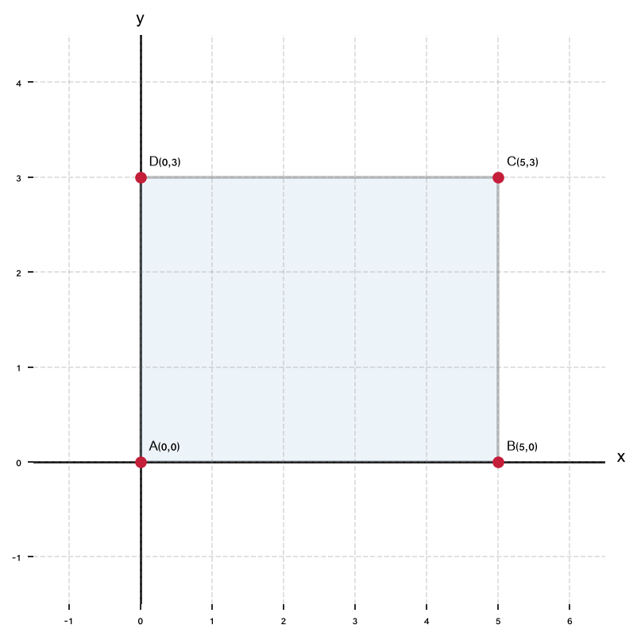
2. נתון ריבוע
$PQRS$
עם קודקודים:
$P(1,1)$,
$Q(5,1)$,
$R(5,5)$,
$S(1,5)$.
חשבו את שטח הריבוע ואת היקפו.

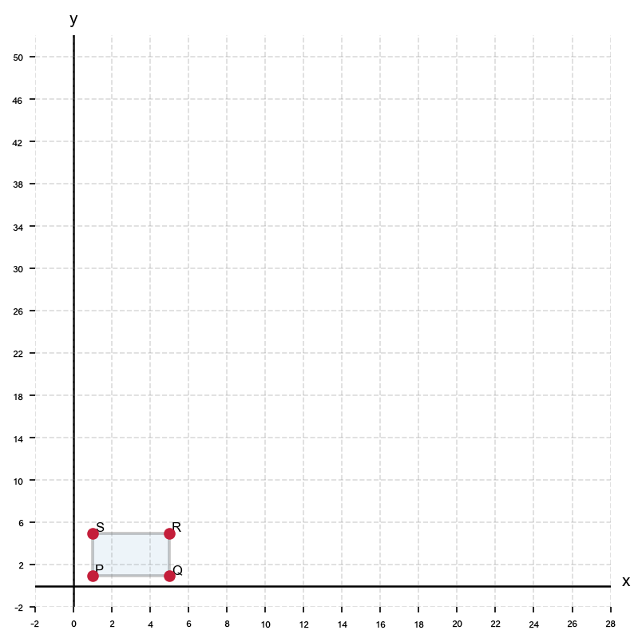
3. נתון משולש
$ABC$
עם קודקודים:
$A(0,0)$,
$B(6,0)$,
$C(6,4)$.
חשבו את שטח המשולש.

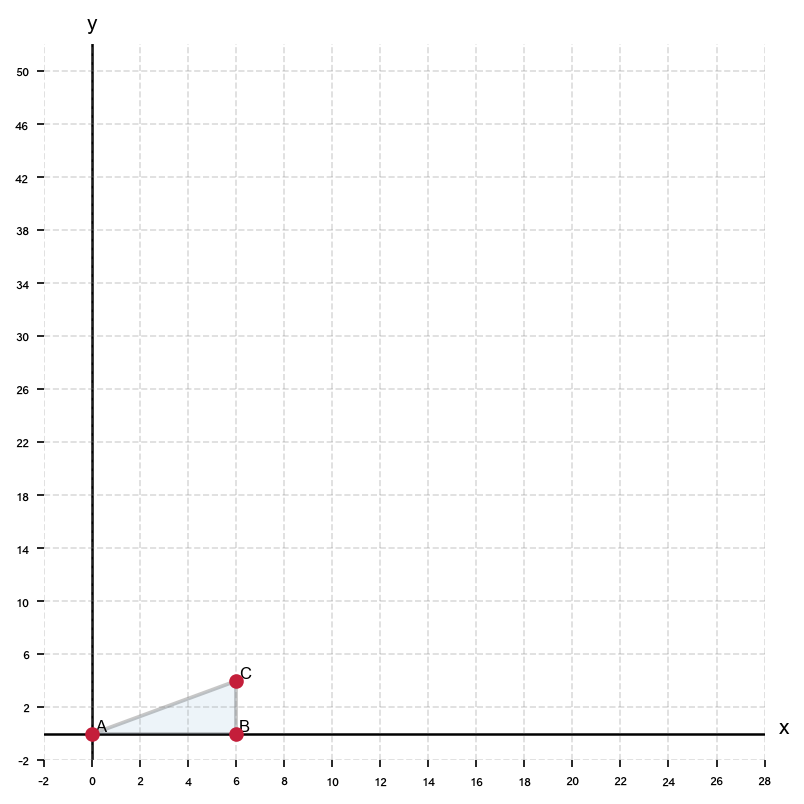
4. נתון משולש
$DEF$
עם קודקודים:
$D(0,0)$,
$E(8,0)$,
$F(0,5)$.
חשבו את שטח המשולש ואת היקפו.

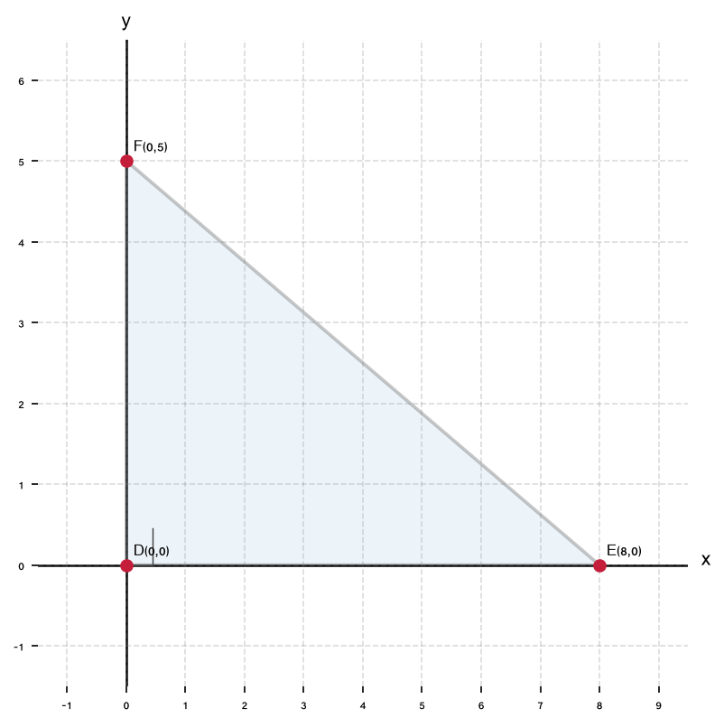
5. נתון מלבן עם קודקודים:
$A(2,1)$,
$B(7,1)$,
$C(7,4)$,
$D(2,4)$.
חשבו את שטח המלבן.

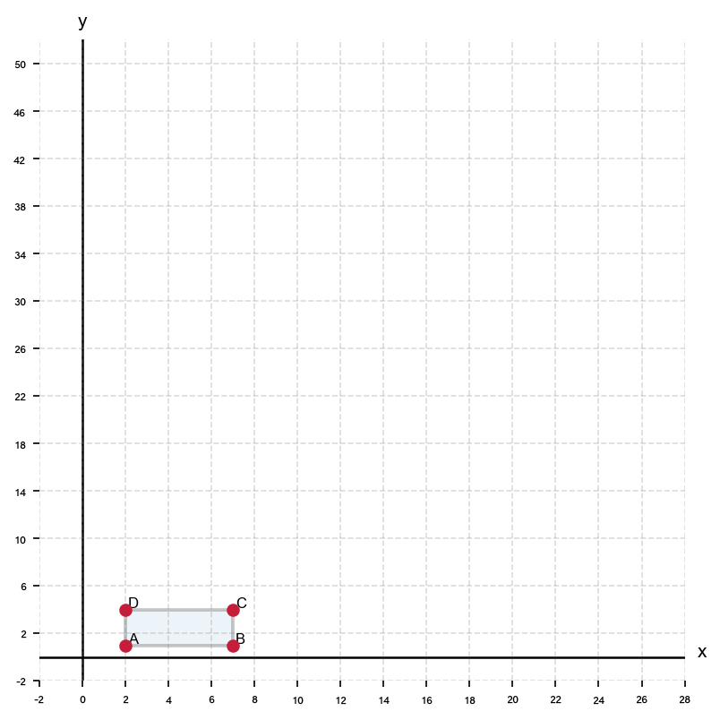
6. נתון משולש ישר-זווית עם קודקודים:
$A(3,2)$,
$B(9,2)$,
$C(9,6)$.
חשבו את שטח המשולש.

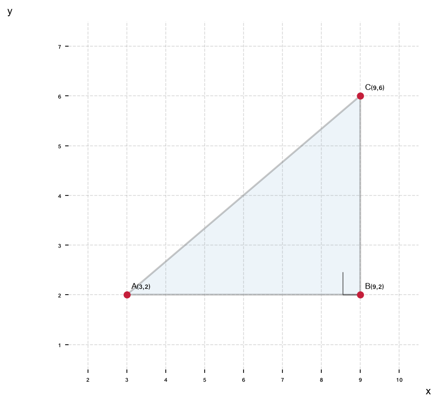
7. נתון מלבן עם שני קודקודים נגדיים:
$A(1,2)$
ו-
$C(7,6)$.
חשבו את שטח המלבן.

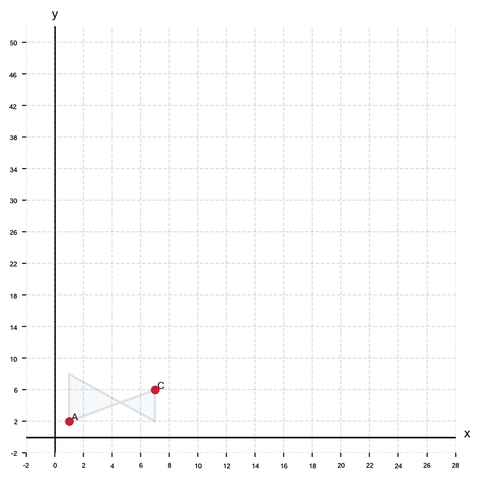
8. נתון ריבוע
$ABCD$
כאשר
$A(0,0)$
ו-
$B(4,0)$.
מצאו את שיעורי
$C$
ו-
$D$,
ואת שטח הריבוע.

---

## רמה 2: תרגול שוטף ומשולב (8 תרגילים)

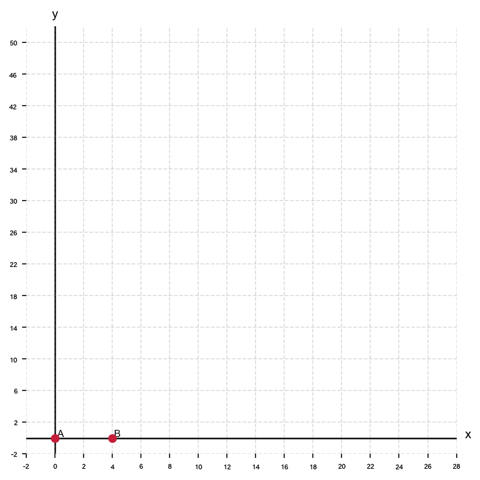
9. נתון מלבן
$ABCD$
עם קודקודים:
$A(0,-1)$,
$B(4,-1)$,
$C(4,2)$,
$D(0,2)$.

א. חשבו שטח והיקף.

ב. מצאו את נקודת החיתוך של האלכסונים
$M$.

ג. חשבו את שטח משולש
$ABM$.

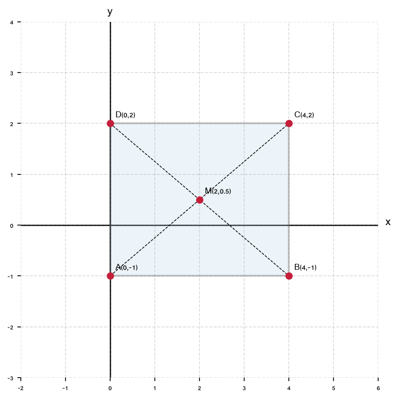
10. נתון משולש עם קודקודים:
$A(0,0)$,
$B(10,0)$,
$C(4,6)$.

א. חשבו את שטח המשולש.
(בסיס
$AB$
על ציר ה-
$X$,
גובה = קואורדינטת ה-
$y$
של
$C$)

ב. חשבו את אורך
$AB$,
$BC$,
$CA$.

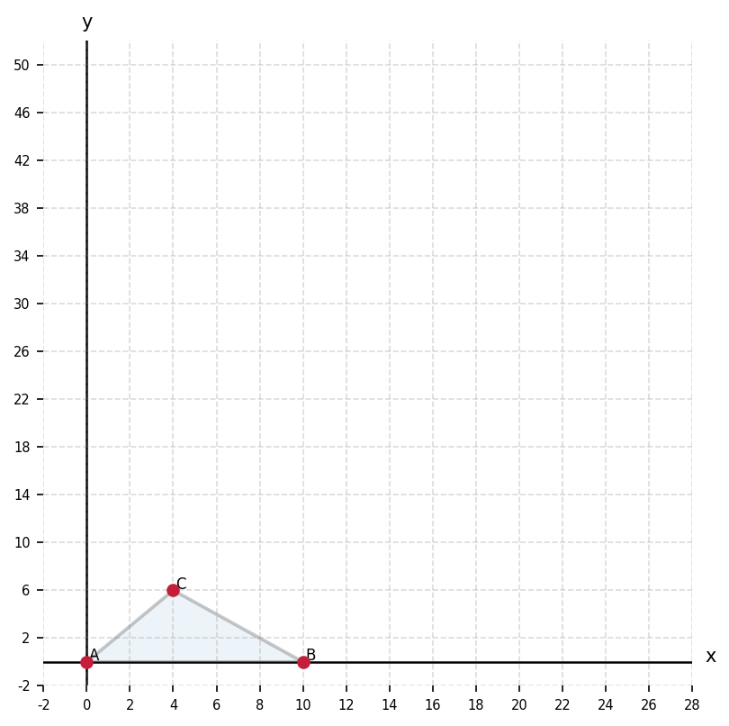
11. נתון טרפז
$ABCD$
עם קודקודים:
$A(0,0)$,
$B(10,0)$,
$C(8,4)$,
$D(2,4)$.

א. הוכיחו ש-
$AB \| CD$
(שניהם על ישרים אופקיים).

ב. חשבו את אורכי
$AB$
ו-
$CD$.

ג. חשבו את שטח הטרפז.

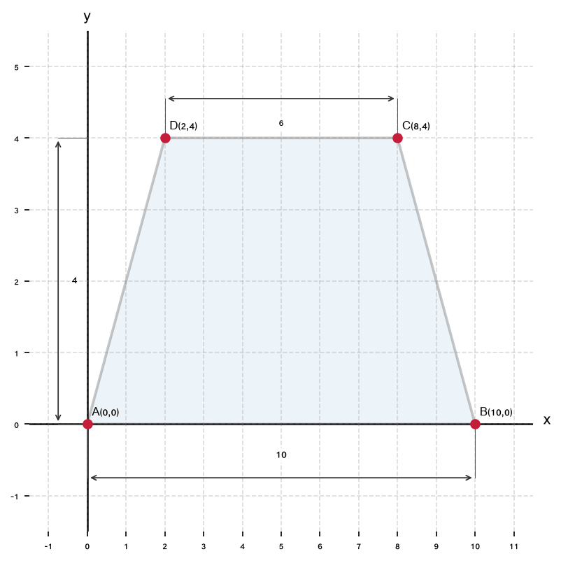
12. נתון מרובע עם קודקודים:
$A(0,0)$,
$B(6,0)$,
$C(6,5)$,
$D(0,5)$.
נקודה
$E(2,0)$
על
$AB$.

א. נמתח קטע
$CE$.
חשבו את שטח משולש
$ACE$.

ב. חשבו את אורך
$CE$.

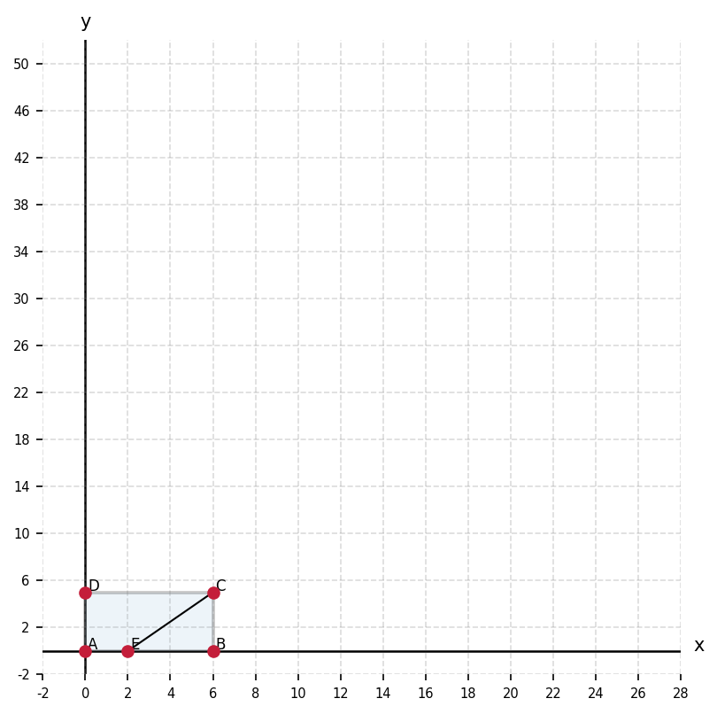
13. שלושה עמודים ממוקמים בנקודות:
$P(0,0)$,
$Q(9,0)$,
$R(9,12)$.

א. חשבו את האורכים
$PQ$,
$QR$,
$PR$.

ב. הוכיחו שהמשולש ישר-זווית.

ג. חשבו את השטח.

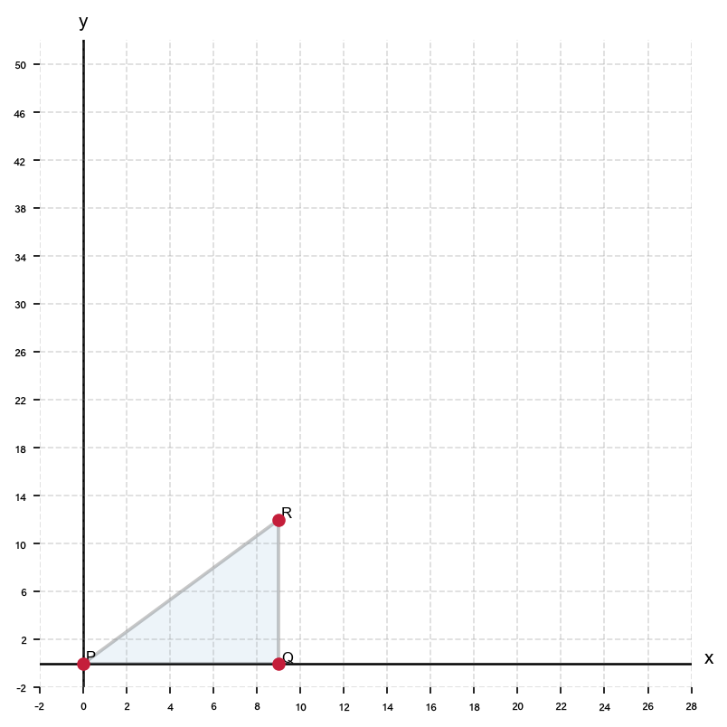
14. מגרש בצורת טרפז עם קודקודים:
$A(0,0)$,
$B(12,0)$,
$C(10,5)$,
$D(2,5)$.

א. חשבו את אורכי הבסיסים המקבילים.

ב. חשבו את גובה הטרפז.

ג. חשבו את שטח המגרש.

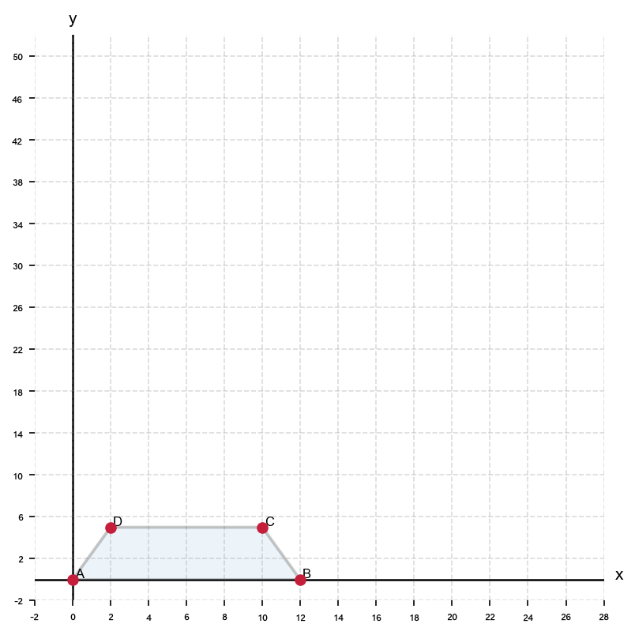
15. מלבן
$ABCD$:
$A(1,1)$,
$B(9,1)$,
$C(9,6)$,
$D(1,6)$.
נקודה
$E$
היא אמצע הצלע
$BC$:
$E(9, 3.5)$.

א. נמתח קטע
$AE$.
חשבו את שטח משולש
$ABE$.

ב. חשבו את שטח הטרפז
$AECD$.

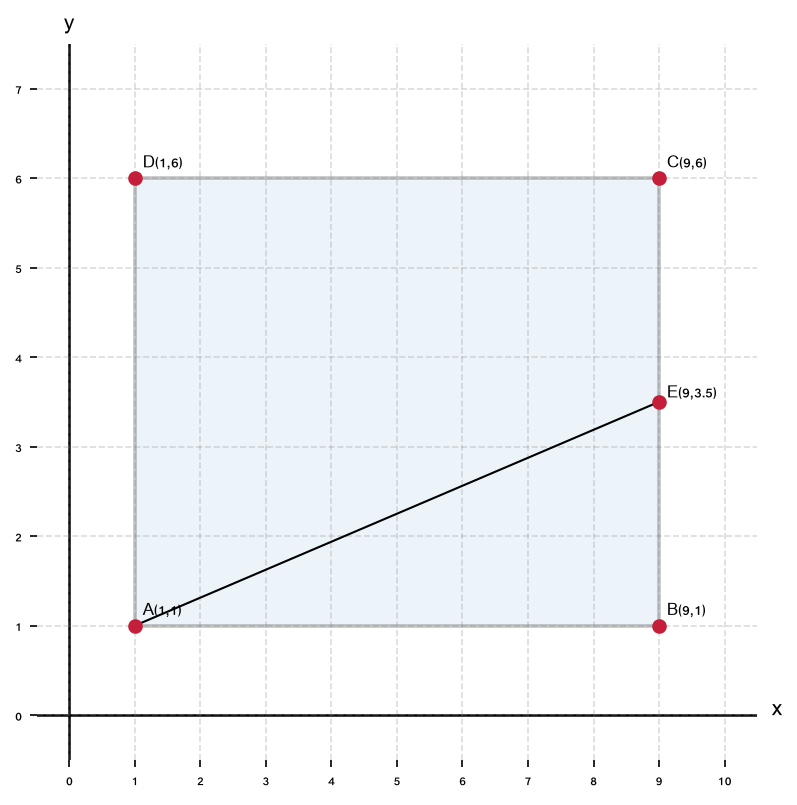
16. נתון מרובע עם קודקודים:
$A(0,2)$,
$B(4,0)$,
$C(6,4)$,
$D(2,6)$.
(הצלעות נוטות, לא מקבילות לצירים)

חשבו את שטח המרובע:
הציגו אותו בתוך מלבן
$6 \times 6$
ופחתו את ארבעת המשולשים הפינתיים.

---

## רמה 3: רמת בחינת מה"ט (4 תרגילים)

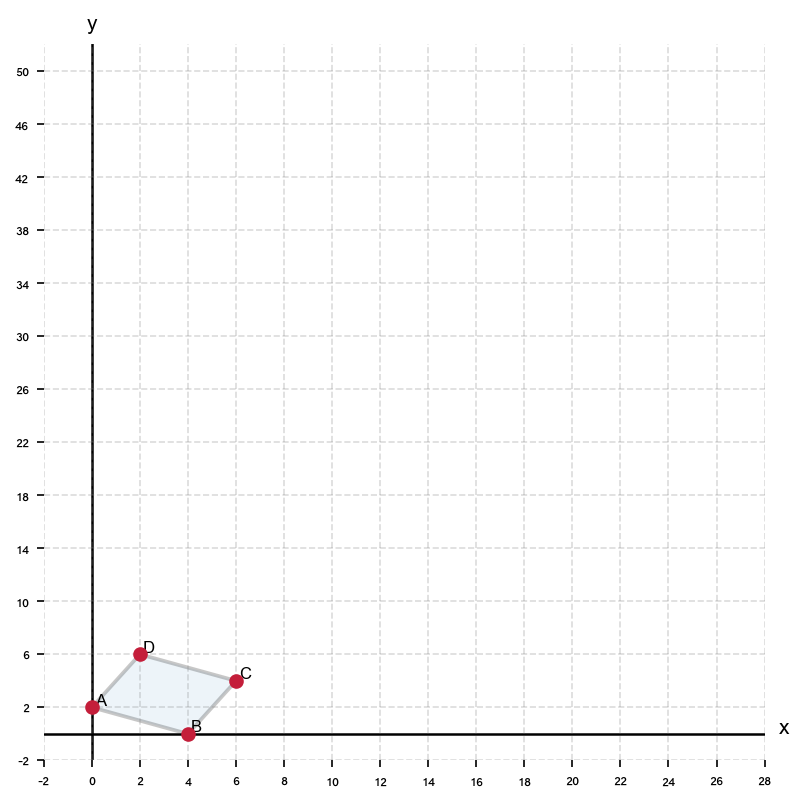
17. נתון מרובע שקודקודיו:
$D(0,2)$,
$C(4,2)$,
$B(4,-1)$,
$A(0,-1)$.

א. הוכיחו שהמרובע הוא מלבן.

ב. חשבו את שטח המלבן.

ג. חשבו את היקף המלבן.

ד. חשבו את אורך האלכסון
$AC$.

ה. נקודה
$M$
היא נקודת האמצע של האלכסון.
מצאו את
$M$
וחשבו את שטח משולש
$ABM$.

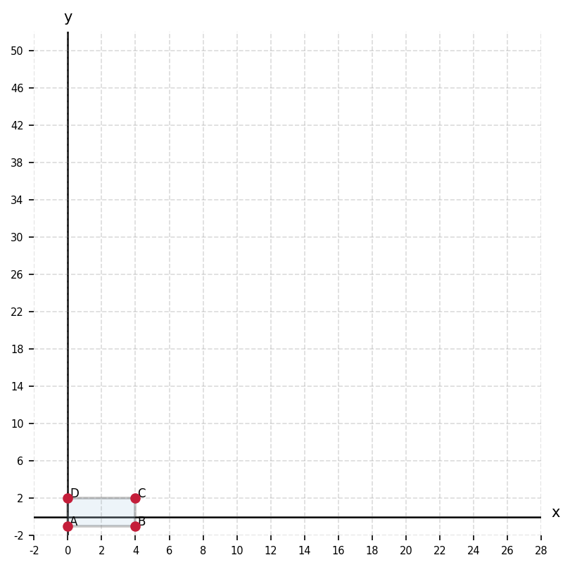
18. נתון מלבן
$ABCD$
עם קודקודים:
$A(0,0)$,
$B(25,0)$,
$C(25,48)$,
$D(0,48)$.
נקודה
$E$
על
$BC$
כך ש-
$BE = 2 \cdot EC$
(
$BC = 48$,
$BE = 32$,
$EC = 16$,
ולכן
$E(25, 32)$).

א. חשבו את אורך האלכסון
$AC$.

ב. חשבו את שטח משולש
$ABE$.

ג. חשבו את שטח משולש
$AEC$.

ד. חשבו את היקף משולש
$AEC$.

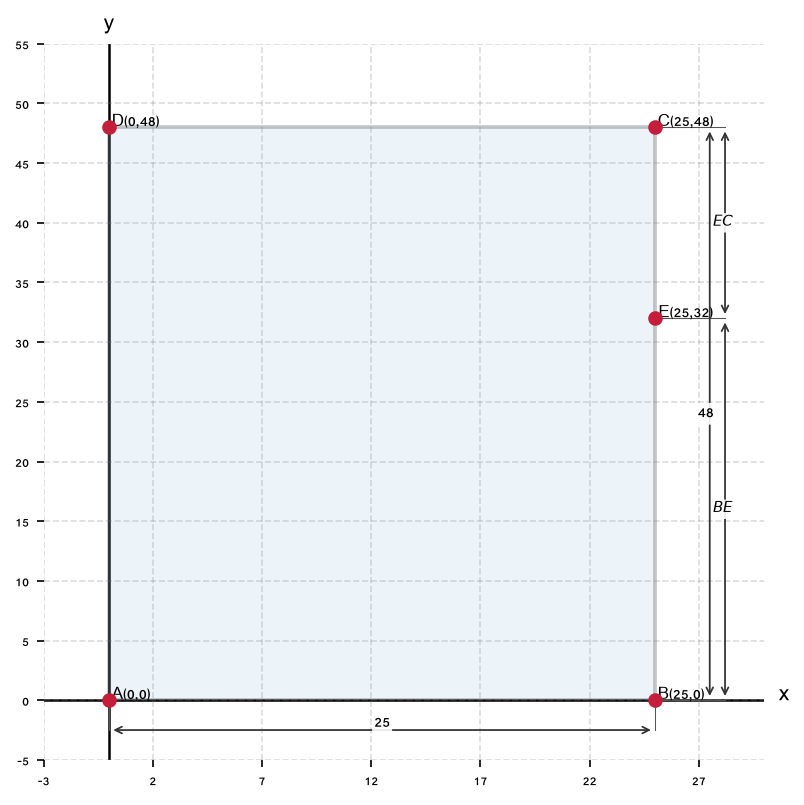
19. להלן סרטוט מתחם:
גבול כולל:
$A(0,0)$,
$B(10,0)$,
$C(10,8)$,
$D(0,8)$.
בריכה: ריבוע
$P(2,2)$,
$Q(6,2)$,
$R(6,6)$,
$S(2,6)$.
שטח א': מלבן
$2 \times 2$
(פינה שמאל-תחתון, מחוץ לבריכה).
שטח ב': מלבן
$4 \times 8$
(עמודה ימנית,
$x = 6$
עד
$x = 10$).

א. חשבו את שטח הכולל של גבול המתחם.

ב. חשבו את שטח הבריכה.

ג. חשבו את שטח שטח ב'.

ד. חשבו את שטח שטח ג' (מה שנשאר לאחר הוצאת הבריכה ושטח ב').

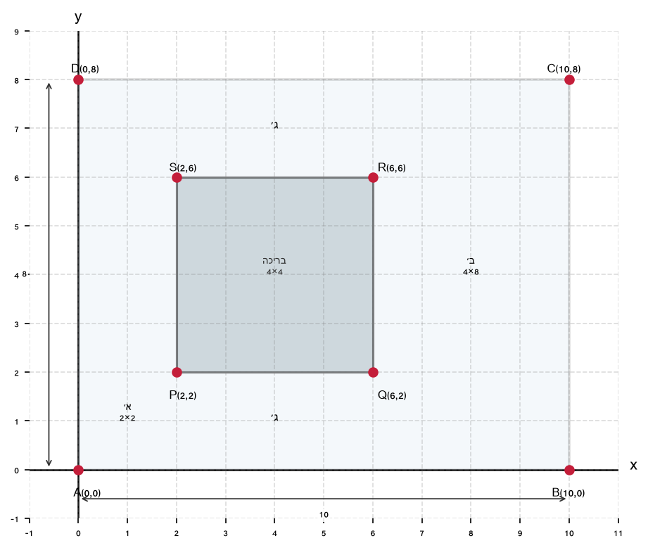
20. נתון מלבן
$ABCD$:
$A(0,0)$,
$B(15,0)$,
$C(15,8)$,
$D(0,8)$.
נקודה
$E$
על הצלע
$CD$
כך ש-
$DE = \frac{1}{3} \cdot DC$
(כלומר,
$E(5, 8)$).
נקודה
$F$
היא נקודת האמצע של
$BC$
(כלומר,
$F(15, 4)$).

א. חשבו את שטח המלבן
$ABCD$.

ב. חשבו את שטח משולש
$DEF$.
(
$D(0,8)$,
$E(5,8)$,
$F(15,4)$:
בסיס
$DE = 5$,
גובה = מרחק
$F$
מציר
$y = 8$
הוא
$4$)

ג. חשבו את שטח הצורה שנותרת לאחר הסרת משולש
$DEF$.

ד. חשבו את אורך הקטע
$EF$.

---

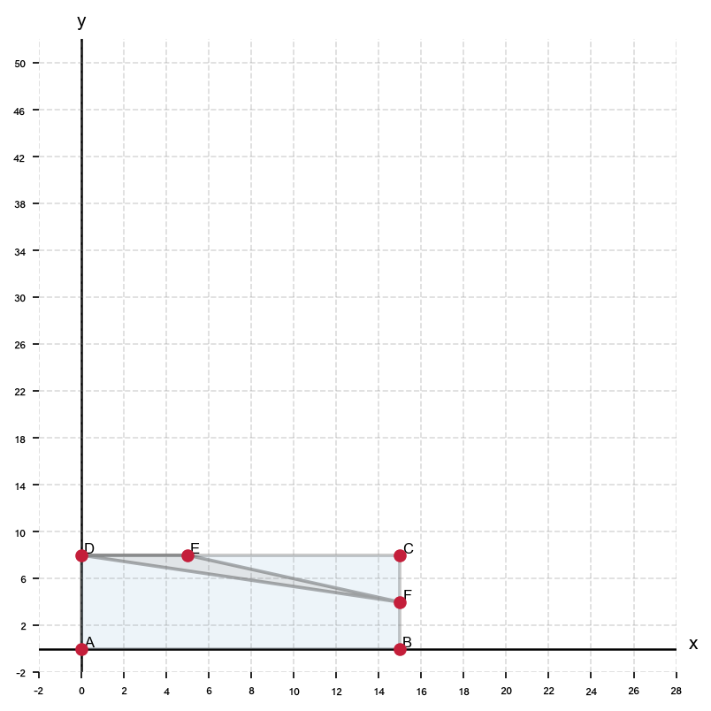

תשובות סופיות

1. שטח
$15$
יח"ר; היקף
$16$
יח'
2. שטח
$16$
יח"ר; היקף
$16$
יח'
3.
$\frac{1}{2}\times6\times4=12$
יח"ר
4. שטח
$20$
יח"ר;
$EF=\sqrt{64+25}=\sqrt{89}$
; היקף
$=8+5+\sqrt{89}=13+\sqrt{89}$
יח'
5.
$5\times3=15$
יח"ר
6.
$\frac{1}{2}\times6\times4=12$
יח"ר
7. אורך $=|7-1|=6$; רוחב $=|6-2|=4$; שטח $=24$ יח"ר
8.
$C(4,4)$
,
$D(0,4)$
; שטח
$=16$
יח"ר
9. א. שטח
$12$
יח"ר; היקף
$14$
יח'; ב.
$M(2,\,0.5)$
; ג. שטח
$ABM=\frac{1}{2}\times4\times1.5=3$
יח"ר
10. א.
$\frac{1}{2}\times10\times6=30$
יח"ר; ב.
$AB=10$
,
$BC=\sqrt{36+36}=6\sqrt{2}$
,
$CA=\sqrt{16+36}=\sqrt{52}=2\sqrt{13}$
11. א.
$A$
ו-
$B$
על
$y=0$
;
$D$
ו-
$C$
על
$y=4$
→ מקבילים; ב.
$AB=10$
,
$CD=6$
; ג.
$\frac{1}{2}(10+6)\times4=32$
יח"ר
12. א. בסיס
$AE=2$
, גובה
$=5$
; שטח
$=5$
יח"ר; ב.
$CE=\sqrt{(6-2)^2+(5-0)^2}=\sqrt{41}$
יח'
13. א.
$PQ=9$
,
$QR=12$
,
$PR=\sqrt{81+144}=15$
; ב.
$9^2+12^2=225=15^2$
✓; ג.
$54$
יח"ר
14. א.
$AB=12$
,
$CD=8$
; ב.
$h=5$
; ג.
$\frac{1}{2}(12+8)\times5=50$
יח"ר
15. א. בסיס
$AB=8$
, גובה
$=2.5$
; שטח
$ABE=10$
יח"ר; ב. שטח מלבן
$=40$
; שטח טרפז
$=30$
יח"ר
16. מלבן
$6\times6=36$
; משולשים פינתיים:
$\frac{1}{2}\times2\times4 + \frac{1}{2}\times2\times4 + \frac{1}{2}\times2\times4 + \frac{1}{2}\times2\times4 = 4\times4=16$
; שטח
$=36-16=20$
יח"ר
17. א.
$AB=CD=4$
,
$BC=DA=3$
; כל זוויות ישרות; ב.
$12$
יח"ר; ג.
$14$
יח'; ד.
$AC=\sqrt{4^2+3^2}=5$
יח'; ה.
$M(2,\,0.5)$
; שטח
$ABM=3$
יח"ר
18. א.
$AC=\sqrt{25^2+48^2}=\sqrt{625+2304}=\sqrt{2929}\approx54.1$
יח'; ב.
$\frac{1}{2}\times25\times32=400$
יח"ר; ג.
$\frac{1}{2}\times25\times16=200$
יח"ר; ד.
$AE=\sqrt{25^2+32^2}=\sqrt{1649}\approx40.6$
; היקף
$=16+\sqrt{2929}+\sqrt{1649}\approx110.8$
יח'
19. א.
$80$
מ"ר; ב.
$4\times4=16$
מ"ר; ג.
$4\times8=32$
מ"ר; ד.
$80-16-32=32$
מ"ר
20. א.
$120$
יח"ר; ב. בסיס
$DE=5$
, גובה
$=4$
; שטח
$=\frac{1}{2}\times5\times4=10$
יח"ר; ג.
$110$
יח"ר; ד.
$EF=\sqrt{(15-5)^2+(4-8)^2}=\sqrt{100+16}=\sqrt{116}=2\sqrt{29}$
יח'

