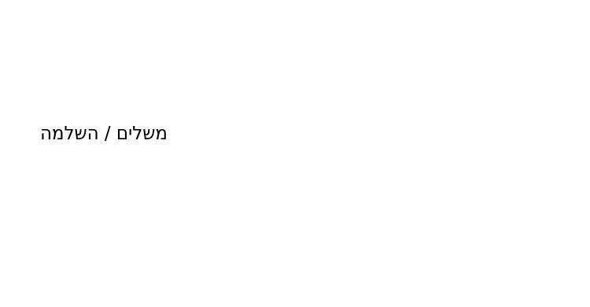
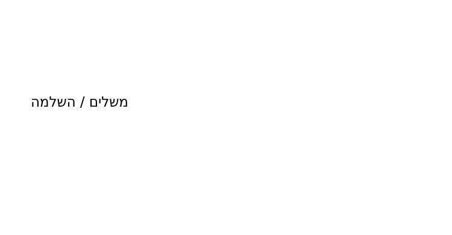
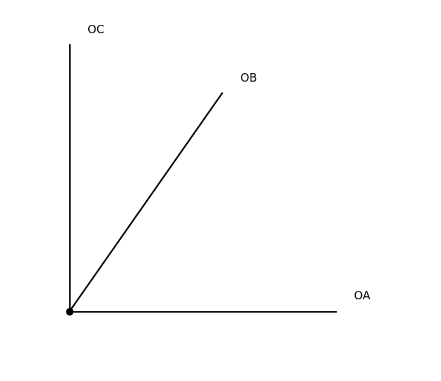
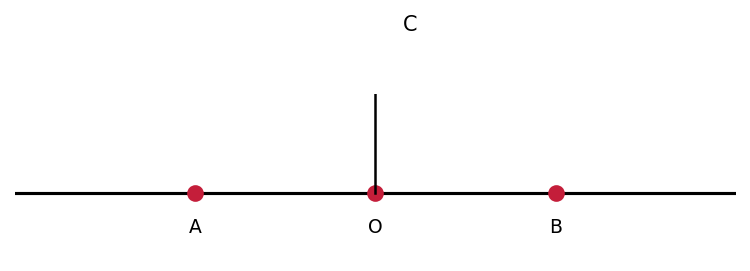
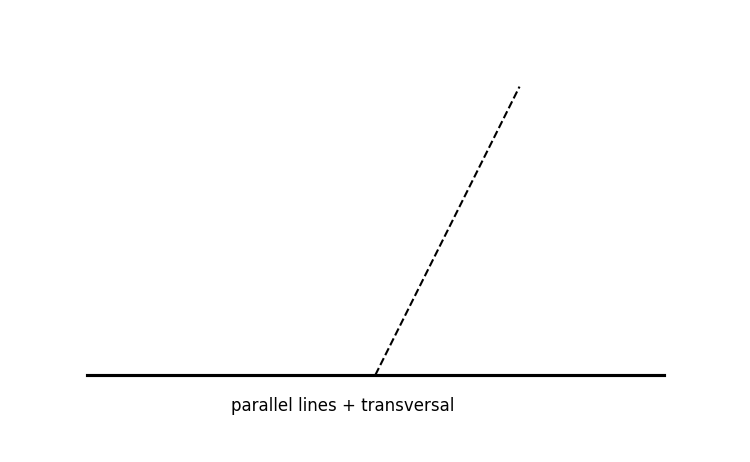
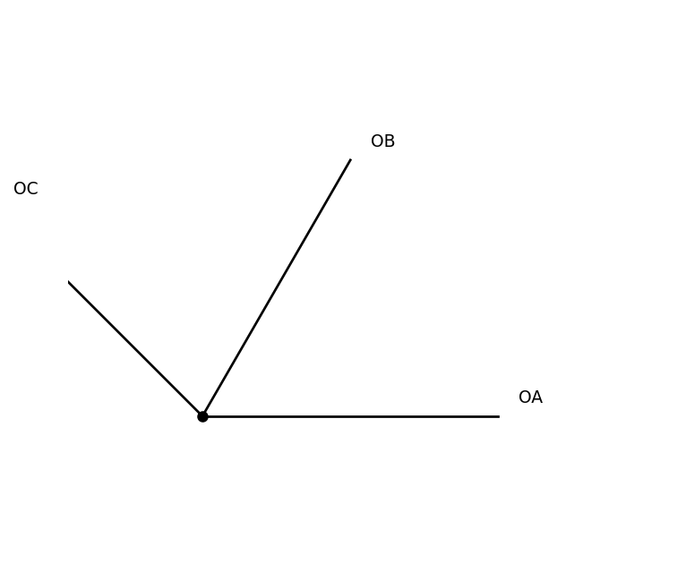
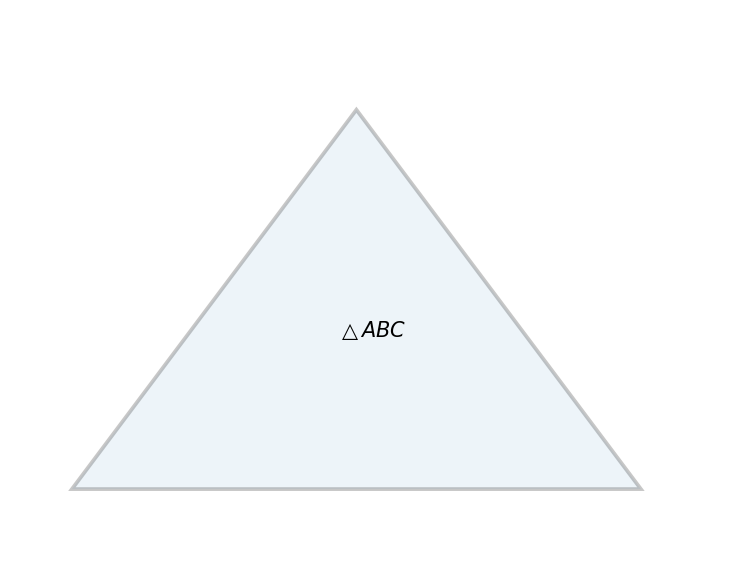
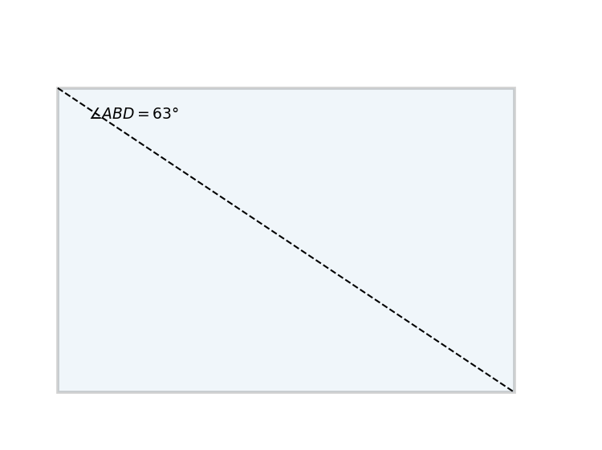

# תת-נושא 2: מושגי יסוד בזוויות (חריפה, ישרה, קהה, שטוחה)

---

## רמה 1: בניית ביטחון (8 תרגילים)

1. סיווגו כל זווית (חריפה / ישרה / קהה / שטוחה):
$$45°, \quad 90°, \quad 130°, \quad 180°$$

2. שתי זוויות הן **משלימות** (סכומן
$180°$).
זווית אחת מודדת
$65°$.
מה מודדת הזווית השנייה?

3. שתי זוויות הן **משלמות** (סכומן
$90°$).
זווית אחת מודדת
$28°$.
מה מודדת הזווית השנייה?

4. שני ישרים נחתכים ויוצרים זוויות קודקודיות.
זווית אחת מודדת
$73°$.
מצאו את שלוש הזוויות האחרות.

5. שלוש זוויות על ישר ישר (סכומן
$180°$):
$50°$,
$70°$,
ומה גודל השלישית?

6. ארבע זוויות סביב נקודה (סכומן
$360°$):
שלוש מהן הן
$90°$,
$110°$,
$80°$.
מה גודל הרביעית?

7. קרן
$OB$
מחלקת זווית ישרה
$\angle AOC$
לשתי זוויות.
$\angle AOB = (x+10)°$.
$\angle BOC = (2x-4)°$.
מצאו את
$x$.

8. זווית ומשלימתה (
$180°$
סכום) נמצאות ביחס
$1:3$.
מצאו את שתי הזוויות.

---

## רמה 2: תרגול שוטף ומשולב (8 תרגילים)

9. שלוש זוויות במשולש מקיימות: סכומן
$180°$.
שתי זוויות הן
$60°$
ו-
$75°$.
מה גודל הזווית השלישית?

10. במקבילית, זוויות סמוכות הן משלימות.
זווית אחת מודדת
$(3x + 10)°$.
הזווית הסמוכה לה מודדת
$(5x - 10)°$.
מצאו את
$x$
ואת שתי הזוויות.

11. שני ישרים מקבילים נחתכים בחוצה-חותך.
זוויות מתחלפות שוות.
זווית אחת מודדת
$(2x + 15)°$
ואחותה המתחלפת מודדת
$(4x - 5)°$.
מצאו את
$x$.

12. בצלע ABCD (מרובע כלשהו), סכום הזוויות הוא
$360°$.
שלוש זוויות הן
$90°$,
$85°$,
$100°$.
מה גודל הזווית הרביעית?

13. זווית
$\alpha$
ומשלימתה
$(180° - \alpha)$
מקיימות:
המשלימה גדולה מהזווית ב-
$40°$.
מצאו את
$\alpha$.

14. זווית ומשלמתה (
$90°$
סכום) נמצאות ביחס
$2:3$.
מצאו את שתי הזוויות.

15. שלוש קרניים
$OA$,
$OB$,
$OC$
יוצאות מנקודה
$O$,
כאשר
$OB$
בין
$OA$
ל-
$OC$.
$\angle AOC = 90°$,
$\angle AOB = (3x - 5)°$,
$\angle BOC = (x + 15)°$.
מצאו את
$x$
ואת כל זווית.

16. ישר
$AB$
ונקודה
$O$
עליו.
קרן
$OC$
יוצאת מ-
$O$
כלפי מעלה ויוצרת זווית
$\angle AOC = (4x + 10)°$.
מצאו את
$x$
כך ש-
$\angle AOC = \angle COB$.

---

## רמה 3: רמת בחינת מה"ט (4 תרגילים)

17. שני ישרים מקבילים נחתכים בחוצה-חותך.
הזווית בין החוצה-חותך לבין הישר הראשון מודדת
$(4x + 10)°$,
והזווית החד-צדדית (זוויות חד-צדדיות – סכומן
$180°$)
על הישר השני מודדת
$(2x + 20)°$.

א. הציבו ופתרו משוואה למציאת
$x$.

ב. חשבו את גודל שתי הזוויות.

ג. מהו סוג כל אחת מהזוויות?

18. משלוש קרניים
$OA$,
$OB$,
$OC$
יוצאות מנקודה
$O$,
כאשר
$OB$
בין
$OA$
ל-
$OC$.
$\angle AOB = (5x - 10)°$,
$\angle BOC = (2x + 5)°$,
$\angle AOC = 135°$.

א. הציבו ופתרו משוואה.

ב. חשבו את
$\angle AOB$
ו-
$\angle BOC$.

ג. סיווגו כל זווית.

19. במשולש
$ABC$,
$\angle A = (2x + 5)°$,
$\angle B = (3x - 15)°$,
$\angle C = (x + 40)°$.

א. הציבו ופתרו: סכום הזוויות במשולש =
$180°$.

ב. חשבו את כל הזוויות.

ג. לאיזה סוג משולש זה שייך? (ישר-זווית / חד-זווית / קהה-זווית)

20. במלבן, כל הזוויות הן
$90°$.
אחת מהאלכסונות של מלבן
$ABCD$
יוצרת זווית
$\angle ABD = 63°$
עם צלע
$AB$.

א. מה גודל הזווית
$\angle ADB$?

ב. מה גודל הזווית
$\angle DBC$?

ג. נתון שאלכסון
$BD = 15.6$
ס"מ.
מצאו את אורך צלעות המלבן. (היעזרו ב-
$\sin 63° \approx 0.891$,
$\cos 63° \approx 0.454$)

---

תשובות סופיות

1.
$45°$
– חריפה;
$90°$
– ישרה;
$130°$
– קהה;
$180°$
– שטוחה
2. $115°$
3. $62°$
4. $107°$, $73°$, $107°$
5. $60°$
6. $80°$
7. $x+10 + 2x-4 = 90 \Rightarrow 3x+6=90 \Rightarrow x=28$
8. $\alpha + 3\alpha = 180 \Rightarrow \alpha=45°$, $135°$
9. $45°$
10.
$3x+10+5x-10=180 \Rightarrow 8x=180 \Rightarrow x=22.5$
;
$77.5°$
ו-
$102.5°$
11. $2x+15=4x-5 \Rightarrow x=10$
12. $85°$
13. $180°-\alpha = \alpha+40 \Rightarrow 2\alpha=140 \Rightarrow \alpha=70°$
14.
$2x+3x=90 \Rightarrow x=18$
;
$36°$
ו-
$54°$
15. $3x-5+x+15=90 \Rightarrow 4x=80 \Rightarrow x=20$; $\angle AOB=55°$, $\angle BOC=35°$
16.
$\angle AOC = \angle COB \Rightarrow$
כל אחת
$= 90°$
;
$4x+10=90 \Rightarrow x=20$
17. א.
$4x+10+2x+20=180 \Rightarrow 6x=150 \Rightarrow x=25$
; ב.
$110°$
ו-
$70°$
; ג. קהה וחריפה
18. א.
$5x-10+2x+5=135 \Rightarrow 7x=140 \Rightarrow x=20$
; ב.
$\angle AOB=90°$
,
$\angle BOC=45°$
; ג. ישרה וחריפה
19. א.
$2x+5+3x-15+x+40=180 \Rightarrow 6x+30=180 \Rightarrow x=25$
; ב.
$55°$
,
$60°$
,
$65°$
; ג. חד-זווית
20. א.
$\angle ADB = 90°-63°=27°$
; ב.
$\angle DBC = 90°-27°=63°$
; ג.
$AB = BD \cdot \sin 63° = 15.6 \times 0.891 \approx 13.9$
ס"מ;
$AD = BD \cdot \cos 63° = 15.6 \times 0.454 \approx 7.1$
ס"מ

