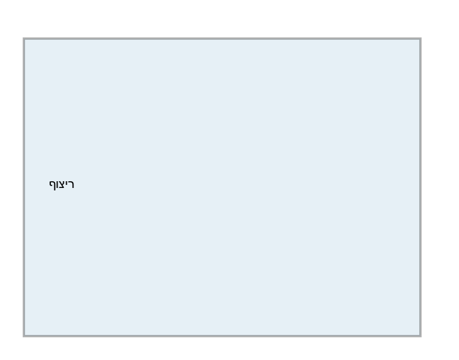
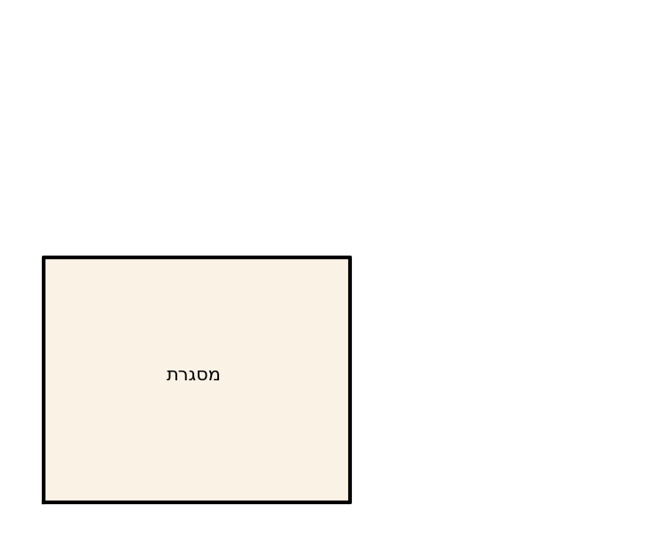
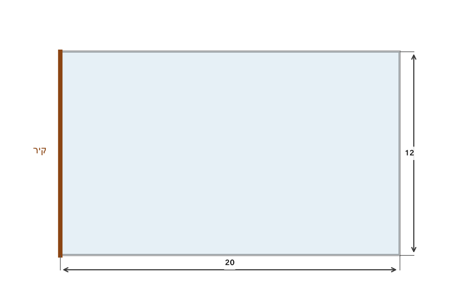
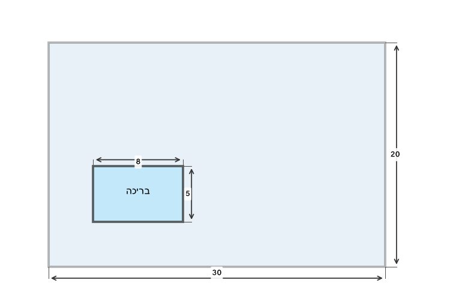

# תת-נושא 3: ההבדל הקריטי בין היקף (מסגרת/גדר) לשטח (פנים/ריצוף)

---

## רמה 1: בניית ביטחון (8 תרגילים)

1. גנן רוצה לגדר גינה מלבנית שאורכה
$8$
מ' ורוחבה
$5$
מ'.
כמה מטרים של גדר נדרשים?

2. אותה גינה מהתרגיל הקודם מרוצפת.
כמה מ"ר של ריצוף נדרשים?

3. ריבוע שצלעו
$7$
ס"מ.
חשבו את **ההיקף** ואת **השטח**.

4. חדר מלבני שאורכו
$6$
מ' ורוחבו
$4$
מ' מרוצף.
עלות הריצוף
$90$
₪ למ"ר.
מה עלות הריצוף הכוללת?

5. אותו חדר מהתרגיל הקודם מוגדר בחיפוי קירות.
עלות חיפוי הקירות (היקף ×
גובה
$1$
מ') הינה
$50$
₪ למ"ר.
מה עלות חיפוי הקירות?

6. מגרש ריבועי שצלעו
$10$
מ'.
עלות גידור:
$30$
₪ למ'.
עלות ריצוף:
$60$
₪ למ"ר.
חשבו בנפרד את עלות הגידור ועלות הריצוף.

7. מסגרת תמונה מלבנית:
אורך
$30$
ס"מ, רוחב
$20$
ס"מ.
מה אורך המסגרת (ההיקף)?

8. לוח גן-ילדים ריבועי שצלעו
$12$
מ'.
כמה מ' של גדר נדרשים לגדר מסביב?
כמה מ"ר שטח יש ללוח?

---

## רמה 2: תרגול שוטף ומשולב (8 תרגילים)

9. חלקת אדמה מלבנית שאורכה
$25$
מ' ורוחבה
$18$
מ'.

א. כמה מ' של גדר נדרשים?

ב. כמה מ"ר לזרוע?

ג. עלות הגדר
$45$
₪ למ' ועלות הזריעה
$12$
₪ למ"ר. חשבו כל עלות.

10. מגרש שאורכו
$L$
מ' ורוחבו
$W$
מ'.
כתבו נוסחאות לחישוב ההיקף והשטח.
אם
$L = 2W$
וההיקף הוא
$60$
מ', מצאו את
$L$
ואת
$W$.

11. שני מלבנים:
- מלבן א': אורך
$10$
ס"מ, רוחב
$6$
ס"מ.
- מלבן ב': אורך
$12$
ס"מ, רוחב
$4$
ס"מ.

לאיזה יש היקף גדול יותר? לאיזה יש שטח גדול יותר?

12. גינה מלבנית שהיקפה
$56$
מ' ואורכה פי
$2$
מרוחבה.
מצאו את ממדיה ואת שטחה.

13. ריצוף חדר מלבני עולה
$2{ }400$
₪.
אורך החדר
$8$
מ' ועלות הריצוף
$50$
₪ למ"ר.
מצאו את רוחב החדר.

14. מסגרת עץ לתמונה עולה לפי האורך הכולל שלה.
תמונה מלבנית: אורך
$40$
ס"מ, רוחב
$30$
ס"מ.
רוצים להוסיף שוליים של
$5$
ס"מ מכל צד.
מצאו את ההיקף החדש של המסגרת.

15. שני ריבועים:
הריבוע הגדול צלעו
$a$
ס"מ, הריבוע הקטן צלעו
$b$
ס"מ.
כתבו ביטויים להפרש ההיקפים ולהפרש השטחים.

16. גינה בצורת L מורכבת משני מלבנים:
- מלבן ראשון:
$10 \times 4$
מ'.
- מלבן שני:
$6 \times 3$
מ' (מחובר לצד).
חשבו את **שטח** הצורה כולה.
(להיקף: שרטטו ומנו את הצלעות החיצוניות בלבד)

---

## רמה 3: רמת בחינת מה"ט (4 תרגילים)

17. גינה ציבורית מלבנית שאורכה
$15$
מ' ורוחבה
$8$
מ'.
בפינה אחת הוקם דשא בצורת ריבוע שצלעו
$4$
מ'.

א. חשבו את שטח הגינה הכוללת.

ב. חשבו את שטח הדשא.

ג. חשבו את שטח הגינה שמחוץ לדשא.

ד. עלות ריצוף השטח שמחוץ לדשא:
$65$
₪ למ"ר. מה העלות הכוללת?

18. מגרש מלבני שאורכו
$20$
מ' ורוחבו
$12$
מ'.
רוצים לגדר רק שלושה צדדים (הצד הרביעי הוא קיר).

א. מה אורך הגדר הנדרש?

ב. עלות הגדר
$80$
₪ למ'. מה העלות הכוללת?

ג. בנוסף, רוצים לרצף את כל המגרש בעלות
$55$
₪ למ"ר. מה העלות הכוללת של ריצוף?

19. ריבוע גדול שצלעו
$12$
ס"מ.
ממנו נחתך ריבוע קטן פינתי שצלעו
$3$
ס"מ.

א. מה שטח הצורה שנותרה?

ב. מה ההיקף של הצורה שנותרה?
(שימו לב: ספרו את כל הצלעות החיצוניות)

ג. האם ההיקף גדל או קטן לעומת הריבוע המקורי? הסבירו.

20. בית ספר רוצה לרצף חצר מלבנית שממדיה
$30 \times 20$
מ'.
ובתוכה בריכת שחייה מלבנית שממדיה
$8 \times 5$
מ'.

א. חשבו את שטח החצר ללא הבריכה.

ב. עלות ריצוף החצר (ללא הבריכה):
$120$
₪ למ"ר. מה העלות הכוללת?

ג. רוצים גם לגדר את היקף הבריכה. עלות הגדר:
$200$
₪ למ'. מה עלות גידור הבריכה?

---

תשובות סופיות

1.
$26$
מ'.

2.
$40$
מ"ר.

3. היקף
$28$
ס"מ; שטח
$49$
ס"מ².

4.
$2{ }160$
₪.

5.
$1{ }000$
₪.

6. גידור
$400$
₪; ריצוף
$6{ }000$
₪.

7. היקף המסגרת
$100$
ס"מ.

8. גדר
$48$
מ'; שטח
$144$
מ"ר.

9.
א.
גדר
$86$
מ';
ב.
$450$
מ"ר;
ג.
מחיר הגדר וריצוף כנתון.

10.
$P=2(L+W)$,
$S=LW$.
מצב
$L=2W$
והיקף
$60$
נותן
$L=20$
מ' ו-
$W=10$
מ'.

11. היקף של א' ושל ב' שווה
$32$
; שטח א'
$60$
גדול משטח ב'
$48$.

12.
$W=\frac{28}{3}$
מ',
$L=\frac{56}{3}$
מ'; שטח
$\frac{1568}{9}\approx174.2$
מ"ר.

13.
$6$
מ'.

14. ממדים
$50\times40$
ס"מ; היקף
$180$
ס"מ.

15. הפרש היקפים
$4(a-b)$;
הפרש שטחים
$a^2-b^2$.

16. שטח
$58$
מ"ר; היקף חיצוני לפי שרטוט.

17.
א.
$120$
מ"ר;
ב.
$16$
מ"ר;
ג.
$104$
מ"ר;
ד.
$6{ }760$
₪.

18.
א.
$52$
מ';
ב.
$4{ }160$
₪;
ג.
$13{ }200$
₪.

19.
א.
$135$
ס"מ²;
ב.
ההיקף גדל כי נוספות צלעות פנימיות.

20.
א.
$560$
מ"ר;
ב.
$67{ }200$
₪;
ג.
$5{ }200$
₪.

