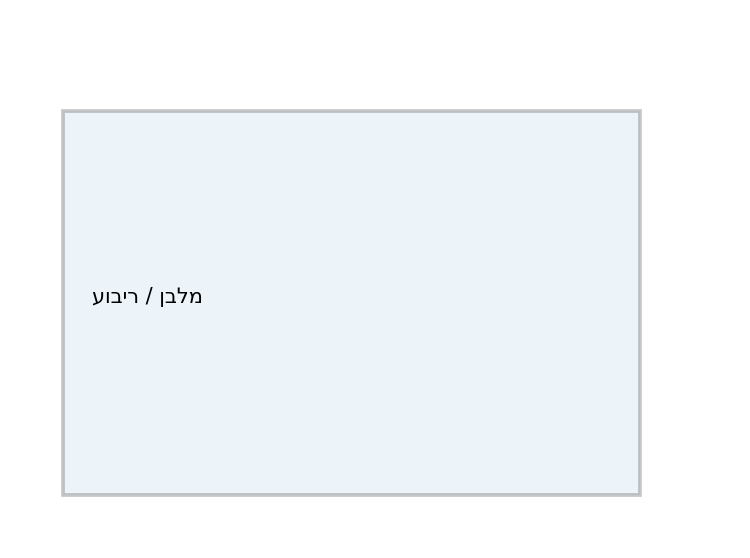
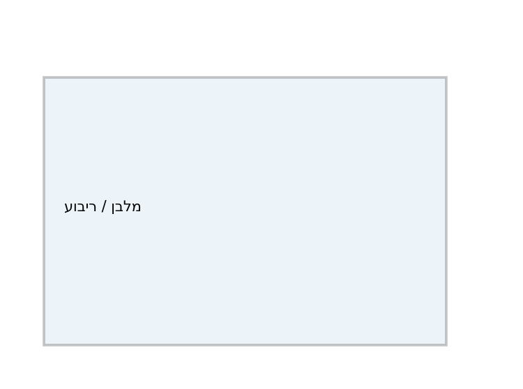
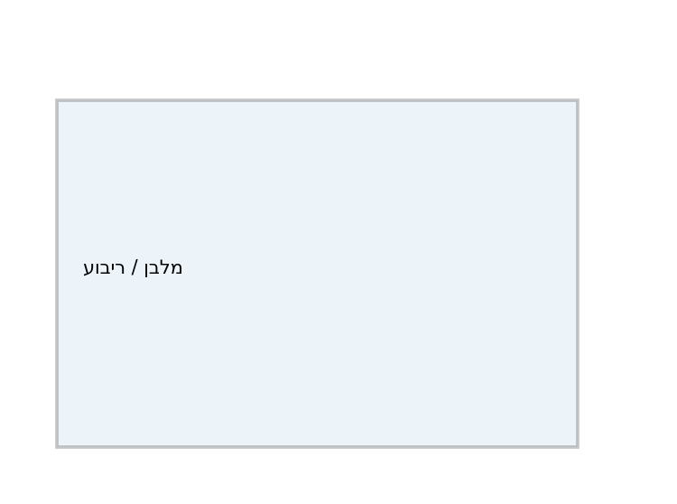
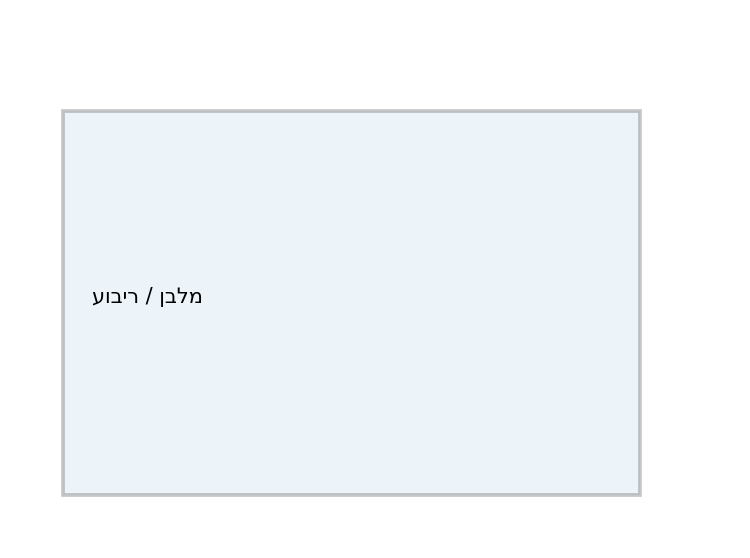

# תת-נושא 4: תכונות המלבן והריבוע (צלעות וזוויות)

---

## רמה 1: בניית ביטחון (8 תרגילים)

1. ציינו את תכונות המלבן:
כמה צלעות יש לו? מה גודל כל זווית? אילו צלעות שוות?

2. ציינו בנוסף לתכונות המלבן: מה מיוחד בריבוע לעומת מלבן רגיל?

3. במלבן
$ABCD$,
$AB = 9$
ס"מ ו-
$BC = 5$
ס"מ.
מה אורכי הצלעות
$CD$
ו-
$DA$?

4. בריבוע
$PQRS$,
$PQ = 7$
ס"מ.
מה אורכי שאר הצלעות?

5. האם כל ריבוע הוא מלבן? הסבירו.

6. האם כל מלבן הוא ריבוע? הסבירו.

7. במלבן
$ABCD$,
האלכסון
$AC = 13$
ס"מ.
האם האלכסון
$BD$
שווה, גדול או קטן מ-
$AC$?
הסבירו.

8. מה גודל כל זווית בריבוע? מה גודל כל זווית במלבן?

---

## רמה 2: תרגול שוטף ומשולב (8 תרגילים)

9. במלבן
$ABCD$,
$AB = 12$
ס"מ,
$BC = 5$
ס"מ.
א. חשבו את אורך האלכסון
$AC$
(משפט פיתגורס).
ב. מה אורך האלכסון
$BD$?

10. בריבוע
$ABCD$,
$AB = 8$
ס"מ.
חשבו את אורך האלכסון
$AC$.
(רמז:
$AC = AB\sqrt{2}$)

11. מרובע
$EFGH$
עם
$EF = 6$
ס"מ,
$FG = 6$
ס"מ,
$GH = 6$
ס"מ,
$HE = 6$
ס"מ,
וזוויות כולן
$90°$.
מהו שם הצורה? מה מיוחד בה?

12. מרובע
$MNOP$
עם
$MN = MO \cdot ...$
מצד אחד שוות,
וזוויות כולן
$90°$.
אם
$MN = 10$
ס"מ ו-
$NO = 7$
ס"מ, מהו שם הצורה?

13. במלבן
$ABCD$,
נקודה
$M$
היא נקודת מפגש האלכסונים.
אם
$AM = 6.5$
ס"מ, מה אורך האלכסון
$AC$?
(רמז: באלכסוני המלבן,
$M$
מחלקת כל אלכסון לשניים שווים)

14. מרובע שלכל זוויותיו
$90°$
וצלעות נגדיות שוות.
אם
$AB = 15$
ס"מ ו-
$BC = 9$
ס"מ, מצאו את ממדי האלכסון.

15. בריבוע
$ABCD$,
נקודת מפגש האלכסונים
$M$
נמצאת במרכז.
אם
$AM = 5\sqrt{2}$
ס"מ, מה צלע הריבוע?

16. במלבן
$ABCD$,
$AB = 3x + 2$
ס"מ ו-
$CD = 5x - 8$
ס"מ.
מצאו את
$x$
ואת אורך הצלע.

---

## רמה 3: רמת בחינת מה"ט (4 תרגילים)

17. נתון מלבן
$ABCD$
שאורכי צלעותיו
$AB = 25$
ס"מ ו-
$BC = 48$
ס"מ.
הנקודה
$E$
נמצאת על צלע
$BC$
כך ש-
$BE = 2 \cdot EC$.

א. חשבו את
$BE$
ואת
$EC$.

ב. חשבו את אורך האלכסון
$AC$.

ג. הוכיחו שהמשולש
$ABE$
אינו ישר-זווית על-ידי בדיקת משפט פיתגורס.

18. נתון מרובע
$ABCD$
שקודקודיו הם:
$A(0,-1)$,
$B(4,-1)$,
$C(4,2)$,
$D(0,2)$.

א. חשבו את אורכי כל הצלעות.

ב. הראו שהמרובע הוא מלבן (כל הזוויות ישרות).

ג. חשבו את שטח המלבן.

ד. מצאו את שיעורי נקודת מפגש האלכסונים
$M$.

19. במלבן
$ABCD$,
$\angle ABD = 63°$.
נקודה
$M$
היא מפגש האלכסונים.
הנקודה
$E$
נמצאת על
$CD$
כך שקטע
$ME$
מקביל לצלע
$AD$.
כמו כן,
$CM = 7.8$
מ'.

א. חשבו את
$BM$
(מדוע
$BM = CM$?).

ב. חשבו את אורכי צלעות המלבן.
(השתמשו ב-
$\sin 63° \approx 0.891$,
$\cos 63° \approx 0.454$)

ג. חשבו את שטח המלבן.

20. נתון ריבוע
$ABCD$
שצלעו
$(x + 3)$
ס"מ ומלבן
$EFGH$
שאורכו
$(x + 7)$
ס"מ ורוחבו
$(x + 1)$
ס"מ.
נתון ששטח הריבוע שווה לשטח המלבן.

א. כתבו משוואה ופתרו למציאת
$x$.

ב. חשבו את שטח הריבוע.

ג. השוו את ההיקפים: לאיזו צורה יש היקף גדול יותר?

---

תשובות סופיות

1. 4 צלעות; כל זווית
$90°$
; צלעות נגדיות שוות
2. בריבוע – כל ארבע הצלעות שוות
3.
$CD=9$
ס"מ,
$DA=5$
ס"מ
4.
$QR=RS=SP=7$
ס"מ
5. כן – לריבוע יש 4 זוויות ישרות וצלעות נגדיות שוות, תכונות המלבן
6. לא – רק אם כל ארבע הצלעות שוות
7. שווה – אלכסוני מלבן שווים
8.
$90°$
בשניהם
9. א.
$AC=\sqrt{144+25}=\sqrt{169}=13$
ס"מ; ב.
$BD=13$
ס"מ
10.
$AC=8\sqrt{2} \approx 11.31$
ס"מ
11. ריבוע – כל צלעות שוות וכל זוויות
$90°$
12. מלבן
13.
$AC = 13$
ס"מ
14. אלכסון
$= \sqrt{225+81}=\sqrt{306}=3\sqrt{34} \approx 17.49$
ס"מ
15. האלכסון
$= 2 \times 5\sqrt{2}=10\sqrt{2}$
; ריבוע:
$d = a\sqrt{2} \Rightarrow 10\sqrt{2}=a\sqrt{2} \Rightarrow a=10$
ס"מ
16.
$3x+2=5x-8 \Rightarrow x=5$
; הצלע
$=17$
ס"מ
17. א.
$BE=32$
ס"מ,
$EC=16$
ס"מ; ב.
$AC=\sqrt{AB^2+BC^2}=\sqrt{625+2304}=\sqrt{2929}\approx54.1$
ס"מ; ג.
$AB^2+BE^2 = 625+1024=1649 \neq AE^2$
(לא ישר-זווית)
18. א.
$AB=4$
,
$BC=3$
,
$CD=4$
,
$DA=3$
; ב. כל הצלעות ניצבות זו לזו (אנכיות/אופקיות); ג.
$12$
יח"ר; ד.
$M(2, 0.5)$
19. א.
$BM=CM=7.8$
מ' (אלכסוני מלבן חוצים זה את זה); ב.
$AB=BD\cdot\sin 63°=15.6\times0.891\approx13.9$
מ',
$AD=BD\cdot\cos 63°=15.6\times0.454\approx7.1$
מ'; ג.
$\approx98.7$
מ"ר
20. א.
$(x+3)^2=(x+7)(x+1) \Rightarrow x^2+6x+9=x^2+8x+7 \Rightarrow 2=2x \Rightarrow x=1$
; ב. שטח
$= 4^2=16$
ס"מ²; ג. היקף ריבוע
$=16$
ס"מ, היקף מלבן
$=2(8+2)=20$
ס"מ – למלבן היקף גדול יותר

