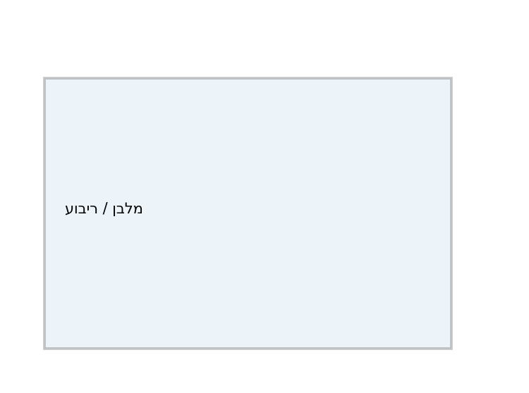
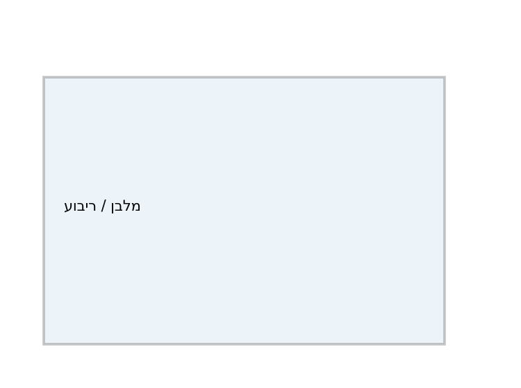
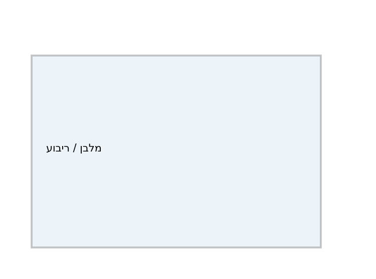
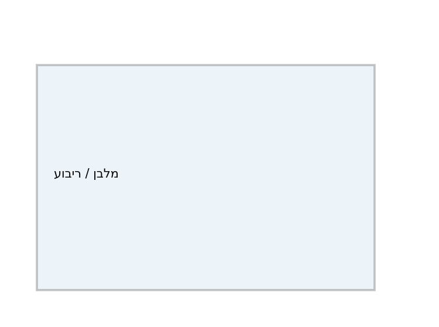
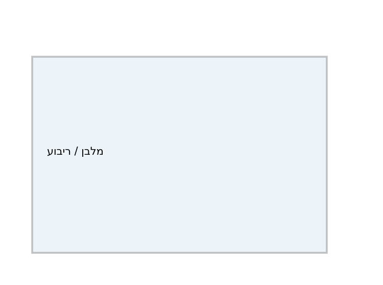
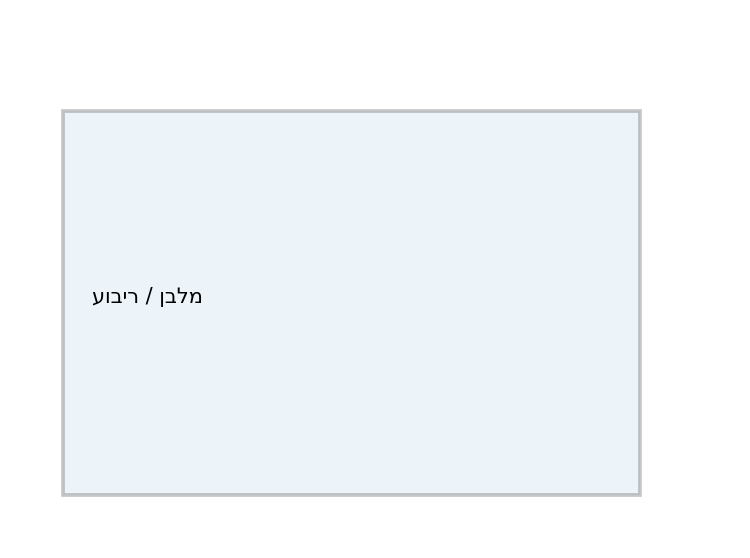
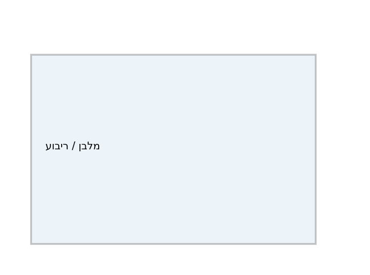

# תת-נושא 5: חישובי היקף ושטח (מלבן וריבוע)

---

## רמה 1: בניית ביטחון (8 תרגילים)

1. חשבו את שטח המלבן שאורכו
$8$
ס"מ ורוחבו
$5$
ס"מ.

2. חשבו את היקף המלבן שאורכו
$12$
ס"מ ורוחבו
$7$
ס"מ.

3. חשבו את שטח הריבוע שצלעו
$9$
ס"מ.

4. חשבו את היקף הריבוע שצלעו
$11$
ס"מ.

5. שטח מלבן הוא
$48$
ס"מ² ואורכו
$8$
ס"מ.
מה רוחב המלבן?

6. היקף ריבוע הוא
$36$
ס"מ.
מה אורך צלעו ומה שטחו?

7. מלבן שאורכו
$7$
ס"מ ורוחבו
$4$
ס"מ.
חשבו את ההיקף ואת השטח.

8. ריבוע שצלעו
$6$
ס"מ.
חשבו את ההיקף ואת השטח.

---

## רמה 2: תרגול שוטף ומשולב (8 תרגילים)

9. מלבן שאורכו גדול מרוחבו ב-
$5$
ס"מ.
ההיקף הוא
$42$
ס"מ.
מצאו את ממדי המלבן ואת שטחו.

10. היקף ריבוע שווה להיקף מלבן שאורכו
$10$
ס"מ ורוחבו
$6$
ס"מ.
מצאו את שטח הריבוע.

11. שטח מלבן שאורכו
$9$
ס"מ שווה לשטח ריבוע שצלעו
$6$
ס"מ.
מצאו את רוחב המלבן.

12. מגרש מלבני שאורכו פי
$3$
מרוחבו ושטחו
$75$
מ"ר.
מצאו את ממדי המגרש.

13. גנן רוצה לגדר גינה מלבנית שאורכה
$7$
מ' ורוחבה
$4$
מ'.
עלות הגדר היא
$15$
₪ למטר.
מה עלות הגדר הכוללת?

14. חדר מלבני שאורכו
$5$
מ' ורוחבו
$3$
מ' מרוצף בעלות של
$80$
₪ למ"ר.
מה עלות הריצוף הכוללת?

15. ריבוע
$ABCD$
שצלעו
$10$
ס"מ.
בתוכו ריבוע
$EFGH$
שצלעו מחצית מצלע
$ABCD$.
חשבו את שטח האזור שבין שני הריבועים.

16. מלבן שאורכו פי
$3$
מרוחבו.
מוסיפים
$2$
ס"מ לאורך ו-
$2$
ס"מ לרוחב.
השטח החדש גדול מהמקורי ב-
$52$
ס"מ².
מצאו את ממדי המלבן המקוריים.

---

## רמה 3: רמת בחינת מה"ט (4 תרגילים)

17. נתון מלבן
$ABCD$
שאורכו
$7.5$
מ' ורוחבו
$4.5$
מ'.
נקודה
$E$
נמצאת על הצלע
$CD$
כך ש-
$DE = 2 \cdot EC$.

א. מה שטח המלבן
$ABCD$?
מה היקפו?

ב. חשבו את
$DE$
ואת
$EC$.

ג. חשבו את שטח המשולש
$AEB$.
(רמז: בסיס
$AB$
= אורך המלבן; גובה = רוחב המלבן)

18. נתון מלבן
$ABCD$
שאורכי צלעותיו
$AB = 12$
ס"מ ו-
$BC = 26$
ס"מ.
הנקודה
$E$
נמצאת על הצלע
$BC$
כך שמתקיים
$AB = BE$.

א. חשבו את
$BE$
ואת
$EC$.

ב. חשבו את אורך האלכסון
$AC$.

ג. חשבו את שטח המשולש
$ABE$.

19. מגרש מלבני שאורכו פי
$2$
מרוחבו, וההיקף הכולל הוא
$84$
מ'.

א. מצאו את ממדי המגרש.

ב. חשבו את שטח המגרש.

ג. עלות ריצוף המגרש:
$45$
₪ למ"ר.
מה העלות הכוללת?

20. נתון מלבן
$ABCD$,
$AB = 8$
ס"מ ו-
$BC = 15$
ס"מ.
הנקודה
$E$
נמצאת על הצלע
$BC$
כך ש-
$BE = 2 \cdot EC$.

א. חשבו את
$BE$
ואת
$EC$.

ב. חשבו את שטח המשולש
$ABE$.

ג. חשבו את שטח המשולש
$AEC$.

ד. בדקו: האם שטח
$ABE$
+ שטח
$AEC$
= שטח המלבן
$ABCD$ ÷ 2?
הסבירו.

---

תשובות סופיות

1.
$40$
ס"מ²
2.
$38$
ס"מ
3.
$81$
ס"מ²
4.
$44$
ס"מ
5.
$6$
ס"מ
6. צלע
$9$
ס"מ; שטח
$81$
ס"מ²
7. היקף
$22$
ס"מ; שטח
$28$
ס"מ²
8. היקף
$24$
ס"מ; שטח
$36$
ס"מ²
9.
$w + w + 5 + w + w + 5 = 42 \Rightarrow w = 8$
ס"מ,
$l = 13$
ס"מ; שטח
$104$
ס"מ²
10. היקף מלבן
$= 32$
ס"מ; צלע ריבוע
$= 8$
ס"מ; שטח
$= 64$
ס"מ²
11.
$9 \times w = 36 \Rightarrow w = 4$
ס"מ
12.
$w \times 3w = 75 \Rightarrow w^2=25 \Rightarrow w=5$
מ',
$l=15$
מ'
13. $2(7+4)\times 15 = 330$ ₪
14. $5 \times 3 \times 80 = 1{ }200$ ₪
15.
$100 - 25 = 75$
ס"מ²
16.
$(l+2)(w+2) = lw+52$
;
$l=3w$
:
$(3w+2)(w+2)=3w^2+52 \Rightarrow 8w+4=52 \Rightarrow w=6$
ס"מ,
$l=18$
ס"מ
17. א. שטח
$33.75$
מ"ר; היקף
$24$
מ'; ב.
$DE=5$
מ',
$EC=2.5$
מ'; ג. שטח
$ABE = \frac{1}{2}\times7.5\times4.5=16.875$
מ"ר
18. א.
$BE=12$
ס"מ,
$EC=14$
ס"מ; ב.
$AC=\sqrt{144+676}=\sqrt{820}=2\sqrt{205}\approx28.6$
ס"מ; ג. שטח
$=\frac{1}{2}\times12\times12=72$
ס"מ²
19. א.
$2(2w+w)=84 \Rightarrow w=14$
מ',
$l=28$
מ'; ב.
$392$
מ"ר; ג.
$17{ }640$
₪
20. א.
$BE=10$
ס"מ,
$EC=5$
ס"מ; ב. שטח
$ABE = \frac{1}{2}\times8\times10=40$
ס"מ²; ג. שטח
$AEC=\frac{1}{2}\times8\times5=20$
ס"מ²; ד.
$40+20=60=\frac{120}{2}$
✓

