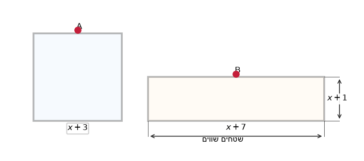
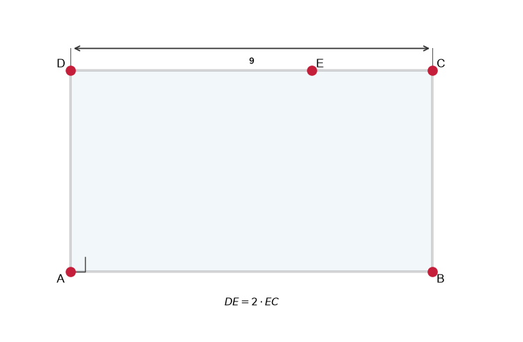
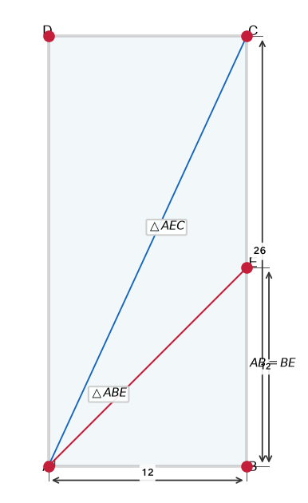

# תת-נושא 6: שילוב אלגברה בסיסית (יחסים בין צלעות ומשוואות)

---

## רמה 1: בניית ביטחון (8 תרגילים)

1. צלעות מלבן הן
$3x$
ס"מ ו-
$2x$
ס"מ.
ההיקף הוא
$50$
ס"מ.
מצאו את
$x$
ואת ממדי המלבן.

2. צלע ריבוע היא
$(x + 3)$
ס"מ ושטחו
$49$
ס"מ².
מצאו את
$x$.

3. אורך מלבן גדול מרוחבו ב-
$4$
ס"מ.
ההיקף הוא
$28$
ס"מ.
מצאו את הממדים.

4. אורך מלבן הוא פי
$2$
מרוחבו.
שטחו
$50$
ס"מ².
מצאו את ממדי המלבן.

5. ריבוע שצלעו
$(2x - 1)$
ס"מ.
ההיקף הוא
$28$
ס"מ.
מצאו את
$x$.

6. מלבן שאורכו
$(x + 5)$
ס"מ ורוחבו
$(x - 1)$
ס"מ.
ההיקף הוא
$36$
ס"מ.
מצאו את
$x$
ואת שטח המלבן.

7. שטח ריבוע הוא
$(x^2 + 6x + 9)$
ס"מ².
מצאו את אורך צלעו.

8. היקף ריבוע שווה להיקף מלבן.
המלבן: אורך
$10$
ס"מ, רוחב
$6$
ס"מ.
מצאו את שטח הריבוע.

---

## רמה 2: תרגול שוטף ומשולב (8 תרגילים)

9. מלבן שאורכו
$(3x + 2)$
ס"מ ורוחבו
$(x + 1)$
ס"מ.
שטחו
$63$
ס"מ².
מצאו את
$x$
ואת ממדי המלבן.

10. שני ריבועים:
הגדול צלעו
$(x + 4)$
ס"מ, הקטן צלעו
$(x - 2)$
ס"מ.
הפרש שטחיהם הוא
$60$
ס"מ².
מצאו את
$x$.

11. צלעות מלבן הן
$(2a + 3)$
ס"מ ו-
$(a - 1)$
ס"מ.
שטחו
$84$
ס"מ².
מצאו את
$a$.

12. אורך מלבן גדול מרוחבו ב-
$3$
ס"מ.
שטחו
$88$
ס"מ².
מצאו את ממדי המלבן.
(רמז: הצבו
$l = w + 3$)

13. ריבוע
$A$
שצלעו
$(x + 3)$
ס"מ ומלבן
$B$
שאורכו
$(x + 7)$
ס"מ ורוחבו
$(x + 1)$
ס"מ.
שטחי שני הצורות שווים.
מצאו את
$x$.

14. נקודה
$E$
על צלע
$CD$
של מלבן
$ABCD$
כך ש-
$DE = k \cdot EC$.
אם
$CD = 9$
ס"מ ו-
$k = 2$,
מצאו את
$DE$
ואת
$EC$.

15. מלבן שאורכו גדול מרוחבו ב-
$7$
ס"מ.
ריבוע שצלעו שווה לרוחב המלבן.
שטח המלבן גדול משטח הריבוע ב-
$56$
ס"מ².
מצאו את הרוחב ואת האורך.

16. מגרש מלבני:
כל הגדלת האורך ב-
$1$
מ' מגדילה את השטח ב-
$8$
מ"ר.
מה רוחב המגרש?

---

## רמה 3: רמת בחינת מה"ט (4 תרגילים)

17. נתון מלבן
$ABCD$:
$AB = 50$
ס"מ,
$AD = 20$
ס"מ.
נקודה
$E$
על
$BC$
כך ש-
$BE = 10$
ס"מ.
נקודה
$F$
על
$AB$
כך ש-
$BF = 5$
ס"מ.

א. חשבו את שטח המלבן
$ABCD$.

ב. חשבו את שטח המשולש
$BEF$.

ג. חשבו את שטח הצורה הנותרת (מלבן פחות משולש).

18. נקודה
$E$
על צלע
$AB$
של מלבן
$ABCD$
כך ש-
$AE:EB = 1:4$.
נתון
$AB = 25$
ס"מ ו-
$AD = 10$
ס"מ.

א. מצאו את
$AE$
ואת
$EB$.

ב. מצאו את שטח המשולש
$ADE$.

ג. מצאו את שטח הטרפז
$EBCD$.

19. נתון מלבן
$ABCD$,
$AB = 8$
ס"מ,
$BC = 19$
ס"מ.
הנקודה
$E$
נמצאת על אמצע צלע
$AB$.
הקטע
$EF$
מאונך לצלע
$AB$
ואורכו פי
$2$
מאורך המלבן (כלומר
$EF = 2 \times BC = 38$
ס"מ).

א. חשבו את שטח המשולש
$ABF$.

ב. חשבו את יחס שטח המשולש
$ABF$
לעומת שטח המלבן
$ABCD$.

ג. מהו
$\tan(\angle BAF)$?
(רמז:
$\tan = \frac{opp}{adj}$
)

20. נתון מלבן
$ABCD$,
$AB = 12$
ס"מ,
$BC = 26$
ס"מ.
הנקודה
$E$
נמצאת על הצלע
$BC$
כך שמתקיים
$AB = BE$.

א. חשבו את
$BE$
ואת
$EC$.

ב. חשבו את שטח המשולש
$ABE$.

ג. חשבו את שטח המשולש
$AEC$.

ד. חשבו את היקף המשולש
$AEC$
(מצאו את
$AE$
בעזרת משפט פיתגורס).

---

תשובות סופיות

1.
$x=5$;
ממדים
$15\times10$
ס"מ.

2.
$x=4$
(צלעות ריבוע חיוביות).

3. רוחב
$5$
ס"מ; אורך
$9$
ס"מ.

4. רוחב
$5$
ס"מ; אורך
$10$
ס"מ.

5.
$x=4$.

6.
$x=7$;
שטח
$72$
ס"מ².

7. צלע
$x+3$
ס"מ.

8. שטח הריבוע
$64$
ס"מ².

9.
$x=\frac{-5+\sqrt{757}}{6}$
(בקירוב
$3.75$);
אז ממדים
$3x+2$
ו-
$x+1$
שטחם
$63$
ס"מ².

10.
$x=4$.

11.
$a=\frac{-1+\sqrt{697}}{4}$
(בקירוב
$6.35$);
ממדים
$\frac{5+\sqrt{697}}{2} \times \frac{-5+\sqrt{697}}{4}$
ס"מ (בקירוב
$15.7 \times 5.35$).

12. רוחב
$8$
ס"מ; אורך
$11$
ס"מ.

13.
$x=1$.

14.
$DE=6$
ס"מ,
$EC=3$
ס"מ.

15. רוחב
$8$
ס"מ; אורך
$15$
ס"מ.

16. רוחב
$8$
מ'.

17.
א.
$1{ }000$
ס"מ²;
ב.
$25$
ס"מ²;
ג.
$975$
ס"מ².

18.
א.
$AE=5$,
$EB=20$
ס"מ;
ב.
$25$
ס"מ²;
ג.
$225$
ס"מ².

19.
א.
$152$
ס"מ²;
ב.
יחס
$1:1$;
ג.
$\tan(\angle BAF)=\frac{19}{2}$.

20.
א.
$BE=12$,
$EC=14$
ס"מ;
ב.
$72$
ס"מ²;
ג.
$84$
ס"מ²;
ד.
היקף
$\approx59.6$
ס"מ.

