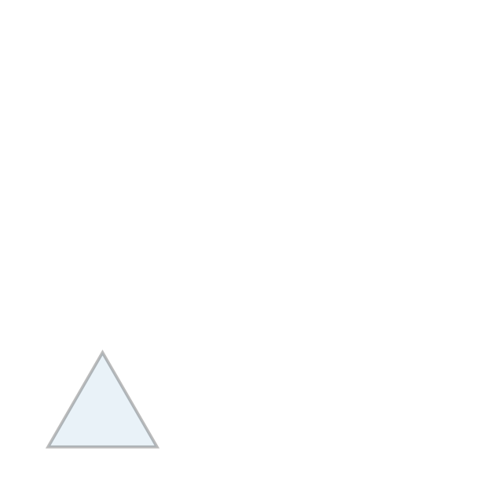
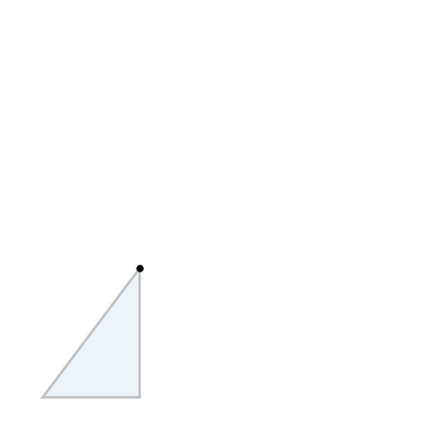
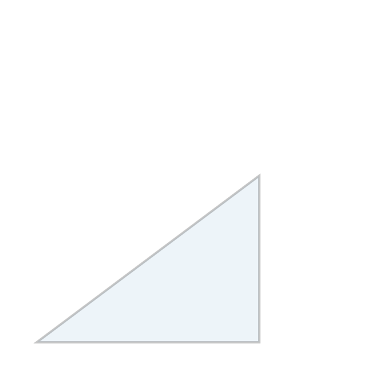
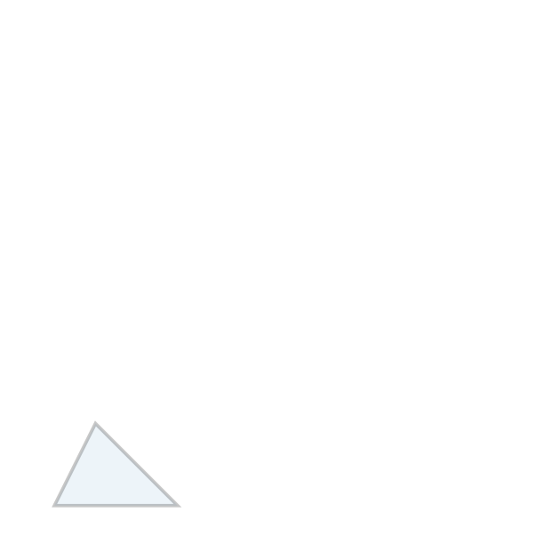
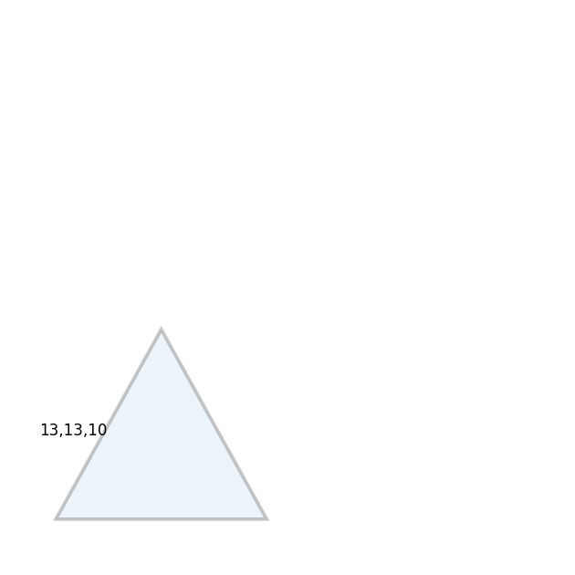
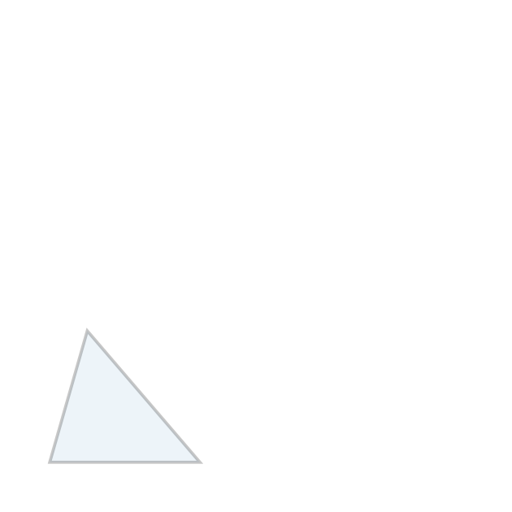
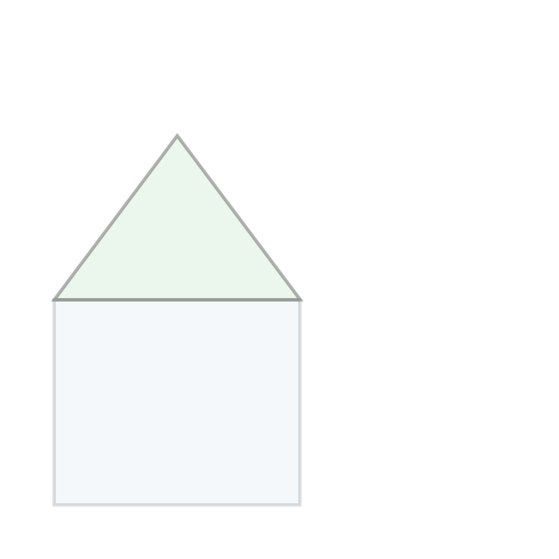
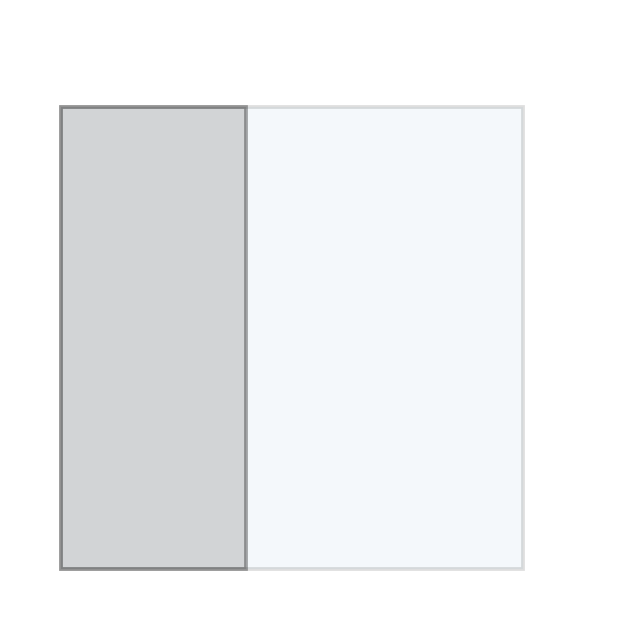
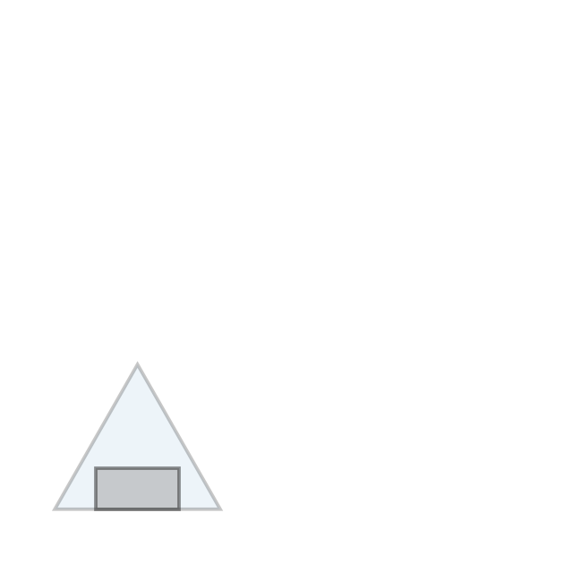

# תת-נושא 7: היכרות עם סוגי משולשים (ישר-זווית, שווה-שוקיים, שווה-צלעות, שונה-צלעות)

---

## רמה 1: בניית ביטחון (8 תרגילים)

1. סיווגו את המשולש לפי הצלעות:
צלעות
$5$,
$5$,
$8$
ס"מ.

2. סיווגו את המשולש לפי הצלעות:
צלעות
$6$,
$6$,
$6$
ס"מ.

3. סיווגו את המשולש לפי הצלעות:
צלעות
$3$,
$5$,
$7$
ס"מ.

4. האם ניתן לבנות משולש עם הצלעות
$3$,
$4$,
$8$
ס"מ?
(כלל המשולש: סכום כל שתי צלעות > הצלע השלישית)

5. במשולש ישר-זווית, שתי הרגליים הן
$3$
ס"מ ו-
$4$
ס"מ.
מה אורך יתר הקוטב?

6. סכום זוויות במשולש =
$180°$.
שתי זוויות הן
$70°$
ו-
$60°$.
מה גודל הזווית השלישית?

7. במשולש שווה-שוקיים, זווית הראש היא
$40°$.
מה גודל כל אחת מהזוויות הבסיסיות?

8. מצאו אם המשולש עם הצלעות
$5$,
$12$,
$13$
הוא ישר-זווית.
(בדקו:
$5^2 + 12^2 = 13^2$?)

---

## רמה 2: תרגול שוטף ומשולב (8 תרגילים)

9. במשולש שווה-שוקיים, הזווית הבסיסית היא
$65°$.
מה גודל זווית הראש?

10. במשולש שווה-צלעות, מה גודל כל זווית?

11. במשולש ישר-זווית, זווית אחת היא
$30°$.
מה גודל הזווית השלישית?

12. בדקו אם המשולש עם הצלעות
$8$,
$15$,
$17$
הוא ישר-זווית.

13. שלוש זוויות:
$(x + 10)°$,
$(2x - 5)°$,
$(3x + 15)°$.
מצאו את
$x$
ואת כל זווית.
סיווגו את המשולש.

14. במשולש שווה-שוקיים
$ABC$,
$AB = AC = 13$
ס"מ ו-
$BC = 10$
ס"מ.
חשבו את ההיקף.

15. משולש עם זוויות
$90°$,
$45°$,
$45°$.
אם יתר הקוטב הוא
$10$
ס"מ, מצאו את הרגליים.
(רמז:
$a = \frac{c}{\sqrt{2}}$
)

16. בטבלה הבאה, ציינו "כן" או "לא":

| תכונה | שווה-צלעות | שווה-שוקיים | ישר-זווית |
|---|---|---|---|
| יש זווית ישרה | — | — | כן |
| כל הצלעות שוות | — | — | — |
| לפחות שתי צלעות שוות | — | — | — |

---

## רמה 3: רמת בחינת מה"ט (4 תרגילים)

17. משולש
$ABC$
שווה-שוקיים:
$AB = AC$,
$BC = 10$
ס"מ, זווית
$A = 100°$.

א. מה גודל הזוויות
$B$
ו-
$C$?

ב. לאיזה סוג שייך משולש זה לפי זוויות?

ג. האם ניתן שמשולש שווה-שוקיים יהיה גם ישר-זווית? אם כן, מה יהיו הזוויות?

18. בצורה הבאה:
מלבן
$ABCD$
(
$AB = 6$
ס"מ,
$BC = 5$
ס"מ).
מעל הצלע
$CD$
בנוי משולש שווה-שוקיים
$ECD$
(
$EC = ED$).
גובה המשולש (מ-
$E$
לצלע
$CD$
) הוא
$4$
ס"מ.

א. סיווגו את משולש
$ECD$
לפי צלעות.

ב. חשבו את אורכי
$EC$
ו-
$ED$
בעזרת משפט פיתגורס.

ג. חשבו את ההיקף החיצוני של הצורה המורכבת.

19. ריבוע
$ABCD$
שצלעו
$10$
ס"מ.
נקודה
$E$
על
$BC$
כך ש-
$BE = 4$
ס"מ.
קטע
$AE$
נמתח.

א. מה סוג המשולש
$ABE$
לפי זוויות?

ב. חשבו את
$AE$.

ג. חשבו את זוויות המשולש
$ABE$
(השתמשו ב-
$\tan(\angle AEB) = \frac{AB}{BE} = \frac{10}{4}$).

20. נתונה הצורה:
משולש שווה-צלעות שגובהו
$4\sqrt{3}$
מ'.
ממנו נחתך משולש ישר-זווית עם רגליים
$2$
מ' ו-
$4$
מ'.

א. מה אורך צלע המשולש השווה-צלעות?
(רמז: בשווה-צלעות עם צלע
$a$,
גובה
$= \frac{a\sqrt{3}}{2}$)

ב. מה היקף הצורה שנותרה?
(צלעות חיצוניות:
$2$,
$3$,
$4$,
$5$,
$8$
מ')

ג. מה שטח הצורה שנותרה?

---

תשובות סופיות

1. שווה-שוקיים
2. שווה-צלעות
3. שונה-צלעות
4. לא:
$3+4=7 \not> 8$
5.
$\sqrt{3^2+4^2}=5$
ס"מ
6. $50°$
7. $\frac{180°-40°}{2}=70°$
8.
$5^2+12^2=25+144=169=13^2$
✓ – כן, ישר-זווית
9. $180°-2\times65°=50°$
10. $60°$
11. $180°-90°-30°=60°$
12.
$8^2+15^2=64+225=289=17^2$
✓ – כן
13.
$x+10+2x-5+3x+15=180 \Rightarrow 6x+20=180 \Rightarrow x=\frac{160}{6}\approx26.7°$
;
$36.7°$
,
$48.3°$
,
$95°$
– קהה-זווית
14.
$13+13+10=36$
ס"מ
15.
$a = \frac{10}{\sqrt{2}} = 5\sqrt{2} \approx 7.07$
ס"מ
16. שווה-צלעות: לא, כן, כן; שווה-שוקיים: לא, לא, כן; ישר-זווית: כן, לא, לא
17. א.
$\frac{180°-100°}{2}=40°$
; ב. קהה-זווית; ג. כן – זוויות
$90°$
,
$45°$
,
$45°$
18. א. שווה-שוקיים; ב.
$EC=ED=\sqrt{3^2+4^2}=5$
ס"מ; ג.
$AB+BC+EC+ED+DA = 6+5+5+5+6+\ldots$
— חצי היקף מלבן + שני שוקי המשולש:
$AB+AD+2 \times EC = 6+5+5+5+6=... $
ציינו צלעות חיצוניות:
$AB=6$
,
$AD=5$
,
$ED=5$
,
$EC=5$
,
$BC=5$
→ היקף
$=26$
ס"מ
19. א. ישר-זווית (
$\angle ABE=90°$
); ב.
$AE=\sqrt{10^2+4^2}=\sqrt{116}=2\sqrt{29}\approx10.77$
ס"מ; ג.
$\tan(\angle AEB)=10/4=2.5 \Rightarrow \angle AEB\approx68.2°$
;
$\angle BAE\approx21.8°$
20. א.
$\frac{a\sqrt{3}}{2}=4\sqrt{3} \Rightarrow a=8$
מ'; ב.
$2+3+4+5+8=22$
מ'; ג. שטח שווה-צלעות
$= \frac{8^2\sqrt{3}}{4}=16\sqrt{3}$
; שטח ישר-זווית
$=\frac{1}{2}\times2\times4=4$
; שטח נותר
$=16\sqrt{3}-4\approx23.7$
מ"ר

