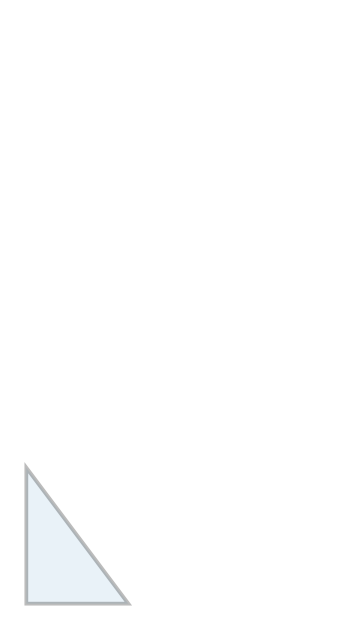
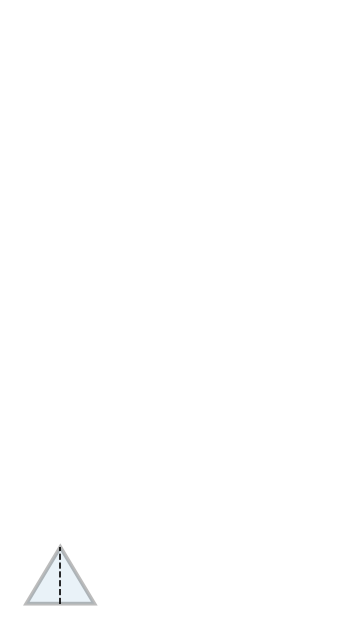
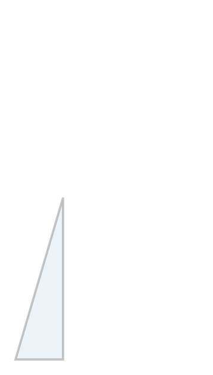
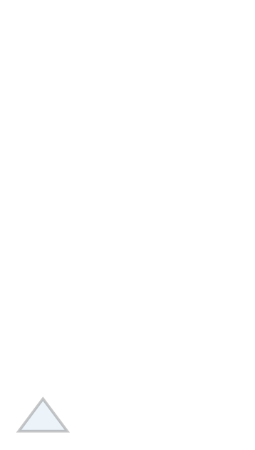
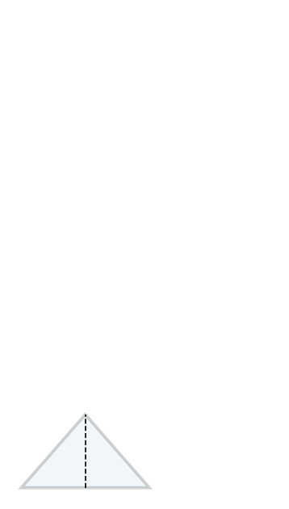
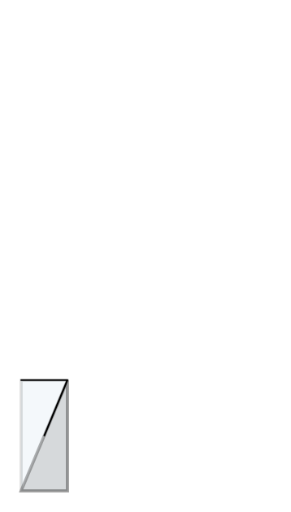
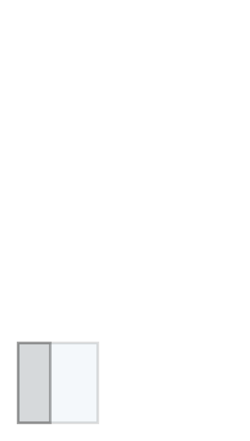
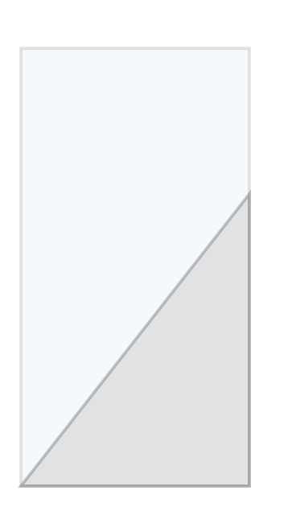
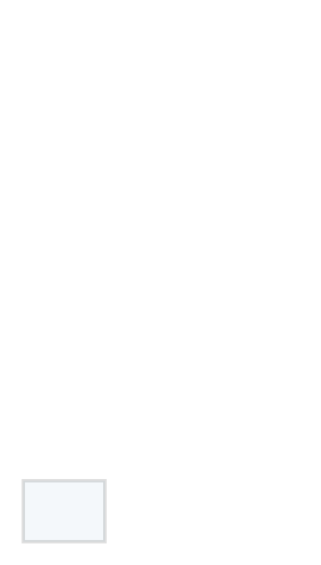
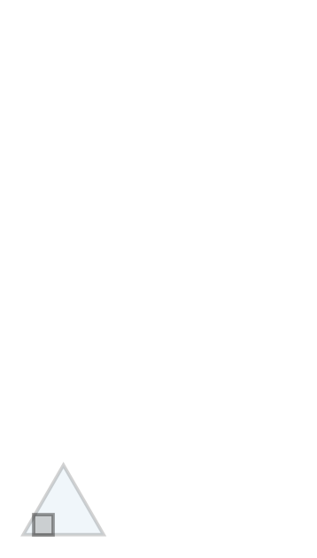

# תת-נושא 8: מושג ה"גובה" במשולש וחישובי שטח והיקף משולשים

---

## רמה 1: בניית ביטחון (8 תרגילים)

1. חשבו את שטח המשולש שבסיסו
$8$
ס"מ וגובהו
$5$
ס"מ.

2. חשבו את שטח המשולש שבסיסו
$12$
ס"מ וגובהו
$6$
ס"מ.

3. שטח משולש הוא
$30$
ס"מ² ובסיסו
$10$
ס"מ.
מה גובהו?

4. שטח משולש הוא
$24$
ס"מ² וגובהו
$8$
ס"מ.
מה בסיסו?

5. משולש ישר-זווית עם רגליים
$3$
ס"מ ו-
$4$
ס"מ.
חשבו את שטחו.

6. משולש שווה-צלעות שצלעו
$6$
ס"מ.
חשבו את היקפו.

7. משולש שווה-שוקיים:
שוקיים
$8$
ס"מ כל אחד, בסיס
$6$
ס"מ.
חשבו את היקפו.

8. במשולש ישר-זווית, הרגליים הן
$5$
ס"מ ו-
$12$
ס"מ.
חשבו את יתר הקוטב ואת שטח המשולש.

---

## רמה 2: תרגול שוטף ומשולב (8 תרגילים)

9. במשולש ישר-זווית, רגל אחת היא
$9$
ס"מ ויתר הקוטב הוא
$15$
ס"מ.
חשבו את הרגל השנייה ואת שטח המשולש.

10. משולש שווה-שוקיים:
שוקיים
$10$
ס"מ, בסיס
$12$
ס"מ.
חשבו את גובה המשולש (מהקודקוד לבסיס) ואת שטחו.

11. משולש שווה-צלעות שצלעו
$10$
ס"מ.
גובה המשולש הוא
$5\sqrt{3}$
ס"מ.
חשבו את שטחו.

12. בדקו אם המשולש עם הצלעות
$7$,
$24$,
$25$
הוא ישר-זווית.
אם כן, חשבו את שטחו.

13. בסיס משולש הוא
$3x$
ס"מ וגובהו
$(x + 2)$
ס"מ.
שטחו
$36$
ס"מ².
מצאו את
$x$
ואת ממדי המשולש.

14. שני משולשים חולקים אותו קו גובה של
$8$
ס"מ.
לאחד בסיס
$14$
ס"מ ולשני בסיס
$7$
ס"מ.
מצאו את יחס שטחיהם.

15. משולש ישר-זווית
$ABC$,
$\angle B = 90°$,
$AB = 5$
ס"מ,
$BC = 12$
ס"מ.
נקודה
$D$
היא נקודת האמצע של
$AC$.

א. חשבו את
$AC$.

ב. חשבו את שטח משולש
$ABC$.

ג. בכל משולש ישר-זווית, התיכון מהזווית הישרה שווה למחצית יתר הקוטב.
חשבו את
$BD$.

16. ריבוע
$ABCD$
שצלעו
$10$
ס"מ.
נקודה
$E$
נמצאת על הצלע
$BC$
כך ש-
$BE = 4$
ס"מ.
קטע
$AE$
נמתח.

א. חשבו את שטח המשולש
$ABE$.

ב. חשבו את שטח הצורה הנותרת (ריבוע פחות משולש).

ג. חשבו את אורך
$AE$.

---

## רמה 3: רמת בחינת מה"ט (4 תרגילים)

17. נתון מלבן
$ABCD$,
$AB = 25$
ס"מ ו-
$BC = 48$
ס"מ.
הנקודה
$E$
נמצאת על צלע
$BC$
כך ש-
$BE = 2 \cdot EC$.

א. חשבו את
$BE$
ואת
$EC$.

ב. חשבו את שטח המשולש
$ABE$.

ג. חשבו את שטחו ואת היקפו של המשולש
$AEC$.
(חשבו תחילה את
$AE$
ואת
$AC$)

18. נתון מלבן
$ABCD$,
$AB = 6$
ס"מ ו-
$BC = 5$
ס"מ.
מעל הצלע
$CD$
בנוי משולש שווה-שוקיים
$ECD$
שגובהו (מ-
$E$
לצלע
$CD$
) הוא
$4$
ס"מ.

א. חשבו את שטח הצורה המורכבת (מלבן + משולש).

ב. חשבו את ההיקף החיצוני של הצורה.

ג. חשבו את אורך
$EC$
ו-
$ED$.

19. נתון מלבן
$ABCD$,
$AB = 7.5$
מ' ו-
$BC = 4.5$
מ'.
נקודה
$E$
על
$CD$
כך ש-
$DE = 2 \cdot EC$.

א. מה שטח המלבן ומה היקפו?

ב. חשבו את שטח שלושת המשולשים:
$\triangle ADB$,
$\triangle AEB$
ו-
$\triangle ACB$.

ג. חשבו את ההיקף של המשולש
$AEB$.
(רמז: מצאו את
$AE$
ואת
$BE$
בעזרת פיתגורס)

20. בסרטוט
$ABCD$
הוא מלבן.
נתון:
$EB = 10$
ס"מ,
$DC = 50$
ס"מ,
$BF = 5$
ס"מ,
$AD = 20$
ס"מ.
(
$E$
על
$BC$,
$F$
על
$AB$)

א. חשבו את שטח המשולש
$DEF$
(הצבוע באפור).

ב. חשבו את היקף המשולש
$DEF$.
(מצאו את
$DE$,
$EF$,
$DF$)

---

תשובות סופיות

1.
$\frac{1}{2}\times8\times5=20$
ס"מ²
2.
$36$
ס"מ²
3.
$6$
ס"מ
4.
$6$
ס"מ
5.
$\frac{1}{2}\times3\times4=6$
ס"מ²
6.
$18$
ס"מ
7.
$22$
ס"מ
8. יתר
$=13$
ס"מ; שטח
$=\frac{1}{2}\times5\times12=30$
ס"מ²
9.
$\sqrt{15^2-9^2}=\sqrt{144}=12$
ס"מ; שטח
$=\frac{1}{2}\times9\times12=54$
ס"מ²
10. גובה
$=\sqrt{10^2-6^2}=8$
ס"מ; שטח
$=\frac{1}{2}\times12\times8=48$
ס"מ²
11.
$\frac{1}{2}\times10\times5\sqrt{3}=25\sqrt{3}\approx43.3$
ס"מ²
12.
$7^2+24^2=49+576=625=25^2$
✓; שטח
$=\frac{1}{2}\times7\times24=84$
ס"מ²
13.
$\frac{1}{2}\times3x\times(x+2)=36 \Rightarrow 3x^2+6x=72 \Rightarrow x^2+2x-24=0 \Rightarrow x=4$
; בסיס
$12$
ס"מ, גובה
$6$
ס"מ
14. $56:28=2:1$
15. א.
$\sqrt{25+144}=13$
ס"מ; ב.
$30$
ס"מ²; ג.
$BD=6.5$
ס"מ
16. א.
$\frac{1}{2}\times10\times4=20$
ס"מ²; ב.
$80$
ס"מ²; ג.
$\sqrt{100+16}=\sqrt{116}=2\sqrt{29}\approx10.77$
ס"מ
17. א.
$BE=32$
ס"מ,
$EC=16$
ס"מ; ב.
$\frac{1}{2}\times25\times32=400$
ס"מ²; ג.
$AE=\sqrt{25^2+32^2}=\sqrt{1649}\approx40.6$
ס"מ;
$AC=\sqrt{25^2+48^2}=\sqrt{2929}\approx54.1$
ס"מ; שטח
$AEC=\frac{1}{2}\times25\times16=200$
ס"מ²; היקף
$\approx16+40.6+54.1=110.7$
ס"מ
18. א.
$6\times5 + \frac{1}{2}\times6\times4 = 30+12=42$
ס"מ²; ב.
$AB+AD+EC+ED+AB$
... צלעות חיצוניות:
$AB=6$
,
$AD=5$
,
$EC=ED=\sqrt{3^2+4^2}=5$
ס"מ,
$BC=5$
; היקף
$=6+5+5+5+5=26$
ס"מ; ג.
$EC=ED=5$
ס"מ
19. א. שטח
$=33.75$
מ"ר; היקף
$=24$
מ'; ב.
$\triangle ADB=\frac{1}{2}\times7.5\times4.5=16.875$
;
$DE=5$
מ',
$EC=2.5$
מ';
$\triangle AEB=\frac{1}{2}\times7.5\times4.5=16.875$
;
$\triangle ACB=16.875$
מ"ר; ג.
$AE=\sqrt{4.5^2+5^2}=\sqrt{45.25}\approx6.73$
מ';
$BE=\sqrt{7.5^2+2.5^2}=\sqrt{62.5}\approx7.91$
מ'; היקף
$=7.5+6.73+7.91\approx22.1$
מ'
20. א.
$\frac{1}{2}\times BF\times EB=\frac{1}{2}\times5\times10=25$
ס"מ²; ב.
$DE=\sqrt{DF^2+...}$
–
$D$
=קודקוד מלבן
$AD=20$
,
$DF=AB-BF=50-5=45$
ס"מ:
$DE=\sqrt{20^2+45^2}=\sqrt{400+2025}=\sqrt{2425}\approx49.2$
ס"מ;
$EF=\sqrt{10^2+...}$
–
$EF$
בין
$E(BC)$
ל-
$F(AB)$
:
$EF=\sqrt{5^2+10^2}=\sqrt{125}\approx11.2$
ס"מ;
$DF=\sqrt{45^2+20^2}=\sqrt{2425}\approx49.2$
ס"מ; היקף
$\approx109.6$
ס"מ

