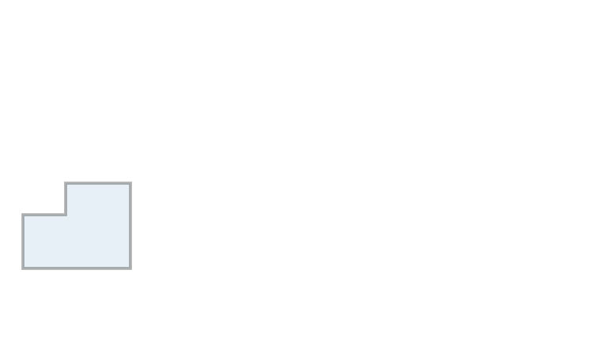
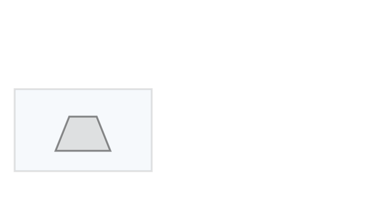
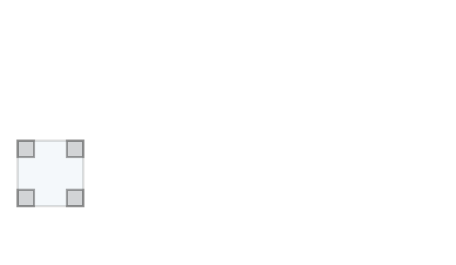
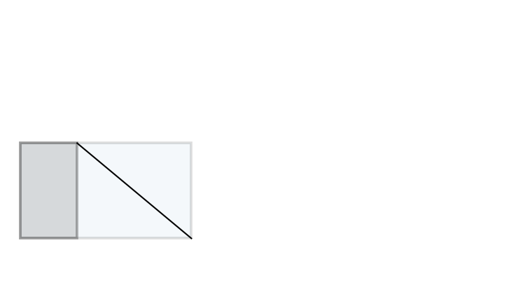
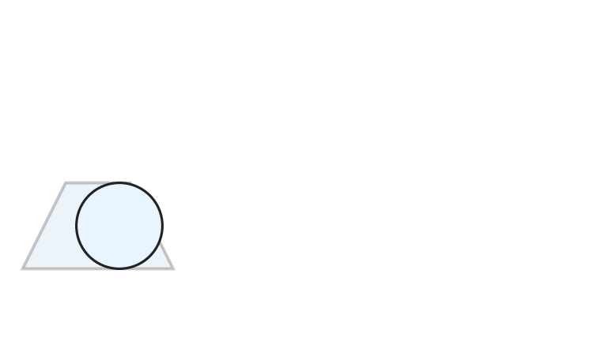
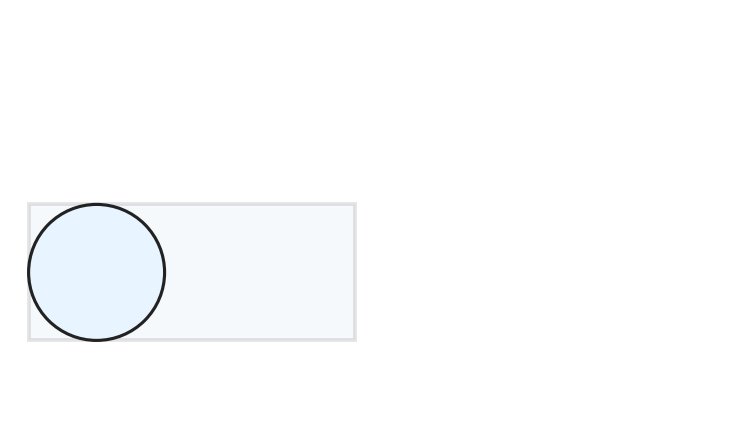
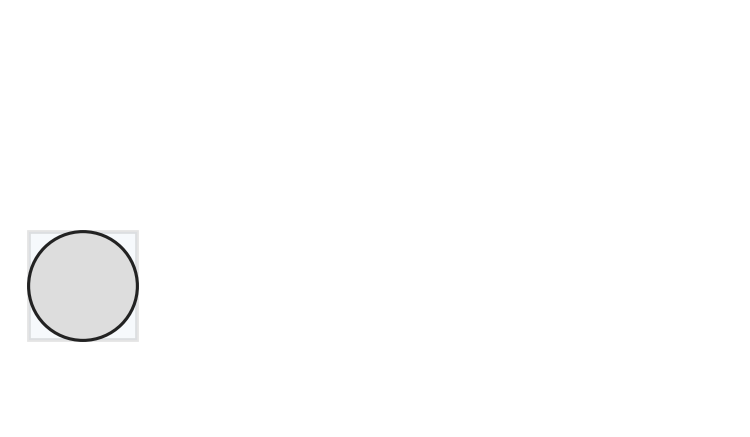
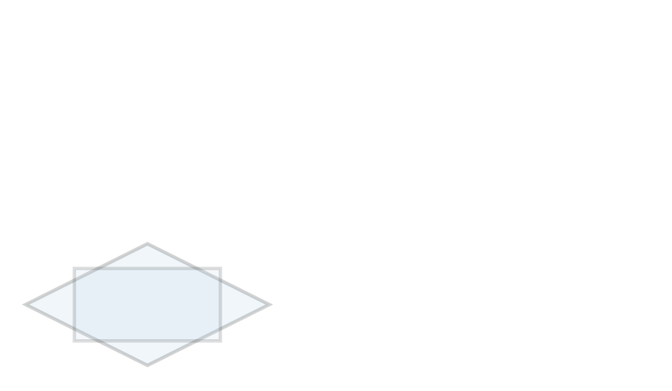
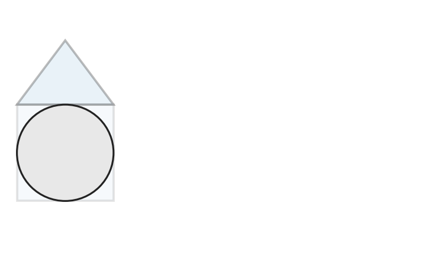
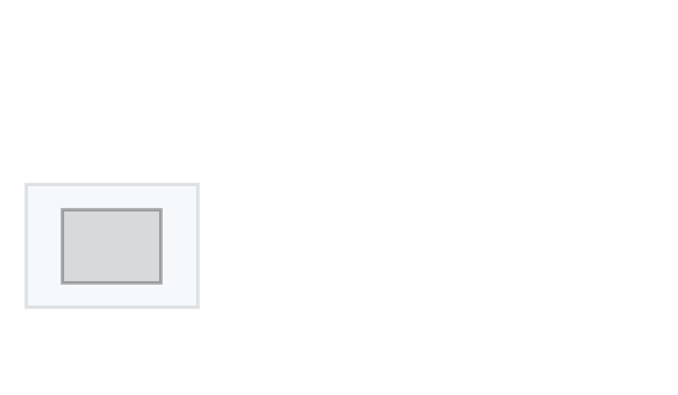

# תת-נושא 9: חיבור וחיסור שטחים (שטח כלוא/מורכב המשלב מלבן ומשולש)

---

## רמה 1: בניית ביטחון (8 תרגילים)

1. צורה מורכבת ממלבן ומשולש.
המלבן: אורך
$10$
ס"מ, רוחב
$4$
ס"מ.
המשולש: בסיס
$10$
ס"מ, גובה
$3$
ס"מ (בנוי על אורך המלבן).
חשבו את השטח הכולל.

2. ריבוע שצלעו
$8$
ס"מ.
ממנו נחתך ריבוע קטן פינתי שצלעו
$3$
ס"מ.
חשבו את שטח הצורה הנותרת.

3. צורה מורכבת משני מלבנים.
המלבן הגדול:
$12 \times 8$
ס"מ.
ממנו הוצא מלבן קטן:
$4 \times 3$
ס"מ.
חשבו את שטח הצורה הנותרת.

4. מלבן
$6 \times 5$
ס"מ.
על בסיסו (ה-
$6$
ס"מ) נוסף חצי-מעגל שרדיוסו
$3$
ס"מ.
חשבו את השטח הכולל (עם
$\pi$).

5. ריבוע שצלעו
$10$
ס"מ ובתוכו ריבוע נוסף שצלעו
$6$
ס"מ (מרכזים משותפים).
חשבו את שטח האזור שבין הריבועים.

6. מלבן
$14 \times 6$
ס"מ.
ממנו נחתכו שני משולשים זהים, כל אחד עם בסיס
$6$
ס"מ וגובה
$4$
ס"מ, משתי קצוות הצלע הקצרה.
חשבו את שטח הצורה שנותרה.

7. שני ריבועים: גדול בצלע
$10$
ס"מ וקטן בצלע
$4$
ס"מ.
חשבו את ההפרש בין שטחיהם.

8. מלבן
$9 \times 5$
ס"מ.
בפינה אחת נמצא משולש ישר-זווית שרגליו
$3$
ס"מ ו-
$5$
ס"מ.
חשבו את שטח המלבן פחות המשולש.

---

## רמה 2: תרגול שוטף ומשולב (8 תרגילים)

9. צורה בצורת L:
מלבן גדול
$10 \times 8$
ס"מ, ממנו הוצא מלבן קטן
$4 \times 3$
ס"מ מפינה עליונה ימנית.
חשבו את שטח הצורה ואת היקפה.

10. מגרש מלבני
$20 \times 12$
מ'.
בתוכו גינה בצורת טרפז שבסיסיו
$8$
מ' ו-
$12$
מ' וגובהו
$5$
מ'.
חשבו את שטח המגרש שמחוץ לגינה.

11. ריבוע שצלעו
$16$
ס"מ.
בתוכו ארבעה ריבועים זהים שצלעם
$4$
ס"מ, אחד בכל פינה.
חשבו את השטח שנותר (הצבוע).

12. ריבוע שצלעו
$a$
ס"מ.
בכל פינה מוצא משולש ישר-זווית שרגליו
$\frac{a}{4}$
ו-
$\frac{a}{4}$.
הביעו את שטח הצורה הנותרת כפונקציה של
$a$.

13. מלבן
$ABCD$:
$AB = 18$
ס"מ,
$BC = 10$
ס"מ.
נקודה
$E$
על
$AB$
כך ש-
$AE = 6$
ס"מ.
נמתח קטע
$CE$.

א. חשבו את שטח משולש
$AEC$.

ב. חשבו את שטח הטרפז
$EBCD$
שנוצר.

14. עיגול חסום בטרפז שווה-שוקיים שבסיסיו
$6$
ס"מ ו-
$14$
ס"מ.
גובה הטרפז הוא
$8$
ס"מ שווה לקוטר העיגול.
חשבו את שטח הטרפז פחות שטח העיגול.

15. צורה מגזרית:
מלבן
$24 \times 10$
ס"מ ובתוכו מעגל שקוטרו
$10$
ס"מ (בצד שמאל).
חשבו את שטח הצורה שמחוץ למעגל.

16. ריבוע גדול שצלעו
$a$
ס"מ ומעגל פנימי שרדיוסו
$\frac{a}{2}$
(חסום בתוך הריבוע).
הביעו את שטח האזור שבין המעגל לריבוע.

---

## רמה 3: רמת בחינת מה"ט (4 תרגילים)

17. נתון מלבן
$ABCD$:
$AB = 50$
ס"מ,
$AD = 20$
ס"מ.
נקודה
$E$
על
$BC$
כך ש-
$BE = 10$
ס"מ.
נקודה
$F$
על
$AB$
כך ש-
$BF = 5$
ס"מ.

א. חשבו את שטח המלבן
$ABCD$.

ב. חשבו את שטח המשולש
$BEF$
(הצבוע באפור).

ג. חשבו את שטח הצורה הנותרת (מלבן פחות משולש).

18. נתון
$ABCD$
הוא מעוין,
$EHGF$
הוא מלבן.
$AK = MC = BI = JD = 15$
ס"מ.
$AC = 70$
ס"מ,
$BD = 50$
ס"מ.

א. חשבו את שטח המעוין
$ABCD$.

ב. חשבו את היקף המלבן
$EHGF$.

ג. חשבו את השטח הצבוע בין המעוין למלבן.

19. צורה מורכבת:
על ריבוע
$ABCD$
שצלעו
$12$
ס"מ בנוי משולש שווה-שוקיים
$ECD$
על הצלע
$CD$
(מחוץ לריבוע).
גובה המשולש (מ-
$E$
לבסיס
$CD$
) הוא
$8$
ס"מ.
מעגל מוכנס בתוך הריבוע, חסום בצלעותיו (רדיוסו
$6$
ס"מ).

א. חשבו את שטח הצורה המורכבת (ריבוע + משולש).

ב. חשבו את שטח המעגל.

ג. חשבו את השטח הצבוע בתוך הריבוע שמחוץ למעגל.

20. הצורה הבאה מורכבת ממשולש שווה-צלעות שגובהו
$4\sqrt{3}$
מ',
שחתכו ממנו משולש ישר-זווית.
אורכי הצלעות של הצורה הנותרת הם:
$2$,
$3$,
$4$,
$5$,
$8$
מ'.

א. חשבו את היקף הצורה (המסגרת החיצונית בלבד).

ב. מה אורך צלע המשולש שווה-הצלעות?

ג. מה שטח הצורה הנותרת?
(שטח שווה-צלעות – שטח ישר-זווית)

---

תשובות סופיות

1.
$40 + 15 = 55$
ס"מ²
2.
$64 - 9 = 55$
ס"מ²
3.
$96 - 12 = 84$
ס"מ²
4.
$30 + \frac{9\pi}{2}$
ס"מ²
5.
$100 - 36 = 64$
ס"מ²
6.
$84 - 2 \times 12 = 60$
ס"מ²
7.
$100 - 16 = 84$
ס"מ²
8.
$45 - 7.5 = 37.5$
ס"מ²
9. שטח
$= 80-12=68$
ס"מ²; היקף: צלעות חיצוניות (ב-L):
$10+4+3+6+7+8=...$
, חשבו:
$10+8+10+3+4+8... $
=
$36$
ס"מ (תלוי מיקום)
10. שטח גינה
$= \frac{1}{2}(8+12)\times5=50$
מ"ר; שטח חוץ
$=240-50=190$
מ"ר
11.
$256 - 4\times16 = 192$
ס"מ²
12.
$a^2 - 4\times\frac{1}{2}\times\frac{a}{4}\times\frac{a}{4} = a^2 - \frac{a^2}{8} = \frac{7a^2}{8}$
ס"מ²
13. א.
$\frac{1}{2}\times6\times10=30$
ס"מ²; ב. שטח מלבן
$=180$
; שטח
$AEC=30$
; טרפז
$=150$
ס"מ²
14. שטח טרפז
$=\frac{1}{2}(6+14)\times8=80$
ס"מ²; שטח עיגול
$=\pi\times4^2=16\pi$
;
$80-16\pi$
ס"מ²
15.
$240 - 25\pi$
ס"מ²
16.
$a^2 - \pi\left(\frac{a}{2}\right)^2 = a^2\left(1-\frac{\pi}{4}\right)$
ס"מ²
17. א.
$1{ }000$
ס"מ²; ב.
$\frac{1}{2}\times5\times10=25$
ס"מ²; ג.
$975$
ס"מ²
18. א.
$\frac{70\times50}{2}=1{ }750$
ס"מ²; ב.
$EF=AC-2\times AK=70-30=40$
ס"מ,
$FG=BD-2\times BI=50-30=20$
ס"מ; היקף
$=2(40+20)=120$
ס"מ; ג. שטח מלבן
$=800$
ס"מ²; צבוע
$=1750-800=950$
ס"מ²
19. א.
$144+\frac{1}{2}\times12\times8=144+48=192$
ס"מ²; ב.
$\pi\times36=36\pi$
ס"מ²; ג.
$144-36\pi$
ס"מ²
20. א.
$2+3+4+5+8=22$
מ'; ב. צלע
$=8$
מ' (גובה
$=\frac{a\sqrt{3}}{2}=4\sqrt{3} \Rightarrow a=8$
); ג.
$16\sqrt{3} - \frac{1}{2}\times2\times4 = 16\sqrt{3}-4\approx23.7$
מ"ר

