# חישוב ומציאת שיפוע של קו ישר על פי שתי נקודות

נוסחת השיפוע בין שתי נקודות
$(x_1, y_1)$
ו-
$(x_2, y_2)$:
$$a = \dfrac{y_2 - y_1}{x_2 - x_1}$$

---

## רמה 1: בניית ביטחון (תרגילים 1–8)

1. מצא את שיפוע הישר העובר דרך הנקודות:
$$A(1,\,3) \quad \\text{-} \quad B(3,\,7)$$

2. מצא את שיפוע הישר העובר דרך הנקודות:
$$P(0,\,0) \quad \\text{-} \quad Q(4,\,8)$$

3. מצא את שיפוע הישר העובר דרך הנקודות:
$$M(2,\,5) \quad \\text{-} \quad N(5,\,5)$$

4. מצא את שיפוע הישר העובר דרך הנקודות:
$$A(1,\,4) \quad \\text{-} \quad B(4,\,1)$$

5. מצא את שיפוע הישר העובר דרך הנקודות:
$$C(0,\,3) \quad \\text{-} \quad D(6,\,9)$$

6. מצא את שיפוע הישר העובר דרך הנקודות:
$$E(2,\,1) \quad \\text{-} \quad F(6,\,9)$$

7. מצא את שיפוע הישר העובר דרך הנקודות:
$$G(1,\,6) \quad \\text{-} \quad H(4,\,0)$$

8. מצא את שיפוע הישר העובר דרך הנקודות:
$$A(3,\,3) \quad \\text{-} \quad B(6,\,12)$$

---

## רמה 2: תרגול שוטף ומשולב (תרגילים 9–16)

9. מצא את שיפוע הישר העובר דרך הנקודות:
$$A(-2,\,5) \quad \\text{-} \quad B(3,\,-5)$$

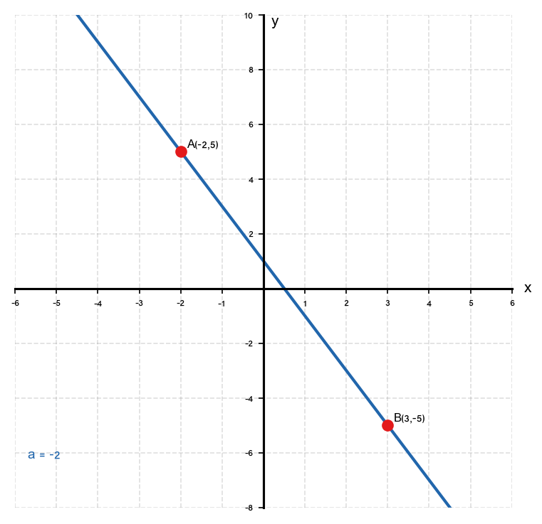
10. מצא את שיפוע הישר העובר דרך הנקודות:
$$P(-3,\,-4) \quad \\text{-} \quad Q(-1,\,2)$$

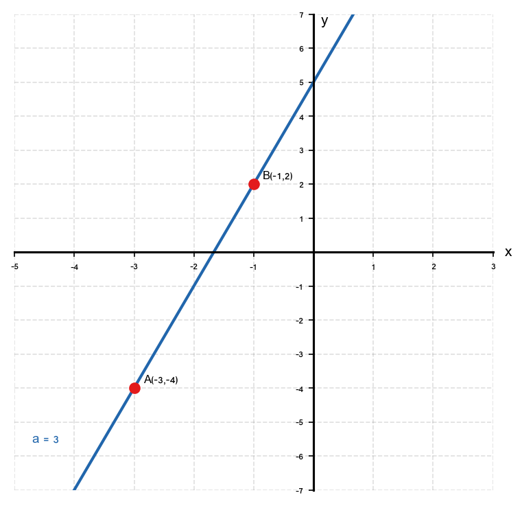
11. מצא את שיפוע הישר העובר דרך הנקודות:
$$A(0,\,-5) \quad \\text{-} \quad B(4,\,-5)$$
מה מיוחד בישר זה?

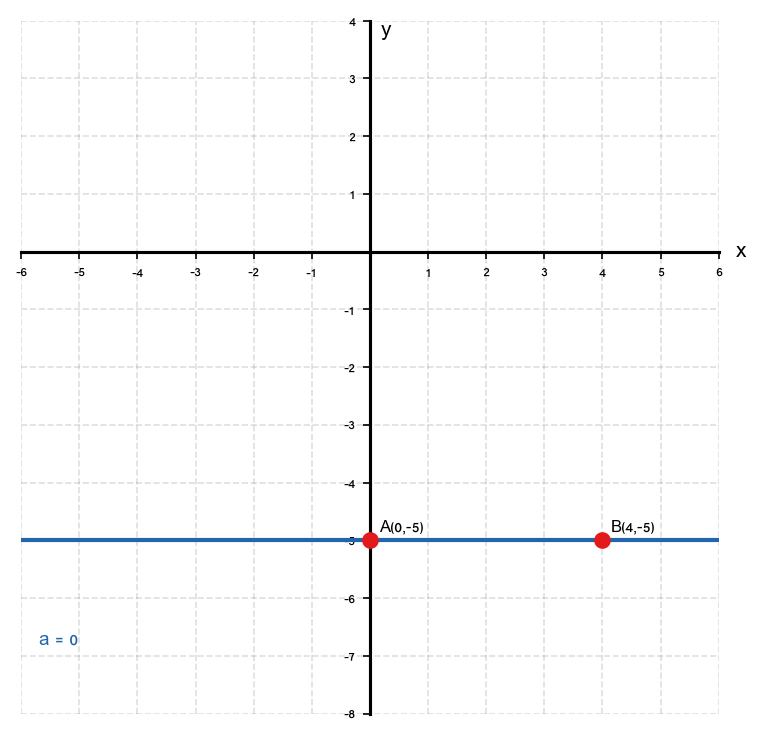
12. מצא את שיפוע הישר העובר דרך הנקודות:
$$C\!\left(\dfrac{1}{2},\,3\right) \quad \\text{-} \quad D\!\left(\dfrac{3}{2},\,7\right)$$

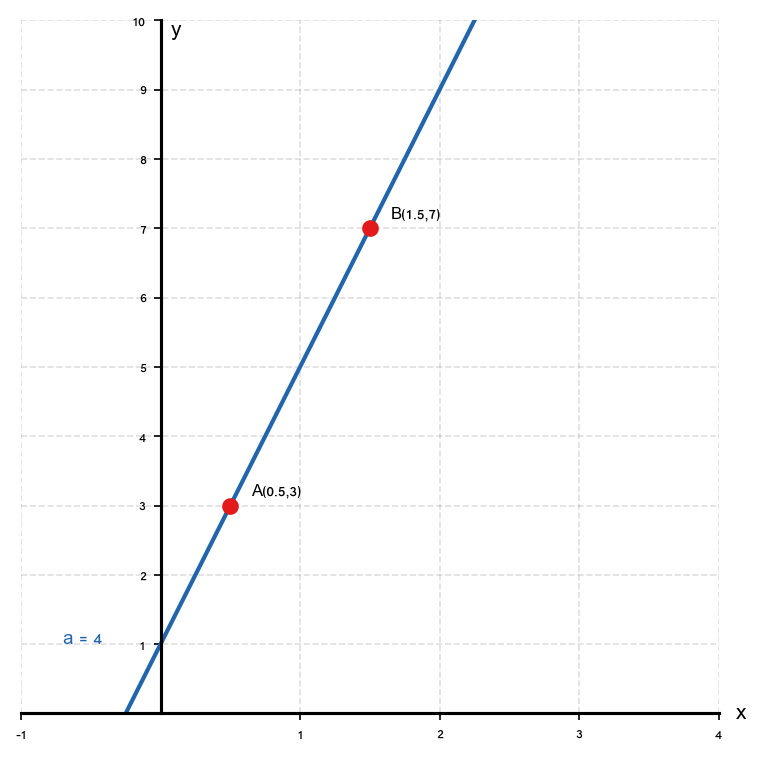
13. נתונה הנקודה
$A(-1,\,3)$
ושיפוע הישר
$a = 2$.
מצא נקודה נוספת
$B$
על הישר.

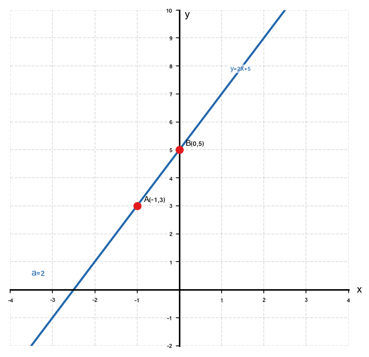
14. מצא את שיפוע הישר העובר דרך הנקודות:
$$A\!\left(-4,\,\dfrac{1}{2}\right) \quad \\text{-} \quad B\!\left(0,\,-\dfrac{3}{2}\right)$$

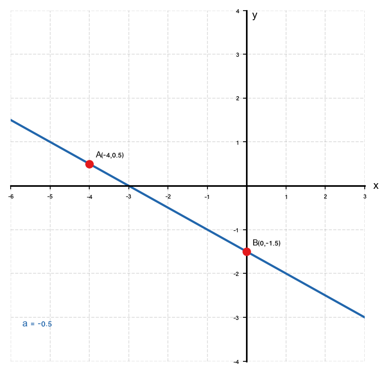
15. בדוק: האם שלוש הנקודות הבאות נמצאות על אותו ישר?
$$A(1,\,3), \quad B(3,\,7), \quad C(5,\,11)$$

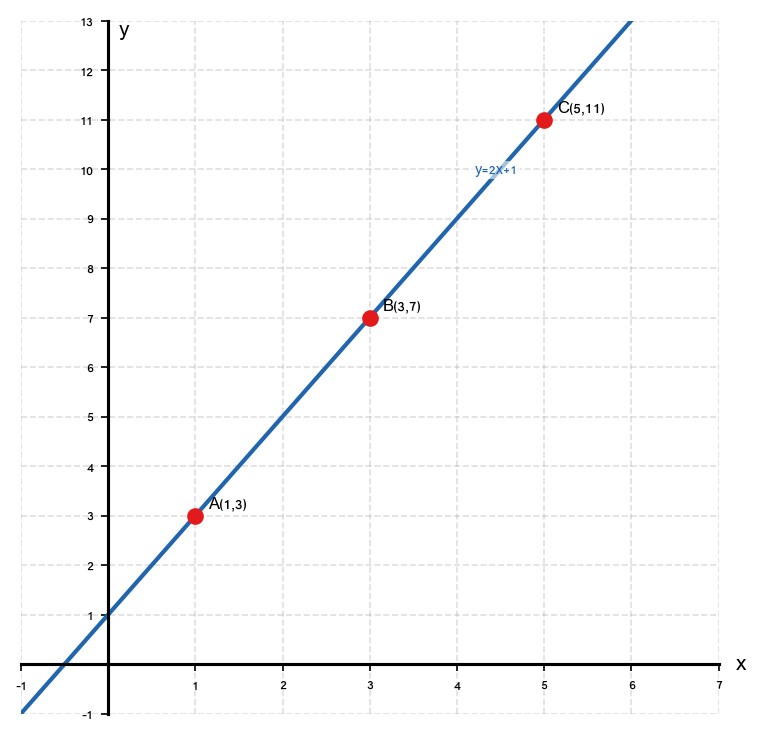
16. הישר
$\ell$
עובר דרך הנקודות
$A(k,\,2)$
ו-
$B(4,\,6)$
ושיפועו
$a = 2$.
מצא את
$k$
.

---

## רמה 3: רמת בחינת מה"ט (תרגילים 17–20)

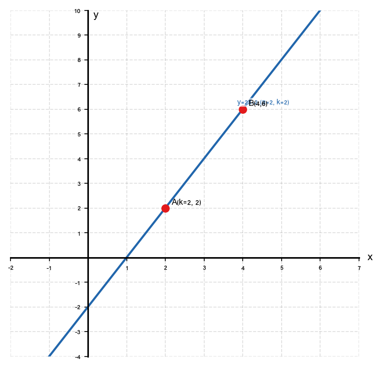
17. בתכנית בנייה, כביש עובר דרך שתי עמדות:
עמדה
$A$
בנקודה
$(100,\,50)$
ועמדה
$B$
בנקודה
$(300,\,150)$.

א. מצא את שיפוע הכביש
$AB$
.

ב. פרש את משמעות השיפוע בהקשר הגיאוגרפי.

ג. אם הכביש מוארך עד לנקודה
$C$
על ציר
$x$
, מצא את קואורדינטות
$C$
.

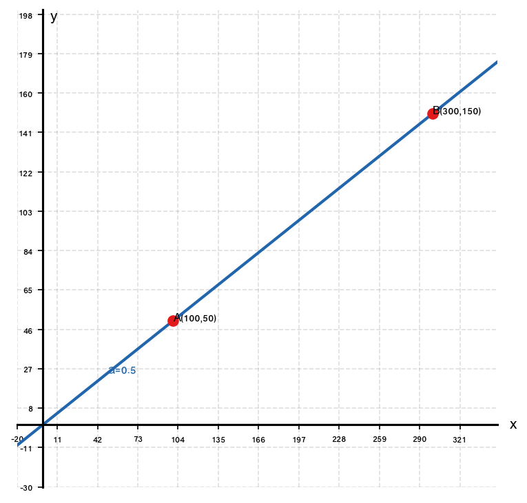
18. נתונות שלוש נקודות:
$$P(1,\,4), \quad Q(3,\,10), \quad R(5,\,k)$$

א. מצא את שיפוע
$PQ$
.

ב. מצא את ערך
$k$
כך ש-
$P$
,
$Q$
,
$R$
נמצאות על אותו ישר.

ג. אם
$k = 18$,
מצא את שיפוע
$QR$
.

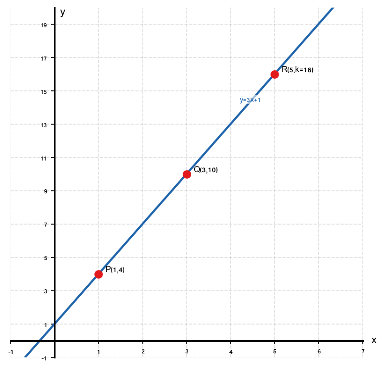
19. בניסוי פיזיקה, גוף נע לפי הנתונים הבאים:

| זמן (שניות) | $0$ | $2$ | $4$ |
|:-----------:|:---:|:---:|:---:|
| מיקום (מטרים) | $3$ | $11$ | $19$ |

א. חשב את שיפוע הגרף בין כל שתי נקודות עוקבות.

ב. מה מייצג השיפוע בהקשר הפיזיקלי?

ג. כתוב את משוואת התנועה של הגוף.

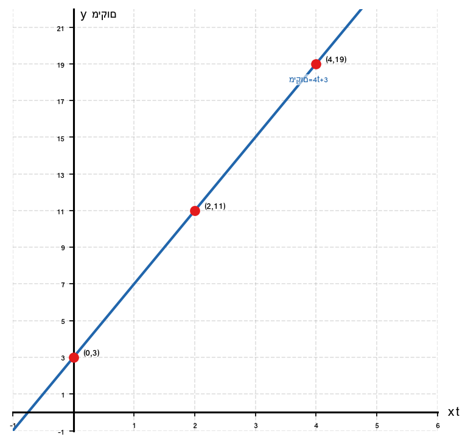
20. משולש
$ABC$:
$$A(-3,\,1), \quad B(1,\,3), \quad C(3,\,-1)$$

א. מצא את שיפוע
$AB$.

ב. מצא את שיפוע
$BC$.

ג. חשב את מכפלת השיפועים ובדוק: האם
$AB \perp BC$?

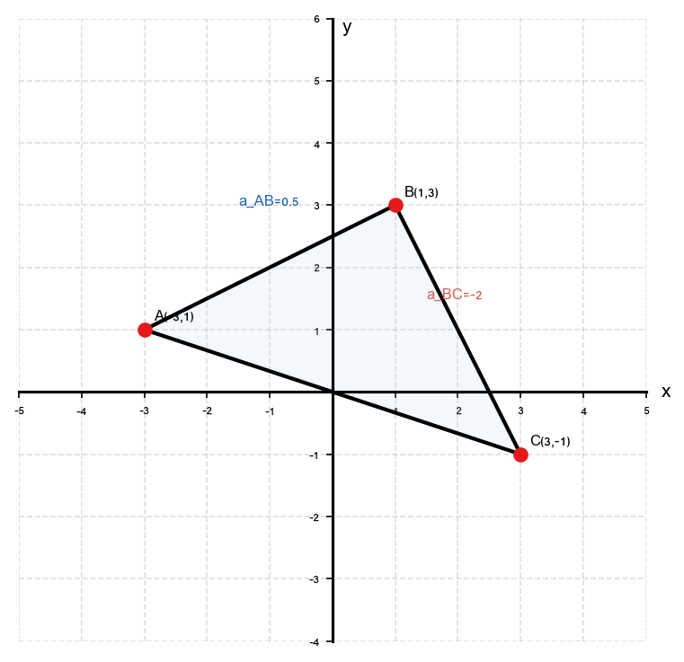

---

תשובות סופיות

1. $a = \dfrac{7-3}{3-1} = \dfrac{4}{2} = 2$

2. $a = \dfrac{8-0}{4-0} = 2$

3.
$a = \dfrac{5-5}{5-2} = 0$
— ישר אופקי

4. $a = \dfrac{1-4}{4-1} = \dfrac{-3}{3} = -1$

5. $a = \dfrac{9-3}{6-0} = 1$

6. $a = \dfrac{9-1}{6-2} = \dfrac{8}{4} = 2$

7. $a = \dfrac{0-6}{4-1} = \dfrac{-6}{3} = -2$

8. $a = \dfrac{12-3}{6-3} = \dfrac{9}{3} = 3$

9. $a = \dfrac{-5-5}{3-(-2)} = \dfrac{-10}{5} = -2$

10. $a = \dfrac{2-(-4)}{-1-(-3)} = \dfrac{6}{2} = 3$

11.
$a = \dfrac{-5-(-5)}{4-0} = 0$
— ישר אופקי

12. $a = \dfrac{7-3}{\frac{3}{2}-\frac{1}{2}} = \dfrac{4}{1} = 4$

13. לדוגמה:
$B(0,\,5)$
(כי מ-
$A(-1,3)$
עם שיפוע
$2$
:
$y = 2(-1)+b = 3 \Rightarrow b=5$
, לכן
$y = 2x+5$
, ובהצבת
$x=0$:
$B(0,5)$).

14. $a = \dfrac{-\frac{3}{2}-\frac{1}{2}}{0-(-4)} = \dfrac{-2}{4} = -\dfrac{1}{2}$

15. שיפוע
$AB$
:
$\dfrac{7-3}{3-1} = 2$.
שיפוע
$BC$
:
$\dfrac{11-7}{5-3} = 2$.
השיפועים שווים — כן, שלוש הנקודות על אותו ישר.

16. $\dfrac{6-2}{4-k} = 2 \;\Rightarrow\; 4 = 2(4-k) \;\Rightarrow\; 4 = 8-2k \;\Rightarrow\; k = 2$

17. א.
$a = \dfrac{150-50}{300-100} = \dfrac{100}{200} = \dfrac{1}{2}$

ב. לכל
$2$
יחידות אופקיות, הכביש עולה
$1$
יחידה אנכית.

ג. משוואת הכביש:
$y - 50 = \dfrac{1}{2}(x-100) \;\Rightarrow\; y = \dfrac{1}{2}x$.
כאשר
$y = 0$:
$x = 0$,
לכן
$C = (0,\,0)$.

18. א.
$a_{PQ} = \dfrac{10-4}{3-1} = 3$

ב.
$\dfrac{k-10}{5-3} = 3 \;\Rightarrow\; k-10 = 6 \;\Rightarrow\; k = 16$

ג. אם
$k = 18$:
$a_{QR} = \dfrac{18-10}{5-3} = \dfrac{8}{2} = 4$

19. א. שיפוע בין
$(0,3)$
ל-
$(2,11)$:
$\dfrac{11-3}{2-0} = 4$.
שיפוע בין
$(2,11)$
ל-
$(4,19)$:
$\dfrac{19-11}{4-2} = 4$.

ב. השיפוע מייצג את המהירות —
$4$
מטרים לשנייה.

ג.
$pos = 4t + 3$

20. א. שיפוע
$AB$
:
$\dfrac{3-1}{1-(-3)} = \dfrac{2}{4} = \dfrac{1}{2}$

ב. שיפוע
$BC$
:
$\dfrac{-1-3}{3-1} = \dfrac{-4}{2} = -2$

ג. מכפלת שיפועים:
$\dfrac{1}{2} \cdot (-2) = -1$
— כן,
$AB \perp BC$ ✓

