# ישרים מקבילים ויישומן בחישובים

**תנאי מקביליות:** שני ישרים מקבילים אם ורק אם שיפועיהם שווים:
$$a_1 = a_2 \quad (b_1 \ne b_2)$$

---

## רמה 1: בניית ביטחון (תרגילים 1–8)

1. בדוק: האם שני הישרים מקבילים?
$$y = 3x + 2 \quad \text{-} \quad y = 3x - 5$$

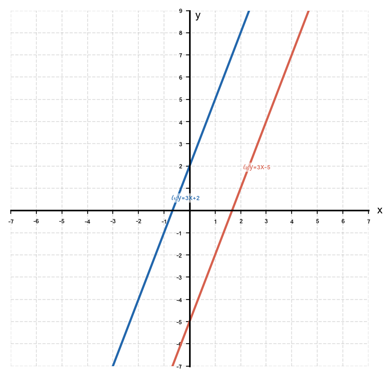
2. בדוק: האם שני הישרים מקבילים?
$$y = 2x + 1 \quad \text{-} \quad y = 4x + 1$$

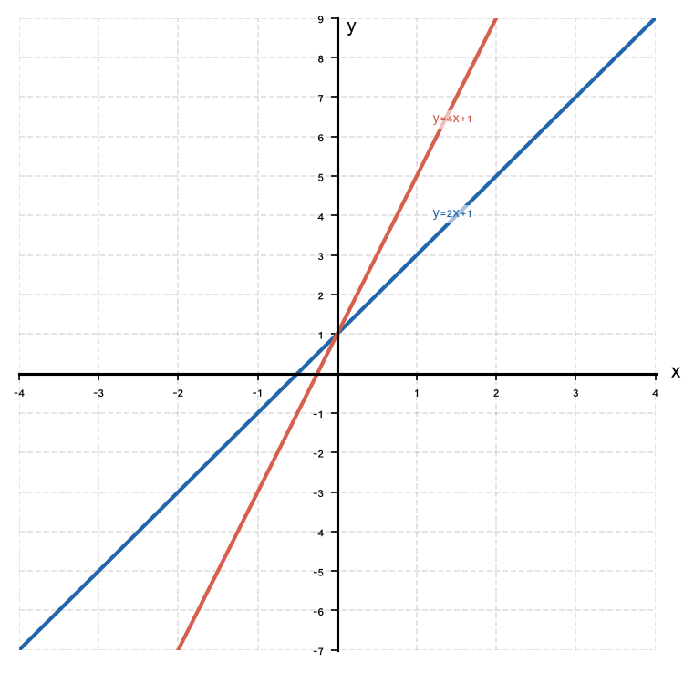
3. כתוב ישר המקביל ל-
$y = 5x - 3$
ועובר דרך הנקודה
$(0,\,4)$.

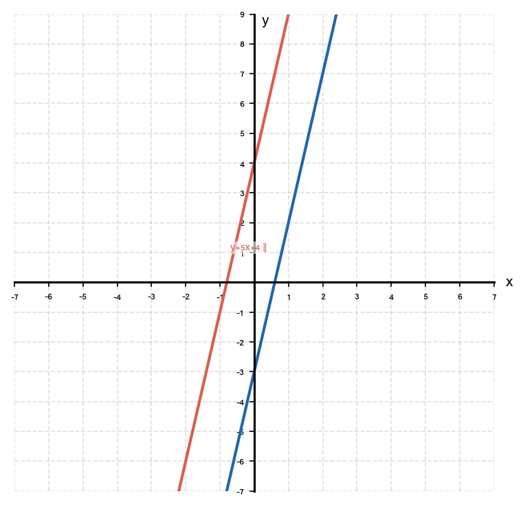
4. כתוב ישר המקביל ל-
$y = -2x + 7$
ועובר דרך ראשית הצירים.

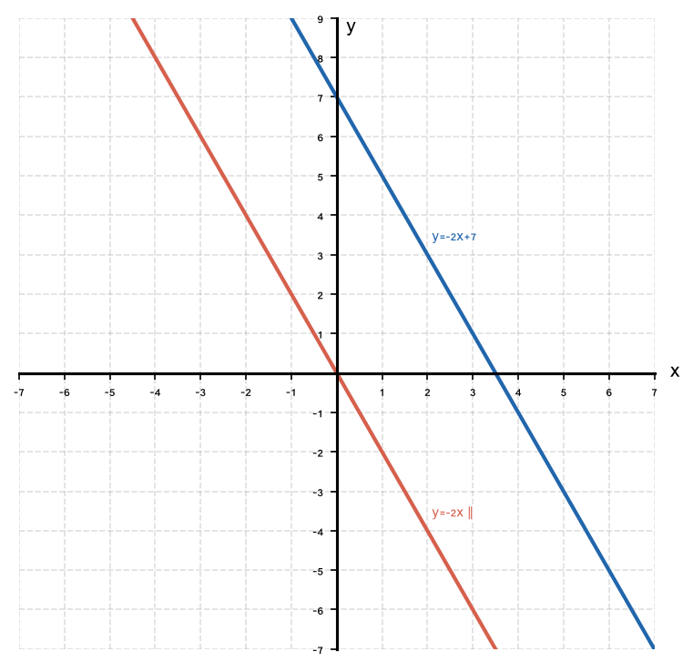
5. בדוק: האם שני הישרים מקבילים?
$$y = \dfrac{1}{2}x + 3 \quad \text{-} \quad y = \dfrac{1}{2}x - 1$$

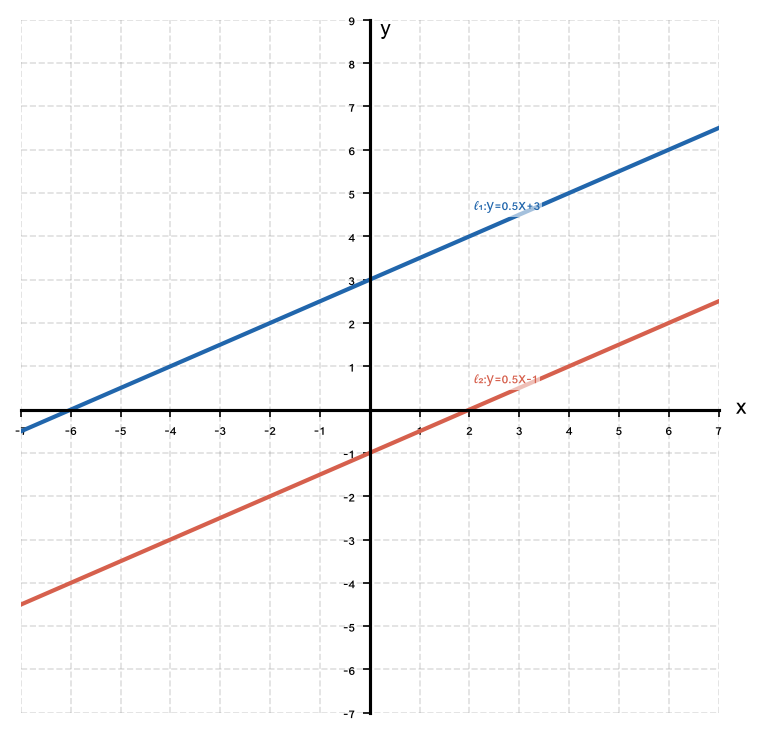
6. מצא את ערך
$k$
כך שהישר
$y = kx + 3$
יהיה מקביל ל-
$y = 4x - 1$.

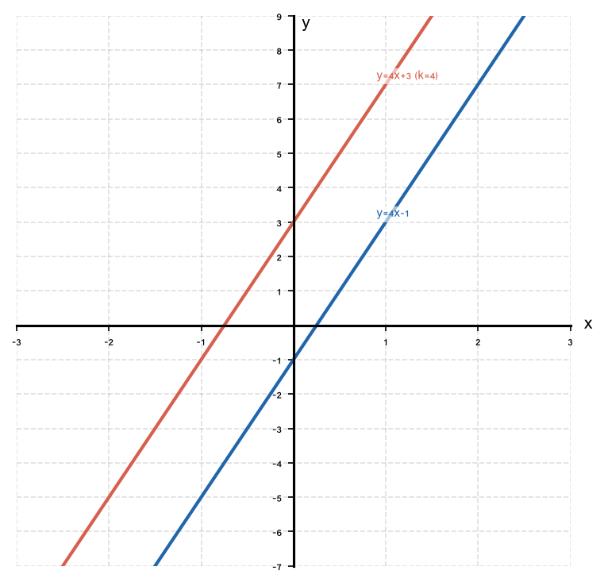
7. כתוב ישר המקביל לציר
$x$
ועובר דרך הנקודה
$(3,\,5)$.

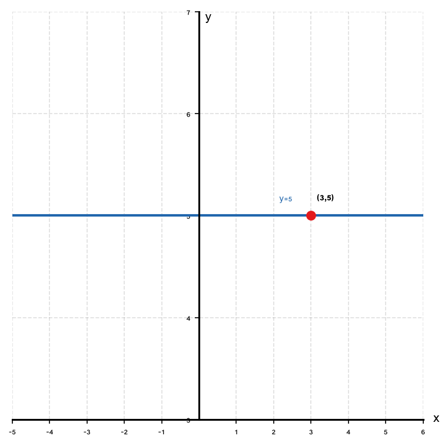
8. כתוב ישר המקביל ל-
$y = x$
ועובר דרך הנקודה
$(2,\,7)$.

---

## רמה 2: תרגול שוטף ומשולב (תרגילים 9–16)

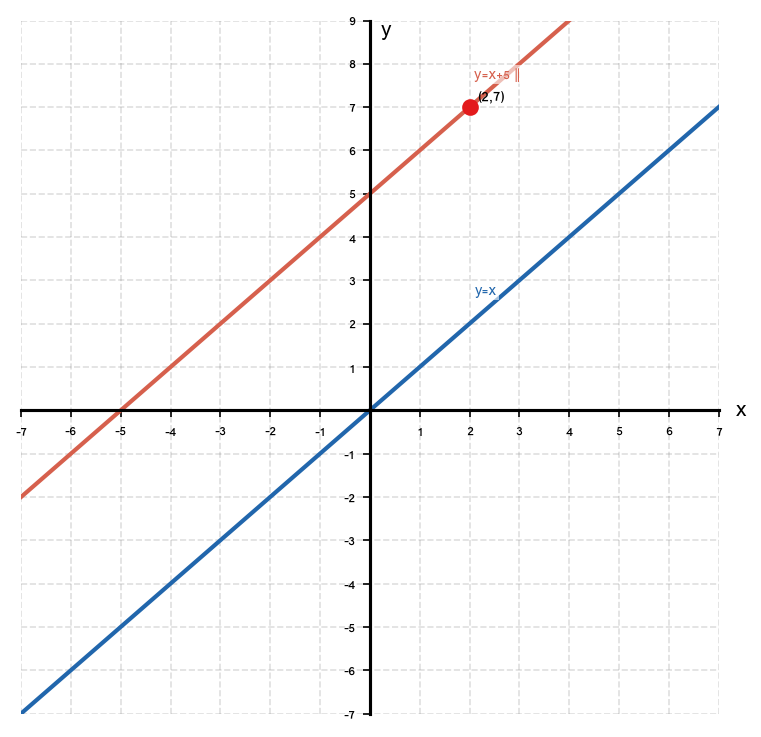
9. הבא כל ישר לצורה
$y = ax + b$
ובדוק אם הם מקבילים:
$$\ell_1:\; 2x - y + 3 = 0 \quad \text{-} \quad \ell_2:\; 4x - 2y + 1 = 0$$

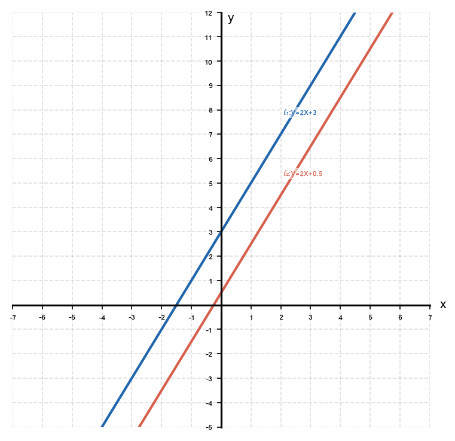
10. הבא כל ישר לצורה
$y = ax + b$
ובדוק אם הם מקבילים:
$$\ell_1:\; 3x + y - 5 = 0 \quad \text{-} \quad \ell_2:\; 6x + 3y + 1 = 0$$

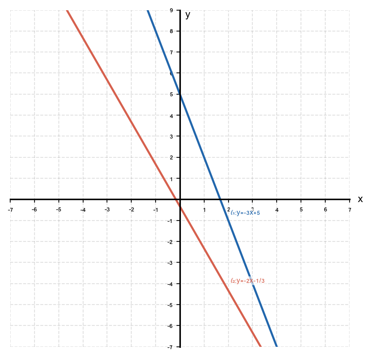
11. מצא ישר המקביל ל-
$y = -3x + 2$
ועובר דרך הנקודה
$A(2,\,-1)$.

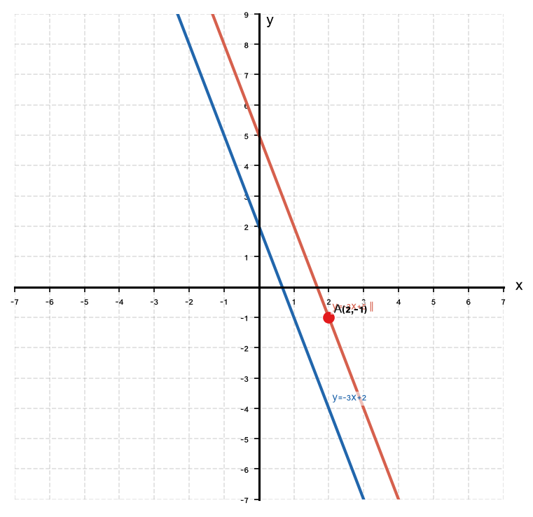
12. מצא ישר המקביל ל-
$y = \dfrac{2}{3}x - 4$
ועובר דרך הנקודה
$B(-3,\,1)$.

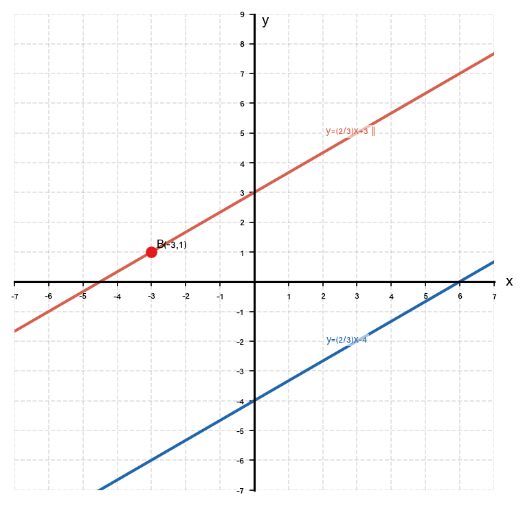
13. הוכח שהנקודות
$A(0,\,2)$, $B(4,\,6)$
ו-
$C(1,\,5)$, $D(5,\,9)$
מהוות שני קטעים מקבילים.

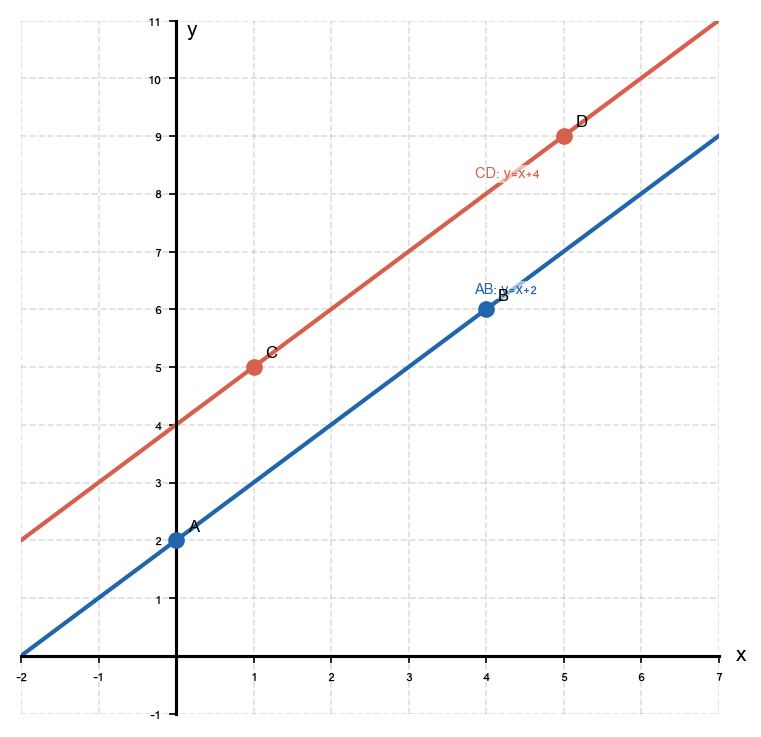
14. מלבן
$ABCD$:
$$A(0,\,0), \quad B(4,\,0), \quad C(4,\,3), \quad D(0,\,3)$$
הוכח כי
$AB \parallel DC$.

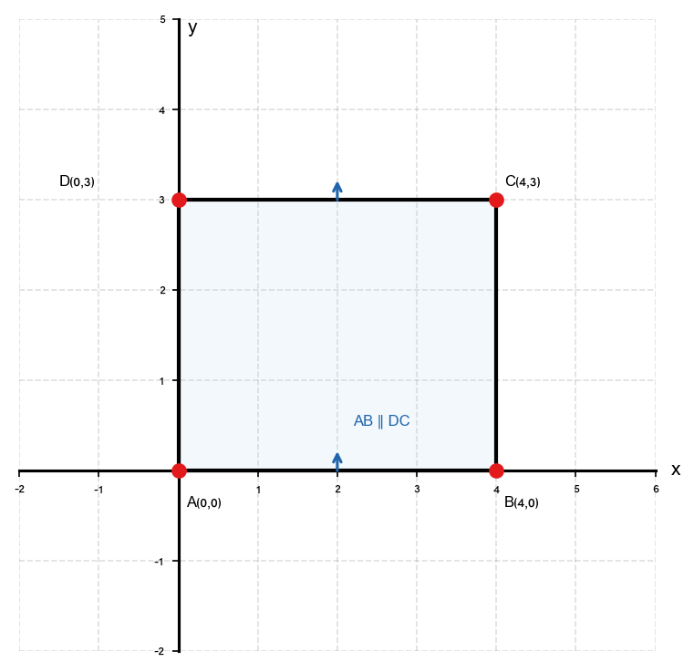
15. מצא את ערך
$k$
כך שהישר
$2x + ky - 6 = 0$
יהיה מקביל ל-
$x + 3y - 9 = 0$.

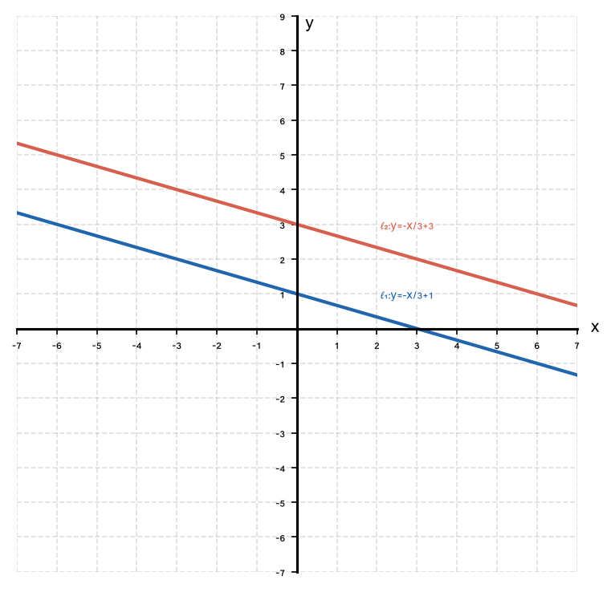
16. שני ישרים
$\ell_1: y = 2x + 3$
ו-
$\ell_2$
מקבילים.
$\ell_2$
עובר דרך הנקודה
$(1,\,7)$.
מצא את נקודת חיתוכו של
$\ell_2$
עם ציר
$y$
.

---

## רמה 3: רמת בחינת מה"ט (תרגילים 17–20)

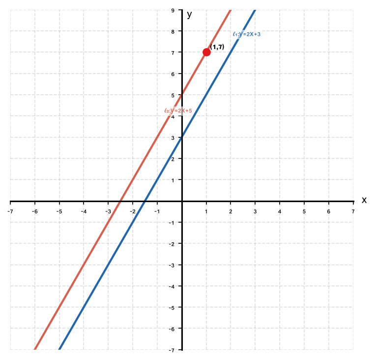
17. מקבילית
$ABCD$:
$$A(0,\,0), \quad B(4,\,2), \quad C(6,\,5)$$

א. מצא את קואורדינטות
$D$
כך ש-
$\overrightarrow{AB} = \overrightarrow{DC}$.

ב. כתוב את משוואות הישרים
$AB$
ו-
$DC$,
ואמת שאכן
$AB \parallel DC$.

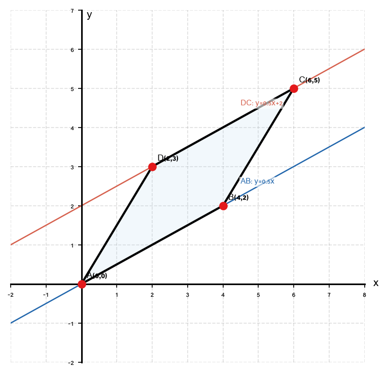
18. שתי צלעות מקבילות של טרפז:
$$\ell_1: y = 3x - 1 \quad \text{-} \quad \ell_2: y = 3x + 5$$
הצלע השלישית
$\ell_3$
עוברת דרך הנקודות
$A(0,\,-1)$
ו-
$B(2,\,3)$.

א. מצא את שיפוע
$\ell_3$
.

ב. כתוב את משוואת הצלע הרביעית המקבילה ל-
$\ell_3$
ועוברת דרך נקודה הנמצאת על
$\ell_2$
(בחר
$x = 0$).

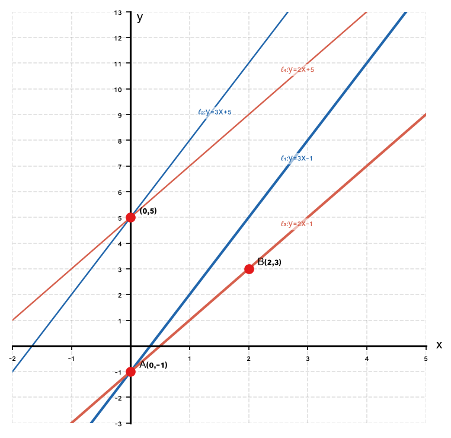
19. שני כבישים מקבילים:
כביש ראשון:
$$y = \dfrac{1}{2}x + 4$$
כביש שני עובר דרך הנקודה
$P(2,\,-1)$.

א. כתוב את משוואת הכביש השני.

ב. מצא את נקודת חיתוכו עם ציר
$y$
.

ג. מהו המרחק האנכי (הפרש ב-
$y$
) בין שני הכבישים עבור
$x = 0$?

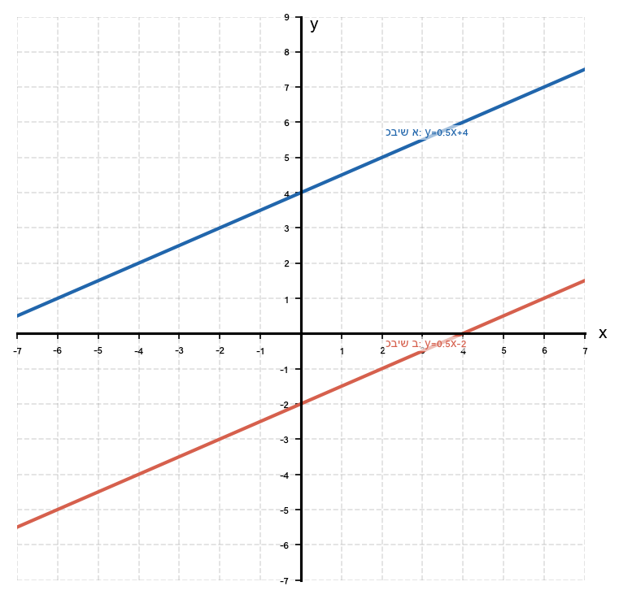
20. שני ישרים מקבילים:
$\ell_1$
עובר דרך
$A(1,\,3)$
ו-
$B(3,\,7)$.
$\ell_2$
עובר דרך
$C(0,\,-2)$
ו-
$D(2,\,k)$.

א. מצא את שיפוע
$\ell_1$
.

ב. מצא את ערך
$k$
כך ש-
$\ell_1 \parallel \ell_2$
.

ג. כתוב את משוואת
$\ell_2$
.

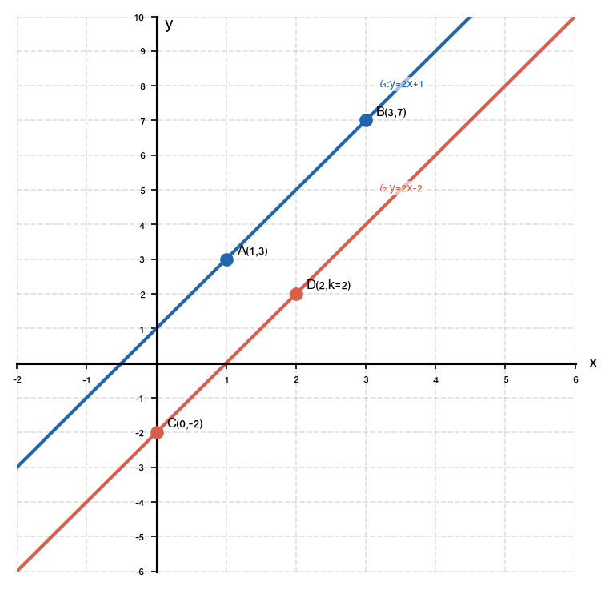

---

תשובות סופיות

1. כן — לשניהם שיפוע
$a = 3$
. מספרים חופשיים שונים (
$2$
ו-
$-5$
) — מקבילים.

2. לא — שיפועים שונים (
$a_1 = 2$,
$a_2 = 4$
).

3. $y = 5x + 4$

4. $y = -2x$

5. כן — לשניהם שיפוע
$a = \dfrac{1}{2}$
. מספרים חופשיים שונים (
$3$
ו-
$-1$
) — מקבילים.

6. $k = 4$

7. $y = 5$

8. $y = x + 5$

9. $a = 2$

שיפועים שווים — **מקבילים**.

10. לא

שיפועים שונים — **אינם מקבילים**.

11. $y = -3x + 5$

12. $y = \dfrac{2}{3}x + 3$

13. $a = 1$

שיפועים שווים — הקטעים מקבילים ✓

14. $a = 0$

שניהם אופקיים —
$AB \parallel DC$
✓

15. $k = 6$

16. $\ell_2$
:
$y = 2x + 5$

חיתוך עם ציר
$y$
:
$(0,\,5)$

17.
א.
$D(2,\,3)$
ב.
$y = \dfrac{1}{2}x + 2$

שיפועים שווים —
$AB \parallel DC$
✓

18.
א.
שיפוע
$\ell_3$
:
$\dfrac{3-(-1)}{2-0} = 2$
ב.
$y = 2x + 5$

19.
א.
$y = \dfrac{1}{2}x - 2$
ב.
נקודת חיתוך עם ציר
$y$
:
$(0,\,-2)$
ג.
מרחק אנכי עבור
$x = 0$
:
$6$
יחידות.

20.
א.
שיפוע
$\ell_1$
:
$\dfrac{7-3}{3-1} = 2$
ב.
$k = 2$
ג.
$y = 2x - 2$

