# ישרים ניצבים ויישומן בחישובים

**תנאי ניצבות:** שני ישרים ניצבים זה לזה אם ורק אם מכפלת שיפועיהם שווה ל-
$-1$
:
$$a_1 \cdot a_2 = -1$$
שיפוע הישר הניצב ל-
$\ell$
(בעל שיפוע
$a$
) הוא:
$$a_\perp = -\dfrac{1}{a}$$

---

## רמה 1: בניית ביטחון (תרגילים 1–8)

1. בדוק: האם שני הישרים ניצבים?
$$y = 2x + 3 \quad \text{-} \quad y = -\dfrac{1}{2}x + 1$$

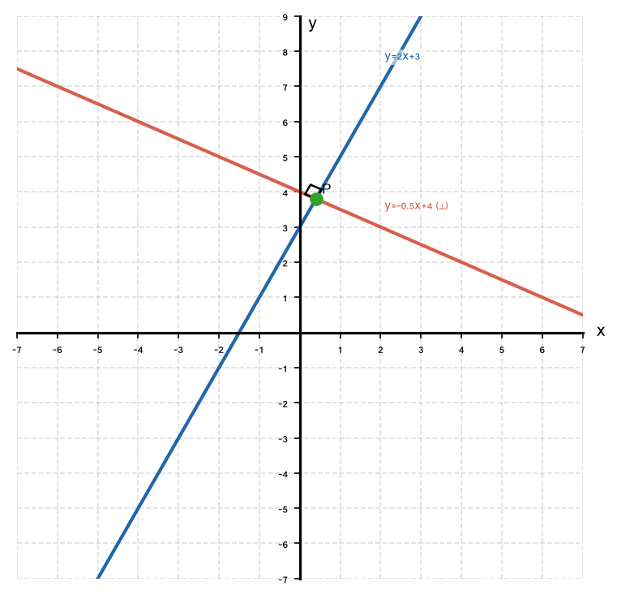

2. בדוק: האם שני הישרים ניצבים?
$$y = 3x + 1 \quad \text{-} \quad y = 3x - 2$$

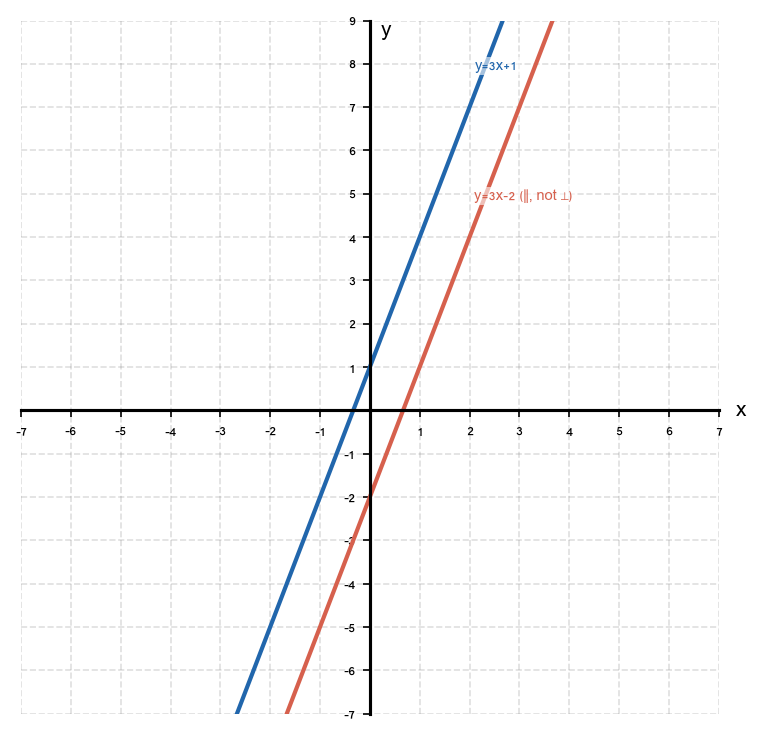

3. מהו השיפוע של ישר הניצב ל-
$y = 4x + 5$?

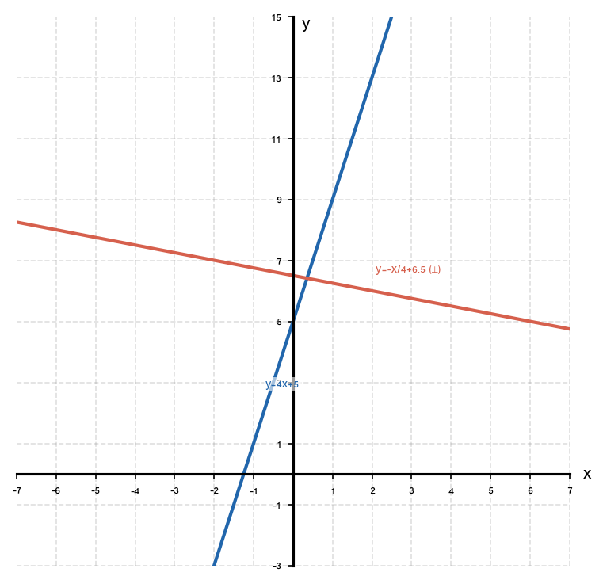

4. מהו השיפוע של ישר הניצב ל-
$y = -\dfrac{1}{3}x + 2$?

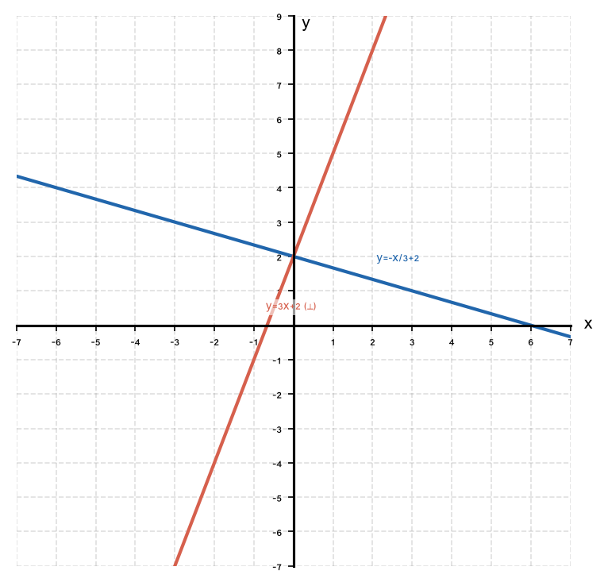

5. בדוק: האם שני הישרים ניצבים?
$$y = 5x - 1 \quad \text{-} \quad y = -\dfrac{1}{5}x + 3$$

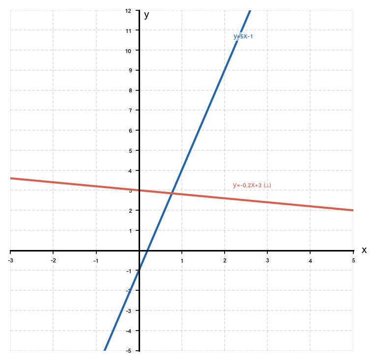

6. מהו השיפוע של ישר הניצב ל-
$y = -7x + 4$?

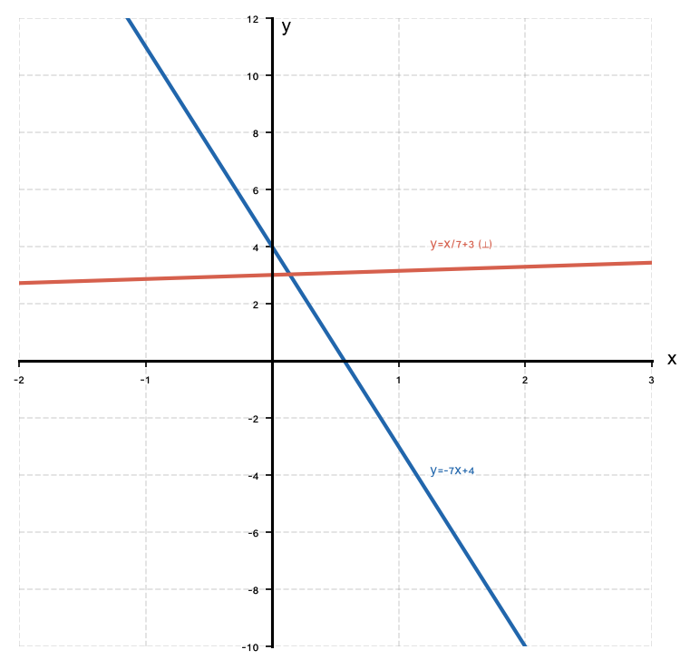

7. ישר
$\ell_1$
אופקי (שיפוע
$0$
) וישר
$\ell_2$
אנכי (שיפוע לא מוגדר).
האם הם ניצבים? הסבר.

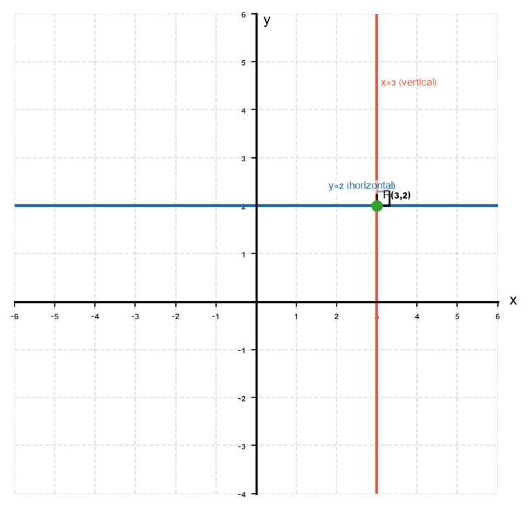

8. בדוק: האם שני הישרים ניצבים?
$$y = \dfrac{2}{3}x \quad \text{-} \quad y = -\dfrac{3}{2}x + 5$$

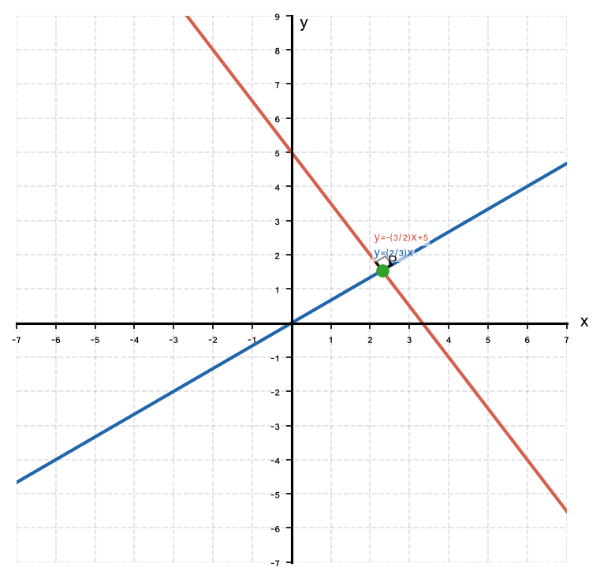

---

## רמה 2: תרגול שוטף ומשולב (תרגילים 9–16)

9. מצא ישר הניצב ל-
$y = 3x - 2$
ועובר דרך הנקודה
$A(3,\,1)$.

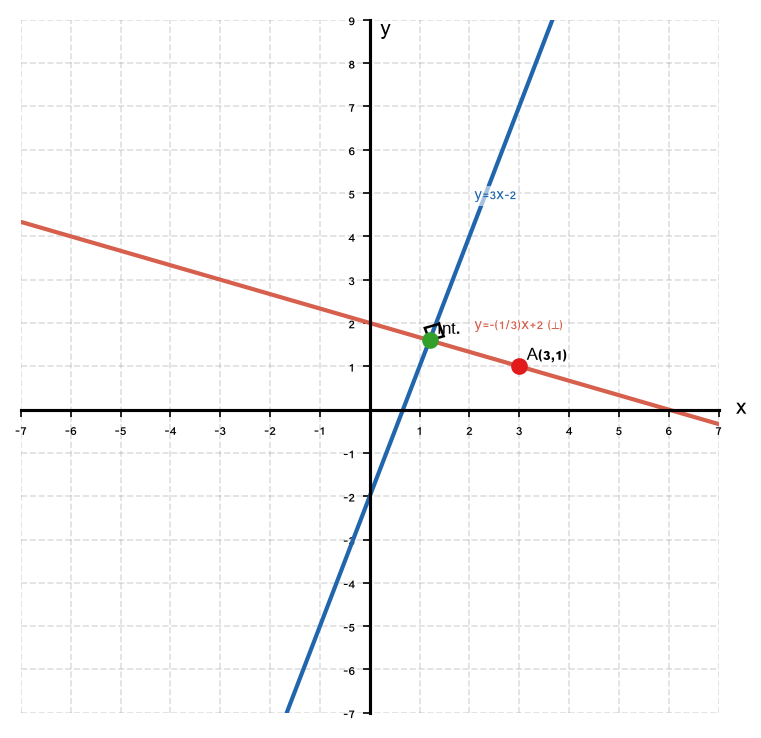

10. מצא ישר הניצב ל-
$y = -2x + 5$
ועובר דרך הנקודה
$B(-2,\,4)$.

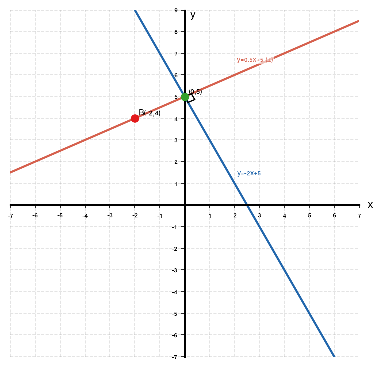

11. הישר
$\ell_1: y = kx + 3$
ניצב ל-
$\ell_2: y = 4x - 1$.
מצא את
$k$
.

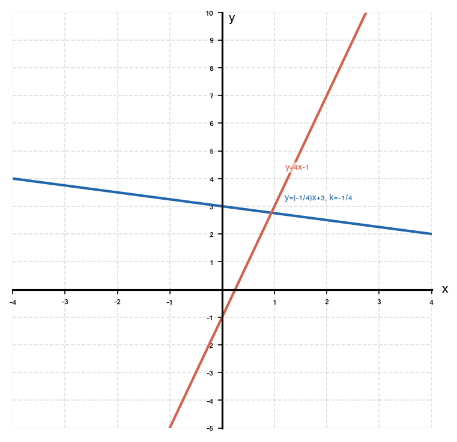

12. הוכח שהנקודות
$A(0,\,0)$, $B(4,\,2)$, $C(3,\,4)$
יוצרות זווית ישרה ב-
$B$
.

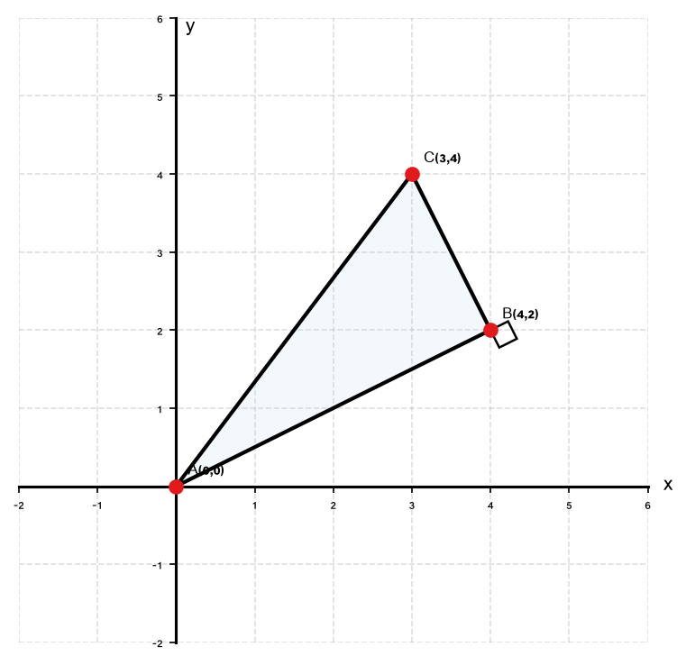

13. מצא ישר הניצב ל-
$y = \dfrac{1}{2}x + 4$
ועובר דרך הנקודה
$C(2,\,-3)$.

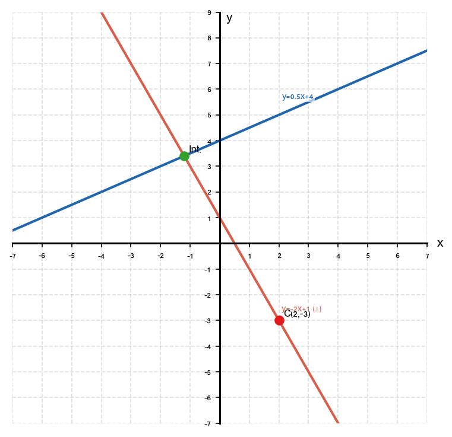

14. ישר
$\ell$
ניצב ל-
$y = x + 2$
ועובר דרך הנקודה
$D(3,\,1)$.

א. כתוב את משוואת
$\ell$
.

ב. מצא את נקודת החיתוך של
$\ell$
עם הישר
$y = x + 2$.

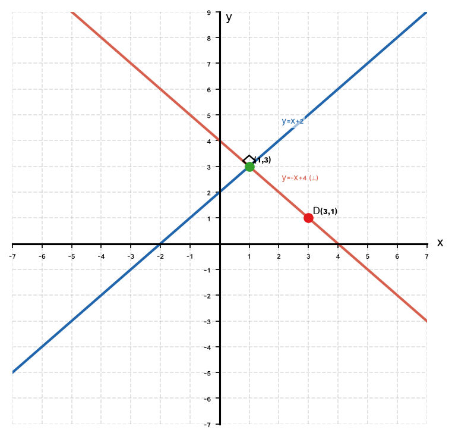

15. בדוק: האם שני הישרים ניצבים?
$$y = \dfrac{3}{4}x - 2 \quad \text{-} \quad y = -\dfrac{4}{3}x + 5$$

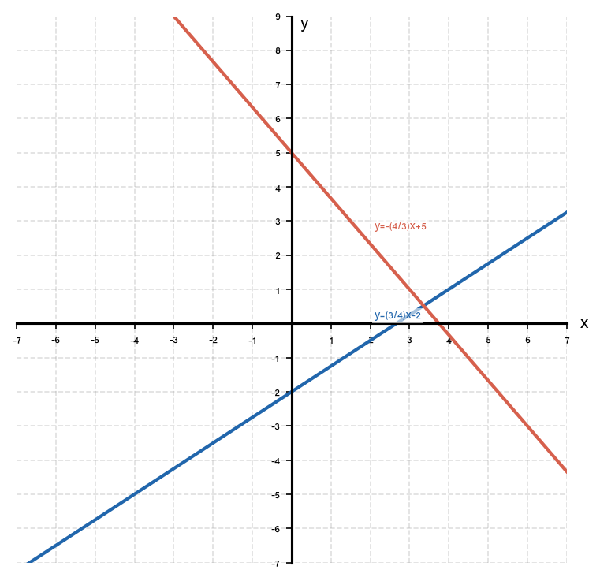

16. הבא כל ישר לצורה
$y = ax + b$
ובדוק אם הם ניצבים:
$$\ell_1:\; 2x - y + 3 = 0 \quad \text{-} \quad \ell_2:\; x + 2y - 4 = 0$$

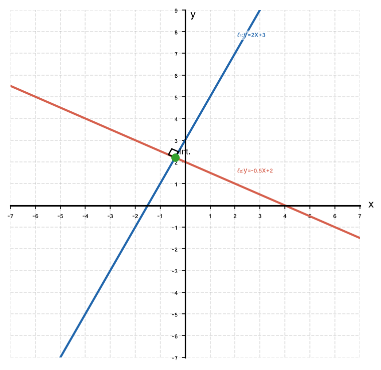

---

## רמה 3: רמת בחינת מה"ט (תרגילים 17–20)

17. משולש ישר-זווית
$ACB$:
$$A(-5,\,12), \quad C(7,\,0)$$
הזווית הישרה ב-
$C$
, והנקודה
$B$
נמצאת על הישר
$y = -2x + 2$.

א. מצא את שיפוע הצלע
$CA$
.

ב. הצלע
$CB$
ניצבת ל-
$CA$
— מצא את שיפוע
$CB$
.

ג. כתוב את משוואת הישר
$CB$
.

ד. מצא את קואורדינטות
$B$
.

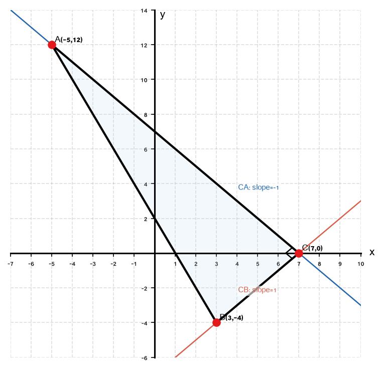

18. מצא ישר הניצב ל-
$y = -\dfrac{1}{2}x + 6$
ועובר דרך נקודת החיתוך של הישרים:
$$y = 3x - 1 \quad \text{-} \quad y = x + 3$$

א. מצא את נקודת החיתוך.

ב. כתוב את משוואת הישר הניצב.

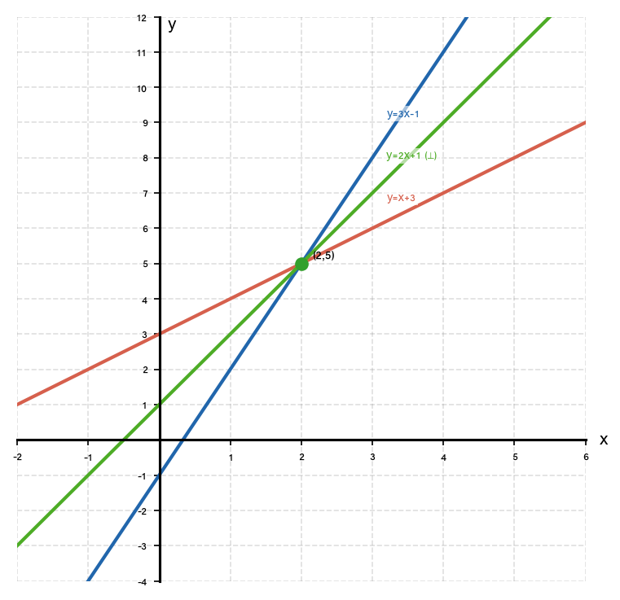

19. משולש
$ABC$:
$$A(0,\,5), \quad B(-2,\,-1), \quad C(4,\,2)$$
חשב את הגובה מ-
$A$
לצלע
$BC$
.

א. מצא את שיפוע
$BC$
ואת משוואת הצלע
$BC$
.

ב. מצא את שיפוע הגובה מ-
$A$
.

ג. כתוב את משוואת הגובה מ-
$A$
.

ד. מצא את רגל הגובה (נקודת החיתוך עם
$BC$
).

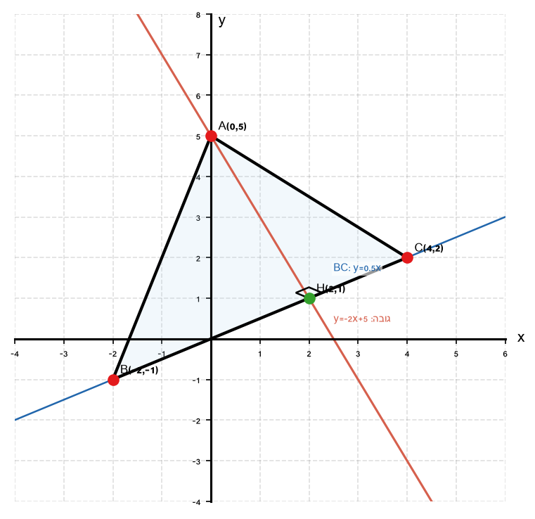

20. משולש
$ABC$:
$$A(-7,\,-7), \quad B(2,\,6), \quad C(17,\,1)$$

א. מצא את שיפוע הצלע
$AC$
.

ב. מצא את משוואת הגובה מ-
$B$
לצלע
$AC$
.

ג. בדוק: האם הגובה עובר דרך הנקודה
$(7,\,-9)$?

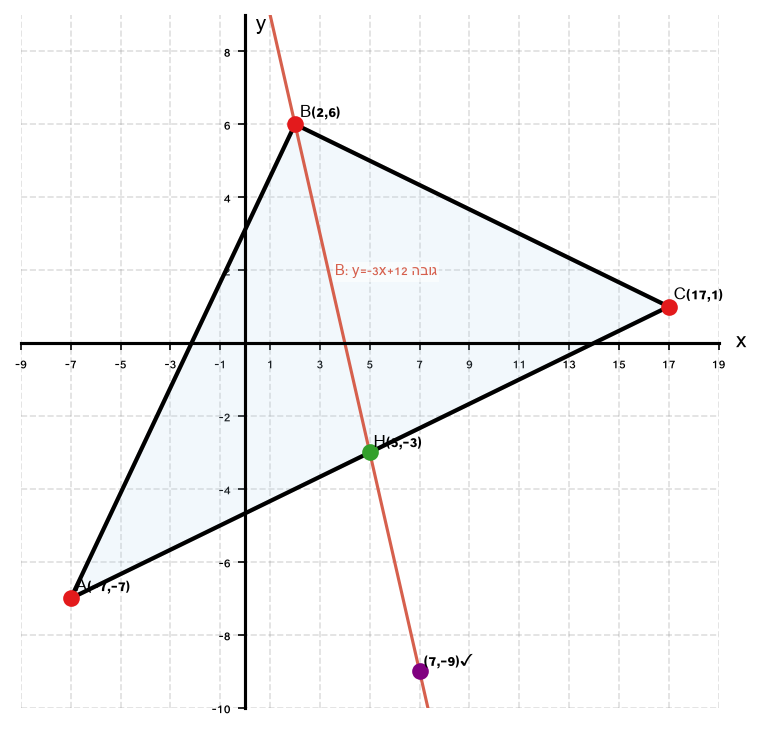

---

תשובות סופיות

1. $-1$

— כן, **ניצבים** ✓

2. $9 \neq -1$

— לא ניצבים (מקבילים).

3. $a_\perp = -\dfrac{1}{4}$

4. $a_\perp = 3$

5. $5 \cdot \left(-\tfrac{1}{5}\right) = -1$

— ניצבים ✓

6. $a_\perp = \dfrac{1}{7}$

7. כן — ישר אופקי וישר אנכי מהווים זווית ישרה.

8. $-1$

— כן, **ניצבים** ✓

9. $y = -\dfrac{1}{3}x + 2$

10. $y = \dfrac{1}{2}x + 5$

11. $k = -\dfrac{1}{4}$

12. $-1$

— זווית ישרה ב-
$B$
✓

13. $y = -2x + 1$

14.
א.
$y = -x + 4$
ב.
$(1,\,3)$

15. $\dfrac{3}{4} \cdot \left(-\dfrac{4}{3}\right) = -1$

— ניצבים ✓

16. $a_1 \cdot a_2 = 2 \cdot \left(-\tfrac{1}{2}\right) = -1$

— ניצבים ✓

17.
א.
$a_{CA} = -1$
ב.
שיפוע ניצב:
$a_{CB} = 1$
ג.
$y = x - 7$
ד.
$B(3,\,-4)$

18.
א.
$(2,\,5)$
ב.
$y = 2x + 1$

19.
א.
$y = \dfrac{1}{2}x$
ב.
שיפוע הגובה מ-
$A$
:
$-2$
ג.
$y = -2x + 5$
ד.
רגל הגובה:
$(2,\,1)$

20.
א.
$\dfrac{1}{3}$
ב.
$y = -3x + 12$
ג.
$-9$
✓ — הגובה עובר דרך הנקודה.

