# מציאת אמצע קטע נתון

**נוסחת אמצע הקטע** בין שתי נקודות
$(x_1, y_1)$
ו-
$(x_2, y_2)$:
$$M = \left(\dfrac{x_1 + x_2}{2},\;\dfrac{y_1 + y_2}{2}\right)$$

---

## רמה 1: בניית ביטחון (תרגילים 1–8)

1. מצא את אמצע הקטע בין הנקודות:
$$A(2,\,4) \quad \text{-} \quad B(6,\,8)$$

2. מצא את אמצע הקטע בין הנקודות:
$$P(0,\,0) \quad \text{-} \quad Q(10,\,6)$$

3. מצא את אמצע הקטע בין הנקודות:
$$A(1,\,3) \quad \text{-} \quad B(5,\,7)$$

4. מצא את אמצע הקטע בין הנקודות:
$$C(3,\,1) \quad \text{-} \quad D(7,\,9)$$

5. מצא את אמצע הקטע בין הנקודות:
$$E(0,\,4) \quad \text{-} \quad F(8,\,0)$$

6. מצא את אמצע הקטע האנכי בין הנקודות:
$$A(2,\,6) \quad \text{-} \quad B(2,\,12)$$

7. מצא את אמצע הקטע האופקי בין הנקודות:
$$G(1,\,1) \quad \text{-} \quad H(9,\,1)$$

8. מצא את אמצע הקטע בין הנקודות:
$$A(0,\,0) \quad \text{-} \quad B(6,\,8)$$

---

## רמה 2: תרגול שוטף ומשולב (תרגילים 9–16)

9. מצא את אמצע הקטע בין הנקודות:
$$A(-3,\,5) \quad \text{-} \quad B(7,\,-1)$$

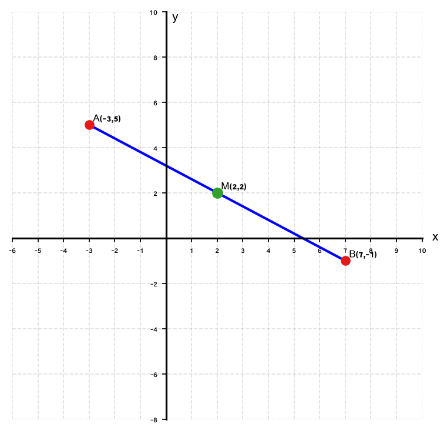

10. מצא את אמצע הקטע בין הנקודות:
$$P(-4,\,-2) \quad \text{-} \quad Q(0,\,6)$$

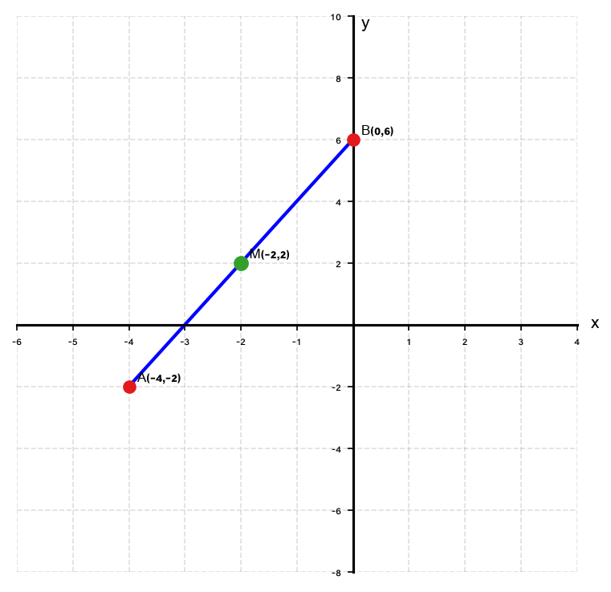

11. מצא את אמצע הקטע בין הנקודות:
$$A(-5,\,3) \quad \text{-} \quad B(-1,\,-7)$$

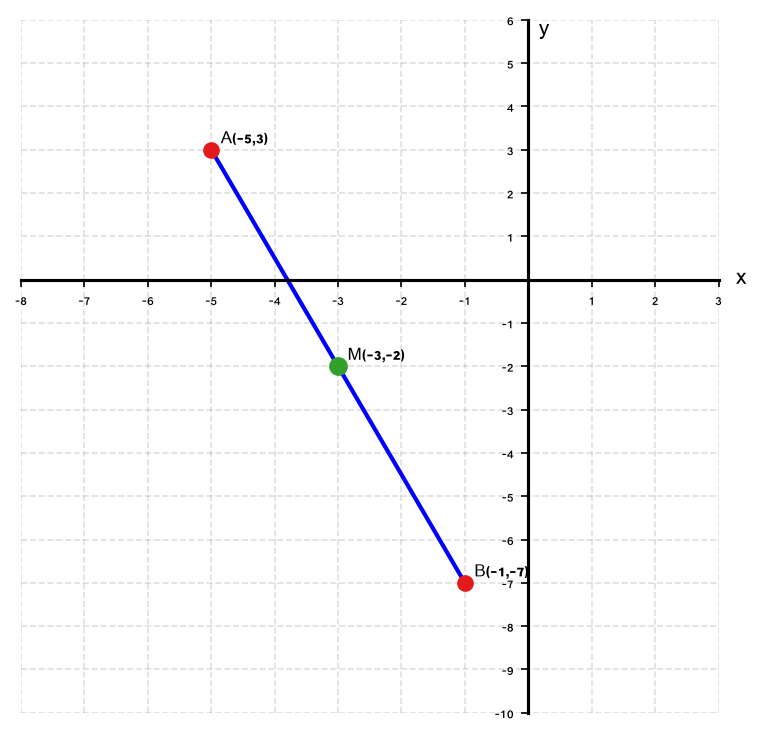

12. נתון:
$M(3,\,4)$
הוא אמצע הקטע
$AB$
, ו-
$A(1,\,2)$.
מצא את
$B$
.

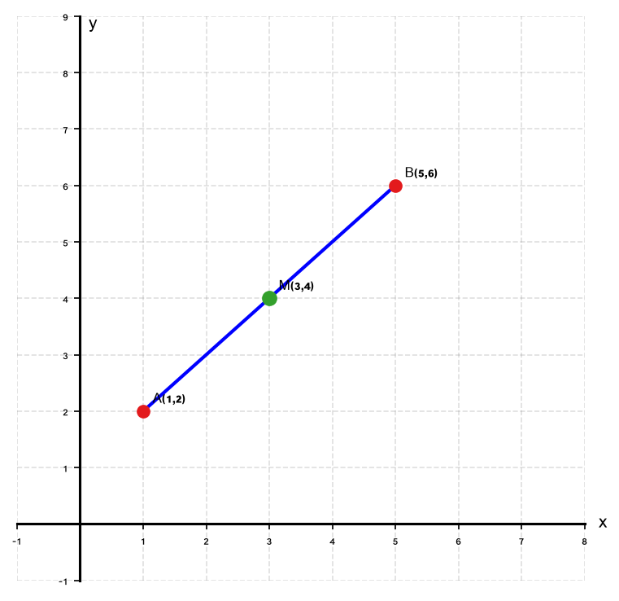

13. נתון:
$M(0,\,5)$
הוא אמצע הקטע
$PQ$
, ו-
$P(-4,\,3)$.
מצא את
$Q$
.

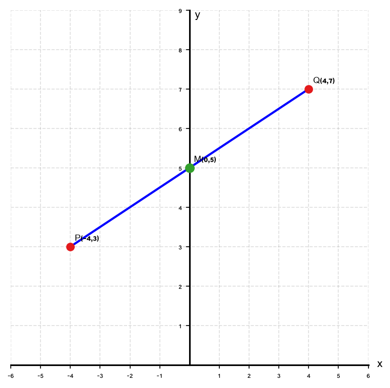

14. מצא את אמצע הקטע בין הנקודות:
$$C\!\left(\dfrac{1}{2},\,3\right) \quad \text{-} \quad D\!\left(\dfrac{3}{2},\,-1\right)$$

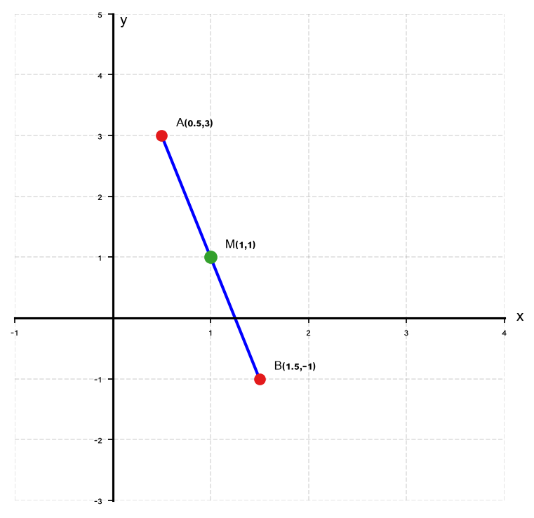

15. מצא את אמצע הקטע בין הנקודות:
$$A\!\left(-\dfrac{1}{2},\,\dfrac{3}{2}\right) \quad \text{-} \quad B\!\left(\dfrac{5}{2},\,\dfrac{1}{2}\right)$$

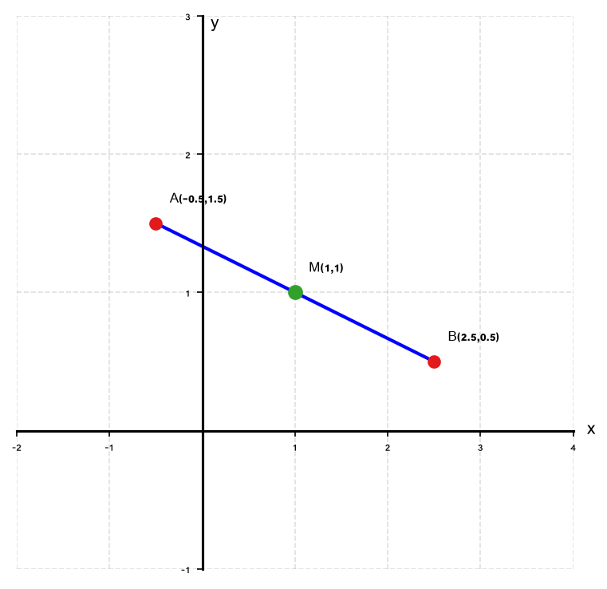

16. הנקודה
$M(k,\,5)$
אמורה להיות אמצע הקטע בין
$A(2,\,3)$
ו-
$B(8,\,7)$.
האם זה נכון? מצא את
$k$
האמיתי.

---

## רמה 3: רמת בחינת מה"ט (תרגילים 17–20)

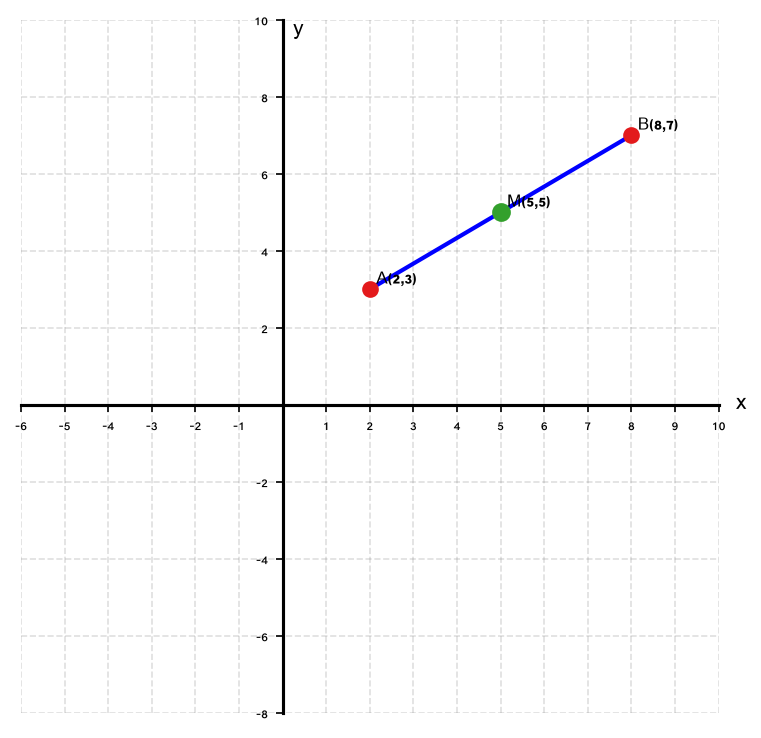

17. מלבן
$ABCD$:
$$A(2,\,2), \quad B(2,\,5), \quad C(6,\,5)$$

א. מצא את קואורדינטות
$D$
.

ב. מצא את נקודת האמצע של האלכסון
$AC$
.

ג. מצא את נקודת האמצע של האלכסון
$BD$
.

ד. מה ניתן להסיק מסעיפים ב' ו-ג'?

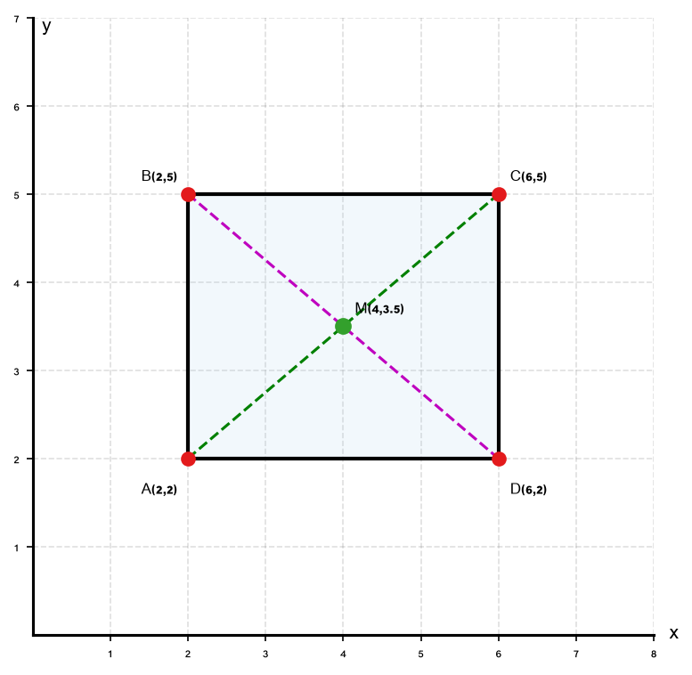

18. מלבן
$ABCD$:
$$A(0,\,-1), \quad B(4,\,-1), \quad C(4,\,2), \quad D(0,\,2)$$

א. הוכח שהוא מלבן (הוכח שהזוויות ישרות).

ב. חשב את שטח המלבן.

ג. מצא את נקודת האמצע של כל אחד מן האלכסונים
$AC$
ו-
$BD$.

ד. מה ניתן להסיק לגבי האלכסונים?

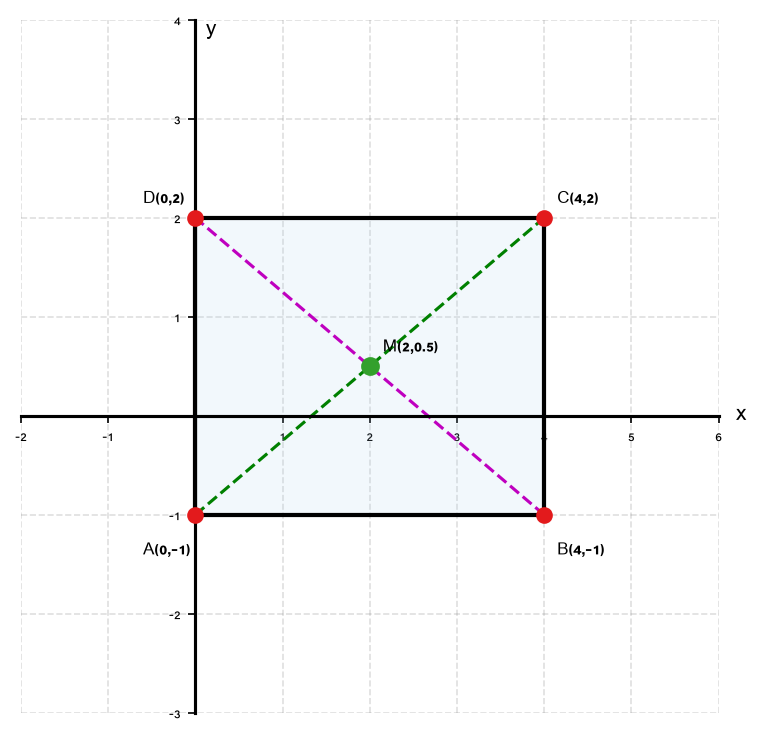

19. מלבן
$ABCD$:
$$A(2,\,-3), \quad B(1,\,-3)$$
האלכסון
$BD$
נמצא על הישר
$y = 2x - 5$.

א. בדוק שהנקודה
$B$
נמצאת על הישר
$y = 2x - 5$.

ב. מצא את קואורדינטות
$D$
(השתמש בעובדה ש-
$D$
על ציר
$y = 2x - 5$
ועל הישר האנכי
$x = 2$).

ג. מצא את נקודת האמצע
$M$
של האלכסון
$BD$
.

ד. מצא את קואורדינטות
$C$
(השתמש בכך ש-
$M$
הוא גם אמצע האלכסון
$AC$
).

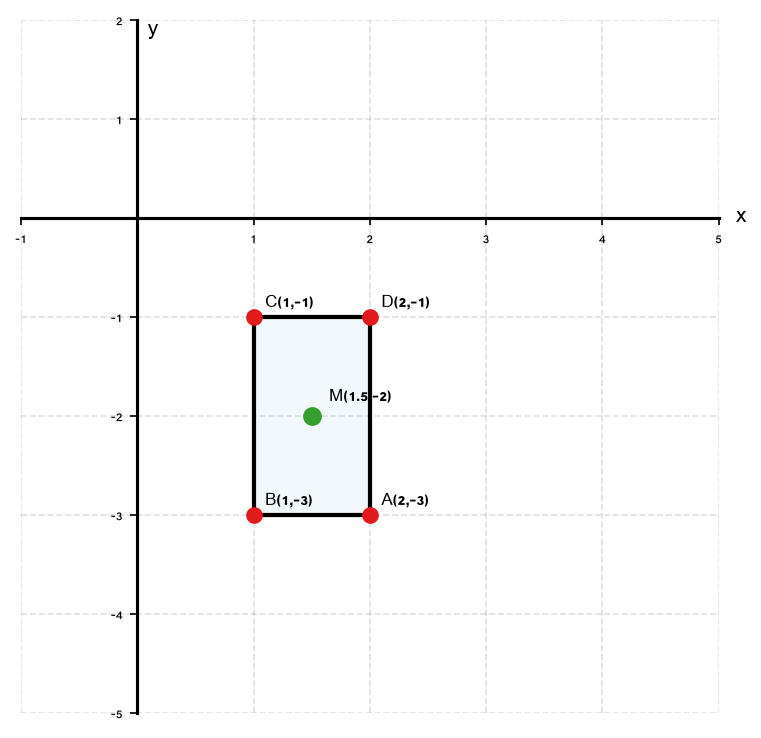

20. מלבן
$ABCD$:
$$A(2,\,2), \quad B(2,\,5), \quad C(6,\,5), \quad D(6,\,2)$$

א. מצא את נקודת האמצע
$M$
של האלכסון
$AC$
.

ב. מצא את אורך האלכסון
$AC$
(השתמש בנוסחת המרחק).

ג. מצא את אורך האלכסון
$BD$
, ובדוק האם האלכסונות שווים.

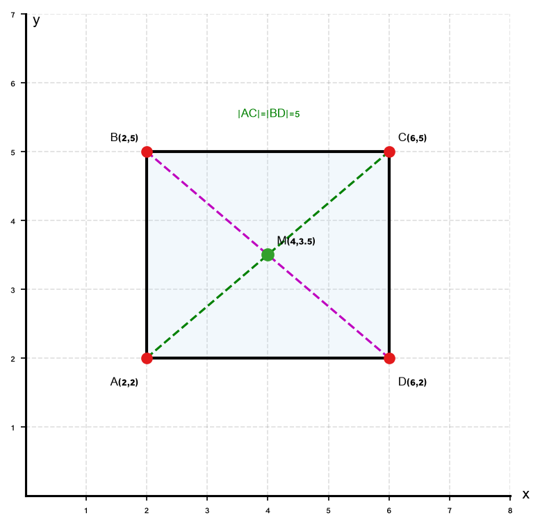

---

תשובות סופיות

1. $(4,\,6)$

2. $(5,\,3)$

3. $(3,\,5)$

4. $(5,\,5)$

5. $(4,\,2)$

6. $(2,\,9)$

7. $(5,\,1)$

8. $(3,\,4)$

9. $(2,\,2)$

10. $(-2,\,2)$

11. $(-3,\,-2)$

12. $B(5,\,6)$

13. $Q(4,\,7)$

14. $(1,\,1)$

15. $(1,\,1)$

16. $k = 5$

קואורדינטת
$y$
של האמצע (
$5$
) אכן נכונה, אך קואורדינטת
$x$
צריכה להיות
$5$
, ולא ערך אחר.

17.
א.
ב-
$ABCD$
מלבן:
$D = (6,\,2)$
(כיוון ש-
$DC \parallel AB$
ו-
$AD \parallel BC$
)
ב.
אמצע האלכסון
$AC$
:
$\left(\dfrac{2+6}{2},\,\dfrac{2+5}{2}\right) = (4,\,3.5)$
ג.
אמצע האלכסון
$BD$
:
$\left(\dfrac{2+6}{2},\,\dfrac{5+2}{2}\right) = (4,\,3.5)$
ד.
האלכסונות חוצים זה את זה — נקודות האמצע שלהם זהות ✓ (תכונת המלבן)

18.
א.
שיפוע
$AB$
:
$0$
(אופקי).
שיפוע
$BC$
:
$\dfrac{2-(-1)}{4-4}$

— אנכי.
ישר אופקי וישר אנכי ניצבים זה לזה → הזוויות ישרות → מלבן ✓
ב.
$12$
ג.
$\left(2,\,\dfrac{1}{2}\right)$
ד.
האלכסונים חוצים זה את זה ✓

19.
א.
$-3$

✓ —
$B$
על הישר.
ב.
$D(2,\,-1)$
ג.
$M\left(\dfrac{3}{2},\,-2\right)$
ד.
$C(1,\,-1)$

20.
א.
$M\left(4,\,3.5\right)$
ב.
$AC = 5$
ג.
$BD = 5$

האלכסונים שווים ✓ (תכונה של מלבן)

