# חישוב מרחק בין שתי נקודות

**נוסחת המרחק** (פיתגורס):

$$d = \sqrt{(x_2 - x_1)^2 + (y_2 - y_1)^2}$$

---

## רמה 1: בניית ביטחון (תרגילים 1–8)

**1.** חשב את המרחק בין הנקודות:
$$A(0,\ 0) \quad \text{-} \quad B(3,\ 4)$$

---

**2.** חשב את המרחק בין הנקודות:
$$A(1,\ 1) \quad \text{-} \quad B(4,\ 5)$$

---

**3.** חשב את המרחק בין הנקודות:
$$A(0,\ 0) \quad \text{-} \quad B(5,\ 12)$$

---

**4.** חשב את המרחק בין הנקודות:
$$A(2,\ 3) \quad \text{-} \quad B(8,\ 3)$$
(הנקודות על ישר אופקי — אפשר לחשב ישירות.)

---

**5.** חשב את המרחק בין הנקודות:
$$A(-3,\ 0) \quad \text{-} \quad B(0,\ 4)$$

---

**6.** חשב את המרחק בין הנקודות:
$$A(1,\ 2) \quad \text{-} \quad B(7,\ 10)$$

---

**7.** חשב את המרחק בין הנקודות:
$$A(0,\ 0) \quad \text{-} \quad B(8,\ 6)$$

---

**8.** חשב את המרחק בין הנקודות:
$$A(3,\ 1) \quad \text{-} \quad B(3,\ 7)$$
(הנקודות על ישר אנכי — אפשר לחשב ישירות.)

---

## רמה 2: תרגול שוטף ומשולב (תרגילים 9–16)

**9.** חשב את המרחק בין הנקודות:
$$A(-3,\ 2) \quad \text{-} \quad B(5,\ -4)$$

---

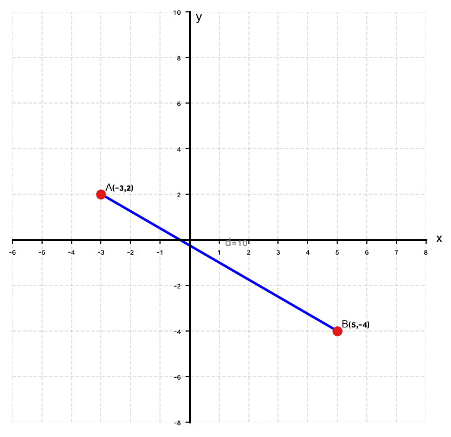
**10.** חשב את המרחק בין הנקודות:
$$A(-4,\ -3) \quad \text{-} \quad B(0,\ 0)$$

---

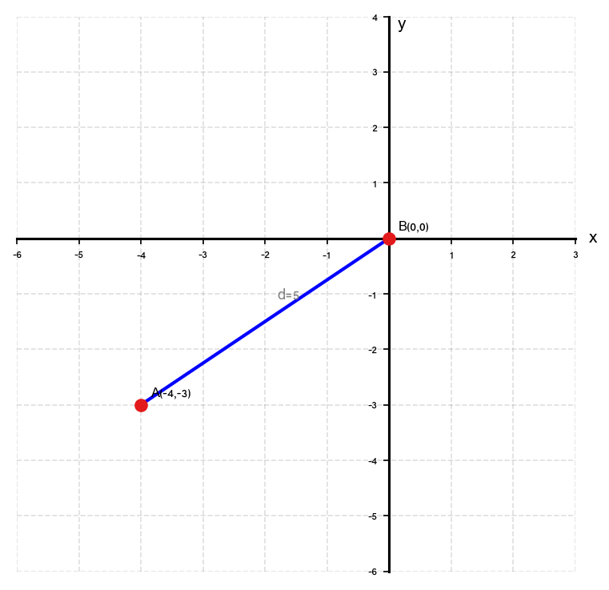
**11.** חשב את המרחק בין הנקודות:
$$A(1,\ 7) \quad \text{-} \quad B(-2,\ 3)$$

---

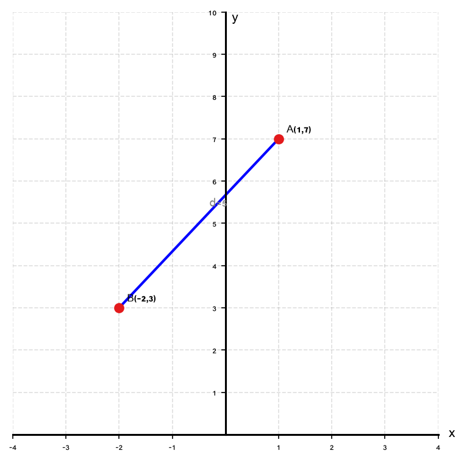
**12.** חשב את המרחק בין הנקודות:
$$A(-2,\ 3) \quad \text{-} \quad B(3,\ -9)$$

---

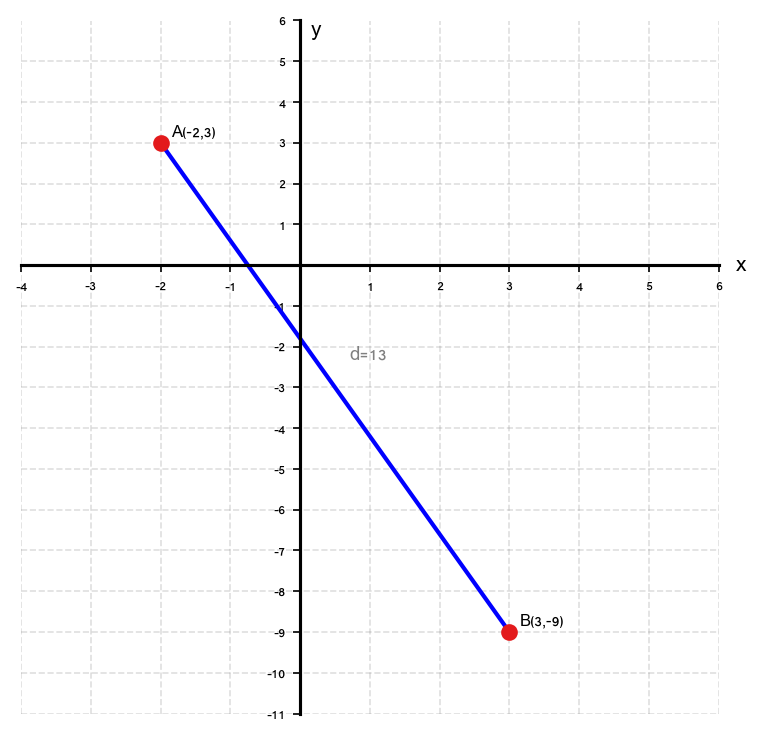
**13.** חשב את המרחק בין הנקודות:
$$A(0,\ -6) \quad \text{-} \quad B(8,\ 0)$$

---

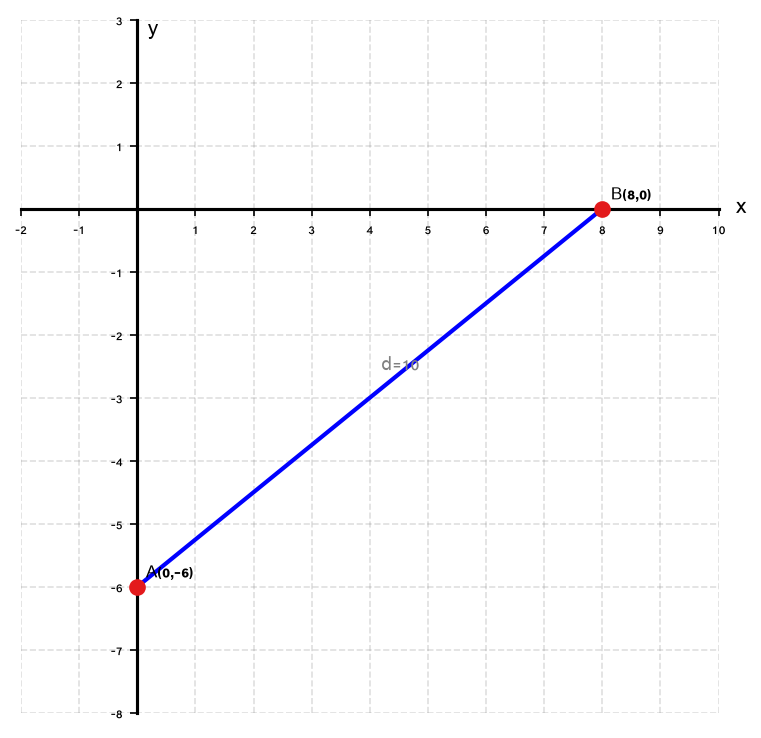
**14.** חשב את המרחק בין הנקודות:
$$A(-5,\ 2) \quad \text{-} \quad B(7,\ 7)$$

---

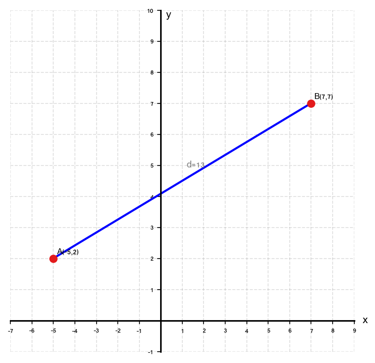
**15.** חשב את המרחק בין הנקודות:
$$A(-6,\ 1) \quad \text{-} \quad B(6,\ 6)$$

---

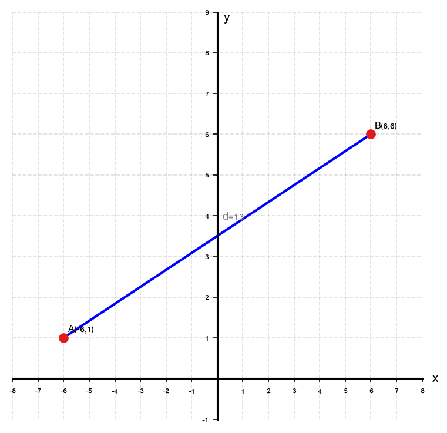
**16.** חשב את המרחק בין הנקודות:
$$A\!\left(\tfrac{1}{2},\ 1\right) \quad \text{-} \quad B\!\left(\tfrac{5}{2},\ 4\right)$$

---

## רמה 3: רמת בחינת מה"ט (תרגילים 17–20)

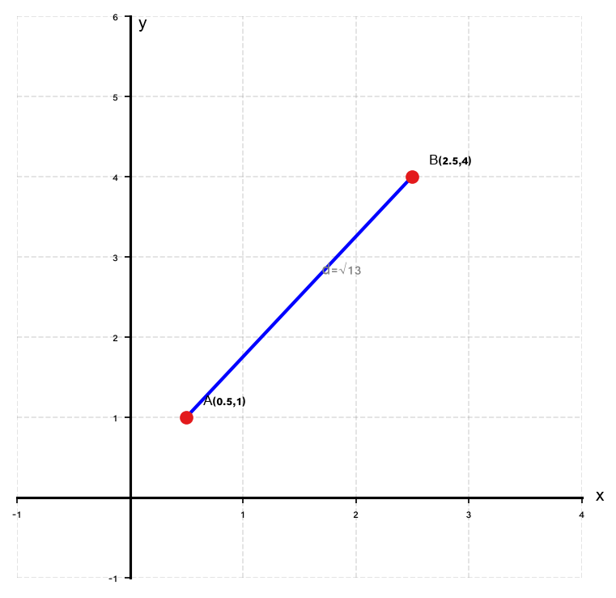
**17.** שני עמודי חשמל ממוקמים ב-:
$$A(0,\ 0) \quad \text{-} \quad B(6,\ 8)$$

א. חשב את אורך חוט החשמל המחבר בין שני העמודים.

ב. מצא את נקודת האמצע
$M$
של חוט החשמל.

ג. בדוק: האם
$MA = MB$
? הסבר מדוע.

---

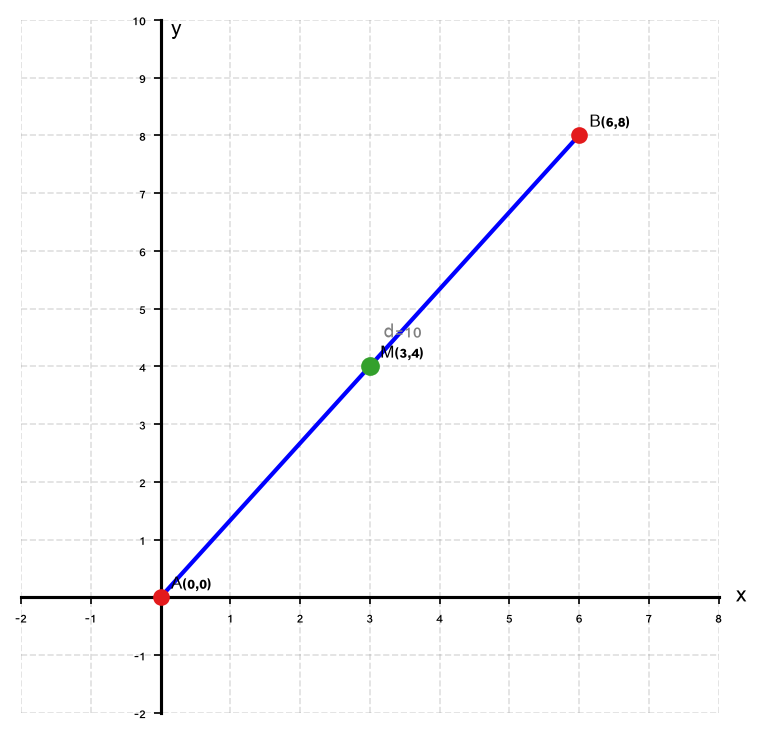
**18.** בתכנון עירוני, שני מוקדי שירות ממוקמים ב-:
$$A(1000,\ 0) \quad \text{-} \quad B(0,\ 200)$$
(הנתונים ביחידות מטרים.)

א. חשב את המרחק בין שני המוקדים. כתוב את התשובה בצורה מפושטת.

ב. מצא את נקודת האמצע
$M$
של הקטע
$AB$
.

---

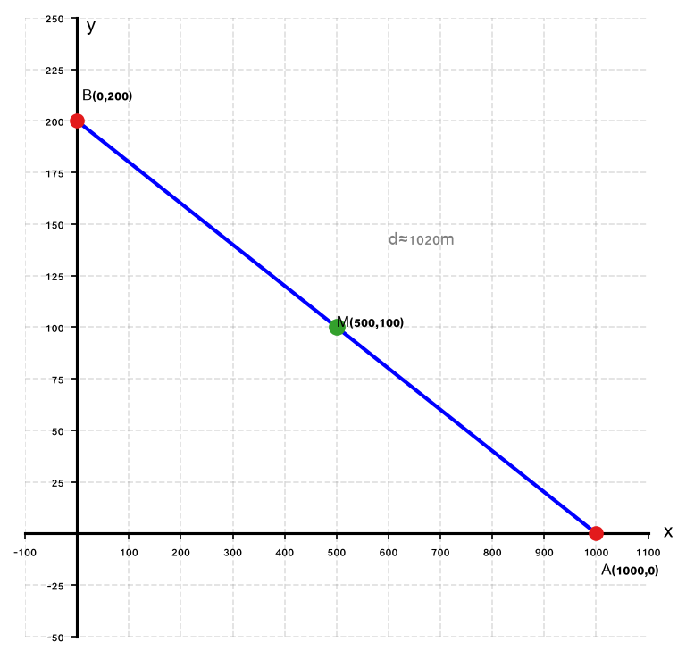
**19.** חדר מלבני עם פינות:
$$A(2,\ -3),\quad B(7,\ -3),\quad C(7,\ 1),\quad D(2,\ 1)$$
(הנתונים ביחידות מטרים.)

א. חשב את היקף החדר.

ב. חשב את אורך האלכסון של החדר.

---

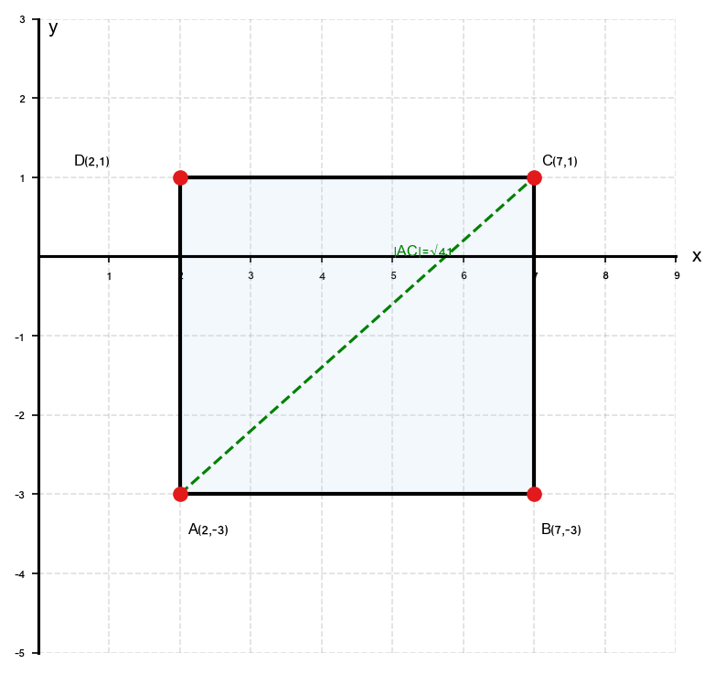
**20.** משולש עם קודקודים:
$$A(-4,\ 0),\quad B(4,\ 0),\quad C(0,\ 3)$$

א. הוכח שהמשולש שווה-שוקיים על ידי חישוב אורכי הצלעות.

ב. חשב את היקף המשולש.

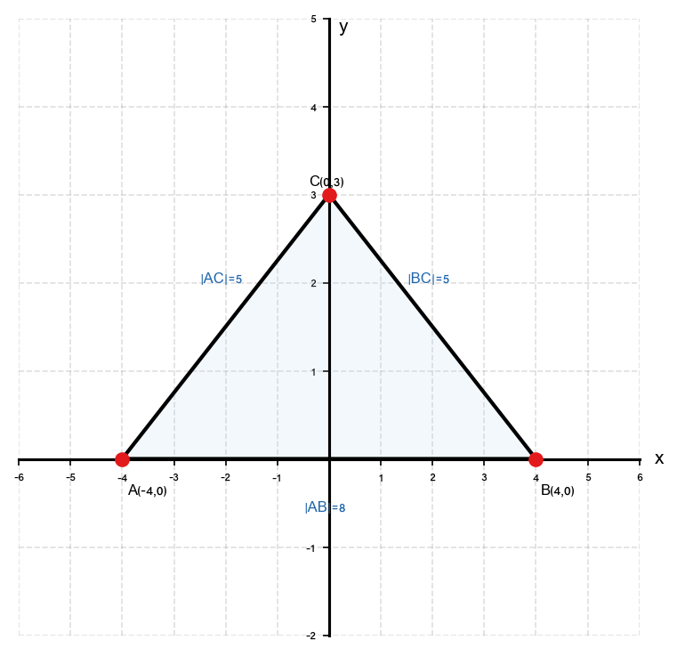

---

תשובות סופיות

1. $d = 5$
2. $d = 5$
3. $d = 13$
4. $d = 6$
5. $d = 5$
6. $d = 10$
7. $d = 10$
8. $d = 6$
9. $d = 10$
10. $d = 5$
11. $d = 5$
12. $d = 13$
13. $d = 10$
14. $d = 13$
15. $d = 13$
16. $d = \sqrt{13}$
17. א. $|AB| = 10$ ב. $M(3,\ 4)$ ג. שווי-מרחק
18. א. $|AB| = 200\sqrt{26} \approx 1019.8\ \text{m}ב. M(500,\ 100)$
19. א. $היקף$= 18\ \text{m}ב. אלכסון$\sqrt{41}\ \text{m}$
20. א. $שווה-שוקיים ב.$18$

