# מערכת הצירים וסימון נקודות במישור

---

## רמה 1: בניית ביטחון (תרגילים 1–8)

1. סמן את הנקודה
$$A(3, 5)$$
במערכת הצירים. באיזה רביע היא נמצאת?

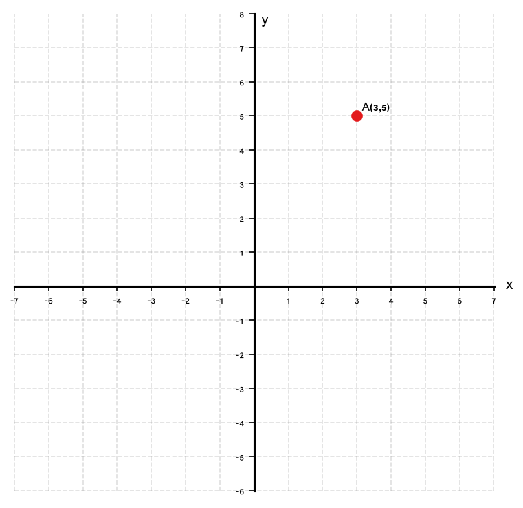

2. סמן את הנקודה
$$B(-2, 4)$$
במערכת הצירים. באיזה רביע היא נמצאת?

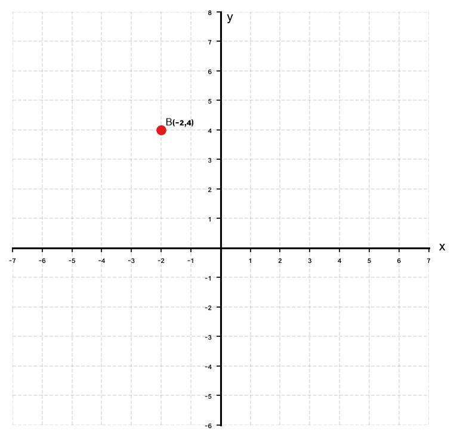

3. סמן את הנקודה
$$C(-3, -1)$$
במערכת הצירים. באיזה רביע היא נמצאת?

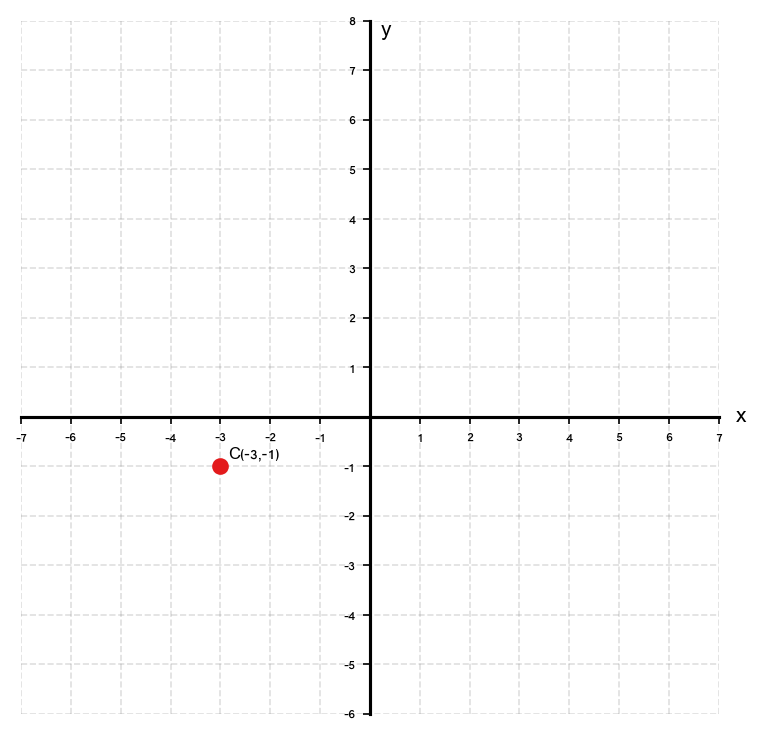

4. סמן את הנקודה
$$D(4, -2)$$
במערכת הצירים. באיזה רביע היא נמצאת?

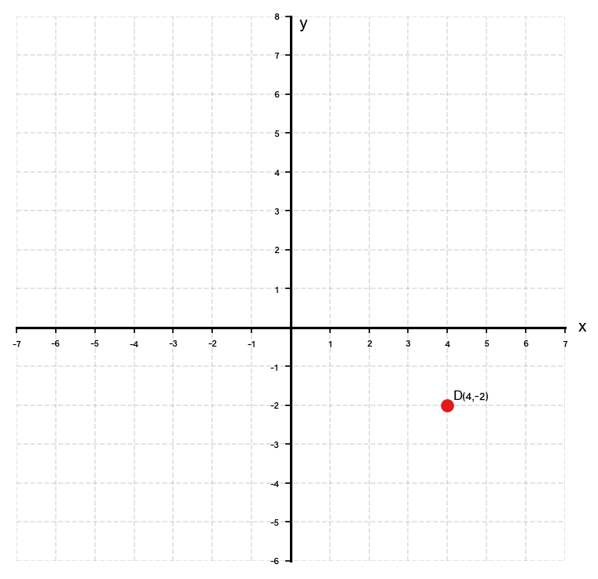

5. הנקודה
$$E(0, 6)$$
נמצאת על ציר Y. כתוב את הקואורדינטות שלה ונסח היכן בדיוק היא ממוקמת.

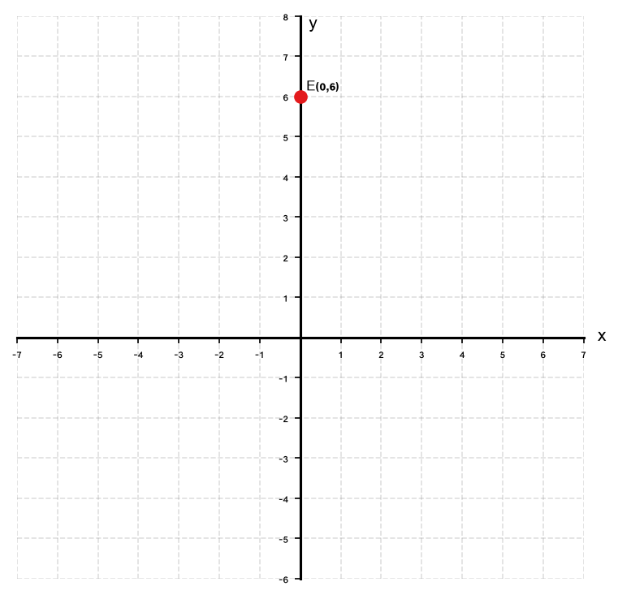

6. קרא את קואורדינטות הנקודות הבאות מהגרף: נקודה הנמצאת ב-3 יחידות ימינה מהראשית ו-4 יחידות מעלה.
כתוב את הנקודה בצורה:
$$(x, y)$$

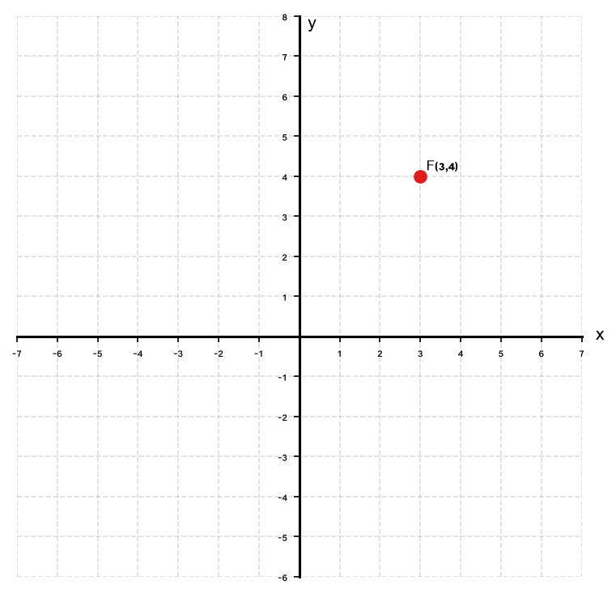

7. הנקודה
$$F(5, 0)$$
נמצאת על ציר X. הסבר מדוע קואורדינטת ה-Y שלה שווה לאפס.

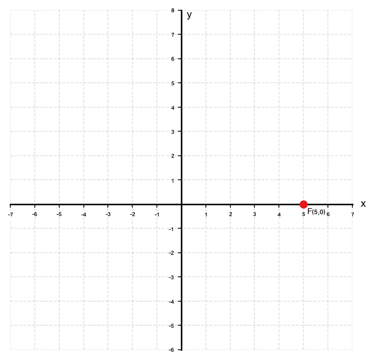

8. כתוב את הקואורדינטות של נקודת הראשית (מרכז מערכת הצירים).

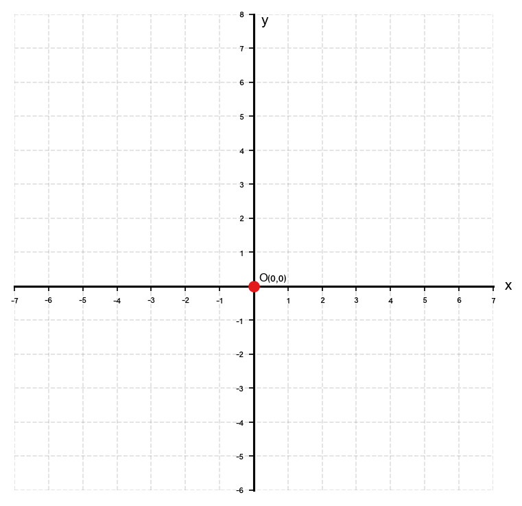

---

## רמה 2: תרגול שוטף ומשולב (תרגילים 9–16)

9. הנקודות
$$P\!\left(-\tfrac{1}{2},\,3\right)$$
ו-
$$Q\!\left(\tfrac{3}{2},\,-1\right)$$
נמצאות במישור. ציין את הרביע של כל אחת.

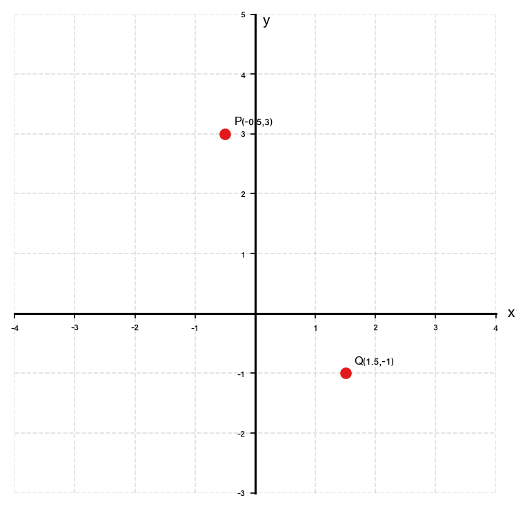

10. נתונות הנקודות
$$A(2, 5)$$
ו-
$$B(2, -3)$$
הן על אותו קו אנכי. חשב את המרחק ביניהן לאורך ציר Y.

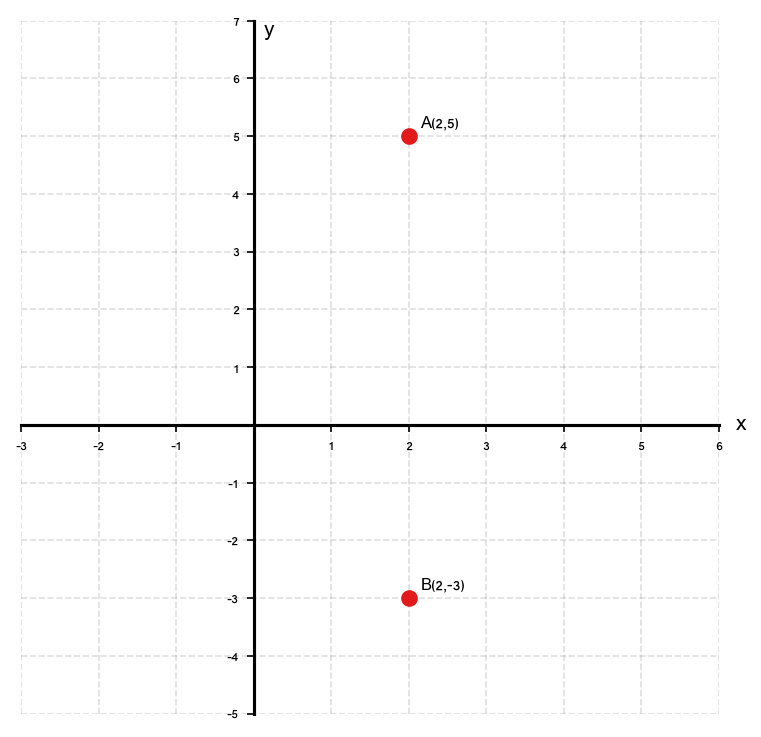

11. נתונות הנקודות
$$C(-4, 1)$$
ו-
$$D(3, 1)$$
הן על אותו קו אופקי. חשב את המרחק ביניהן לאורך ציר X.

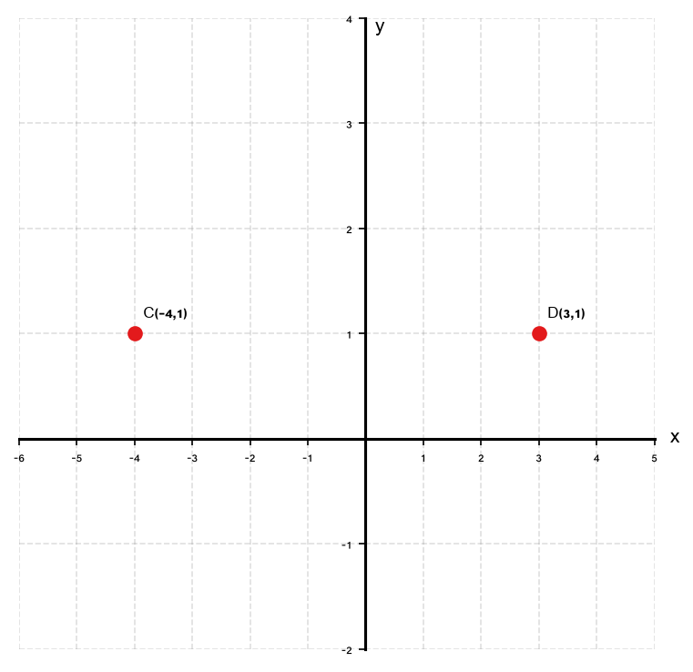

12. נקודה
$$G$$
נמצאת ברביע השלישי. הסבר אילו תנאים מתקיימים על הקואורדינטות שלה ותן דוגמה.

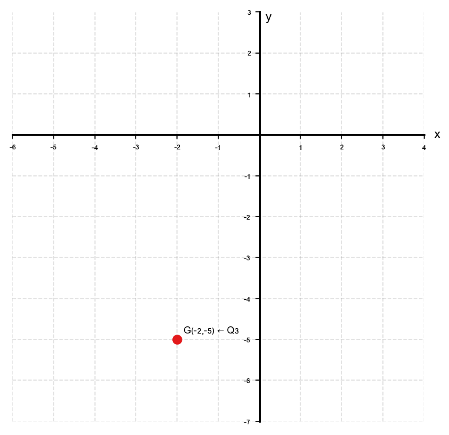

13. נתון כי הנקודה
$$H(a, 3)$$
נמצאת על ציר Y. מה ערכו של
$$a$$
? הסבר.

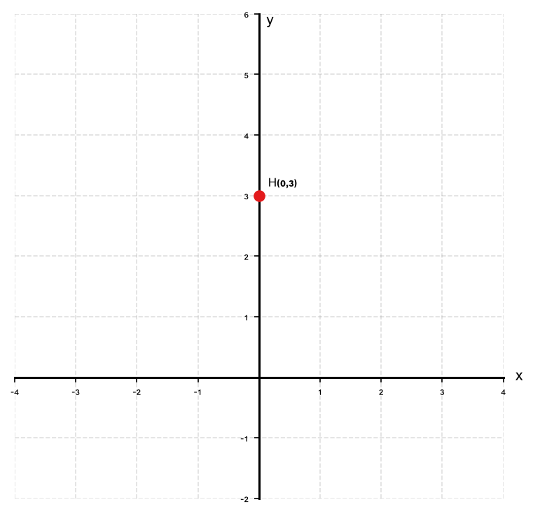

14. נתון כי הנקודה
$$K(5, b)$$
נמצאת על ציר X. מה ערכו של
$$b$$
? הסבר.

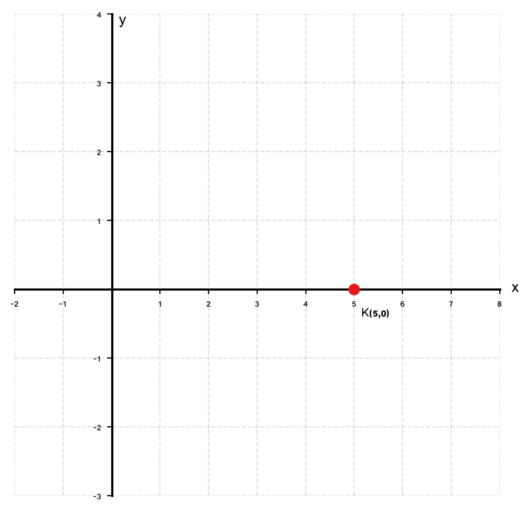

15. נקודה
$$M$$
ממוקמת
$$2.5$$
יחידות שמאלה מהראשית ו-
$$3.5$$
יחידות מטה. כתוב את קואורדינטות
$$M$$
וציין את הרביע שבו היא נמצאת.

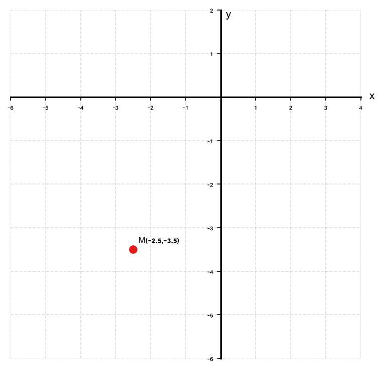

16. נתונות הנקודות
$$A(-3, 0)$$
ו-
$$B(0, -3)$$
. האם שתיהן נמצאות על אותו ציר? הסבר.

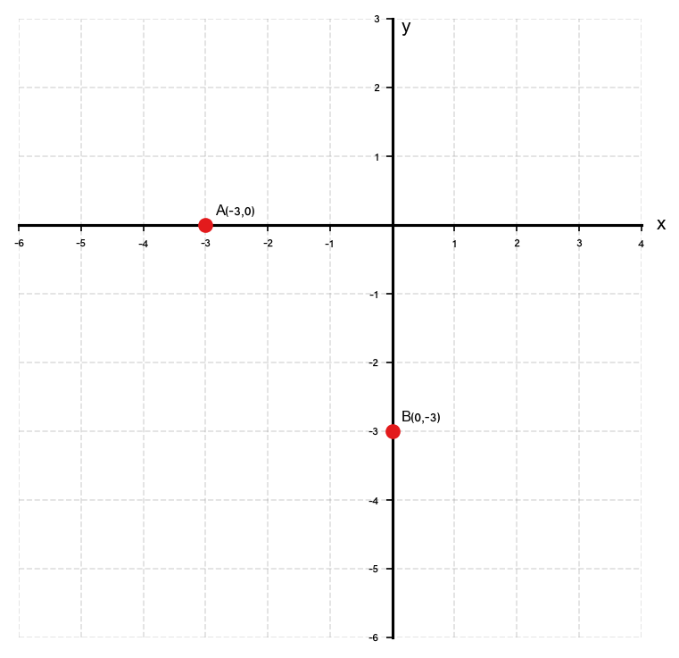

---

## רמה 3: רמת בחינת מה"ט (תרגילים 17–20)

17. אדריכל מתכנן חדר מלבני. הוא ממקם את פינת החדר
$$A$$
בנקודה
$$(-2,\,-1)$$
, פינה
$$B$$
בנקודה
$$(4,\,-1)$$
, ופינה
$$C$$
בנקודה
$$(4,\,3)$$
.

א. מצא את הפינה הרביעית
$$D$$
של המלבן.

ב. חשב את אורך צלע
$$AB$$
ואת אורך צלע
$$BC$$
.

ג. חשב את שטח החדר.

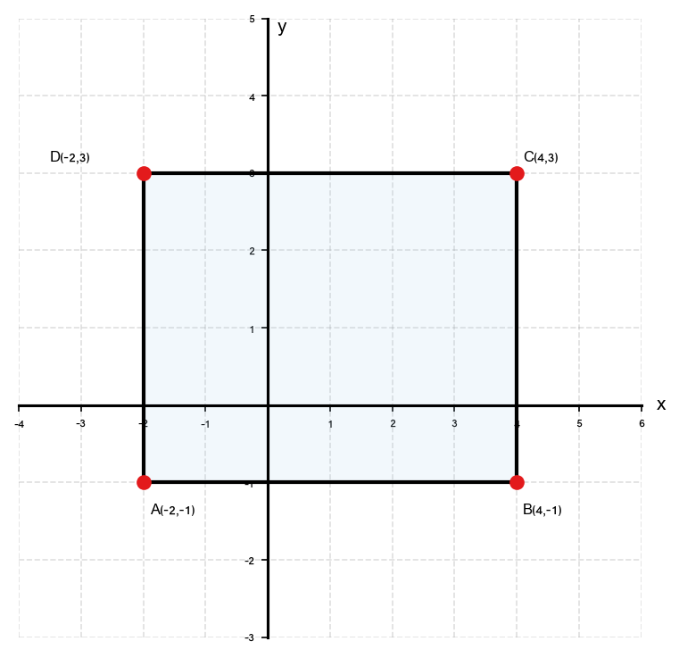

18. במפה מסומנות שלוש תחנות: תחנה
$$A(0,\,6)$$
, תחנה
$$B(8,\,6)$$
, ותחנה
$$C(8,\,0)$$
.

א. ציין את הרביע שבו נמצאת כל תחנה (או על איזה ציר אם רלוונטי).

ב. חשב את המרחק מ-
$$A$$
ל-
$$B$$
.

ג. חשב את המרחק מ-
$$B$$
ל-
$$C$$
.

ד. חשב את אורך המסלול הכולל מ-
$$A$$
ל-
$$B$$
ל-
$$C$$
.

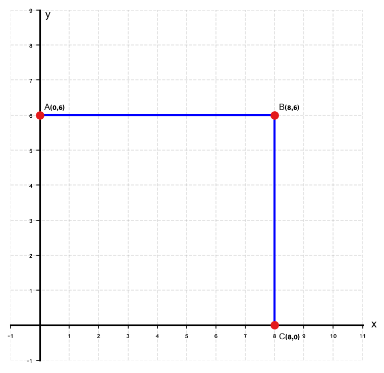

19. נתון מלבן
$$PQRS$$
עם
$$P(-3,\,2)$$
,
$$Q(5,\,2)$$
,
$$R(5,\,-4)$$
.

א. מצא את
$$S$$
.

ב. מצא את נקודת האמצע של האלכסון
$$PR$$
.

ג. מצא את נקודת האמצע של האלכסון
$$QS$$
.

ד. מה מסקנתך?

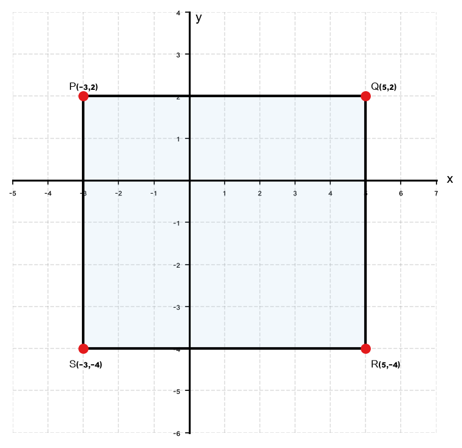

20. ארבע ערים ממוקמות על המפה כך:
$$A(1,\,1)$$
,
$$B(7,\,1)$$
,
$$C(7,\,5)$$
,
$$D(1,\,5)$$
.

א. הוכח שהמרובע
$$ABCD$$
הוא מלבן.

ב. חשב את אורך האלכסון
$$AC$$
.

ג. נקודה
$$E$$
היא אמצע הצלע
$$AB$$
. כתוב את קואורדינטות
$$E$$
.

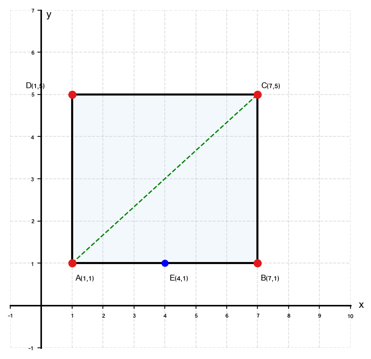

---

תשובות סופיות

1. הנקודה
$A(3,5)$
נמצאת ברביע הראשון (X חיובי, Y חיובי).

2. הנקודה
$B(-2,4)$
נמצאת ברביע השני (X שלילי, Y חיובי).

3. הנקודה
$C(-3,-1)$
נמצאת ברביע השלישי (X שלילי, Y שלילי).

4. הנקודה
$D(4,-2)$
נמצאת ברביע הרביעי (X חיובי, Y שלילי).

5. $(0,6)$
— על ציר Y, 6 יחידות מעל הראשית.

6. $(3, 4)$

7. כל נקודה על ציר X מתוארת ב-
$y=0$
כי היא לא מוזזת למעלה/למטה מהציר האופקי.

8. $(0, 0)$

9.
$P\!\left(-\tfrac{1}{2},3\right)$
— רביע שני;
$Q\!\left(\tfrac{3}{2},-1\right)$
— רביע רביעי.

10. $8$
יחידות.

11. $7$
יחידות.

12. ברביע השלישי:
$x<0$
ו-
$y<0$
. דוגמה:
$(-2,-5)$

13. $a=0$
, כי כל נקודה על ציר Y מקיימת
$x=0$.

14. $b=0$
, כי כל נקודה על ציר X מקיימת
$y=0$.

15. $M(-2.5,\,-3.5)$
— רביע שלישי.

16. לא —
$A(-3,0)$
על ציר X ו-
$B(0,-3)$
על ציר Y. הם על צירים שונים.

17.
א.
$D(-2,3)$
ב.
$AB=6$
,
$BC=4$
ג.
$24$
יחידות רבועות.

18.
א.
$A(0,6)$
— על ציר Y;
$B(8,6)$
— רביע ראשון;
$C(8,0)$
— על ציר X.
ב.
$AB=8$.
ג.
$BC=6$.
ד.
$14$
יחידות.

19.
א.
$S(-3,-4)$
ב.
$(1,-1)$
ג.
$(1,-1)$
ד.
האלכסונים של מלבן חוצים זה את זה — נקודת האמצע שלהם זהה.

20.
א.
מלבן — צלעות נגדיות שוות; כל זוויות ישרות (הצלעות ניצבות).
ב.
$2\sqrt{13}$
ג.
$E=(4,1)$

